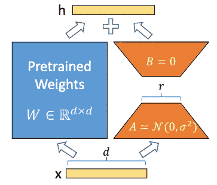
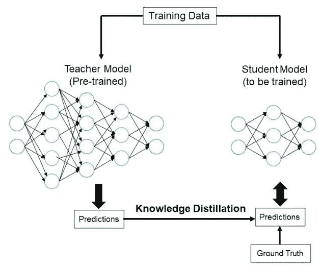
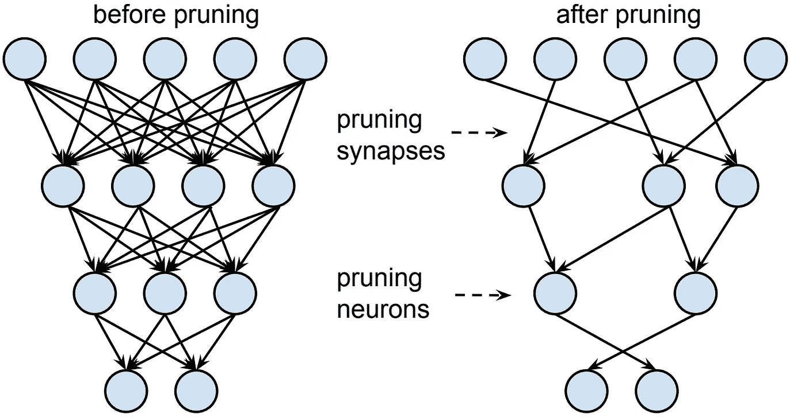

# 高效深度学习：释放模型压缩的力量

> 原文：[`towardsdatascience.com/efficient-deep-learning-unleashing-the-power-of-model-compression-7b5ea37d4d06`](https://towardsdatascience.com/efficient-deep-learning-unleashing-the-power-of-model-compression-7b5ea37d4d06)


图片来源：作者

## 加速生产中的模型推理速度

[](https://medium.com/@marcellopoliti?source=post_page-----7b5ea37d4d06--------------------------------)[](https://towardsdatascience.com/?source=post_page-----7b5ea37d4d06--------------------------------) [Marcello Politi](https://medium.com/@marcellopoliti?source=post_page-----7b5ea37d4d06--------------------------------)

·发表于[Towards Data Science](https://towardsdatascience.com/?source=post_page-----7b5ea37d4d06--------------------------------) ·9 分钟阅读·2023 年 9 月 3 日

--

## 介绍

当机器学习模型投入生产时，通常会有一些在模型原型阶段未考虑的要求。例如，生产中的模型必须处理来自不同用户的大量请求。因此，你需要优化例如延迟和/或吞吐量。

+   **延迟**：是完成任务所需的时间，例如点击链接后加载网页所需的时间。这是从开始某项工作到看到结果的等待时间。

+   **吞吐量**：是系统在一定时间内能够处理的请求数量。

这意味着机器学习模型必须非常快速地进行预测，为此有各种技术可以提高模型推理的速度，让我们在本文中探讨其中最重要的几种。

# 模型压缩

有一些技术旨在使**模型更小**，这就是为什么它们被称为**模型压缩**技术，而其他技术则专注于使模型**推理更快**，因此属于**模型优化**领域。

但通常使模型更小也有助于推理速度，因此这两个研究领域之间的界限非常模糊。

## 低秩分解

这是我们看到的第一种方法，实际上这方面的研究很多，最近有许多相关论文发表。

**基本思想是将神经网络中的矩阵**（代表网络层的矩阵）**替换为具有较低维度的矩阵**，尽管更准确的说法是张量，因为我们常常会有超过 2 维的矩阵。通过这种方式，我们将拥有更少的网络参数和更快的推理速度。

一个简单的例子是在 CNN 网络中用 1x1 卷积替代 3x3 卷积。这样的技术被[ SqueezeNet](https://arxiv.org/abs/1602.07360)等网络使用。

最近，类似的思想被应用于其他目的，例如在资源有限的情况下允许对大型语言模型进行微调。

在对预训练模型进行微调以用于下游任务时，仍需对预训练模型的所有参数进行训练，这可能会非常昂贵。

所以，名为“[大规模语言模型的低秩适应](https://arxiv.org/abs/2106.09685)”或 LoRA 的方法的想法是将原始模型中的矩阵替换为一对对尺寸较小的矩阵（使用矩阵分解）。这样，只有这些新的矩阵需要重新训练，以便将预训练模型调整到更多的下游任务中。



LoRA 中的矩阵分解（来源： https://arxiv.org/pdf/2106.09685.pdf）

现在让我们看看如何使用 Hugging Face 🤗 的[PEFT](https://huggingface.co/docs/peft/index)库来实现微调。

假设我们想使用 LoRA 对`[bigscience/mt0-large](https://huggingface.co/bigscience/mt0-large)`进行微调。我们必须首先处理导入我们需要的内容。

```py
!pip install peft
!pip install transformers
```

```py
 from transformers import AutoModelForSeq2SeqLM
  from peft import get_peft_model, LoraConfig, TaskType

  model_name_or_path = "bigscience/mt0-large"
  tokenizer_name_or_path = "bigscience/mt0-large"
```

下一步将是创建一个 LoRA 配置，以便在微调过程中应用。

```py
peft_config = LoraConfig(
    task_type=TaskType.SEQ_2_SEQ_LM, inference_mode=False, r=8, lora_alpha=32, lora_dropout=0.1
)
```

我们现在使用 Transformers 库的基础模型和我们为 LoRA 创建的配置对象来实例化模型。

```py
model = AutoModelForSeq2SeqLM.from_pretrained(model_name_or_path)
model = get_peft_model(model, peft_config)
model.print_trainable_parameters()
```

## 知识蒸馏

这是另一种方法，它允许我们将一个“小型”且因此速度更快的模型投入生产。

这个方法的核心思想是有一个**称为教师的大型模型**和一个**称为学生的小型模型**，我们将**利用教师的知识来教学生如何进行预测**。这样我们就可以只将学生模型投入生产。



知识蒸馏（来源：[`www.analyticsvidhya.com/blog/2022/01/knowledge-distillation-theory-and-end-to-end-case-study/`](https://www.analyticsvidhya.com/blog/2022/01/knowledge-distillation-theory-and-end-to-end-case-study/)）

以这种方式开发的经典模型示例是[DistillBERT](https://huggingface.co/docs/transformers/model_doc/distilbert)，它是[ BERT](https://arxiv.org/abs/1810.04805)的学生模型。DistilBERT 比 BERT 小 40%，但保留了 97%的语言理解能力，并且在推理时快 60%。

这种方法的一个缺点是，你仍然需要拥有大型教师模型以训练学生，而你可能没有资源训练像教师那样的模型。

让我们看一个 Python 中的知识蒸馏的简单示例。一个关键概念是[KL 散度](https://en.wikipedia.org/wiki/Kullback%E2%80%93Leibler_divergence)，这是一个理解两个分布之间差异的数学概念，实际上在我们的案例中，我们想要了解两个模型的预测之间的差异，因此训练的损失函数将基于这个数学概念。

```py
import tensorflow as tf
from tensorflow.keras import layers, models
from tensorflow.keras.datasets import mnist
from tensorflow.keras.utils import to_categorical
import numpy as np

# Load the MNIST dataset
(train_images, train_labels), (test_images, test_labels) = mnist.load_data()

# Preprocess the data
train_images = train_images.reshape((60000, 28, 28, 1)).astype('float32') / 255
test_images = test_images.reshape((10000, 28, 28, 1)).astype('float32') / 255
train_labels = to_categorical(train_labels)
test_labels = to_categorical(test_labels)

# Define the teacher model (a larger model)
teacher_model = models.Sequential([
    layers.Conv2D(32, (3, 3), activation='relu', input_shape=(28, 28, 1)),
    layers.MaxPooling2D((2, 2)),
    layers.Conv2D(64, (3, 3), activation='relu'),
    layers.MaxPooling2D((2, 2)),
    layers.Conv2D(64, (3, 3), activation='relu'),
    layers.Flatten(),
    layers.Dense(64, activation='relu'),
    layers.Dense(10, activation='softmax')
])

teacher_model.compile(optimizer='adam',
                      loss='categorical_crossentropy',
                      metrics=['accuracy'])

# Train the teacher model
teacher_model.fit(train_images, train_labels, epochs=5, batch_size=64, validation_split=0.2)

# Define the student model (a smaller model)
student_model = models.Sequential([
    layers.Flatten(input_shape=(28, 28, 1)),
    layers.Dense(64, activation='relu'),
    layers.Dense(10, activation='softmax')
])

student_model.compile(optimizer='adam',
                      loss='categorical_crossentropy',
                      metrics=['accuracy'])

# Knowledge distillation step: Transfer knowledge from the teacher to the student
def distillation_loss(y_true, y_pred):
    alpha = 0.1  # Temperature parameter (adjust as needed)
    return tf.keras.losses.KLDivergence()(tf.nn.softmax(y_true / alpha, axis=1),
                                           tf.nn.softmax(y_pred / alpha, axis=1))

# Train the student model using knowledge distillation
student_model.fit(train_images, train_labels, epochs=10, batch_size=64,
                  validation_split=0.2, loss=distillation_loss)

# Evaluate the student model
test_loss, test_acc = student_model.evaluate(test_images, test_labels)
print(f'Test accuracy: {test_acc * 100:.2f}%')
```

## 剪枝

剪枝是一种模型压缩方法，我在研究生论文中研究过这个方法，实际上我之前已经发布了一篇关于如何在 Julia 中实现剪枝的文章：Julia 中的迭代剪枝方法。

剪枝诞生是为了应对决策树中的过拟合，实际上，剪去了分支以减少树的深度。这个概念后来被应用于神经网络中，在其中网络中的边和/或节点被移除（取决于是进行非结构化剪枝还是结构化剪枝）。



神经网络剪枝（来源：`towardsdatascience.com/pruning-neural-networks-1bb3ab5791f9`）

如果我们从网络中移除整个节点，表示层的矩阵会变得更小，模型也会变得更快。

相反，如果我们移除单个边，矩阵的大小将保持不变，但我们会在与被移除的边对应的位置放置零，因此我们将拥有非常稀疏的矩阵。因此，在非结构化剪枝中，优势不在于提高速度，而在于节省内存，因为在内存中保存稀疏矩阵占用的空间比保存密集矩阵少得多。

但我们要剪枝的节点或边是什么呢？最不必要的那些……关于这一点有很多研究，我特别想给你推荐两篇论文：

+   [Optimal Brain Damage](https://citeseerx.ist.psu.edu/document?repid=rep1&type=pdf&doi=17c0a7de3c17d31f79589d245852b57d083d386e)

+   [Optimal Brain Surgeon 和通用网络剪枝](https://ieeexplore.ieee.org/document/298572)

让我们看一个简单的 Python 脚本，了解如何为一个简单的 MNIST 模型实现剪枝。

```py
import tensorflow as tf
from tensorflow.keras.models import Sequential
from tensorflow.keras.layers import Dense
from tensorflow.keras.datasets import mnist
from tensorflow.keras.utils import to_categorical
from tensorflow_model_optimization.sparsity import keras as sparsity
import numpy as np

# Load the MNIST dataset
(train_images, train_labels), (test_images, test_labels) = mnist.load_data()

# Preprocess the data
train_images = train_images.reshape((60000, 28, 28, 1)).astype('float32') / 255
test_images = test_images.reshape((10000, 28, 28, 1)).astype('float32') / 255
train_labels = to_categorical(train_labels)
test_labels = to_categorical(test_labels)

# Create a simple neural network model
def create_model():
    model = Sequential([
        tf.keras.layers.Flatten(input_shape=(28, 28, 1)),
        tf.keras.layers.Dense(128, activation='relu'),
        tf.keras.layers.Dropout(0.2),
        tf.keras.layers.Dense(64, activation='relu'),
        tf.keras.layers.Dropout(0.2),
        tf.keras.layers.Dense(10, activation='softmax')
    ])
    return model

# Create and compile the original model
model = create_model()
model.compile(optimizer='adam',
              loss='categorical_crossentropy',
              metrics=['accuracy'])

# Train the original model
model.fit(train_images, train_labels, epochs=5, batch_size=64, validation_split=0.2)

# Prune the model
# Specify the pruning parameters
pruning_params = {
    'pruning_schedule': sparsity.PolynomialDecay(initial_sparsity=0.50,
                                                 final_sparsity=0.90,
                                                 begin_step=0,
                                                 end_step=2000,
                                                 frequency=100)
}

# Create a pruned model
pruned_model = sparsity.prune_low_magnitude(create_model(), **pruning_params)

# Compile the pruned model
pruned_model.compile(optimizer='adam',
                     loss='categorical_crossentropy',
                     metrics=['accuracy'])

# Train the pruned model (fine-tuning)
pruned_model.fit(train_images, train_labels, epochs=2, batch_size=64, validation_split=0.2)

# Strip pruning wrappers to create a smaller and faster model
final_model = sparsity.strip_pruning(pruned_model)

# Evaluate the final pruned model
test_loss, test_acc = final_model.evaluate(test_images, test_labels)
print(f'Test accuracy after pruning: {test_acc * 100:.2f}%')
```

## 量化

我不认为我说错了，量化可能是目前使用最广泛的压缩技术。再一次，基本概念很简单。**我们通常用 32 位浮点数表示神经网络的参数。但如果我们使用更少的位数呢？我们可以使用 16 位、8 位、4 位，甚至 1 位，甚至可以拥有二进制网络！**

这意味着什么？通过使用较低精度的数字，模型的体积会更小，但也会失去精度，结果会比原始模型更为近似。这是一种在需要将模型部署到边缘设备上时常用的技术，特别是智能手机等特定硬件上，因为它能大幅缩小网络的尺寸。许多框架允许轻松应用量化，例如 [TensorFlow Lite](https://www.tensorflow.org/lite)、[PyTorch](https://pytorch.org/) 或 [TensorRT](https://developer.nvidia.com/tensorrt)。

量化可以在训练前应用，即我们直接截断参数只能取特定范围内的值，或者在训练后应用，即在结束时对参数的值进行四舍五入。

在这里，我们快速展示了如何在 Python 中应用量化。

```py
import tensorflow as tf
from tensorflow.keras.models import Sequential
from tensorflow.keras.layers import Dense, Flatten, Dropout
from tensorflow.keras.datasets import mnist
from tensorflow.keras.utils import to_categorical
import numpy as np

# Load the MNIST dataset
(train_images, train_labels), (test_images, test_labels) = mnist.load_data()

# Preprocess the data
train_images = train_images.reshape((60000, 28, 28, 1)).astype('float32') / 255
test_images = test_images.reshape((10000, 28, 28, 1)).astype('float32') / 255
train_labels = to_categorical(train_labels)
test_labels = to_categorical(test_labels)

# Create a simple neural network model
def create_model():
    model = Sequential([
        Flatten(input_shape=(28, 28, 1)),
        Dense(128, activation='relu'),
        Dropout(0.2),
        Dense(64, activation='relu'),
        Dropout(0.2),
        Dense(10, activation='softmax')
    ])
    return model

# Create and compile the original model
model = create_model()
model.compile(optimizer='adam',
              loss='categorical_crossentropy',
              metrics=['accuracy'])

# Train the original model
model.fit(train_images, train_labels, epochs=5, batch_size=64, validation_split=0.2)

# Quantize the model to 8-bit integers
converter = tf.lite.TFLiteConverter.from_keras_model(model)
converter.optimizations = [tf.lite.Optimize.DEFAULT]
quantized_model = converter.convert()

# Save the quantized model to a file
with open('quantized_model.tflite', 'wb') as f:
    f.write(quantized_model)

# Load the quantized model for inference
interpreter = tf.lite.Interpreter(model_path='quantized_model.tflite')
interpreter.allocate_tensors()

# Evaluate the quantized model
test_loss, test_acc = 0.0, 0.0
for i in range(len(test_images)):
    input_data = np.array([test_images[i]], dtype=np.float32)
    interpreter.set_tensor(interpreter.get_input_details()[0]['index'], input_data)
    interpreter.invoke()
    output_data = interpreter.get_tensor(interpreter.get_output_details()[0]['index'])
    test_loss += tf.keras.losses.categorical_crossentropy(test_labels[i], output_data).numpy()
    test_acc += np.argmax(test_labels[i]) == np.argmax(output_data)

test_loss /= len(test_images)
test_acc /= len(test_images)

print(f'Test accuracy after quantization: {test_acc * 100:.2f}%')
```

# 结论

在本文中，我们探讨了几种模型压缩方法，以加快模型推理阶段，这对于生产环境中的模型可能是一个关键要求。特别地，我们关注了低秩分解、知识蒸馏、剪枝和量化，解释了基本概念，并展示了 Python 中的简单实现。

模型压缩对于在资源有限（如 RAM、GPU 等）的特定硬件上部署模型尤其有用，例如智能手机。

我非常热衷的一个应用案例是使用模型压缩来在卫星和航天器上部署模型，这在地球观测领域尤其有用，例如使卫星能够自主识别需要丢弃的数据或图像，以避免在数据传输到地面段进行分析时产生过多流量。希望这篇文章对你更好地理解这个话题有所帮助。

如果你喜欢这篇文章，请在 Medium 上关注我！😄

💼 [Linkedin](https://www.linkedin.com/in/marcello-politi/) ️| 🐦 [Twitter](https://twitter.com/_March08_) | [💻](https://emojiterra.com/laptop-computer/) [网站](https://marcello-politi.super.site/)
