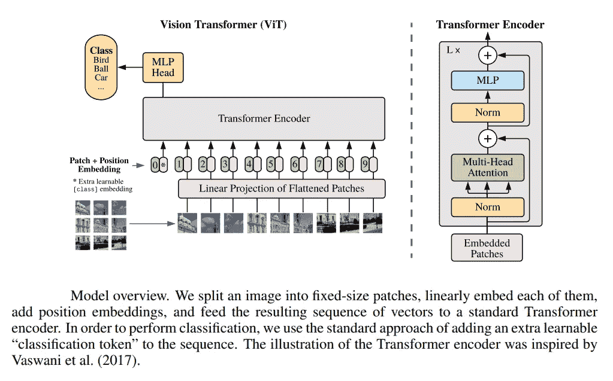

# 使用 PyTorch 高效图像分割：第四部分

> 原文：[`towardsdatascience.com/efficient-image-segmentation-using-pytorch-part-4-6c86da083432?source=collection_archive---------2-----------------------#2023-06-27`](https://towardsdatascience.com/efficient-image-segmentation-using-pytorch-part-4-6c86da083432?source=collection_archive---------2-----------------------#2023-06-27)

## 基于 Vision Transformer 的模型

[](https://medium.com/@dhruvbird?source=post_page-----6c86da083432--------------------------------)[](https://towardsdatascience.com/?source=post_page-----6c86da083432--------------------------------) [Dhruv Matani](https://medium.com/@dhruvbird?source=post_page-----6c86da083432--------------------------------)

·

[关注](https://medium.com/m/signin?actionUrl=https%3A%2F%2Fmedium.com%2F_%2Fsubscribe%2Fuser%2F63f5d5495279&operation=register&redirect=https%3A%2F%2Ftowardsdatascience.com%2Fefficient-image-segmentation-using-pytorch-part-4-6c86da083432&user=Dhruv+Matani&userId=63f5d5495279&source=post_page-63f5d5495279----6c86da083432---------------------post_header-----------) 发布于 [Towards Data Science](https://towardsdatascience.com/?source=post_page-----6c86da083432--------------------------------) ·14 分钟阅读·2023 年 6 月 27 日[](https://medium.com/m/signin?actionUrl=https%3A%2F%2Fmedium.com%2F_%2Fvote%2Ftowards-data-science%2F6c86da083432&operation=register&redirect=https%3A%2F%2Ftowardsdatascience.com%2Fefficient-image-segmentation-using-pytorch-part-4-6c86da083432&user=Dhruv+Matani&userId=63f5d5495279&source=-----6c86da083432---------------------clap_footer-----------)

--

[](https://medium.com/m/signin?actionUrl=https%3A%2F%2Fmedium.com%2F_%2Fbookmark%2Fp%2F6c86da083432&operation=register&redirect=https%3A%2F%2Ftowardsdatascience.com%2Fefficient-image-segmentation-using-pytorch-part-4-6c86da083432&source=-----6c86da083432---------------------bookmark_footer-----------)

在这个四部分的系列中，我们将一步步从头开始使用 PyTorch 中的深度学习技术实现图像分割。这一部分将重点实现基于 Vision Transformer 的图像分割模型。

与 [Naresh Singh](https://medium.com/@brocolishbroxoli) 共同创作


图 1：使用 vision transformer 模型架构进行图像分割的结果。从上到下，输入图像、真实分割掩膜和预测的分割掩膜。来源：作者

# 文章大纲

在本文中，我们将探讨 [变换器架构](https://ai.googleblog.com/2017/08/transformer-novel-neural-network.html)，它在深度学习领域引起了轰动。变换器是一种多模态架构，可以建模语言、视觉和音频等不同模态。

在本文中，我们将

1.  了解变换器架构和涉及的关键概念

1.  了解视觉变换器架构

1.  介绍一个从头开始编写的视觉变换器模型，以便你可以欣赏所有的构建块和活动部分

1.  跟踪输入张量进入此模型并检查其形状如何变化

1.  使用此模型对牛津 IIIT 宠物数据集进行图像分割

1.  观察此分割任务的结果

1.  简要介绍 SegFormer，一个用于语义分割的最新视觉变换器

在本文中，我们将参考此 [笔记本](https://github.com/dhruvbird/ml-notebooks/blob/main/pets_segmentation/vision-transformer-for-oxford-iiit-pet-segmentatio.ipynb)中的代码和结果进行模型训练。如果你希望重现结果，你需要一个 GPU 以确保第一个笔记本能在合理的时间内完成运行。

# 本系列文章

本系列适合所有经验水平的深度学习读者。如果你想了解深度学习和视觉 AI 的实践，同时获得一些扎实的理论和实际经验，你来对地方了！预计这是一个包含四部分的系列，以下是各篇文章：

1.  [概念与想法](https://medium.com/p/89e8297a0923/)

1.  [基于 CNN 的模型](https://medium.com/p/bed68cadd7c7/)

1.  [深度可分离卷积](https://medium.com/p/3534cf04fb89/)

1.  **基于视觉变换器的模型（本文）**

让我们从对变换器架构的介绍和直观理解开始我们的视觉变换器之旅。

# 变换器架构

我们可以将变换器架构看作是交替的*通信*和*计算*层的组合。这个概念在图 2 中以视觉形式展示。变换器有 N 个处理单元（图 2 中的 N 为 3），每个处理单元负责处理输入的 1/N 部分。为了使这些处理单元产生有意义的结果，每个处理单元需要对输入有一个*全局视图*。因此，系统会在每个处理单元与其他所有处理单元之间反复传递数据的信息；这通过从每个处理单元到其他所有处理单元的红色、绿色和蓝色箭头表示。随后基于这些信息进行一些计算。经过足够多次的重复这个过程，模型能够产生期望的结果。


图 2：变换器中的交错通信和计算。图像仅显示了 2 层通信和计算。实际上，还有许多更多这样的层。来源：作者。

值得注意的是，大多数在线资源通常讨论变换器的编码器和解码器，正如标题为 “[Attention is all you need](https://arxiv.org/abs/1706.03762)” 的论文中所展示的。然而，在本文中，我们将只描述变换器的编码器部分。

让我们更详细地看看变换器中的通信和计算是什么。

## 变换器中的通信：注意力

在变换器中，通信是通过一个称为注意力层的层来实现的。在 PyTorch 中，这称为 [MultiHeadAttention](https://pytorch.org/docs/stable/generated/torch.nn.MultiheadAttention.html)。我们稍后会解释这个名称的原因。

文档中写道：

*“允许模型同时关注来自不同表示子空间的信息，如论文中所述：* [*Attention is all you need*](https://arxiv.org/abs/1706.03762)*。”*

注意力机制消耗形状为 (Batch, Length, Features) 的输入张量 *x*，并生成一个形状类似的张量 *y*，使得每个输入的特征根据该张量关注的同一实例中的其他输入进行更新。因此，在“Length”大小的实例中，每个“Features”长度的张量的特征都是基于每个其他张量更新的。这就是注意力机制的二次成本所在。


图 3：单词“it”相对于句子中的其他单词的注意力。我们可以看到，“it”正关注句子中的单词“animal”，“too”和“tire(d)”。来源：使用 [这个 colab](https://colab.research.google.com/github/tensorflow/tensor2tensor/blob/master/tensor2tensor/notebooks/hello_t2t.ipynb) 生成。

在视觉变换器的上下文中，变换器的输入是图像。假设这是一个 128 x 128（宽度，高度）的图像。我们将其切成多个 16 x 16 大小的小块。对于一个 128 x 128 的图像，我们得到 64 个块（长度），每行 8 个块，共 8 行块。

每一个这些 16 x 16 像素大小的 64 个块都被视为变换器模型的一个独立输入。无需深入细节，只需将此过程视为由 64 个不同的处理单元驱动，每个单元处理一个 16x16 的图像块。

在每一轮中，每个处理单元的注意力机制负责查看其负责的图像块，并查询其他剩余的 63 个处理单元，询问它们是否有任何可能相关且有用的信息，以帮助其有效地处理自身的图像块。

注意力机制之后是计算步骤，我们将接下来讨论这个步骤。

## 变换器中的计算：多层感知器

变换器中的计算实际上就是一个多层感知器（MLP）单元。该单元由 2 个线性层组成，中间有一个 GeLU 非线性激活函数。也可以考虑使用其他非线性激活函数。该单元首先将输入投影到 4 倍大小，然后再将其投影回 1 倍，即与输入大小相同。

在我们笔记本中的代码中，这个类叫做 MultiLayerPerceptron。代码如下。

```py
class MultiLayerPerceptron(nn.Sequential):
    def __init__(self, embed_size, dropout):
        super().__init__(
            nn.Linear(embed_size, embed_size * 4),
            nn.GELU(),
            nn.Linear(embed_size * 4, embed_size),
            nn.Dropout(p=dropout),
        )
    # end def
# end class
```

现在我们已经理解了变换器架构的高层次工作原理，让我们将注意力集中在视觉变换器上，因为我们将进行图像分割。

# 视觉变换器

视觉变换器首次在题为“[An Image is Worth 16x16 Words: Transformers for Image Recognition at Scale](https://arxiv.org/abs/2010.11929)”的论文中介绍。该论文讨论了作者如何将原始变换器架构应用于图像分类问题。这是通过将图像拆分为 16x16 的补丁，并将每个补丁视为模型的输入令牌来完成的。变换器编码器模型接收这些输入令牌，并被要求预测输入图像的类别。



图 4：来源：[Transformers for image recognition at scale](https://arxiv.org/pdf/2010.11929.pdf)。

在我们的案例中，我们对图像分割感兴趣。我们可以将其视为像素级分类任务，因为我们打算预测每个像素的目标类别。

我们对原始视觉变换器进行了一个小但重要的更改，将用于分类的 MLP 头替换为用于像素级分类的 MLP 头。我们在输出中有一个线性层，所有的补丁共享这个线性层，其分割掩模由视觉变换器预测。这个共享的线性层为每个输入到模型中的补丁预测一个分割掩模。

在视觉变换器的情况下，16x16 的补丁被视为在特定时间步长的单个输入令牌。


图 5：视觉变换器在图像分割中的端到端工作。图像使用这个[notebook](https://github.com/dhruvbird/ml-notebooks/blob/main/pets_segmentation/Vision%20Transformer%20Article%20Images.ipynb)生成。来源：作者。

## 为视觉变换器中的张量维度建立直觉

当处理深度 CNN 时，我们大多数使用的张量维度是（N, C H, W），其中字母代表以下含义：

+   N: 批次大小

+   C: 通道数

+   H: 高度

+   W: 宽度

你可以看到这个格式是针对 2D 图像处理的，因为它包含了非常特定于图像的特征。

另一方面，使用变换器时，事情变得更加通用和与领域无关。以下所述适用于视觉、文本、NLP、音频或其他可以表示为序列的输入数据的问题。值得注意的是，在张量通过视觉变换器流动时，表示方式几乎没有特定于视觉的偏差。

在处理变换器和注意力机制时，我们期望张量具有以下形状：（B, T, C），其中字母代表以下含义：

+   B：批量大小（与 CNN 相同）

+   T：时间维度或序列长度。这个维度有时也被称为 L。在视觉变换器的情况下，每个图像块对应于此维度。如果我们有 16 个图像块，那么 T 维度的值将是 16。

+   C：通道或嵌入大小维度。这个维度有时也被称为 E。在处理图像时，每个 3x16x16（通道，宽度，高度）大小的图像块通过嵌入层映射到大小为 C 的嵌入。我们稍后将看到这是如何完成的。

让我们深入探讨输入图像张量如何在预测分割掩膜的过程中发生变化和处理。

## 视觉变换器中张量的传递过程

在深度卷积神经网络中，张量的传递过程大致如下（在 UNet、SegNet 或其他基于 CNN 的架构中）。

输入张量的形状通常为 (1, 3, 128, 128)。该张量经过一系列卷积和最大池化操作，其中空间维度被缩小，通道维度则通常增加 2 倍。这称为特征编码器。之后，我们进行反向操作，增加空间维度并减少通道维度。这称为特征解码器。解码过程后，我们得到形状为 (1, 64, 128, 128) 的张量。然后，使用无偏置的 1x1 点卷积将其投影到我们期望的输出通道数量 C，即 (1, C, 128, 128)。


图 6：用于图像分割的深度 CNN 中张量形状的典型演变过程。来源：作者。

在视觉变换器中，流程要复杂得多。让我们先看下面的图像，然后尝试理解张量在每一步的形状如何变化。


图 7：用于图像分割的视觉变换器中张量形状的典型演变过程。来源：作者。

让我们详细查看每一步，并观察它如何更新通过视觉变换器的张量形状。为了更好地理解这一点，我们将张量的维度设置为具体的值。

1.  **批量归一化：** 输入和输出张量的形状为 (1, 3, 128, 128)。形状保持不变，但值被标准化为零均值和单位方差。

1.  **图像到补丁：** 形状为（1, 3, 128, 128）的输入张量被转换成堆叠的 16x16 图像补丁。输出张量的形状为（1, 64, 768）。

1.  **补丁嵌入：** 补丁嵌入层将 768 个输入通道映射到 512 个嵌入通道（以此示例为例）。输出张量的形状为（1, 64, 512）。补丁嵌入层基本上只是 PyTorch 中的一个 nn.Linear 层。

1.  **位置嵌入：** 位置嵌入层没有输入张量，但有效地贡献了一个可学习的参数（PyTorch 中的可训练张量），其形状与补丁嵌入相同。形状为（1, 64, 512）。

1.  **添加：** 补丁和位置嵌入逐个相加以产生视觉变换器编码器的输入。这个张量的形状为（1, 64, 512）。你会注意到，视觉变换器的主要工作单元，即编码器，基本上保持了这个张量形状不变。

1.  **变换器编码器：** 形状为（1, 64, 512）的输入张量流经多个变换器编码器块，每个块具有多个注意力头（通信）后跟一个 MLP 层（计算）。张量的形状保持不变为（1, 64, 512）。

1.  **线性输出投影：** 如果我们假设我们想将每个图像分割成 10 个类别，那么我们需要每个 16x16 大小的补丁具有 10 个通道。输出投影的 nn.Linear 层现在将 512 个嵌入通道转换为 16x16x10 = 2560 个输出通道，这个张量的形状将是（1, 64, 2560）。在上面的图中，C’ = 10。理想情况下，这将是一个多层感知机，因为*“*[*MLPs are universal function approximators*](https://en.wikipedia.org/wiki/Multilayer_perceptron)*”*，但由于这是一个教育练习，我们使用了一个单一的线性层。

1.  **补丁到图像：** 这一层将编码为（1, 64, 2560）张量的 64 个补丁转换回看起来像分割掩码的东西。这可以是 10 个单通道图像，或者在这种情况下是一个单一的 10 通道图像，每个通道都是 10 个类别中的一个类别的分割掩码。输出张量的形状为（1, 10, 128, 128）。

就这样——我们已经成功地使用视觉变换器对输入图像进行了分割！接下来，让我们看一下实验及其结果。

## 视觉变换器的实际应用

这个[笔记本](https://github.com/dhruvbird/ml-notebooks/blob/main/pets_segmentation/vision-transformer-for-oxford-iiit-pet-segmentatio.ipynb)包含了本节的所有代码。

就代码和类结构而言，它紧密地模拟了上面的框图。上述提到的大部分概念与这个[笔记本](https://github.com/dhruvbird/ml-notebooks/blob/main/pets_segmentation/vision-transformer-for-oxford-iiit-pet-segmentatio.ipynb)中的类名有 1:1 的对应关系。

有一些与注意力层相关的概念，这些概念是我们模型的关键超参数。我们没有提及多头注意力的详细信息，因为我们提到它超出了本文的范围。如果你对 Transformers 中的注意力机制没有基本了解，我们强烈建议在继续之前阅读上述参考材料。

我们为视觉 Transformer 分割使用了以下模型参数。

1.  PatchEmbedding 层的嵌入维度为 768

1.  12 个 Transformer 编码器块

1.  每个 Transformer 编码器块中有 8 个注意力头

1.  在多头注意力和 MLP 中使用 20% 的 dropout

这个配置可以在 VisionTransformerArgs Python 数据类中看到。

```py
@dataclass
class VisionTransformerArgs:
    """Arguments to the VisionTransformerForSegmentation."""
    image_size: int = 128
    patch_size: int = 16
    in_channels: int = 3
    out_channels: int = 3
    embed_size: int = 768
    num_blocks: int = 12
    num_heads: int = 8
    dropout: float = 0.2
# end class
```

在模型训练和验证过程中使用了与 [之前](https://medium.com/p/bed68cadd7c7/) 类似的配置。配置详见下文。

1.  对训练集应用 *随机水平翻转* 和 *颜色抖动* 数据增强以防止过拟合

1.  图像在非保持宽高比的调整操作中被调整为 128x128 像素

1.  图像未应用输入归一化 —— 而是使用了 作为模型第一层的批归一化层

1.  模型使用 Adam 优化器进行 50 次训练周期，学习率为 0.0004，并使用 StepLR 调度器，每 12 个周期将学习率衰减 0.8 倍

1.  交叉熵损失函数用于将像素分类为宠物、背景或宠物边界

模型有 8628 万个参数，并在 50 次训练周期后达到了 85.89% 的验证准确率。这低于深度 CNN 模型在 20 次训练周期后达到的 88.28% 的准确率。这可能由于一些需要实验验证的因素。

1.  最后的输出投影层是单个 nn.Linear，而不是多层感知机。

1.  16x16 的补丁大小太大，无法捕捉更多细粒度的细节

1.  训练周期不足

1.  训练数据不足 —— 众所周知，Transformer 模型相比于深度 CNN 模型需要更多的数据才能有效训练

1.  学习率过低

我们绘制了一个 gif，展示了模型如何学习预测验证集中的 21 张图像的分割掩码。


图 8：一个 gif 展示了视觉 Transformer 对图像分割模型预测的分割掩码的进展。来源：作者。

我们在早期训练轮次中注意到了一些有趣的现象。预测的分割掩码出现了一些奇怪的块状伪影。我们能想到的唯一原因是因为我们将图像分解为大小为 16x16 的图块，而在训练了很少的轮次后，模型还没有学到除了关于这个 16x16 图块是否通常被宠物或背景像素覆盖的非常粗糙的信息之外的任何有用知识。


图 9：使用视觉变换器进行图像分割时，预测的分割掩码中看到的块状伪影。来源：作者。

现在我们已经看到一个基本的视觉变换器在实际应用中，让我们将注意力转向用于分割任务的最先进视觉变换器。

## SegFormer：基于变换器的语义分割

SegFormer 架构在 [这篇论文](https://arxiv.org/pdf/2105.15203.pdf) 中于 2021 年提出。我们看到的变换器是 SegFormer 架构的简化版本。


图 10：SegFormer 架构。来源：[SegFormer 论文 (2021)](https://arxiv.org/pdf/2105.15203.pdf)。

最值得注意的是，SegFormer：

1.  生成 4 组图像，图块大小分别为 4x4、8x8、16x16 和 32x32，而不是生成单一图块大小为 16x16 的图像。

1.  使用了 4 个变换器编码块，而不仅仅是 1 个。这感觉像是模型集成。

1.  在自注意力的前期和后期阶段使用卷积。

1.  不使用位置嵌入

1.  每个变换器块处理图像的空间分辨率为 H/4 x W/4、H/8 x W/8、H/16 x W/16 和 H/32 x W/32。

1.  类似地，当空间维度减少时，通道数会增加。这与深度 CNN 类似。

1.  在解码器中，将多个空间维度的预测结果上采样并合并在一起。

1.  MLP 将所有这些预测结合起来，提供最终预测。

1.  最终预测位于空间维度 H/4，W/4，而不是 H，W。

# 结论

在本系列的第四部分中，我们介绍了变换器架构，特别是视觉变换器。我们对视觉变换器如何工作有了直观的理解，并了解了视觉变换器通信和计算阶段的基本构建块。我们看到了视觉变换器采用的独特图块方法，用于预测分割掩码，然后将预测结果结合在一起。

我们回顾了一项实验，展示了视觉变换器的实际应用，并能够将结果与深度 CNN 方法进行比较。虽然我们的视觉变换器不是最先进的，但它能够取得相当不错的结果。我们简要介绍了如 SegFormer 等最先进的方法。

现在应该很清楚，相比于基于深度 CNN 的方法，transformers 具有更多的活动部分且更复杂。从原始的 FLOPs 角度来看，transformers 有可能更高效。在 transformers 中，唯一真正计算密集的层是 nn.Linear。大多数架构使用优化的矩阵乘法来实现这一点。由于这种架构上的简单性，transformers 有可能比基于深度 CNN 的方法更容易优化和加速。

恭喜你读到这里！我们很高兴你喜欢阅读这一系列关于 PyTorch 高效图像分割的文章。如果你有问题或评论，请随时在评论区留言。

# 进一步阅读

注意力机制的详细信息超出了本文的范围。此外，您可以参考许多高质量的资源以深入了解注意力机制。以下是我们强烈推荐的一些资源。

1.  [插图版 Transformer](http://jalammar.github.io/illustrated-transformer/)

1.  [从零开始使用 PyTorch 实现 NanoGPT](https://www.youtube.com/watch?v=kCc8FmEb1nY)

我们将在下面提供更多关于 vision transformers 的文章链接。

1.  在 PyTorch 中实现 Vision Transformer (ViT)：这篇文章详细介绍了在 PyTorch 中实现用于图像分类的 vision transformer。值得注意的是，他们的实现使用了 [einops](https://einops.rocks/)，但我们避免使用，因为这是一个以教育为重点的练习（不过我们建议您学习和使用 einops 以提高代码的可读性）。我们则使用原生 PyTorch 操作符来排列和重排张量维度。此外，作者在一些地方使用了 Conv2d 替代 Linear 层。我们希望在完全不使用卷积层的情况下构建 vision transformers 的实现。

1.  [Vision Transformer: AI Summer](https://theaisummer.com/vision-transformer/)

1.  在 PyTorch 中实现 SegFormer
