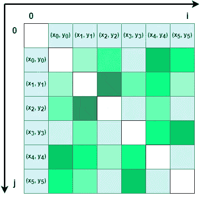
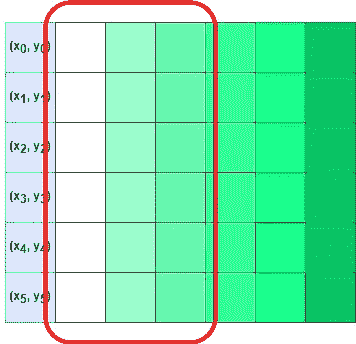
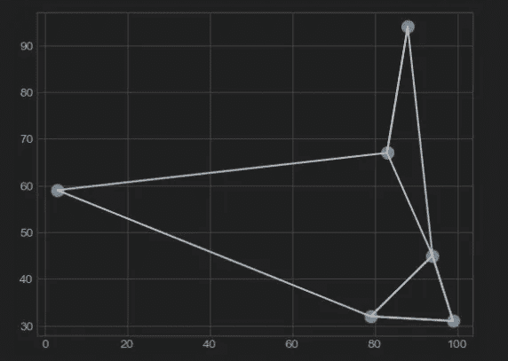
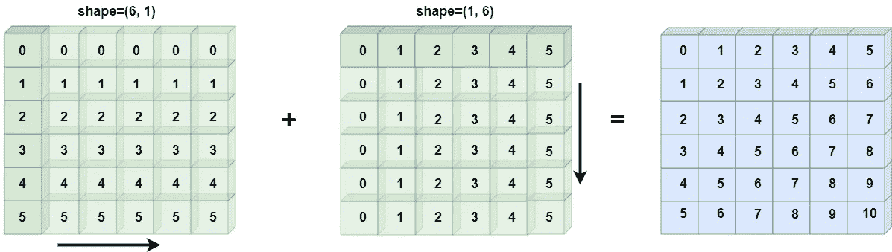
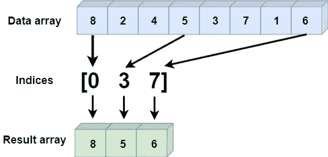
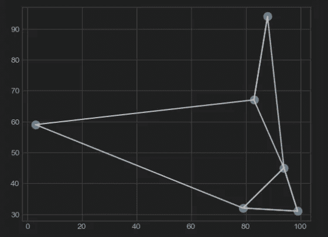
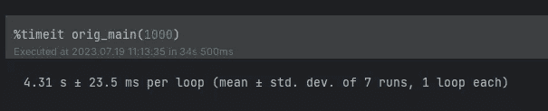
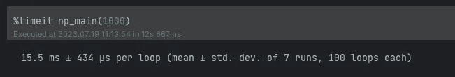

# 使用 NumPy 实现高效的 k-近邻（k-NN）解决方案

> 原文：[`towardsdatascience.com/efficient-k-nearest-neighbors-k-nn-solutions-with-numpy-58cbac2a0971`](https://towardsdatascience.com/efficient-k-nearest-neighbors-k-nn-solutions-with-numpy-58cbac2a0971)

## [快速计算](https://medium.com/@qtalen/list/fast-computing-2a37a7e82be5)

## 利用 NumPy 的广播、花式索引和排序进行性能计算

[](https://qtalen.medium.com/?source=post_page-----58cbac2a0971--------------------------------)[](https://towardsdatascience.com/?source=post_page-----58cbac2a0971--------------------------------) [Peng Qian](https://qtalen.medium.com/?source=post_page-----58cbac2a0971--------------------------------)

·发布在[数据科学前沿](https://towardsdatascience.com/?source=post_page-----58cbac2a0971--------------------------------) ·阅读时间 9 分钟·2023 年 7 月 20 日

--


图片来源：作者创建，[Canva](https://www.canva.com/)

# 介绍

我有一个朋友是一名城市规划师。一天，他被要求重新评估城市中成千上万的加油站的位置适宜性，需要找出每个加油站的 k 个最近加油站的位置。

我们如何在很短的时间内找到最近的 k 个加油站？这是 k-近邻问题的一个实际应用场景。

因此，他来找我寻求帮助，希望我能提供一个高性能的解决方案。

所以我写下了这篇文章，它将指导你如何使用 NumPy 高效解决 k-近邻问题。通过与 Python 迭代解决方案进行比较，我们将展示 NumPy 的强大性能。

在本文中，我们将**深入探讨**利用高级 NumPy 特性，如广播、花式索引和排序，来实现高性能的 k-近邻算法。

阅读本文后，你将能够：

+   了解 k-近邻问题及其实际应用场景

+   学习如何使用 NumPy 库解决 k-近邻问题

+   深入理解 NumPy 广播、花式索引和排序等特性在算法中的作用

+   比较 NumPy 与 Python 迭代解决方案的性能，探索为什么 NumPy 更优

让我们一起**深入探讨**NumPy 的高性能世界，探索如何仅使用 NumPy 更快、更有效地解决 k-近邻问题。

# k-NN 问题的几何原理

从几何角度回顾我朋友面临的加油站问题。

假设我们将所有的加油站放置在二维平面上，加油站之间的距离实际上是平面上两个点之间的欧几里得距离。解决公式如下：

由作者创建，[Embed Fun](https://math.embed.fun/rRSmbcSLxxXy6eWM6c4jA5)

但是，任意两个点之间的距离应该如何计算呢？

我们可以将二维平面想象成一个棋盘，将加油站简化为六个，并将这六个点依次排列在棋盘的水平和垂直边缘，如图所示：



在棋盘上排列这六个点。图像由作者提供

然后，任意两个点的延伸线相交的网格可以表示这两个点之间的距离。当`i=j`时，这两个点是相同的，距离应该是 0。

假设这里的`k=2`，我们只需将每个点到其他点的距离按升序排序，然后取出前三个距离（包括自身），这些点就是离这个点最近的两个点。



排序后，我们可以得到彼此最接近的 3 个点。图像由作者提供

# 传统的 Python 迭代解决方案

作为性能基准，我们先来看传统的 Python 迭代解决方案。

这个解决方案的思路相对简单：

1.  计算坐标点自身与列表中其他坐标点之间的欧几里得距离。

1.  然后比较当前点与其他点之间的距离。

1.  选择满足要求的前 `k` 个点。

接下来是代码部分。

首先，我们随机生成六个坐标点。由于稍后将使用相同的坐标进行比较，因此我们需要为`random`包添加一个`seed`。

```py
import random
import matplotlib.pyplot as plt

%matplotlib inline
plt.style.use('seaborn-v0_8-whitegrid')
random.seed(5)

def generate_points(n: int=6) -> list[tuple]:
    points = []
    for i in range(n):
        points.append((random.randint(0, 100), random.randint(0, 100)))
    return points
```

接下来，开始计算每个点到列表中所有点（包括自身）的距离，这需要两个迭代。

```py
def calc_dist(points: list[tuple]) -> list[list]:
    result = []
    for i, left in enumerate(points):
        row = [left]
        for j, right in enumerate(points):
            dist = (left[0] - right[0])**2 + (left[1] - right[1])**2
            row.append(dist)
        result.append(row)
    return result
```

然后，对每个点与其他点之间的距离进行排序，并在原始列表中找到与距离对应的点的索引。

```py
def find_sorted_index(with_dist: list[list]) -> list[list]:
    results = []
    for row in with_dist:
        dists = row[1:]
        sorted_dists = sorted(dists)
        indices = [dists.index(i) for i in sorted_dists]
        row[1:] = indices
        results.append(row)
    return results
```

最终返回应该是一个二维数组，其中数组的每一行的第一个项目是当前点，其他项目是排序后每个点在列表中的索引。

最后，我们根据索引在原始坐标列表中找到每个符合条件的点。

```py
def find_k_nearest(points: list[tuple], with_indices: list[list], k: int) -> list[tuple]:
    results = []
    for row in with_indices:
        # Since the closest point to the current point is itself, we can get the point itself directly, so here is +2
        k_indices = row[1:k+2]
        the_points = [points[i] for i in k_indices]
        results.append(the_points)
    return results
```

结果是一个二维数组，数组的每一行是当前点及其他两个最近的点。

为了方便评估结果，我们使用`Matplotlib`绘制所有坐标点以及从每个坐标到两个最近坐标的线条。

```py
def draw_points(points: list[tuple]):
    x, y = [], []
    for point in points:
        x.append(point[0])
        y.append(point[1])
    plt.scatter(x, y, s=100)

def draw_lines(nearest: list[list]):
    for row in nearest:
        start = row[0]
        for end in row[1:]:
            plt.plot([start[0], end[0]], [start[1], end[1]], color='black')

def orig_main(count: int = 6):
    k = 2
    points = generate_points(count)
    with_dist = calc_dist(points)
    sorted_index = find_sorted_index(with_dist)
    nearest = find_k_nearest(points, sorted_index, k)
    return points, nearest

points, nearest =  orig_main(6)
draw_points(points)
draw_lines(nearest)
```

结果如下：



传统的 Python 迭代解决方案。图像由作者提供

如你所见，图表上出现了六个坐标和相应的线条。

这个图表将作为基准，并将与稍后使用 NumPy 的结果进行比较，以确认算法的正确性。

# 使用 NumPy 解法的基础知识

接下来，让我们看看如何使用 NumPy 来解决这个问题。

在编写代码之前，我们需要对 NumPy 的一些基本概念进行预热。

## 广播

由于涉及将一组坐标点水平放置（`shape=(1, 6)`）和垂直放置（`shape=(6, 1)`），并形成一个 (6, 6) 的矩阵。

在计算距离之后，涉及两个不同大小数组之间的操作，因此我们需要使用 NumPy 的广播机制。

这里是一个例子：

```py
In:    a = np.arange(6).reshape(1, 6)
       b = np.arange(6).reshape(6, 1)
       a + b
Out:   [[ 0  1  2  3  4  5]
        [ 1  2  3  4  5  6]
        [ 2  3  4  5  6  7]
        [ 3  4  5  6  7  8]
        [ 4  5  6  7  8  9]
        [ 5  6  7  8  9 10]]
```

如你所见，当 (1, 6) 的数组和 (6, 1) 的数组相加时，结果的形状是 (6, 6)。

关于具体的原理，请参阅 [官方文档](https://numpy.org/doc/stable/user/basics.broadcasting.html)。示意图如下：



广播如何工作。图像由作者提供

## 排序

在解决了任意两个点之间的距离之后，我们还需要对这些距离进行排序。

就像 Python 标准库中的 `sort()` 函数一样，NumPy 也有一个排序函数：`np.sort()`。另外，`ndarray.sort()` 函数也可以用于排序。

由于我们在对距离进行排序，因此还需要在排序后找到每个项目在原始数组中的索引。在 NumPy 中，我们可以使用 `np.argsort()` 来获取：

```py
In:  x = np.array([2, 1, 4, 3, 5])
     i = np.argsort(x)
     print(i)
Out: [1 0 3 2 4]
```

当然，我们只需要关注 k 最近的点，不需要知道距离的顺序。

因此，我们可以使用 NumPy 的 `[argpartition()](https://numpy.org/doc/stable/reference/generated/numpy.argpartition.html)` API，它可以在不排序的情况下返回最小几个点的索引，这样性能会更好。

## 花式索引

在传统的 Python 列表中，如果我们想通过索引查找一组数据，我们需要分别遍历数据列表和索引列表，这样性能非常差。

但 NumPy 提供了花式索引，以快速查找与索引对应的数据。这里是一个例子：

```py
In:  x = np.array([8, 2, 4, 5, 3, 7, 1, 6])
     ind = [0, 3, 7]
     print(x[ind])
Out: [8 5 6]
```



花式索引可以快速查找与索引数组对应的数据。图像由作者提供

由于花式索引是一组整数数组，因此有一个规则需要遵循：

索引的数据反映了广播索引数组的形状，与数据数组的形状无关。

# NumPy 解法

在了解了 NumPy 的一些基础知识之后，让我们看看如何使用 NumPy 解决 k-NN 问题。

由于我们在这里使用一组坐标点来形成一个数组，我们需要使用 NumPy 的 [structured_array](https://numpy.org/doc/stable/user/basics.rec.html)：

```py
import numpy as np
from numpy import ndarray

random.seed(5)

def structured_array(points: list[tuple]) -> ndarray:
    dt = np.dtype([('x', 'int'), ('y', 'int')])
    return np.array(points, dtype=dt)
```

接下来，在水平和垂直方向上向原始的一维数组添加一个额外的维度，将其转变为二维棋盘的两个边：

然后使用广播机制来计算每个点之间的距离。

最终，得到一个 (6, 6) 的二维数组：

```py
def np_find_dist(s_array: ndarray) -> ndarray:
    a = s_array.reshape(6, 1)
    b = s_array.reshape(1, 6)
    dist = (a['x'] - b['x'])**2 + (a['y'] - b['y'])**2
    return dist
```

然后，使用`argpartition`方法找出每一行中距离最小的两个点的索引：

```py
def np_k_nearest(dist: ndarray, k: int) -> ndarray:
    k_indices = np.argpartition(dist, k+1, axis=1)[:, :k+1]
    return k_indices
```

我们仍需要两个`Matplotlib`绘图方法来评估结果的正确性：

```py
def np_draw_points(s_array: ndarray):
    plt.scatter(s_array['x'], s_array['y'], s=100)

def np_draw_lines(s_array: ndarray, k_indices: ndarray, k: int):
    for i in range(s_array.shape[0]):
        for j in k_indices[i, :k+1]:
            plt.plot([s_array[i]['x'], s_array[j]['x']],
                     [s_array[i]['y'], s_array[j]['y']],
                     color='black')
```

最后，编写一个主方法将所有代码整合在一起：

```py
def np_main(count: int = 6):
    k = 2
    points = generate_points(count)
    s_array = structured_array(points)
    np_dist = np_find_dist(s_array)
    k_indices = np_k_nearest(np_dist, k)

    results = [s_array[k_indices[i, :k+1]] 
               for i in range(s_array.shape[0])]
    return results, s_array, k_indices, k

results, s_array, k_indices, k = np_main(6)
np_draw_points(s_array)
np_draw_lines(s_array, k_indices, k)
```

仅从代码来看，它已经比 Python 迭代版本简洁得多。接下来，我们用图表比较结果：



NumPy 解决方案的 k-NN 结果。图片由作者提供

看，结果完全相同！

# 两种解决方案的性能比较

最后，我们来比较这两种解决方案的执行性能。这里我们仍然使用`%timeit`进行评估。

首先是 Python 迭代方法。让我们看看扩展到 1,000 个坐标需要多长时间：



Python 迭代解决方案的执行时间。图片由作者提供

然后是 NumPy 实现。看看 1,000 个坐标需要多长时间：



NumPy 解决方案的执行时间。图片由作者提供

惊讶吧？性能提高了数百倍，所以我的朋友不必担心计算不了。

# 结论

本文教会了我们如何使用 NumPy 的广播、花式索引和排序来高效解决 k 最近邻问题。

我们还比较了 NumPy 与 Python 迭代解决方案的性能，并深入理解了为什么 NumPy 在解决这类问题时表现更好。

总结一下，我们学到了以下内容：

+   k 最近邻问题的定义及实际应用场景

+   如何使用 NumPy 库解决 k 最近邻问题

+   NumPy 的广播、花式索引、排序及其他特性在算法实现中的应用

+   NumPy 与 Python 暴力解决方案的性能比较分析

虽然本文提供了一种高效的 k 最近邻解决方案，但这只是一个起点。

在未来的文章中，我将使用高级算法和数据结构重新解释这个问题的解决方案，展示更多高效且可用的算法技巧。

敬请关注未来的文章。如果你对本文感兴趣，欢迎评论，我会逐一回复。

让我从基础开始，带你了解工作中的最佳科学计算实践。


[Peng Qian](https://qtalen.medium.com/?source=post_page-----58cbac2a0971--------------------------------)

## 快速计算

[查看列表](https://qtalen.medium.com/list/fast-computing-2a37a7e82be5?source=post_page-----58cbac2a0971--------------------------------)4 篇故事！如何用 Numexpr 优化多维 Numpy 数组操作。[](https://medium.com/@qtalen/membership?source=post_page-----58cbac2a0971--------------------------------) [## 通过我的推荐链接加入 Medium - 彭倩

### 作为 Medium 会员，你的会员费的一部分将直接支持你阅读的作者，并且你可以完全访问每一篇故事……

medium.com](https://medium.com/@qtalen/membership?source=post_page-----58cbac2a0971--------------------------------)

这篇文章最初发布在：[`www.dataleadsfuture.com/efficient-k-nearest-neighbors-k-nn-solutions-with-numpy/`](https://www.dataleadsfuture.com/efficient-k-nearest-neighbors-k-nn-solutions-with-numpy/)
