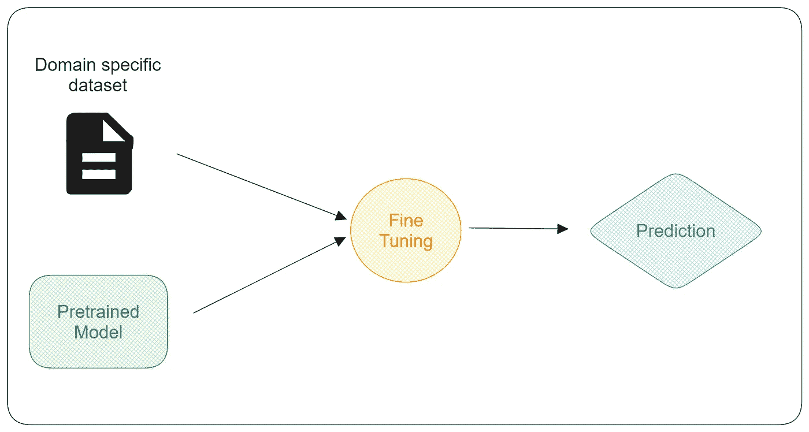
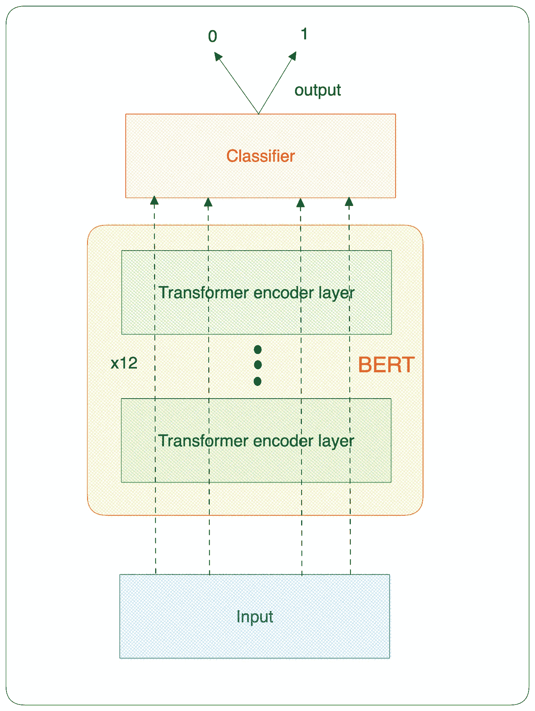
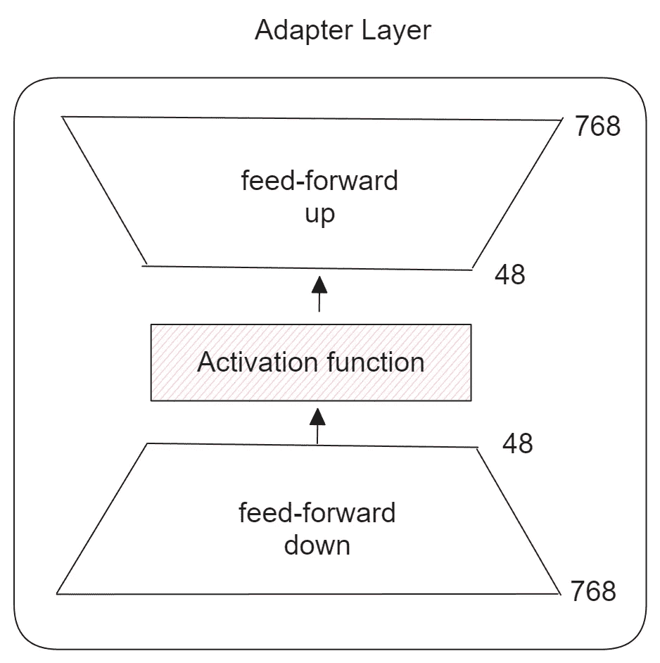
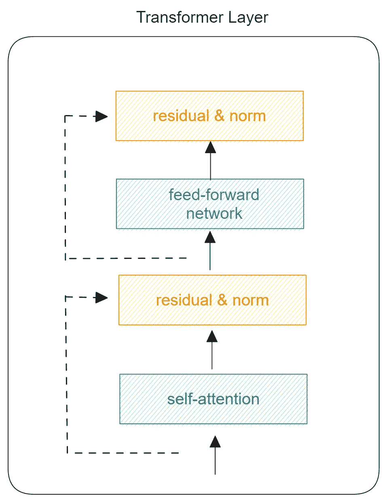
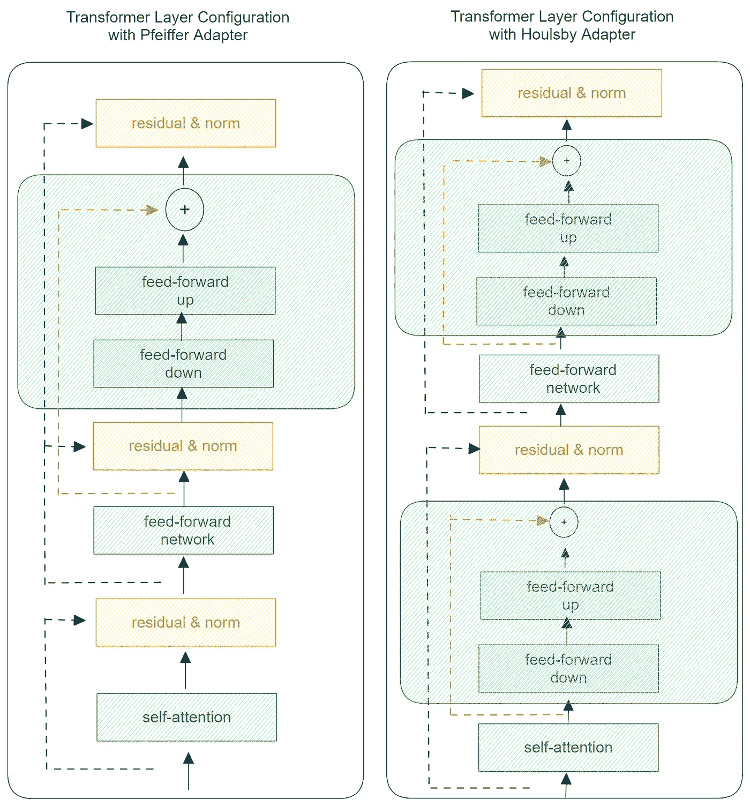
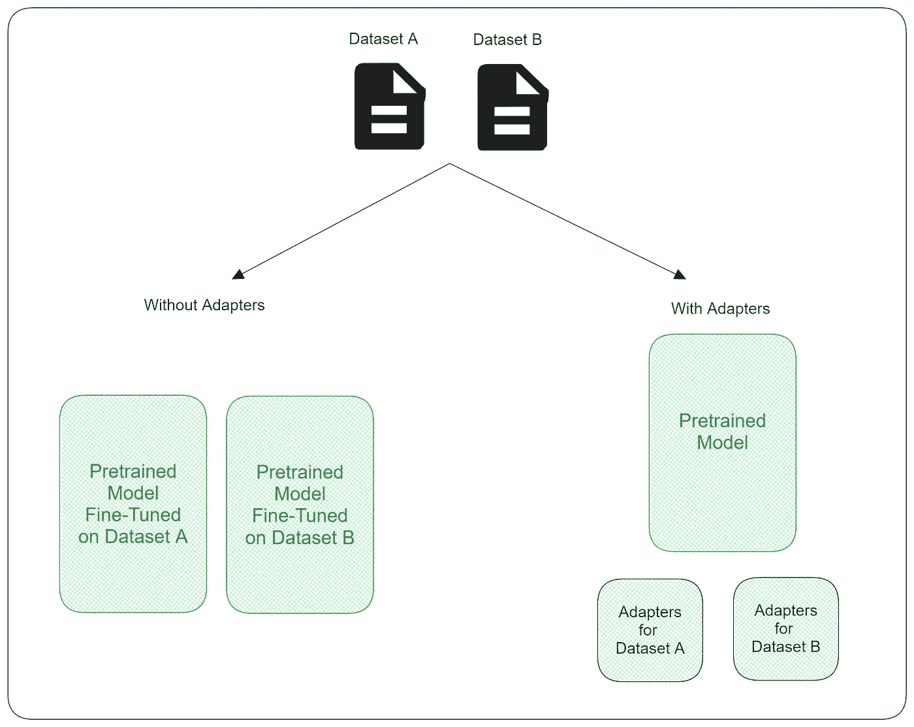

# 使用瓶颈适配器进行高效模型微调

> 原文：[`towardsdatascience.com/efficient-model-fine-tuning-with-bottleneck-adapter-5162fcec3909`](https://towardsdatascience.com/efficient-model-fine-tuning-with-bottleneck-adapter-5162fcec3909)

## 如何使用瓶颈适配器微调基于 Transformer 的模型

[](https://medium.com/@marcellusruben?source=post_page-----5162fcec3909--------------------------------)[](https://towardsdatascience.com/?source=post_page-----5162fcec3909--------------------------------) [Ruben Winastwan](https://medium.com/@marcellusruben?source=post_page-----5162fcec3909--------------------------------)

·发表于 [Towards Data Science](https://towardsdatascience.com/?source=post_page-----5162fcec3909--------------------------------) ·阅读时间 14 分钟·2023 年 11 月 22 日

--


照片来源：Karolina Grabowska: [`www.pexels.com/photo/set-of-modern-port-adapters-on-black-surface-4219861/`](https://www.pexels.com/photo/set-of-modern-port-adapters-on-black-surface-4219861/)

微调是我们为了在特定任务中从深度学习模型中获得更好性能时可以做的最常见的事情之一。我们需要微调模型的时间通常与模型的大小成正比：模型越大，微调所需的时间就越长。

我们可以达成一致的是，如今，基于 Transformer 的深度学习模型正变得越来越复杂。总体来说，这是一个值得关注的好现象，但它有一个警告：它们往往拥有庞大的参数量。因此，微调大型模型变得越来越难以管理，我们需要一种更高效的方法来进行微调。

在本文中，我们将讨论一种称为瓶颈适配器的高效微调方法。虽然您可以将这种方法应用于任何深度学习模型，但我们将重点关注其在基于 Transformer 的模型中的应用。

本文的结构如下：首先，我们将对一个特定数据集进行正常的 BERT 模型微调。然后，我们将借助`adapter-transformers`库将一些瓶颈适配器插入到 BERT 模型中，以查看它们如何帮助我们使微调过程更高效。

在我们微调模型之前，让我们先介绍一下我们将使用的数据集。

# 关于数据集

我们即将使用的数据集包含[**从 Reddit 收集的与心理健康相关的不同类型文本**](https://huggingface.co/datasets/mrjunos/depression-reddit-cleaned)（许可协议为 CC-BY-4.0）。该数据集适用于文本分类任务，我们可以预测给定文本是否包含抑郁情绪。让我们看一下它的样本。

```py
!pip install datasets

from datasets import load_dataset

dataset = load_dataset("mrjunos/depression-reddit-cleaned")
print(dataset['train'][2])

'''
{'text': 'anyone else instead of sleeping more when depressed stay up all night to avoid the next day from coming sooner may be the social anxiety in me but life is so much more peaceful when everyone else is asleep and not expecting thing of you',
 'label': 1}
'''
```

如你所见，数据集非常简单，因为我们只有两个字段：一个是文本，另一个是标签。标签本身只有两个可能的值：如果文本包含抑郁情绪则为 1，否则为 0。我们的任务是微调一个预训练的 BERT 模型，以预测每个文本的情感。

总共有大约 7731 个文本，我们将使用其中 6500 个进行训练，其余 1231 个用于微调过程中的验证。

让我们创建一个数据加载器，在微调过程中批量加载数据集，我们将在下一节中看到：

```py
!pip install pip install adapter-transformers

import torch
import numpy as np
from transformers import BertTokenizer

tokenizer = BertTokenizer.from_pretrained('bert-base-cased')

class Dataset(torch.utils.data.Dataset):

    def __init__(self, input_data):
        self.labels = [data for data in input_data['label']]
        self.texts = [tokenizer(data,
                               padding='max_length', max_length = 512, truncation=True,
                                return_tensors="pt") for data in input_data['text']]

    def __len__(self):
        return len(self.labels)

    def get_batch_labels(self, idx):
        return np.array(self.labels[idx])

    def get_batch_texts(self, idx):
        return self.texts[idx]

    def __getitem__(self, idx):
        batch_texts = self.get_batch_texts(idx)
        batch_y = self.get_batch_labels(idx)
        return batch_texts, batch_y
```

现在我们有了数据，可以开始讨论本文的主要话题。然而，如果我们已经熟悉普通微调的标准过程，那么理解瓶颈适配器的概念会更容易。

因此，在下一节中，我们将从普通微调过程的概念开始，然后扩展到瓶颈适配器的应用。

我们将使用`adapter-transformers`库来进行普通微调和基于适配器的微调。这个库是著名的 HuggingFace 的`transformers`库的直接分支，这意味着它包含了`transformers`的所有功能，并增加了几个模型类和方法，以便我们可以轻松地将适配器应用到模型中。

你可以使用以下命令安装`adapter-transformers`：

```py
pip install adapter-transformers
```

现在让我们开始讨论普通微调的常规过程。

# 普通 BERT 微调

微调是深度学习中的一种常见技术，旨在从预训练模型中获得在特定数据和/或任务上的更好性能。其主要思想很简单：我们获取预训练模型的权重，然后基于新的领域特定数据更新这些权重。



普通微调过程。图片由作者提供。

普通微调的常规过程如下。

首先，我们选择一个预训练模型，在我们的情况下是 BERT-base 模型。顺便提一下，我们在这篇文章中不会专注于 BERT，但如果你对 BERT 不熟悉并想了解更多，可以查看我关于 BERT 的文章：

[](/text-classification-with-bert-in-pytorch-887965e5820f?source=post_page-----5162fcec3909--------------------------------) ## 使用 BERT 进行 PyTorch 中的文本分类

### 如何利用 Hugging Face 的预训练 BERT 模型来分类新闻文章的文本

[towardsdatascience.com

简而言之，BERT-base 包含 12 层 Transformer 编码器。在微调过程中，我们需要在最后一层上添加一个线性层，作为分类器。由于我们数据集中的标签仅包含两个可能的值，因此我们的线性层的输出也将是两个。

```py
from torch import nn
from transformers import BertForSequenceClassification

class BertClassifier(nn.Module):

    def __init__(self, model_id='bert-base-cased', num_class=2):
        super(BertClassifier, self).__init__()
        self.bert = BertForSequenceClassification.from_pretrained(model_id, num_labels=num_class)

    def forward(self, input_id, mask):
        output = self.bert(input_ids= input_id, attention_mask=mask,return_dict=False)
        return output
```



BERT 架构。图片由作者提供。

现在我们已经定义了我们的模型，我们需要创建微调脚本。以下是对模型进行微调的代码片段。

```py
from torch.optim import Adam
from tqdm import tqdm

def train(model, train_data, val_data, learning_rate, epochs):

    # Fetch training and validation data in batch
    train, val = Dataset(train_data), Dataset(val_data)
    train_dataloader = torch.utils.data.DataLoader(train, batch_size=2, shuffle=True)
    val_dataloader = torch.utils.data.DataLoader(val, batch_size=2)

    use_cuda = torch.cuda.is_available()
    device = torch.device("cuda" if use_cuda else "cpu")

    criterion = nn.CrossEntropyLoss()
    optimizer = Adam(model.parameters(), lr= learning_rate)

    if use_cuda:
       model = model.to(device)
       criterion = criterion.to(device)

    for epoch_num in range(epochs):

        total_acc_train = 0
        total_loss_train = 0

        # Fine-tune the model
        for train_input, train_label in tqdm(train_dataloader):

            train_label = train_label.to(device)
            mask = train_input['attention_mask'].to(device)
            input_id = train_input['input_ids'].squeeze(1).to(device)

            output = model(input_id, mask)[0]

            batch_loss = criterion(output, train_label.long())
            total_loss_train += batch_loss.item()

            acc = (output.argmax(dim=1) == train_label).sum().item()
            total_acc_train += acc

            model.zero_grad()
            batch_loss.backward()
            optimizer.step()

        total_acc_val = 0
        total_loss_val = 0

        # Validate the model
        with torch.no_grad():

            for val_input, val_label in val_dataloader:
                val_label = val_label.to(device)
                mask = val_input['attention_mask'].to(device)
                input_id = val_input['input_ids'].squeeze(1).to(device)

                output = model(input_id, mask)[0]

                batch_loss = criterion(output, val_label.long())
                total_loss_val += batch_loss.item()
                acc = (output.argmax(dim=1) == val_label).sum().item()
                total_acc_val += acc

        print(
            f'Epochs: {epoch_num + 1} | Train Loss: {total_loss_train / len(train): .3f} \
            | Train Accuracy: {total_acc_train / len(train): .3f} \
            | Val Loss: {total_loss_val / len(val): .3f} \
            | Val Accuracy: {total_acc_val / len(val): .3f}')
```

我们将对我们的 BERT 模型进行大约 10 个周期的微调，学习率设置为 10e-7。 我在 T4 GPU 上使用批量大小为 2 进行了模型微调。以下是训练和验证准确度的快照。

```py
EPOCHS = 10
LR = 1e-7

model = BertClassifier()
data = dataset['train'].shuffle(seed=42)
train(model, data[:6500], data[6500:], LR, EPOCHS)

100%|███████████████████████████████████ 3250/3250 [11:56<00:00,  4.54it/s]
Epochs: 1 | Train Loss:  0.546 | Train Accuracy:  0.533 | Val Loss:  0.394 | Val Accuracy:  0.847
100%|███████████████████████████████████ 3250/3250 [11:57<00:00,  4.53it/s]
Epochs: 2 | Train Loss:  0.302 | Train Accuracy:  0.888 | Val Loss:  0.226 | Val Accuracy:  0.906
100%|███████████████████████████████████ 3250/3250 [11:57<00:00,  4.53it/s]
Epochs: 3 | Train Loss:  0.184 | Train Accuracy:  0.919 | Val Loss:  0.149 | Val Accuracy:  0.930
100%|███████████████████████████████████ 3250/3250 [11:57<00:00,  4.53it/s]
Epochs: 4 | Train Loss:  0.122 | Train Accuracy:  0.946 | Val Loss:  0.101 | Val Accuracy:  0.955
100%|███████████████████████████████████ 3250/3250 [11:57<00:00,  4.53it/s]
Epochs: 5 | Train Loss:  0.084 | Train Accuracy:  0.963 | Val Loss:  0.075 | Val Accuracy:  0.968
100%|███████████████████████████████████ 3250/3250 [11:56<00:00,  4.53it/s]
Epochs: 6 | Train Loss:  0.063 | Train Accuracy:  0.969 | Val Loss:  0.061 | Val Accuracy:  0.970
100%|███████████████████████████████████ 3250/3250 [11:57<00:00,  4.53it/s]
Epochs: 7 | Train Loss:  0.050 | Train Accuracy:  0.974 | Val Loss:  0.054 | Val Accuracy:  0.973
100%|███████████████████████████████████ 3250/3250 [11:57<00:00,  4.53it/s]
Epochs: 8 | Train Loss:  0.042 | Train Accuracy:  0.978 | Val Loss:  0.049 | Val Accuracy:  0.972
100%|███████████████████████████████████ 3250/3250 [11:57<00:00,  4.53it/s]
Epochs: 9 | Train Loss:  0.035 | Train Accuracy:  0.982 | Val Loss:  0.047 | Val Accuracy:  0.973
100%|███████████████████████████████████ 3250/3250 [11:57<00:00,  4.53it/s]
Epochs: 10 | Train Loss: 0.030 | Train Accuracy:  0.984 | Val Loss:  0.046 | Val Accuracy:  0.966
```

就这样！我们在数据集上使用 BERT 达到了 97.3% 的验证准确率。然后我们可以继续使用微调后的模型对未见数据进行预测。

总体来说，如果我们的模型具有“小”数量的参数，正常的微调不会成为问题，如上所示的 BERT 模型。让我们检查一下我们的 BERT-base 模型的总参数数量。

```py
def print_trainable_parameters(model):

    trainable_params = 0
    all_param = 0
    for _, param in model.named_parameters():
        all_param += param.numel()
        if param.requires_grad:
            trainable_params += param.numel()
    print(
        f"trainable params: {trainable_params} || all params: {all_param} || trainable%: {100 * trainable_params / all_param}"
    )

print_trainable_parameters(model)
'''
trainable params: 108311810 || all params: 108311810 || trainable%: 100.0
'''
```

这个模型总共有接近 1.1 亿个参数。虽然看起来很多，但与现在的大多数大型语言模型相比，这仍然不算什么，因为它们可能有数十亿个参数。如果你也注意到，可训练参数的数量与我们 BERT 模型的总参数数量相同。这意味着在正常的微调过程中，我们会更新 BERT 模型的所有参数的权重。

借助 T4 GPU 和我们的训练数据集仅包含 6500 条数据，我们幸运地只需大约 12 分钟每个周期来更新所有权重。现在想象一下，如果我们使用更大的模型和数据集，进行正常微调的计算时间将会非常昂贵。

此外，正常的微调通常与所谓的灾难性遗忘风险相关，如果我们在选择学习率时不小心，或者当我们尝试在多个任务/数据集上微调预训练模型时。灾难性遗忘指的是当我们在新任务上微调预训练模型时，它会“遗忘”其训练过的任务。

因此，我们确实需要一种更高效的程序来进行微调过程。这就是我们可以使用不同类型的高效微调方法的地方，其中瓶颈适配器就是其中之一。

# **瓶颈适配器**的工作原理

适配器的主要思想是，我们引入一小部分层，并将其放置在预训练模型的原始架构中。在微调过程中，我们冻结预训练模型的所有参数，因此，只有这些附加子集层的权重会被更新。

瓶颈适配器特指一种由两个普通前馈层组成的适配器，前后可选地添加归一化层。一个前馈层的功能是缩小输出，而另一个是放大输出。这就是为什么它被称为瓶颈适配器的原因。



常见的瓶颈适配器。图片由作者提供。

你可以将这个适配器应用于任何深度学习模型，但如前所述，我们将重点关注其在基于 Transformer 的模型上的应用。

基于 Transformer 的模型通常由多个 Transformer 层堆叠组成。例如，本文使用的基于 BERT 的模型有 12 个 Transformer 编码器层堆叠。每个堆叠包括以下组件：



Transformer 编码器堆叠。图片由作者提供。

我们可以将瓶颈适配器放入这个堆叠的几种不同方式。然而，有两种常见的配置：一种是 Pfeiffer 提出的，另一种是 Houlsby 提出的。

Pfeiffer 提出的瓶颈适配器插入在最后的规范层之后，而 Houlsby 提出的瓶颈适配器插入在两个不同的位置：一个在多头注意力层之后，另一个在前馈层之后，如下图所示：



Pfeiffer 和 Houlsby 适配器配置的区别。图片由作者提供。

由于我们的 BERT-base 模型有 12 个 Transformer 编码器层堆叠，因此如果使用 Pfeiffer 配置，我们将有 12 个瓶颈适配器：每个堆叠一个适配器。同时，如果使用 Houlsby 配置，我们将有 24 个瓶颈适配器：每个堆叠两个适配器。

尽管 Pfeiffer 配置相比于 Houlsby 配置参数更少，但在 8 个不同任务中的表现相当。

现在的问题是：这个瓶颈适配器是如何让微调过程更高效的？

如前所述，我们在微调过程中冻结预训练模型的权重，只更新适配器的权重。这意味着我们可以显著加快微调过程，接下来的部分会展示这一点。实验也表明，使用适配器进行微调的性能通常与普通微调相当。

同时，假设我们想用相同的预训练模型处理两个不同的数据集。我们可以使用一个模型，通过两个不同的适配器在不同的数据集上进行微调，从而避免灾难性遗忘的风险，而不是拥有两个在不同数据集上微调的模型。



图片由作者提供。

使用这种方法，我们节省了大量存储空间。例如，一个单独的 BERT-base 模型的大小是 440 MB，如果我们有两个模型，则为 880 MB。与此同时，如果我们有一个带有两个适配器的 BERT-base 模型，大小大约为 450 MB，因为瓶颈适配器只占用少量内存。

# 瓶颈适配器实现

在本节中，我们将实现 Pfeiffer 版本的瓶颈适配器。为此，我们只需要更改模型架构的脚本，而与微调过程和数据加载相关的脚本保持不变。

让我们使用 Pfeiffer 的适配器定义模型架构。

```py
from transformers import AdapterConfig
from transformers.adapters import BertAdapterModel

class BertClassifierWithAdapter(nn.Module):

    def __init__(self, model_id='bert-base-cased', adapter_id='pfeiffer', 
                task_id = 'depression_reddit_dataset', num_class=2):

        super(BertClassifierWithAdapter, self).__init__()

        self.adapter_config = AdapterConfig.load(adapter_id)

        self.bert = BertAdapterModel.from_pretrained(model_id)
        # Insert adapter according to configuration
        self.bert.add_adapter(task_id, config=self.adapter_config)
        # Freeze all BERT-base weights 
        self.bert.train_adapter(task_id)
        # Add prediction layer on top of BERT-base
        self.bert.add_classification_head(task_id, num_labels=num_class)
        # Make sure that adapters and prediction layer are used during forward pass
        self.bert.set_active_adapters(task_id)

    def forward(self, input_id, mask):

        output = self.bert(input_ids= input_id, attention_mask=mask,return_dict=False)

        return output
```

如你所见，实现适配器版本的模型非常简单：

+   使用`AdapterConfig.load('pfeiffer')`定义我们想要应用的适配器配置。如果你想使用 Houlsby 配置，只需将其更改为`'houlsby'`。

+   使用`add_adapter()`方法将适配器插入到我们的 BERT 模型中。常见做法是根据任务或数据集为适配器命名，以便我们希望模型进行微调。

+   使用`train_adapter()`方法冻结预训练模型的所有权重。

+   使用`add_classification_head()`方法在 BERT 模型上添加一个线性层，作为预测头。常见做法是为预测头取与适配器相同的名称。

+   激活我们的适配器和预测头，以确保它们在每次前向传递中都被使用，使用`set_active_adapters()`方法。

现在，让我们检查在添加适配器后参数的总数和可训练参数的比例：

```py
# Initialize model 

# task_id is the name of our adapter. You can name it whatever you want but
# common practice is to name it according to task/dataset we will train it on.
task_name = 'depression_reddit_dataset'
model_adapter = BertClassifierWithAdapter(task_id=task_name)
# Check parameters
print_trainable_parameters(model_adapter)

'''
trainable params: 1486658 || all params: 109796930 || trainable%: 1.3540068925424418
'''
```

带有适配器的模型参数比我们原始的 BERT-base 模型多，但只有 1.35%是可训练的，因为我们只会更新适配器的权重。

现在是训练模型的时候了。由于适配器的权重是随机初始化的，因此这次我们将使用略高的学习率。我们还将训练该模型 10 个时期。如果一切顺利，你将获得类似如下的输出：

```py
LR = 5e-6
EPOCHS = 10
train(model_adapter, dataset['train'][:6500], dataset['train'][6500:], LR, EPOCHS)

100%|███████████████████████████████████████████ 3250/3250 [07:19<00:00,  7.40it/s]
Epochs: 1 | Train Loss:  0.183 | Train Accuracy:  0.846  | Val Loss:  0.125  | Val Accuracy:  0.897
100%|███████████████████████████████████████████ 3250/3250 [07:24<00:00,  7.32it/s]
Epochs: 2 | Train Loss:  0.096 | Train Accuracy:  0.925  | Val Loss:  0.072  | Val Accuracy:  0.946
100%|███████████████████████████████████████████ 3250/3250 [07:23<00:00,  7.32it/s]
Epochs: 3 | Train Loss:  0.060 | Train Accuracy:  0.958  | Val Loss:  0.052  | Val Accuracy:  0.962
100%|███████████████████████████████████████████ 3250/3250 [07:21<00:00,  7.37it/s]
Epochs: 4 | Train Loss:  0.044 | Train Accuracy:  0.968  | Val Loss:  0.047  | Val Accuracy:  0.971
100%|███████████████████████████████████████████ 3250/3250 [07:25<00:00,  7.30it/s]
Epochs: 5 | Train Loss:  0.038 | Train Accuracy:  0.971  | Val Loss:  0.043  | Val Accuracy:  0.973
100%|███████████████████████████████████████████ 3250/3250 [07:25<00:00,  7.29it/s]
Epochs: 6 | Train Loss:  0.034 | Train Accuracy:  0.975  | Val Loss:  0.039  | Val Accuracy:  0.971
100%|███████████████████████████████████████████ 3250/3250 [07:25<00:00,  7.29it/s]
Epochs: 7 | Train Loss:  0.032 | Train Accuracy:  0.978  | Val Loss:  0.038  | Val Accuracy:  0.972
100%|███████████████████████████████████████████ 3250/3250 [07:25<00:00,  7.29it/s]
Epochs: 8 | Train Loss:  0.029 | Train Accuracy:  0.980  | Val Loss:  0.039  | Val Accuracy:  0.974
100%|███████████████████████████████████████████ 3250/3250 [07:25<00:00,  7.29it/s]
Epochs: 9 | Train Loss:  0.027 | Train Accuracy:  0.980  | Val Loss:  0.035  | Val Accuracy:  0.971
100%|███████████████████████████████████████████ 3250/3250 [07:19<00:00,  7.40it/s] 
```

如你所见，带有适配器的模型性能与完全微调版本的模型相当。而且，完成一个时期所需的时间比完全微调快 4.5 分钟。

既然我们已经训练好了它，我们可以保存适配器。

```py
# Save trained model with adapter
model_adapter_path = 'model/bert_adapter/' 
model_adapter.bert.save_all_adapters(model_adapter_path)
```

然后我们可以加载适配器并进行推理，如下所示：

```py
def predict(data, model):

    inputs = tokenizer(data['text'],
              padding='max_length', max_length=512, truncation=True,
              return_tensors="pt")

    mask = inputs['attention_mask'].to(device)
    input_id = inputs['input_ids'].squeeze(1).to(device)
    output = model(input_id, mask)[0].argmax(dim=1).item()
    print(output)

use_cuda = torch.cuda.is_available()
device = torch.device("cuda" if use_cuda else "cpu")

model_path = f'{model_adapter_path}{task_name}'

# Load trained adapter
trained_adapter_model = BertClassifierWithAdapter(task_id=task_name)
adapter_name = trained_adapter_model.bert.load_adapter(model_path)
trained_adapter_model.bert.set_active_adapters(adapter_name)
trained_adapter_model.to(device)
trained_adapter_model.eval()

# Predict test data
predict(data[6900], trained_adapter_model)
```

# 结论

在本文中，我们已经看到瓶颈适配器在大型模型的微调过程中是如何有帮助的。使用瓶颈适配器，我们能够加快微调速度，同时保持模型的最终性能。这些适配器也有助于避免通常与微调模型相关的灾难性遗忘风险。此外，这些适配器不会占用大量内存空间。

我希望这篇文章对你在使用瓶颈适配器时有所帮助。如果你想查看本文中实现的所有代码，可以通过[**这个笔记本**](https://github.com/marcellusruben/medium-resources/blob/main/Bottleneck_Adapters/Bottleneck_Adapters_Medium.ipynb)访问。

# 数据集参考

+   [`huggingface.co/datasets/mrjunos/depression-reddit-cleaned`](https://huggingface.co/datasets/mrjunos/depression-reddit-cleaned)
