# 荷兰电动车：使用 Python 和 SQLAlchemy 的探索性数据分析（第二部分）

> 原文：[`towardsdatascience.com/electric-cars-in-the-netherlands-exploratory-data-analysis-with-python-and-sqlalchemy-part-2-c12c6cc2a902`](https://towardsdatascience.com/electric-cars-in-the-netherlands-exploratory-data-analysis-with-python-and-sqlalchemy-part-2-c12c6cc2a902)

## 使用 Python、SQLAlchemy 和 Bokeh 进行数据分析和可视化

[](https://dmitryelj.medium.com/?source=post_page-----c12c6cc2a902--------------------------------)[](https://towardsdatascience.com/?source=post_page-----c12c6cc2a902--------------------------------) [Dmitrii Eliuseev](https://dmitryelj.medium.com/?source=post_page-----c12c6cc2a902--------------------------------)

·发表于[Towards Data Science](https://towardsdatascience.com/?source=post_page-----c12c6cc2a902--------------------------------) ·阅读时间 17 分钟·2023 年 3 月 10 日

--

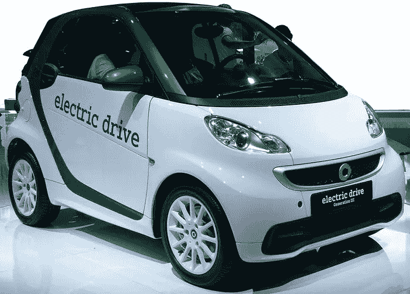

Smart EQ 汽车，图片来源 [`en.wikipedia.org/wiki/Smart_electric_drive`](https://en.wikipedia.org/wiki/Smart_electric_drive)

第一个电动车是什么时候注册的？（剧透：比大多数人想象的要早得多。）电动保时捷和捷豹哪一款更贵？探索性数据分析（EDA）不仅是构建每个数据管道的重要部分，而且是一个相当有趣的过程。在第一部分中，我使用 Python 和 Pandas 分析了 RDW（荷兰车辆管理局）数据集，其中一个挑战是数据集大小较大（约 10 GB）。作为解决方案，我指定了需要在 Pandas 中加载的列列表。这种方法有效，但如果数据集更大，内存中没有足够的 RAM 来容纳所有数据，或者数据集存放在远程数据库中怎么办？在这篇文章中，我将展示如何使用 SQLAlchemy 进行类似的分析。这将允许使用 SQL 进行“重型”数据处理，而无需将所有数据加载到 Pandas 中。

让我们开始吧。

## 加载数据

**RDW**（“Rijks Dienst Wegverkeer”， [`www.rdw.nl`](https://www.rdw.nl/)）是一个荷兰组织，负责荷兰的机动车和驾驶执照的批准与登记。我将使用“Gekentekende voertuigen”（“带有车牌的车辆”）数据集。如第一部分所述，它在公共领域许可证下提供，可以从[opendata.rdw.nl](https://opendata.rdw.nl/Voertuigen/Open-Data-RDW-Gekentekende_voertuigen/m9d7-ebf2)下载。数据处理将使用[SQLite](https://www.sqlite.org/index.html)，它是一个免费的轻量级数据库引擎，可以轻松运行在任何 PC 上。

一开始，我们需要将 CSV 文件下载并导入到 SQLite 中。文件大小约为 10 GB；可以免费下载，无需注册。为了导入数据，我运行了“*sqlite3 rdw_data.db*”命令，并输入了 3 个命令：

```py
sqlite> .mode csv
sqlite> .import Open_Data_RDW__Gekentekende_voertuigen.csv rdw_data
sqlite> .quit
```

这里“Open_Data_RDW__Gekentekende_voertuigen.csv”是原始的 CSV 文件，“rdw_data”是一个需要创建的表。导入过程需要一些时间，之后我们就可以结束命令行操作，回到 Jupyter Lab。首先，让我们进行必要的导入，看看我们拥有哪些数据库列：

```py
from sqlalchemy import create_engine, MetaData, table, column, select, func
from sqlalchemy import inspectp
import pandas as pd

rdw_db = create_engine('sqlite:///rdw_data.db')

table_name = 'rdw_data'

with Session(rdw_db) as session:    
    insp = inspect(rdw_db)
    columns = insp.get_columns("rdw_data")
    display(pd.DataFrame(columns))
```

我使用 Pandas DataFrame 来显示结果，因为它的输出更易于阅读。例如，“display(columns)”会显示如下输出：

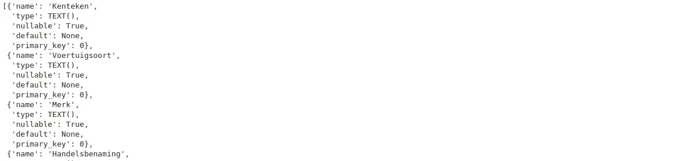

同时，“display(pd.DataFrame(columns))”的输出效果要好得多：

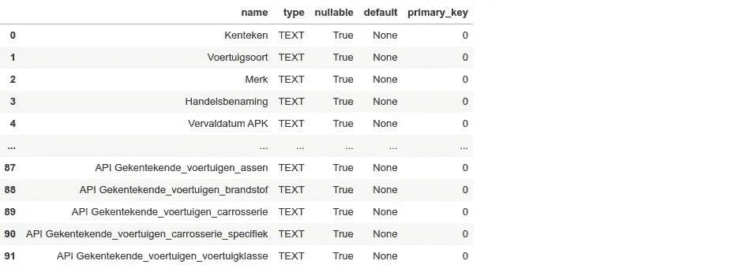

让我们检查一下结果。我们可以看到所有列都是 TEXT 类型，因此我们需要转换这些值。数据库中有 91 列，但根据实际分析，我只需要汽车的类型、车牌、型号名称、价格和注册日期。我还会使用“Number of cylinders”作为辅助来检测汽车是否是电动车。最后但同样重要的是，我只会分析“personal”（荷兰语中的“Personenauto”）汽车，而不是卡车或公交车，所以我会在 SQL 查询中使用这个过滤器。

让我们使用 SQL 进行这个转换：

```py
with Session(rdw_db) as session:  
    session.execute(text('DROP TABLE IF EXISTS rdw_cars'))
    session.execute(text('CREATE TABLE rdw_cars("index" INTEGER PRIMARY KEY AUTOINCREMENT, '
                                                         '"Model" TEXT, '
                                                         '"Trade name" TEXT, '
                                                         '"License Plate" TEXT, '
                                                         '"Number of Cylinders" INTEGER, '
                                                         '"Catalog price" INTEGER, '
                                                         '"First registration NL" TEXT, '
                                                         '"Is electric" INTEGER DEFAULT 0)'))

    session.execute(text('BEGIN TRANSACTION'))    
    session.execute(text('INSERT INTO rdw_cars("Model", "Trade name", "License Plate", "Number of Cylinders", "Catalog price", "First registration NL") '
                                           'SELECT '
                                              '"Merk", '
                                              '"Handelsbenaming", '
                                              '"Kenteken", '
                                              '(CASE WHEN LENGTH("Aantal cilinders") > 0 THEN CAST("Aantal cilinders" as INTEGER) ELSE NULL END), '
                                              '(CASE WHEN LENGTH("Catalogusprijs") > 0 THEN CAST("Catalogusprijs" as INTEGER) ELSE NULL END), '
                                              'DATE(SUBSTR("Datum eerste tenaamstelling in Nederland", 1, 4) || "-" || SUBSTR("Datum eerste tenaamstelling in Nederland", 5, 2) || "-" || SUBSTR("Datum eerste tenaamstelling in Nederland", 7, 2)) '
                                           ' FROM rdw_data WHERE "Voertuigsoort" = "Personenauto"'))  

    session.execute(text('COMMIT'))
​
```

在这里，我创建了一个新表，并将整数和日期列转换成适当的格式。我将所有空字符串替换为 NULL，并作为读者的额外奖励，我将荷兰语列名翻译成了英文。我还创建了“Is electric”列，后面会使用到。

初始转换完成，我们准备好了。

## 基本分析

一开始，让我们看看数据集的主要属性，如数据样本、维度和 NULL 值的数量。

使用 SQL，我们可以获取记录的总数：

```py
with Session(rdw_db) as session:    
    q = session.execute(text('SELECT COUNT(*) FROM rdw_cars')).scalar()
    print("Cars total:", q) 
```

总共有 9,487,265 辆车，在撰写本文时已在荷兰注册（对于那些稍后下载数据集的读者，这个数字显然会更大）。这个总数也等于我在第一部分中得到的数字，在那里我使用 Pandas 进行了类似的分析——这是一种检查处理是否正确的简单方法。

现在我们来看数据库中的前 5 个样本；使用 SQL 很容易做到这一点。在这里和之后我将使用 Pandas 来显示表格，因为 Pandas 有原生的 SQL 绑定，这很方便。

```py
with Session(rdw_db) as session:
    df = pd.read_sql_query(text("SELECT * FROM rdw_cars LIMIT 5"), con=session.connection(), dtype={'Catalog price': pd.UInt32Dtype(), 'Number of Cylinders': pd.UInt32Dtype()})
    display(df.style.hide(axis="index"))
```

结果如下所示：

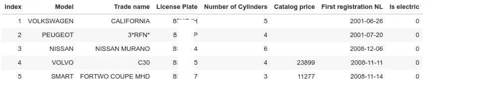

让我们检查一下不同列中缺失/NULL 数量。Pandas DataFrame 有一个方便的方法“df.isna().sum()”，但我在 SQL 中找不到类似的东西。我们需要指定所有需要检查的列：

```py
with Session(rdw_db) as session:
    request = ('SELECT '
               ' SUM(CASE WHEN "Model" IS NULL OR "Model" = "" THEN 1 ELSE 0 END) AS model_no_data, '
               ' SUM(CASE WHEN "Trade name" = "" THEN 1 ELSE 0 END) AS trade_name_empty, '
               ' SUM(CASE WHEN "Trade name" IS NULL THEN 1 ELSE 0 END) AS trade_name_nulls, '
               ' SUM(CASE WHEN "License Plate" IS NULL OR "License Plate" = "" THEN 1 ELSE 0 END) AS lp_no_data, '
               ' SUM(CASE WHEN "Number of Cylinders" = 0 THEN 1 ELSE 0 END) AS num_cylinders_zeros, '
               ' SUM(CASE WHEN "Number of Cylinders" IS NULL THEN 1 ELSE 0 END) AS num_cylinders_nulls, '
               ' SUM(CASE WHEN "Catalog price" = 0 THEN 1 ELSE 0 END) AS price_zeros, '
               ' SUM(CASE WHEN "Catalog price" IS NULL THEN 1 ELSE 0 END) AS price_nulls, '
               ' SUM(CASE WHEN "First registration NL" IS NULL THEN 1 ELSE 0 END) AS registration_nulls, '
               ' COUNT(*) AS total '
               'FROM rdw_cars')

    df = pd.read_sql(text(request), con=session.connection())
    display(df.style.hide(axis="index"))
```

使用 SQL，我计算了可能是 NULL 或空的值的总和。结果如下所示：

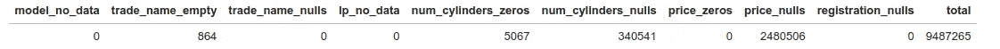

在这里我们可以看到汽车的总数量（9,487,265）。每辆车都有一个车牌和一个注册日期；这些字段可能是注册的必填项。但有 2,480,506 条记录没有价格，864 条记录没有“商标名称”，等等。在这里，我看到一个问题——这些 864 条空“商标名称”字段的记录与我在 Pandas 中得到的 1,405 条空记录不匹配，在第一部分中得到了这个结果。这显然是不对的，差异在哪里？不可能手动检查 9,487,265 条记录，而调试这个问题的最简单方法是将唯一的“商标名称”值保存到文本文件中，并使用“Diff”工具比较两个文件。结果表明，问题简单但有趣——在第一部分，我使用了“pd.read_csv”方法加载数据。这个方法“足够聪明”可以自动将“NULL”、“NA”、“N/A”和一些其他值（完整列表可以在[手册](https://pandas.pydata.org/docs/reference/api/pandas.read_csv.html)中找到）替换为 NULL，这个转换默认是*启用的*。在我们的案例中，[Mazda NA](https://en.wikipedia.org/wiki/Mazda_MX-5_(NA)) 是一个真实的汽车模型，而 Pandas 自动将这些车的所有“NA”名称转换为 NULL（这也让我想起了[旧故事](https://www.wired.com/2015/11/null/)关于姓氏 Null 的人，他对计算机来说是“不可见的”）。无论如何，Mazda NA 车不是电动车，所以它不会影响第一部分的结果，但要记住这种问题可能会发生是好的。

但让我们回到分析中。使用 SQL，我们可以轻松地进行有用的请求，例如，来看一下荷兰最贵的前 10 辆车：

```py
with Session(rdw_db) as session:
    df = pd.read_sql(text('SELECT "Model", "Trade name", "Catalog price", "First registration NL" FROM rdw_cars ORDER BY "Catalog price" DESC LIMIT 10'), con = session.connection())
    display(df)
```

结果很有趣：

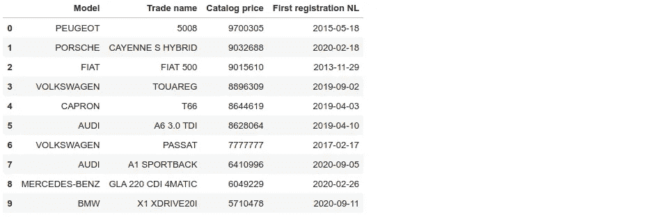

我本来期待在这个列表中看到 Porsche、Mercedes 或 BMW，但看到 Peugeot 或 Fiat 在这里对我来说有点意外，不过，我不是豪华车方面的专家。

## 数据转换

我们已经使用 SQL 请求做了一些基本分析，但本文的目的是分析*电动汽车*。要检测汽车是否为电动，我们需要知道其制造商和型号名称。理想情况下，如果电动汽车的名称中有“ELECTRIC”，任务会简单得多。但在现实生活中，车型命名毫无逻辑。“Mazda MX-30”是电动的，但“Mazda MX-5”不是。“Kia Niro”是电动的，而“Kia Sorento”不是，等等。这没有规则，最简单的方法就是创建一个电动汽车型号的表格并加以使用。但首先，让我们检查一下数据集中汽车型号和商标名称是否一致。

首先让我们验证**汽车** **型号**，例如，查看所有的 PEUGEOT 汽车：

```py
with Session(rdw_db) as session:
    df = pd.read_sql_query(text('SELECT "Model", COUNT(*) AS Count FROM rdw_cars WHERE "Model" LIKE "%PEUGEOT%" GROUP BY "Model" '), con = session.connection())
    display(df.style.hide(axis="index"))
```

结果看起来是这样的：

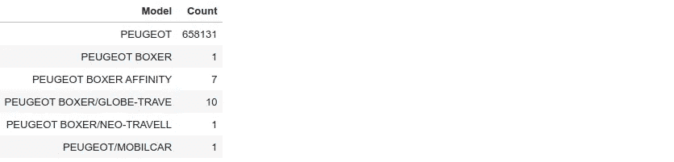

数据库中的几乎所有汽车都有名称“PEUGEOT”，这很好，但有几辆车的名称较长，如“PEUGEOT BOXER”。第一个词足以知道汽车型号，因此我们可以轻松去除其余部分。这将使未来的分析更加方便；例如，我们可以按型号对汽车进行分组，看看售出了多少辆 Peugeot 汽车。在第一部分中，我已经创建了一个方法来去除型号名称中的冗余词：

```py
def model_normalize(s_val):
    """ "PEUGEOT BOXER/GLOBE-TRAVE " => "PEUGEOT" """
    if s_val and isinstance(s_val, str) and len(s_val) > 0:
        return s_val.replace("-", " ").replace("/", " ").split()[0].upper().strip()
    return None
```

现在让我们检查下一列。数据集中汽车**商标名称**有时会与型号重复，例如这个例子中的“NISSAN”汽车：

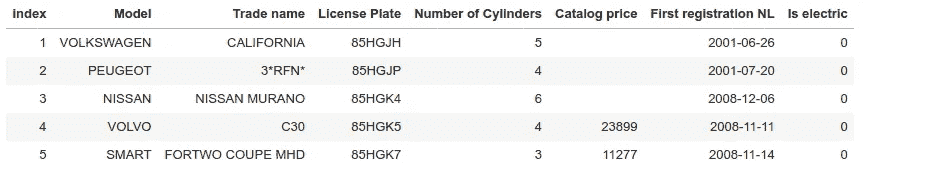

我创建了一个方法来移除这些重复项，在这个示例中，它会将“NISSAN MURANO”字段转换为仅“ MURANO”。

```py
def name_normalize(model: str, trade_name: str):
    """ Remove duplicates and convert the name to upper case """
    if isinstance(trade_name, str) and len(trade_name) > 0:
        name = trade_name.upper().strip()
        # Remove duplicates from model and trade name: 
        # ("TESLA", "TESLA MODEL 3") => ("TESLA", "MODEL 3")
        if name.split()[0] == model:
            # "TESLA MODEL 3" => [TESLA, MODEL, 3] => "MODEL 3"
            return ' '.join(name.split()[1:])  
        return name
    return None
```

现在我们终于可以弄清楚这辆车**是否为电动**了。在第一部分中，我已经为此创建了一个方法：

```py
electric_cars = {
    "AIWAYS": ['U5', 'U6'],
    "AUDI": ['E-TRON'],
    "BMW": ['I3', 'I4', 'I7', 'IX'],
    "CITROEN": ['E-C4'],
    "FIAT": ['500E', 'ELETTRA'],
    "FORD": ['MACH-E'],
    "HONDA": ['"E"', '"E ADVANCE"'],  
    "HYUNDAI": ['IONIQ', 'KONA'],
    "JAGUAR": ['I-PACE'],
    "KIA": ['NIRO', 'E-SOUL'],
    "LEXUS": ['RZ'],
    "LUCID": ['AIR'],
    "MAZDA": ['MX-30'],
    "MERCEDES": ['EQA', 'EQB', 'EQC', 'EQS', 'EQV'],
    "MG": ['ZS EV'],
    "MINI": ['COOPER SE'],
    "NISSAN": ['ALTRA', 'ARIYA', 'EVALIA', 'LEAF', 'NUVU'],
    "OPEL": ['AMPERA-E', 'COMBO-E', 'CORSA-E', 'MOKKA-E', 'VIVARO-E', 'ZAFIRA-E'],
    "PEUGEOT": ['E-208', 'E-2008', 'E-RIFTER', 'E-TRAVELLER'],
    "POLESTAR": ['2', '3'],
    "PORSCHE": ['TAYCAN'],
    "RENAULT": ['MASTER', 'TWINGO', 'KANGOO ELEC', 'ZOE'],
    "SKODA": ['ENYAQ'],
    "SMART": ['EQ'],
    "TESLA": [''],
    "TOYOTA": ['BZ'],
    "VOLKSWAGEN": ['ID.3', 'ID.4', 'ID.5', 'E-GOLF'],
    "VOLVO": ['C40', 'XC40']
}

def check_is_electric(model: str, trade_name: str, cylinders: int):
    """ Determine if the car is electric """
    if isinstance(cylinders, int) and cylinders > 0:
        return False
    for e_model, e_names in electric_cars.items():
        if model == e_model:
            for e_name in e_names:
                if trade_name and (e_name in trade_name or e_name.replace('"', '') == trade_name):
                    return True
                if trade_name is None and len(e_name) == 0:
                    return True
    return False
```

在这段代码中，我搜索特定的关键词；例如，如果型号是“BMW”，那么“I3”商标名称会告诉我们这辆车是电动的。作为额外的检查（一些汽车可能是电动或混合动力），我还分析了气缸数量，对于电动汽车，气缸数量必须是 0 或 NULL。

在第一部分中已经测试过的所有 3 种方法都效果很好，例如，我可以通过一行代码轻松地将*model_normalize*方法应用于 Pandas 数据集：

```py
df["Model"] = df['Model'].map(lambda s: model_normalize(s))
```

但是我们如何在 SQL 中使用它呢？好吧，直接用是不行的，但我们可以借助 ORM 来实现。

## SQLAlchemy ORM

ORM（对象关系映射）是一种技术，用于在 OOP 语言和关系数据库之间创建一个“桥梁”。实际上，我们可以创建一个特殊的 Python 类，SQLALchemy 会自动将对这个类的所有请求转换为 SQL。这非常方便，允许开发人员用纯 Python 编写代码，而不必处理难看的括号和长 SQL 字符串。

让我们创建一个“Car”类，并在其中放入所需的方法：

```py
from sqlalchemy.orm import DeclarativeBase
from sqlalchemy import String, Integer, Date, Column

class Base(DeclarativeBase):
    pass

class Car(Base):
    __tablename__ = "rdw_cars"
    index = Column("index", Integer, primary_key=True) 
    license_plate = Column("License Plate", String)
    model = Column("Model", String) 
    trade_name = Column("Trade name", String) 
    num_cylinders = Column("Number of Cylinders", Integer) 
    first_registration = Column("First registration NL", Date) 
    price = Column("Catalog price", Integer) 
    is_electric = Column("Is electric", Integer)    

    def model_normalize(self):
        """ "PEUGEOT BOXER/GLOBE-TRAVE " => "PEUGEOT" """
        if self.model and isinstance(self.model, str) and len(self.model) > 0:
            self.model = self.model.replace("-", " ").replace("/", " ").split()[0].upper().strip()

    def name_normalize(self):
        """ Remove duplicates from model and trade name: ("TESLA", "TESLA MODEL 3") => ("TESLA", "MODEL 3") """
        if isinstance(self.trade_name, str) and len(self.trade_name) > 0:
            name = self.trade_name.upper().strip()
            if name.split()[0] == self.model:
                # "TESLA MODEL 3" => [TESLA, MODEL, 3] => "MODEL 3"
                self.trade_name = ' '.join(name.split()[1:])  
            else:
                self.trade_name = name

    def check_electric(self):
        self.is_electric = check_is_electric(self.model, self.trade_name, self.num_cylinders)
```

作为这种方法的一个示例，让我们展示荷兰特定型号的最贵汽车。使用标准 SQL，我们可以发出如下请求：

```py
with Session(rdw_db) as session:
    model = "BMW"
    limit = 5
    df = pd.read_sql_query(text(f'SELECT "Model", "Trade name", "Catalog price", "First registration NL" FROM rdw_cars WHERE Model = "{model}" ORDER BY "Catalog price" DESC LIMIT {limit}'), 
                           con=session.connection())
    display(df.style.hide(axis="index"))
```

结果是我们得到了表格：

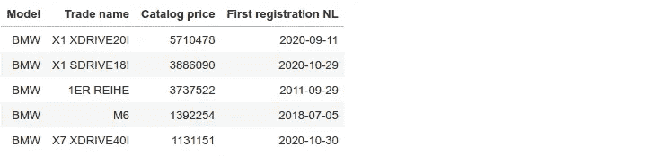

它是有效的，但 SQL 字符串相当长，我不得不使用 f-string 将所需的变量添加到请求中。在对象关系映射的帮助下，我可以直接使用标准 Python 代码：

```py
with Session(rdw_db) as session:
    model = "BMW"
    limit = 5
    df = pd.read_sql_query(select(Car.model, Car.trade_name, Car.price, Car.first_registration).filter(Car.model == model).order_by(Car.price.desc()).limit(limit), 
                           con=session.connection())
    display(df.style.hide(axis="index"))
```

SQLAlchemy 将在“幕后”创建一个适当的 SQL 请求，因此我们得到了更易读的 Python 代码。然而，主要的缺点是 SQL 或多或少是标准的；有很多关于它的资源和教程，但 SQLAlchemy 代码仅限于此库。但对于我们的任务，这种方法效果很好。

使用 ORM，我们可以轻松地将我们的“check_electric”方法应用于数据库中的所有记录：

```py
with Session(rdw_db) as session:
    cars_total = session.query(Car).count()

    index = 0
    batch_size = 25000
    while True:
        pos1, pos2 = index*batch_size, (index + 1)*batch_size
        if index % 20 == 0:
            print(f"Processing {pos1} to {pos2}, {100*index*batch_size//cars_total}%...")

        cars = session.query(Car).filter(Car.index.between(pos1, pos2)).all()
        if len(cars) == 0:
            break
        for car in cars:
            car.model_normalize()
            car.name_normalize()
            car.check_electric()

        session.flush()
        index += 1

    session.commit()
```

在这段代码中，我从数据库中读取记录，更新参数，并将数据保存回表中。SQLAlchemy 将使用 SQL 请求更新表格，这肯定比直接在内存中更新 Pandas Dataframe 要慢。调用 Pandas 中的相同方法只需 130 秒，而 SQLAlchemy 请求则花费了 390 秒，因此差异约为 3 倍。另一方面，对于批量更新，我们需要的内存要少得多，而且不需要将整个数据框保存在 RAM 中。

## 分析

更新表格后，我们终于准备好了。作为热身，让我们计算一下汽车价格的均值和百分位数。

计算**均值**很简单，可以用 SQLAlchemy 一行代码完成。让我们获取汽车的总数量及其算术价格均值：

```py
with Session(rdw_db) as session:
    c_total = session.query(Car).count()
    print(f"Cars total: {c_total}")
    c_el = session.query(Car).filter(Car.is_electric == 1).count()
    print(f"Cars electric: {c_el} ({100*c_el/c_total:.2f}%)")

    pm = session.query(func.avg(Car.price)).scalar()
    print("Price mean:", pm)

    pm_el = session.query(func.avg(Car.price)).filter(Car.is_electric == 1).scalar()
    print("Electric cars price mean:", pm_el)
```

获取**百分位数**稍微复杂一点，我们有两种方法可以做到这一点。我们可以仅加载“价格”列，然后使用 NumPy 的“percentile”方法进行计算：

```py
 prices = session.query(Car.price).filter(Car.price != None).all()
    print("All cars percentiles [5, 50, 95]:", np.percentile(prices, [5, 50, 95]))

    prices_el = session.query(Car.price).filter((Car.price != None) & (Car.is_electric == 1)).all()
    print("Electric cars percentiles [5, 50, 95]:", np.percentile(prices_el, [5, 50, 95]))
```

如果数据集很大，我们想要避免完全加载数据，可以通过结合“order_by”、“limit”和“offset”来使用纯 SQL 获取百分位数：

```py
 num_total = session.query(Car).filter(Car.price != None).count()
    p5 = session.query(Car.price).filter(Car.price != None).order_by(Car.price).offset(num_total*5/100 - 1).limit(1).scalar() 
    p50 = session.query(Car.price).filter(Car.price != None).order_by(Car.price).offset(num_total*50/100 - 1).limit(1).scalar() 
    p95 = session.query(Car.price).filter(Car.price != None).order_by(Car.price).offset(num_total*95/100 - 1).limit(1).scalar() 
    print("All cars percentiles [5, 50, 95]:", p5, p50, p95)

    num_el = session.query(Car).filter((Car.price != None) & (Car.is_electric == 1)).count()
    p5 = session.query(Car.price).filter((Car.price != None) & (Car.is_electric == 1)).order_by(Car.price).offset(num_el*5/100 - 1).limit(1).scalar() 
    p50 = session.query(Car.price).filter((Car.price != None) & (Car.is_electric == 1)).order_by(Car.price).offset(num_el*50/100 - 1).limit(1).scalar() 
    p95 = session.query(Car.price).filter((Car.price != None) & (Car.is_electric == 1)).order_by(Car.price).offset(num_el*95/100 - 1).limit(1).scalar() 
    print("Electric cars percentiles [5, 50, 95]:", p5, p50, p95)
```

结果很有趣：

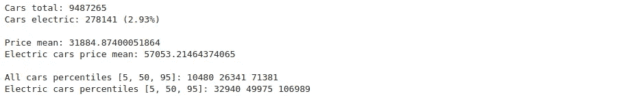

荷兰是一个平均工资相当高的国家，但在撰写本文时，只有 2.93% 的汽车是电动的。所有汽车的中位数价格为 €26,341，而电动汽车“平均”贵 2 倍；其中位数价格为 €49,975\. 所有汽车的第 95 百分位数为 €73,381，这意味着 95% 的汽车价格更低。与此同时，95% 的电动汽车价格低于 €106,989。

现在让我们找点更有趣的。让我们获取荷兰前 20 名电动车：

```py
with Session(rdw_db) as session:        
    n_top = 20

    # Group by car model
    models_amout = session.query(Car.model, func.count(Car.model)).filter(Car.is_electric == 1).group_by(Car.model).order_by(desc(func.count(Car.model))).limit(n_top).all()[::-1]

    # Unzip array [('TESLA', 65896), ('VOLKSWAGEN', 28559)] to 2 parts
    models, amount = zip(*models_amout)

    # Show
    p = figure(y_range=models, width=1200, height=500, title="Top-%d electric car manufacturers in the Netherlands (data 2023)" % n_top)
    p.hbar(right=amount, y=models, height=0.8, color=Viridis256[:n_top])
    p.xgrid.grid_line_color = None
    p.x_range.start = 0
    p.below[0].formatter.use_scientific = False
    p.xaxis.axis_label = "Cars total"
    show(p)
```

从表格中可以看到，特斯拉排名第一，注册在该国的汽车超过 55,000 辆：

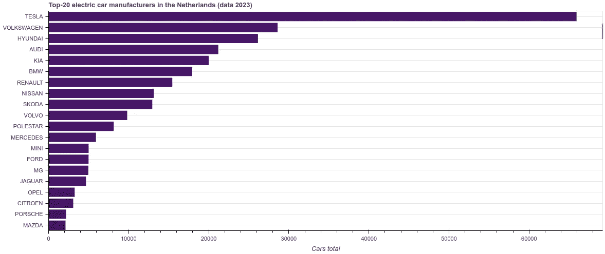

前 20 名电动车制造商，图片来源：作者

我对哪个特斯拉型号最受欢迎感到好奇。为了了解这一点，我们可以更改请求：

```py
 models_amout = session.query(Car.trade_name, func.count(Car.trade_name)).filter(Car.model == "TESLA").group_by(Car.trade_name).order_by(desc(func.count(Car.trade_name))).order_by(Car.trade_name).all()[::-1]
    ...
```

很明显，“Model 3”是撰写本文时最受欢迎的电动汽车：

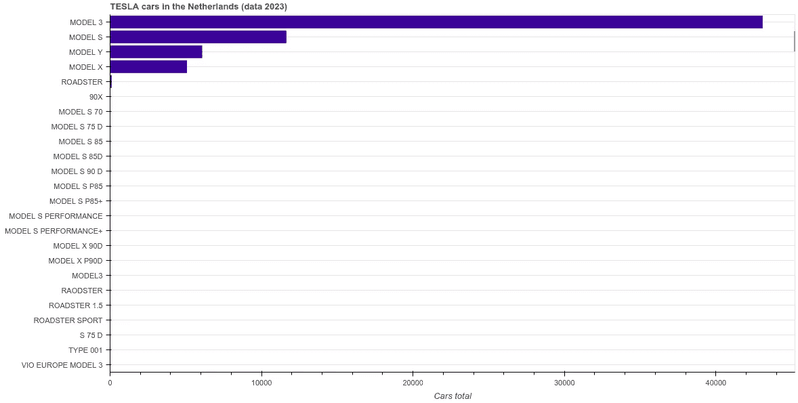

Tesla 车型柱状图，图像由作者提供

但我们也可以看到数据集显然需要更多清理：一些 Tesla 汽车被注册为“MODEL 3”，一些为“MODEL3”，一些汽车被保存为“ROADSTER”，一些为“RAODSTER”等等。

现在我们来按日期对**电动汽车注册情况**进行分组。为了使图表更清晰，我想按季度分组日期，但在 SQL 中提取季度的代码可能很庞大。相反，我将使用 SQL 按天分组注册，然后可以使用 Pandas 内部函数计算季度：

```py
with Session(rdw_db) as session:
    regs_amount = session.query(Car.first_registration, func.count(Car.first_registration)).filter(Car.is_electric == 1).group_by(Car.first_registration).order_by(Car.first_registration).all()

    df = pd.DataFrame(regs_amount, columns =['First registration NL', 'Amount'])
    df["First registration NL"] = df['First registration NL'].map(lambda d: datetime.datetime(d.year, d.month, d.day))
    df["Quarter"] = df['First registration NL'].dt.to_period('Q')

    data_per_quarter = df.groupby(['Quarter'], as_index=False)["Amount"].sum()
    dates = data_per_quarter['Quarter']
    amount = data_per_quarter['Amount']

    p = figure(x_axis_type='datetime', width=1600, height=500, 
               title=f"Electric car registrations in the Netherlands, 1992-2022")
    p.vbar(x=dates, top=amount, width=datetime.timedelta(days=3*22), line_color='black')
    p.xaxis[0].ticker.desired_num_ticks = 20
    p.yaxis.axis_label = "Cars total"
    show(p)
```

在这段代码中，我首先将 SQL 结果转换为 Pandas dataframe；然后我将 Python 的“date”对象转换为“datetime”（因为某些原因，季度计算仅与“datetime”有效）。代码几乎与第一部分相同，但这里我使用 Pandas 的“groupby.sum()”代替“size()”，因为从 SQL 中检索的数据已经按天分组。

结果很有趣：

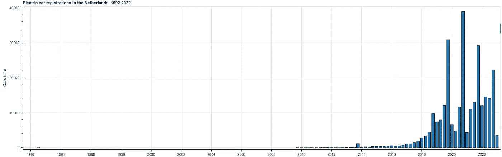

电动汽车注册情况，图像由作者提供

如第一部分所述，荷兰首辆电动汽车在 1992 年注册。那是一辆[Fiat Panda Elettra](https://www.fcaheritage.com/en-uk/heritage/stories/fiat-panda-elettra)，是一辆小型双座车，最高时速 70 km/h，续航 100 km，电源由 12 块 6V 铅酸电池提供。它是全国家唯一的电动汽车，15 年内没有其他电动汽车；接下来的 3 辆[Tesla Roadster](https://en.wikipedia.org/wiki/Tesla_Roadster_(first_generation))汽车直到 2009 年才注册。

现在我们来看看电动汽车的**价格分布**。我想绘制一个箱型图，为此，我需要了解每种车型的最小值、最大值和四分位数值：

```py
with Session(rdw_db) as session:
    request_models = session.query(Car.model).filter(Car.is_electric == 1).group_by(Car.model).all()

    def q0(x):
        return x.quantile(0.01)

    def q1(x):
        return x.quantile(0.25)

    def q3(x):
        return x.quantile(0.75)

    def q4(x):
        return x.quantile(0.99)

    models_data = {}
    for m in request_models:
        model_name = m[0]  # (AIWAYS,) => AIWAYS
        print("Processing", model_name)
        request_model = session.query(Car.price).filter((Car.is_electric == 1) & (Car.price > 0) & (Car.model == model_name)).all()
        df = pd.DataFrame(request_model)
        agg_data = {'price': ['size', 'min', q0, q1, 'median', q3, q4, 'max']}        
        models_data[model_name] = df.agg(agg_data)["price"]

    df = pd.concat(models_data, axis=1).transpose()
    display(df)
```

在这段代码中，我首先获取所有汽车型号的列表；然后获取每种型号的价格，并使用 Pandas 对这些价格进行汇总。然后将数据合并成一个单一的 dataframe。结果如下：

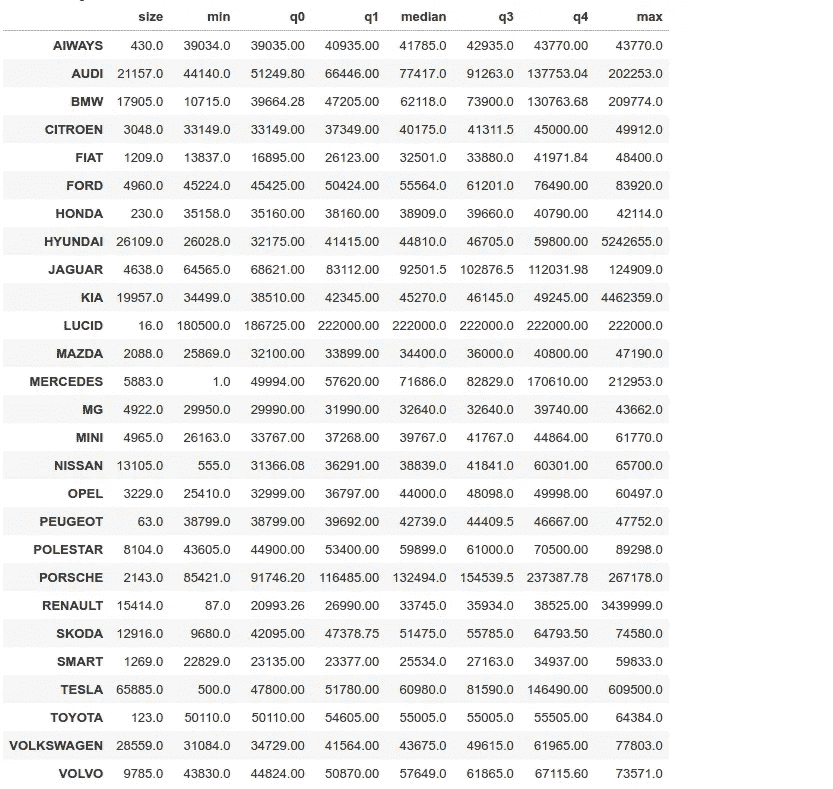

有了这个 dataframe，绘制箱型图变得简单：

```py
 # Sort models by price
    df = df.sort_values(by='median', ascending=True)

    models = df.index.values    
    v_min = df["q0"].values
    q1 = df["q1"].values
    q3 = df["q3"].values
    v_max = df["q4"].values

    # Draw
    palette = (Inferno10 + Magma10 + Plasma10 + Viridis10)[:models.shape[0]]
    source = ColumnDataSource(data=dict(models=models, 
                                        bottom=q1, 
                                        top=q3, 
                                        color=palette, 
                                        lower=v_min, 
                                        upper=v_max))

    p = figure(x_range=models, width=1900, height=500, title="Electric car prices distribution in the Netherlands")
    whisker = Whisker(base="models", upper="upper", lower="lower", source=source)
    p.add_layout(whisker)
    p.vbar(x='models', top='top', bottom='bottom', width=0.9, color='color', line_color="black", source=source)
    p.left[0].formatter.use_scientific = False
    p.y_range.start = 0
    show(p)
```

结果如下：

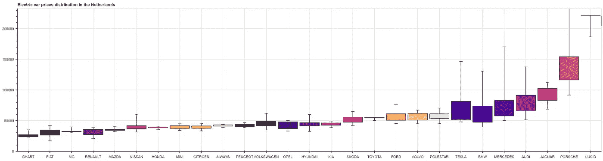

电动汽车制造商和价格箱型图，图像由作者提供

借助 SQLAlchemy，还可以轻松获取所有电动汽车的价格，并使用“np.histogram”方法构建**直方图**。代码几乎与第一部分相同，愿意的话可以自己尝试。

## 结论

分析真实数据集很有趣，结果显示 SQL 和 Pandas 的配合效果很好。数据的“繁重”检索和预处理可以使用 SQLAlchemy 完成，然后这些数据可以在 Pandas 中使用。

关于数据本身的处理，还有很多工作可以做。将这些数据与[Kaggle 电动车](https://www.kaggle.com/datasets/geoffnel/evs-one-electric-vehicle-dataset)数据集结合，寻找最大行驶距离、价格和汽车发布日期之间的相关性可能会很有趣（较新的车型应有更长的行驶距离）。我尝试过这样做，但两个数据集中的车型名称不匹配，而我又不是汽车专家，无法手动对每个型号进行处理。此外，正如之前所示，RDW 数据集需要更多的清理，名称也不一致。对这方面感兴趣的读者可以自行继续这些实验。

如果你喜欢这个故事，可以随时[订阅](https://medium.com/@dmitryelj/membership)Medium，你将会收到我新文章发布的通知，并且可以全面访问其他作者的数千篇故事。

感谢阅读。
