# 荷兰的电动汽车：使用 Python 进行探索性数据分析

> 原文：[`towardsdatascience.com/electric-cars-in-the-netherlands-exploratory-data-analysis-with-python-d01477949984`](https://towardsdatascience.com/electric-cars-in-the-netherlands-exploratory-data-analysis-with-python-d01477949984)

## 使用 Python、Pandas 和 Bokeh 进行数据分析和可视化

[](https://dmitryelj.medium.com/?source=post_page-----d01477949984--------------------------------)[](https://towardsdatascience.com/?source=post_page-----d01477949984--------------------------------) [Dmitrii Eliuseev](https://dmitryelj.medium.com/?source=post_page-----d01477949984--------------------------------)

·发表于 [Towards Data Science](https://towardsdatascience.com/?source=post_page-----d01477949984--------------------------------) ·16 min 阅读·2023 年 2 月 10 日

--

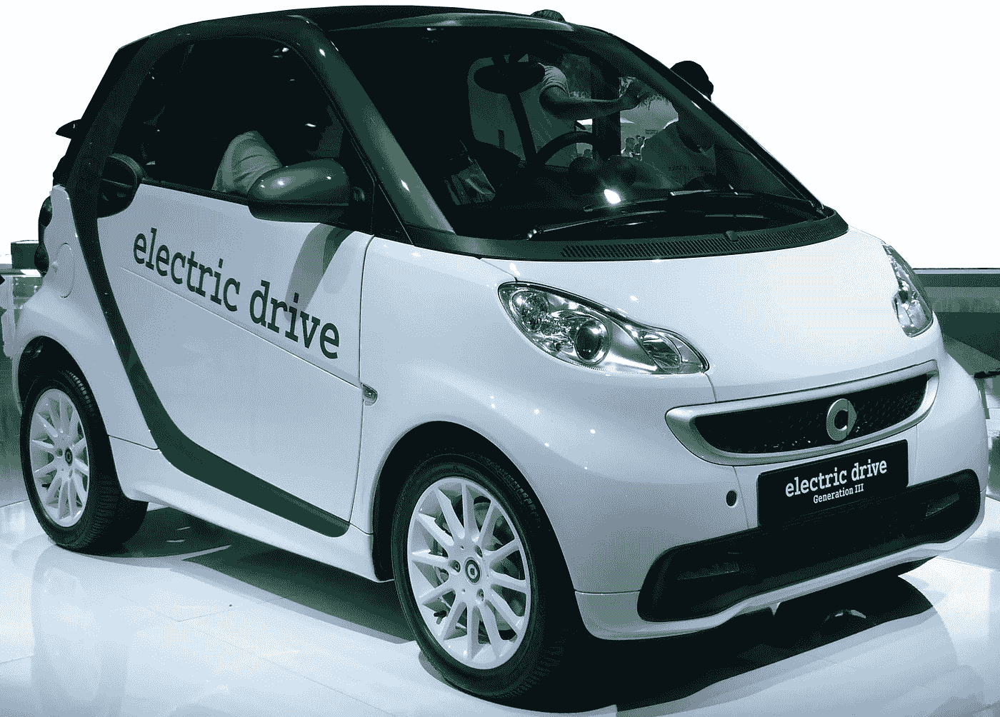

Smart EQ Car，图片来源 [`en.wikipedia.org/wiki/Smart_electric_drive`](https://en.wikipedia.org/wiki/Smart_electric_drive)

第一个电动汽车是什么时候注册的？（剧透：比大多数人想象的要早得多。）电动 Porsche 还是 Jaguar 更贵？探索性数据分析（EDA）不仅是建立每个数据管道的重要部分，而且还是一个相当有趣的过程。在本文中，我将使用荷兰 RDW（荷兰车辆管理局）公共数据集来查找有关电动汽车的信息。我们将看看哪些数据可以使用 Python、Pandas 和 Bokeh 提取和展示。

让我们开始吧。

# 加载数据

**RDW**（“Rijks Dienst Wegverkeer”，[`www.rdw.nl`](https://www.rdw.nl/)）是一个荷兰机构，负责处理荷兰的机动车和驾驶执照的审批与登记。作为一个公共政府机构，它的数据对所有人开放。对我们最感兴趣的是“Gekentekende voertuigen”（“带有车牌的车辆”）数据集。它可以在 [opendata.rdw.nl](https://opendata.rdw.nl/Voertuigen/Open-Data-RDW-Gekentekende_voertuigen/m9d7-ebf2) 上免费下载，使用公共领域许可证。文件大小约为 10 GB，包含自 1952 年以来在荷兰注册的所有车辆的信息。处理这样大小的文件也可能是一个挑战——这使得任务更加有趣。

我将使用 Jupyter Lab，这种方法比使用标准 IDE 更方便，因为每次启动项目时重新加载 10 GB 的文件似乎不是一个好主意。同时，我将使用 Pandas 进行处理，并使用 Bokeh 进行可视化。首先，让我们导入所需的库：

```py
import os
import pandas as pd
import numpy as np
import datetime

from bokeh.io import show, output_notebook, export_png
from bokeh.plotting import figure, output_file
from bokeh.models import ColumnDataSource, LabelSet, Whisker
from bokeh.palettes import *
output_notebook()
```

现在我们准备加载数据集。我们先尝试一种“天真”的方法：

```py
filename = "Open_Data_RDW__Gekentekende_voertuigen.csv"
df = pd.read_csv(filename)
display(df)
```

运行此代码后，PC 冻结了大约 30 秒……而且 Python 内核崩溃了。哎呀。它不仅加载缓慢，而且内存也不够。至少在我的电脑上，32 GB 的 RAM 对于这个任务是不够的。

如果我们无法将文件加载到内存中，可以逐行读取；这种方法从 IBM 主机和磁带驱动器时代就已经存在。让我们读取文件的前几行，看看里面有什么：

```py
filename = "Open_Data_RDW__Gekentekende_voertuigen.csv"
with open(filename, 'r') as f:
    header_str = f.readline()
    print(header_str)
    for _ in range(10):
        print(f.readline())
```

结果如下：

```py
Kenteken,Voertuigsoort,Merk,Handelsbenaming,Vervaldatum APK,Datum tenaamstelling,Bruto BPM,Inrichting,Aantal zitplaatsen,Eerste kleur,Tweede kleur,Aantal cilinders,Cilinderinhoud,Massa ledig voertuig,Toegestane maximum massa voertuig,Massa rijklaar,Maximum massa trekken ongeremd,Maximum trekken massa geremd,Datum eerste toelating,Datum eerste tenaamstelling in Nederland,Wacht op keuren,Catalogusprijs,WAM verzekerd,Maximale constructiesnelheid,Laadvermogen,Oplegger geremd,Aanhangwagen autonoom geremd,Aanhangwagen middenas geremd,Aantal staanplaatsen,Aantal deuren,Aantal wielen,Afstand hart koppeling tot achterzijde voertuig,Afstand voorzijde voertuig tot hart koppeling,Afwijkende maximum snelheid,Lengte,Breedte,Europese voertuigcategorie,Europese voertuigcategorie toevoeging,Europese uitvoeringcategorie toevoeging,Plaats chassisnummer,Technische max. massa voertuig,Type,Type gasinstallatie,Typegoedkeuringsnummer,Variant,Uitvoering,Volgnummer wijziging EU typegoedkeuring,Vermogen massarijklaar,Wielbasis,Export indicator,Openstaande terugroepactie indicator,Vervaldatum tachograaf,Taxi indicator,Maximum massa samenstelling,Aantal rolstoelplaatsen,Maximum ondersteunende snelheid,Jaar laatste registratie tellerstand,Tellerstandoordeel,Code toelichting tellerstandoordeel,Tenaamstellen mogelijk,Vervaldatum APK DT,Datum tenaamstelling DT,Datum eerste toelating DT,Datum eerste tenaamstelling in Nederland DT,Vervaldatum tachograaf DT,Maximum last onder de vooras(sen) (tezamen)/koppeling,Type remsysteem voertuig code,Rupsonderstelconfiguratiecode,Wielbasis voertuig minimum,Wielbasis voertuig maximum,Lengte voertuig minimum,Lengte voertuig maximum,Breedte voertuig minimum,Breedte voertuig maximum,Hoogte voertuig,Hoogte voertuig minimum,Hoogte voertuig maximum,Massa bedrijfsklaar minimaal,Massa bedrijfsklaar maximaal,Technisch toelaatbaar massa koppelpunt,Maximum massa technisch maximaal,Maximum massa technisch minimaal,Subcategorie Nederland,Verticale belasting koppelpunt getrokken voertuig,Zuinigheidsclassificatie,Registratie datum goedkeuring (afschrijvingsmoment BPM),Registratie datum goedkeuring (afschrijvingsmoment BPM) DT,API Gekentekende_voertuigen_assen,API Gekentekende_voertuigen_brandstof,API Gekentekende_voertuigen_carrosserie,API Gekentekende_voertuigen_carrosserie_specifiek,API Gekentekende_voertuigen_voertuigklasse
85XXXA,Personenauto,VOLKSWAGEN,CALIFORNIA,20230702,20220915,10437,kampeerwagen,,GROEN,Niet geregistreerd,5,2461,2088,2800,2188,700,2000,20010626,20010626,Geen verstrekking in Open Data,,Ja,,,,,,,0,4,0,0,,0,0,M1,,,r. in watergoot v. voorruit,2800,,,e1*96/79*0066*10,AJTCKX0,N1P00J2SGFM52B010U,1,0.03,292,Nee,Nee,,Nee,4500,0,0.00,2022,Logisch,00,Ja,07/02/2023 12:00:00 AM,09/15/2022 12:00:00 AM,06/26/2001 12:00:00 AM,06/26/2001 12:00:00 AM,,,,,,,,,,,,,,,,,,,,,,,,https://opendata.rdw.nl/resource/3huj-srit.json,https://opendata.rdw.nl/resource/8ys7-d773.json,https://opendata.rdw.nl/resource/vezc-m2t6.json,https://opendata.rdw.nl/resource/jhie-znh9.json,https://opendata.rdw.nl/resource/kmfi-hrps.json
85XXXB,Personenauto,PEUGEOT,3*RFN*,20230920,20210224,5162,hatchback,5,ZWART,Niet geregistreerd,4,1997,1194,1719,1294,625,1300,20010720,20010720,Geen verstrekking in Open Data,,Ja,,,,,,,4,4,0,0,,420,0,M1,,,op r. schroefveerkoker onder motorkap,1719,,,e2*98/14*0244*00,C,B,0,0.08,261,Nee,Nee,,Nee,3019,0,,2022,Logisch,00,Ja,09/20/2023 12:00:00 AM,02/24/2021 12:00:00 AM,07/20/2001 12:00:00 AM,07/20/2001 12:00:00 AM,,,,,,,,,,,,,,,,,,,,,D,,,https://opendata.rdw.nl/resource/3huj-srit.json,https://opendata.rdw.nl/resource/8ys7-d773.json,https://opendata.rdw.nl/resource/vezc-m2t6.json,https://opendata.rdw.nl/resource/jhie-znh9.json,https://opendata.rdw.nl/resource/kmfi-hrps.json
...
85XXXN,Personenauto,NISSAN,NISSAN MURANO,20240106,20111126,18921,stationwagen,5,ZWART,Niet geregistreerd,6,3498,1833,2380,1933,750,1585,20081206,20081206,Geen verstrekking in Open Data,,Ja,,,,,,,4,4,0,0,,484,0,M1,,,r. voorzitting by dwarsbalk,2380,Z51,,e1*2001/116*0478*00,A,A01,0,0.1,283,Nee,Nee,,Nee,3965,0,,2023,Logisch,00,Ja,01/06/2024 12:00:00 AM,11/26/2011 12:00:00 AM,12/06/2008 12:00:00 AM,12/06/2008 12:00:00 AM,,,,,,,,,,,,,,,,,,,,,E,,,https://opendata.rdw.nl/resource/3huj-srit.json,https://opendata.rdw.nl/resource/8ys7-d773.json,https://opendata.rdw.nl/resource/vezc-m2t6.json,https://opendata.rdw.nl/resource/jhie-znh9.json,https://opendata.rdw.nl/resource/kmfi-hrps.json
```

正如我们所看到的，有许多不同的数据字段，而我们实际上不需要所有这些字段。关于每辆车，我只想了解其类型、车牌、型号、价格和注册日期。这个数据库已经足够旧了，没有字段表示汽车是否为电动汽车。但至少，有一个字段包含“Number of cylinders”，这可以帮助我们排除*不是*电动汽车的车辆。

现在我们只有 7 个字段需要加载，在 Pandas 中，我们可以指定列列表，这会大幅减少数据大小。第二个技巧是将*pd.UInt32Dtype*指定给“Number of cylinders”和“Price”字段。我还想只查看“个人”汽车（荷兰语中的“Personenauto”），而不是卡车或公共汽车：

```py
cols = ['Kenteken', 'Voertuigsoort', 'Merk', 'Handelsbenaming', 'Aantal cilinders', 'Catalogusprijs']
cols_date = ['Datum eerste tenaamstelling in Nederland']

filename = "Open_Data_RDW__Gekentekende_voertuigen.csv"
df = pd.read_csv(filename, usecols=cols + cols_date, parse_dates=cols_date, 
                 dtype={"Catalogusprijs": pd.UInt32Dtype(), 
                        "Aantal cilinders": pd.UInt32Dtype()})
display(df)

df = df[df['Voertuigsoort'] == 'Personenauto']
df.info(memory_usage="deep")
```

现在文件已正确加载，正如“info”方法所示，内存使用量为 2.5 GB：

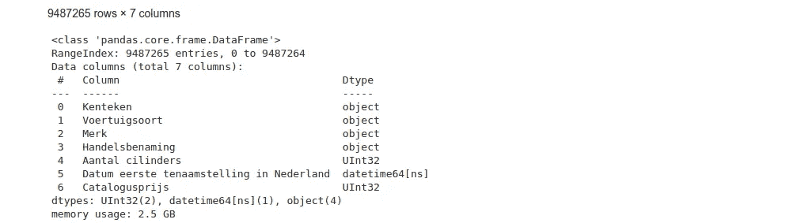

Dataset information, Image by author

由于文件大小较大，数据加载仍然需要较长时间。最简单的方法是将筛选后的数据集保存为新文件，并使用该文件进行进一步的实验：

```py
df.to_csv("Open_Data_RDW__Gekentekende_voertuigen_short.csv", sep=',', 
          encoding='utf-8')
```

这个文件只有 580 KB 大小，比原始的 10 GB 小得多，并且加载时没有造成任何问题。

我们也不再需要“Voertuigsoort”字段，删除这一列将释放一些 RAM 和屏幕空间。最后一步，让我们将数据字段从荷兰语翻译成英语——这对分析不是强制性的，但对读者会更方便：

```py
df = df.drop('Voertuigsoort', axis=1)

translations_dict_en_nl = {
                           'Kenteken': 'License plate', 
                           'Merk': 'Model', 
                           'Handelsbenaming': 'Trade name', 
                           'Aantal cilinders': 'Number of Cylinders', 
                           'Catalogusprijs': 'Catalog price',
                           'Datum eerste tenaamstelling in Nederland': 'First registration NL', 
                          }

df.rename(translations_dict_en_nl, axis='columns', inplace=True)
```

现在我们准备好了。

# 基本分析

开始时，让我们看看数据集的**主要属性**，例如数据样本和维度：

```py
display(df)

display(df.shape[0])

display(df.isna().sum())
```

*display(df)*方法向我们显示数据集的第一行和最后一行，这样我们可以看到数据的样子。第二行显示了记录的总数，这对计算可能有用，最后的请求将返回每列的空值数量。

输出如下：

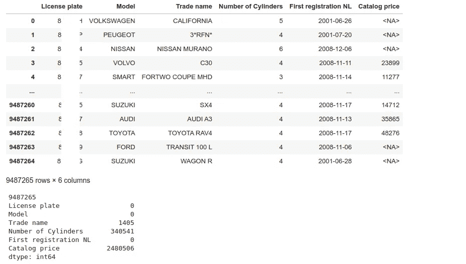

Dataframe properties, Image by author

我们有 9,487,265 条记录，每辆车都有车牌、型号和登记日期（这些字段可能是注册的必填项），但其他字段，如“贸易名称”或“目录价格”，在一些汽车中缺失。从技术上讲，我们现在不需要任何清理，但对于某些请求（如价格分布），在进行请求之前我们应该去除 Null 值。

作为这种方法的示例，让我们**排序数据**，以查看荷兰最贵和最便宜的汽车：

```py
df[df['Catalog price'].notna()].sort_values(by=['Catalog price'], 
                                            ascending=False)
```

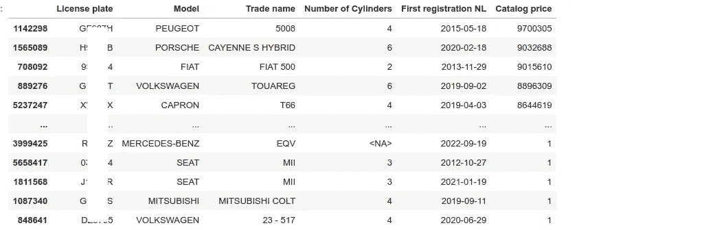

按价格排序的数据框，作者图片

结果很有趣。第一名是“PEUGEOT 5008”，价格为 9,700,305 欧元，这很奇怪，因为在 Google 上它的价格大约是 41,000 欧元——可能是数据库中的错误，或者车主为升级花了很多钱 ;) 或者这可能是全新的电动“PEUGEOT E-5008”，但它计划在 2024 年才发布。不管怎样，已经可以看出公共数据并不总是一致的。第二名的“PORSCHE CAYENNE”的价格可能是实际的。对于其他车型，很难判断，我不是豪华车专家，如果有人知道更多，请在下面的评论中写出来。至于最便宜的汽车，它们的价格为 1 欧元。可能它们作为“零件”从二手市场进口到荷兰，因此车主申报了最低可能的价值。

# 数据转换

让我们检查一下数据是否适合进一步分析。列表中的第一个汽车型号是“PEUGEOT”，让我们显示所有具有相同名称的汽车。“unique”方法将仅返回列中的**唯一值**：

```py
display(df[df['Model'].str.contains("PEUGEOT", case=False)]['Model'].unique())
```

输出如下：

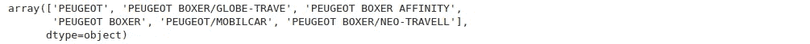

“Peugeot”型号请求，作者图片

我们可以看到数据库中的模型名称不一致。一些汽车的名称为“PEUGEOT”，其他汽车则被保存为“PEUGEOT BOXER”或“PEUGEOT/MOBILCAR”。为了按模型名称分组汽车，首个单词“PEUGEOT”就足够了，名称的右侧部分可以去掉。将所有字符转换为大写字母也更好，因为理论上汽车型号可以写作“PEUGEOT”或“Peugeot”。为了确保没有多余的字符，我会调用“strip”方法，该方法可以去除字符串中的多余空格。我创建了一个名为“name_normalize”的方法，它执行这种类型的转换：

```py
def model_normalize(s_val: str):
    """ Convert 'PEUGEOT BOXER/GLOBE-TRAVE ' to 'PEUGEOT' """
    if s_val and isinstance(s_val, str) and len(s_val) > 0:
        return s_val.replace("-", " ").replace("/", " ").split()[0].upper().strip()
    return None
```

可以使用正则表达式进行更灵活的转换，但这段代码对于我们的任务来说已经足够了。当我们有了这个方法后，我们可以使用“map”函数转换 Pandas 数据框中的所有行：

```py
df["Model"] = df['Model'].map(lambda s: model_normalize(s))
```

现在让我们处理“贸易名称”字段：

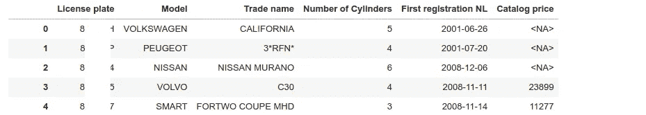

“贸易名称”样本，作者图片

如我们所见，大多数汽车在第一个字段中有制造商名称，在第二个字段中有商品名称，如截图中的“VOLVO” + “C30”。但一些其他汽车在两个字段中都有重复的制造商名称，如“NISSAN” + “NISSAN MURANO”。通过删除重复项使其更一致，并且作为奖励，这也会使数据集稍微变小：

```py
def name_normalize(model: str, trade_name: str):
    """ Remove duplicates and convert the name to upper case """
    if isinstance(trade_name, str) and len(trade_name) > 0:
        name = trade_name.upper().strip()
        # Remove duplicates from model and trade name: 
        # ("TESLA", "TESLA MODEL 3") => ("TESLA", "MODEL 3")
        if name.split()[0] == model:
            # "TESLA MODEL 3" => [TESLA, MODEL, 3] => "MODEL 3"
            return ' '.join(name.split()[1:])  
        return name
    return None
```

这里的*isinstance*检查很重要，因为“商品名称”字段是可选的，一些记录中有 None 而不是字符串，获取*len(None)*显然会导致方法崩溃。

要更新数据框，我们可以使用 Pandas 中的“apply”方法：

```py
df["Trade name"] =  df.apply(lambda x: name_normalize(model=x['Model'], 
                                           trade_name=x['Trade name']), 
                                           axis=1)
```

让我们检查一下结果。拥有这些数据后，我们可以提取一些有用的信息，例如，看看**荷兰最受欢迎的前 50 款汽车**：

```py
n_top = 50
all_models = df_models["Model"].to_numpy()
models, counts = np.unique(all_models, return_counts=True)
cs = counts.argsort()  # Take sort indexes from 'counts' array
x = counts[cs][-n_top:]
y = models[cs][-n_top:]

p = figure(y_range=y, width=1400, height=600, 
           title="Top-%d cars in the Netherlands (data 2023)" % n_top)
p.hbar(right=x, y=y, height=0.8, color=Viridis256[:n_top])
p.xgrid.grid_line_color = None
p.x_range.start = 0
p.below[0].formatter.use_scientific = False
show(p)
```

*np.unique*方法可以计算每个模型的数量，我们不需要手动进行。这里第二个棘手的部分是同时对两个数组（汽车数量和汽车模型）进行排序，我们使用*counts.argsort*方法获得排序索引序列，然后将相同的索引应用于“models”数组。

[Bokeh](https://bokeh.org)库非常适合绘制这样的图表：

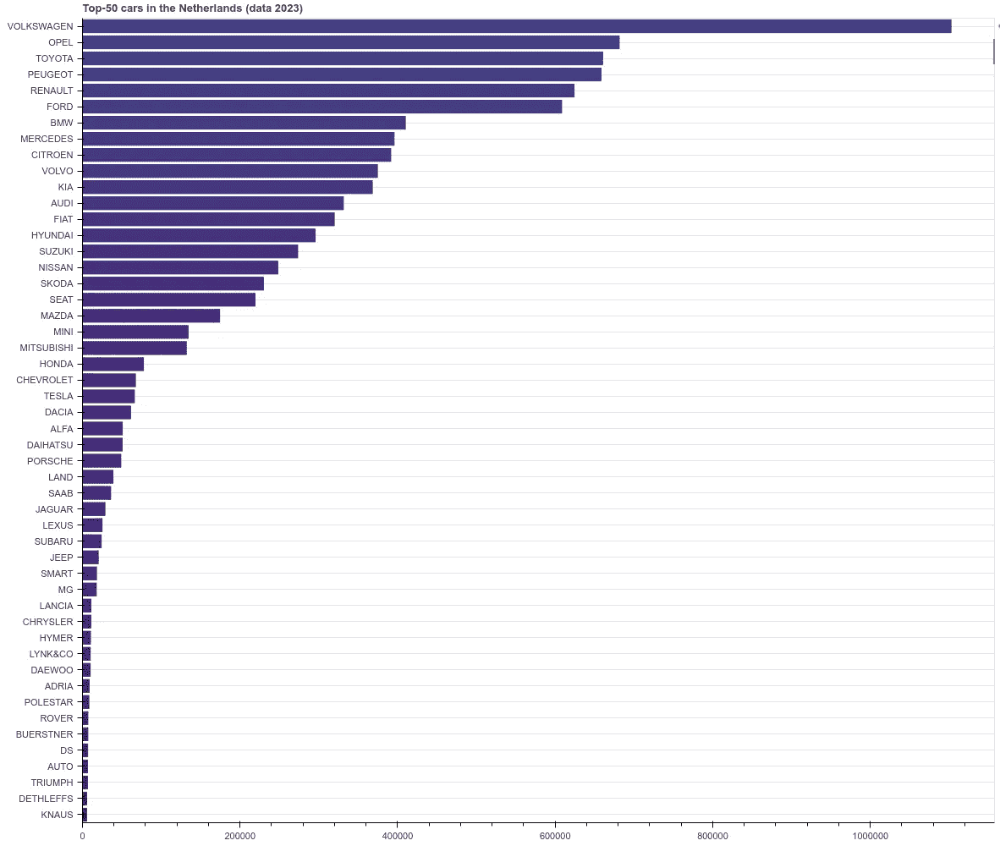

顶级汽车模型条形图，作者提供的图像

数据转换的下一部分更棘手——我们需要确定汽车是否电动。这很棘手，因为每个制造商都有自己命名系统，并且没有通用规则。对于一些品牌，如“TESLA”，这很简单——所有特斯拉汽车都是电动的。对于其他型号，如“HYUNDAI IONIQ”或“NISSAN LEAF”，名称中存在特定关键字，而对于其他一些汽车，根本没有明确的规则（“HONDA E”是电动的，但“HONDA EE8”则不是）。

通过 Google 搜索和汽车制造商的网站，我创建了这个字典：

```py
electric_cars = {
    "AIWAYS": ['U5', 'U6'],
    "AUDI": ['E-TRON'],
    "BMW": ['I3', 'I4', 'I7', 'IX'],
    "CITROEN": ['E-C4'],
    "FIAT": ['500E', 'ELETTRA'],
    "FORD": ['MACH-E'],
    "HONDA": ['"E"', '"E ADVANCE"'],  
    "HYUNDAI": ['IONIQ', 'KONA'],
    "JAGUAR": ['I-PACE'],
    "KIA": ['NIRO', 'E-SOUL'],
    "LEXUS": ['RZ'],
    "LUCID": ['AIR'],
    "MAZDA": ['MX-30'],
    "MERCEDES": ['EQA', 'EQB', 'EQC', 'EQS', 'EQV'],
    "MG": ['ZS EV'],
    "MINI": ['COOPER SE'],
    "NISSAN": ['ALTRA', 'ARIYA', 'EVALIA', 'LEAF', 'NUVU'],
    "OPEL": ['AMPERA-E', 'COMBO-E', 'CORSA-E', 'MOKKA-E', 'VIVARO-E', 'ZAFIRA-E'],
    "PEUGEOT": ['E-208', 'E-2008', 'E-RIFTER', 'E-TRAVELLER'],
    "POLESTAR": ['2', '3'],
    "PORSCHE": ['TAYCAN'],
    "RENAULT": ['MASTER', 'TWINGO', 'KANGOO ELEC', 'ZOE'],
    "SKODA": ['ENYAQ'],
    "SMART": ['EQ'],
    "TESLA": [''],
    "TOYOTA": ['BZ'],
    "VOLKSWAGEN": ['ID.3', 'ID.4', 'ID.5', 'E-GOLF'],
    "VOLVO": ['C40', 'XC40']
}
```

现在我可以轻松检查特定关键字是否出现在汽车模型中，或者是否有模型名称的直接匹配。最后检查，我可以使用数据库中拥有的气缸数。如果这个值大于零，那么我们知道这辆车*不是*完全电动的。最终的方法（好吧，也许不是最终的，但对于我们的任务来说或多或少有效）如下所示：

```py
def is_electric(model: str, trade_name: str, cylinders: int):
    """ Determine if the car is electric """
    if isinstance(cylinders, int) and cylinders > 0:
        return False
    for e_model, e_names in electric_cars.items():
        if model == e_model:
            for e_name in e_names:
                if trade_name and (e_name in trade_name or e_name.replace('"', '') == trade_name):
                    return True
                if trade_name is None and len(e_name) == 0:
                    return True
    return False
```

作为一种单元测试，我们可以使用不同的参数来使用此方法：

```py
print(is_electric("AUDI", "E-TRON S SPORTBACK 55 QUATTRO"))
print(is_electric("AUDI", "80 COUPE"))

print(is_electric("HONDA", "E"))
print(is_electric("HONDA", "EE 8"))
print(is_electric("HONDA", "INTEGRA TYPE R"))

print(is_electric("NISSAN", "MICRA"))
print(is_electric("NISSAN", "LEAF 62KWH"))

print(is_electric("TESLA", "ANY"))
```

使用这个函数，我们可以轻松地将新字段添加到数据框中，并仅保留电动汽车：

```py
df["Electric"] = df.apply(lambda x: is_electric(model=x['Model'], 
                                       trade_name=x['Trade name'], 
                                       cylinders=x['Number of Cylinders']), 
                          axis=1)

df_electric = df.query("Electric == True").drop(columns=['Number of Cylinders',
                                                         'Electric'])
```

如果一切都做得正确，我们应该得到这样的结果：

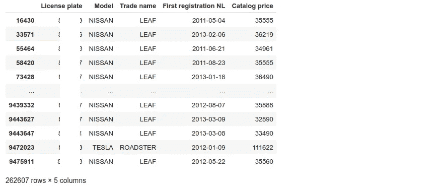

电动汽车数据框，作者提供的图像

# 分析

现在我们终于准备好开始分析荷兰的电动汽车了。

作为热身，计算**均值、标准差和百分位数**是很简单的：

```py
print(f"Cars total: {df.shape[0]}")
print(f"Cars electric: {df_electric.shape[0]} ({100*df_electric.shape[0]/df.shape[0]:.2f}%)")

# Calculate percentiles - all cars

prices = df[df['Catalog price'].notna()]['Catalog price'].to_numpy()

print("Price mean:", np.mean(prices))
print("Price standard deviation:", np.std(prices))
print("Percentiles [5, 25, 50, 75, 95]:", np.percentile(prices, [5, 25, 50, 75, 95]))

# Calculate percentiles - electric cars

prices = df_electric[df_electric['Catalog price'].notna()]['Catalog price'].to_numpy()

print("Electric cars price mean:", np.mean(prices))
print("Electric cars price standard deviation:", np.std(prices))
print("Electric cars percentiles [5, 25, 50, 75, 95]:", np.percentile(prices, [5, 25, 50, 75, 95]))
```

输出结果如下：

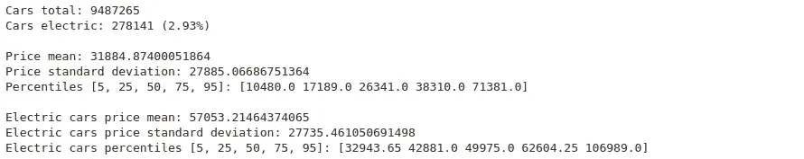

均值、标准差和百分位数结果，作者提供的图像

我们可以看到荷兰共有 9,487,265 辆汽车，其中仅有 278,141 辆（2.93%）是电动汽车。好吧，到 2023 年，我们只是这个时代的开始。根据[rvo.nl](https://www.rvo.nl/sites/default/files/2021/12/electric-vehicles-statistics-in-the-netherlands.pdf)的报告，2019 年电动汽车占比为 1.22%，2020 年为 1.98%，2021 年为 2.55%，因此这些数字在增长，未来 10-20 年比较结果会很有趣。至于非电动汽车的价格，第 95 百分位数为€71,381。这意味着荷兰 95%的汽车价格低于此值。电动汽车则处于更“高端”的区间——平均价格为€49,975，第 95 百分位数为€106,989。

荷兰第一辆电动汽车是什么时候出现的，这个数量随着时间的推移有何变化？这个问题很容易回答。让我们构建一个**每季度汽车注册数量**的柱状图。为此，我需要在 Pandas 数据框中创建一个新的*Quarter*字段，并按此字段分组数据。我们可以从 Python 的“datetime”对象中提取季度号，但 Pandas 已经有所有需要的转换器：

```py
reg_dates = df_electric[["Model", "Trade name", "First registration NL"]].copy()
reg_dates["Quarter"] = reg_dates['First registration NL'].dt.to_period('Q')

data_per_year = reg_dates.groupby(['Quarter'], as_index=False).size()

dates = data_per_year['Quarter']
amount = data_per_year['size']

p = figure(x_axis_type='datetime', width=1600, height=500, 
           title=f"Electric car registrations in the Netherlands, 1992-2022")
p.vbar(x=dates, top=amount, width=datetime.timedelta(days=3*22), line_color='black')
p.xaxis[0].ticker.desired_num_ticks = 30
p.xgrid.grid_line_color = None
show(p)
```

结果很有趣：

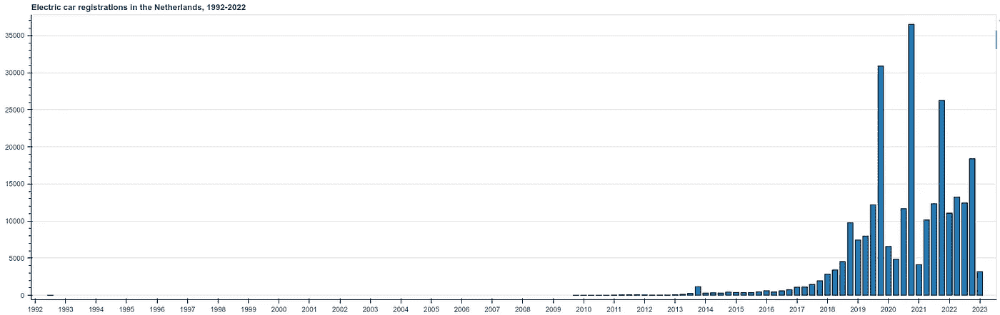

电动汽车注册情况，作者提供的图片

第一辆（在接下来的 15 年里全国唯一的一辆！）电动汽车于 1992 年在荷兰注册，距今已有 30 多年。我们可以轻松地在数据集中找到，它是一辆[Fiat Panda Elettra](https://www.fcaheritage.com/en-uk/heritage/stories/fiat-panda-elettra)，这是一款最高时速 70 公里、续航 100 公里的两座小车，电源由 12 个 6V 铅酸电池提供。接下来的 3 辆[Tesla Roadster](https://en.wikipedia.org/wiki/Tesla_Roadster_(first_generation))仅在 2009 年注册。第二件有趣的事情是季节性模式——很容易看到每年年底的注册数量最大（更详细的图表将在本文末尾展示）。

拥有电动汽车数据框后，我们也很容易看到**价格分布**：

```py
df_prices = df_electric[df_electric['Catalog price'].notna()]
prices_to_display = df_prices.query('`Catalog price` < 170000')['Catalog price'].to_numpy()

hist_e, edges_e = np.histogram(prices_to_display, density=False, bins=50)

# Draw
p = figure(width=1400, height=500, 
           title=f"Electric cars price distribution in the Netherlands ({df_electric.shape[0]} cars total)")
p.quad(top=hist_e, bottom=0, left=edges_e[:-1], right=edges_e[1:], line_color="darkblue")
p.x_range.start = 15000
p.x_range.end = 150000
p.y_range.start = 0
p.xaxis[0].ticker.desired_num_ticks = 20
p.left[0].formatter.use_scientific = False
p.below[0].formatter.use_scientific = False
p.xaxis.axis_label = "Price, EUR"
p.yaxis.axis_label = "Amount"
show(p)
```

输出如下：

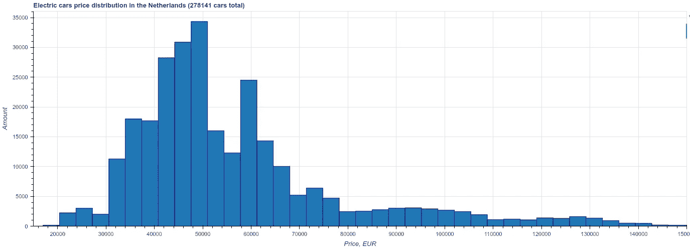

电动汽车价格分布，作者提供的图片

如我们所见，分布大多向右偏斜。在计算直方图之前，我去除了右侧的异常值，否则由于 2–3 辆价格超过 1 百万欧元的汽车，图像几乎是空的。

使用直方图我们可以看到，大多数荷兰的电动汽车价格在€40–70K 范围内，但我们不知道具体是哪些车型。我们可以更详细地探索价格——让我们**按车型名称分组价格**：

```py
df_price = df_electric[df_electric['Catalog price'].notna()]

def q0(x):
    return x.quantile(0.01)

def q1(x):
    return x.quantile(0.25)

def q3(x):
    return x.quantile(0.75)

def q4(x):
    return x.quantile(0.99)

agg_data = {'Catalog price': ['size', 'min', q0, q1, 'median', q3, q4, 'max']}

prices = df_price[['Model', 'Catalog price']].groupby('Model', as_index=False).agg(agg_data)
display(prices)
```

在这里，我将所有汽车按型号分组，并将数据汇总到一个表中：

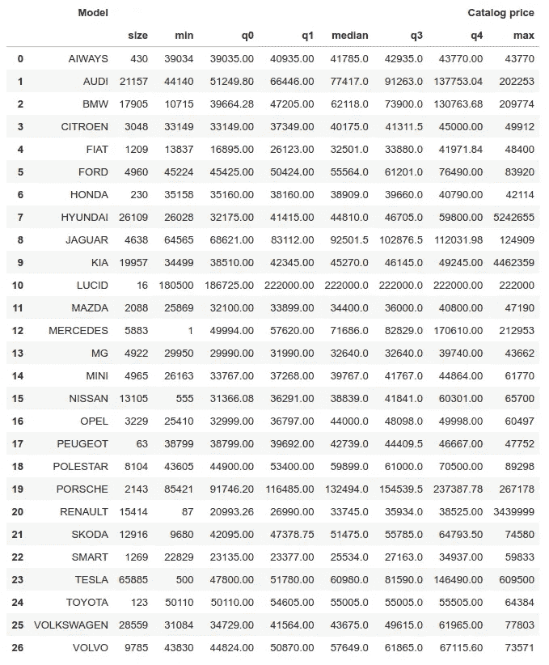

按车型名称分组的电动汽车，作者提供的图片

让我们以**箱形图**的形式绘制这些数据：

```py
prices = prices.sort_values(by=('Catalog price', 'median'), ascending=True)

models = prices["Model"].to_numpy()
q1 = prices["Catalog price"]["q1"].to_numpy()
q3 = prices["Catalog price"]["q3"].to_numpy()
v_min = prices["Catalog price"]["q0"].to_numpy()
v_max = prices["Catalog price"]["q4"].to_numpy()

palette = (Inferno10 + Magma10 + Plasma10 + Viridis10)[:models.shape[0]]
source = ColumnDataSource(data=dict(models=models, 
                                    bottom=q1, 
                                    top=q3, 
                                    color=palette, 
                                    lower=v_min, 
                                    upper=v_max))

p = figure(x_range=models, width=1400, height=500, 
           title=f"Electric cars price distribution in the Netherlands") 
whisker = Whisker(base="models", upper="upper", lower="lower", source=source)
p.add_layout(whisker)
p.vbar(x='models', top='top', bottom='bottom', width=0.9, color='color', 
       line_color="black", source=source)

p.left[0].formatter.use_scientific = False
p.y_range.start = 0
show(p)
```

在这里，我按价格对所有车型进行了排序。结合箱线图，我们可以清楚地看到价格分布的情况：

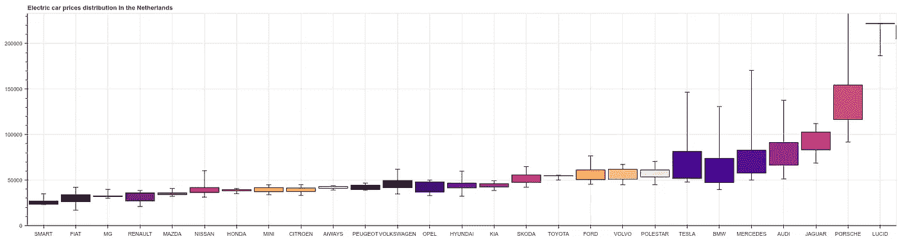

电动汽车制造商和价格箱线图，图片由作者提供

不足为奇的是，分布顶部的是著名的豪华车，如保时捷、捷豹或 Lucid（顺便说一下，我之前从未听说过）。但更令人惊讶的是，这个分布中最便宜的车并不是最受欢迎的。例如，在荷兰只有 1,269 辆“Smart”和 15,414 辆“Renault”，相比之下，65,885 辆“Tesla”模型不到 25%。我甚至怀疑图表中是否有错误，但[2021 年英国汽车销售分布](https://cleantechnica.com/2021/10/28/tesla-model-3-20-of-uk-electric-car-sales/)总体上看起来是一样的。

**最大续航** **（公里）**可能是选择电动汽车时一个重要的因素，构建一个显示续航与价格相关性的图表会很有趣。但遗憾的是，RDW 数据集中没有“续航”字段。一些不同电动汽车的值可以从[Kaggle 数据集](https://www.kaggle.com/datasets/geoffnel/evs-one-electric-vehicle-dataset)中获得。但实际上，两张表之间没有直接匹配。例如，数据集中有一个“E-TRON SPORTBACK 50 QUATTRO”模型。在 RDW 数据中，有两个类似名称的车型，“E-TRON SPORTBACK 50”和“Q4 SPORTBACK 50 E-TRON”，但我不确定这些车型是否实际上是一样的。每个型号名称中的字母可能都有自己的含义，没有汽车专家的知识，很难匹配所有汽车制造商的所有名称。不过，有兴趣的读者可以自行尝试。

至少，拥有来自 RDW 数据的汽车价格和注册日期，我们可以构建**散点图：**

```py
df_data = df_electric[df_electric['Catalog price'].notna()]

models = df_data['Model'].unique()

p = figure(x_axis_type='datetime', width=1400, height=800, 
           title="Electric car prices and registrations in the Netherlands")
palette = (Inferno10 + Magma10 + Plasma10 + Viridis10)[:len(models)]
draw_ratio = 15
for ind, model in enumerate(models):
    df_model = df_data[df_data['Model'] == model]
    if df_model.shape[0]//draw_ratio == 0:
        continue

    df_model = df_model.sample(df_model.shape[0]//draw_ratio)
    x = df_model['First registration NL'].to_numpy()
    y = df_model['Catalog price'].to_numpy()
    p.scatter(x, y, size=2, color=palette[ind], legend_label=model[:3]) 

p.left[0].formatter.use_scientific = False
p.legend.orientation = "horizontal"
p.legend.location = "top_center"
p.legend.click_policy = "mute"
p.xaxis[0].ticker.desired_num_ticks = 20
show(p)
```

在这里，我将所有汽车按型号名称分组，然后从每个子集随机抽取 1:15 的样本（显然，我们不能在一个图上绘制所有 216316 辆车）。Bokeh 的一个非常棒的功能是能够通过点击“静音”标签，例如，仅用鼠标点击突出显示 Tesla 汽车：

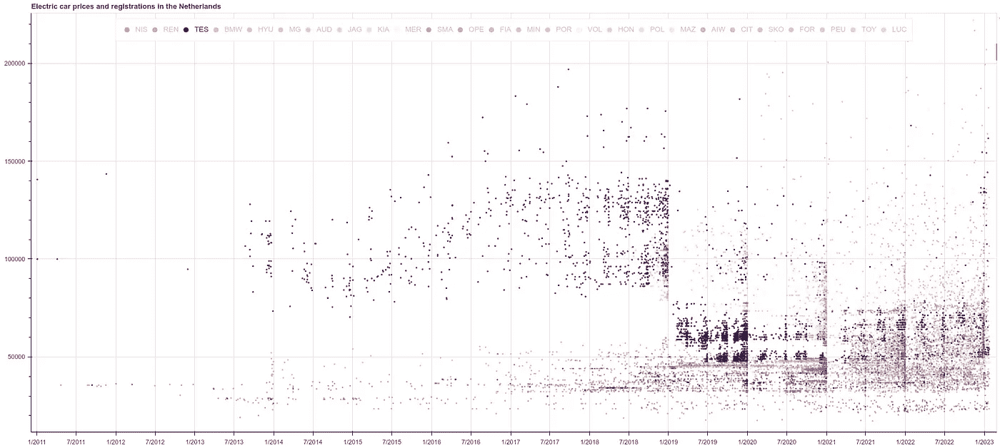

价格和注册日期散点图，图片由作者提供

看到季节性模式相当有趣——看起来汽车注册每年“波动”4 次，每年年底会有大量新车注册。也许有些客户特别等待年末促销，或者只是想以新车开始新的一年？第二个有趣的点是，在 2019 年出现了大量中等价格范围的电动汽车。在此之前，选择仅限于便宜的和高端的车型（当然，相对便宜，因为大多数电动汽车与汽油车相比都属于高端细分市场）。

# 结论

如我们所见，使用来自“现实世界”的数据集带来了一些挑战。这不仅仅是数据规模，还有数据不完整或不一致，甚至数据字段中的语法错误（例如，我看到一个“Tesla Raodster”而不是“Tesla Roadster”），等等。与此同时，探索这些数据并发现其中有趣的模式要有趣得多，我建议读者自己做类似的实验。这项分析是为了娱乐和自我教育目的，显然还有很大的改进空间，例如寻找更好的检测方法以判断汽车是否是电动的，找出不同型号的续航里程，等等。而荷兰政府保持这些数据公开并对所有人开放，这很好。如果有人知道其他国家的数据集，请在下方评论中添加链接，我将尝试做类似的分析并在下一个帖子中比较结果。

如果你喜欢这个故事，可以随时[订阅](https://medium.com/@dmitryelj/membership) Medium，你将获得新文章发布的通知，并可以全面访问其他作者的数千个故事。

感谢阅读。
