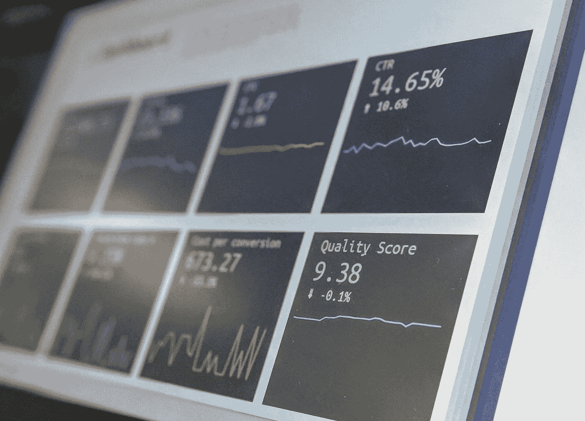
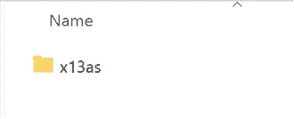
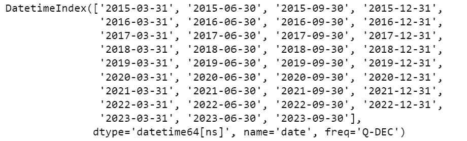
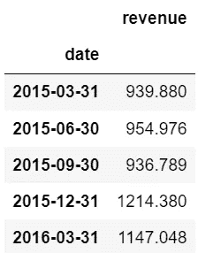
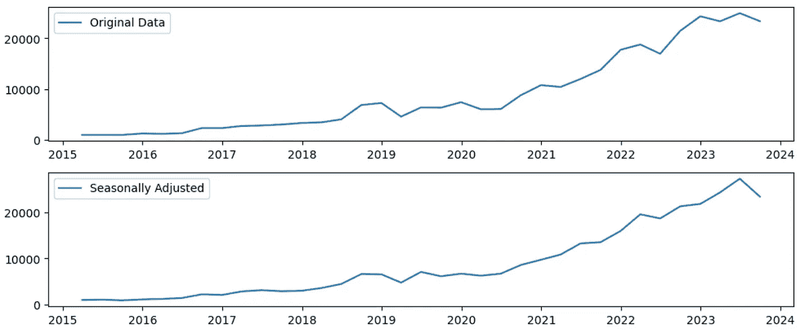
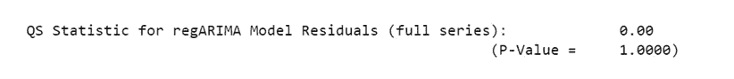
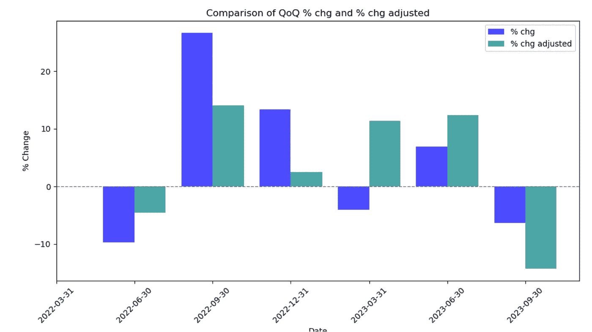
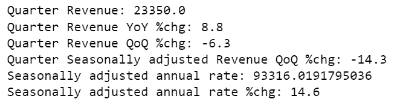

# 提升你的商业分析：季节调整的逐步指南

> 原文：[`towardsdatascience.com/elevate-your-business-analytics-step-by-step-guide-to-seasonal-adjustment-74434e8cceca`](https://towardsdatascience.com/elevate-your-business-analytics-step-by-step-guide-to-seasonal-adjustment-74434e8cceca)

[](https://medium.com/@juanjosemunozp?source=post_page-----74434e8cceca--------------------------------)[](https://towardsdatascience.com/?source=post_page-----74434e8cceca--------------------------------) [Juan Jose Munoz](https://medium.com/@juanjosemunozp?source=post_page-----74434e8cceca--------------------------------)

·发布于 [Towards Data Science](https://towardsdatascience.com/?source=post_page-----74434e8cceca--------------------------------) ·7 分钟阅读·2023 年 11 月 27 日

--

**我们都理解将时间序列拆解为其组成部分以进行预测的重要性，但在商业绩效分析中却没有得到足够的重视。**

作为一名商业绩效分析师，我经常报告月度收入绩效并跟踪商业周期趋势。为了处理季节性变化的问题，我依赖于同比比较。问题在于，这些比较依赖于 12 个月前的数据，这意味着你会晚于趋势，这可能会带来毁灭性的后果。经济学家和统计学家有更复杂的方法来应对季节性波动，并在业务周期发生变化后尽快捕捉到这些变化。

**经济学家分解宏观经济数据以报告季节调整后的数据，并依赖于季节调整后的指标的月度（或季度）变化，以及时了解经济活动。**



图片由 [Stephen Dawson](https://unsplash.com/@dawson2406?utm_source=medium&utm_medium=referral) 提供，来源于 [Unsplash](https://unsplash.com/?utm_source=medium&utm_medium=referral)

**你无需成为统计学家或经济学家来跟上你的商业趋势**。美国人口普查局将他们的 X-13ARIMA-SEATS 季节调整软件公开发布，下面是如何在 Python 中利用它来提升你的商业分析。

# 下载 X 13 ARIMA SEATS

**你可以利用 Statsmodels X13_arima_analysis 这个 Python 封装器来调整你的商业数据以应对季节波动。**

首先，你需要从 [Census 网站](https://www.census.gov/data/software/x13as.X-13ARIMA-SEATS.html#list-tab-635278563) 下载 X-13ARIMA-SEATS 可执行文件。

最新版本——60 版（撰写时）对我不起作用，所以我下载了之前的版本——59 版。

下载完成后，你可以在你选择的文件夹中解压文件。



解压后，你应该得到一个像这样的文件夹。（图像来源于作者）

# 设置你的 Python 笔记本。

除了导入你通常用于数据分析的包外，你还需要**设置环境变量 X13PATH 为解压文件夹的路径**。如果跳过这一步，你在运行分析时会出现错误。

```py
import pandas as pd
import numpy as np
import matplotlib.pyplot as plt

from statsmodels.tsa.x13 import x13_arima_analysis

from datetime import datetime
from dateutil.relativedelta import relativedelta
import os

# Set the X13PATH environmental variable to the folder where you unzipped the X-13 executables
os.environ['X13PATH'] = r"C:\...\x13as_ascii-v1-1-b59\x13as"
```

# 导入并准备你的数据

在这个示例中，我使用了公开报告的特斯拉季度收入。

**要运行 X13_arima_analysis，你需要至少 3 年的数据**以便模型捕捉季节性模式。你的数据应为每月或每季度。你需要将日期列设置为数据框的索引，并确保指定频率。

```py
#load data
df = pd.read_excel("TSLA_Revenue.xlsx")

#set date as index
df.set_index('date', inplace=True)

#set frequency as quarter
df= df.resample('Q').asfreq()

#View index
df.index
```



确保频率设置为季度或每月

```py
# display data
df.head()
```



收入单位为百万美元

这些是你需要的唯一转换。

# 实例化 x_13_arima_analysis

```py
# Run X-13ARIMA-SEATS decomposition
results = x13_arima_analysis(df['revenue'])
```

**x_13_arima_analysis 结合了 ARIMA 建模和 SEATS 过滤来分解时间序列数据**。分析中的 ARIMA（自回归积分滑动平均）部分基于数据的过去值和误差对数据进行建模。SEATS（ARIMA 时间序列中的信号提取）部分专注于隔离时间序列成分（趋势、周期、季节性、异常）

**x_13_arima 提供通过从实际收入中去除季节性成分来获得季节调整后的收入**。

```py
# Get the seasonally adjusted series
seasonally_adjusted = results.seasadj

# Visualize revenue and seasonally adjusted revenue
plt.figure(figsize=(10, 6))
plt.subplot(311)
plt.plot(df.index, df['revenue'], label='Original Data')
plt.legend()

plt.subplot(312)
plt.plot(df.index, seasonally_adjusted, label='Seasonally Adjusted')
plt.legend()

plt.tight_layout()
plt.show()
```



季节性调整去除了季节性模式（图像来源于作者）

# 验证

**在这次分析中，我们不专注于预测能力。相反，我们想要分析季节调整后的数据，以便紧密跟随我们的业务趋势。**

然而，我们仍需检查模型是否成功分解了时间序列。

**你可以使用 QS 统计量来评估分析的稳健性**。目标是使 QS 统计量低于 1。你的 QS 统计量结果越接近 0，就越表示残差与白噪声不可区分或不相关。

```py
print(results.results)
```



结果打印了大量信息。你需要滚动直到找到 QS 统计量。

# 解读结果

现在我们有了季节调整后的数据，我们可以用两种方式进行业务趋势分析。

**首先，我们可以关注季节调整后收入的季度环比增长。**

```py
# Calculate the % chg to the previous quarter
df['QoQ %chg'] = df['revenue'].pct_change() * 100

df['QoQ% chg adjusted'] = df['seasadj'].pct_change() * 100

# Getting the index positions for x-axis locations
x = range(len(df.index))

# Plotting the bar chart
plt.figure(figsize=(10, 6))

bar_width = 0.40

plt.bar(x, df['QoQ %chg'], width=bar_width, align='center', label='% chg', color='blue', alpha=0.7)
plt.bar([i + bar_width for i in x], df[f'QoQ% chg adjusted'], width=bar_width, align='center', label='% chg adjusted', color='teal', alpha=0.7)

# Enhance the visualization
plt.axhline(y=0, color='gray', linestyle='--', linewidth=1)
plt.xlabel('Date')
plt.ylabel('% Change')
plt.title(f'Comparison of {metric_name} % chg and % chg adjusted')
plt.legend()
plt.xticks([i + bar_width/2 for i in x], df.index.strftime('%Y-%m-%d'), rotation=45)
plt.tight_layout()

plt.show()
```



QoQ 变化（图像来源于作者）

**2023 年第一季度环比百分比变化突出显示了使用季节调整数据的重要性**。未经调整的情况下，收入相比上季度有所下降；然而，一旦调整季节性模式后，我们看到收入增长，表明业务趋势强劲。

第三季度情况正好相反；季节调整后的收入下降幅度超过预期，这应引发进一步的分析。

**第二项分析涉及计算季节调整年化率（SAAR）**

> SAAR = ((季节调整后的收入 * 4 )/ 去年收入) - 1

对于季度数据，我们将数据乘以 4 以年化；如果是月度数据，我们将乘以 12。这个措施有助于提供全年数据的平滑、标准化视图。

**请记住，SAAR 不是预测。** 但它可以通过提供更清晰的财务状况来帮助你做出明智的业务决策。

知道这两条路径后，我们可以定义一个函数来自动化分析。

```py
def results_analysis(result = results, analysis_date= '2023-09-30', freq ='Quarter'):
    """
    This function takes the results from X13 arima analysis and returns a dataframe with:

        - Revenue
        - Seasonally adjusted Revenue
        - Revenue vs previous period
        - Seasonally adjusted Revenue vs previous period
        - SAAR : Seasonally adjusted annual rate
        - SAAR %chg vs last year

    The funtion also print key financial output
        - Revenue
        - Revenue vs last year
        - Revenue vs previous period
        - Seasonally adjusted Revenue vs previous period
        - SAAR
        - SAAR %chg vs last year

    Parameters
    ----------
        result : statsmodels.tsa.x13.X13ArimaAnalysisResult object
            the result from instantiating x13_arima_analysis
        analysis_date : str
            the date for analysis
        freq : str, optional
            the frequency of our data, either "Quarter" or "Month" (default is Quarter)    
    """

    #get the observed & Seasonally adjusted data into Dataframe
    observed = pd.DataFrame(result.observed)

    seasonal_adj = pd.DataFrame(result.seasadj)
    df = pd.concat([observed,seasonal_adj],axis=1)

    # get  data from previous Year until analysis_date
    analysis_date = datetime.strptime(analysis_date, '%Y-%m-%d') # convert variable to datetime

    last_year = analysis_date.year -1
    df = df[df.index.year >= last_year].copy()

    #Calculate QoQ or MoM revenue change and Sesonally adjusted revenue change
    metric_name = 'QoQ' if freq == 'Quarter' else 'MoM'

    df[f'{metric_name} %chg'] = df['revenue'].pct_change() * 100

    df[f'{metric_name}% chg adjusted'] = df['seasadj'].pct_change() * 100

    #calculate LY revenue

    ly_revenue = df[df.index.year == last_year]['revenue'].sum()

    #Calculate Seasonally Adjusted Annual Rate and chg

    annual_factor = 4 if freq == 'Quarter' else 12 # assing annual factor for SAAR calculation

    df['SAAR'] = df.apply(lambda row: row['seasadj'] * annual_factor if row.name.year == analysis_date.year else None, axis=1)

    df['SAAR % Chg'] = df.apply(lambda row: (row['SAAR'] / ly_revenue - 1)*100 if row.name.year == analysis_date.year else None, axis=1)

    data = df[df.index==analysis_date]# get the data for the analysis date
    ly_data = df[df.index==(analysis_date - relativedelta(years=1))]# get the data for the previous year analysis date

    #Print results
    print(f'{freq} Revenue: {data["revenue"][0]}')
    print(f'{freq} Revenue YoY %chg: {(data["revenue"][0]/ly_data["revenue"][0]-1)*100 :.1f}')
    print(f'{freq} Revenue {metric_name} %chg: {data[f"{metric_name} %chg"][0] :.1f}')
    print(f'{freq} Seasonally adjusted Revenue {metric_name} %chg: {data[f"{metric_name}% chg adjusted"][0] :.1f}')
    print(f'Seasonally adjusted annual rate: {data["SAAR"][0]}')
    print(f'Seasonally adjusted annual rate %chg: {data["SAAR % Chg"][0] :.1f}')

    return df

df_results = results_analysis(results)
```



这个功能可以帮助你将所有相关的比较放在一起（图像由作者提供）

**这些步骤提供了一个简单的框架，可以通过及早捕捉和应对业务趋势变化来提升您的业务分析能力。**

# 参考文献

[1] 美国人口普查局。X-13ARIMA-SEATS 文档。获取自[`www2.census.gov/software/x-13arima-seats/x-13-data/documentation/docx13as.pdf`](https://www2.census.gov/software/x-13arima-seats/x-13-data/documentation/docx13as.pdf)

[2] Statsmodels. X-13 ARIMA 分析文档。获取自[`www.statsmodels.org/dev/_modules/statsmodels/tsa/x13.html#x13_arima_analysis`](https://www.statsmodels.org/dev/_modules/statsmodels/tsa/x13.html#x13_arima_analysis)

[3] Singstat。季节调整。获取自[`www.singstat.gov.sg/find-data/quizzes/seasonal-adjustment`](https://www.singstat.gov.sg/find-data/quizzes/seasonal-adjustment)

[4] Macrotrends。特斯拉财务报表。获取自[`www.macrotrends.net/stocks/charts/TSLA/tesla/income-statement?freq=Q`](https://www.macrotrends.net/stocks/charts/TSLA/tesla/income-statement?freq=Q)

[5] JDemetra+文档。季节调整输出 — X13。获取自[`jdemetradocumentation.github.io/JDemetra-documentation/pages/reference-manual/sa-output-X13.html`](https://jdemetradocumentation.github.io/JDemetra-documentation/pages/reference-manual/sa-output-X13.html)

[6] Conerly, Bill (2014 年 12 月 17 日)。如何调整您的业务数据以适应季节性变化。Forbes。获取自[`www.forbes.com/sites/billconerly/2014/12/17/how-to-adjust-your-business-data-for-seasonality/?sh=3b3522ed421c`](https://www.forbes.com/sites/billconerly/2014/12/17/how-to-adjust-your-business-data-for-seasonality/?sh=3b3522ed421c)

[7] Investopedia。季节调整。获取自[`www.investopedia.com/terms/s/seasonal-adjustment.asp`](https://www.investopedia.com/terms/s/seasonal-adjustment.asp)

[8] 达拉斯联邦储备银行。季节性调整数据。获取自 [`www.dallasfed.org/research/basics/seasonally`](https://www.dallasfed.org/research/basics/seasonally)
