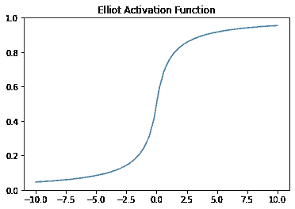
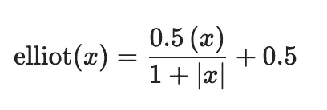
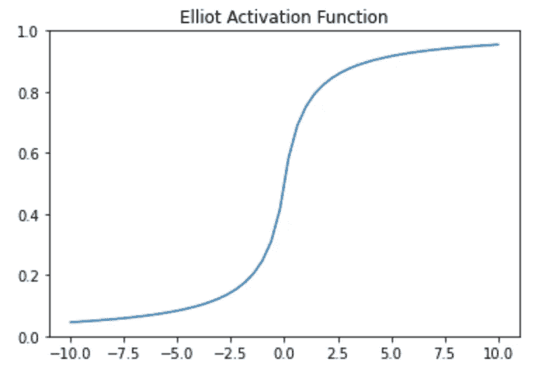

# Elliot 激活函数：它是什么，它有效吗？

> 原文：[`towardsdatascience.com/elliot-activation-function-what-is-it-and-is-it-effective-59b63ec1fd8a`](https://towardsdatascience.com/elliot-activation-function-what-is-it-and-is-it-effective-59b63ec1fd8a)

## 什么是 Elliot 激活函数，它是否是神经网络中其他激活函数的良好替代方案？

[](https://ben-mccloskey20.medium.com/?source=post_page-----59b63ec1fd8a--------------------------------)[](https://towardsdatascience.com/?source=post_page-----59b63ec1fd8a--------------------------------) [本杰明·麦克洛斯基](https://ben-mccloskey20.medium.com/?source=post_page-----59b63ec1fd8a--------------------------------)

·发表于 [Towards Data Science](https://towardsdatascience.com/?source=post_page-----59b63ec1fd8a--------------------------------) ·阅读时间 7 分钟·2023 年 2 月 4 日

--



Elliot 激活函数（图片来源：作者）

# 介绍

你是否在创建新的机器学习模型时，不确定应该使用什么激活函数？

**但等一下，*什么是激活函数？***

激活函数使机器学习模型能够理解和解决*非线性*问题。在神经网络中使用激活函数特别有助于将每个神经元传递给下一个神经元的最重要信息。今天，ReLU 激活函数通常用于神经网络的架构中，但这并不一定意味着它总是最佳选择。（请查看我下面关于 ReLU 和 LReLU 激活函数的文章）。

[](/leaky-relu-vs-relu-activation-functions-which-is-better-1a1533d0a89f?source=post_page-----59b63ec1fd8a--------------------------------) ## Leaky ReLU 与 ReLU 激活函数：哪一个更好？

### 一项实验调查在使用 ReLU 激活函数时模型性能是否存在明显差异……

towardsdatascience.com

我最近发现了**Elliot 激活函数**，它被赞誉为可能替代各种激活函数的选择，包括 Sigmoid 和双曲正切函数。今天我们将进行一个实验来测试 Elliot 激活函数的性能。

**实验 1：** *测试 Elliot 激活函数与 Sigmoid 激活函数和双曲正切激活函数的性能。*

**实验 2:** *测试 Elliot 激活函数与 ReLU 激活函数的性能。*

目标是回答这个问题：*Elliot 激活函数是否有效？*

# Elliot 激活函数



Elliot 激活函数将产生一个相对接近 Sigmoid 和双曲正切激活函数的近似结果。有些人发现 Elliot 比 Sigmoid 激活函数**快 2 倍** [3]。就像 Sigmoid 激活函数一样，Elliot 激活函数被限制在 0 到 1 之间。



Elliot 激活函数（图像来自作者）

# 实验

**问题:** Keras 目前在其库中没有 Elliot 激活函数。

**解决方案:** 我们可以使用 Keras 后端自行创建它！

```py
def elliot(x):
  return ((.5*x) / (1 + K.abs(x)))

elliot = Activation(elliot)
```

对于这个实验，让我们看看 Elliot 激活函数与类似激活函数以及 ReLU 激活函数的比较，ReLU 是今天神经网络中使用的基本激活函数。

## 数据集和设置

所有 Python 项目的第一步是导入你的包。

```py
import keras.backend as K
from keras.layers import Layer
from keras.layers import Activation
import pandas as pd 
from sklearn.preprocessing import LabelEncoder
from sklearn.model_selection import train_test_split
from keras import layers
from keras import Sequential
```

今天使用的数据集是鸢尾花数据集，可以在[这里](https://archive.ics.uci.edu/ml/machine-learning-databases/iris/iris.data)找到。这个数据集是公开的，允许公开使用（可以通过*sklearn*加载到 Python 中）。

```py
iris = pd.read_csv("https://archive.ics.uci.edu/ml/machine-learning-databases/iris/iris.data")

# Preprocess the data
X = iris.iloc[:, :-1].values
y = iris.iloc[:, -1].values

# Encode the categorical output labels
encoder = LabelEncoder()
y = encoder.fit_transform(y)

# Split the data into training and test sets
X_train, X_test, y_train, y_test = train_test_split(X, y, test_size=0.2, random_state=0)
```

接下来，我们创建四个模型。这些将是相当简单的模型。每个模型将有一层 8 个神经元和一个激活函数。最终层将有 3 个神经元并使用 Softmax 激活函数。

```py
#Model 1 (Sigmoid)

#Model 1
model = Sequential()
model.add(layers.Dense(8, input_dim=4, activation='sigmoid'))
model.add(layers.Dense(3, activation='softmax'))

#Model 2 (Tanh)
model = Sequential()
model.add(layers.Dense(8, input_dim=4, activation='tanh'))
model.add(layers.Dense(3, activation='softmax'))

#Model 3 (ReLU)
model = Sequential()
model.add(layers.Dense(8, input_dim=4, activation='relu'))
model.add(layers.Dense(3, activation='softmax'))

#Model 4 (Elliot)
model = Sequential()
model.add(layers.Dense(8, input_dim=4, activation=elliot))
model.add(layers.Dense(3, activation='softmax'))
```

接下来，简单地训练模型并分析结果。

```py
# Compile the model
model.compile(loss='sparse_categorical_crossentropy', optimizer='adam', metrics=['accuracy'])

# Train the model (Pick the number of epochs)
model.fit(X_train, y_train, epochs=1, batch_size=10)
```

# 结果

结果实际上是……令人惊讶的。正如预期的那样，Elliot 激活函数生成的模型在性能上与采用 Sigmoid 和双曲正切激活函数的模型相似。

**1 周期**

+   *Sigmoid @ 1*: 准确率: 0.3109 | 损失: 2.0030

+   *Elliot @ 1*: 准确率: 0.3361 | 损失: 1.0866

在 1 个周期下，Elliot 激活函数模型的准确率比 Sigmoid 激活函数模型高 2.61%，并且*损失量减少了近 100%。*

**10 周期**

+   *Sigmoid @ 10*: 准确率: 0.3529 | 损失: 1.0932

+   *Elliot @ 10*: 准确率: 0.6891 | 损失: 0.9434

在 10 个周期下，使用 Elliot 激活函数的模型比使用 Sigmoid 激活函数的模型准确率提高了近 30%，同时损失较低。

**100 周期**

+   *Sigmoid @ 100*: 准确率: 0.9496 | 损失: 0.4596

+   *Elliot @ 100*: 准确率: 0.9580 | 损失: 0.5485

虽然 Sigmoid 模型的表现优于 Elliot 模型，但需要注意的是它们的表现几乎完全相同。

**1000 周期**

+   *Sigmoid @ 1000*: 准确率: 0.9832 | 损失: 0.0584

+   *Elliot @ 1000*: 准确率: 0.9832 | 损失: 0.0433

在 1000 个周期下，两种不同模型的表现几乎完全相同。

**总体而言，使用 Elliot 激活函数的模型表现略优于使用 Sigmoid 激活函数的模型。**

## Elliot 与双曲正切

**1 个周期**

+   *tanh @ 1*: 准确率: 0.3361 | 损失: 1.1578

+   *Elliot @ 1*: 准确率: 0.3361 | 损失: 1.0866

在 1 个周期时，Elliot 激活函数模型与双曲正切激活函数模型的表现相同。我原本预期这些函数会产生相似的模型，因为它们都以类似的方式限制了传递到神经网络下一层的值。

**10 个周期**

+   *tanh @ 10*: 准确率: 0.3277 | 损失: 0.9981

+   *Elliot @ 10*: 准确率: 0.6891 | 损失: 0.9434

使用 Elliot 激活函数的模型明显优于使用双曲正切激活函数的模型，就像 Elliot 模型在与 Sigmoid 模型比较时在 10 个周期的表现一样。

**100 个周期**

+   *tanh @ 100:* 准确率: 0.9916 | 损失: 0.2325

+   *Elliot @ 100*: 准确率: 0.9580 | 损失: 0.5485

在 100 个周期时，双曲正切模型的表现明显优于 Elliot 模型。在更高的周期下，Elliot 激活函数似乎表现不如*tanh*激活函数，但让我们看看在 1000 个周期时它们的表现有何不同。

**1000 个周期**

+   *tanh @ 1000:* 准确率: 0.9748 | 损失: 0.0495

+   *Elliot @ 1000*: 准确率: 0.9832 | 损失: 0.0433

好吧，在 1000 个周期时，Elliot 激活函数模型略微超越了双曲正切激活函数模型。

总的来说，我认为双曲正切和 Elliot 激活函数模型在神经网络的层次中几乎表现相同。**训练模型所需的时间可能会有所不同**，然而这些模型非常简单，随着数据量的增加以及网络规模的扩大，时间可能会成为一个更重要的因素。

## Elliot 与 ReLU

**1 个周期**

+   *ReLU @ 1:* 准确率: 0.6639 | 损失: 1.0221

+   *Elliot @ 1*: 准确率: 0.3361 | 损失: 1.0866

在 1 个周期时，ReLU 激活函数模型的表现*更好*，这表明 Elliot 激活函数使模型训练速度较慢。

**10 个周期**

+   *ReLU @ 10*: 准确率: 0.6471 | 损失: 0.9413

+   *Elliot @ 10*: 准确率: 0.6891 | 损失: 0.9434

哇！包含 Elliot 激活函数的模型实际上表现*更好*，准确率高出 4.2%，损失低了 0.21%。

**100 个周期**

+   *ReLU @ 100*: 准确率: 0.9160 | 损失: 0.4749

+   *Elliot @ 100*: 准确率: 0.9580 | 损失: 0.5485

尽管采用 Elliot 激活函数的模型损失较高，但它能够实现 4.2%的更高准确率。*这再次*展示了 Elliot 激活函数在神经网络中的强大优势。

**1000 个周期**

+   *ReLU @ 1000*: 准确率: 0.9916 | 损失: 0.0494

+   *Elliot @ 1000*: 准确率: 0.9832 | 损失: 0.0433

尽管采用 Elliot 激活函数的模型在准确性方面表现不佳，但损失较低，我对结果仍然感到满意。如 1000 次迭代所示，Elliot 激活函数几乎与 ReLU 激活函数一样好，并且在正确的问题和超参数调整下，Elliot 激活函数可能是更优的选择。

# 结论

今天，我们探讨了一种较不为人知的激活函数：**Elliot 激活函数**。为了测试它的性能，我们将其与形状相似的两个激活函数进行比较：Sigmoid 和双曲正切激活函数。结果显示，Elliot 函数的表现与这两个函数相当，甚至更好。接下来，我们将 Elliot 激活函数的性能与现代神经网络中使用的标准 ReLU 激活函数进行了比较。在四次试验中，采用 Elliot 激活函数的模型有 50% 的时间表现更好。在其他试验中，尽管表现不如前者，但其性能与使用 ReLU 激活函数的模型几乎一致。我建议在下一个神经网络中尝试 Elliot 激活函数，因为它可能表现更佳！

**如果你喜欢今天的阅读，请关注我，并告诉我是否有其他话题你希望我深入探讨！如果你没有 Medium 账户，可以通过我的链接** [**这里**](https://ben-mccloskey20.medium.com/membership)**注册！使用我的链接我将获得少量佣金。此外，也可以在** [**LinkedIn**](https://www.linkedin.com/in/benjamin-mccloskey-169975a8/) **添加我，或者随时联系我！感谢阅读！**

1.  Dubey, Shiv Ram, Satish Kumar Singh, 和 Bidyut Baran Chaudhuri. “深度学习中激活函数的全面调查与性能分析。” *arXiv 预印本 arXiv:2109.14545* (2021)。

1.  Sharma, Sagar, Simone Sharma, 和 Anidhya Athaiya. “神经网络中的激活函数。” *towards data science* 6.12 (2017): 310–316。

1.  [`www.gallamine.com/2013/01/a-sigmoid-function-without-exponential_31.html`](https://www.gallamine.com/2013/01/a-sigmoid-function-without-exponential_31.html)
