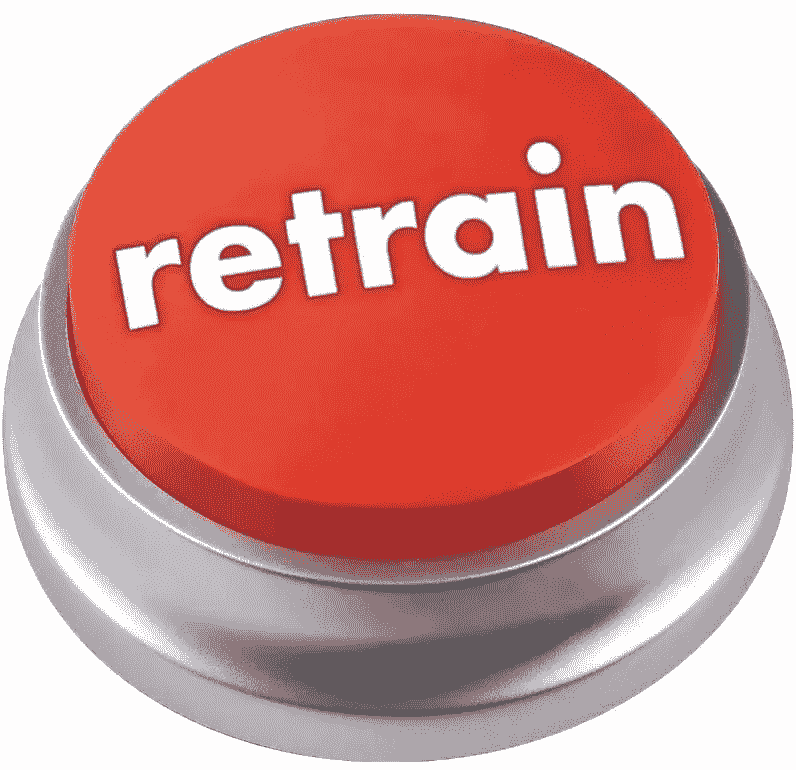

# 迎接自动化重新训练

> 原文：[`towardsdatascience.com/embracing-automated-retraining-780ed49f9985?source=collection_archive---------4-----------------------#2023-03-17`](https://towardsdatascience.com/embracing-automated-retraining-780ed49f9985?source=collection_archive---------4-----------------------#2023-03-17)

作者提供的图片

## 如何从固定节奏（或完全不）重新训练转向动态方法

 [Claire Longo](https://statistician-in-stilettos.medium.com/?source=post_page-----780ed49f9985--------------------------------)

·

[关注](https://medium.com/m/signin?actionUrl=https%3A%2F%2Fmedium.com%2F_%2Fsubscribe%2Fuser%2F1f6936fe85bb&operation=register&redirect=https%3A%2F%2Ftowardsdatascience.com%2Fembracing-automated-retraining-780ed49f9985&user=Claire+Longo&userId=1f6936fe85bb&source=post_page-1f6936fe85bb----780ed49f9985---------------------post_header-----------) 发表在 [Towards Data Science](https://towardsdatascience.com/?source=post_page-----780ed49f9985--------------------------------) ·7 分钟阅读·2023 年 3 月 17 日

--

*这篇文章由* [*Trevor LaViale*](https://www.linkedin.com/in/trevor-laviale/) *联合撰写*

尽管行业在了解何时将模型投入生产方面投资了大量的过程和技术，但关于同样重要的任务——了解何时重新训练模型的集体知识却相对较少。事实上，了解何时重新训练模型很困难，因为存在诸如反馈延迟或实时预测标签等因素。在实际操作中，许多模型在生产中没有进行任何重新训练，使用手动重新训练方法，或是在没有优化或研究节奏的情况下进行重新训练。

本文旨在帮助数据科学家和机器学习工程团队采用自动化重新训练。

# 重新训练的方法

自动化模型重新训练有两种核心方法：

+   **固定：** 按设定的周期（例如，每天、每周、每月）进行重新训练。

+   **动态：** 基于模型性能指标的临时触发重新训练。

虽然固定方法实现起来很简单，但也存在一些缺点。计算成本可能比实际需要的要高，频繁的重新训练可能导致模型之间的不一致，而不频繁的重新训练计划可能导致模型过时。

动态方法可以防止模型过时，并优化计算成本。虽然有许多重新训练的方法，但以下是一些推荐的最佳实践，用于动态模型重新训练，以保持模型的健康和高效。

# 通用重新训练架构

有一系列工具可以用来创建模型重新训练系统。此图示展示了一个 ML 可观测性平台如何集成到一个通用流程中。

针对特定工具的教程非常丰富。以下是一些示例：

+   [使用 Eventbridge 自动化模型重新训练](https://docs.arize.com/arize/monitors/alerts-and-integrations/amazon-eventbridge#leverage-arizes-drift-monitoring-capabilities-to-automate-ml-training-workflows)

+   [使用 Airflow 自动化模型重新训练](https://docs.arize.com/arize/monitors/alerts-and-integrations/airflow-retrain)

+   [Pachyderm 在金融科技用例中的示例](https://www.pachyderm.com/blog/leaping-the-gap-fintech/)

对于那些准备跳过的，可以进一步了解一下 Etsy 的见解关于有状态模型重新训练的内容。

# 重新训练策略

自动化重新训练一个实时机器学习模型可能是一个复杂的任务，但有一些最佳实践可以帮助指导设计。

## 触发重新训练的指标

触发重新训练的指标将取决于具体的模型和使用案例。每个指标都需要设定一个阈值。该阈值将用于在模型的性能低于阈值时触发重新训练。在这方面，监控工具可以发挥作用。当模型监控平台中的性能监控器触发时，你可以通过编程查询性能和漂移指标，以评估是否需要重新训练。

理想的模型重新训练触发指标：

+   预测（分数或标签）漂移

+   性能指标降级

+   针对特定细分群体/队列的性能指标降级。

+   特征漂移

+   嵌入漂移

漂移是度量两个分布之间距离的指标。它是触发模型重新训练的有意义的指标，因为它表明你的生产数据从基线数据有多少偏移。统计漂移可以通过各种[漂移指标](https://arize.com/blog-course/drift/)来测量。

用于计算漂移的基准数据集可以来源于训练数据集或生产数据的一个窗口。

## 确保新模型有效

新模型需要在推广到生产环境以替换旧模型之前进行测试或验证。这里有几种推荐的方法：

+   人工审查

+   CI/CD 管道中的自动化指标检查

## 推广新模型的策略

推广新模型的策略将取决于模型对业务的影响。在某些情况下，可能适合自动用新模型替换旧模型。但在其他情况下，新模型可能需要进行 A/B 测试后再替换旧模型。

一些值得考虑的实时模型测试策略包括：

+   ***冠军模型与挑战者模型*** — 向这两个模型提供生产流量，但在应用中仅使用现有模型（冠军）的预测/响应。挑战者模型的数据将被存储以供分析，但不会被使用。

+   ***A/B 测试*** — 将生产流量分配到两个模型中，进行固定时间段的实验。实验结束时比较关键指标，并决定推广哪个模型。

+   ***金丝雀发布*** — 先将小比例的生产流量重定向到新模型。由于它在生产路径中，这有助于发现新模型的实际问题，但将影响限制在小比例用户中。逐步增加流量直到新模型接收 100%的流量。

## 重新训练反馈循环数据

一旦确定模型需要保留，下一步是选择合适的数据集进行重新训练。以下是一些建议，以确保新的训练数据将提升模型性能：

+   如果模型总体表现良好，但在某些特定的特征值或人口统计特征等细分段上未能达到最佳性能标准，则新的训练数据集应包含这些表现较差的细分段的额外数据点。可以使用简单的上采样策略来创建一个新的训练数据集，以针对这些低表现的细分段。

+   如果模型在小时间片上训练，训练数据集可能无法准确捕捉和表示所有可能出现在实际生产数据中的模式。为防止这种情况，避免仅在最近数据上训练模型。相反，应使用大量的历史数据，并用最新的数据来增强这些数据，以便模型学习到额外的模式。

+   如果您的模型架构遵循迁移学习设计，则在重新训练期间可以简单地将新数据添加到模型中，而不会丢失模型从之前训练数据中已经学到的模式。

来自模型监控平台的仪表板（例如 Arize——完全披露：我在 Arize 工作）非常适合在这些测试期间跟踪和比较模型的实时性能。无论模型是作为影子部署、实时 A/B 测试还是仅仅是离线比较，这些仪表板都提供了一种简单的方式来查看并排模型比较。这些仪表板还可以轻松地与他人分享，以向利益相关者展示模型性能的改善。

## 定量 ROI

总体而言，确定自动重新训练实时机器学习模型的最佳方法时，了解业务需求和解决的问题至关重要。同样，持续监控模型性能，并根据需要调整重新训练的频率和指标也很重要。

**成本影响测量：**

虽然在 AI 领域计算直接 ROI 是具有挑战性的，但优化模型重新训练的价值简单、直观且可以直接计算。模型训练作业的计算和存储成本通常已经作为云计算成本的一部分进行跟踪。通常，模型的商业影响也可以计算。

在优化重新训练时，我们考虑了重新训练成本和模型性能对业务的影响（“AI ROI”）。我们可以权衡这些成本以证明模型重新训练的成本。

在这里，我们提出了每周成本计算，尽管该计算器可以根据模型的目的和维护需求调整为不同的频率，如每日或每月。

图片由作者提供

**考虑场景 1，即模型过于频繁地重新训练的情况。**

*我的模型重新训练成本为$200。我每天训练一次模型。该模型保持了稳定的每周平均准确率为 85%。我设置了一个管道，基于预测分数漂移大于 0.25 PSI 和准确率自动重新训练。根据新规则，我的模型每周只重新训练两次，并保持 85%的准确率。*

每周维护成本比较：

旧模型维护成本：7*$200 = $1400

新模型维护成本 2*$200= $400

这相当于模型维护成本减少了 x%。虽然这是一个简单的假设示例，但成本节约的幅度可能会达到这种规模。

**考虑场景 2，即模型训练不足的情况。**

*我的模型训练成本为$200。我每周训练一次模型。该模型保持了稳定的每周平均准确率为 65%。我设置了一个管道，基于预测分数漂移大于 0.25 PSI 自动重新训练。根据新规则，我的模型每周重新训练两次，达到了更好的 85%准确率。*

每周维护成本比较：

旧模型维护成本：1*$200 = $200，准确率 65%

新模型维护成本：2*$200= $400，准确率 85%

因此，通过更高的价格，取得了更好的模型性能。如果 AI 投资回报值高于重新训练成本，那么这可以被证明是合理且有利可图的。缺乏频繁的重新训练可能会导致错失收益。

# 结论

从固定间隔的模型重新训练过渡到由模型性能触发的自动化模型重新训练，为组织提供了众多好处，包括在[云成本不断增加](https://www.wsj.com/articles/technology-chiefs-seek-help-wrangling-cloud-costs-61ba0b50)的情况下降低计算成本，以及通过改善模型性能实现更好的 AI 投资回报。希望这篇博客为团队提供了一个行动模板。
