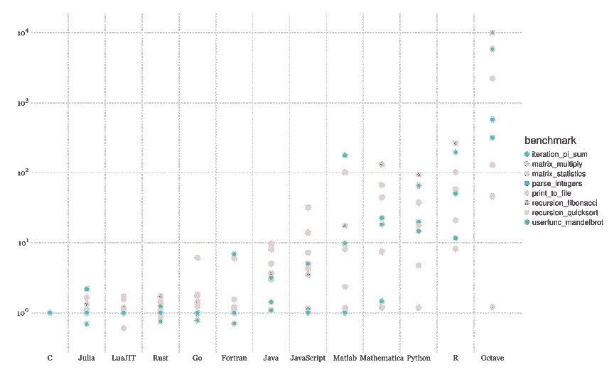
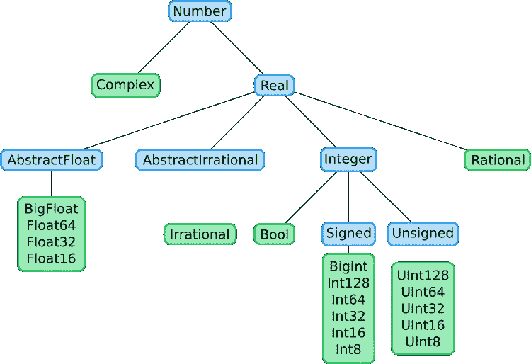

# Embracing Julia: An Invitation Letter

> 原文：[`towardsdatascience.com/embracing-julia-an-invitation-letter-332f5709378e?source=collection_archive---------2-----------------------#2023-10-13`](https://towardsdatascience.com/embracing-julia-an-invitation-letter-332f5709378e?source=collection_archive---------2-----------------------#2023-10-13)

## 诚挚地向 Python 爱好者、科学计算大师和数据科学家致敬

[](https://essamwissam.medium.com/?source=post_page-----332f5709378e--------------------------------)[](https://towardsdatascience.com/?source=post_page-----332f5709378e--------------------------------) [Essam Wisam](https://essamwissam.medium.com/?source=post_page-----332f5709378e--------------------------------)

·

[关注](https://medium.com/m/signin?actionUrl=https%3A%2F%2Fmedium.com%2F_%2Fsubscribe%2Fuser%2Fccb82b9f3b87&operation=register&redirect=https%3A%2F%2Ftowardsdatascience.com%2Fembracing-julia-an-invitation-letter-332f5709378e&user=Essam+Wisam&userId=ccb82b9f3b87&source=post_page-ccb82b9f3b87----332f5709378e---------------------post_header-----------) 发表在 [Towards Data Science](https://towardsdatascience.com/?source=post_page-----332f5709378e--------------------------------) ·19 分钟阅读·2023 年 10 月 13 日[](https://medium.com/m/signin?actionUrl=https%3A%2F%2Fmedium.com%2F_%2Fvote%2Ftowards-data-science%2F332f5709378e&operation=register&redirect=https%3A%2F%2Ftowardsdatascience.com%2Fembracing-julia-an-invitation-letter-332f5709378e&user=Essam+Wisam&userId=ccb82b9f3b87&source=-----332f5709378e---------------------clap_footer-----------)

--

[](https://medium.com/m/signin?actionUrl=https%3A%2F%2Fmedium.com%2F_%2Fbookmark%2Fp%2F332f5709378e&operation=register&redirect=https%3A%2F%2Ftowardsdatascience.com%2Fembracing-julia-an-invitation-letter-332f5709378e&source=-----332f5709378e---------------------bookmark_footer-----------)

Julia 是一种通用、动态、高性能和高级别的编程语言，采用即时编译。这是一门相对较新的语言，其主要 1.0 版本直到 2018 年才发布。在这篇文章中，我们旨在展示，如果你对数据科学、科学计算或者是 Python 爱好者，那么将这门语言加入你的工具箱绝对是值得的。也许这确实是你*见过的最美的编程语言*。


紫色、绿色和红色行星的星系数字艺术 — 由作者使用 DALLE 2 生成

在这个故事中，我们将探讨 Julia 的思想高度及其学习的价值。完成后，我们强烈推荐你查看下一个故事 [从 Python 到 Julia：终极指南](https://medium.com/@essamwissam/from-python-to-julia-an-ultimate-guide-244fd3dc35c6)，以便从 Python 轻松过渡到 Julia。

## 目录

· **Julia 是高级语言**

∘ 基本语法

∘ 数学的优雅语法

· **Julia 很快**

∘ 基准测试

∘ 双语言问题

∘ Julia 是即时编译的

· **Julia 解决了表达式问题**

∘ 表达式问题

∘ 多重分发

∘ 抽象和具体类型

· **Julia 功能全面**

∘ 数组支持

∘ 字符串支持

∘ 多线程

∘ 与 C 代码的简单集成

∘ 标准库

· **Julia 是通用的**

∘ 介绍

∘ 自动化和脚本编写

· **Julia 可扩展性广**

∘ 介绍

∘ 宏

· **总结**


照片由 [Daniele Levis Pelusi](https://unsplash.com/@yogidan2012?utm_source=medium&utm_medium=referral) 提供，来源于 [Unsplash](https://unsplash.com/?utm_source=medium&utm_medium=referral)

# **Julia 是高级语言**

介绍可能已经让你觉得这将类似于 Python——也是一种通用、动态和高级语言。为了验证这一点，我们来看看基本的 Julia 代码与 Python 的比较。

## 基本语法

考虑一下下面这个用 Python 编写的猜谜游戏：

```py
import random

def guessing_game(max):
    random_number = random.randint(1, max)
    print(f"Guess a number between 1 and {max}")
    while True:
        user_input = input()
        guess = int(user_input)
        if guess < random_number:
            print("Too low")
        elif guess > random_number:
            print("Too high")
        else:
            print("That's right!")
            break

guessing_game(100)
```

以下是 Julia 中的等效代码：

```py
function guessing_game(max::Integer)
    random_number = rand(1:100)  
    println("Guess a number between 1 and $max")
    while true
        user_input::String = readline()
        guess = parse(Int, user_input)
        if guess < random_number
            println("Too low")
        elseif guess > random_number
            println("Too high")
        else
            println("That's right!")
            break
        end
    end
end

guessing_game(100)
```

主要区别在于 Julia 不假设任何缩进或要求使用冒号，而是需要显式的“end”来结束 if 条件、循环和函数等构造的作用域。如果你来自 Matlab 或 Fortran，你应该会觉得很熟悉。

另一个你可能注意到的区别是 Julia 自然支持变量声明、函数参数（和返回类型，尽管很少使用）中的类型注解。**它们总是可选的**，但通常用于类型断言，允许编译器在方法重载多个类型时选择正确的方法实例，在某些情况下对于变量和结构体声明也有性能优势。

## **数学的优雅语法**

```py
# Elegant Expressions 
x = 2
z = 2y + 3x - 5

# Official Unicode Support
α, β, γ = 1, 2, π/2

# one-line functions
f(r) = π*r²

f'(3)  # derivative (with Flux.jl package)

# Column vector is literally a column
v₁ = [1
      2
      3
      4]  

v₂ = [1 2 3 4]

# transpose
println(v1' == v2)

# This is literally a 3x3 matrix
M⁽ⁱ⁾ = [1 2 3
        4 5 7
        7 8 9]

# Explicit modeling of missingness
X = [1, 2, missing, 3, missing]
```

Julia 相对于 Python 的一个重大优势是其对数学语法的支持。* 乘以常量时无需使用 latex 符号，支持变量名称的 latex 符号（可能需要使用 VSCode 插件将 \pi 转换为 π，v\_1 转换为 v₁ 等），矩阵一般遵循代码定义中的布局。

例如，如果你要为神经网络实现梯度下降。

在 Python 中，你可能会写：

```py
import numpy as np

# Gradient Descent in a Neural Network
J_del_B_n = [np.zeros(b) for b in B_n]
J_del_W_n = [np.zeros(W) for W in W_n]

for (x, y) in zip(x_batch, y_batch):
    J_del_B_n_s, J_del_W_n_s = backprop(x, y)
    J_del_B_n = [J_del_b + J_del_b_s for J_del_b,
                 J_del_b_s in zip(J_del_B_n, J_del_B_n_s)]
    J_del_W_n = [J_del_W + J_del_W_s for J_del_W,
                 J_del_W_s in zip(J_del_W_n, J_del_W_n_s)]

d = len(x_batch)
W_n = [(1 - lambda_val * alpha / d) * W - lambda_val /
       d * J_del_W for W, J_del_W in zip(W_n, J_del_W_n)]
B_n = [(1 - lambda_val * alpha / d) * b - lambda_val /
       d * J_del_b for b, J_del_b in zip(B_n, J_del_B_n)]
```

比较一下你用 Julia 编写的代码的可读性：

```py
# Gradient Descent in a NN
მJⳆმBₙ = [zeros(b) for b in Bₙ]
მJⳆმWₙ = [zeros(W) for W in Wₙ]

for (x, y) in zip(x_batch, y_batch)
    მJⳆმBₙₛ, მJⳆმWₙₛ = backprop(x, y)
    მJⳆმBₙ = [მJⳆმb + მJⳆმbₛ for მJⳆმb, მJⳆმbₛ in zip(მJⳆმBₙ, მJⳆმBₙₛ)]  
    მJⳆმWₙ = [მJⳆმW + მJⳆმWₛ for მJⳆმW, მJⳆმWₛ in zip(მJⳆმWₙ, მJⳆმWₙₛ)]

d = len(x_batch)
Wₙ = [(1 - λ*α/d)* W - λ/d * მJⳆმW for W, მJⳆმW in zip(Wₙ, მJⳆმWₙ)]
Bₙ = [(1 - λ*α/d)* b - λ/d * მJⳆმb for b, მJⳆმb in zip(Bₙ, მJⳆმBₙ)]
```

你可以尝试用 Python 编写类似的代码，但编辑器通常会在 Unicode 变量周围加上黄色方块（或无法高亮显示它们），而且你的代码可能无法与诸如 Pickle 的第三方包兼容。


照片由[Solaiman Hossen](https://unsplash.com/@sh_sumon?utm_source=medium&utm_medium=referral)拍摄，来源于[Unsplash](https://unsplash.com/?utm_source=medium&utm_medium=referral)。

# Julia 非常快速。

另一个使 Julia 被认为是 Python 梦想成真的主要原因是，与 Python、Ruby 和其他高级语言不同，它在保持高级的同时不会牺牲速度。实际上，它可以和低级语言如 C 和 C++ 一样快。

## 基准测试

作为参考，以下报告了 Julia 的性能，以及其他语言在流行性能基准测试中的表现：



*Julia 微基准测试：图片来源于* [*JuliaLang*](https://julialang.org/benchmarks/) *在 MIT 许可下*

## **双语言问题**

Julia 性能的一个推论是它解决了*双语言问题：*

+   研究代码（例如，一个机器学习模型）通常用高级语言如 Python 编写，因为它的高级和交互性；因此，能更专注于科学（减少代码问题）并允许更多探索。

+   一旦研究代码完成，它必须用低级语言如 C 重写，才能在生产中使用。

问题在于相同的代码必须用多种语言重写。这通常困难且容易出错；考虑到研究代码在发布后进行修改，最坏情况下，它将不得不再次用低级语言重写。

一种解决此问题的方法是将性能关键的库（例如，Numpy）用低级语言如 C 编写，然后可以用 Python 函数包装这些库，这些函数内部调用 C 代码，可以用于研究和生产而不必担心性能。在现实中，这种方法非常有限，因为：

+   这使得新开发者很难为他们编写的新颖科学方法做出贡献或进行合作，因为他们可能需要将这些方法用低级语言如 C 重写以提高性能，然后再在高级库中公开。

+   科学计算领域的高级语言可能会对开发人员施加一些搞笑的限制。例如，写显式的 for 循环可能会被强烈不鼓励。

Julia 通过保持高级、交互性强且非常快速，即使在生产环境中也能解决双语言问题。

## Julia 是即时编译的。

有一小段关于 Julia 性能的说明。由于 Julia 是 JIT 编译的，任何 Julia 代码的第一次运行都需要更多时间来完成。在这段时间里，每个函数代码将被转换为特定变量类型的本地代码（即处理器可以解释的代码）。一旦完成，它将缓存编译后的表示，以便如果该函数再次被调用并且输入的类型相同，它将立即被解释。

更详细地说，对于一个有 *N* 个参数的函数，可能会有指数级数量的本地代码表示；每种可能的参数类型组合都有一个。Julia 会将函数编译成与首次运行代码时推断出的类型对应的表示。一旦完成，进一步调用该函数将变得轻而易举。请注意，在类型推断过程中，它不一定使用类型注释（这些注释是可选的，并且可以有我们提到的其他用途），类型可以从输入的运行时值中推断出来。

这不是问题，因为研究代码或在服务器上运行的代码只需初次编译一次，完成后任何进一步运行（实际 API 调用或进一步实验）的代码都非常快速。


由 [Thom Milkovic](https://unsplash.com/@thommilkovic?utm_source=medium&utm_medium=referral) 在 [Unsplash](https://unsplash.com/?utm_source=medium&utm_medium=referral) 提供的照片

# Julia 解决了表达式问题

## **表达式问题**

表达式问题涉及能够定义一个在其表示（即支持的类型）和行为（即支持的方法）方面都可扩展的数据抽象。也就是说，解决表达式问题的方案允许：

+   添加**新类型**到**现有操作**适用的类型中

+   添加**新操作**到**现有类型**适用的类型中

而不违反**开闭原则**（或导致其他问题）。这意味着应该可以在不修改现有操作代码的情况下添加新类型，并且应该可以在不修改现有类型代码的情况下添加新操作。

Python 像许多其他编程语言一样，是面向对象的，未能解决表达式问题。

假设我们有以下数据抽象：

```py
# Base class
class Shape:
    def __init__(self, color):
        pass

    def area(self):
        pass

# Child class
class Circle(Shape):
    def __init__(self, radius):
        super().__init__()
        self.radius = radius

    def area(self):
        return 3.14 * self.radius * self.radius 
```

很容易将新类型添加到现有方法应适用的类型中。只需继承 `Shape` 基类即可。这不需要修改任何现有代码：

```py
class Rectangle(Shape):
    def __init__(self, width, height):
        super().__init__()
        self.width = width
        self.height = height

    def area(self):
        return self.width * self.height
```

同时，向现有类型中添加操作并不容易。如果我们想添加一个 `perimeter` 方法，那么必须修改基础类以及到目前为止实现的每一个子类。

这个问题的一个后果是，如果包*x*由作者 X 维护，并且最初支持操作集合*Sx*，而另一个操作集合*Sy*对另一组开发者 Y 有帮助，他们必须能够修改由 X 维护的包，以添加这些方法。在实践中，开发者 Y 通常会自己创建另一个包，可能会复制包*x*中的代码以实现该类型，因为开发者 X 可能不愿意维护更多的代码，而*Sy*可能是一种不同类型的方法，不需要存在于同一个包中。

另一方面，因为添加适用现有操作的新类型很容易，如果开发者 Y 希望定义一个新的类型，该类型实现了 X 实现的类型中的操作，他们可以很容易地做到这一点，而无需修改包*x*或复制其中的任何代码。只需导入该类型，然后从中继承即可。

## **多重分发**

为了解决表达式问题，这允许不同包之间的大规模集成，Julia 完全摒弃了传统的面向对象编程。Julia 使用**抽象类型**定义、**结构体**（抽象类型的自定义类型实例）和**方法**以及一种称为**多重分发**的技术，正如我们将看到的，**它完美地解决了表达式问题**。

要查看我们上面所讨论的等效内容：

```py
### Shape Abstract Type (Interface)

abstract type Shape end

function area(self::Shape)  end

### Circle Type (Implements the Interface)

struct Circle <: Shape
    radius::Float64
end

function area(circle::Circle)
    return 3.14 * circle.radius²
end
```

在这里，我们定义了一个抽象类型`Shape`。它是抽象的，这意味着它不能被实例化；然而，其他类型（类）可以从它中继承（子类化）。之后，我们定义了一个圆形类型，作为`Shape`抽象类型的子类型，并定义了`area`方法，同时指定输入必须是`Circle`类型。这样我们可以进行

```py
c = Circle(3.0)
println(area(c))
```

这将打印`28.26`。虽然`c`满足两个`area`定义，因为它也是一个`Shape`，但第二个定义更具体，因此编译器选择了它来调用。

类似于基于类的面向对象编程，添加另一个类型“rectangle”而不触碰现有代码是很容易的：

```py
struct Rectangle <: Shape
    length::Float64
    width::Float64
end

function area(rect::Rectangle)
    return rect.length * rect.width
end
```

现在当我们执行

```py
rect = Rectangle(3.0, 6.0)
println(area(rect))
```

我们得到`18.0`。这就是多重分发的作用；`area`方法的正确实例是根据运行时参数的类型动态分发的。如果你有 C 或 C++的背景，这一定会让你想起函数重载。不同之处在于函数重载不是动态的，它依赖于编译时发现的类型。因此，你可以设计一些示例，其中它的行为会有所不同。

更重要的是，与基于类的 OOP 不同，我们可以向 `Shape`、`Circle` 或 `Rectangle` 添加方法，而无需修改它们的文件。如果所有这些文件都在我的包中，而你希望添加一组方法来生成几何形状的动画和 3D 视觉效果（这是我不关心的），那么你只需导入我的包。现在你可以访问 `Shape`、`Circle` 和 `Rectangle` 类型，你可以编写新的函数，然后将它们导出到你自己的“ShapeVisuals”包中。

```py
### Interface definitions
function animate(self::Shape)  end
function ThreeDify(self::Shape)  end

### Circle definitions
function animate(self::Circle)  
...
end
function ThreeDify(self::Circle)  
...
end

### Rectangle defintions
function animate(self::Rectangle)  
...
end
function ThreeDify(self::Rectangle)  
...
end
```

你考虑一下，这与你知道的面向对象编程 (OOP) 的主要区别在于它遵循 `func(obj, args)` 的模式，而不是 `obj.func(args)`。作为附加好处，它也使 `func(obj1, obj2, args)` 等操作变得轻而易举。另一个区别是它不会将方法和数据封装在一起或对它们施加任何保护；也许这在开发人员足够成熟且代码已被审查时是一个无关紧要的措施。

## **抽象与具体类型**

你现在知道抽象类型只是一个你无法实例化值的类型，但其他类型可以从它子类化，这为讨论 Julia 的类型系统铺平了道路。请记住，使用语法 `var::type` 来注释变量的类型是可选的，无论是在声明时、作为函数参数还是返回值。

Julia 中的任何类型要么是抽象的，如我们上面定义的，要么是具体的。具体类型是那些你可以实例化的，就像我们上面定义的自定义类型一样。

Julia 为数字提供了以下层次化的类型系统：



*Julia 微基准测试：图片来自 J*[*ulia for Optimization and Learning*](https://juliateachingctu.github.io/Julia-for-Optimization-and-Learning/stable/lecture_06/compositetypes/) *根据 MIT 许可协议*

如果你的函数接受一个参数并对任何数字进行操作，你将使用 `func(x::Number)`。只有当传入非数字值，如字符串时，才会抛出错误。与此同时，如果它仅适用于任何浮点数，那么你将使用 `func(x::AbstractFloat)`。如果输入的类型是 `BigFloat, Float64, Float32 或 Float16`，则不会抛出错误。由于存在多重分派，你还可以定义另一个函数实例 `func(x::Integer)` 来处理给定数字为整数的情况。

Julia 也有一个层次化的类型系统用于 [其他抽象类型](https://www.oreilly.com/library/view/learning-julia-abstract/9781491999585/ch01.html)，如 `AbstractString`，但它们要简单得多。


图片由 [Paul Melki](https://unsplash.com/@paulmelki?utm_source=medium&utm_medium=referral) 提供，[Unsplash](https://unsplash.com/?utm_source=medium&utm_medium=referral)

# Julia 功能齐全

如果你考虑一下，Python 开箱即用地只有基本功能。例如，如果你仅使用 Python 而没有像 Numpy 这样的流行软件包，你在数据科学和科学计算方面能做的事情非常有限。该领域的大多数其他软件包也严重依赖 Numpy。它们都使用并假定“ Numpy” 数组类型（而不是默认的 Python 列表类型），就像它是语言的一部分一样。

Julia 并不是这样。它开箱即用地提供了许多重要的特性，包括：

## **数组支持**

Julia 开箱即用地提供了类似于 Numpy 的数组支持，包括广播和矢量化支持。例如，以下比较了流行的 Numpy 操作与如何在 Julia 中原生编写它们：

```py
#> 1\. Creating a NumPy array
### Python
arr = np.array([[1, 2, 3],
                [4, 5, 6],
                [7, 8, 9]])
### Julia
arr = [1 2 3
       4 5 6
       7 8 9]

#> 2\. Getting the shape of an array
### Python
shape = arr.shape
### Julia
shape = size(arr)

#> 3\. Reshaping an array
### Python
reshaped_arr = arr.reshape(3, 3)
### Julia
reshaped_arr = reshape(arr, (3, 3))

#> 4\. Accessing elements by index
### Python
element = arr[1, 2]
### Julia
element = arr[1, 2]

#> 5\. Performing element-wise arithmetic operations
### Python
multiplication = arr * 3
### Julia
multiplication = arr .* 3

# 6\. Array concatenation
### Python
arr1 = np.array([[1, 2, 3]])
arr2 = np.array([[4, 5, 6]])
concatenated_arr = np.concatenate((arr1, arr2), axis=0)
### Julia
arr1 = [1 2 3]
arr2 = [4 5 6]
concatenated_arr = vcat(arr1, arr2)

#> 7\. Boolean masking
### Python
mask = arr > 5
masked_arr = arr[mask]
### Julia
mask = arr .> 5
masked_arr = arr[mask]

#> 8\. Calculating the sum of array elements
### Python
mean_value = arr.sum()
### Julia
mean_value = sum(arr)
```

## **字符串支持**

Julia 还开箱即用地提供了对字符串和正则表达式的广泛支持：

```py
name = "Alice"
age = 13

## concatentation
greeting = "Hello, " * name * "!"

## interpolation
message2 = "Next year, you will be $(age + 1) years old."

## regex
text = "Here are some email addresses: alice123@gmail.com"

# Define a regex for emails
email_pattern = r"[\w.-]+@[\w.-]+\.\w+"

# match emails
email_addresses = match(email_pattern, text)

"aby" > "abc"       # true
```

当字符串被比较时，按字典顺序（一般的字母顺序）靠后的字符串被认为比靠前的字符串大。可以证明，大多数在 Perl 等高级字符串处理语言中可以做的字符串操作，也可以在 Julia 中完成。

## **多线程**

Python 不支持真正的并行多线程是因为它有一个全局解释器锁（GIL）。这禁止了解释器同时运行多个线程，以便通过一种过于简单的解决方案来保证线程安全。只有在多个线程之间切换才是可能的（例如，如果一个服务器线程忙于等待网络请求，解释器可以切换到另一个线程）。

幸运的是，在 Python 调用的 C 程序中释放这个锁并不难，这解释了为什么 Numpy 是可能的。然而，如果你有一个大规模的计算循环，那么你不能编写可以并行执行的 Python 代码来加速计算。Python 的悲惨现实是，大多数应用于大数据结构（如矩阵）的数学操作都是可以并行化的。

与此同时，Julia 原生支持真正的并行多线程，并且只需简单操作即可实现：

```py
# Before multi-threading
for i in eachindex(x)
    y[i] = a * x[i] + y[i]
end

# After multi-threading
Threads.@threads for i in eachindex(x)
    y[i] = a * x[i] + y[i]
end
```

运行代码时，你可以指定要使用系统中可用的线程数量。

## **与 C 代码的轻松集成**

从 Julia 调用 C 代码的过程是开箱即用并且比 Python 更高效和更容易。如果你想调用

```py
#include <stdio.h>

int add(int a, int b) {
    return a + b;
}
```

然后主要步骤（在小的设置之后）是在 Julia 中调用此函数就是编写

```py
# specify function, return type, arg types and input. Prefix types with "C"
result = ccall(add, Cint, (Cint, Cint), 5, 3)
```

在 Python 中做到这一点要复杂得多，效率可能更低。特别是因为将 Julia 类型和结构映射到 C 中的类型和结构要容易得多。

这一个主要的结果是，可以在 Julia 中运行绝大多数能够输出 C 代码的语言。通常，外部的知名软件包存在于这些语言中。例如，要调用 Python 代码，你可以使用 `PyCall.jl` 软件包，如下所示：

```py
using PyCall

np = pyimport("numpy")

# Create a NumPy array in Python
py_array = np.array([1, 2, 3, 4, 5])

# Perform some operations on the NumPy array
py_mean = np.mean(py_array)
py_sum = np.sum(py_array)
py_max = np.max(py_array)
```

除了安装包外，几乎不需要任何先期设置。使用类似的包，也可以调用用 Fortran、C++、R、Java、Mathematica、Matlab、Node.js 等编写的函数。

另一方面，可以从 Python 调用 Julia，尽管不如优雅。这可能以前用于加速函数，而不需要用 C 实现它们。

## **标准库**

一组包随 Julia 预安装（但需要显式加载）。这包括**Statistics**和**LinearAlgebra**包、用于访问互联网的**Downloads**包，以及更重要的分布式计算（如 Hadoop）的**Distribued**包，还有用于性能分析（帮助优化代码）的**Profile**包，显著的**Tests**包用于单元测试和**Pkg**包用于包管理，以及许多其他包。

我必须说，我是一个热衷于 Python 的用户，开发了多个 Python 包。在 Python 中，第三方包“Setuptools”和 Julia 中的**Pkg**之间没有可比性，后者确实更干净、更易于使用。我一直无法理解为什么 Python 没有自己的包管理和测试工具。这些在编程语言中确实是基本需求。


摄影师 [Tom M](https://unsplash.com/@t_mac?utm_source=medium&utm_medium=referral) 的照片，来源于 [Unsplash](https://unsplash.com/?utm_source=medium&utm_medium=referral)

# Julia 是通用的

## 介绍

如果你曾经遇到过 Julia，那么你会自然地认为 Julia 是一个领域特定的语言，科学计算是这个领域。确实，Julia 经过精心设计，以便在科学计算中具有表现力和效率，但这并不妨碍它成为通用语言。它只是一个以科学计算为重点构建的语言。语言的通用性有一定的程度。例如，Julia 可以用于数据科学和机器学习、网页开发、自动化和脚本编写、机器人技术等，除了科学计算，但目前还没有成熟的包帮助开发者使用 Julia 进行类似于 Python 中 Pygame 的游戏开发。即使 Julia 包`Genie.jl`非常接近`Flask`，它可能在更全面的框架如`Django`方面有所欠缺。总之，即使 Julia 目前不像你期望的那样通用，但它是以此为目标构建的，并预计最终会实现这一点。

## **自动化和脚本编写**

既然提到 Julia 可以用于自动化和脚本编写，值得指出的是，它通过优雅的类似 Shell 的语法帮助实现这一点。

例如，这里是一组你可以在 Julia 中执行的文件系统和进程操作：

```py
# Create a directory
mkdir("my_directory")

# Change the working directory
cd("my_directory")

# List files in the current directory
println(readdir())

# Remove the directory
rm("my_directory"; recursive=true)

# Check if a file exists
if isfile("my_file.txt")
    println("File exists.")
else
    println("File does not exist.")
end

# Run a simple shell command from Julia
run(`echo "Hello, Julia!"`)

# Capture the output of a shell command
result = read(`ls`, String)
println("Contents of the current directory: $result")
```

注意你在终端中实际输入的内容的相似性。


星夜数字艺术的替代品 — 作者使用 DALLE 2 生成

# Julia 具有广泛的扩展性

## 介绍

LISP 编程语言中的一个美丽特性是它是同构的。这意味着代码可以像数据一样处理，因此普通开发者可以向语言中添加新特性和语义。Julia 也被构建为同构的。例如，记得我说过 Julia 仅支持多重分发。好吧，看起来有人制作了一个 `ObjectOriented.jl` 包，允许开发者在 Julia 中编写面向对象编程。另一个例子是，如果你创建任何新类型，很容易重载基函数和操作符（它们只是函数）以适应你的新类型。

## 宏

Julia 对宏的支持是实现这一点的主要原因。你可以将宏视为一个在程序解析时返回要执行的代码的函数。假设你定义了以下宏：

```py
macro add_seven(x)
    quote
        $x + 7
    end
end
```

类似于函数，这允许你以这种方式调用它：

```py
x = 5
@add_seven x
```

这返回 12。发生的事情是，在解析时（编译前），宏执行，返回代码 `5 + 7`，在编译时计算为 `12`。你可以认为宏只是动态执行 `CTRL+H`（查找和替换）操作的一种方式。

对于另一个实际应用场景，假设你有一个包含 10 个有用方法的包，你想向包中添加一个新接口，这意味着你需要为每个方法编写一个结构体，共 10 个。假设根据对应的函数编写这些结构体是有系统的，那么你可以简单地编写一个宏，循环遍历这 10 个函数来生成这 10 个结构体的代码。实际上，你编写的代码将等同于以通用方式编写一个结构体，因此节省了时间。

宏的存在允许更多的魔法。例如，如果你记得上面，我们能够使用 `Threads.@threads` 宏对一个 for 循环进行多线程。要测量函数调用的执行时间，你只需使用 `@time func()`，如果你使用 `BenchmarkTools` 包，那么 `@benchmark func()` 会多次调用函数，以返回时间统计数据，甚至生成小图。如果你知道什么是[备忘录化](https://en.wikipedia.org/wiki/Memoization)，那么也可以通过一个简单的 `@memoize` 宏将其应用于任何函数，无需以任何方式修改它。还有 `@code_native func()` 可以显示函数生成的原生代码，以及其他宏可以在编译过程中显示代码的其他表示形式。

# 总结

事实证明，我们讨论的所有语言特性最初都是 Julia 计划的一部分。正如 Julia 网站上所述，这是该语言的[愿景](https://julialang.org/blog/2012/02/why-we-created-julia/)：

> “我们想要一种开源的语言，拥有宽松的许可证。我们**想要 C 语言的速度**，结合**Ruby 的动态特性**。我们希望这是一种**同构的**语言，拥有**像 Lisp 一样的真正宏**，但使用明显的、**类似于 Matlab 的数学符号**。我们希望它在**通用编程**方面像 Python 一样好，在**统计分析**方面像 R 一样简单，在**字符串处理**方面像 Perl 一样自然，在**线性代数**方面像 Matlab 一样强大，在**将程序连接在一起**方面像 Shell 一样出色。我们希望它**简单易学**，但仍能让最严肃的黑客满意。我们希望它是互动式的，并且我们希望它可以编译。”

阅读了这个故事，你现在应该或多或少能够反思愿景声明中提到的每一个词。

我希望阅读这些内容能够帮助你更多地了解 Julia 语言，并且你会考虑学习这门语言。下次见，再见。
