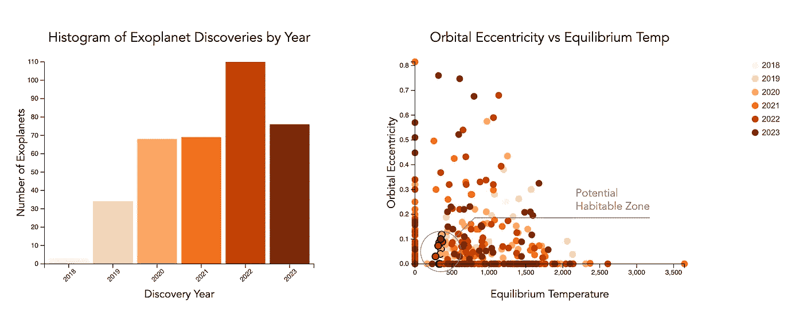

# **拥抱叙事数据可视化的艺术**

> 原文：[`towardsdatascience.com/embracing-the-art-of-narrative-data-visualization-3543706c6e56?source=collection_archive---------2-----------------------#2023-08-21`](https://towardsdatascience.com/embracing-the-art-of-narrative-data-visualization-3543706c6e56?source=collection_archive---------2-----------------------#2023-08-21)

## 通过 NASA 的 TESS 任务进行的数据可视化

[](https://albarqawi.medium.com/?source=post_page-----3543706c6e56--------------------------------)[](https://towardsdatascience.com/?source=post_page-----3543706c6e56--------------------------------) [Ahmad Albarqawi](https://albarqawi.medium.com/?source=post_page-----3543706c6e56--------------------------------)

·

[关注](https://medium.com/m/signin?actionUrl=https%3A%2F%2Fmedium.com%2F_%2Fsubscribe%2Fuser%2Fab1cf21d75fd&operation=register&redirect=https%3A%2F%2Ftowardsdatascience.com%2Fembracing-the-art-of-narrative-data-visualization-3543706c6e56&user=Ahmad+Albarqawi&userId=ab1cf21d75fd&source=post_page-ab1cf21d75fd----3543706c6e56---------------------post_header-----------) 发表在 [Towards Data Science](https://towardsdatascience.com/?source=post_page-----3543706c6e56--------------------------------) ·8 min read·2023 年 8 月 21 日[](https://medium.com/m/signin?actionUrl=https%3A%2F%2Fmedium.com%2F_%2Fvote%2Ftowards-data-science%2F3543706c6e56&operation=register&redirect=https%3A%2F%2Ftowardsdatascience.com%2Fembracing-the-art-of-narrative-data-visualization-3543706c6e56&user=Ahmad+Albarqawi&userId=ab1cf21d75fd&source=-----3543706c6e56---------------------clap_footer-----------)

--

[](https://medium.com/m/signin?actionUrl=https%3A%2F%2Fmedium.com%2F_%2Fbookmark%2Fp%2F3543706c6e56&operation=register&redirect=https%3A%2F%2Ftowardsdatascience.com%2Fembracing-the-art-of-narrative-data-visualization-3543706c6e56&source=-----3543706c6e56---------------------bookmark_footer-----------)

叙事视觉场景的示例，用于探索系外行星的特点 — 作者

数据可视化是向读者展示复杂数据的强大工具。更进一步，叙事可视化使我们能够构建数据故事，将信息转化为一系列引人入胜的场景。这种方法为观众量身定制了体验。

叙事可视化是关于打造引导观众穿越数据的场景。它以创新的方式呈现数据，通过这些数据讲述一个故事。这个故事强调关键点以增加互动性，使观众能够与图表建立联系。每个视觉元素应被精心编织成一个有意义的故事。这样，这些数据就能在主动引发观众感官的同时，进行有效的传达。这样的数据接触方式允许观众在一段时间内记住重要信息。

本文将探讨叙事可视化的概念及其在数据传达中的应用。由 NASA 的过境系外行星勘测卫星（TESS）任务发现的系外行星将作为我们检视叙事可视化的一个视角。我们还将探讨 D3，这是一款强大的用于创建数据驱动文档的 JavaScript 库。

# 解码叙事可视化的基础

叙事可视化的核心在于制作视觉吸引人的图表，并带领观众发现数据。数据在开始时被简要介绍；在中间阶段被深入探索，并以揭示关键见解或提供灵活的探索工具作为结尾，从而形成一个互动故事。

这是一个将数据组织成特定结构的过程，打造一个视觉故事，而不是随机呈现事实和数据。因此，数据成为故事中的角色，你作为叙述者的工作是通过视觉效果使这些角色栩栩如生。观众在与数据故事互动的过程中，会建立联系并识别出模式，这些模式容易在长时间内被记住。

叙事可视化有三种主要结构：

1.  **作者驱动的叙事**：作者通过数据提供了特定的路径并决定故事方向，以结构化的方式引导观众穿越数据。作者驱动的可视化在清晰传达见解方面非常有效，例如视频。

1.  **读者驱动的叙事**：这种方法将控制权交给观众。它提供了更具互动性的体验，观众可以按照自己的节奏探索数据并跟随自己的路径。这有助于鼓励参与和探索。例如，互动仪表板就是一个例子。

1.  **混合叙事**：结合了作者驱动和读者驱动叙事的元素。它们通常以作者驱动的介绍开始，随后是读者驱动的探索部分。这在引导讲故事和互动探索之间提供了平衡。例如，Martini Glass 数据表示就是一个例子。


martini glass sketch — 作者提供

在接下来的部分中，我们将使用“马提尼酒杯”结构，这是一种流行的混合叙事方式，来可视化 NASA TESS 任务的数据。该结构提供了一个初步由作者驱动的概述（酒杯的柄），随后是一个由读者驱动的探索空间（酒杯的碗）。这允许我们在让观众深入探索数据之前，带领他们了解数据的关键点。

# 案例研究：通过 NASA 的 TESS 任务发现系外行星


TESS 任务的概念 — 由[NASA 戈达德太空飞行中心](https://svs.gsfc.nasa.gov/12727)提供（许可详情见参考文献）

2018 年，NASA 通过发射凌日系外行星勘测卫星（TESS）任务，开始了探索太阳系之外系外行星的旅程。

TESS 任务已被证明是一个天文学上的宝藏。通过这一任务，NASA 积累了超过 90 个数据点。这些数据点包含关于每个系外行星的宝贵信息，有助于解开宇宙之谜。这些数据包括系外行星的名称、其宿主恒星和发现年份，以及它们的物理特征：大小、形状、偏心率和轨道周期。这些数据集概括了每个系外行星的故事，使 TESS 任务的事实和数据揭示出引人入胜的宇宙故事。


数据样本 — 原始数据包含超过 90 列

我们将使用[TESS 数据](https://exoplanetarchive.ipac.caltech.edu/cgi-bin/TblView/nph-tblView?app=ExoTbls&config=PS&constraint=disc_facility+like+%27%25TESS%25%27)创建叙事可视化，讲述多年来系外行星发现的故事，并使用最后的灵活工具进行深入分析。

**场景 1：已发现系外行星概览** 叙事从 2018 年到 2023 年 TESS 发现的系外行星概览开始，重点突出时间趋势，并在高层次上将某些特征与地球范围进行比较。这为我们的故事奠定了基础，提供了有关 TESS 任务范围和规模的背景。第一场景细分为三个具体的可视化，旨在展示数据的独特概览：

+   每年发现的系外行星数量直方图：展示了每年发现的系外行星数量。每根柱子的高度对应于发现的数量。为了提供互动体验，点击柱子会筛选其他图表中的数据，以便集中分析该年发现的系外行星。

+   平衡温度与轨道离心率的散点图：该散点图通过比较系外行星的平衡温度和轨道离心率，提供了系外行星特性的视图。平衡温度在 x 轴上显示，近似于系外行星的平均温度。轨道离心率在 y 轴上显示，表示系外行星轨道与完美圆形的偏差程度。交互式元素使用户能够进一步探索数据：悬停在圆圈上会显示数据概览，而点击则会转到第二个场景进行详细的探索视图。

+   恒星质量与半径的散点图：聚焦于主星，该可视化将恒星质量与半径进行比较，每个都由一个圆圈表示。与之前的可视化一样，交互功能允许用户探索特定的行星特性。



场景 1 — 按年份展示的系外行星概述

**场景 2：单个系外行星的深入探索**

接下来，我们通过点击单个系外行星来深入探讨，探索它们独特的特性，并将这些特性与地球上的范围进行比较。数值以一系列水平条形图呈现，描述特定参数并将系外行星的值与相应的地球范围进行比较。

本场景提供了对使每个行星独特的属性的更详细了解，如平衡温度、行星半径、轨道半长轴、轨道离心率，以及主星的半径和质量。


场景 2 — 单个系外行星特性与地球范围的比较

**场景 3：TESS 数据的交互式探索**

最终场景提供了一个交互式探索工具，允许用户更改各种比较范围并选择要比较的特性。在这个场景中，我们允许进行个性化的探索体验。


场景 3 — 交互工具

本案例研究展示了叙事可视化在使复杂数据变得易于访问和有趣方面的力量。在下一部分，我们将探讨实现细节。

# 使用 D3 进行叙事可视化

D3.js 是一个 [javascript 框架](https://d3js.org/)，用于在网页上进行交互式数据可视化。在我们开始构建 TESS 叙事可视化之前，让我们先探讨一下 D3 的一些基本功能。

**选择元素：**

D3 的一个重要功能是 ‘select’ 方法。它允许我们识别 HTML 文档中需要调整的元素。例如：

```py
d3.select("#visualization")
```

**附加和操作元素：**

D3 可以使用 `append`、`attr` 和 `style` 方法构建和管理 SVG 元素。

+   `append` 方法将新的元素（圆圈、矩形等）引入到 SVG 中，每个元素代表不同的数据点。

+   `attr` 和 `style` 调整这些元素的属性和样式，如其位置、大小和颜色。

**绑定数据：**

使用 `data` 方法，D3 将数据绑定到视觉元素上。这使其在创建数据驱动的可视化方面发挥了优势，允许动态更新。

**缩放**：

缩放将输入域映射到输出范围，调整数据的绘制区域。例如，`d3.scaleLinear()` 使用线性缩放，其中输入域中的任何给定数字直接对应输出范围中的一个数字。

# 构建 TESS 场景

现在我们已经了解了 D3 的基础知识，我们可以使用 TESS 任务数据（[可在此处获取](https://github.com/Barqawiz/NASA_TESS_Narrative/tree/main/data)）构建引人入胜的叙事。为了简洁起见，本文详细讨论了前两个场景的基础知识。您可以查看 [GitHub 仓库](https://github.com/Barqawiz/NASA_TESS_Narrative/tree/main) 以获取全面的场景实现。

## 准备 HTML

在头部加载 d3 库

```py
<script src="https://d3js.org/d3.v7.min.js"></script>
```

然后准备一个容器 div 来绘制图表：

```py
<div id="visualization"></div>
```

**场景 1：发现的系外行星概述**

下面是我们创建第一个场景的方式：

1.  使用 `d3.csv` 函数加载并存储 TESS 数据到一个变量中。

1.  散点图展示了 TESS 随时间发现的系外行星。

1.  添加了互动性，允许用户点击特定的系外行星并导航到场景 2。

加载数据并调用代码以绘制第一个场景：

```py
d3.csv("data/tess_confirmed_plannets.csv").then(function(myData) {
 data = myData;

 // Scene 1: Overview
 drawScene1(myData);
});
```

让我们通过在散点图中显示系外行星来绘制第一个场景的示例，查看行注释以获取实现细节：

TESS 任务数据探索 — scene1 代码示例，用于绘制概述散点图

**场景 2：对单个系外行星的详细探索**

我们将按照以下步骤创建第二个场景：

1.  创建 `drawScene2` 函数以使用选定系外行星的数据。

1.  创建展示选定系外行星的特征并与地球范围进行比较的视觉元素。

TESS 任务数据探索 — scene2 代码示例，用于将单个系外行星特征与地球范围进行比较

给出的代码是场景 1 和场景 2 的简化版本。完整的代码，包括互动元素和功能，可以从链接的 GitHub 仓库中获取。

您可以查看下面的最终叙事结果：

[`barqawiz.github.io/NASA_TESS_Narrative/`](https://barqawiz.github.io/NASA_TESS_Narrative/)

**总之**，叙事可视化偏离了单调的数据沟通路径，踏上了一段旅程。数据以结构化但引人入胜的方式呈现，以吸引观众的注意。这些数据故事以个性化的方式吸引观众。然而，这些故事的策展人可以有意选择他们的叙事结构，以实现高效的数据讲述，无论是作者驱动的、读者驱动的还是混合叙事。

NASA 的过境系外行星勘测卫星任务数据被用作案例研究，以展示叙事可视化。这个 TESS 任务发现了超过 90 个特征的系外行星，超出了我们的太阳系。混合的马提尼杯方法用于向观众传达这些数据。叙事从作者驱动的方法开始，然后通过读者驱动的方法过渡到关于系外行星的详细信息，进行互动和个性化的探索。

创作视觉叙事是一门艺术，明确你的**最终目标**和目标受众，并选择故事结构，对数据的隐含意义和吸引观众至关重要。

# 参考文献

+   NASA TESS 任务画廊: [链接](https://svs.gsfc.nasa.gov/Gallery/TESS.html)

+   NASA 系外行星档案: [链接](https://exoplanetarchive.ipac.caltech.edu/)

+   NASA 内容政策: [链接](https://gpm.nasa.gov/image-use-policy)

+   地球事实表: [链接](https://nssdc.gsfc.nasa.gov/planetary/factsheet/earthfact.html)

+   包含完整代码的 Github 仓库: [链接](https://github.com/Barqawiz/NASA_TESS_Narrative)

+   清理后的数据: [链接](https://github.com/Barqawiz/NASA_TESS_Narrative/blob/main/data/tess_confirmed_plannets.csv)

+   UIUC 课程 “CS 416: 数据可视化”。

引用：**NASA 内容（图像、视频、音频等）通常不受版权保护**，可以用于教育或信息目的**而不需要明确许可**。
