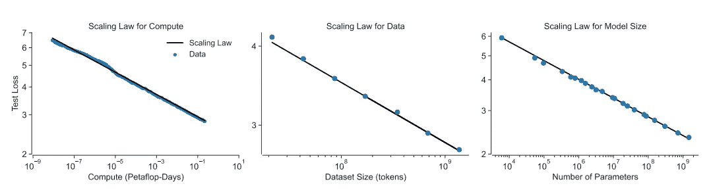
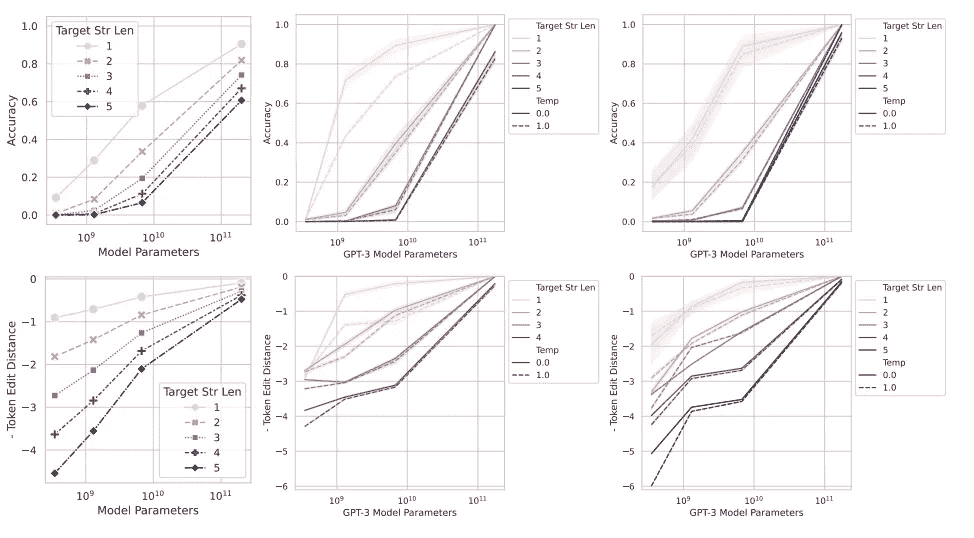

# 人工智能中的涌现能力：我们在追逐一个神话吗？

> 原文：[`towardsdatascience.com/emergent-abilities-in-ai-are-we-chasing-a-myth-fead754a1bf9`](https://towardsdatascience.com/emergent-abilities-in-ai-are-we-chasing-a-myth-fead754a1bf9)

## 观点

## 对大型语言模型涌现性质的视角转变

 [Salvatore Raieli](https://salvatore-raieli.medium.com/?source=post_page-----fead754a1bf9--------------------------------)

·发布在 [Towards Data Science](https://towardsdatascience.com/?source=post_page-----fead754a1bf9--------------------------------) ·阅读时间 11 分钟·2023 年 5 月 16 日

--

作者使用 DALL-E 创作的图片

# 一个模型的涌现性质

[涌现性质](https://en.wikipedia.org/wiki/Emergence)不仅仅是人工智能领域的概念，它适用于所有学科（从物理学到生物学）。这一概念一直吸引着科学家们，无论是在描述还是试图理解其起源方面。诺贝尔奖获得者物理学家[P.W. Anderson](https://en.wikipedia.org/wiki/Philip_W._Anderson)用“更多即不同”来综合这一思想。在某种意义上，它可以被定义为涌现性质，即随着系统复杂性的增加而出现的性质，无法预测。

例如，你可以用一个小分子来编码信息，但 DNA（一个大分子）编码的是基因组。或者[少量铀](https://bounded-regret.ghost.io/future-ml-systems-will-be-qualitatively-different/)并不会导致核反应。

“复杂对称和[分形](https://en.wikipedia.org/wiki/Fractal) [模式](https://en.wikipedia.org/wiki/Patterns_in_nature) 在[雪花](https://en.wikipedia.org/wiki/Snowflake)中的形成体现了物理系统中的涌现现象”。图片来源：[这里](https://en.wikipedia.org/wiki/Emergence)

最近，在人工智能模型中观察到了相同的行为，最常见的[定义之一是](https://arxiv.org/abs/2206.07682)：“如果某种能力在较小的模型中不存在但在较大的模型中存在，那么它就是涌现的。”

> 这意味着什么？如何观察到？

OpenAI 在一篇文章中声明，模型的性能遵循[规模法则](https://arxiv.org/abs/2001.08361)：数据和参数越多，性能越好。对于涌现属性，预期是一个特定的模式：随着参数数量的增加，性能几乎是随机的，直到达到某个阈值时，观察到某种属性（性能开始显著改善）。基本上，我们看到曲线的急剧转折（称为相变）。这也被称为涌现，因为通过检查小规模模型无法预测。

大型语言模型的涌现能力。图片来源 ([这里](https://arxiv.org/abs/2304.15004))

总之，我们可以说，如果一个属性满足这两个条件，它被认为是涌现的：

+   **敏锐性**，其过渡在存在或不存在之间是不连续的。

+   **不可预测性**，随着参数的增加，其出现无法预测。

此外，扩展一个变换器模型主要考虑三个因素：计算量、模型参数数量和训练数据集大小。

这三个因素都使得模型昂贵。另一方面，这些属性特别受到追求，也被用作增加参数数量的理由（尽管模型并未得到最佳训练）。

图片来源：[这里](https://arxiv.org/abs/2206.07682)

一些研究还集中在为什么这些属性会出现，为什么以这种方式出现，以及为什么在特定阈值下出现。据一些观点，某些属性的出现是可以预测的：

> 例如，如果一个多步推理任务需要 l 步顺序计算，这可能需要一个至少有 O (l) 层深度的模型。 ([source](https://arxiv.org/abs/2206.07682))

也提出了替代解释，如更多的参数有助于记忆。随着数据的增加，模型获得知识，并在某一点达到临界质量，能够支持该属性。

此外，一些作者提出，不同的架构和更好的数据质量可能会导致这些属性在更小的模型中也出现。

在 LLaMA 的研究中，观察到一个比 GPT-3 小得多的模型展示了相似的属性和性能。

 [## META 的 LLaMA：一个小型语言模型战胜巨头

### META 开源模型将帮助我们理解语言模型的偏见是如何产生的。

medium.com](https://medium.com/mlearning-ai/metas-llama-a-small-language-model-beating-giants-5065948e0b7f?source=post_page-----fead754a1bf9--------------------------------)

> 无论如何，问题依然存在，为什么这些属性会出现？

Anthropic 在一项研究中指出：

> 大型生成模型具有矛盾的特性——高可预测性——模型损失与训练所花费的资源有关，且与许多任务的性能改善有松散的相关性——以及高不可预测性——特定的模型能力、输入和输出无法提前预测（[来源](https://arxiv.org/abs/2202.07785)）

简而言之，对于一个[大型语言模型](https://en.wikipedia.org/wiki/Large_language_model)，我们可以预测的事物和无法预测的事物是存在的。例如，扩展规律允许我们预测增加参数数量将提升规模上的性能，但同时，我们无法预测某些属性的涌现，这些属性会随着参数的增加而突然出现。

因此，根据这一原则，我们甚至不应尝试预测这些属性。

扩展规律可靠地预测模型性能。图像来源：[这里](https://arxiv.org/abs/2202.07785)

三个突发特定能力扩展属性的例子。图像来源：[这里](https://arxiv.org/abs/2202.07785)

> 为什么我们如此关注预测这些属性？

第一个原因是纯粹的经济学：**如果某个属性只有在特定数量的参数下才会出现，我们就不能使用较小的模型**。这显著增加了训练和硬件的成本。另一方面，如果属性无法预测，我们甚至无法估算获得该属性的成本。

其次，这解释了在寻找新属性时参数异常增加的原因，这些新属性会在参数达到万亿级时出现。毕竟，这可能是获得某些属性的唯一途径。

此外，这还带来了安全问题，因为我们无法预测模型在特定规模下会具备什么属性。一个模型可能会发展出问题属性，可能不适合部署。而且，这么大的模型也更难检测偏见和危害。

此外，扩展规律和涌现属性也是推动大型模型快速发展的原因之一。

这开启了一个令人担忧的情景，一方面，我们有开源模型的爆炸性增长、训练成本的降低和[聊天机器人](https://medium.com/data-driven-fiction/everything-but-everything-you-need-to-know-about-chatgpt-546af7153ee2)的使用增加。但另一方面，我们无法预测这些模型的属性。

 ## 无限的语言模型图书馆

### 开源、数据和注意力：LLM 的未来将如何变化

towardsdatascience.com

# 如果涌现属性只是海市蜃楼呢？

图片由[Nick Fewings](https://unsplash.com/fr/@jannerboy62)提供，来源于 Unsplash

2020 年，谷歌研究人员意识到了 LLMs 的潜力，并预测它们将具有变革性。因此，他们请社区提供既不同又困难的任务示例，然后可以用来测试 LLM 的能力。由此诞生了[超越模仿游戏基准](https://arxiv.org/abs/2206.04615)（BIG-bench）项目。

这个项目实际上也集中于研究新兴和惊人的属性，并尝试理解它们的起源。

图片来源：[这里](https://arxiv.org/abs/2206.04615)

确实，该数据集和文章讨论了概率的出现，并试图提供解释。例如，超过十亿参数的模型能够解决三位数加法或两位数乘法问题。

基于这篇文章，斯坦福大学的研究人员在最近的一篇论文中质疑了语言模型的新兴属性这一概念。

 [## 大型语言模型的新兴能力是一场幻觉吗？

### 最近的研究声称，大型语言模型显示出新兴能力，这些能力在小规模模型中并不存在……

arxiv.org](https://arxiv.org/abs/2304.15004?source=post_page-----fead754a1bf9--------------------------------)

实际上，作者注意到，新兴属性似乎仅在[非线性](https://en.wikipedia.org/wiki/Nonlinear_system)或其他不连续的度量下出现。

作者提供了一个替代假设来解释属性的出现。他们认为这是性能测量的选择。换句话说，错误每个标记随着模型规模的增加平稳、持续和可预测地增长。但随后研究作者使用了不连续的度量来衡量任务性能，因此模型的任务表现看起来是突发性的。

换句话说，一个小模型在某个任务上表现尚可，但我们无法检测到，因为所选择的度量是不连续的，只有在某个错误（在某种模型规模下达到）下，我们才能观察到任务性能。

图片来源：[这里](https://arxiv.org/abs/2304.15004)

根据作者的说法，测试中样本数量少也导致小模型没有得到适当评估。

为了证明这一点，作者从规模定律开始，根据该定律，性能（或错误）随着度量数量的增加而增加，并且这种现象在不同规模下确实是一致的。正如作者所指出的，许多度量需要序列中的所有标记都正确，尤其是在处理长序列时，错误会显著增加。

他们能够使用 InstructGPT/GPT-3 进行这些实验，因为像 LaMDA、Gopher 和 Chinchilla 这样的模型不幸地无法访问。这阻止了他们对不同模型进行广泛的评估。由于 LLMs 仅在文本上进行训练（而 GPT 则训练于预测下一个词），LLMs 的一个令人惊讶的能力是整数算术任务。正如 GPT-3 介绍文章所显示的那样，这一特性在规模的函数中被定义为突现特性。

不同规模模型在少样本设置下的所有 10 个算术任务的结果。图片来源：[这里](https://arxiv.org/abs/2005.14165)

如图所示（顶部），当使用非线性度量来测量性能时，我们看到了一种突现特性。而当使用线性度量（底部）时，我们看到性能随规模的变化呈现出连续且可预测的增长。

图片来源：[这里](https://arxiv.org/abs/2304.15004)

此外，作者指出，通过增加小模型评估的数据，即使使用非线性度量，效果也没有那么明显。换句话说，如果测试数据集较大，即使使用非线性度量，我们也不会观察到如此显著的效果。

实际上，在低分辨率（少量测试数据）下，小模型的零准确率更可能出现，这支持了一个特性仅在达到某个阈值后才会突现的说法。

图片来源：[这里](https://arxiv.org/abs/2304.15004)

作者随后决定扩展到关于突现特性的元分析，使用 BigBench（因为它是公开的且文档记录完善）。此外，这个数据集提供了多个评估度量。当作者查看非线性度量（精确字符串匹配、选择题评分、ROUGE-L-Sum）时，可以观察到突现特性。另一方面，使用线性度量则没有观察到突现特性。

最令人惊讶的发现是，92%的声称的突现能力来源于使用两个不连续度量：选择题评分和精确字符串匹配。

因此，如果确实是由于不连续度量的使用导致了突现特性，仅仅更改度量就足以使这些特性消失。保持模型和任务不变，只需更改评分度量，突现特性就会消失。在这种情况下，作者只是重复使用了 LaMDA 系列模型的输出，并将度量从不连续的（选择题评分）更改为连续的（Brier 评分）。

> 最后一个问题是：**但如果突现特性是通过选择不连续度量出现的，我们可以使用不连续度量来创造突现特性吗？**

作者以手写数字数据集（MNIST 或数据科学家的最爱数据集）的分类能力为例。任何尝试在此数据集上训练卷积网络的人都注意到，即使只有少数几层，也能获得相当好的结果。增加层数可以提高准确率。如果这是一个突现属性，我们会期望一开始准确率接近零，通过将参数增加到某个阈值以上，准确率会显著提高。

作者使用了[LeNet](https://en.wikipedia.org/wiki/LeNet)家族（多个具有递增参数数量的模型）。他们简单地选择了一种新的度量，称为子集准确率：“如果网络正确分类了 K 个 K（独立）测试数据，则为 1，否则为 0。”

在使用测试准确率时，我们注意到经典的准确率随 S 型趋势增加，使用新的不连续度量时，似乎分类手写数字的能力是一种突现属性。

作者提供了另一个例子：使用自编码器进行图像重建。通过创建一个新的不连续度量，自编码器的重建能力成为了一种突现属性。

作者总结道：

> 突现能力可能是研究者选择的产物，而不是模型家族在特定任务上的基本属性（[source](https://arxiv.org/abs/2304.15004)）

换句话说，如果有人想要突现属性，他们所要做的就是选择一个不连续度量，神奇地，他们将看到在某个参数阈值之上出现一个属性。

作者保守地声明：“*本文应被解读为声称大型语言模型无法展示突现能力。*” 他们只是声称，迄今为止看到的属性是由度量的选择产生的。

现在确实是这样，直到你看到一只黑天鹅之前，所有天鹅都是白色的。然而，下次出现突现属性时，必须检查其出现的条件。此外，这也是再次思考现在可能不适合评估模型质量的基准的呼吁。其次，大型语言模型应该是开源的，因为任何声明都可能仅仅是由于评估的选择。

# 结束语

长时间以来，突现属性被认为是大型语言模型（LLMs）中最令人惊讶的行为之一。超出一定数量的参数后，能力会出现，这既是一个迷人的概念，又是一个令人恐惧的概念。确实，一方面，它进一步证明了寻找越来越大模型的理由。另一方面，潜在危险能力的突现没有警告是个问题。

这篇文章意外地展示了评价指标的选择如何导致属性的出现。这促使我们重新思考基准测试，并将重点转向评价指标的选择。其次，可能并不存在涌现属性。

更广泛地说，许多作者一直选择让他们的数据脱颖而出的评价指标。因此，只有当模型及其输出对公众开放，供独立的科学研究时，我们才能确信某一主张的真实性。

# 如果你觉得这很有趣：

*你可以查看我的其他文章，你也可以* [***订阅***](https://salvatore-raieli.medium.com/subscribe) *以便在我发布文章时获得通知，你还可以* [***成为 Medium 会员***](https://medium.com/@salvatore-raieli/membership) *以访问所有故事（这是平台的附属链接，我会从中获得少量收入，不会给你带来任何费用），你也可以在*[***LinkedIn***](https://www.linkedin.com/in/salvatore-raieli/)***上与我联系或找到我。***

*这是我 GitHub 仓库的链接，我计划在这里收集与机器学习、人工智能等相关的代码和许多资源。*

 [## GitHub - SalvatoreRa/tutorial: 机器学习、人工智能、数据科学的教程…

### 机器学习、人工智能、数据科学的教程，包含数学解释和可重用的代码（使用 python…

github.com](https://github.com/SalvatoreRa/tutorial?source=post_page-----fead754a1bf9--------------------------------)

*或者你可能对我最近的文章之一感兴趣：*

 [## PMC-LLaMA：因为谷歌搜索症状还不够

### 一个在医学院（或在知识竞赛之夜）能成为你最佳朋友的小模型

levelup.gitconnected.com](https://levelup.gitconnected.com/pmc-llama-because-googling-symptoms-is-not-enough-e1b875ee4c4a?source=post_page-----fead754a1bf9--------------------------------)  [## 欢迎回到 80 年代：卷积可能会打破变形金刚

### Hyena 模型展示了卷积如何可能比自注意力更快

levelup.gitconnected.com](https://levelup.gitconnected.com/welcome-back-80s-transformers-could-be-blown-away-by-convolution-21ff15f6d1cc?source=post_page-----fead754a1bf9--------------------------------)  [## 注视你的眼睛：谷歌 AI 模型如何通过眼睛预测你的年龄

### 新模型可以通过分析眼睛照片解锁衰老的秘密

[levelup.gitconnected.com](https://levelup.gitconnected.com/looking-into-your-eyes-how-google-ai-model-can-predict-your-age-from-the-eye-857979339da9?source=post_page-----fead754a1bf9--------------------------------)
