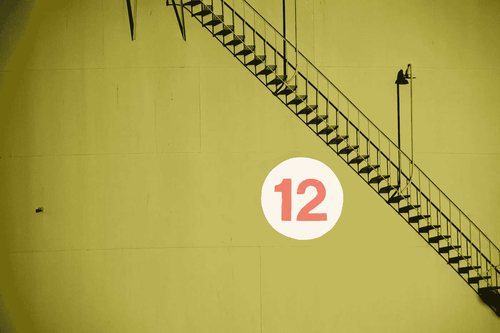

# 12 年数据旅程的年终报告

> 原文：[`towardsdatascience.com/ending-the-year-with-12-lessons-about-data-career-8786afc068f4?source=collection_archive---------5-----------------------#2023-12-09`](https://towardsdatascience.com/ending-the-year-with-12-lessons-about-data-career-8786afc068f4?source=collection_archive---------5-----------------------#2023-12-09)

## 三个关于数据职业旅程的故事

 [Marina Tosic](https://medium.com/@martosi?source=post_page-----8786afc068f4--------------------------------)

·

[关注](https://medium.com/m/signin?actionUrl=https%3A%2F%2Fmedium.com%2F_%2Fsubscribe%2Fuser%2Fe40b4f03cd3e&operation=register&redirect=https%3A%2F%2Ftowardsdatascience.com%2Fending-the-year-with-12-lessons-about-data-career-8786afc068f4&user=Marina+Tosic&userId=e40b4f03cd3e&source=post_page-e40b4f03cd3e----8786afc068f4---------------------post_header-----------) 发表在 [Towards Data Science](https://towardsdatascience.com/?source=post_page-----8786afc068f4--------------------------------) ·15 分钟阅读·2023 年 12 月 9 日

--

[“数字 12 被视为宇宙数字](https://www.britannica.com/science/the-number-twelve) —— 标志着 12 个月、12 个星座以及 12 个月亮和太阳的站点” [照片由 [Michael Skok](https://unsplash.com/@mjskok?utm_source=medium&utm_medium=referral) 提供，出处 [Unsplash](https://unsplash.com/?utm_source=medium&utm_medium=referral)]

# 引言：超越数字

在我之前的职位上，我为我的业务同事和首席执行官制作了年终报告。

你可能会说，这没什么特别的。标准报告，涉及不同业务领域的各种数字——从一般业务控制、市场营销到供应链管理和财务。

说实话，我知道这些报告只是我任务的一部分，不会引起公司每一位同事的太多关注。

所以，我考虑了一下如何让报告更具“吸引力”。答案很简单——让它们听起来很酷。

换句话说，我决定给报告名称加点趣味，因为给数字增添趣味不在考虑范围内。

我给自己的报告起名字与其他标准年终报告的不同之处在于，我的名字是根据今年的热门词汇来命名的。

话虽如此，2020 年的报告被命名为**“臭名昭著的 2020”**。2021 年的报告被命名为**“疫苗 2021”**，而 2022 年的报告则是**“ChatGPT 2022”**。

你已经清楚了我为什么决定用这些名字。
