# 能源供应与需求优化：使用 Gurobi Python 进行数学建模

> 原文：[`towardsdatascience.com/energy-supply-and-demand-optimisation-mathematical-modelling-using-gurobi-python-8a8b1cb9559a?source=collection_archive---------6-----------------------#2023-09-29`](https://towardsdatascience.com/energy-supply-and-demand-optimisation-mathematical-modelling-using-gurobi-python-8a8b1cb9559a?source=collection_archive---------6-----------------------#2023-09-29)

## 通过数学优化实现高效的能源分配

[](https://medium.com/@kongyouliow?source=post_page-----8a8b1cb9559a--------------------------------)[](https://towardsdatascience.com/?source=post_page-----8a8b1cb9559a--------------------------------) [Kong You Liow](https://medium.com/@kongyouliow?source=post_page-----8a8b1cb9559a--------------------------------)

·

[关注](https://medium.com/m/signin?actionUrl=https%3A%2F%2Fmedium.com%2F_%2Fsubscribe%2Fuser%2F8a77c8a1ff64&operation=register&redirect=https%3A%2F%2Ftowardsdatascience.com%2Fenergy-supply-and-demand-optimisation-mathematical-modelling-using-gurobi-python-8a8b1cb9559a&user=Kong+You+Liow&userId=8a77c8a1ff64&source=post_page-8a77c8a1ff64----8a8b1cb9559a---------------------post_header-----------) 发表在 [Towards Data Science](https://towardsdatascience.com/?source=post_page-----8a8b1cb9559a--------------------------------) ·11 分钟阅读·2023 年 9 月 29 日[](https://medium.com/m/signin?actionUrl=https%3A%2F%2Fmedium.com%2F_%2Fvote%2Ftowards-data-science%2F8a8b1cb9559a&operation=register&redirect=https%3A%2F%2Ftowardsdatascience.com%2Fenergy-supply-and-demand-optimisation-mathematical-modelling-using-gurobi-python-8a8b1cb9559a&user=Kong+You+Liow&userId=8a77c8a1ff64&source=-----8a8b1cb9559a---------------------clap_footer-----------)

--

[](https://medium.com/m/signin?actionUrl=https%3A%2F%2Fmedium.com%2F_%2Fbookmark%2Fp%2F8a8b1cb9559a&operation=register&redirect=https%3A%2F%2Ftowardsdatascience.com%2Fenergy-supply-and-demand-optimisation-mathematical-modelling-using-gurobi-python-8a8b1cb9559a&source=-----8a8b1cb9559a---------------------bookmark_footer-----------)

日落时分的电力塔照片。来源：[Matthew Henry](https://unsplash.com/@matthewhenry)来自[Unsplash](https://unsplash.com/)。

我们目前正处于一个能源供应和需求平衡变得尤为重要的时代。传统能源如石油和天然气正面临着诸多困难，例如俄罗斯-乌克兰冲突等地缘政治因素，这些因素扰乱了天然气供应，加上自然资源的总体枯竭。

另一方面，随着越来越多的国家从发展中国家转变为发达国家，能源需求也在不断增长。这种经济增长意味着对能源的需求增加，以支持生产和工业过程。应对气候变化的紧迫性进一步强调了对可再生能源的需求。综合所有因素，这意味着实现良好的能源供应和需求平衡变得愈加重要。

数学优化是研究在预定义约束条件下选择标准以**最小化**或**最大化**特定目标的过程，所有这些都通过数学模型来管理。它在解决各种现实世界问题中非常有用，每个问题都有其独特的复杂性。

例如，在物流和运输中，数学优化可以用来解决如车辆路径问题等挑战，该问题优化车队的路线，从而通过使用高效的路线来降低成本和环境影响。在计算生物学中，这种方法对于理解复杂的生物过程、改善药物发现、基因组学和疾病途径研究具有重要作用，通过开发精确的模型来实现。此外，数学优化在供应链中扮演着关键角色，供应链是现代商业和工业中的重要元素。它优化资源分配，确保生产和分配系统的高效性，减少浪费和成本，同时提升客户满意度。总之，数学优化使各个领域的决策者能够应对复杂的问题，找到问题的**最佳解决方案**。

在本文中，我们展示了如何使用数学优化来解决基本的能源供应和需求问题。我们将首先解释问题陈述并概述数学模型。接着，我们将通过一个实际的例子，并使用 Python 中的 Gurobi 求解器来运行模型。最后，我们将分析从这次模拟中获得的结果。

## 1\. 问题陈述

让我们设想一个假设情况，我们负责制定一个虚构国家的年度能源生产和储存预算。在这个国家中，只有四种能源来源，即太阳能、风能、天然气和核能。


我们问题中不同能源来源的艺术插图：太阳能、风能、天然气和核能。来源：图标由 [small.smiles](https://www.flaticon.com/authors/smallsmiles)、[wanicon](https://www.flaticon.com/authors/wanicon)、[Freepik](https://www.freepik.com/) 提供，来自 [Flaticon](https://www.flaticon.com/)。

我们可以访问详细的数据，这些数据包含了每月的生产和储存能力，以及相关的生产和储存成本的见解。此外，我们假设了解全年能源需求。关键问题是：我们如何优化每种能源的每月生产和储存量，以最小化年度总成本？

## **2\. 数学公式**

现在，让我们深入探讨我们模型的数学公式。如果你不喜欢方程式，可以跳过这一部分。然而，对于那些觉得数学有趣的人，所获得的见解将是值得的。我们将以精确的数学术语概述参数、目标函数和约束。

## **2.1\. 参数**

让我们定义我们模型中使用的数学符号。我们用 *e* ∈ *E* 表示所有能源来源集合 *E*（太阳能、风能、天然气和核能）中的能源类型，*t* ∈ *T* 表示所有月份集合 *T*（一月、二月、三月等等）中的月份。

现在，我们介绍为我们的问题提供的以下参数：

+   *Dₜ* 是第 *t* 个月的总预期能源需求。

+   *Pₜₑ* 是第 *t* 个月能源来源 *e* 的生产上限。

+   *Sₜₑ 是* 能源来源 *e* 在第 *t* 个月的储存上限。

+   *Aₑ* 是能源来源 *e* 的生产成本。

+   *Bₑ* 是能源来源 *e* 的储存成本。

我们模型的变量定义如下：

+   *xₜₑ* 是第 *t* 个月生产的能源来源 *e* 的数量。

+   *yₜₑ* 是第 *t* 个月剩余的能源来源 *e* 的数量，这也是该月将被储存的数量。

+   *zₜₑ* 是在第 *t* 个月使用的能源来源 *e* 的数量，用于满足该月的能源需求。

## **2.2\. 目标函数**

现在，让我们定义我们的目标函数。我们的目标是最小化全年的总成本。可以用数学术语表达如下：

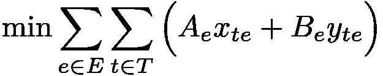

在这里，*Aₑxₜₑ* 代表第 *t* 个月能源 *e* 的生产成本，而 *Bₑyₜₑ* 表示第 *t* 个月能源 *e* 的储存成本。两个求和符号 Σ 表示对全年所有能源来源的这些生产和储存成本进行求和。目标是找到使总成本最小化的变量 *xₜₑ* 和 *yₜₑ* 的值。

## 2.3\. 约束

约束条件是我们问题解决方法中的关键部分。它们确保我们找到的解决方案在给定参数下既现实又可行。

## 2.3.1\. 质量平衡约束

第一个约束，也称为质量平衡约束，确保在给定月份的每个能源来源中，生产的数量和从前一个月结转的数量之和等于使用的数量和结转到下一个月的数量之和。我们假设在第一个月 *t*₀（1 月），尚未有能量储存。从数学上讲，这个约束可以表示为：

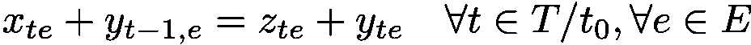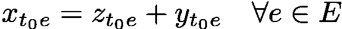

## 2.3.2\. 需求约束

接下来是需求约束，这是我们问题的一个基本方面。它确保在任何给定的月份，前一个月生产的和结转的总能量必须足以满足该月的能源需求。从数学上讲，这个约束可以表示为：

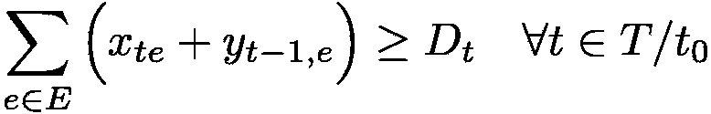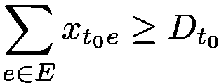

在这里，Σ*ₑ* 表示对所有能源来源 e 的求和。该约束确保在给定的月份 *t* 中，总能量（所有能源来源的生产和储存之和）大于或等于该月的能源需求 *Dₜ*。由于在第一个月 *t*₀ 没有能量储存，我们只需确保第一个月生产的总能量足以满足该月的需求。

## 2.3.3\. 变量域约束

最后一组约束涉及定义变量的域，这对于确保这些变量的值保持在有意义和可行的范围内至关重要。在我们的情况下，我们有生产限制和储存限制，分别限制 *xₜₑ* 和 *yₜₑ* 的值。此外，由于这些变量不应取负值，我们需要在其域上设定下限。从数学上讲，域约束可以表示为：

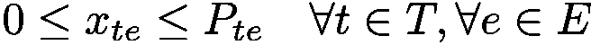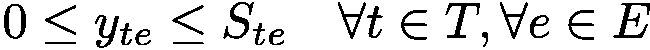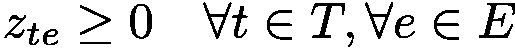

不需要明确地定义 *zₜₑ* 的上限，因为它由质量平衡约束固有地决定。

## 3\. 代码

在这里，我们将简要描述代码实现。我们首先导入 Gurobi 库和一个自定义的`Data`类，负责加载数据。代码可以在 GitHub 上找到： [能源优化](http://kyliow/energy-optimisation: Energy optimisation exploration (github.com))。

第一步是定义模型和必要的变量。

```py
import gurobipy
from gurobipy import GRB

from data_extraction import Data

# Model
model = gurobipy.Model("Energy optimisation")

# Variables
X = model.addVars(
    Data.months, 
    Data.energies, 
    name="Amount supplied", 
    ub=Data.production_limit,
)
Y = model.addVars(Data.months, Data.energies, name="Amount remained")
Z = model.addVars(Data.months, Data.energies, name="Amount used")
```

我们可以使用`model.addVars()`方法中的`ub`参数来设定变量的上限，或者通过`model.addConstrs()`方法指定约束条件。在这里，我们展示了如何在`model.addVars()`方法中设定能源生产`X`的上限。稍后，我们将展示如何使用`model.addConstrs()`方法为能源储存`Y`设定上限。

接下来，我们定义目标函数。

```py
# Objective function
obj = gurobipy.quicksum(
    (Data.production_cost[energy] * X[month, energy])
    + (Data.storage_cost[energy] * Y[month, energy])
    for energy in Data.energies
    for month in Data.months
)
model.setObjective(obj, GRB.MINIMIZE)
```

最后，我们定义约束条件，第一个是质量平衡约束。

```py
# Mass balance constraints
model.addConstrs(
    (
        Y[Data.months[m_ind - 1], energy] + X[month, energy]
        == Z[month, energy] + Y[month, energy]
        for energy in Data.energies
        for m_ind, month in enumerate(Data.months)
        if month != Data.months[0]
    ),
    name="Energy balance",
)
model.addConstrs(
    (
        X[Data.months[0], energy]
        == Z[Data.months[0], energy] + Y[Data.months[0], energy]
        for energy in Data.energies
    ),
    name="Energy balance",
)
```

在定义质量平衡约束后，我们继续建立需求约束。

```py
# Demand constraint
model.addConstrs(
    (
        gurobipy.quicksum(
            Y[Data.months[m_ind - 1], energy] + X[month, energy]
            for energy in Data.energies
        )
        >= Data.demand[month]
        for m_ind, month in enumerate(Data.months)
        if month != Data.months[0]
    ),
    name="Demand",
)
model.addConstr(
    (
        gurobipy.quicksum(
          X[Data.months[0], energy] for energy in Data.energies
        ) >= Data.demand[Data.months[0]]
    ),
    name="Demand",
)
```

在最后一步，我们展示了如何使用`model.addConstrs()`方法为储存`Y`设定上限。

```py
# Upper limit for Y
model.addConstrs(
    (
        Y[month, energy] <= Data.storage_limit[energy]
        for month in Data.months
        for energy in Data.energies
    ),
    name="Storage",
)
```

## 4\. 模拟分析

为了评估我们的模型，我们需要一些模拟数据。在这里，我们使用 2022 年英国的月度能源需求数据作为我们的模拟能源需求。同时，我们使用这些能源来源在 2022 年英国的能源生产数据，乘以 1.5 作为月度生产能力的近似值。能源需求和生产能力如下面的图所示。

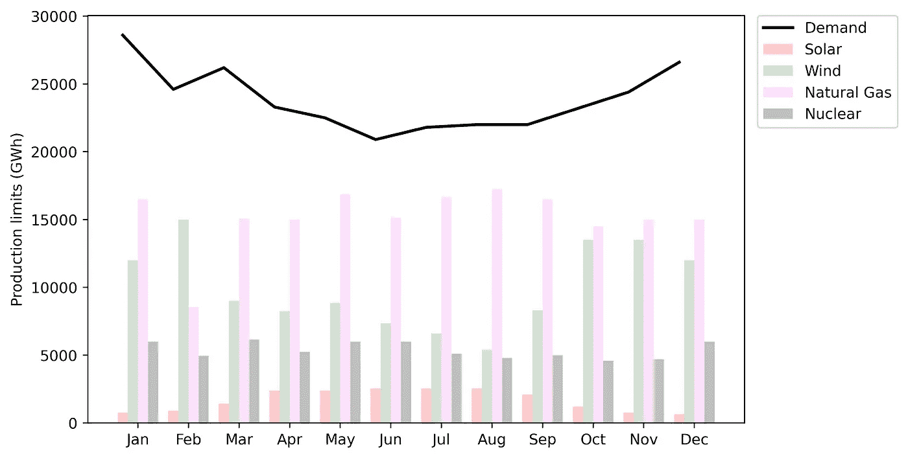

每种能源来源的月生产限额和每月能源需求的条形图。来源：作者提供的图像。

对于储存容量，我们使用相当于欧盟天然气储存容量 10%的代理值，即每月约 9500 GWh，来代表天然气储存。我们为其他能源来源分配了每月约 2000 GWh 的储存容量，假设它们储存在大型能源储存设施中。

最后，我们将生产成本数据与 2022 年这些能源来源的实际成本进行近似。对于储存，我们采用天然气的实际储存成本，大约为每 GWh £16,000。然而，对于其他能源来源，我们假设它们使用锂电池储存，这通常比天然气的实际储存成本高得多。为了显示这种显著的成本差异，我们将其他能源来源的储存成本设定为每 GWh £80,000,000。

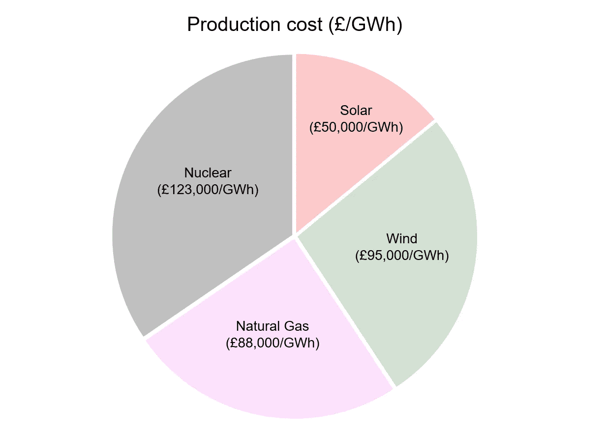

生产成本的饼图（单位：GBP 每 GWh）。来源：作者提供的图像。

下图展示了全年能源生产和储存成本，其中虚线和点线分别表示这两项成本。鉴于天然气的储存成本与其他能源相比极为便宜，甚至可能低于某些能源的生产成本，因此最优策略是全年持续储存天然气。因此，储存成本仅归因于天然气储存。唯一的例外是十二月，此时不进行储存。这是因为我们的分析设计为在十二月结束，因此没有激励去储存分析期之外的能源。

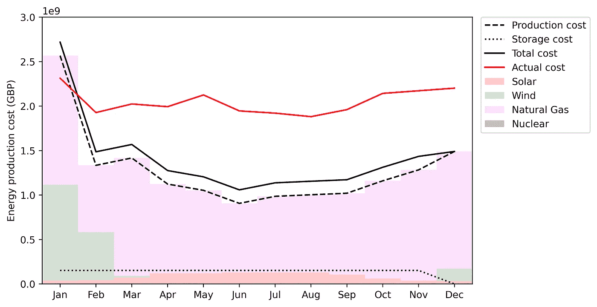

能源生产的堆叠柱状图，展示了每月的生产量和成本图。来源：作者提供的图片。

此外，我们的分析揭示了天然气生产由于其较低的生产成本而成为最具成本效益的选项。在风能和太阳能方面，我们观察到生产量在一年中有所波动，这可能受到生产能力的季节性变化的影响（例如，最大日照和峰值太阳能发电通常发生在年中）。这一波动从生产限制的柱状图中可以明显看出。

当我们将每月的生产和存储成本相结合时，结果是优化后的年成本为 170.1 亿英镑。

值得注意的是，我们使用了与 2022 年英国实际需求相同的能源需求数据。这表明我们优化的能源供应和存储分配优于实际情况。当考虑到像英国这样的国家通常会将多余的能源出口到其他国家以换取收入时，这一结论变得更加明显。虽然我们模型中没有考虑到多余能源的出口，但在现实世界中它代表了额外的潜在利益。

在实验的精神下，我们将除天然气之外的所有能源来源的存储成本降低了 1000 倍，以模拟大规模电池存储变得显著便宜的假设情况。结果如下面的图所示。

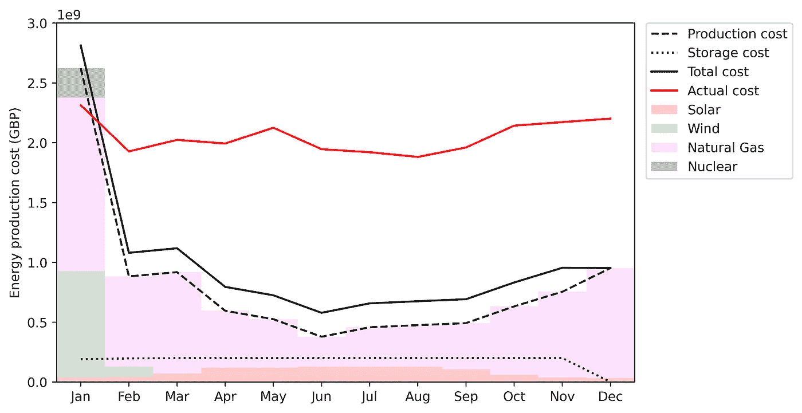

能源生产的堆叠柱状图，展示了每月的生产量和在修订存储成本下的成本图。来源：作者提供的图片。

在这种新情境下，我们可以看到能源存储增加，而生产成本通常下降，因为储存能源变得比生产能源更经济。有趣的是，我们还注意到实际需要生产核能，尽管仅在 1 月份。 

在这种新情境下，模型计算的总年成本为 118.7 亿英镑，约为实际年成本的一半。这表明存储成本对整体年成本有显著影响。

## 5\. 总结

我们展示了数学优化在解决简单能源供应和需求问题中的应用，证明了它在确定最优能源生产和存储量以最小化总年成本方面的有效性。

然而，重要的是要承认数学优化相关的一些潜在限制和挑战。其中一个挑战是在数学模型的制定过程中需要简化问题，这可能导致对现实世界问题的表述不完整。试图纳入更多复杂因素可能会导致更复杂的模型，使其更难理解和解决。

此外，解决大规模数学优化问题通常需要大量计算资源。为了解决这个问题，可以采用各种策略。启发式方法提供了一种实用的方式，可以迅速获得接近最优解的近似解。此外，元启发式方法，如遗传算法（我在[这里](https://medium.com/towards-artificial-intelligence/optimizing-object-avoidance-with-genetic-algorithm-in-python-4f69a734982f)详细解释），提供了更高层次的技术，用于迭代搜索足够接近最优解的解决方案。这些方法是解决复杂优化问题的宝贵工具，可以在精确优化具有挑战性或计算量大的情况下，提供实际解决方案。

## 进一步阅读

K. Y. Liow, [使用遗传算法在 Python 中优化物体避免](https://medium.com/towards-artificial-intelligence/optimizing-object-avoidance-with-genetic-algorithm-in-python-4f69a734982f) (2023), Towards AI @ Medium

## 参考文献和数据来源

[1] [每月电力统计数据](https://www.iea.org/data-and-statistics/data-product/monthly-electricity-statistics) (2023), 国际能源署

[2] T. Stehly 和 P. Duffy, [2021 年风能成本回顾](https://www.nrel.gov/docs/fy23osti/84774.pdf) (2022), 国家可再生能源实验室

[3] M. Roser, [为什么可再生能源这么快就变便宜了？](https://ourworldindata.org/cheap-renewables-growth) (2020), 我们的数据世界

[4] [欧盟在冬季来临前达到 90%天然气储存目标](https://energy.ec.europa.eu/news/eu-reaches-90-gas-storage-target-ahead-winter-2023-08-18_en) (2023), 欧洲委员会

[5] GlobalData, [英国前五大能源储存项目](https://www.power-technology.com/data-insights/top-five-energy-storage-projects-in-the-uk/) (2023), Power Technology

[6] J. Witwer, [甲烷储存对实现可再生能源目标和增强能源韧性的作用](https://onboarddynamics.com/the-role-of-methane-storage-in-achieving-renewable-energy-goals-and-enhancing-energy-resiliency/#:~:text=Relying%20on%20natural%20geologic%20features,kwh%20for%20the%20storage%20facility.) (2022), Onboard Dynamics
