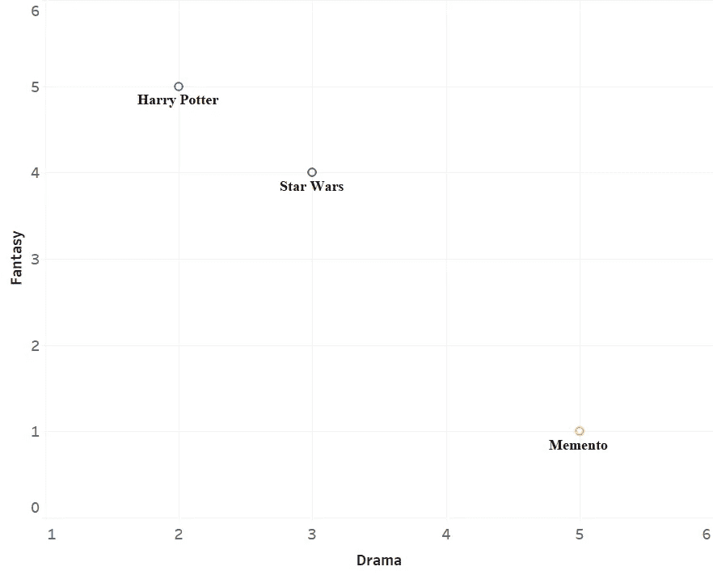
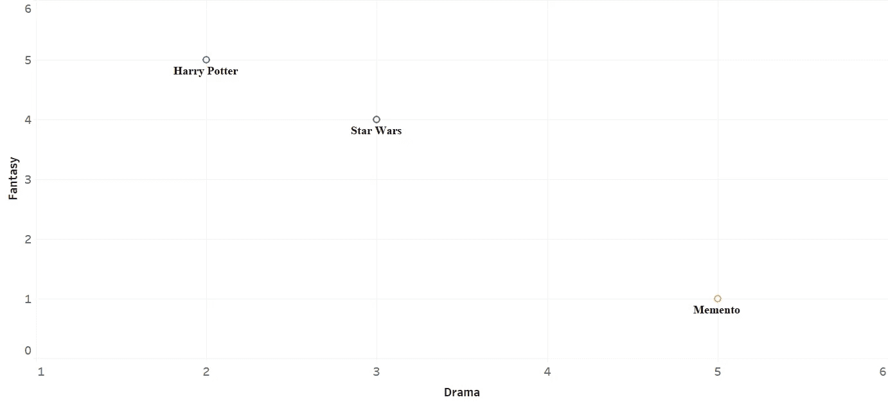
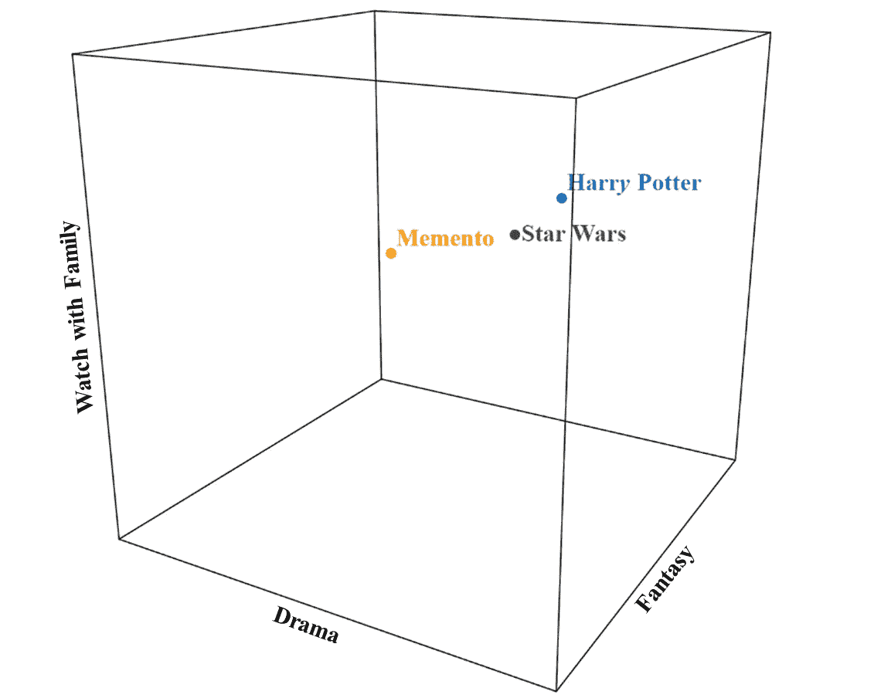
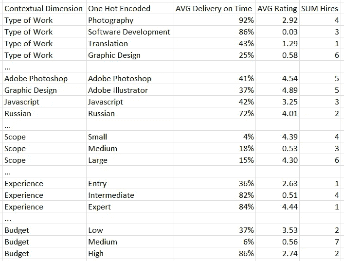
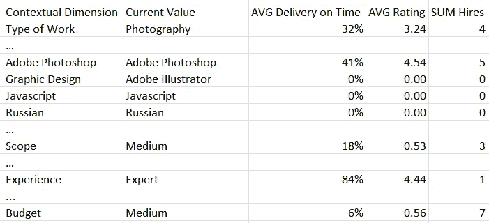
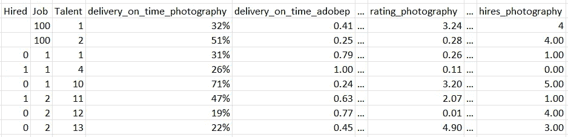
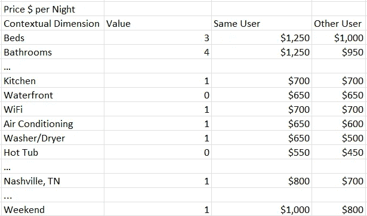
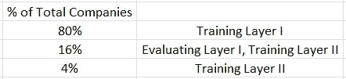

# 上下文推荐引擎的特征工程

> 原文：[`towardsdatascience.com/engineering-features-for-contextual-recommendation-engines-bb80bf0e0453?source=collection_archive---------5-----------------------#2023-04-27`](https://towardsdatascience.com/engineering-features-for-contextual-recommendation-engines-bb80bf0e0453?source=collection_archive---------5-----------------------#2023-04-27)

## 对于上下文信息主导的不同案例的分析

 [安德鲁·查拉宾](https://medium.com/@andrewcharabin?source=post_page-----bb80bf0e0453--------------------------------)

·

[关注](https://medium.com/m/signin?actionUrl=https%3A%2F%2Fmedium.com%2F_%2Fsubscribe%2Fuser%2Ff282e085f18e&operation=register&redirect=https%3A%2F%2Ftowardsdatascience.com%2Fengineering-features-for-contextual-recommendation-engines-bb80bf0e0453&user=Andrew+Charabin&userId=f282e085f18e&source=post_page-f282e085f18e----bb80bf0e0453---------------------post_header-----------) 发布于 [Towards Data Science](https://towardsdatascience.com/?source=post_page-----bb80bf0e0453--------------------------------) · 11 分钟阅读 · 2023 年 4 月 27 日

--

图片来源于 VectorStock，授权给**安德鲁·查拉宾**

从娱乐应用到约会平台，从社交网络到零售，推荐引擎在当今社会中发挥了至关重要的作用。它们不仅在有效性上取得了显著进展，而且在引导我们的注意力、根据我们的兴趣进行个性化和推荐个人价值的项目等方面扮演着越来越重要的角色。虽然每个推荐引擎都是独特的，需要考虑问题、业务和可用数据的复杂性，但许多构建块是相同的——用户/项目嵌入、用户历史、上下文特征以及神经协作层来将用户和项目映射到评分。模型可以绕过假设性和容易出错的手动数据，转而使用大量的隐含和明确反馈数据来预测评分。

推荐引擎是机器学习或基于规则的模型，提供如最适合用户的内容/项目、目标客户、或公平价格等推荐。它们遵循以下通用结构：

结果 = F(U, I, C)

其中 U 是用户，I 是项目，C 是上下文，F 是一个将 U、I 和 C 的组合映射到结果的函数。结果可以是明确的反馈，如评分，隐含的反馈，如观看时间，或非反馈量，如价格。

当推荐引擎与数据管道打包在一起以获取所需的输入数据、具备从模型中获取批量推断和随时间进行更新的能力，以及一个用户界面以接收和互动推荐时，它就成为了一个推荐系统。

推荐引擎的一个简单示例是一个为流媒体平台上的用户（U）在周末（C）推荐电影（I）的模型。

[协作推荐引擎](https://towardsdatascience.com/tagged/collaborative-filtering)可以用来将用户和项目映射到一个共同的嵌入空间，然后可以推荐空间中最接近的项目给用户。为了将用户和项目映射到这个新的嵌入空间，可以应用矩阵分解方法或多层感知机。只要有足够的过去的用户和项目反馈数据，自动映射和寻找用户与项目之间相似性的方式往往比使用手动特征（如用户和项目元数据）的推荐更为有效。

考虑以下基于 2 个手动特征的嵌入空间：一部电影在戏剧和奇幻类型中的评分（满分 5 分），并考虑 3 部电影。

作者图表 1

与使用 2 个手动制作的特征不同，协作系统被训练来自动将用户和项目映射到例如 k=10 个不同的“潜在维度”，这些维度可以通过过去的评分找到，而无需额外的项目/用户元数据。

你还会注意到，戏剧和奇幻在上面确定项目在空间中的位置时都扮演着~ 相等的角色。使用多层感知机与矩阵分解相比，嵌入的衍生和使用方式更具灵活性，以找到与用户最相似的项目。例如，可以学习嵌入，使得不同的维度在确定用户在空间中的位置时具有不同的权重。即，如果戏剧在电影的位置中比奇幻重要两倍，你可以想象 Y 轴被压缩了一半，*记忆碎片*与《星球大战》的相对距离略有减少。

作者提供的图表 2

[神经协同过滤（NCF）](https://arxiv.org/pdf/1708.05031.pdf)是一个广义框架，用于通过项目评分预测用户，这允许放宽类似于图表 1 中的矩阵分解的线性限制——所有维度具有相同的权重，且评分与空间中的距离成反比（称为交互函数是线性的）。

上下文信息，如电影何时观看或用户与谁一起观看，可以在初始推荐后通过结果过滤（上下文后过滤），或在初始推荐前通过根据消费上下文将项目视为独立项（上下文前过滤）来考虑。

为了更高的严谨性，可以将上下文字段作为空间中的附加维度集成。考虑下面的示例，我们在垂直轴上添加了一个手工制作的特征，表示用户与家人一起观看电影的普及程度。

作者提供的图表 3

然而，由于传统嵌入技术的计算复杂度随着上下文维度的增加而呈指数增长（例如，参见[多重宇宙](https://dl.acm.org/doi/10.1145/1864708.1864727#:~:text=In%20the%20proposed%20model%2C%20called,to%20provide%20context%2Daware%20recommendations.)作为一个例子），可以采用诸如因子分解机等替代方法来保持可处理性。

鉴于每个现实世界的推荐系统案例都是独特的，现代推荐系统通常是各种构建模块的专门组合，如项目嵌入、矩阵分解和神经网络层，以寻找用户与项目之间的连接。例如，考虑[YouTube 的视频推荐引擎](https://static.googleusercontent.com/media/research.google.com/en//pubs/archive/45530.pdf)，它结合了两个不同的深度神经网络，第一个选择你可能喜欢的优质候选视频，第二个挑选出你最可能观看时间最长的最佳候选视频。

在本文中，我想讨论我遇到的两个偏离传统用户按项目推荐系统的一般示例，以及使用基于树或深度学习模型解决这类问题时一些独特的特征工程方法。在这两个示例中，上下文信息在预测成功交互方面的作用相对较大，而不像传统的电影推荐系统那样。

这些场景如下：

1.  高上下文 & 低用户重要性 > 结果 = F(I, C)

1.  高上下文 & 无项目 > 结果 = F(U, C)

**场景 1**

结果 = F(I, C)

第一种情况是项目和上下文在推荐系统中起主导作用，而用户则处于次要位置。考虑到大多数用户是首次使用，因此用户历史/相似性的价值有限，许多项目是新的且从未被评分过，或者合适的项目完全依赖于上下文，与用户关系不大。

要选择最合适的自由职业者来完成工作，您需要了解他们在类似工作中的表现如何，过去用户如何评价他们，以及他们是否有按时完成工作的声誉。最近与在线文案撰稿人合作的事实可能并不是找到当前现场摄影工作合适人选的最相关因素。

在这种情况下，传统的推荐引擎如何运作呢？基于内容的推荐可能会推荐与您的文案撰稿人相似的人，而协同推荐可能会推荐在雇佣文案撰稿人后其他人也雇佣过的自由职业者。这些推荐都可能并不特别有帮助。由于不同的上下文，其他用户在雇佣该地区摄影工作时的经验可能比您过去的经验更相关。

因此，我们希望了解先前被雇用的最佳自由职业者，这些自由职业者与当前上下文匹配，而与用户无关。但是，如果工作具有多种不同的上下文维度，例如工作类型、技能、范围等，以及衡量用户反馈的不同方法，例如交付速度、评级和雇佣情况，该如何处理呢？

一种解决方案是对上下文和反馈维度进行笛卡尔积，然后汇总所有用户的项目历史记录。

**上下文与过去反馈的笛卡尔积**

要做到这一点，我们首先需要对维度进行独热编码，以便为每个级别分配专用维度。为了说明问题，以下是候选自由职业者的结果。请注意，在模型中使用时，我们将会把最后三列中的每一行展开为具有名称如`avg_delivery_on_time_photography`的专用特征列。

图表 4 作者提供

但是如果我们有 n 个初始上下文维度，每个维度具有 h - 1 个独热编码级别和 k 个反馈维度，那么需要 n x (h - 1) x k 个模型特征来映射所有可能的组合。在上面的不完整示例中，这导致了 51 个特征。

此外，许多特征与额外类型的工作（软件开发）相关，这些工作与当前上下文无关，但已通过笛卡尔积创建。

更简洁且有意义的编码方法是找到匹配当前上下文的所有上下文和反馈维度的过去历史，这需要 `n x k` 特征。这种上下文聚合可以通过类似以下的 SQL 使用案例逻辑轻松实现：

`avg(case when past_job.type_of_work = job.type_of_work then delivery_on_time end)` 作为 `avg_delivery_type_of_work`

其中工作表包含当前工作上下文的信息，而 `past_job` 表包含过去工作的相关信息。

改进情况如下：

图表 5 由作者提供

最终结果是关于过去自由职业者（项目）在类似工作（上下文）中的表现的丰富信息，同时限制了不必要的高维度。为了生成特征，上下文维度仅按线性方式考虑。诸如预算中等且经验水平为专家时的过去评分等组合被省略。非线性特性仍然可以由训练算法导出，或者可以创建额外的上下文维度作为现有维度的乘积。

然后，我们可以将每个反馈按上下文列展开为一个专用特征列，行指示一个独特的自由职业者。接着，将所有符合严格标准（即从事摄影工作）的自由职业者及其相关特征堆叠到额外的行中。现在我们可以重新构建这种表示，将每个过去的工作视为当前工作，将每个过去的工作堆叠为一组额外的行。对于过去的工作，我们可以创建一个额外的列来捕捉自由职业者收到的明确反馈，例如被雇佣，或隐性反馈如被联系。

图表 6 由作者提供

最后，我们可以训练一个基于树的模型如 XGBoost，使用工程特征（排除工作和才艺 #）来预测完成工作的反馈才艺，部署该模型，并将其应用于新发布的工作，以推荐最佳自由职业者。

**场景 2**

结果 = F(U, C)

另一个例子是，当推荐不是针对离散项，而是针对连续值时。考虑一个平台推荐物业租赁公司在周末应收取的物业租金。

在这种情况下，我们可以观察到与上下文维度匹配的过去租金价格，但现在我们不再对项反馈类型执行笛卡尔积，而是通过租赁是否为同一用户或其他用户来进行乘法运算。最后，我们可以通过计算平均值来汇总过去的价格。

图表 7 由作者提供

然后我们可以执行场景 1 末尾概述的额外步骤。

**分层模型**

另一种选择是创建一个初步的上下文模型，以便在所有用户中进行预测，然后再创建一个第二个模型，将用户无关的预测调整为用户特定的预测。这种方法的一个好处是提供了两种不同但有意义的预测，您可以推荐给用户或用于驱动期望的行为。

以一个模型为例，该模型输入职位描述和相关元数据以推荐招聘前的职位薪资。第一个模型可以预测与公司无关的薪资，从而找到该职位的“市场价格”。

可以用第一个模型的预测作为输入，并结合类似于图表 7 第三列的额外公司特征来训练第二个模型，以找到“量身定制”的薪资预测，即考虑到类似职位是否由同一家公司或另一家公司填补的薪资预测。

如果量身定制的预测与市场价格有显著不同，公司可能需要了解这一差异及其影响。例如，可以开发另一种模型，基于职位描述、招聘的候选人、起始薪资和公司来预测新员工的在职时间。可以使用市场价格与量身定制的薪资作为输入来计算预测的在职时间差异。假设市场价格为$75K，量身定制的薪资为$65K，但在$75K 的预测在职时间多出 1 年。推荐系统可以将$75K 作为推荐薪资，并提供一个工具观察不同薪资下的预测在职时间变化。

为了在[防止泄漏](https://machinelearningmastery.com/data-preparation-without-data-leakage/)的情况下训练分层模型，即“避免从持出集泄漏到用于训练模型的数据集中”，需要确保用于训练每一层的观察数据没有重叠。

此外，如果在第二层模型中集成了一个特征，该特征计算类似职位的历史公司薪资与第一个层模型预测的市场价格之间的差异，例如，结果为低于市场价格的平均$8K，则需要在公司与职位层级上对训练、评估和测试集进行抽样。这是因为作为职位薪资预测的特征，您还集成了所有公司之前填补的职位的市场价格预测。为了避免偏差，用于训练第一个模型的观察预测不应以任何方式作为后续模型的特征。我们最终得到一个训练/测试划分如下，不包括验证集，使用 80%的划分比例作为示例。

作者的图表 8

显然，只有在过去数据量相当大时，分层方法才是一种可行的替代方案。像 70%这样相对较低的分割比可能更可取。在分层方法中提供的附加用户特征对第二层模型的观察损失进行了对比，然而，在我评估过的特定回归用例中，仅通过将 80%观测数据训练的初始基于树的模型的预测整合到余下 16%观测数据训练的第二个模型中，最终 4%观测数据上的 MSE 约等于在所有 96%训练观测数据上训练的模型的 MSE。

**结合来自上下文和协同模型的推荐**

F(I, C) + F(U, I)

最后，从上下文模型衍生的推荐始终可以与从用户/物品相似性中获得的推荐加权，以提供最佳推荐。

为了更好地理解给定嵌入的用户/物品相似性的替代方法，我强烈推荐阅读[这篇文章](https://www.baeldung.com/cs/euclidean-distance-vs-cosine-similarity#:~:text=The%20Euclidean%20distance%20corresponds%20to,the%20product%20of%20their%20magnitudes.)，该文章区分了 L-范数和角度度量。

## 总结

尽管我们当前的社会在推荐系统方面取得了显著进展，但较少的研究集中于整合改变用户和物品交互性质的上下文信息。神经协同过滤（NCF）提供了一个框架，用于开发神经网络，其中第一层接收用户和物品标识以推导嵌入，后续层模拟与用户和物品嵌入的交互以预测评分。目前，相关的上下文仍然需要手工制作并显式地输入到模型中。虽然 NCF 方法是推荐的方式，被 YouTube 和 Google 等公司使用，但在某些情况下，例如在上下文信息起主导作用的非传统情况下，它们可能有些过度。

我已经详细介绍了我个人经历过的几个推荐系统案例；在这些案例中，用户信息并不是非常重要，也没有物品。我展示了一些有趣的方法来在这些情况下制作手工特征，例如通过笛卡尔积和分层模型。

希望这里的想法有助于激发一些创意，扩展你的知识，并激励你进一步探索迷人的推荐引擎领域。

> 感谢阅读！如果你喜欢这篇文章，请关注我以获取我的新文章通知。同时，欢迎分享任何意见/建议。
