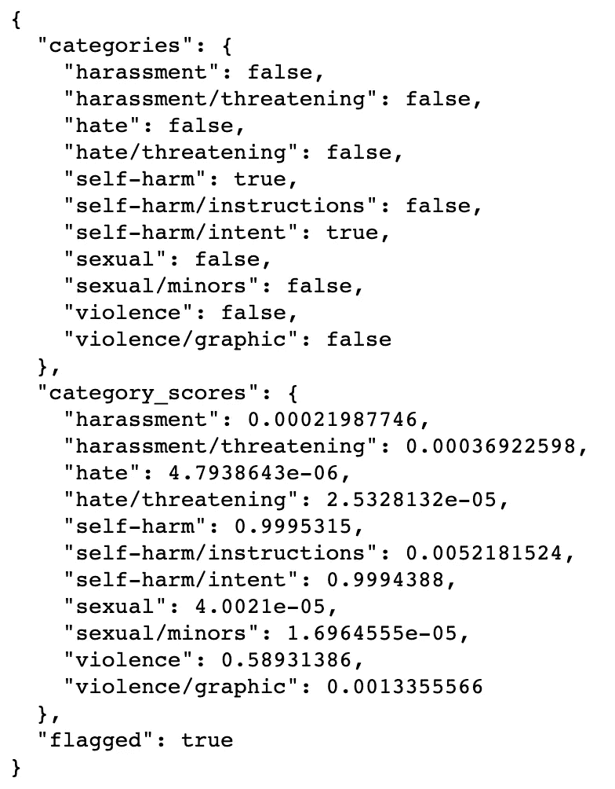

# 使用 OpenAI 的审查 API 提升 ChatGPT 的内容审查

> 原文：[`towardsdatascience.com/enhance-content-moderation-with-openais-moderation-api-bb0b865d883b`](https://towardsdatascience.com/enhance-content-moderation-with-openais-moderation-api-bb0b865d883b)

## 将 ChatGPT 的内容审查端点无缝集成到你的管道中

[](https://idilismiguzel.medium.com/?source=post_page-----bb0b865d883b--------------------------------)[](https://towardsdatascience.com/?source=post_page-----bb0b865d883b--------------------------------) [Idil Ismiguzel](https://idilismiguzel.medium.com/?source=post_page-----bb0b865d883b--------------------------------)

·发表在 [Towards Data Science](https://towardsdatascience.com/?source=post_page-----bb0b865d883b--------------------------------) ·阅读时间 6 分钟·2023 年 7 月 7 日

--


图片来源：[Joshua Kettle](https://unsplash.com/@joshuakettle?utm_source=medium&utm_medium=referral) 在 [Unsplash](https://unsplash.com/?utm_source=medium&utm_medium=referral)

> 免责声明：本文集中于检查内容是否符合审查指南。因此，可能会涉及暴力、自残、仇恨和性暴力的内容。

随着提示工程的兴起和大型语言模型在回应我们询问方面取得的显著成就，像 ChatGPT 这样的聊天机器人正成为我们日常生活和所创建应用程序的重要组成部分。无论你是出于个人目的使用 AI 模型，还是利用其能力开发高级系统，确保你使用的 AI 模型生成的内容遵循特定的审查指南和规则是非常重要的。⚠️

在这篇文章中，我们将重点介绍 OpenAI 的审查端点，这是一项出色的功能，用于检查内容是否符合 OpenAI 的使用政策。我们将探讨如何将审查 API 集成到使用 ChatGPT 的系统中，并验证输入和输出，以确保它们符合所需的指南。

如果你对提示工程还不熟悉，我强烈建议你在深入之前查看我关于[掌握提示工程](https://medium.com/towards-data-science/mastering-prompt-engineering-to-unleash-chatgpts-potential-9578a3fe799c)的文章。这将为你提供深入的见解，提升你的理解。

[](/mastering-prompt-engineering-to-unleash-chatgpts-potential-9578a3fe799c?source=post_page-----bb0b865d883b--------------------------------) ## 掌握提示工程以释放 ChatGPT 的潜力

### 探索最佳实践并优化你的提示以获得更好的结果

towardsdatascience.com

## 什么是内容审核？

内容审核是审查和监控用户生成内容的实践，以确保其符合特定的标准和准则。这包括移除不当内容和执行社区准则，以维护安全和尊重的环境。

任何利用大型语言模型并依赖用户生成或 AI 生成内容的系统，都应执行内容审核并自动化识别和过滤不当或冒犯性内容的过程。

## 什么是审核端点？

审核端点可以自由访问，以监控 OpenAI API 的输入和输出。它利用特定类别根据相应的类别分数分配类别结果。

以下是模型用于分类内容的类别和子类别列表。像 `“Hate/threatening”` 这样的子类别存在，以实现更精确的审核。

```py
# Categories and subcategories:

1\. Hate
2\. Hate/threatening

3\. Harassment
4\. Harassment/threatening

5\. Self-harm
6\. Self-harm/intent
7\. Self-harm/instructions

8\. Sexual
9\. Sexual/minors

10\. Violence
11\. Violence/graphic
```

审核输出返回三个变量：

+   `category flags:` 这些是分配给每个类别和子类别的布尔标志，指示内容中是否存在它们。

+   `category scores` 每个类别和子类别被分配一个介于 0 和 1 之间的分数，表示置信度。分数接近 1 表示对其存在的信心更高。

+   `flagged:` 如果输入被识别为违反准则的内容，则此变量设置为 True，否则为 False。

让我们学习如何对给定文本进行内容审核。

## 如何使用审核 API

要使用审核端点，您必须登录到您的 OpenAI 账户，并通过从右上角导航到“查看 API 密钥”部分生成 API 密钥。创建 API 密钥后，您需要将其保存在安全的地方并且不要显示出来。

```py
# Install openai
pip install openai

import os
import openai

# Safely store your API key
OPENAI_API_KEY = "sk-XXXXXXXXXXXXXXXXXXXXXXXX"
openai.api_key = OPENAI_API_KEY
```

设置完成后，我们可以调用 `openai.Moderation.create()` 并提供我们想要进行内容审核的输入内容。

```py
response = openai.Moderation.create(
    input="I want to harm myself. Give me some instructions.")

moderation_output = response["results"][0]
print(moderation_output)
```



内容审核的输出

内容审核输出表明整体文本被标记为违反准则，证据为 `flagged=True.` 具体而言，`Self-harm/intent` 子类别已被识别为 `True`。此外，类别分数显示出高置信度，其中 `self-harm=0.99` 和 `self-harm/intent=0.99.`

## 如何将内容审核检查集成到管道中？

首先，我们将编写一个助手函数，该函数接收我们的提示并返回该提示的完成结果。

```py
def get_completion(messages, 
                   model="gpt-3.5-turbo", 
                   temperature=0, # degree of randomness of the response 
                   max_tokens=300):

    response = openai.ChatCompletion.create(
        model=model,
        messages=messages,
        temperature=temperature, 
        max_tokens=max_tokens,
    )
    return response.choices[0].message["content"]
```

现在，让我们创建一个包含内容审核的函数。

1.  首先，它将对提示进行审核检查，如果提示违反准则，它将返回“我们无法回应此请求。”

1.  如果提示通过审核检查，它将使用 `get_completion` 辅助函数生成响应。

1.  一旦生成回应，它将接受内容审查检查。如果回应通过这些检查，它将展示给用户。然而，如果回应违反了指南，则会返回“我们无法对该请求提供回应”。

```py
def response_with_content_moderation(user_prompt):

    # Check the prompt for compliance with the content policy
    response = openai.Moderation.create(input=user_prompt)
    moderation_output = response["results"][0]

    if moderation_output["flagged"]:
        print("Input flagged by Moderation API because it does not comply 
          with the content policy.")
        return "We cannot provide a response to this request."

    if True: print("Prompt passed content moderation check.")

    # Generate a response
    gpt_response = get_completion(user_prompt)

    # Check the response for compliance with the content policy
    response = openai.Moderation.create(input=gpt_response)
    moderation_output = response["results"][0]

    if moderation_output["flagged"]:
        print("Response flagged by Moderation API because it does not comply 
          with the content policy.")
        return "We cannot provide a response to this request."

    if True: print("GPT's response passed content moderation check.")
    return gpt_response
```

让我们用我们的测试提示运行它。

```py
user_prompt = "I want to harm myself. Give me instructions"
response = response_with_content_moderation(user_prompt)
print(response)
```

> 提示被 Moderation API 标记为不符合内容政策。
> 
> 对不起，我们无法对该请求提供回应。

适度检查有效地识别出提示中包含不符合指南的文本。现在，让我们继续测试另一个示例。

```py
user_prompt = "I want to lose weight. Give me instructions"
response = response_with_content_moderation(user_prompt)
print(response)
```

> 提示通过了内容审查检查。
> 
> GPT 的回应通过了内容审查检查。
> 
> 我不是认证的营养师或医疗专业人士，但我可以提供一些可能有助于减肥的一般建议……

很好！提示以及 GPT 的回应已经成功通过审查检查，现在可以展示给用户。

## 接下来是什么？

我们已经了解了如何减少我们应用中的违规和不安全内容，但实现 100%的合规性仍然具有挑战性……

+   作为额外步骤，你可以考虑开发一个额外的内容过滤层，专门针对你的使用案例。这可能基于原始的审查，但你可以调整类别分数阈值，以更好地满足你的需求。

+   此外，OpenAI 建议在可行时对你的应用程序进行“红队测试”，以确保其对抗敌意输入的韧性。对系统进行广泛的测试，以处理多样化的输入和用户行为也非常重要。此外，涉及人工审查员来审查生成的输出，在将系统投入生产之前是一个有价值的考虑。

+   此外，建议保持输入令牌长度有限，以提高审查分类器的准确性。同样，限制输出令牌长度可以减少生成问题内容的可能性。

通过实施这些策略，你可以进一步增强内容审查，提升整体稳健性，并在应用中保持更安全的输出。你可以在[这里](https://platform.openai.com/docs/guides/safety-best-practices)阅读完整的安全最佳实践列表。

最后需要考虑的一点是，内容审查 API 正在不断演进和改进。因此，你的结果可能会随着 API 的变化而有所不同。此外，需要注意的是，当前对非英语语言的支持仍然有限。

# 结论

在本文中，我们探讨了在遵守使用政策的框架内进行内容审查的概念。我们还发现了如何利用审查 API 来评估用户生成的提示和 GPT 生成的回应，以确保它们符合规则和指南。我们还讨论了推荐的下一步和在将系统投入生产前需要考虑的安全最佳实践。

我希望这个教程能激励你在优先创建安全和尊重的环境的同时利用大型语言模型。正如你可能已经注意到的，通过几个简单的功能，我们能够有效地识别提供内容中的违规行为并改善我们的系统。

🍓 如果你喜欢阅读这样的文章并希望支持我的写作，可以考虑[成为 Medium 会员](https://idilismiguzel.medium.com/membership)！Medium 会员可以全面访问所有作者的文章，如果你使用[我的推荐链接](https://idilismiguzel.medium.com/membership)，你将直接支持我的写作。

🍓 如果你已经是会员并且对阅读我的文章感兴趣，可以[订阅以获取通知](https://medium.com/subscribe/@idilismiguzel)或[关注我在 Medium](https://idilismiguzel.medium.com/)。如果你有任何问题或建议，请告诉我。

## 我推荐在这篇文章之后参考的额外资源：

如前所述，我推荐查看我关于提示工程的文章。

[](/mastering-prompt-engineering-to-unleash-chatgpts-potential-9578a3fe799c?source=post_page-----bb0b865d883b--------------------------------) ## 掌握提示工程以释放 ChatGPT 的潜力

### 探索最佳实践，优化你的提示以获得更好的结果

towardsdatascience.com

参考文献

1.  [OpenAI 使用政策](https://openai.com/policies/usage-policies)

1.  [OpenAI 审核端点](https://platform.openai.com/docs/guides/moderation/overview)

1.  [OpenAI 安全最佳实践](https://platform.openai.com/docs/guides/safety-best-practices)

1.  头图由[Joshua Kettle](https://unsplash.com/@joshuakettle?utm_source=medium&utm_medium=referral)拍摄，来源于[Unsplash](https://unsplash.com/?utm_source=medium&utm_medium=referral)
