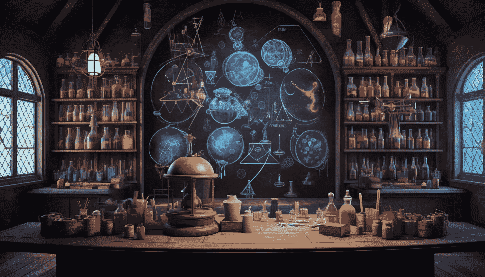
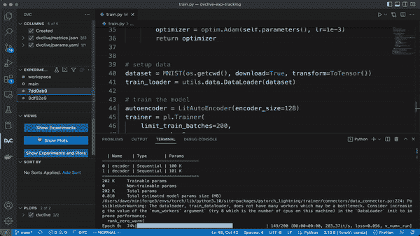

# 提升你的机器学习实验工作流程与实时图表

> 原文：[`towardsdatascience.com/enhance-your-ml-experimentation-workflow-with-real-time-plots-434106b1a1c2?source=collection_archive---------13-----------------------#2023-03-13`](https://towardsdatascience.com/enhance-your-ml-experimentation-workflow-with-real-time-plots-434106b1a1c2?source=collection_archive---------13-----------------------#2023-03-13)

图像由 Midjourney 生成

## 如何在不离开 IDE 的情况下运行和评估实验的教程第二部分

 [Eryk Lewinson](https://eryk-lewinson.medium.com/?source=post_page-----434106b1a1c2--------------------------------)

·

[关注](https://medium.com/m/signin?actionUrl=https%3A%2F%2Fmedium.com%2F_%2Fsubscribe%2Fuser%2F44bc27317e6b&operation=register&redirect=https%3A%2F%2Ftowardsdatascience.com%2Fenhance-your-ml-experimentation-workflow-with-real-time-plots-434106b1a1c2&user=Eryk+Lewinson&userId=44bc27317e6b&source=post_page-44bc27317e6b----434106b1a1c2---------------------post_header-----------) 发表在 [Towards Data Science](https://towardsdatascience.com/?source=post_page-----434106b1a1c2--------------------------------) ·13 分钟阅读·2023 年 3 月 13 日

--

在 本系列的上一篇文章 中，我演示了如何使用 DVC 的 VS Code 扩展将我们的 IDE 转变为实验平台，使我们可以直接运行和评估 ML 实验。我还提到该扩展提供了有用的绘图功能，使我们能够通过交互式图表可视化和评估实验的性能。更棒的是，该扩展还提供了在训练阶段实时绘制某些指标的功能。您可以在下图中窥见这一功能的风采。

[来源](https://dvc.org/doc/dvclive/get-started?tab=DVC-Extension-for-VS-Code)，GIF 经 iterative 许可使用

本文将演示如何通过在 VS Code 中监控模型性能和使用交互式图表评估实验来增强之前介绍的实验工作流程。为此，我们将解决一个二分类图像问题。首先，我们将概述计算机视觉中的迁移学习，并分享有关所选数据集的一些细节。

# 问题定义和方法论
