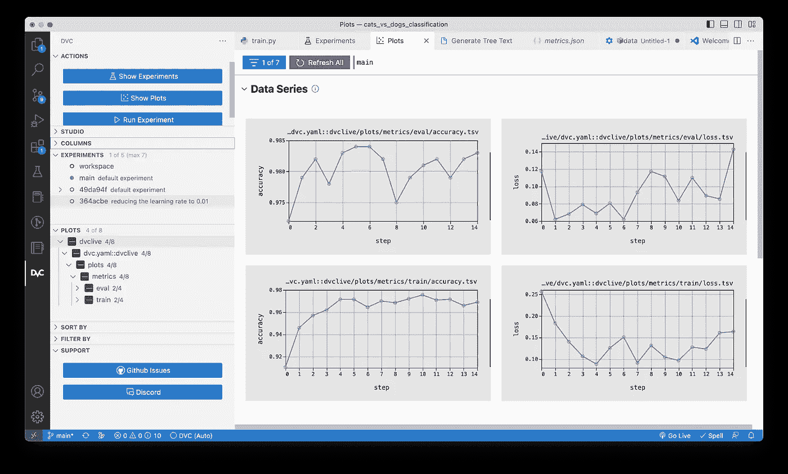
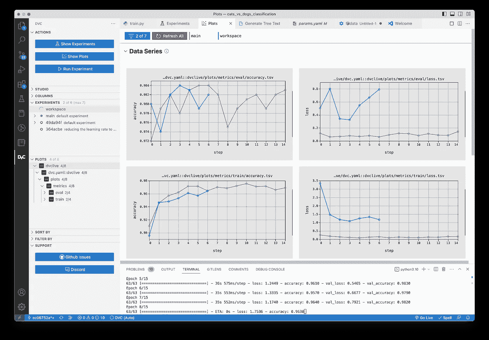
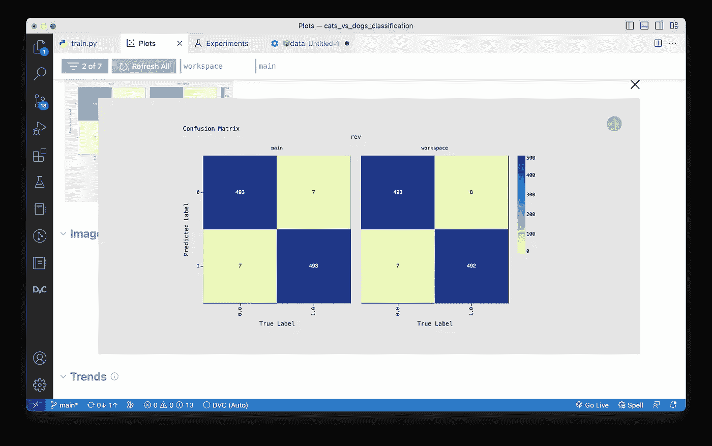

# 通过实时图表提升您的机器学习实验工作流程

> 原文：[`towardsdatascience.com/enhance-your-ml-experimentation-workflow-with-real-time-plots-434106b1a1c2`](https://towardsdatascience.com/enhance-your-ml-experimentation-workflow-with-real-time-plots-434106b1a1c2)


图片由 Midjourney 生成

## 如何在不离开 IDE 的情况下运行和评估实验的教程第二部分

[](https://eryk-lewinson.medium.com/?source=post_page-----434106b1a1c2--------------------------------)[](https://towardsdatascience.com/?source=post_page-----434106b1a1c2--------------------------------) [Eryk Lewinson](https://eryk-lewinson.medium.com/?source=post_page-----434106b1a1c2--------------------------------)

·发表于 [Towards Data Science](https://towardsdatascience.com/?source=post_page-----434106b1a1c2--------------------------------) ·阅读时间 13 分钟·2023 年 3 月 13 日

--

在本系列的上一篇文章中，我演示了如何使用 DVC 的 VS Code 扩展将我们的 IDE 转变为实验平台，使我们能够直接运行和评估机器学习实验。我还提到，该扩展提供了有用的绘图功能，允许我们使用交互式图表可视化和评估实验的性能。为了进一步提升体验，该扩展还提供了在训练阶段实时绘制某些指标的功能。你可以在以下图中预览这一特性。


[来源](https://dvc.org/doc/dvclive/get-started?tab=DVC-Extension-for-VS-Code)，GIF 经 iterative 许可使用

本文将演示如何通过在 VS Code 中监控模型性能和评估实验结果，利用交互式图表来增强之前介绍的实验工作流程。为实现这一目标，我们将处理一个二分类图像问题。首先，我们将概述计算机视觉中的迁移学习，并分享一些关于所选数据集的细节。

# 问题定义与方法论

图像分类是计算机视觉领域中最受欢迎的任务之一。作为我们的示例，我们将使用猫与狗的分类问题，这一问题已被广泛用于研究社区中，用于基准测试不同的深度学习模型。正如你可能猜到的，该项目的目标是将输入图像分类为猫或狗。

为了在有限的训练数据下实现高准确性，我们将利用迁移学习来加快训练过程。迁移学习是一种强大的深度学习技术，最近在计算机视觉的各种领域获得了显著的关注。利用互联网上的大量数据，迁移学习使我们能够利用一个领域/问题的现有知识，并将其应用于不同的领域。

计算机视觉中使用迁移学习的一种方法是基于特征提取的思想。首先，在一个大型且通用的数据集上训练一个模型（例如，[ImageNet 数据集](https://en.wikipedia.org/wiki/ImageNet)）。这个模型作为“视觉”的通用模型。然后，我们可以使用这种模型学习到的特征图，而无需从头开始训练自定义网络。

对于我们的使用案例，我们将利用一个预训练的模型（ResNet50）来提取与我们的二分类问题相关的特征。这个方法包括几个步骤：

1.  获取一个预训练的模型，即一个已经在大型数据集上训练过的保存网络。你可以在[这里](https://www.tensorflow.org/api_docs/python/tf/keras/applications)找到一些示例。

1.  使用所选网络学习到的特征图来从网络没有训练过的图像中提取有意义的特征。

1.  在预训练的网络上添加一个新的分类器。由于预训练模型的分类组件是特定于其原始任务的，因此分类器将从头开始训练。

我们将在接下来的部分展示如何完成这些操作。然而，请记住，这不是一个关于迁移学习的教程。如果你想了解更多关于理论和实现的内容，请参考[这篇文章](https://machinelearningmastery.com/how-to-use-transfer-learning-when-developing-convolutional-neural-network-models/)或[这个教程](https://www.tensorflow.org/tutorials/images/transfer_learning)。

# 获取数据

使用以下代码片段，我们可以下载猫狗数据集。[原始数据集](https://www.microsoft.com/en-us/download/details.aspx?id=54765)包含每个类别的 12500 张图像。然而，对于我们的项目，我们将使用一个较小的、过滤后的数据集，其中每个类别包含 1000 张训练图像和 500 张验证图像。通过 TensorFlow 下载过滤后的数据集的额外好处是，它不包含原始数据集中存在的一些损坏图像（更多信息请见[这里](https://www.tensorflow.org/datasets/catalog/cats_vs_dogs)）。

```py
import os
import tensorflow as tf
import shutil

DATA_URL = "https://storage.googleapis.com/mledu-datasets/cats_and_dogs_filtered.zip"
DATA_PATH = "data/raw"

path_to_zip = tf.keras.utils.get_file(
    "cats_and_dogs.zip", origin=DATA_URL, extract=True
)
download_path = os.path.join(os.path.dirname(path_to_zip), "cats_and_dogs_filtered")

train_dir_from = os.path.join(download_path, "train")
validation_dir_from = os.path.join(download_path, "validation")

train_dir_to = os.path.join(DATA_PATH, "train")
validation_dir_to = os.path.join(DATA_PATH, "validation")

shutil.move(train_dir_from, train_dir_to)
shutil.move(validation_dir_from, validation_dir_to)
```

以下树状图展示了包含下载图像的目录结构：

```py
📦data
┗ 📂raw
┣ 📂train
┃ ┣ 📂cats
┃ ┗ 📂dogs
┗ 📂validation
┣ 📂cats
┗ 📂dogs
```

如果你想使用完整的数据集进行实验，你可以使用`[tensorflow_datasets](https://www.tensorflow.org/guide/keras/transfer_learning#getting_the_data)`来加载它。

# 实验神经网络

在本节中，我们将展示用于训练和实验我们的神经网络分类器的代码。具体来说，我们将需要以下三个文件：

+   `train.py` — 包含用于训练神经网络的代码。

+   `params.yaml` — 包含用于训练神经网络的参数，例如输入图像的大小、批处理大小、学习率、训练轮次等。

+   `dvc.yaml` — 包含 DVC 管道，其中存储有关我们项目中所有执行步骤的信息，包括它们的依赖关系和输出。有关该文件及其结构的更详细描述，请参阅我的上一篇文章。

事实上，我们当前的设置比最低要求更先进。虽然我们本可以仅从训练脚本开始，但我们选择从一开始就实现更复杂的设置。这将使我们能够方便地排队运行实验并轻松地参数化它们，还有其他好处。

让我们从`dvc.yaml`文件开始，因为它包含了该项目的管道。由于这是一个相对简单的项目，它只有一个名为`train`的阶段。在文件中，我们可以看到哪个脚本包含阶段的代码，它的依赖关系是什么，参数的位置在哪里，以及输出是什么。`outs`步骤包含一个尚不存在的目录（`dvclive`），在运行实验时将自动创建。

```py
stages:
  train:
    cmd: python src/train.py
    deps:
      - src/train.py
      - data/raw
    params:
      - train
    outs:
      - models
      - metrics.csv
      - dvclive/metrics.json:
          cache: False
      - dvclive/plots
```

让我们继续查看`params.yaml`文件。我们已经提到它包含的内容，所以其内容应该不会让人感到惊讶：

```py
train:
  image_width: 180
  image_height: 180
  batch_size: 32
  learning_rate: 0.01
  n_epochs: 15
```

自然地，该文件可以包含更多阶段的多个参数，这些参数在 DVC 管道中定义。

最后，我们进入用于训练神经网络的文件。为了使其更具可读性，我们将其分解为三个代码片段。在第一个片段中，我们执行以下步骤：

+   导入必要的库。

+   分别为训练和验证数据集定义数据目录。

+   从`params.yaml`文件中加载参数。

+   使用`keras`的`image_dataset_from_directory`功能定义训练和验证数据集。

```py
import os
from pathlib import Path
import numpy as np
import tensorflow as tf
from dvc.api import params_show
from dvclive.keras import DVCLiveCallback

# data directories
BASE_DIR = Path(__file__).parent.parent
DATA_DIR = "data/raw"
train_dir = os.path.join(DATA_DIR, "train")
validation_dir = os.path.join(DATA_DIR, "validation")

# get the params
params = params_show()["train"]
IMG_WIDTH, IMG_HEIGHT = params["image_width"], params["image_height"]
IMG_SIZE = (IMG_WIDTH, IMG_HEIGHT)
BATCH_SIZE = params["batch_size"]
LR = params["learning_rate"]
N_EPOCHS = params["n_epochs"]

# get image datasets
train_dataset = tf.keras.utils.image_dataset_from_directory(
    train_dir, shuffle=True, batch_size=BATCH_SIZE, image_size=IMG_SIZE
)

validation_dataset = tf.keras.utils.image_dataset_from_directory(
    validation_dir, shuffle=True, batch_size=BATCH_SIZE, image_size=IMG_SIZE
)
```

训练脚本的第二部分包含了我们希望在此项目中使用的神经网络架构的定义。

```py
def get_model():
    """
    Prepare the ResNet50 model for transfer learning.
    """

    data_augmentation = tf.keras.Sequential(
        [
            tf.keras.layers.RandomFlip("horizontal"),
            tf.keras.layers.RandomRotation(0.2),
        ]
    )

    preprocess_input = tf.keras.applications.resnet50.preprocess_input

    IMG_SHAPE = IMG_SIZE + (3,)
    base_model = tf.keras.applications.ResNet50(
        input_shape=IMG_SHAPE, include_top=False, weights="imagenet"
    )
    base_model.trainable = False

    global_average_layer = tf.keras.layers.GlobalAveragePooling2D()
    prediction_layer = tf.keras.layers.Dense(1)

    inputs = tf.keras.Input(shape=IMG_SHAPE)
    x = data_augmentation(inputs)
    x = preprocess_input(x)
    x = base_model(x, training=False)
    x = global_average_layer(x)
    x = tf.keras.layers.Dropout(0.2)(x)
    outputs = prediction_layer(x)
    model = tf.keras.Model(inputs, outputs)

    model.compile(
        optimizer=tf.keras.optimizers.Adam(learning_rate=LR),
        loss=tf.keras.losses.BinaryCrossentropy(from_logits=True),
       metrics=["accuracy"],
    )

    return model
```

我们不会深入探讨用于迁移学习的代码，因为它略超出本文的范围。然而，值得一提的是：

+   我们使用了一些非常简单的图像增强技术：随机水平翻转和随机旋转。这些增强仅应用于训练集。

+   在训练模型时，我们希望跟踪其准确性。我们选择了这个指标，因为我们处理的是一个平衡的数据集，但我们可以很容易地跟踪其他指标，如精确度和召回率。

第三个也是最后一个代码片段包含了我们脚本的主要部分：

```py
def main():
    model_path = BASE_DIR / "models"
    model_path.mkdir(parents=True, exist_ok=True)

    model = get_model()

    callbacks = [
        tf.keras.callbacks.ModelCheckpoint(
            model_path / "model.keras", monitor="val_accuracy", save_best_only=True
        ),
        tf.keras.callbacks.CSVLogger("metrics.csv"),
        DVCLiveCallback(save_dvc_exp=True),
    ]

    history = model.fit(
        train_dataset,
        epochs=N_EPOCHS,
        validation_data=validation_dataset,
        callbacks=callbacks,
    )

if __name__ == "__main__":
    main()
```

在这个代码片段中，我们执行以下操作：

+   如果 `models` 目录不存在，我们会创建它。

+   我们使用在前面的代码片段中定义的 `get_model` 函数来获取模型。

+   我们定义了要使用的回调函数。前两个是训练神经网络时使用的标准回调函数。第一个用于在训练过程中创建检查点。第二个在每个 epoch 后将选择的指标（在我们的案例中是准确率和损失）存储到 CSV 文件中。我们将稍后介绍第三个回调函数。

+   我们将模型拟合到训练数据上，并使用验证集进行评估。

我们使用的第三个回调 `DVCLiveCallback` 来自一个名为 DVCLive 的辅助库。总的来说，它是一个提供用于记录 ML 参数、指标和其他元数据的简单文件格式的工具库。你可以把它看作是类似于 MLFlow 的 ML 记录器。最大区别在于，通过使用 DVCLive，我们不需要使用任何额外的服务或服务器。所有记录的指标和元数据都存储为纯文本文件，这些文件可以使用 Git 进行版本控制。

在这个特定案例中，我们使用了 DVCLive 提供的 Keras 兼容回调。DVCLive 为最受欢迎的机器学习和深度学习库（如 TensorFlow、PyTorch、LightGBM、XGBoost 等）提供类似的工具。你可以在[这里](https://dvc.org/doc/dvclive/api-reference/ml-frameworks)找到支持的库的完整列表。还值得一提的是，即使 DVCLive 提供了许多可以开箱即用的有用回调，这并不意味着这是记录指标的唯一方式。我们可以[手动记录](https://dvc.org/doc/dvclive/how-it-works)任何我们想要的指标/图表。

当我们指定 `DVCLiveCallback` 时，我们将 `save_dvc_exp` 参数设置为 `True`。这样做表明我们希望通过 Git 自动跟踪结果。

现在，我们准备运行第一次实验。为此，我们将使用最初在 `params.yaml` 文件中指定的参数。要运行实验，我们可以在 DVC 面板的 *Experiments* 标签页中按 *Run Experiment* 按钮，或在终端中使用以下命令：

```py
dvc exp run
```

关于运行实验和导航到 *Experiments* 标签页的更多信息，请参阅我之前的文章。

在运行实验后，我们注意到创建了一个新目录——`dvclive`。我们在代码中使用的 DVCLive 回调自动记录数据，并将其存储在该目录中的纯文本文件中。在我们的案例中，该目录如下所示：

```py
📦dvclive
┣ 📂plots
┃ ┗ 📂metrics
┃ ┃ ┣ 📂eval
┃ ┃ ┃ ┣ 📜accuracy.tsv
┃ ┃ ┃ ┗ 📜loss.tsv
┃ ┃ ┗ 📂train
┃ ┃ ┃ ┣ 📜accuracy.tsv
┃ ┃ ┃ ┗ 📜loss.tsv
┣ 📜.gitignore
┣ 📜dvc.yaml
┣ 📜metrics.json
┗ 📜report.html
```

我们提供了生成文件的简要描述：

+   TSV 文件包含每个 epoch 的准确率和损失，分别针对训练和验证数据集。

+   `metrics.json` 包含最终 epoch 的请求指标。

+   `report.html` 包含以 HTML 报告形式呈现的跟踪指标的图表。

此时，我们可以在 HTML 报告中检查跟踪的指标。然而，我们也可以直接从 VS Code 中检查，通过导航到 DVC 扩展中的*图表*选项卡。



使用左侧边栏，我们可以选择要可视化的实验。我选择了`main`实验，但您可以看到我之前已经运行了几个实验。在*图表*菜单中，我们可以选择要绘制的指标。当我们跟踪许多指标时，这个功能非常方便，但我们一次只想检查其中的一些指标。

在主视图中，我们可以看到可视化的指标。上方的图表呈现了使用验证集计算的指标，而下方的图表则基于训练集。您在静态图像中看不到的是这些图表是实时图表。这意味着指标在每个训练轮次完成后都会更新。我们可以使用这个选项卡实时监控我们的训练进度。

对于第二个实验，我们将学习率从 0.01 增加到 0.1。我们可以使用以下命令运行这样的实验：

```py
dvc exp run -S train.learning_rate=0.1
```

为了在训练期间监控模型，我们还在*实验*菜单中选择了`workspace`实验。在下图中，您可以看到在神经网络仍处于训练阶段时图表的样子（您可以看到进程正在终端窗口中运行）。



到目前为止，我们所有的图表都在*数据系列*部分的*图表*选项卡中生成。总共有三个部分，每个部分有不同类型的图表：

+   *数据系列* — 包含存储在文本文件（JSON、YAML、CSV 或 TSV）中的指标的可视化。

+   *图像* — 包含并排显示的存储图像，如 JPG 文件。

+   *趋势* — 包含每个 epoch 自动生成和更新的标量指标，如果启用了[DVC 检查点](https://dvc.org/doc/user-guide/experiment-management/checkpoints)。

我们已经探索了如何使用 DVCLive 的回调跟踪和可视化指标。使用 DVC 还允许我们跟踪存储为图像的图表。例如，我们可以创建一个条形图，表示从某个模型中获得的特征重要性。或者，为了简化，我们可以跟踪一个混淆矩阵。

使用 DVC 跟踪和可视化自定义图表的一般方法是手动创建图表，将其保存为图像，然后跟踪它。这允许我们跟踪我们创建的任何自定义图表。或者，对于某些`scikit-learn`图表，我们可以使用 DVCLive 的`log_sklearn_plot`方法，利用存储在 JSON 文件中的数据（预测与真实值）生成图表。这种方法目前适用于以下类型的图表：概率校准、混淆矩阵、ROC 曲线和精确度-召回曲线。

在这个示例中，我们将演示如何开始跟踪混淆矩阵。在下面的代码片段中，你可以看到修改后的`train.py`脚本。我们删除了许多没有改变的内容，使得跟踪修改更加容易。

```py
import os
from pathlib import Path
import numpy as np
import tensorflow as tf
from dvc.api import params_show
from dvclive.keras import DVCLiveCallback
from dvclive import Live

# data directories, parameters, datasets, and the model function did not change

def main():
    model_path = BASE_DIR / "models"
    model_path.mkdir(parents=True, exist_ok=True)

    model = get_model()

    with Live(save_dvc_exp=True) as live:

        callbacks = [
            tf.keras.callbacks.ModelCheckpoint(
                model_path / "model.keras", monitor="val_accuracy", save_best_only=True
            ),
            tf.keras.callbacks.CSVLogger("metrics.csv"),
            DVCLiveCallback(live=live),
        ]

        history = model.fit(
            train_dataset,
            epochs=N_EPOCHS,
            validation_data=validation_dataset,
            callbacks=callbacks,
        )

        model.load_weights(str(model_path / "model.keras"))
        y_pred = np.array([])
        y_true = np.array([])
        for x, y in validation_dataset:
            y_pred = np.concatenate([y_pred, model.predict(x).flatten()])
            y_true = np.concatenate([y_true, y.numpy()])

        y_pred = np.where(y_pred > 0, 1, 0)

        live.log_sklearn_plot("confusion_matrix", y_true, y_pred)

if __name__ == "__main__":
    main()
```

如你所见，这次我们创建了一个`Live`对象的实例，我们在回调和`log_sklearn_plot`方法中都使用了它。为了跟踪所有指标，我们使用了上下文管理器（`with`语句）来实例化`Live`实例。如果不这样做，DVCLive 会在`keras`调用`on_train_end`时创建实验。结果是，之后记录的任何数据（在我们例子中是混淆矩阵图）都不会在实验中被跟踪。

在修改训练脚本后，我们再次运行了两个不同学习率（0.1 与 0.01）的实验。结果是，我们现在可以在*Plots*标签下看到混淆矩阵，位于之前探索的图表下方。



最后要提到的是，运行修改后的训练脚本也会修改`dvclive`目录中的`dvc.yaml`管道。如下面所示，它现在包含有关跟踪的混淆矩阵的信息，例如如何构建它、使用哪个模板以及使用什么标签。

```py
metrics:
- metrics.json
plots:
- plots/metrics
- plots/sklearn/confusion_matrix.json:
    template: confusion
    x: actual
    y: predicted
    title: Confusion Matrix
    x_label: True Label
    y_label: Predicted Label
```

# 总结

在系列的上一篇文章中，我们展示了如何开始使用 DVC 和专用的 VS Code 扩展，将你的 IDE 转变为 ML 实验平台。在这一部分，我们继续从我们停下的地方开始，探索了扩展的各种（实时）绘图功能。利用这些功能，我们可以轻松评估和比较实验，以选择最佳方案。

在我看来，使用 DVC 增强工作流有两个显著优势。首先，我们不需要任何外部服务或设置来启动实验。唯一的要求是一个 Git 仓库。此外，DVC 与 Git 的配合非常干净。虽然每个实验都保存在 Git 提交中，但这些提交是隐藏的，不会使我们的仓库杂乱。实际上，我们甚至不需要创建单独的分支。

其次，一切都在我们的 IDE 中进行，使我们可以专注于项目，而无需不断切换 IDE、浏览器和其他工具。这样，我们可以避免干扰和不断切换上下文的威胁。

一如既往，任何建设性的反馈都非常欢迎。你可以通过 [Twitter](https://twitter.com/erykml1) 或在评论中联系我。你可以在 [](https://github.com/erykml/vscode_exp_tracking_with_dvc) [这个仓库](https://github.com/erykml/cats_vs_dogs_classification) 中找到所有用于本文的代码。

*喜欢这篇文章吗？成为 Medium 会员继续无限制阅读，继续学习。如果你使用* [*这个链接*](https://eryk-lewinson.medium.com/membership) *成为会员，你将以没有额外费用的方式支持我。提前感谢，并期待与你再见！*

你可能也对以下内容感兴趣：

[`towardsdatascience.com/turn-vs-code-into-a-one-stop-shop-for-ml-experiments-49c97c47db27?source=post_page-----434106b1a1c2--------------------------------`](https://towardsdatascience.com/turn-vs-code-into-a-one-stop-shop-for-ml-experiments-49c97c47db27?source=post_page-----434106b1a1c2--------------------------------) [## 将 VS Code 转变为机器学习实验的一站式平台

### 如何在不离开 IDE 的情况下运行和评估实验

[`towardsdatascience.com/turn-vs-code-into-a-one-stop-shop-for-ml-experiments-49c97c47db27?source=post_page-----434106b1a1c2--------------------------------`](https://towardsdatascience.com/turn-vs-code-into-a-one-stop-shop-for-ml-experiments-49c97c47db27?source=post_page-----434106b1a1c2--------------------------------) [`towardsdatascience.com/3-simple-ways-to-create-a-waterfall-plot-in-python-1124f7afc90f?source=post_page-----434106b1a1c2--------------------------------`](https://towardsdatascience.com/3-simple-ways-to-create-a-waterfall-plot-in-python-1124f7afc90f?source=post_page-----434106b1a1c2--------------------------------) [## 用 Python 创建瀑布图的三种简单方法

### 学习如何快速创建一个适合演示的图表，以辅助你的数据叙事

[`towardsdatascience.com/3-simple-ways-to-create-a-waterfall-plot-in-python-1124f7afc90f?source=post_page-----434106b1a1c2--------------------------------`](https://towardsdatascience.com/3-simple-ways-to-create-a-waterfall-plot-in-python-1124f7afc90f?source=post_page-----434106b1a1c2--------------------------------) [`eryk-lewinson.medium.com/introducing-the-second-edition-of-python-for-finance-cookbook-f42f59c8acd0?source=post_page-----434106b1a1c2--------------------------------`](https://eryk-lewinson.medium.com/introducing-the-second-edition-of-python-for-finance-cookbook-f42f59c8acd0?source=post_page-----434106b1a1c2--------------------------------) [## 介绍《Python 财务食谱》的第二版

### 是什么促使我编写第二版以及你可以从阅读中期待什么

[`eryk-lewinson.medium.com/introducing-the-second-edition-of-python-for-finance-cookbook-f42f59c8acd0?source=post_page-----434106b1a1c2--------------------------------`](https://eryk-lewinson.medium.com/introducing-the-second-edition-of-python-for-finance-cookbook-f42f59c8acd0?source=post_page-----434106b1a1c2--------------------------------) [`towardsdatascience.com/r-shiny-is-coming-to-python-1653bbe231ac?source=post_page-----434106b1a1c2--------------------------------`](https://towardsdatascience.com/r-shiny-is-coming-to-python-1653bbe231ac?source=post_page-----434106b1a1c2--------------------------------) [## R Shiny 正在进入 Python

### Shiny 正在加入 Streamlit 和 Dash 等网页应用工具的行列

[`towardsdatascience.com/r-shiny-is-coming-to-python-1653bbe231ac?source=post_page-----434106b1a1c2--------------------------------`](https://towardsdatascience.com/r-shiny-is-coming-to-python-1653bbe231ac?source=post_page-----434106b1a1c2--------------------------------)

# 参考文献

+   [`www.microsoft.com/en-us/download/details.aspx?id=54765`](https://www.microsoft.com/en-us/download/details.aspx?id=54765)

+   [`www.kaggle.com/competitions/dogs-vs-cats/overview`](https://www.kaggle.com/competitions/dogs-vs-cats/overview)

+   [`github.com/iterative/dvclive`](https://github.com/iterative/dvclive)

+   [`iterative.ai/blog/exp-tracking-dvc-python/`](https://iterative.ai/blog/exp-tracking-dvc-python/)

+   [`keras.io/examples/vision/image_classification_from_scratch/`](https://keras.io/examples/vision/image_classification_from_scratch/)

除非另有说明，否则所有图片均由作者提供。
