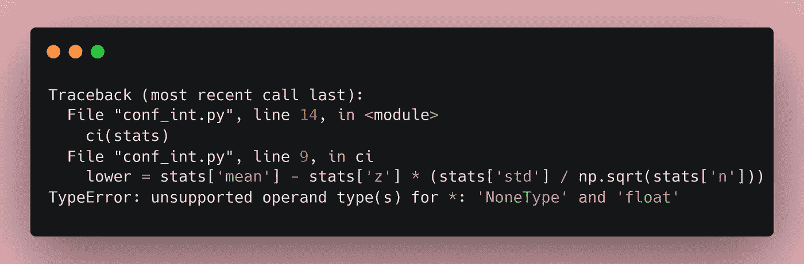
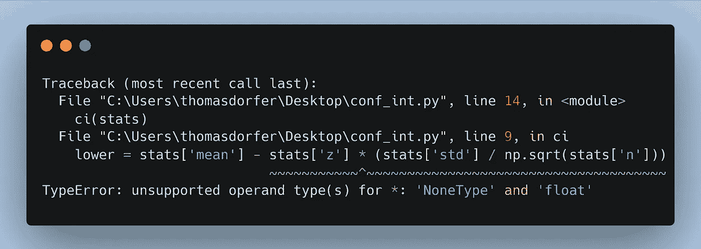
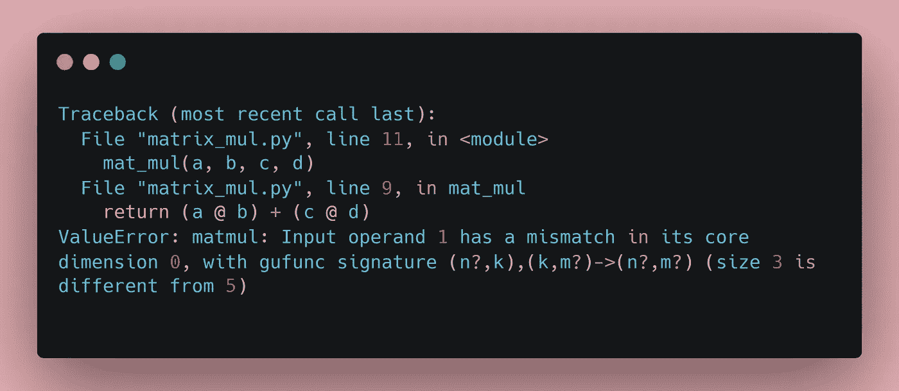
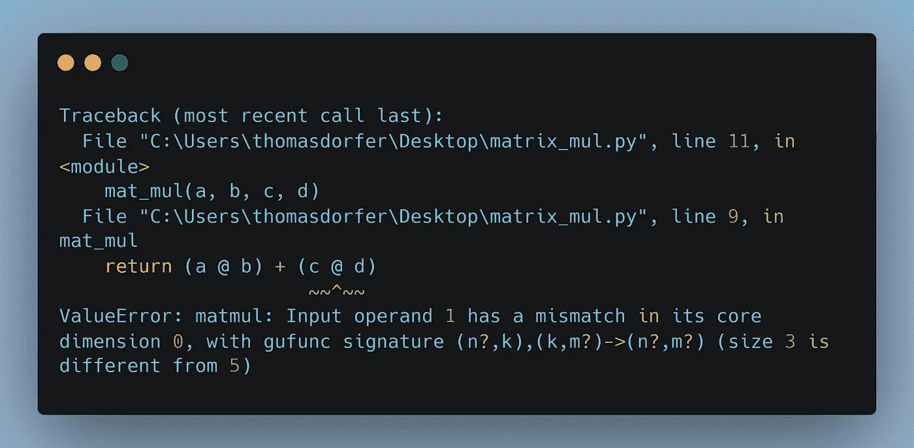

# Python 中的增强调试：追溯信息获得重大升级

> 原文：[`towardsdatascience.com/enhanced-debugging-in-python-tracebacks-just-got-a-major-upgrade-bd77fb32db38`](https://towardsdatascience.com/enhanced-debugging-in-python-tracebacks-just-got-a-major-upgrade-bd77fb32db38)

## 位置丰富的追溯信息如何促进 Python 3.11 中的调试体验

[](https://thomasdorfer.medium.com/?source=post_page-----bd77fb32db38--------------------------------)[](https://towardsdatascience.com/?source=post_page-----bd77fb32db38--------------------------------) [Thomas A Dorfer](https://thomasdorfer.medium.com/?source=post_page-----bd77fb32db38--------------------------------)

·发表于 [Towards Data Science](https://towardsdatascience.com/?source=post_page-----bd77fb32db38--------------------------------) ·4 分钟阅读·2023 年 3 月 15 日

--


图片来源 [Mohamed Hassan](https://pixabay.com/users/mohamed_hassan-5229782/) 于 [Pixabay](https://pixabay.com/vectors/error-warning-computer-crash-6641731/)

在 Python 中，追溯信息是在发生异常时显示的报告，以及一个（希望）有帮助的错误消息，可以引导用户找到问题所在。

到目前为止，追溯信息仅显示了异常发生的行，但没有提供关于该行的具体位置的信息。

为了说明这一点，假设我们有一个字典对象，包含一些随机数据的总结统计信息。基于此，我们希望计算置信区间的下限和上限。可以按如下方式进行：

```py
import numpy as np

stats = {'n': 50,
         'mean': 20,
         'std': 2.5,
         'z': None}

def ci(stats):
    lower = stats['mean'] - stats['z'] * (stats['std'] / np.sqrt(stats['n']))
    upper = stats['mean'] + stats['z'] * (stats['std'] / np.sqrt(stats['n']))

    return lower, upper

ci(stats)
```

我故意将`None`赋值给我们字典对象中的*z*值，以引发异常。对于低于 3.11 的 Python 版本，追溯信息将如下所示：



作者提供的图像。

虽然它正确地显示了异常发生的行，但用户没有获得关于问题是否出在均值、*z*值、标准差或样本大小*n*的任何信息。

这在 Python 3.11 中发生了变化，新增了位置丰富的追溯信息功能：



作者提供的图像。

在这里，它清楚地突出显示了错误发生在术语`stats['z']`上，使用户调试程序变得容易得多。

现在让我们来看另一个例子。假设你有一个 Python 脚本，它对矩阵进行一些计算。记住，在矩阵乘法中，内维度必须相同。换句话说，第一个矩阵的列数必须与第二个矩阵的行数相同。

在下面的代码中，我引入了矩阵`c`和`d`之间的维度不匹配。

```py
import numpy as np

a = np.random.rand(3, 5)
b = np.random.rand(5, 4)
c = np.random.rand(3, 5)
d = np.random.rand(3, 5)

def mat_mul(a, b, c, d):
    return (a @ b) + (c @ d)

mat_mul(a, b, c, d)
```

正如预期的那样，这会导致在尝试乘法时出现异常。在 Python 3.11 以下版本中，它的表现如下：



作者提供的图片。

如果这段代码是更大程序的一部分，或涉及更多矩阵，那么找出哪个矩阵的维度不正确将变得非常困难和耗时。

在 Python 3.11 中，回溯信息会精准地指向公式中包含维度不匹配的矩阵部分，直接引导用户找到问题的核心。



作者提供的图片。

增强位置的回溯信息极大地促进了程序员的调试体验，并能在面对代码中的错误时加快解决速度。然而，要启用此功能，必须将 Python 更新到[版本 3.11](https://www.python.org/downloads/release/python-3110/)。

我希望这个功能能让你的调试体验更轻松，同时节省你宝贵的时间。编程愉快！

## 更多资源：

+   [Python 3.11 的新特性 — Python 3.11.2 文档](https://docs.python.org/3/whatsnew/3.11.html#new-features)

## 喜欢这篇文章吗？

让我们联系吧！你可以在[Twitter](https://twitter.com/ThomasADorfer)和[LinkedIn](https://www.linkedin.com/in/thomasdorfer/)找到我。

如果你想支持我的写作，可以通过[Medium 会员](https://thomasdorfer.medium.com/membership)来实现，这将让你访问我所有的故事以及 Medium 上成千上万其他作家的作品。

[](https://medium.com/@thomasdorfer/membership?source=post_page-----bd77fb32db38--------------------------------) [## 通过我的推荐链接加入 Medium - Thomas A Dorfer]

### 阅读 Thomas A Dorfer 的每一篇故事（以及 Medium 上成千上万其他作家的作品）。你的会员费用直接支持…

medium.com](https://medium.com/@thomasdorfer/membership?source=post_page-----bd77fb32db38--------------------------------)
