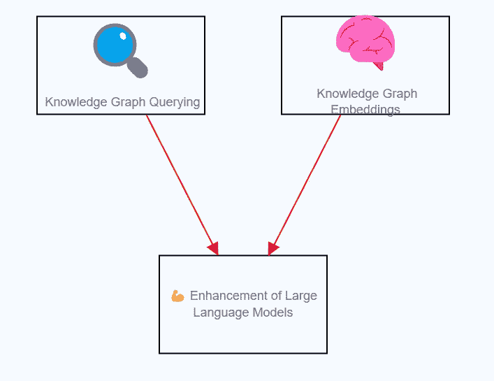
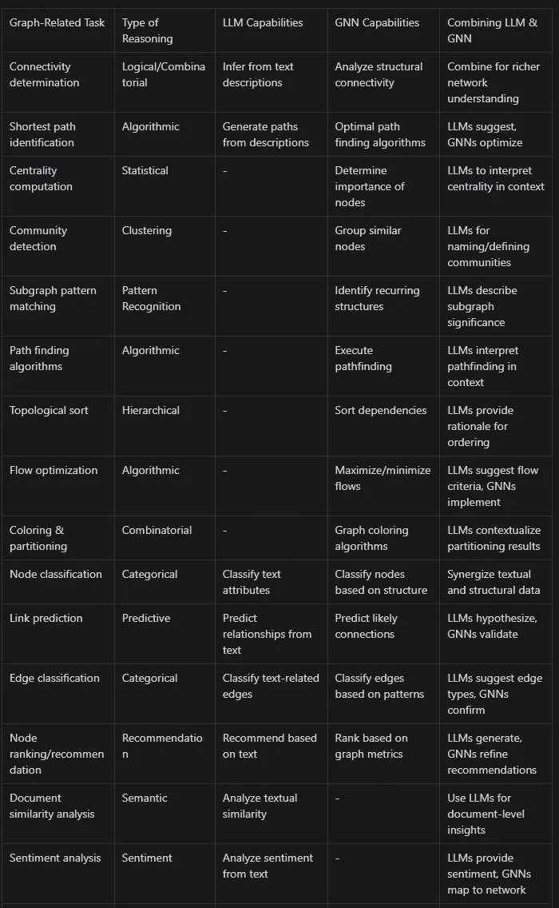
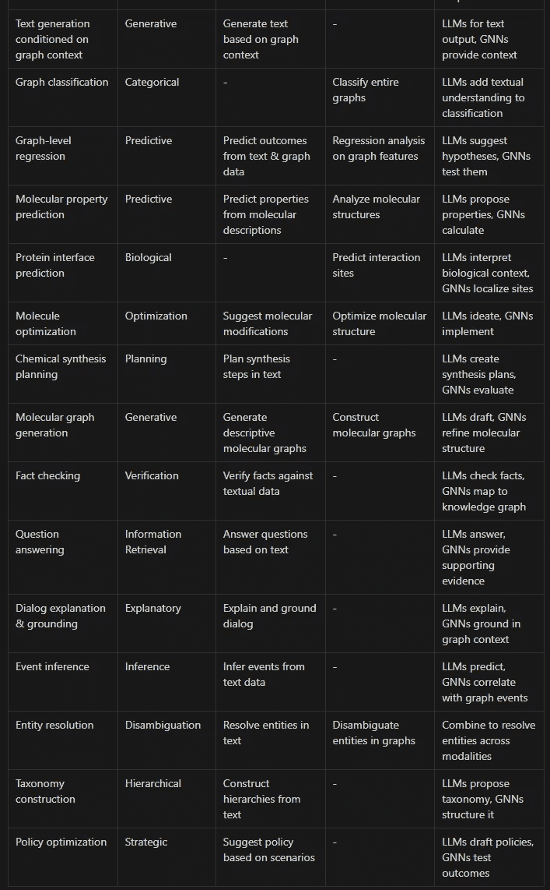
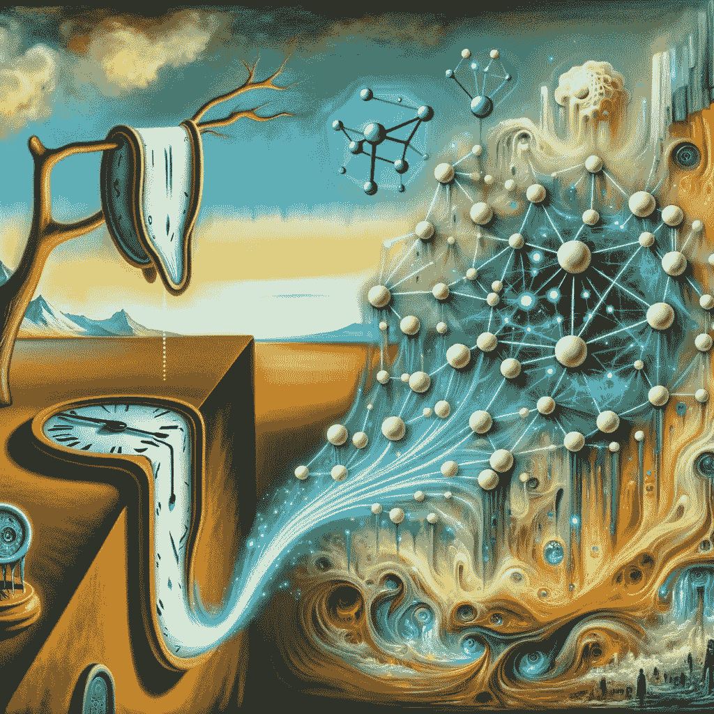

# 增强的大型语言模型作为推理引擎

> 原文：[`towardsdatascience.com/enhanced-large-language-models-as-reasoning-engines-582bff782113`](https://towardsdatascience.com/enhanced-large-language-models-as-reasoning-engines-582bff782113)

[](https://medium.com/@alcarazanthony1?source=post_page-----582bff782113--------------------------------)[](https://towardsdatascience.com/?source=post_page-----582bff782113--------------------------------) [安东尼·阿尔卡拉斯](https://medium.com/@alcarazanthony1?source=post_page-----582bff782113--------------------------------)

·发表于 [Towards Data Science](https://towardsdatascience.com/?source=post_page-----582bff782113--------------------------------) ·阅读时长 12 分钟·2023 年 12 月 23 日

--

*人工智能软件被用来增强本文文本的语法、流畅性和可读性。*

最近，大型语言模型（LLMs）在自然语言处理能力方面的指数级进步引起了人们对其实现人类水平智能的巨大兴奋。它们在暴露于大量数据集后，能够生成异常连贯的文本并进行对话，这似乎表明了灵活的通用推理能力。

然而，越来越多的声音敦促对未受限制的乐观情绪保持谨慎，突出了限制神经方法的基本盲点。大型语言模型仍然经常犯基本的逻辑和数学错误，暴露了其回应背后缺乏系统性的问题。它们的知识仍然本质上是统计性的，没有更深层次的语义结构。

更复杂的推理任务进一步暴露了这些局限性。大型语言模型在因果、反事实和组合推理挑战中挣扎，这些挑战需要超越表面模式识别。与人类通过学习抽象的模式来灵活地重新组合模块概念不同，神经网络记忆的是共同出现的术语之间的相关性。这导致了在狭窄的训练分布之外的脆弱泛化。

这种鸿沟凸显了人类认知如何利用结构化的符号表示来实现系统的可组合性和因果模型以概念化动态。我们通过基于有效推理规则操控模块化的符号概念、链式逻辑依赖、利用心理模拟和假设变量关系机制来推理。神经网络固有的统计性质使得难以发展这种结构化推理。

尽管大语言模型（LLMs）具有亚符号基础，但符号类似现象的出现仍然令人费解。然而，更清晰地认识到这种“混合差距”是必要的。真正的进步需要融合互补的优势——神经方法的灵活性与结构化知识表示和因果推理技术——以创建集成推理系统。

我们首先概述了越来越多的分析揭示神经网络在系统性、因果理解和组合泛化方面的不足——强调与先天人类能力的差异。

接下来，我们详细介绍“推理差距”的显著方面，包括模块化技能协调的困难、解开动态和反事实模拟。我们揭示了当代机器学习所缺乏的先天人类能力，并解释了由此产生的脆弱性。

寻求解决方案时，我们讨论了知识图谱作为明确概念关系的支架，这些关系在统计学习中缺失。我们强调了结构化知识注入的方法——查询接口和向量化图谱嵌入——以将神经生成上下文化。

我们介绍了诸如嵌入中的维度类型和并行知识检索等技术，以改善逻辑推理和高效推断的归纳偏差。最后，我们主张耐心培养高质量知识图谱，作为追求实质性人工智能进展的战略资产。

# 推理差距：

[](https://arxiv.org/abs/2311.18751?source=post_page-----582bff782113--------------------------------) [## 语言模型代理在网络自动化中的组合泛化问题

### 语言模型代理（LMA）最近成为多步骤决策任务中的一种有前景的范式，通常…

[arxiv.org](https://arxiv.org/abs/2311.18751?source=post_page-----582bff782113--------------------------------) [](https://arxiv.org/abs/2305.20050?source=post_page-----582bff782113--------------------------------) [## 让我们逐步验证

### 近年来，大型语言模型在执行复杂多步骤推理的能力上有了显著提升…

[arxiv.org](https://arxiv.org/abs/2305.20050?source=post_page-----582bff782113--------------------------------) [](https://arxiv.org/abs/2304.03843?source=post_page-----582bff782113--------------------------------) [## 为什么要逐步思考？推理源于经验的局部性

### 人类具有强大而神秘的推理能力。通过一系列心理步骤，我们能够进行…

[arxiv.org](https://arxiv.org/abs/2304.03843?source=post_page-----582bff782113--------------------------------) [](https://pub.aimind.so/can-llm-learn-to-reason-about-cause-and-effect-82a5f7b8cf5c?source=post_page-----582bff782113--------------------------------) [## 大语言模型能否学会因果推理？

### 因果推理——理解和分析事件之间因果关系的能力——长期以来一直是…

[pub.aimind.so](https://pub.aimind.so/can-llm-learn-to-reason-about-cause-and-effect-82a5f7b8cf5c?source=post_page-----582bff782113--------------------------------)

一种新兴观点解释了 LLM 表现出的许多逻辑矛盾和系统性泛化不足，认为这是由于基本的“推理差距”——即无法自发地通过中间推理步骤将事实和推论串联起来。

人类具有使用结构化背景知识和将注意力指向相关路径的直觉能力。我们利用现有的模式和因果模型，将概念连接起来，以编织连贯的叙事。例如，人类可以通过使用首都关系连接孤立的事实——巴黎是法国的首都，法国气候温和，从而可靠地确定一个国家首都的气候。

然而，像 LLM 这样的神经网络仅积累了文本语料库中经常一起出现的术语之间的统计关联。它们的知识依然是隐性的和无结构的。由于没有对概念之间高阶语义关系的理解，它们难以弥合预训练过程中从未直接链接过的概念。需要通过中间步骤进行推理的问题揭示了这种脆弱性。

新基准测试特别评估系统性——模型是否能够以新颖的方式组合已知的构建块。虽然 LLM 在概念必须相关且已经出现在训练数据中的情况下可以达到高准确率，但当概念分开出现并相互影响时，性能显著下降。这些模型无法将孤立的统计知识串联起来，与人类通过间接关系链接概念不同。

这种现象在 LLM 无法在通过逐步提示展开的查询中提供一致的逻辑叙事中得到了实证。当轻微扰动探索新方向时，会触发不可预测的模型失败，因为学习到的统计关联会崩溃。没有结构化的表示或程序化操作符，LLM 无法维持连贯的、目标导向的推理链——暴露了组合泛化的缺陷。

“推理差距”有助于解释 LLM（大型语言模型）的反直觉行为。它们的知识通过深度学习编码在数十亿个参数中，仅从表面统计模式中获取，缺乏人类在概念一致性和探索中固有的有纪律、可解释的逻辑推理框架。这为混合神经符号方法的优先事项提供了启示。

**组合推理**

LLM 在系统性组合泛化方面仍然存在困难——灵活地通过重新组合已知技能来组装新颖的解决方案。例如，分别学习制作咖啡和吐司并不能直接使你能够协调这两者的联合例程。人类本质上发展出更丰富的模块化、层次化表示。

**因果推理**

虽然相关性对统计驱动模型来说很自然，但没有明确的概念框架，揭示涉及实验、干预和反事实的因果机制仍然难以捉摸。我们具备对对象、代理和动态的天生理解。

**时间推理**

事件、计划和叙事的顺序性和瞬态特征要求维持内部时间线，并展望未来。然而，LLMs 展现出的有限情节记忆无法维持连贯性，缺乏心理情境建模。

**常识**

我们广泛的日常框架，包括对象、空间和直观心理学，提供了在探索世界时的可能性证据。未能模拟这种对朴素物理学、语用学和社会动态的理解限制了暴露的统计知识。

**元学习**

人类在处理自身推理漏洞时展示了元认知，能够引导注意力并有意识地寻求信息以增强模型。而神经网络中的模糊性和缺乏更高阶的不确定性或自我反思限制了对模型的控制性、战略性改进。

总体而言，LLMs 不具备支持多样化系统化归纳的模式归纳、因果表示、模拟能力、自回归预测、社会启发式或元认知架构。缺乏结构化的归纳偏见，组合爆炸使得学习明确的组合变得不可行。推理漏洞的众多阻碍了达到由理解引导的人类般的灵活性。

这进一步突显了混合神经符号范式的紧迫性，这些范式将天生的神经能力与结构化的组合性和因果约束相结合。这样的整合有望实现更强大、可信的系统，能够流畅地推理。

# 通过知识图谱增强推理：

[](/vector-search-is-not-all-you-need-ecd0f16ad65e?source=post_page-----582bff782113--------------------------------) ## 向量搜索并非你所需的一切

### 引言

towardsdatascience.com [](https://medium.com/@alcarazanthony1/knowledge-graph-embeddings-as-a-bridge-between-symbolic-and-subsymbolic-ai-0f37c55de845?source=post_page-----582bff782113--------------------------------) [## 知识图谱嵌入作为符号与子符号 AI 之间的桥梁

### 结构的复兴

[medium.com](https://medium.com/@alcarazanthony1/knowledge-graph-embeddings-as-a-bridge-between-symbolic-and-subsymbolic-ai-0f37c55de845?source=post_page-----582bff782113--------------------------------) [](https://ai.plainenglish.io/augmenting-large-language-models-with-hybrid-knowledge-architectures-24cd322b5be7?source=post_page-----582bff782113--------------------------------) [## 使用混合知识架构增强大型语言模型

### 使用符号链跟踪向量相关性：一种平衡的方法，用于增强检索增强型推理中的稳健性……

[ai.plainenglish.io](https://ai.plainenglish.io/augmenting-large-language-models-with-hybrid-knowledge-architectures-24cd322b5be7?source=post_page-----582bff782113--------------------------------) 

作者的模式

知识图谱提供了一种有前景的方法来克服现代大型语言模型（LLMs）所面临的“推理差距”。通过将概念明确建模为节点，将关系建模为边，知识图谱提供了结构化的符号表示，这可以增强 LLMs 中的灵活统计知识。

建立概念之间的解释性连接可以增强跨遥远领域的系统化、可解释的推理。LLMs 很难仅通过学习的数据模式来连接不同的概念。但知识图谱可以通过提供相关的中介节点和关系，有效地关联文本语料中没有直接共现的概念。这种支撑结构弥合了统计知识的空白，实现逻辑链条。

这种知识图谱还增加了对 LLM 基础推理的透明度和信任度。要求模型展示基于显式图关系的完整推理链可以减轻不当统计幻觉带来的风险。暴露图路径使统计输出建立在经过验证的连接上。

在本质上统计的 LLMs 与结构化因果表示之间构建干净的接口显示出克服当前脆弱性的潜力。将神经知识的广度与外部知识的深度相结合，可以促进 AI 系统的开发，使其在学习和推理方面既灵活又系统化。

## **知识图谱查询和图算法**

知识图谱查询和图算法是从大数据集中提取和分析复杂关系的强大工具。以下是它们的工作原理及其可能达到的效果：

## 知识图谱查询：

知识图谱将信息组织为实体（如书籍、人物或概念）和关系（如著作关系、亲属关系或主题连接）。查询语言如 SPARQL 和 Cypher 使得可以构造查询，从这些图谱中提取特定信息。例如，你示例中的查询通过匹配与相关主题节点连接的书籍节点，找到与“人工智能”相关的书籍。

## 图算法：

除了查询，图算法还可以以更深层次的方式分析这些结构。一些典型的图算法包括：

+   路径寻找算法（如 Dijkstra 算法、A* 算法）：找到两个节点之间的最短路径，适用于路线规划和网络分析。

+   社区检测算法（如 Louvain 方法）：识别图中的聚类或社区，有助于社交网络分析和市场细分。

+   中心性测量（如 PageRank、介数中心性）：确定网络中不同节点的重要性，适用于分析社交网络中的影响力或交通网络中的关键基础设施。

+   推荐系统：通过分析用户-项目图，这些系统可以基于过去的互动进行个性化推荐。

大型语言模型（LLMs）可以基于自然语言输入生成对知识图谱的查询。尽管它们在理解和生成类似人类的文本方面表现出色，但其统计性质意味着它们在结构化逻辑推理方面较弱。因此，将它们与知识图谱和结构化查询接口配对，可以利用两者的优势：LLM 用于理解和上下文化用户输入，知识图谱用于精确、逻辑的数据检索。

将图算法纳入其中可以进一步增强这种协同。例如，LLM 可以建议在社交网络图上使用社区检测算法，以识别特定兴趣小组中的影响力人物。然而，挑战在于以高效且可解释的方式集成这些不同的系统。



**知识图谱嵌入**

知识图谱嵌入将实体和关系编码为密集的向量表示。这些向量可以在 LLM 中动态集成，使用融合模型。

例如，交叉注意机制可以通过将语言模型的令牌嵌入与检索到的图嵌入进行匹配，从而为语言模型的令牌嵌入提供上下文。这注入了相关的外部知识。

数学上将这些互补向量融合，既为模型提供了基础，又允许在两个组件之间进行梯度流动。LLM 继承了关系模式，改善了推理能力。

因此，查询和嵌入机制都提供了将结构化知识图谱与 LLMs 的统计能力连接起来的方法。这有助于生成可解释的、基于策划事实的上下文响应。

通往安全、高效和可解释 AI 的道路无疑在于设计具有不同推理模块的混合系统，这些模块适合其各自的优势，同时通过共生集成来减轻各自的弱点。知识图谱提供了结构性的支撑，将 LLMs 从模式识别器提升为具有上下文感知和严格推理能力的推理器。

知识图谱嵌入可以通过加入额外的约束和结构进一步增强，而不仅仅是编码事实实体和关系。这提供了有用的归纳偏差，以更可靠的方式定向语义相似性和推理。

一些例子包括：

**维度类型**

在嵌入空间中分配专门的维度，以建模特定的层次知识类别（如类型、属性、时间段等），可以解释向量运算和对称操作。

**逻辑规则作为向量方程**

将逻辑规则如传递性建模为关系嵌入上的向量方程，使得在查询向量空间时符合一阶逻辑。

```py
v(loves) - v(likes) ≈ v(likes) - v(feels_neutral_about)
```

**实体链接正则化**

添加链接损失将相同真实世界实体的向量表示拉近，改善跨表面形式的泛化能力。

**时间排序**

通过按时间顺序排列实体嵌入来编码时间序列知识，有助于进行时间上的类比推理。

总的来说，通过结构化的归纳偏差——无论是通过类型维度、向量逻辑还是时间排序——美化知识图谱嵌入，使得向量运算更好地符合现实世界约束。这增强了它们解决复杂推理任务的能力，提供了有用的支撑，同时提升了集成语言模型的性能。

核心好处在于将领域知识注入以精确方式定向潜在几何，从而增强连接主义模型在与向量空间互动时的推理能力。通过结构化初始化指导神经引擎操作的原始数据，促进了通过查询进行更系统的组合计算。

# 互补方法：

首先在查询完整知识图谱之前检索相关的知识图谱嵌入。这种两步法允许高效集中图形操作：

**步骤 1：向量嵌入检索**

给定自然语言查询，相关的知识图谱嵌入可以通过对索引向量的近似最近邻搜索迅速检索。

例如，使用类似“哪些书讨论了人工智能”的查询，向量搜索会识别出 Book、Topic 和 AI Concept 实体的嵌入。

这在不需要扫描整个图谱的情况下聚焦搜索，改善延迟。嵌入提供了有用的查询扩展信号，用于下一步。

**步骤 2：图查询/算法执行**

选定的实体嵌入建议有用的切入点和关系，用于结构化的图形查询和算法。

在我们的示例中，Book、Topic 和 AI Concept 的匹配引导了 BOOK-TOPIC 和 TOPIC-CONCEPT 连接的探索。

执行如下查询：

```py
MATCH (b:Book)-[:DISCUSSES]->(t:Topic)-[:OF_TYPE]->(c:Concept)  
WHERE c.name = "Artificial Intelligence"
RETURN b
```

这遍历了与 AI 主题相关的书籍以生成相关结果。

总体而言，高层次流程是：

1.  使用向量搜索识别有用的符号句柄

1.  执行由这些句柄种子生成的图算法

这种紧密耦合将相似性搜索的强度与多跳推理相结合。

主要好处在于使用快速的初始嵌入匹配来聚焦复杂的图算法。这通过避免对每个查询进行详尽的图扫描，改善了延迟和相关性。这种组合使得对广泛知识的可扩展、高效的语义搜索和推理成为可能。

# 并行查询多个图谱或相同图谱

[](/achieving-structured-reasoning-with-llms-in-chaotic-contexts-with-thread-of-thought-prompting-and-a4b8018b619a?source=post_page-----582bff782113--------------------------------) [## 在混乱的背景下通过思维线索提示和…实现结构化推理]

### 大型语言模型（LLMs）展示了令人印象深刻的少量学习能力，能够迅速适应新任务...

towardsdatascience.com

使用多个知识图谱并行的关键思想是为语言模型提供更广泛的结构化知识来源，以便在推理过程中进行借鉴。让我进一步阐述一下其合理性：

1.  **知识广度**：没有任何一个知识图谱可以囊括所有人类在各个领域的积累的知识。通过并行查询多个知识图谱，我们可以最大化语言模型可利用的事实信息。

1.  **推理多样性**：不同的知识图谱可能使用不同的本体、规则、约束等来建模领域。这种知识表示的多样性使语言模型能够接触到更多样的推理模式进行学习。

1.  **效率**：并行查询知识图谱允许同时检索相关信息。这比顺序查询提高了延迟效率。并行搜索允许更快速地收集上下文细节进行分析。

1.  **鲁棒性**：拥有多个知识来源提供了冗余，以防某个特定图谱不可用或缺乏特定推理链的信息。

1.  **迁移学习**：接触到多种推理方法为语言模型提供了更多可迁移的学习示例。这增强了少量学习的适应能力。

总结来说，协调多个知识图谱提供了广泛和多样化的基础知识，以克服单一知识库的局限性。并行检索提高了效率和鲁棒性。跨多样化推理模式的迁移学习也加速了语言模型的适应。这种组合旨在扩展结构化知识注入，实现更接近人类的多功能理解。

# 大型语言模型作为结构化模块之间流动的语义粘合剂

虽然向量搜索和知识图谱提供了结构化的符号表示，但像 GPT-3 这样的语言模型（LLMs）提供了非结构化但适应性强的语义知识。LLMs 已经展示了卓越的少量学习能力，能够在只有少量示例的情况下快速适应新领域。

这使得 LLMs 非常适合在结构化模块之间充当流动的语义胶——吸收符号知识，解释指令，通过泛化处理边缘情况，并生成上下文输出。它们利用其广泛的参数知识迅速与外部程序和数据表示集成。

因此，我们可以将 LLMs 视为动态的、不断优化的语义层。它们吸收结构化知识的形式，并根据新的输入和查询上下文进行即时适应。LLMs 不是替代符号方法，而是通过快速绑定和上下文响应生成来增强它们。这种流动的整合节省了手动处理所有符号基础和边缘情况的努力。

利用 LLMs 的固有语义泛化能力，使结构化程序能够专注于提供逻辑约束和清晰接口。LLM 随后通过自适应少量学习处理不一致性和空白。这种共生的方法强调了以适应其固有优势的独特推理能力来构建 AI 系统。

# 结构化知识作为 AI 的基石

关于人工智能的指数级炒作风险让组织追求短视的脚本，承诺快速回报。但有意义的进展需要耐心地培养高质量的知识基础。这体现在结构化知识图谱中，系统地将人类专业知识编码为网络化的表示。

将复杂领域策划成相互关联的实体、约束和规则并非小事。这需要有意的本体工程、严谨的数据治理和迭代的改进。这种渐进性可能会让习惯于快速软件周期的商业领袖感到沮丧。

然而，结构化知识是 AI 缺失的支柱——通过基础信号遏制不受控制的统计模型。知识图谱提供了注入领域知识的支撑结构，同时实现了透明的查询和分析。其可组合的特性也允许与不同系统的互操作。

所有这些都使得企业知识图谱作为战略资产具有了令人信服的理由。正如数据库从灵活的电子表格发展而来，结构的约束最终乘以能力。企业知识图谱中的实体和关系成为推动从对话助手到分析的一切的可靠接触点。

在冲向 AI 前沿的过程中，放任不受约束的模型进行处理是很诱人的。但正如过去每一波自动化浪潮一样，精心编码人类知识以提升机器潜力仍然是至关重要的。如果管理得当，保持这种结构优势在应用中会随着时间的推移而不断增加，巩固市场领导地位。知识推动更好的决策——使得企业知识图谱成为不可或缺的 AI 基础。



由作者使用 Dall-E-3 生成的图像
