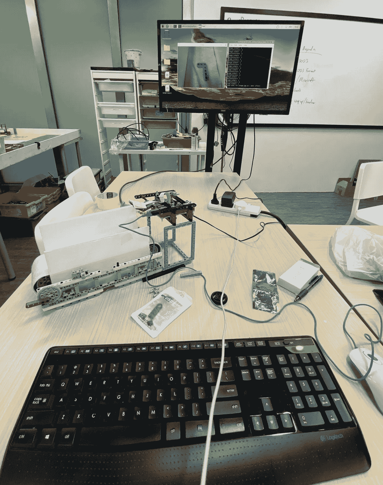
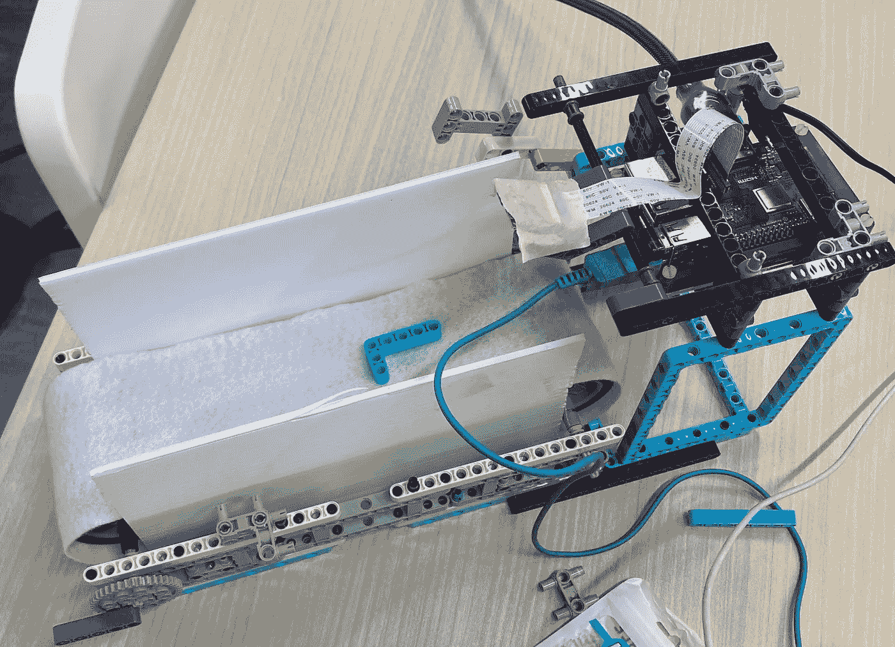
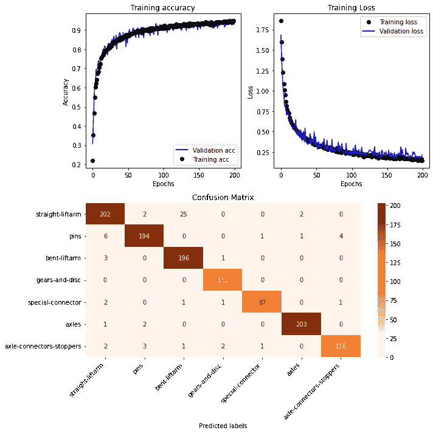
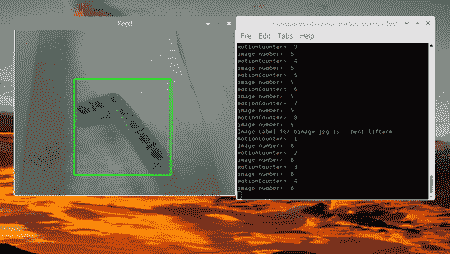
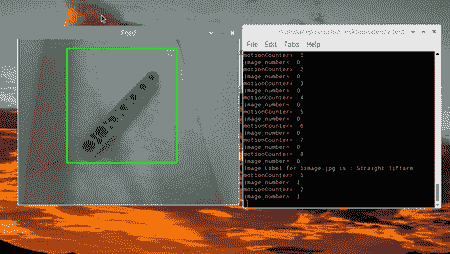
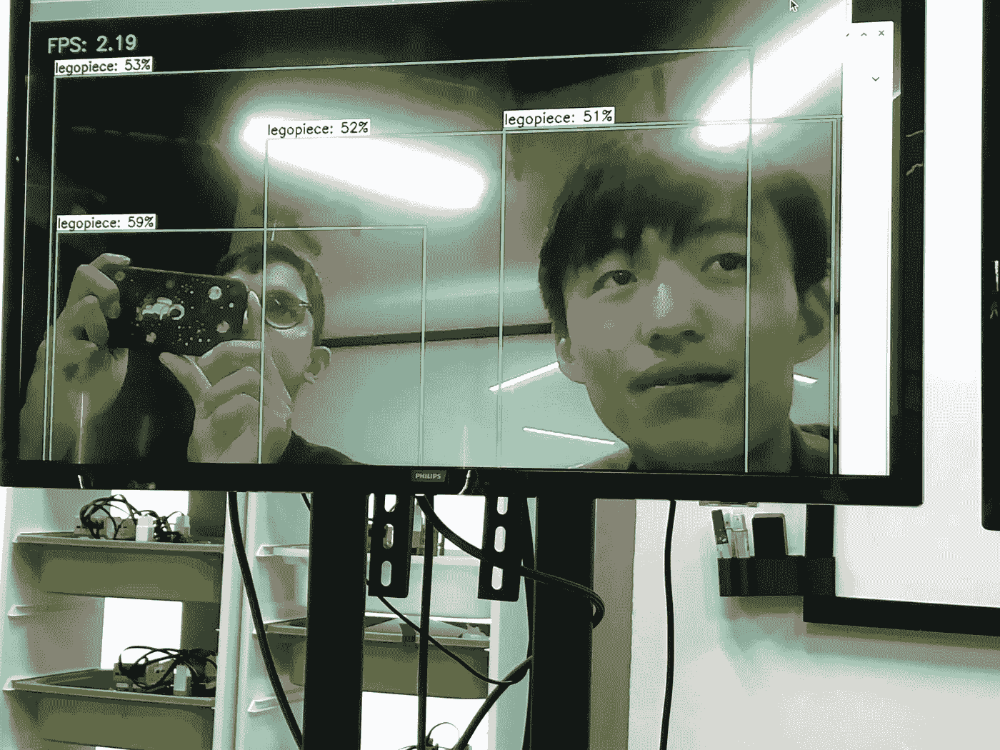

# 使用实时先进物体识别技术构建乐高技术件分类器

> 原文：[`towardsdatascience.com/enhancing-nullspace-robotics-capabilities-building-a-lego-sorter-with-advanced-object-recognition-7ba5d70c9902?source=collection_archive---------5-----------------------#2023-11-02`](https://towardsdatascience.com/enhancing-nullspace-robotics-capabilities-building-a-lego-sorter-with-advanced-object-recognition-7ba5d70c9902?source=collection_archive---------5-----------------------#2023-11-02)

[](https://medium.com/@aveekgoswami?source=post_page-----7ba5d70c9902--------------------------------)[](https://towardsdatascience.com/?source=post_page-----7ba5d70c9902--------------------------------) [Aveek Goswami](https://medium.com/@aveekgoswami?source=post_page-----7ba5d70c9902--------------------------------)

·

[关注](https://medium.com/m/signin?actionUrl=https%3A%2F%2Fmedium.com%2F_%2Fsubscribe%2Fuser%2Fff6c39b7b31a&operation=register&redirect=https%3A%2F%2Ftowardsdatascience.com%2Fenhancing-nullspace-robotics-capabilities-building-a-lego-sorter-with-advanced-object-recognition-7ba5d70c9902&user=Aveek+Goswami&userId=ff6c39b7b31a&source=post_page-ff6c39b7b31a----7ba5d70c9902---------------------post_header-----------) 发布于 [Towards Data Science](https://towardsdatascience.com/?source=post_page-----7ba5d70c9902--------------------------------) · 9 分钟阅读 · 2023 年 11 月 2 日

--

[](https://medium.com/m/signin?actionUrl=https%3A%2F%2Fmedium.com%2F_%2Fbookmark%2Fp%2F7ba5d70c9902&operation=register&redirect=https%3A%2F%2Ftowardsdatascience.com%2Fenhancing-nullspace-robotics-capabilities-building-a-lego-sorter-with-advanced-object-recognition-7ba5d70c9902&source=-----7ba5d70c9902---------------------bookmark_footer-----------)

**在我于** [**Nullspace Robotics**](https://sg.nullspace.co)**实习期间，我有幸参与了一个提升公司能力的项目。我们集成了物体检测和机器学习图像识别，开发了一台能够实时分类乐高技术件的机器。**

**在这篇博客文章中，我将带你了解遇到的挑战以及我们如何成功完成这个项目。**



*阿莫斯·科赫和我在 22 年夏天教学生编程和机器人技术，同时为 Nullspace 工作。你可以在文章下方的链接找到我们。*

Nullspace Robotics 是新加坡领先的中小学机器人和编程教育提供商。他们的大部分操作涉及使用乐高 Technic 部件构建机器人，这些部件被分类到特定的托盘中。你可以想象，让一个充满精力的 8 岁小孩帮忙把积木放回托盘是一个噩梦般的任务，而他们只想做更多的东西。

Nullspace 让我们制作一台可以将乐高 Technic 积木分类到特定类别的机器，以最小化人工干预，从而解决进行机器人教学时的关键效率挑战之一。

## 确定挑战

该项目涉及三个主要部分：实时物体和运动检测、图像识别以及机器的硬件建设。由于实习的时间限制，我们主要关注了前两个项目，这涉及到项目的软件方面。

一个关键挑战是识别移动部件并在同一帧内确定它们的位置。我们考虑了两种方法：将机器学习图像识别集成到物体检测相机中，或保持过程分开。

最终，我们决定将物体检测和识别分开。这种方法首先在检测到物体后捕捉合适的图片，然后运行模型对图像进行分类。将这些过程整合在一起需要在几乎每一帧上运行模型，以对每个检测到的物体进行分类。将它们分开消除了模型需要保持持续处理模式的需求，从而确保了操作更加流畅和计算更高效。

# **物体检测**

我们借鉴了文章下方引用的项目中的想法，实施了我们的物体/运动检测程序，并将其定制为乐高积木。

在我们的案例中，我们使用了类似的运动检测概念，因为我们的机器将涉及一个统一颜色的传送带系统，因此检测到的任何运动都是由于乐高积木在传送带上移动。

我们对所有帧应用了高斯模糊以及其他图像处理技术，并与之前的帧进行比较。进一步处理用于隔离（绘制边界框）造成运动的物品，如下所示：

```py
for f in camera.capture_continuous(rawCapture, format="bgr", use_video_port=True):

    frame = f.array # grab the raw NumPy array representing the image
    text = "No piece" # initialize the occupied/unoccupied text

    # resize the frame, convert it to grayscale, and blur it
    frame = imutils.resize(frame, width=500)
    gray = cv2.cvtColor(frame, cv2.COLOR_BGR2GRAY)
    gray = cv2.GaussianBlur(gray, (21, 21), 0)

    # if the average frame is None, initialize it
    if avg is None:
        print("[INFO] starting background model...")
        avg = gray.copy().astype("float")
        rawCapture.truncate(0)
        continue

    # accumulate the weighted average between the current frame and
    # previous frames, then compute the difference between the current
    # frame and running average
    cv2.accumulateWeighted(gray, avg, 0.5)
    frameDelta = cv2.absdiff(gray, cv2.convertScaleAbs(avg))    

    # threshold the delta image, dilate the thresholded image to fill
    # in holes, then find contours on thresholded image
    thresh = cv2.threshold(frameDelta, conf["delta_thresh"], 255,
        cv2.THRESH_BINARY)[1]
    thresh = cv2.dilate(thresh, None, iterations=2)
    cnts = cv2.findContours(thresh.copy(), cv2.RETR_EXTERNAL,
        cv2.CHAIN_APPROX_SIMPLE)
    cnts = imutils.grab_contours(cnts)

    # loop over the contours

    for c in cnts:
        # if the contour is too small, ignore it
        if cv2.contourArea(c) < conf["min_area"]:
            continue

        # compute the bounding box for the contour, draw it on the frame,
        # and update the text
        (x, y, w, h) = cv2.boundingRect(c)
        cv2.rectangle(frame, (x, y), (x + w, y + h), (0, 255, 0), 2)
        piece_image = frame[y:y+h,x:x+w]
        text = "Piece found"
        # cv2.imshow("Image", image)
```

为了确保运动实际上是由乐高积木造成的，我们使用了一个运动计数器来评估运动检测的稳定性，该计数器检查了在得出运动确实是由于乐高积木而非杂音之前，是否在一定数量的帧内检测到了运动。最终图像被保存并输入到我们的 CNN 中进行分类。

```py
if text == "Piece found":
        # to save images of bounding boxes
        motionCounter += 1
        print("motionCounter= ", motionCounter)
        print("image_number= ", image_number)

        # Save image if motion is detected for 8 or more successive frames
        if motionCounter >= 8:
            image_number +=1
            image_name = str(image_number)+"image.jpg"
            cv2.imwrite(os.path.join(path, image_name), piece_image)
            motionCounter = 0 #reset the motion counter

 # classify the saved image with our model, see below
```

# 创建模型

**建立数据集**

我们自己创建了图像数据集，而不是使用在线找到的 Lego Technic 零件图像，因为我们想要模拟模型最终检测和分类零件的条件。因此，我们设计了一个简单的传送带系统，完全使用 Lego Technic 零件！然后我们将其连接到 Lego Spike Prime 电机，以保持传送带的运转。



**设计模型架构**

为了解决挑战的核心问题，我调整了我在 Aladdinpersson 的 GitHub 仓库中找到的一个机器学习模型。这个模型采用了从 128 到 64 再到 32 再到 16 的卷积层序列，这种架构设计旨在提高图像识别能力。

我们没有使用预训练模型，而是设计了自己的卷积神经网络，因为：

1.  我们不需要特别深的特征提取来处理我们的图像。

1.  我们希望保持模型的小巧并降低其复杂性，同时减少运行模型的计算成本。这将使 CNN 在 Pi 上以 tflite 模型更高效地运行。

数据归一化是确保一致训练准确性的关键步骤，特别是考虑到不同图像由于光照差异而捕获的值范围不同。

在这个模型中，诸如 ReLU、dense、softmax 和 flatten 等不同层发挥了关键作用。例如，ReLU 激活对于图像分类至关重要，因为它减轻了图像识别中的梯度消失问题。另一方面，Dense 层在 Tensorflow 模型中是标准配置，有助于实现密集连接的神经网络。Softmax 激活用于计算数据集中每个类别的概率。

对于损失函数，我们使用了 Keras 的稀疏类别交叉熵，这是多类分类任务的合适选择。我们使用了以其效率著称的 Keras Adam 优化器来微调模型。

**训练和优化**

训练轮次被精心选择，以在训练和过拟合之间取得平衡，倾向于选择低于 200 的轮次，以确保模型性能最佳。为了加快模型训练，我们利用了 Google Colab，它提供了 GPU 资源，相比我们自己的笔记本电脑，训练速度显著更快。

完整的模型架构如下所示：

```py
data_augmentation = keras.Sequential([
    layers.RandomFlip("horizontal",
                        input_shape=(img_height,
                                    img_width,
                                    1)),
    layers.RandomRotation(0.2),
    layers.RandomZoom(0.1),
    ])

model = keras.Sequential(
    [
        data_augmentation,

        layers.Rescaling(1./255, input_shape = (img_height,img_width,1)), #normalize the data input

        layers.Conv2D(128, 3, padding="same", activation='relu'),
        layers.MaxPooling2D(pool_size=(2,2)),

        layers.Conv2D(64, 3, padding="same", activation='relu'), #should this be 16 or 32 units? try with more data
        layers.MaxPooling2D(pool_size=(2,2)),

        layers.Conv2D(32, 3, padding="same", activation='relu'),
        layers.MaxPooling2D(pool_size=(2,2)),

        layers.Conv2D(16, 3, padding="same", activation='relu'),
        layers.MaxPooling2D(pool_size=(2,2)),

        layers.Dropout(0.1),
        layers.Flatten(),
        layers.Dense(10,activation = 'relu'),
        layers.Dense(7,activation='softmax'), # number of output classes

    ]
)        

model.compile(
    optimizer=keras.optimizers.Adam(),
    loss=[keras.losses.SparseCategoricalCrossentropy(from_logits=False),],
    metrics=["accuracy"],
)

model_history = model.fit(x_train, y_train, epochs=200, verbose=2, validation_data=(x_test,y_test), batch_size=25)  #i think 25/32 is the best batch size
```

**选择架构**

在大多数常见的 CNN 架构中，过滤器的数量会增加，以尝试在更高层捕捉更复杂的特征。然而，对于区分我们的 Lego 零件，类别之间的相似度很高，我们需要网络寻找如弯曲和孔洞等特定特征。我认为，在更深层中使用较少的过滤器可能有助于专注于这些较少的细微差别，而不是查看可能不利于区分零件的多个特征。

我们测试了两种架构，一种是减少滤波器，另一种是增加滤波器，结果是减少滤波器的模型表现显著更好。因此，减少滤波器的数量可以让网络专注于关键部分，减少复杂特征图中的噪声。

*当然，这取决于你的使用案例和数据集中的特征。例如，人脸识别需要更复杂的特征图，因此增加滤波器的方法可能效果更好。*

**模型结果**

该模型使用 6000 张图像，涵盖 7 类乐高技术块进行训练。最终验证准确率达到了**93%**。下面展示了训练过程的图示以及用于评估性能的混淆矩阵：



## 在树莓派上实施模型

在树莓派上运行神经网络的最有效方法是使用 tflite（tensorflow lite）模型。我们将模型保存到本地，然后加载到树莓派上。

```py
from tflite_runtime.interpreter import Interpreter

# Load TFLite model and allocate tensors.
interpreter = Interpreter(model_path="lego_tflite_model/detect.tflite") # insert path to the tflite model
interpreter.allocate_tensors()
```

继续使用上面提到的运动计数器循环，将适当的图像输入神经网络进行分类：

```py
 # continuing from if text == "Piece found":
            # Open the image, resize it and increase its contrast
            input_image = Image.open('lego-pieces/'+ image_name)
            input_image = ImageOps.grayscale(input_image)
            input_image = input_image.resize((128,128))
            input_data = img_to_array(input_image)
            input_data = increase_contrast_more(input_data)
            input_data.resize(1,128,128,1)

            # Pass the np.array of the image through the tflite model. This will output a probablity vector
            interpreter.set_tensor(input_details[0]['index'], input_data)
            interpreter.invoke()
            output_data = interpreter.get_tensor(output_details[0]['index'])

            # Get the index of the highest value in the probability vector.
            # This index value will correspond to the labels vector created above (i.e index value 1 will mean the object is most likely labels[1])
            category_number = np.argmax(output_data[0])

            # Return the classification label of the image    
            classification_label = labels[category_number]                
            print("Image Label for " + image_name + " is :", classification_label)

    else:
        motionCounter = 0 # reset motion counter to look for new objects
```

灵活性是一个关键考虑因素。运动计数器可以根据捕捉图像以构建数据集的过程或设置图像分类时的捕捉阈值进行调整，从而提升系统的多功能性。

# 演示

我们努力的最终成果是展示系统的整体准确性，辅以捕捉其操作的照片和视频。传送带设置（如上图）是此次演示的关键部分：



# 未来工作及改进方向

软件：未来的扩展还将包括在操作中加入质量检查模型，以确保用于分类部件的图像合适。

硬件：该模型无疑将受益于更高级的相机以获得更高质量的图像。此外，临时建造的传送带系统需要扩展以容纳更多部件。还需制定并实施一种方法来分离多个乐高部件，确保相机帧中每次只显示一个部件。网上有类似的项目详细介绍了可能的方法。

# 结论

我在 Nullspace Robotics 的经历是我首次尝试为实际用途构建自己的神经网络。在过去的培训课程中设计模型的经历与创建用于实际生产的模型完全不同，我们需要考虑资源、使用目的，并找到如何调整数据集和模型以适应我们需求的方法。我期待继续我的机器学习之旅，并利用最新的 AI 技术构建更具创新性的解决方案。

我想感谢 Nullspace 给我提供了这个项目的机会，我很期待看到公司在推进机器人教育的边界时接下来会有什么发展。

查看 Github 或 HuggingFace 上的完整代码库，获取代码、数据集图像以及更多项目信息：

Github: [`github.com/magichampz/lego-sorting-machine-ag-ak/`](https://github.com/magichampz/lego-sorting-machine-ag-ak/)

HuggingFace: [`huggingface.co/magichampz`](https://huggingface.co/magichampz)

# 认识开发者

Aveek: [`www.linkedin.com/in/aveekg00/`](https://www.linkedin.com/in/aveekg00/)

Amos: [`www.linkedin.com/in/ak726/`](https://www.linkedin.com/in/ak726/)

查看 [Nullspace Robotics](https://sg.nullspace.co)

# 参考文献：

[](https://pyimagesearch.com/2015/05/25/basic-motion-detection-and-tracking-with-python-and-opencv/?source=post_page-----7ba5d70c9902--------------------------------) [## 使用 Python 和 OpenCV 进行基本运动检测和跟踪 — PyImageSearch

### 在本教程中，我将向你展示如何使用 Python 和 OpenCV 执行基本的运动检测和跟踪。了解如何……

pyimagesearch.com](https://pyimagesearch.com/2015/05/25/basic-motion-detection-and-tracking-with-python-and-opencv/?source=post_page-----7ba5d70c9902--------------------------------) [](/image-analysis-for-beginners-creating-a-motion-detector-with-opencv-4ca6faba4b42?source=post_page-----7ba5d70c9902--------------------------------) ## 使用 OpenCV 检测运动 — 初学者图像分析

### 如何使用 OpenCV 检测和分析移动物体

towardsdatascience.com [](https://github.com/aladdinpersson/Machine-Learning-Collection/blob/master/ML/TensorFlow/Basics/tutorial15-customizing-modelfit.py?source=post_page-----7ba5d70c9902--------------------------------) [## Machine-Learning-Collection/ML/TensorFlow/Basics/tutorial15-customizing-modelfit.py 在主分支 ·…

### 一个关于机器学习和深度学习的资源……

github.com](https://github.com/aladdinpersson/Machine-Learning-Collection/blob/master/ML/TensorFlow/Basics/tutorial15-customizing-modelfit.py?source=post_page-----7ba5d70c9902--------------------------------)

# 未使用的内容



*除非另有说明，所有图片均为作者提供*
