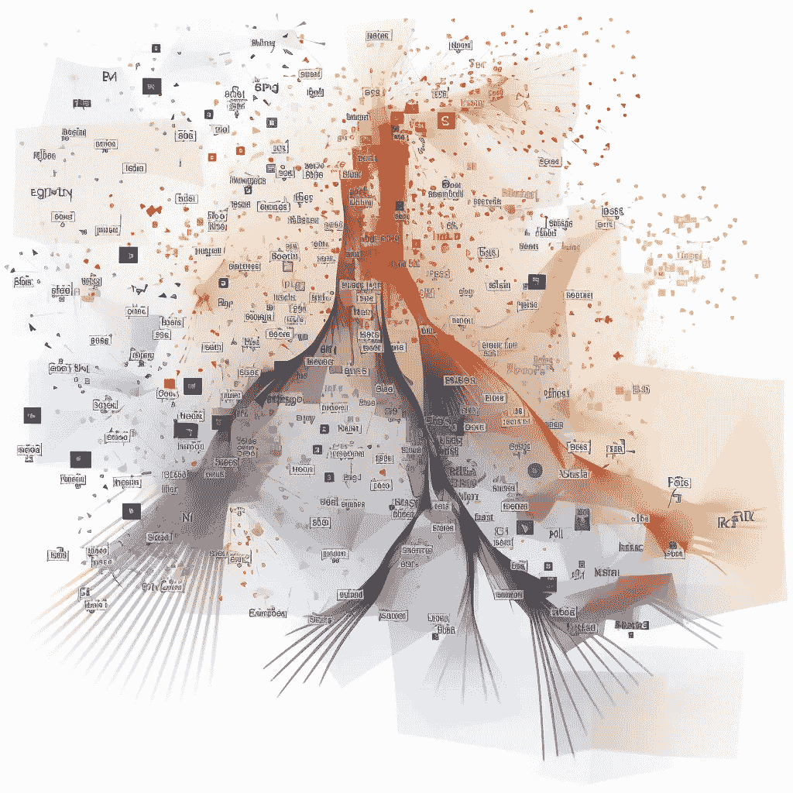
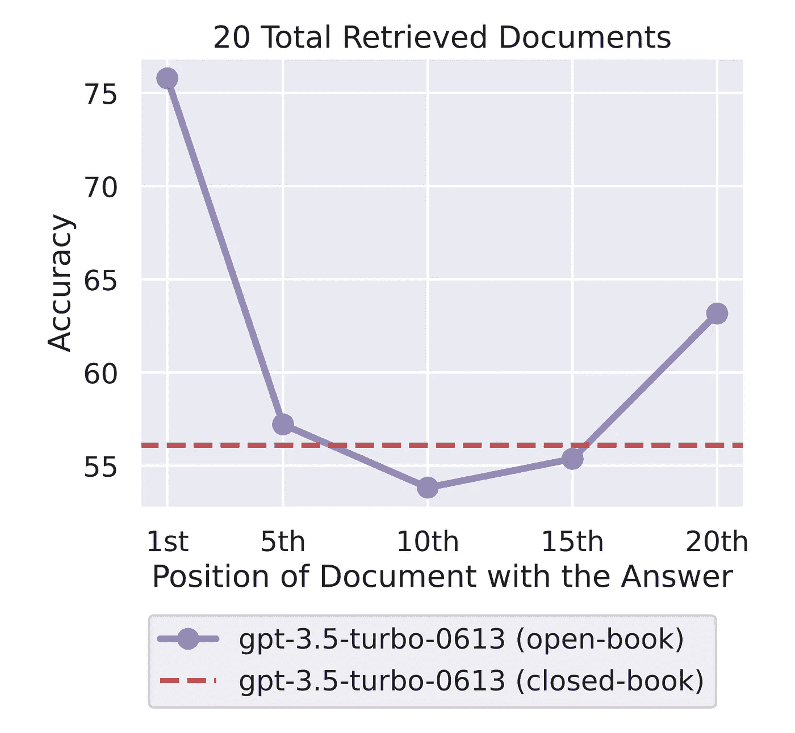
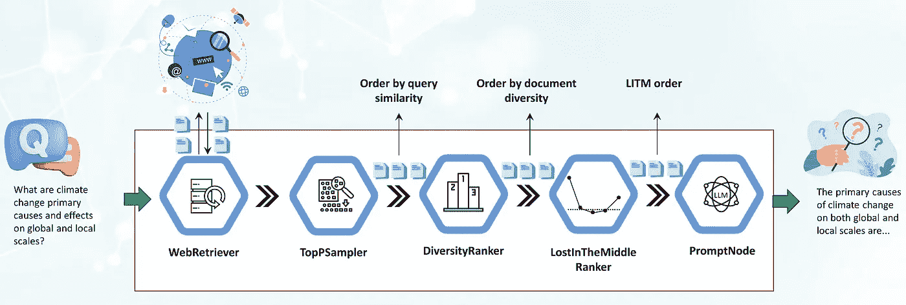

# 提升 Haystack 中的 RAG 流水线：引入 DiversityRanker 和 LostInTheMiddleRanker

> 原文：[`towardsdatascience.com/enhancing-rag-pipelines-in-haystack-45f14e2bc9f5?source=collection_archive---------1-----------------------#2023-08-08`](https://towardsdatascience.com/enhancing-rag-pipelines-in-haystack-45f14e2bc9f5?source=collection_archive---------1-----------------------#2023-08-08)

## 最新的排名器如何优化 LLM 上下文窗口在检索增强生成（RAG）流水线中的利用

 [Vladimir Blagojevic](https://medium.com/@dovlex?source=post_page-----45f14e2bc9f5--------------------------------)

·

[关注](https://medium.com/m/signin?actionUrl=https%3A%2F%2Fmedium.com%2F_%2Fsubscribe%2Fuser%2Ff1fc40f79c2f&operation=register&redirect=https%3A%2F%2Ftowardsdatascience.com%2Fenhancing-rag-pipelines-in-haystack-45f14e2bc9f5&user=Vladimir+Blagojevic&userId=f1fc40f79c2f&source=post_page-f1fc40f79c2f----45f14e2bc9f5---------------------post_header-----------) 发表在 [Towards Data Science](https://towardsdatascience.com/?source=post_page-----45f14e2bc9f5--------------------------------) · 8 分钟阅读 · 2023 年 8 月 8 日 

--

最近在自然语言处理（NLP）和长文问答（LFQA）方面的改进，几年前听起来简直像科幻小说中的内容。谁能想到现在我们会有能够像专家一样精确回答复杂问题的系统，同时从庞大的资源库中即时合成这些答案？LFQA 是一种检索增强生成（RAG），最近取得了显著进展，利用了大型语言模型（LLMs）最优秀的检索和生成能力。

但如果我们能进一步优化这个设置呢？如果我们可以优化 RAG 如何选择和利用信息以提升其性能呢？本文介绍了两个创新组件，旨在通过基于最新研究和我们的经验，从 LFQA 中提取具体示例来改善 RAG——DiversityRanker 和 LostInTheMiddleRanker。

将 LLM 的上下文窗口视为一顿美味的餐点，其中每段文字都是一种独特且富有风味的配料。就像一件精美的烹饪作品需要多样化的高质量配料一样，LFQA 问答也要求上下文窗口充满高质量、多样化、相关且不重复的段落。

在 LFQA 和 RAG 的复杂世界中，最大限度地利用 LLM 的上下文窗口至关重要。任何浪费的空间或重复的内容都会限制我们提取和生成答案的深度和广度。合理布置上下文窗口的内容是一项微妙的平衡工作。本文提出了掌握这一平衡的全新方法，这将提升 RAG 提供准确、全面响应的能力。

让我们探索这些令人兴奋的进展以及它们如何改善 LFQA 和 RAG。

## **背景**

Haystack 是一个开源框架，提供实践 NLP 构建者的端到端解决方案。它支持从问答和语义文档搜索到 LLM 代理等广泛的用例。其模块化设计允许集成最先进的 NLP 模型、文档存储和当今 NLP 工具箱中所需的各种其他组件。

Haystack 中的一个关键概念是管道的思想。管道表示一个特定组件执行的一系列处理步骤。这些组件可以执行各种类型的文本处理，允许用户通过定义数据如何在管道中流动以及执行处理步骤的节点顺序，轻松创建强大且可定制的系统。

在基于网络的长篇问答中，管道发挥了关键作用。它从 WebRetriever 组件开始，该组件在网络上搜索和检索与查询相关的文档，自动将 HTML 内容剥离成原始文本。但一旦我们获取了与查询相关的文档，我们如何充分利用它们？我们如何填充 LLM 的上下文窗口以最大化答案的质量？如果这些文档尽管高度相关，但却重复且数量众多，有时会溢出 LLM 上下文窗口，该怎么办？

今天我们将介绍的组件正是在这里发挥作用的——DiversityRanker 和 LostInTheMiddleRanker。它们的目标是解决这些挑战并改善 LFQA/RAG 管道生成的答案。

DiversityRanker 增强了上下文窗口中选定段落的多样性。LostInTheMiddleRanker 通常在流水线中位于 DiversityRanker 之后，有助于减轻模型在长上下文窗口中必须访问相关信息时观察到的性能下降。接下来的部分将深入探讨这两个组件，并展示它们在实际使用案例中的效果。

## **DiversityRanker**

DiversityRanker 是一个新型组件，旨在增强 RAG 流水线中上下文窗口选定段落的多样性。它基于一个原则，即多样化的文档集可以提高 LLM 生成答案的广度和深度。

图 1：DiversityRanker 算法文档排序过程的艺术表现，由 MidJourney 提供。请注意，此可视化更多是说明性的，而非精确的。

DiversityRanker 使用句子变换器来计算文档之间的相似度。句子变换器库提供了强大的嵌入模型，用于创建句子、段落甚至整个文档的有意义表示。这些表示或嵌入捕捉了文本的语义内容，使我们能够测量两段文本的相似性。

DiversityRanker 使用以下算法处理文档：

1\. 它首先使用句子变换器模型计算每个文档和查询的嵌入。

2\. 然后选择语义上最接近查询的文档作为第一个选择的文档。

3\. 对于每个剩余的文档，它计算与已经选择的文档的平均相似度。

4\. 然后选择平均上与已经选择的文档最不相似的文档。

5\. 这个选择过程持续进行，直到所有文档都被选择，结果是一个文档列表，从对整体多样性贡献最大的文档到贡献最小的文档。

需要记住的技术说明：DiversityRanker 使用贪婪的局部方法来选择下一个文档，这可能无法找到文档的最优整体顺序。DiversityRanker 更注重多样性而非相关性，因此它应该在 TopPSampler 或其他更注重相关性的相似性排序器等组件之后放置在流水线中。通过在选择最相关文档的组件之后使用它，我们确保从已经相关的文档池中选择多样化的文档。

## **LostInTheMiddleRanker**

LostInTheMiddleRanker 优化了所选文档在 LLM 上下文窗口中的布局。这个组件是解决最近研究中识别出的一个问题的一种方法[1]，该研究表明 LLM 难以关注长上下文中间的相关段落。LostInTheMiddleRanker 将最佳文档交替放置在上下文窗口的开头和结尾，使 LLM 的注意力机制更容易访问和使用它们。为了理解 LostInTheMiddleRanker 如何排序给定的文档，可以想象一个简单的例子，其中文档由从 1 到 10 的单个数字按升序排列。LostInTheMiddleRanker 将这十个文档按以下顺序排序：[1 3 5 7 9 10 8 6 4 2]。

尽管这项研究的作者专注于一个问答任务——从文本中提取相关的答案片段——我们推测 LLM 的注意力机制在生成答案时，也会更容易关注上下文窗口开头和结尾的段落。

图 2\. LLM 在提取上下文中间的答案时遇到困难，改编自 Liu 等（2023）[1]

LostInTheMiddleRanker 最适合作为 RAG 管道中的最后一个排名器，因为所给的文档已经基于相似性（相关性）进行选择，并按多样性排序。

## **在管道中使用新的排名器**

在本节中，我们将探讨 LFQA/RAG 管道的实际应用案例，重点是如何集成 DiversityRanker 和 LostInTheMiddleRanker。我们还将讨论这些组件如何相互作用以及与管道中的其他组件的互动。

管道中的第一个组件是 WebRetriever，它使用程序化搜索引擎 API（如 SerperDev、Google、Bing 等）从网络中检索查询相关的文档。检索到的文档首先去除 HTML 标签，转换为原始文本，并可选择性地预处理成较短的段落。然后，这些文档会传递给 TopPSampler 组件，该组件根据与查询的相似性选择最相关的段落。

在 TopPSampler 选择相关段落集之后，它们会传递给 DiversityRanker。DiversityRanker 则根据段落的多样性对其进行排序，减少 TopPSampler 排序文档的重复性。

选定的文档随后传递给 LostInTheMiddleRanker。如前所述，LostInTheMiddleRanker 将最相关的段落放置在上下文窗口的开头和结尾，同时将排名最差的文档推到中间。

最终，合并的段落会传递给 PromptNode，PromptNode 将 LLM 调整为基于这些选定的段落回答问题。

图 3\. LFQA/RAG 管道 — 作者提供的图像

新排序器已经合并到 Haystack 的主分支中，并将在 2023 年 8 月底的 1.20 版本中发布。我们在项目的示例文件夹中添加了新的 LFQA/RAG 管道演示。

演示展示了 DiversityRanker 和 LostInTheMiddleRanker 如何轻松集成到 RAG 管道中，以提高生成答案的质量。

## **案例研究**

为了展示包含两个新排序器的 LFQA/RAG 管道的有效性，我们将使用一个包含半打问题的小样本，这些问题需要详细的回答。问题包括：“俄罗斯和波兰长期敌对的主要原因是什么？”，“全球和地方尺度上气候变化的主要原因是什么？”等等。要很好地回答这些问题，LLM 需要广泛的历史、政治、科学和文化来源，这使得它们非常适合我们的用例。

比较 RAG 管道生成的答案与两个新排序器（优化管道）以及没有这些排序器的管道（未优化管道）会涉及复杂的评估，需要人工专家的判断。为了简化评估并主要评估 DiversityRanker 的效果，我们改为计算注入 LLM 上下文中的上下文文档的平均成对余弦距离。我们将两个管道的上下文窗口大小限制为 1024 个词。通过运行这些示例 Python 脚本[2]，我们发现优化管道中注入 LLM 上下文的文档的平均成对余弦距离增加了约 20–30%[3]。这种成对余弦距离的增加本质上意味着所使用的文档更具多样性（而且重复性更少），从而为 LLM 提供了更广泛和丰富的段落供其回答参考。我们将把对 LostInTheMiddleRanker 及其对生成答案的影响的评估留到我们即将发布的文章中。

## **结论**

我们探索了 Haystack 用户如何通过使用两个创新排序器：DiversityRanker 和 LostInTheMiddleRanker 来增强他们的 RAG 管道。

DiversityRanker 确保 LLM 的上下文窗口中填充了多样且不重复的文档，为 LLM 提供了更广泛的段落以便综合答案。同时，LostInTheMiddleRanker 优化了最相关段落在上下文窗口中的位置，使得模型更容易访问和利用最支持的文档。

我们的小案例研究通过计算注入 LLM 上下文窗口中的文档的平均成对余弦距离，确认了 DiversityRanker 的有效性，比较了优化的 RAG 管道（使用两个新排序器）和未优化管道（未使用排序器）。结果显示，优化的 RAG 管道使得平均成对余弦距离增加了约 20–30%。

我们已经展示了这些新型排名器如何有可能增强长篇问答和其他 RAG 管道。通过继续投资并扩展这些及类似的想法，我们可以进一步提升 Haystack 的 RAG 管道的能力，使我们更接近于打造看起来更像魔法而非现实的 NLP 解决方案。

## **参考文献**：

[1] “迷失在中间：语言模型如何使用长上下文” [`arxiv.org/abs/2307.03172`](https://arxiv.org/abs/2307.03172)

[2] 脚本： [`gist.github.com/vblagoje/430def6cda347c0b65f5f244bc0f2ede`](https://gist.github.com/vblagoje/430def6cda347c0b65f5f244bc0f2ede)

[3] 脚本输出（答案）： [`gist.github.com/vblagoje/738253f87b7590b1c014e3d598c8300b`](https://gist.github.com/vblagoje/738253f87b7590b1c014e3d598c8300b)
