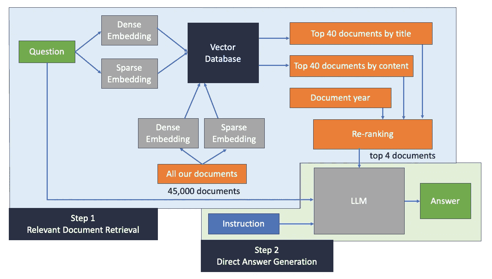
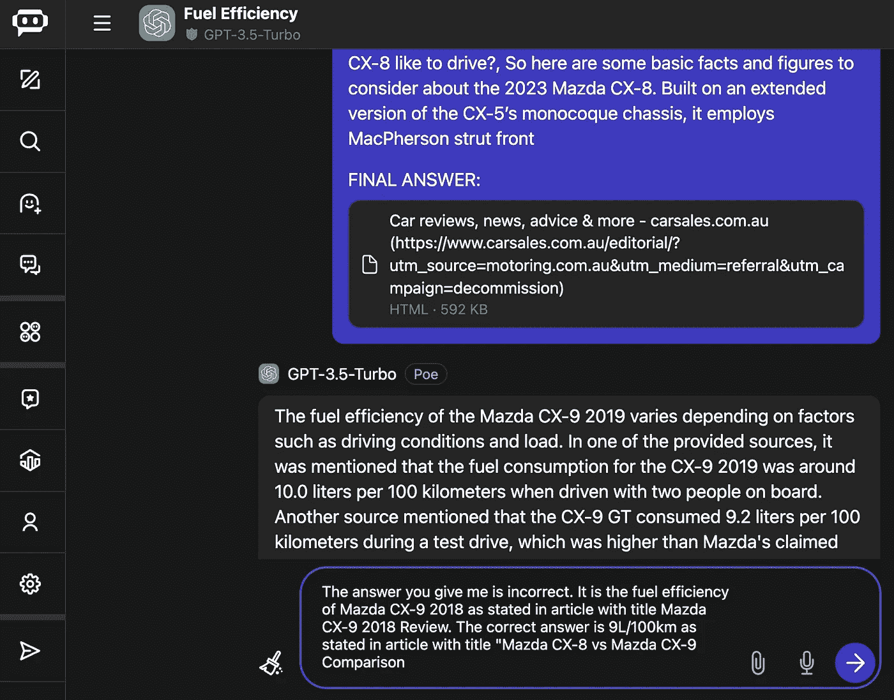

# 增强 RAG 的答案：自我调试技术和认知负荷减少

> 原文：[`towardsdatascience.com/enhancing-rags-answer-self-debugging-techniques-and-cognitive-load-reduction-8c4273013d39`](https://towardsdatascience.com/enhancing-rags-answer-self-debugging-techniques-and-cognitive-load-reduction-8c4273013d39)

## 要求 LLM 自我诊断并自我修正提示，以提高答案质量。

[](https://agustinus-nalwan.medium.com/?source=post_page-----8c4273013d39--------------------------------)[](https://towardsdatascience.com/?source=post_page-----8c4273013d39--------------------------------) [Agustinus Nalwan](https://agustinus-nalwan.medium.com/?source=post_page-----8c4273013d39--------------------------------)

·发表于 [Towards Data Science](https://towardsdatascience.com/?source=post_page-----8c4273013d39--------------------------------) ·阅读时间 22 分钟·2023 年 11 月 26 日

--


LLM 进行自我调试（图像由 MidJourney 生成）

检索增强生成（RAG）无疑是一种强大的工具，使用像 LangChain 或 LlamaIndex 这样的框架可以轻松构建。这样的集成便利性可能会让人觉得 RAG 是一种对于每个使用案例都容易构建的神奇解决方案。然而，在我们升级编辑文章搜索工具以提供语义更丰富的搜索结果和直接答案的过程中，我们发现基本的 RAG 设置存在不足，并遇到了许多挑战。构建一个用于演示的 RAG 既快速又简单，通常能在少量场景中产生足够令人印象深刻的结果。然而，实现生产就绪状态的最后阶段，即要求卓越质量的阶段，面临着重大挑战。特别是在处理包含成千上万篇领域特定文章的庞大知识库时，这种情况尤为明显，这种情况并不罕见。

我们对 RAG 的方法包括两个不同的步骤：

1.  相关文档检索 通过采用密集和稀疏嵌入的融合，我们从 Pinecone 数据库中提取相关的文档块，考虑内容和标题。这些文档块随后根据与标题、内容以及文档年龄的相关性重新排序。然后选择排名前四的文档：既作为潜在的搜索结果，也作为生成直接答案的文档上下文。值得注意的是，这种方法不同于常见的 RAG 设置，更有效地解决了我们独特的文档检索挑战。

1.  直接答案生成 在这里，问题、指令以及之前检索到的前四个文档片段（文档上下文）被输入到大型语言模型（LLM）中，以生成直接答案。



RAG 架构

我之前深入探讨了通过使用混合搜索和层次化文档排名技术来提升文档检索质量。在这篇博客中，我旨在分享关于优化和故障排除直接答案生成过程的见解。

# 确保高质量的文档检索

当输入低质量的文档上下文时，即使有一个高效的 LLM 进行直接答案生成也是徒劳的。例如，如果文档部分缺乏必要的信息来推导出某个问题的答案，那么 LLM 的有效性就会降低，无论模型的规模和认知能力如何。实现这一目标非常具有挑战性，因为它需要同时优化召回率和准确率。召回率对于避免忽略包含关键答案信息的文档片段至关重要，而准确率则对于减少传输的文档片段数量，专注于最相关的内容也很重要。这种考虑需要考虑到限制的上下文窗口大小和传输大量文档上下文的相关成本。因此，所选的 top-k 文档片段应代表最高质量。


LLM 扫描了文档以寻找高质量的内容（图像由 MidJourney 生成）。

因此，如果你发现生成的直接答案不令人满意，第一步应该是仔细审查你的文档检索过程。在我们的案例中，这占据了生成答案不准确的半数问题。检查完整的提示信息以确保在提示的文档上下文中存在必要的相关信息。如果缺失或不足，考虑使用[混合搜索、层次化文档排名或评分提升](https://medium.com/towards-data-science/the-untold-side-of-rag-addressing-its-challenges-in-domain-specific-searches-808956e3ecc8)等技术来改进你的文档检索策略。

在本博客的其余部分，我将向你介绍我用来提高直接回答质量的四种技术，以及我如何将这些技术融入我的提示中。请注意，我在博客中分享的提示可能会为简洁起见进行编辑，某些部分可能被省略，以突出讨论的相关方面，并避免使博客内容过于繁琐。此外，虽然我在整个博客中始终使用“2019 年马自达 CX-9 的燃油效率是多少？”作为示例，但重要的是要理解，我们的评估不仅限于这个问题。我们已使用类似问题的集合进行评估，以确保我们观察到的行为在大量评估样本中具有代表性。那么，我们开始吧。

# 清晰至关重要：在你的指令中要明确。

确保你给 LLM 的提示是明确且定义良好的至关重要。例如，如果你希望 LLM 在文档上下文中没有必要信息时避免生成答案，你必须明确指定这一点。以下是一个示例提示。

```py
You are a friendly chatbot who are required to respond to questions using 
details from excerpts taken from documents about cars. Do not source 
information from other than the document excerpts provided. If you don't know
the answer simply return nothing.
```

特别强调指令**“如果你不知道答案，就什么也不要返回。”** LLM 面临与界限相关的挑战，就像你高中时那个聪明但让人讨厌的朋友，总是举手回答老师的问题，无论他们对回答的信心如何。他们不确定提供一个错误答案（称为虚幻）的影响是否比完全不回答更糟。因此，通过包含这一指令，你在表达你的偏好。

此外，具体要求根据你的使用案例而异。对于我们的需求，我们期望 LLM 仅依赖于我们的知识库，这意味着它应该仅从提供的文档片段中的信息生成答案。所有 LLM 都在大量的互联网、书籍和其他媒介数据上进行过训练。尽管这些来源可能包含潜在的答案信息，但它们的可靠性和与我们知识库的一致性无法保证。因此，我们加入了额外的指令：**“不要从提供的文档摘录以外的地方获取信息。”**


LLM 正在仔细阅读提供的指令（图像由 MidJourney 生成）。

通过直接和精确的提示，你可以大大减少 LLM 产生毫无根据或“虚幻”答案的可能性。

# 让 LLM 自我诊断和自我修正。

没错！可以要求 LLM 识别并纠正自身错误。与传统算法相比，LLM 具有推理能力，这使得它能够执行多种任务，包括自我调试。


LLM 正在进行自我诊断（图像由 MidJourney 生成）。

例如，在我们的项目中，我们遇到了一个问题，查询“2019 年 Mazda CX-9 的燃油效率是多少？”时，LLM 生成了一个不准确的回答，声称“2019 年 Mazda CX-9 的燃油效率是 8.8L/100km。”经过仔细检查，我们确认确实提供了正确的文档上下文。相关信息包含在我们提示中的一篇标题为“2019 年 Mazda CX-8 与 Mazda CX-9 比较”的文章中。然而，不知为何，LLM 却从 2018 年 Mazda CX-9 的文章中提取了燃油效率信息。下面是我们的原始提示。

```py
You are a friendly chatbot who are required to respond to questions using 
details from excerpts taken from documents about cars. Do not source 
information from other than the document excerpts provided. If you don't know
the answer simply return nothing.
At the end of your answer please provide the source(s) of the article
you source the answer from in the following format.
SOURCE: 123-pl, 555-pl, etc.

QUESTION: what is mazda cx9 2019 fuel efficiency?

=========
EXTRACTED DOCUMENTS:

------------------------------
Source: 5466-pl
Title: Mazda CX-9 2018 Review
Content:
... Fuel use is a constant consideration, 
too, we’ve piled on thousands of kilometres, mostly with two people on board, 
and the reading still hovers around 10.0L/100km. Note: this latest 
consumption figure is marginally up on the two-wheel drive version 
of the CX-9, which clocked an average of 9.2L/100km according to both 
the trip computer and our own independent testing. Both are well up on 
their claims. 
------------------------------
Source: 6248-pl
Title: Mazda CX-8 v Mazda CX-9 2019 Comparison
Content:
... Which wins, and why? So, we’ve saved the fuel consumption 
figures till last. The Mazda CX-8 averaged 7.1L/100km for our tour from 
Adelaide, up to the Flinders Ranges and back again. The CX-9 averaged 
10.1L/100km. As both cars have a 74-litre fuel tank you’re going to 
get further between refuels in the CX-8, paying a little more for it at 
the bowser and pumping less CO2 into the atmosphere ...
------------------------------
...
```

使用 GPT3.5 turbo，它生成了以下不正确的回答（正确答案是 10.1L/100 km）。

```py
The fuel efficiency of the Mazda CX-9 2019 varies depending on factors 
such as driving conditions and load. In one of the provided sources, 
it was mentioned that the fuel consumption for the CX-9 2019 
was around 10.0 liters per 100 kilometers when driven with 
two people on board...

SOURCE: 5466-pl
```

当我使用 GPT4.0 测试相同的提示时，得到了正确的答案。

```py
The Mazda CX-9 2019 model's fuel efficiency is not explicitly listed 
in the provided documents, but the 2018 model has a consumption figure 
of around 10.0L/100km, and it is noted that this is marginally up on 
the two-wheel drive version which clocked an average of 9.2L/100km. 
The 2017 review of the Mazda CX-9 also indicated a consumption of 
9.2L/100km over 2500km, which is higher than Mazda's claimed 8.4L/100km. 
The 2019 comparison between the CX-8 and CX-9 suggests that the CX-9 
averaged 10.1L/100km. These figures could be considered roughly 
equivalent for the 2019 model, barring any major changes between 
the 2018 and 2019 models.
```

尽管如此，GPT4 在我们的使用案例中并不经济，因为它的成本是 GPT3.5 Turbo 的 10 倍。因此，这一挑战促使我们寻找与 GPT3.5 Turbo 兼容的解决方案，激发了自我调试的概念。

想象一下，让某人根据您提供的文档回答问题，而他们给出了错误的回应。您会采取什么步骤来了解错误发生的原因？**您可以通过展示正确答案和来源材料来简单地询问他们为什么犯错**。与 LLM 也是一样。我们询问 LLM，但为了有效地进行此操作，我们需要能够在 LLM 提供答案后继续与其对话。

通过使用如[www.poe.com](http://www.poe.com/)这样的平台，我们可以重现与 LLM 的交互。我们选择相同的 LLM 模型，将整个提示输入控制台。生成的输出与我们代码中遇到的精确错误答案相符。随后，我们与 LLM 进行对话，这在促进自我调试过程中是一个关键步骤，如下所述。



poe.com 网络界面

这是我与 LLM 的完整对话记录。

> 我：您给我的答案不正确。它是 2018 年 Mazda CX-9 的燃油效率，如文章标题“Mazda CX-9 2018 Review”所述。正确的答案是 10.1L/100km，如文章标题“Mazda CX-8 与 Mazda CX-9 2019 比较”所述。
> 
> LLM：我为这个错误道歉。您说得对，正确的信息确实在您提到的文章中提供了。
> 
> 我：没关系。你为什么犯了这个错误？
> 
> LLM：我没有意识到文章中引用的年份是汽车的型号年份。我以为这是文章的年份。

根据最后的回应，我现在已识别出 LLM 错误的原因。这激发了另一个想法：如果 LLM 可以理解并解释其误解，也许它还可以调整我的初始提示，以防未来重复同样的错误。这绝对值得一试！

> 我：我应该如何修改我的提示，以便下次你不会重复这个错误？
> 
> LLM：你可以具体说明文章标题/内容可能包含汽车型号年份，这应该与问题中询问的型号年份匹配。
> 
> 我：请你修改我的提示以包含你的建议吗？

在第二次请求时，LLM 向我提供了一个整合了建议改进的修订提示。

```py
You are a friendly chatbot who is required to respond to questions 
using details from excerpts taken from documents about cars. Do not 
source information from other than the document excerpts provided. 
If you don't know the answer, simply return nothing.
Please ensure that the article title/content might contain car 
model year information, which should match the model year asked 
in the question.

At the end of your answer, please provide the source(s) of the article 
you source the answer from in the following format.
SOURCE: 123-pl, 555-pl, etc.

QUESTION: What is Mazda CX9 2019 fuel efficiency?
```

尽管使用了这个调整后的提示，但观察到它仍然对我之前的问题产生了错误的回答，这让人感到相当沮丧。

```py
The 2019 Mazda CX-9's fuel efficiency is not mentioned in the provided 
documents. Therefore, I do not have information on the fuel efficiency 
of the 2019 Mazda CX-9 based on the excerpts available.
```

尽管如此，它还是给了我一些关于需要包含模型年份的信息的见解。因此，我决定手动修改提示，加入了推荐提到的模型年份。我甚至提供了一个简短的期望行为示例来指导 LLM。

**基于 LLM 建议的修订提示**

```py
You are a friendly chatbot who are required to respond to questions 
using details from excerpts taken from documents about cars of 
particular model years.
These documents may have information about the model year of car in 
review within its content or title. Eg. Volvo XC90 2018 Review, means 
the review is only for
 Volvo XC90 model year 2018\. If a user provides the model year in 
their question, ensure that your answer is sourced from an article 
from the corresponding model year.
 Eg. When the user is asking for "What is the safety feature of 
Volvo XC90 2019?", you should not use any information within the 
previous article as they are of different model year.
When the model year or the car make and model is not mentioned in 
this article content, you can assume it is the same as the make, 
model and model year as mentioned in the article title.
At the end of your answer please provide the source(s) of the 
article you source the answer from in the following format.
SOURCE: 123-pl, 555-pl, etc.

QUESTION: what is mazda cx9 2019 fuel efficiency?

=========
EXTRACTED DOCUMENTS:

------------------------------
Source: 5466-pl
Title: Mazda CX-9 2018 Review
Content:
... Fuel use is a constant consideration, 
too, we've piled on thousands of kilometres, mostly with two people on board, 
and the reading still hovers around 10.0L/100km. Note: this latest 
consumption figure is marginally up on the two-wheel drive version 
of the CX-9, which clocked an average of 9.2L/100km according to both 
the trip computer and our own independent testing. Both are well up on 
their claims. 
------------------------------
Source: 6248-pl
Title: Mazda CX-8 v Mazda CX-9 2019 Comparison
Content:
... Which wins, and why? So, we've saved the fuel consumption 
figures till last. The Mazda CX-8 averaged 7.1L/100km for our tour from 
Adelaide, up to the Flinders Ranges and back again. The CX-9 averaged 
10.1L/100km. As both cars have a 74-litre fuel tank you're going to 
get further between refuels in the CX-8, paying a little more for it at 
the bowser and pumping less CO2 into the atmosphere ...
------------------------------
...
```

新的提示现在给了我正确的答案！

```py
The fuel efficiency of the Mazda CX-9 for the 2019 model year can be 
found in the article titled "Mazda CX-8 v Mazda CX-9 2019 Comparison." 
According to the article, the Mazda CX-9 averaged 10.1L/100km in 
fuel consumption for their test. This figure provides information 
about the fuel efficiency of the Mazda CX-9 for the 2019 model year.

SOURCE: 6248-pl
```

然而，需要记住的是，这种方法可能不会始终产生积极的结果。我使用这种方法获得关于 LLM 解释为何犯错的见解的成功率约为 75%，而让 LLM 为我修改提示以产生正确答案的效果约为 25%。尽管如此，拥有这种方法总比没有方法要好。

# **意识到认知负荷。**

保持指示准确对于引导 LLM 产生期望的答案至关重要。然而，过于详细的提示可能会对像 GPT-3.5 Turbo 这样较小的 LLM 产生不利影响，因为它们的认知能力比 GPT-4 低。想知道为什么吗？让我们通过一个示例来演示这一点。


LLM 正在经历认知负荷（图像由 MidJourney 生成）。

我们最初使用 Langchain 模板构建的提示采用了一次性技术。例如，它包括了一个完整互动的单一示例，希望 LLM 能够更好地理解我们的意图。然而，当使用 GPT3.5 Turbo 时，我们观察到一次性提示比零次提示产生了更模糊的回答。

以下是我们基于[Langchain](https://www.langchain.com/)模板的一次性提示。提供的示例来自一个完全不同的领域（非汽车），提示是通用的，没有提及汽车相关的文章。

```py
Given the following extracted parts of a long document (with its source) 
and a question, create a final answer with references ("SOURCES"). 
If you don't know the answer, just say that you don't know. Don't try to 
make up an answer.
ALWAYS return a "SOURCES" part in your answer.

QUESTION: Which state/country's law governs the interpretation 
of the contract?

=========
Content: This Agreement is governed by English law and the parties 
submit to the exclusive jurisdiction of the English courts in  relation 
to any dispute (contractual or non-contractual)...
Source: 28-pl

Content: No Waiver. Failure or delay in exercising any right or remedy 
under this Agreement shall not constitute a waiver of such (or any other)  
right or remedy.
11.7 Severability.
Source: 30-pl

Content: (b) if Google believes, in good faith, that the Distributor 
has violated or caused Google to violate any Anti-Bribery Laws (as  
defined in Clause 8.5) or that such a violation is reasonably likely to 
occur,
Source: 4-pl

=========
FINAL ANSWER: This Agreement is governed by English law.
SOURCES: 28-pl

...

QUESTION: what is mazda cx9 2019 fuel efficiency?

=========
------------------------------
Title: Mazda CX-9 2018 Review
Content:
Fuel use is a constant consideration, too, we’ve piled on thousands of 
kilometres, mostly with two people on board, and the reading still hovers 
around 10.0L/100km. 
Note: this latest consumption figure is marginally up on the two-wheel 
drive version of the CX-9, which clocked an average of 9.2L/100km 
according to both the trip computer and our own independent testing. 
...

------------------------------
Title: Mazda CX-8 v Mazda CX-9 2019 Comparison
Content:
nomads. Which wins, and why? So, we’ve saved the fuel consumption figures 
till last. The Mazda CX-8 averaged 7.1L/100km for our tour from Adelaide, 
up to the Flinders Ranges and back again. The CX-9 averaged 10.1L/100km. 
As both cars have a 74-litre fuel tank you’re going to get further 
between refuels in the CX-8, paying a little more for it at the bowser 
and pumping less CO2 into the atmosphere. Health-affecting particulates? 
Well, that’s another story.
...

FINAL ANSWER:
```

给出的回答极其不清晰，提到了不同车型年份的马自达 CX-9 的燃油效率。

```py
The fuel efficiency of the 2019 Mazda CX-9 varies depending on driving 
conditions and other factors. According to available information:
In one source, it is mentioned that the trip computer indicated fuel 
consumption of 9.2L/100km in 2500km worth of driving, which is 
considerably higher than Mazda's claimed 8.4L/100km for the CX-9\. 
This figure was achieved with one or two people in the car, not a 
full family and their belongings. However, further testing and simulations 
were mentioned to corroborate fuel consumption.

In another source comparing the Mazda CX-8 and CX-9, it is stated that 
the CX-8 averaged 7.1L/100km on a specific tour, while the CX-9 
averaged 10.1L/100km. These figures indicate that the CX-8 is more 
fuel-efficient than the CX-9 in this particular comparison.

In a different source discussing the 2023 Mazda CX-8, the official 
combined fuel consumption claim for the CX-8 Touring Active is 6.0L/100km, 
achieved with the assistance of the i-Stop function. However, during a 
test drive on open roads with one passenger and little luggage, the 
Touring Active averaged 8.6L/100km.

So, the fuel efficiency of the 2019 Mazda CX-9 may vary depending 
on driving conditions and the specific model/configuration. It's 
recommended to refer to the official manufacturer's specifications 
and conduct real-world testing to determine the exact fuel efficiency 
of a specific CX-9 model.
```

初始提示的模糊性质，加上一个无关的单次示例，可能部分地导致了这个问题。为验证这个理论，我制定了一个更具针对性的提示，其中包含了特定领域的指令和一个与我们实际用例紧密相关的示例。以下是这个新提示的详细信息，这将有助于确定它是否能带来显著的差异。

```py
You are a friendly chatbot who are required to respond to questions 
using details from excerpts taken from documents about cars of 
particular model years.
These documents may have information about the model year of car in 
review within its content or title. Eg. Volvo XC90 2018 Review, means 
the review is only for
 Volvo XC90 model year 2018\. If a user provides the model year in 
their question, ensure that your answer is sourced from an article 
from the corresponding model year.
 Eg. When the user is asking for "What is the safety feature of 
Volvo XC90 2019?", you should not use any information within the 
previous article as they are of different model year.
When the model year or the car make and model is not mentioned in 
this article content, you can assume it is the same as the make, 
model and model year as mentioned in the article title.
At the end of your answer please provide the source(s) of the 
article you source the answer from in the following format.
SOURCE: 123-pl, 555-pl, etc.

QUESTION: What is Volvo XC90 2020 fuel efficiency?
=========

EXTRACTED DOCUMENTS:

------------------------------
Source: 22858-pl
Title: Volvo XC90 2020 Review
Content:
costs) Engine: 2.0-litre four-cylinder turbocharged and supercharged 
petrol Output: 246kW/440Nm Transmission: Eight-speed automatic 
Fuel: 8.5L/100km (ADR Combined) CO2: 199g/km (ADR Combined) ... 
------------------------------
Source: 22855-pl
Title: Volvo XC90 2020 Review
Content:
The brakes also need a hefty prod for downhill corners. All that weight 
impacts fuel consumption. Volvo claims an 8.5L/100km average, but we 
consumed premium unleaded at a rate of 11.8L/100km during our test ...
------------------------------
Source: 23987-pl
Title: Volvo XC90 T6 R-Design 2019 Review
Content:
the engine’s progress: there is minimal turbo lag and the gearbox is 
such that the four-pot transitions cleanly out of corners and 
intersections, slickly picking up a new gear. Fuel consumption is 
something of a misnomer, however. The claim reads 8.5L/100 but 
in reality we used 9.4L/100km with quite a bit of highway driving ...
------------------------------
...

===========
FINAL ANSWER: The fuel efficiency of the volvo xc90 2020 is 8.5l/100km 
(adr combined). this information is based on the review of the 
Volvo XC90 2020.
SOURCES: 22858-pl

QUESTION: what is mazda cx9 2019 fuel efficiency?
=========
EXTRACTED DOCUMENTS:

------------------------------
Source: 5466-pl
Title: Mazda CX-9 2018 Review
Content:
Fuel use is a constant consideration, too, we’ve piled on thousands 
of kilometres, mostly with two people on board, and the reading still 
hovers around 10.0L/100km. Note: this latest consumption figure is 
marginally up on the two-wheel drive version of the CX-9, which clocked an 
average of 9.2L/100km according to both the trip computer and our own 
independent testing ...
------------------------------
Source: 6248-pl
Title: Mazda CX-8 v Mazda CX-9 2019 Comparison
Content:
Which wins, and why? So, we’ve saved the fuel consumption 
figures till last. The Mazda CX-8 averaged 7.1L/100km for our tour 
from Adelaide, up to the Flinders Ranges and back again. The CX-9 
averaged 10.1L/100km. As both cars have a 74-litre fuel tank you’re 
going to get further between refuels in the CX-8, paying a little 
more for it at the bowser and pumping less CO2 into the atmosphere ... 
------------------------------
...

===========
FINAL ANSWER: 
```

提供的回答仍然不准确。它还声称没有必要的信息来回答问题，这也是不准确的。

```py
The fuel efficiency of the Mazda CX-9 in the year 2019 is not available 
in the provided documents. The information in the documents pertains to 
the Mazda CX-9 in 2017 and earlier years. Therefore, I cannot provide 
the fuel efficiency for the Mazda CX-9 in 2019 based on the provided 
documents.

SOURCES: 5466-pl, 4900-pl, 6248-pl, 168-pl
```

通过省略示例并选择零次提示方法，我们成功地使 LLM 生成了正确的答案。

```py
You are a friendly chatbot who are required to respond to questions 
using details from excerpts taken from documents about cars of 
particular model years.
These documents may have information about the model year of car in 
review within its content or title. Eg. Volvo XC90 2018 Review, means 
the review is only for
 Volvo XC90 model year 2018\. If a user provides the model year in 
their question, ensure that your answer is sourced from an article 
from the corresponding model year.
 Eg. When the user is asking for "What is the safety feature of 
Volvo XC90 2019?", you should not use any information within the 
previous article as they are of different model year.
When the model year or the car make and model is not mentioned in 
this article content, you can assume it is the same as the make, 
model and model year as mentioned in the article title.
At the end of your answer please provide the source(s) of the 
article you source the answer from in the following format.
SOURCE: 123-pl, 555-pl, etc.

QUESTION: what is mazda cx9 2019 fuel efficiency?
=========
EXTRACTED DOCUMENTS:

------------------------------
Source: 5466-pl
Title: Mazda CX-9 2018 Review
Content:
Fuel use is a constant consideration, too, we’ve piled on thousands 
of kilometres, mostly with two people on board, and the reading still 
hovers around 10.0L/100km. Note: this latest consumption figure is 
marginally up on the two-wheel drive version of the CX-9, which clocked an 
average of 9.2L/100km according to both the trip computer and our own 
independent testing ...
------------------------------
Source: 6248-pl
Title: Mazda CX-8 v Mazda CX-9 2019 Comparison
Content:
Which wins, and why? So, we’ve saved the fuel consumption 
figures till last. The Mazda CX-8 averaged 7.1L/100km for our tour 
from Adelaide, up to the Flinders Ranges and back again. The CX-9 
averaged 10.1L/100km. As both cars have a 74-litre fuel tank you’re 
going to get further between refuels in the CX-8, paying a little 
more for it at the bowser and pumping less CO2 into the atmosphere ... 
------------------------------
...

===========
FINAL ANSWER:
```

```py
The fuel efficiency of the Mazda CX-9 for the 2019 model year can be 
found in the article titled "Mazda CX-8 v Mazda CX-9 2019 Comparison." 
According to the article, the Mazda CX-9 averaged 10.1L/100km in 
fuel consumption for their test. This figure provides information 
about the fuel efficiency of the Mazda CX-9 for the 2019 model year.

SOURCE: 6248-pl
```

为进一步验证问题是否源于认知过载，我们使用 GPT-4 进行了单次提示测试，结果如预期地得到了正确的回答。

```py
The fuel efficiency of the Mazda CX-9 2019 is not directly stated in 
the documents provided. However, the closest information from a 2019 
comparison mentions that the CX-9 averaged 10.1L/100km during a test. 
It's important to note that actual fuel efficiency can vary based on 
driving conditions, habits, and vehicle maintenance.

SOURCE: 6248-pl
```

为了验证我们的假设，我们对其他语言模型，如 Claude Instant 和 Claude 2，进行了类似的测试，结果显示了相同的模式。Claude 2 成功处理了我们的单次提示，提供了正确的答案，而 Claude Instant 则没有。Claude 2 和 GPT-4 具有相似的认知能力，均优于 Claude Instant 和 GPT-3.5 Turbo。这支持了我们的理论，即认知能力较低的模型在处理复杂指令时会遇到困难。我对这些结果感到非常满意，因为零次提示法可以使提示更简洁，从而降低成本，并且它适用于像 GPT-3.5 Turbo 或 Claude Instant 这样的较便宜、更小的模型。

# **要求提供证明。**

要求语言模型提供其生成答案的来源是一种非常有效的策略，能够减少幻觉并防止幻觉，特别是当相关信息不在提供的文档上下文中时。


LLM 正在追踪源材料的来源（图像由 MidJourney 生成）。

实现这个目标可以通过使用不同的提示来引导语言模型。一个策略是指导 LLM 识别出影响其响应的文档上下文的特定部分。加入一个命令，要求 LLM 在回答中引用文档源 ID，可以让你忽略没有源 ID 或源 ID 错误的回应。虽然不常见，但 LLM 可能会引用你文档块中未包含的外部来源，例如它在训练期间接触到的网站。

```py
At the end of your answer please provide the source(s) of the 
article you source the answer from in the following format.
SOURCE: 123-pl, 555-pl, etc.
```

另一种策略是指导 LLM 通过明确引用回答问题的文档块中的句子来回应。

```py
Please answer by quoting the exact sentence(s) within the provided 
document excerpts..
At the end of your answer please provide the source(s) of the 
article you source the answer from in the following format.
SOURCE: 123-pl, 555-pl, etc.
```

这种方法可能对 LLM 施加额外的约束，并不总是实用，就像我们文档的情况一样。我们的文档经常缺乏明确回应常见问题的句子。因此，LLM 没有特定的句子可供引用，这导致没有回应。如果我们允许 LLM 使用文档中嵌入的知识来构造自己的句子，它将能够提供答案。

# **结论**

使用语言模型（LLM）构建应用程序与使用传统算法截然不同。传统算法中，详细的指令使你完全控制过程，调试涉及观察变量值，确保这些指令是正确的。相比之下，使用 LLM 就像是雇用一个人来在你的软件中执行这些过程。由于 LLM 的反应类似于人类，故障排除和调试需要类似于确定一个人可能犯错的技术，主要通过提问。

尽管语言模型（LLM）技术仍在发展中，且可能出现错误和不准确，但它显示出了相当大的潜力，并且有有效的策略可以大大减轻这些问题。鉴于 LLM 技术的快速发展以及不断创新的方法和工具，关于这一领域在不久的将来可能带来的变革前景，充满了强烈的兴奋感。

我们即将部署我们的 RAG 设置用于生产，并且在我们继续学习的过程中，我期待在即将发布的博客中分享更多见解。

如果你发现这篇文章有趣且有帮助，我将感激你用 20 次鼓掌来支持我。我也渴望从你的见解和经验中学习，所以欢迎通过回复分享你的想法。此外，如果你有兴趣，我欢迎你在 [LinkedIn](https://www.linkedin.com/in/agustinus-nalwan/) 上与我联系。

最后，我想向 Carsales.com 的杰出团队表达我的感谢，感谢他们在这一旅程中的支持。
