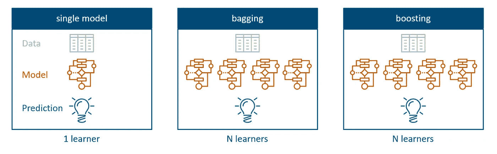
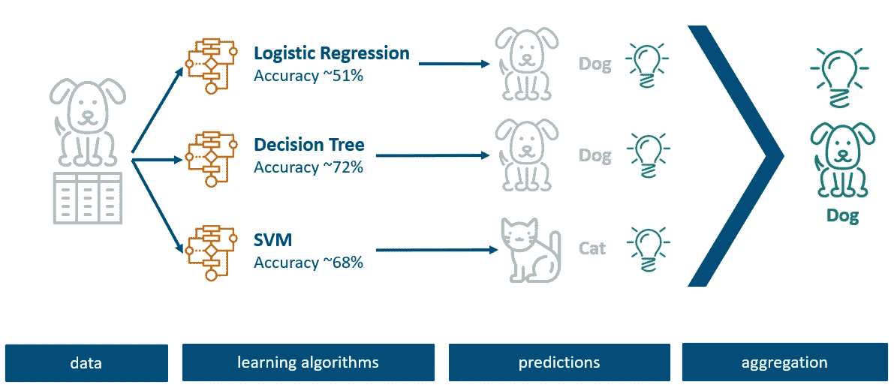
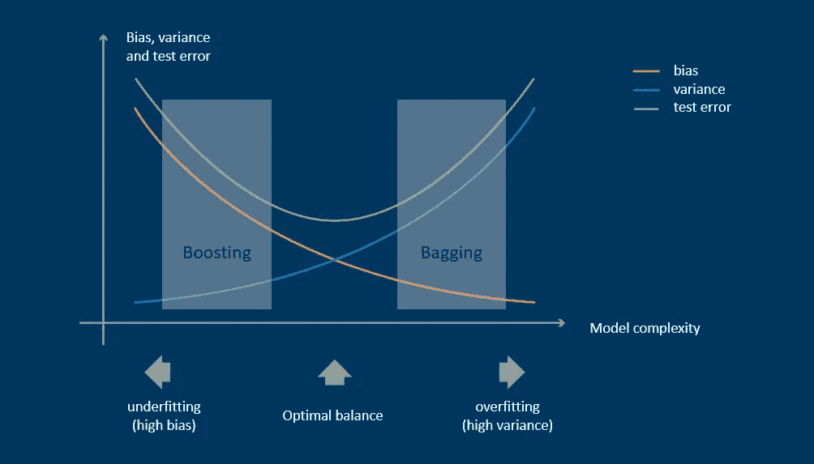
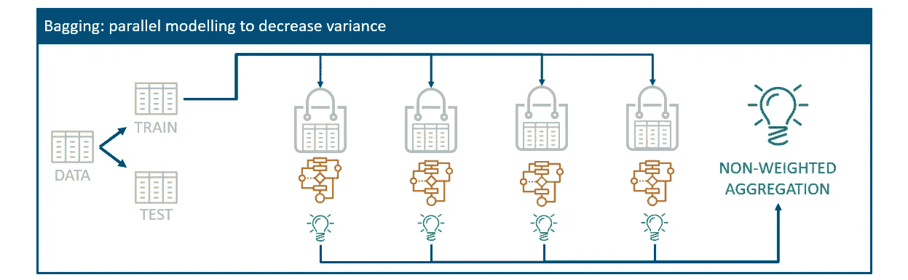
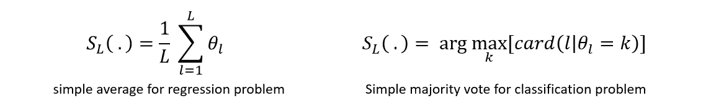
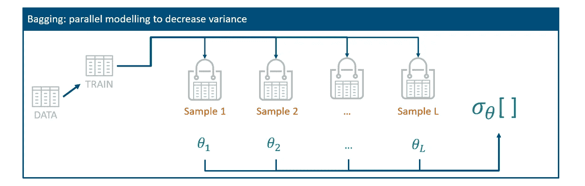
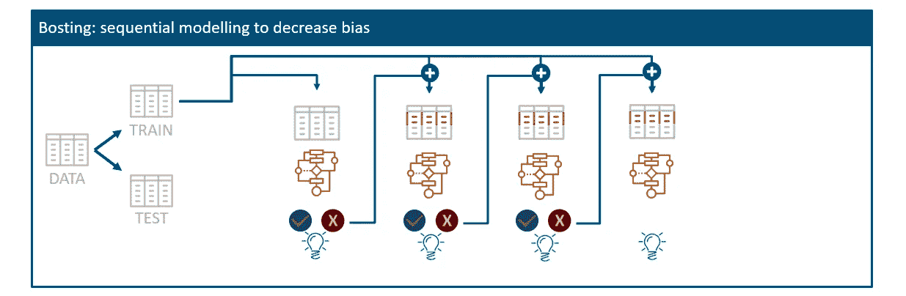
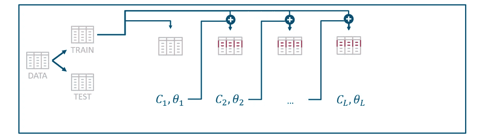
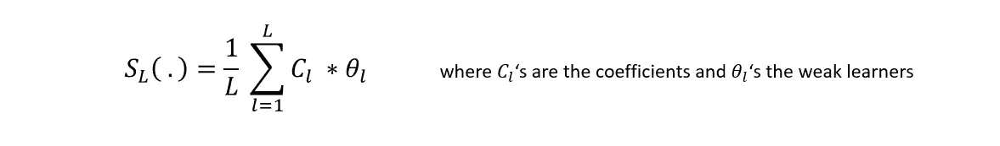

# 集成学习：袋装和提升

> 原文：[`towardsdatascience.com/ensemble-learning-bagging-and-boosting-23f9336d3cb0?source=collection_archive---------0-----------------------#2023-02-23`](https://towardsdatascience.com/ensemble-learning-bagging-and-boosting-23f9336d3cb0?source=collection_archive---------0-----------------------#2023-02-23)

[](https://medium.com/@jonas_dieckmann?source=post_page-----23f9336d3cb0--------------------------------)[](https://towardsdatascience.com/?source=post_page-----23f9336d3cb0--------------------------------) [Jonas Dieckmann](https://medium.com/@jonas_dieckmann?source=post_page-----23f9336d3cb0--------------------------------)

·

[关注](https://medium.com/m/signin?actionUrl=https%3A%2F%2Fmedium.com%2F_%2Fsubscribe%2Fuser%2F1c8d1cf684f2&operation=register&redirect=https%3A%2F%2Ftowardsdatascience.com%2Fensemble-learning-bagging-and-boosting-23f9336d3cb0&user=Jonas+Dieckmann&userId=1c8d1cf684f2&source=post_page-1c8d1cf684f2----23f9336d3cb0---------------------post_header-----------) 发表在 [Towards Data Science](https://towardsdatascience.com/?source=post_page-----23f9336d3cb0--------------------------------) ·11 分钟阅读·2023 年 2 月 23 日[](https://medium.com/m/signin?actionUrl=https%3A%2F%2Fmedium.com%2F_%2Fvote%2Ftowards-data-science%2F23f9336d3cb0&operation=register&redirect=https%3A%2F%2Ftowardsdatascience.com%2Fensemble-learning-bagging-and-boosting-23f9336d3cb0&user=Jonas+Dieckmann&userId=1c8d1cf684f2&source=-----23f9336d3cb0---------------------clap_footer-----------)

--

[](https://medium.com/m/signin?actionUrl=https%3A%2F%2Fmedium.com%2F_%2Fbookmark%2Fp%2F23f9336d3cb0&operation=register&redirect=https%3A%2F%2Ftowardsdatascience.com%2Fensemble-learning-bagging-and-boosting-23f9336d3cb0&source=-----23f9336d3cb0---------------------bookmark_footer-----------)

你想把你的数据科学技能提升到一个新水平吗？你是否希望提高模型的准确性，并基于数据做出更明智的决策？那么是时候探索袋装和提升的世界了。运用这些强大的技术，你可以提升模型的性能，减少错误，并做出更准确的预测。


图片由 [Unsplash](https://unsplash.com/) 提供

无论你是在处理分类问题、回归分析，还是其他数据科学项目，bagging 和 boosting 算法都可以发挥关键作用。在本文中，我们#1 **总结了集成学习的主要思想**，介绍了#2 **bagging**和#3 **boosting**，然后#4 **对比了这两种方法**，以突出相似性和差异。

所以，让我们准备好 bagging 和 boosting 取得成功吧！

# #1：介绍和主要思想：集成学习

那我们什么时候应该使用它呢？显然，当我们看到模型的过拟合或欠拟合时。让我们从 bagging 和 boosting 的关键概念开始，这两者都属于集成学习技术的范畴：



作者提供的图片

集成学习的主要思想是使用多个算法和模型一起完成相同的任务。虽然单一模型仅使用一个算法来创建预测模型，但 bagging 和 boosting 方法旨在结合多个算法，以实现比单独学习更高一致性的更好预测。

## **示例：图像分类**

本质概念通过涉及图像分类的教学插图来概括。假设有一组图像，每张图像都附有一个类别标签，表示动物的种类，用于训练模型。在传统建模方法中，我们会尝试几种技术并计算准确性，以选择一种优于其他的技术。假设我们在这里使用逻辑回归、决策树和支持向量机，这些模型在给定的数据集上表现不同。



作者提供的图片

在上述示例中，我们观察到逻辑回归和决策树模型将特定记录预测为狗，而支持向量机将其识别为猫。由于各种模型对特定记录有各自的优缺点，集成学习的关键思想是结合这三种模型，而不是选择表现出最高准确度的单一方法。

这个过程称为*聚合*或*投票*，它结合了所有基础模型的预测，以得出一个被认为比任何单独模型更精确的预测。

## **偏差-方差权衡**

下一个图表可能对你们中的一些人来说很熟悉，但它很好地表示了测试误差率上偏差和方差之间的关系和权衡。

你可能对以下概念很熟悉，但我认为它有效地说明了偏差和方差与测试误差率之间的相关性和权衡。



作者提供的图片

模型的方差与偏差之间的关系是方差的减少会导致偏差的增加，反之亦然。为了实现最佳性能，模型必须处于一个平衡点，在这个点上测试错误率最小化，同时方差和偏差得到适当平衡。

集成学习可以帮助将这两种极端情况平衡到更稳定的预测中。一种方法叫做袋装（bagging），另一种方法叫做提升（boosting）。

# #2：袋装（自助聚合）


一个随机的袋子。图片来源于[Unsplash](https://unsplash.com/)

让我们首先关注一种叫做自助聚合的袋装技术。自助聚合旨在通过**减少模型的方差**来解决前一个图表中的右侧极端问题，以避免过拟合。



作者提供的图片

目的在于拥有多个相同学习算法的模型，这些模型通过原始训练数据的随机子集进行训练。这些随机子集称为袋子，可以包含数据的任何组合。每个数据集都用于拟合一个独立的模型，该模型对给定数据产生独立的预测。然后将这些预测聚合成一个最终分类器。这种方法的想法实际上非常接近我们最初的玩具示例中的猫和狗。

通过使用随机数据子集，过拟合的风险被减少和通过对子模型结果进行平均来平滑。所有模型并行计算，然后在之后进行聚合。



最终的集成聚合计算使用简单平均（用于回归问题）或简单多数投票（用于分类问题）。为此，每个随机样本中的每个模型都会为该特定子集产生一个预测。对于平均值，这些预测只是相加然后除以创建的袋子数量。



作者提供的图片

简单多数投票的工作原理类似，但使用预测的类别而不是数值。算法确定预测最多的类别，并假设多数就是最终的聚合结果。这再次非常类似于我们的玩具示例，其中三种算法中的两种预测图片为狗，因此最终聚合结果也是狗的预测。

> **随机森林**
> 
> 对于袋装方法，一个著名的扩展是随机森林算法，它利用了袋装的思想，但也使用特征的子集，而不仅仅是条目的子集。另一方面，袋装方法会考虑所有给定的特征。

## 袋装的代码示例

接下来，我们将探讨一些来自`sklearn.ensemble`库的有用 python 函数。名为`BaggingClassifier`的函数有一些参数，可以在文档中查阅，但最重要的参数是*base_estimator*、*n_estimators*和*max_samples*。

```py
from sklearn.ensemble import BaggingClassifier 

# define base estimator 
est = LogisticRegression() # or est = SVC() or est = DecisionTreeClassifier

# n_estimators defines the number of base estimators in the ensemble 
# max_samples defines number of samples to draw from X to train each base estimator 

bag_model = BaggingClassifier(base_estimator= est, n_estimators = 10, max_samples=1.0) 

bag_model = bag_model.fit(X_train, y_train) 

Prediction = bag_model.predict(X_test)
```

+   *base_estimator:* 你需要在第一个参数中提供随机子集在袋装过程中应该使用的基础算法。例如，这可以是逻辑回归、支持向量分类、决策树或更多其他算法。

+   *n_estimators:* 估计器的数量定义了你希望在这里创建多少个袋，默认值为 10。

+   *max_samples:* 最大样本数定义了从 X 中抽取多少样本来训练每个基础估计器。默认值为 1.0，意味着应该使用所有现有条目。你也可以通过将其设置为 0.8 来表示只使用 80%的条目。

设置场景后，该模型对象的工作方式类似于许多其他模型，可以使用`fit()`过程进行训练，包括来自训练集的 X 和 y 数据。对测试数据的相应预测可以使用`predict()`完成。

# #3: 提升


提升你的模型！图片来自 [Unsplash](https://unsplash.com/)

提升是袋装算法的一种小变体，使用序列处理而不是并行计算。袋装旨在减少模型的方差，而提升方法则旨在**减少偏差**以避免数据的欠拟合。基于这个理念，提升还使用数据的随机子集来创建一个平均性能的模型。



图片由作者提供

为此，它使用弱模型的错误分类条目以及一些其他随机数据来创建一个新模型。因此，不同的模型不是随机选择的，而是主要受到前一个模型错误分类条目的影响。这种技术的步骤如下：

1.  **训练初始（弱）模型**

    你创建一个数据子集并训练一个弱学习模型，此时假设它是最终集成模型。然后，你分析给定训练数据集上的结果，并可以识别那些被错误分类的条目。

1.  **更新权重并训练新模型** 你创建一个原始训练数据的新随机子集，但对那些错误分类的条目赋予更高的权重。然后使用这个数据集来训练新模型。

1.  **将新模型与集成模型进行汇总**

    下一个模型应该在更难的条目上表现更好，并将与之前的模型合并（汇总）成新的最终集成模型。

从本质上讲，我们可以多次重复这个过程，并不断更新集成模型，直到我们的预测能力足够好。这里的关键思想显然是创建能够预测更困难数据条目的模型。这可以导致模型更好地拟合数据，并减少偏差。



图片作者

与 Bagging 相比，这种技术使用基于模型系数的加权投票或加权平均，这些模型与它们的预测一起考虑。因此，这种模型可以减少欠拟合，但有时也可能会过拟合。



## Boosting 的代码示例

接下来，我们将查看一个类似的代码示例，但用于 boosting。显然，存在多种 boosting 算法。除了`GradientDescent`方法外，`AdaBoost`是最受欢迎的之一。

+   *base_estimator:* 类似于 Bagging，你需要定义希望使用的基础算法。

+   *n_estimators:* 估计量的数量定义了 Boosting 终止的最大迭代次数。它被称为“最大”数量，因为如果算法在更早时达到良好性能，它会自行停止。

+   *learning_rate:* 最后，学习率控制新模型对之前模型的贡献程度。通常，迭代次数与学习率的值之间存在权衡。换句话说，当学习率较小的时候，你应该考虑更多的估计量，以便基础模型（弱分类器）继续改进。

```py
from sklearn.ensemble import AdaBoostClassifier

# define base estimator (requires support for sample weighting)
est = LogisticRegression() # or est = SVC() or est = DecisionTreeClassifier ….

# n_estimators defines maximum number of estimators at which boosting is terminated
# learning_rate defines the weight applied to each classifier at each boosting iteration
boost_model = AdaBoostClassifier(base_estimator= est, n_estimators = 10, learning_rate=1)

boost_model = boost_model.fit(X_train, y_train)

Prediction = boost_model.predict(X_test)
```

`fit()`和`predict()`方法的工作方式与之前的 bagging 示例类似。正如你所见，使用现有库中的这些函数非常简单。不过，你也可以实现自己的算法来构建这两种技术。

# #4: 结论：差异与相似性


图片来源：[Unsplash](https://unsplash.com/)

由于我们简要了解了 bagging 和 boosting 的工作原理，现在我想将重点放在对比这两种方法。

## 相似性

+   **集成方法**

    从一般的角度来看，这两种技术的相似性始于它们都是集成方法，旨在通过多个学习器来改善单一模型的结果。

+   **多个样本与聚合**

    为了实现这一目标，这两种方法都会生成随机样本和多个训练数据集。Bagging 和 Boosting 的相似之处在于，它们都通过对基础模型进行聚合来得出最终决策：要么通过计算平均结果，要么通过投票排名。

+   **目的**

    最终，两者的目标都是为了提高数据的稳定性和预测能力。

## 差异

+   **数据划分 |** 整体数据与偏差

    由于 bagging 在所有模型中独立地使用训练数据的随机包，而 boosting 对误分类数据给予更高的重要性。因此，这里的数据划分不同。

+   **模型 |** 独立 vs. 序列

    Bagging 创建独立的模型并将其聚合在一起。然而，boosting 会用新的模型按顺序更新现有模型。因此，模型会受到之前构建的影响。

+   **目标 |** 方差与偏差另一个区别是，bagging 旨在减少方差，而 boosting 尝试减少偏差。因此，bagging 有助于减少过拟合，而 boosting 可以减少欠拟合。

+   **函数 |** 加权与非加权

    最终预测结果的函数在 bagging 技术中使用等权重平均或等权重投票汇聚。Boosting 使用加权多数投票或加权平均函数，对训练数据表现更好的部分赋予更多权重。

## 含义

研究表明，两种方法的主要思想是结合多个模型以实现比单一学习模型更好的预测。然而，并没有*绝对优于对方的说法*来选择 bagging 还是 boosting，因为两者都有优点和缺点。

虽然 bagging 减少了方差并减少了过拟合，但它很少能产生更好的偏差。另一方面，boosting 减少了偏差，但可能比 bagged 模型更过拟合。

回到方差-偏差权衡图，我尝试可视化每种方法看起来合适的极端情况。然而，这并不意味着它们能在没有任何缺点的情况下实现结果。目标应该始终是保持偏差和方差在合理的平衡中。

Bagging 和 boosting 都使用所有给定特征，仅随机选择条目。另一方面，随机森林是对 bagging 的扩展，也创建特征的随机子集。因此，随机森林在实践中比 bagging 使用得更频繁。

[](https://medium.com/@jonas_dieckmann?source=post_page-----23f9336d3cb0--------------------------------) [## Jonas Dieckmann - Medium

### 阅读 Jonas Dieckmann 在 Medium 上的文章。分析经理 & 产品负责人 @ Philips | 热情并撰写关于……

medium.com](https://medium.com/@jonas_dieckmann?source=post_page-----23f9336d3cb0--------------------------------)

希望你觉得这有用。请告诉我你的想法！也欢迎在 LinkedIn 上与我联系，链接为 [`www.linkedin.com/in/jonas-dieckmann/`](https://www.linkedin.com/in/jonas-dieckmann/) 或在 medium 上关注我。

# 另请参见我其他的一些文章：

[](/introduction-to-ica-independent-component-analysis-b2c3c4720cd9?source=post_page-----23f9336d3cb0--------------------------------) ## ICA 介绍：独立成分分析

### 你是否曾遇到过尝试分析复杂且高度相关的数据集的情况……

towardsdatascience.com [](/how-to-set-started-with-tensorflow-using-keras-api-and-google-colab-5421e5e4ef56?source=post_page-----23f9336d3cb0--------------------------------) ## 如何使用 Keras API 和 Google Colab 开始使用 TensorFlow

### 分步教程分析人类活动与神经网络

towardsdatascience.com

# 参考文献

[1]: Bühlmann, Peter. (2012). Bagging、Boosting 与集成方法。计算统计学手册. 10.1007/978–3–642–21551–3_33.

[2]: Machova, Kristina & Puszta, Miroslav & Barcák, Frantisek & Bednár, Peter. (2006). 使用决策树分类器对 Bagging 和 Boosting 方法的比较。计算机科学与信息系统. 3. 57–72. 10.2298/CSIS0602057M.

[3]: Banerjee, Prashant. Bagging 与 Boosting @kaggle: [`www.kaggle.com/prashant111/bagging-vs-boosting`](https://www.kaggle.com/prashant111/bagging-vs-boosting)
