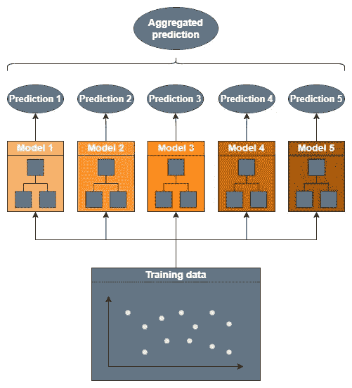
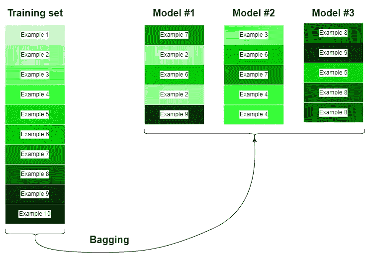
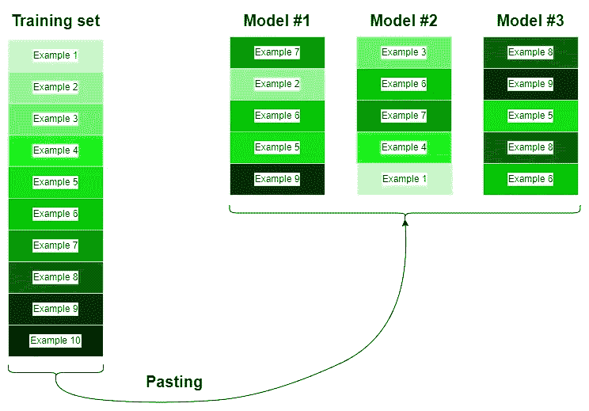
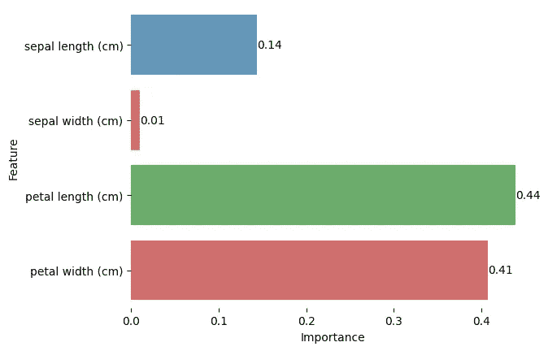

# 使用 Scikit-Learn 进行集成学习：友好的介绍

> 原文：[`towardsdatascience.com/ensemble-learning-with-scikit-learn-a-friendly-introduction-5dd64650de6c`](https://towardsdatascience.com/ensemble-learning-with-scikit-learn-a-friendly-introduction-5dd64650de6c)

## 像 XGBoost 或随机森林这样的集成学习算法是 Kaggle 比赛中的顶尖模型之一。它们是如何工作的？

 [Riccardo Andreoni](https://medium.com/@riccardo.andreoni?source=post_page-----5dd64650de6c--------------------------------)

·发布于 [Towards Data Science](https://towardsdatascience.com/?source=post_page-----5dd64650de6c--------------------------------) ·阅读时长 7 分钟·2023 年 9 月 9 日

--

来源：[unsplash.com](https://unsplash.com/photos/0u_vbeOkMpk)

基础学习算法如逻辑回归或线性回归通常过于简单，无法为机器学习问题提供足够的结果。虽然使用神经网络可能是一种解决方案，但它们需要大量的训练数据，这种数据很少有。集成学习技术可以在数据量有限的情况下提升简单模型的性能。

想象一下，让一个人猜测一个大罐子里有多少颗糖豆。一个人的答案不太可能是准确的估计数字。相反，如果我们问一千个人同样的问题，平均答案可能会接近实际数字。这种现象被称为[*集体智慧*](https://en.wikipedia.org/wiki/Wisdom_of_the_crowd)[1]。在处理复杂的估计任务时，集体往往比个体更为精准。

集成学习算法利用这一简单原理，通过聚合一组模型（如回归模型或分类器）的预测来提升性能。对于分类器的聚合，集成模型可以简单地选择低级分类器预测中最常见的类别。相反，对于回归任务，集成模型可以使用所有预测的均值或中位数。

图片来源于作者。

通过集成大量的弱学习者，即那些仅比随机猜测略好一点的分类器或回归器，我们可以取得难以想象的结果。考虑一个二分类任务。通过集成 1000 个独立的分类器，每个分类器的准确率为 51%，我们可以创建一个准确率为 75% 的集成模型 [2]。

这就是为什么集成算法在许多机器学习竞赛中常常获胜的原因！

现有几种技术可以构建集成学习算法。主要有 bagging、boosting 和 stacking。以下部分我将简要描述每一种原理，并介绍实现这些原理的机器学习算法。

# Bagging

形成集成算法的第一种技术称为 bagging，它是*bootstrap aggregating*的缩写。核心思想是为每个弱学习者提供一个略有不同的训练集。这是通过随机抽样原始训练集来完成的。

如果采样是有放回的，这种技术称为*bagging*，否则如果采样是没有放回的，这种技术则被称为*pasting*。

bagging（套袋）和 pasting（粘贴）的关键思想是尽可能创建多样化的弱学习者，这通过使用随机生成的训练集来完成。由于采样是有放回的，bagging 引入了比 pasting 略多的多样性，因此通常更受青睐。

让我们通过一个例子来看看 bagging 的工作原理。假设原始训练集包含 10 个示例，我们想要构建一个由 3 个不同的弱学习者组成的集成。此外，我们希望在原始训练集的一个维度为 5 的子集上训练每个学习者。以下图片展示了训练集的可能划分方式：

图片由作者提供。

而 pasting 不允许在模型的训练子集中重复相同的训练示例：

图片由作者提供。

## 随机森林

最常见的 bagging 模型是*随机森林*。随机森林是决策树的集成，每棵树都在一个略有不同的训练集上训练。

对于随机森林中每棵决策树的每个节点，算法会随机选择特征来搜索最佳的分裂点。换句话说，算法不会在所有特征中寻找最佳的分裂点，而是在一部分可用特征中寻找最佳的分裂点。这就是“随机”一词的解释。

以下代码片段展示了如何在一些训练数据上创建和拟合一个随机森林分类器。

一些属性非常重要，我建议通过网格搜索方法对其进行调优。**n_estimators**定义了弱学习器的数量，**max_features**是每次分裂时考虑的特征数量，**max_depth**是树的最大深度。这些超参数在正则化中起着基础性作用。增加**n_estimators**和**min_sample_leaf**或减少**max_features**和**max_depth**有助于创建尽可能多样化的树，从而避免过拟合。

对于所有其他属性，请查看全面的[文档](https://scikit-learn.org/stable/modules/generated/sklearn.ensemble.RandomForestClassifier.html)。

## 极端随机树（Extra Trees）

为了进一步增加树的随机性，我们可以使用极端随机树算法，简称为极端随机树（Extra Trees）。它的工作方式类似于随机森林，但在每个决策树的每个节点，算法在每个特征的随机阈值范围内寻找最佳可能的分裂。而随机森林则在特征的整个值范围内寻找最佳分裂。

相较于随机森林，极端随机树有一个额外的随机组件。因此，它用更高的偏差换取了较低的方差[2]。

极端随机树的第二个优势是训练比随机森林更快，因为它不需要在选定特征的整个值域中寻找最佳分裂。相反，它仅考虑其中的一部分。

使用 Scikit-Learn 实现极端随机树回归器或分类器与实现随机森林一样简单：

参数与随机森林模型相同。

通常很难预测随机森林（Random Forest）或极端随机树（Extra Trees）对于特定任务的表现哪个更好。因此，我建议同时训练这两种模型，并在之后进行比较。

## 特征重要性

随机森林和极端随机树的一个优点是它们提供了每个特征减少数据集纯度的能力的度量：这称为*特征重要性*。换句话说，一个重要性高的特征比一个重要性低的特征能提供更好的分类或回归问题的见解。

训练模型后，我们可以通过属性`**feature_importances_**`访问这个度量。

图片由作者提供。

一旦模型训练完成，Scikit-Learn 会自动计算特征的重要性。输出分数被缩放到[0,1]范围内，意味着接近 1 的分数分配给最重要的特征。

在上面的例子中，‘花瓣长度’和‘花瓣宽度’的分数显著高于其他特征。虽然‘萼片长度’对我们的模型有中等重要性，但‘萼片宽度’在这个分类任务中似乎毫无用处。

# 提升法

继续探讨另一种值得注意的集成技术，我们深入了解 boosting 技术。这种方法在机器学习领域是 bagging 的有力对手。

Boosting，即假设提升，遵循一种有趣的理念。它不是通过随机抽样创建多样化的学习者，而是通过顺序训练预测器来提升单个弱学习者的表现。每个预测器旨在纠正其前一个预测器的错误。这就像教练在球员的弱点上加练，以使他们成为全能明星。

Boosting 由于其强调自我改进和渐进细化，通常在对精度和细节关注的场景中表现优于 bagging 技术。

我们现在将看到最著名且获奖的 boosting 集成技术：XGBoost。

## XGBoost

XGBoost，全称极端梯度提升，是一种集成学习方法，采用梯度下降优化，旨在系统性地提高弱学习者的预测性能。

在 XGBoost 中，每个弱学习者根据其错误率被分配一个权重。表现不佳的学习者会被赋予更高的权重，以优先纠正这些错误。这个迭代过程持续进行，模型调整其重点以解决最具挑战的数据点。

XGBoost 是数据科学家和机器学习从业者的热门选择，因为它能够提取有价值的见解并提供卓越的预测准确性。它也因其速度和可扩展性而被广泛应用于 ML 竞赛中。

在这里我们可以看到如何将 XGBoost 应用到实际数据中：

在没有调整超参数的情况下，模型能够实现 98% 的准确率。

# 结论

当我们结束这次关于机器学习中集成算法的初步旅程时，重要的是要认识到我们的旅程仅仅奠定了更深层次和更专业研究的基础。虽然我们触及了一些基本概念，但这一领域远远超出了这些入门见解。

我推荐深入研究附带的资源和参考文献。这些来源提供了有关高级集成方法、算法优化和实际实施技巧的详细见解。

如果你喜欢这个故事，请考虑关注我，以便接收我即将发布的项目和文章的通知！

下面是我过去的一些项目：

 ## 欧洲旅行优化：遗传算法和 Google Maps API 解决旅行推销员问题

### 使用遗传算法和 Google Maps API 浏览欧洲 50 个最受欢迎城市的魅力，开启高效…

towardsdatascience.com  ## 从头开始使用 Numpy 构建卷积神经网络

### 随着计算机视觉应用在我们生活中的普及，理解其工作原理...

towardsdatascience.com

# 参考文献

[1] [群体智慧 — 剑桥大学数学系](https://nrich.maths.org/9601)

[2] [使用 Scikit-Learn、Keras 和 TensorFlow 的动手机器学习（第 2 版）— Aurélien Géron](https://www.oreilly.com/library/view/hands-on-machine-learning/9781492032632/)

[3] [Python 数据科学手册 数据处理的必要工具](https://jakevdp.github.io/PythonDataScienceHandbook/)

[4] [XGBoost 文档](https://xgboost.readthedocs.io/en/stable/index.html)

[5] [集成方法基础与算法](http://didattica.cs.unicam.it/old/lib/exe/fetch.php?media=didattica%3Amagistrale%3Aml%3Aay_1920%3Aensemble_methods_zhou.pdf)
