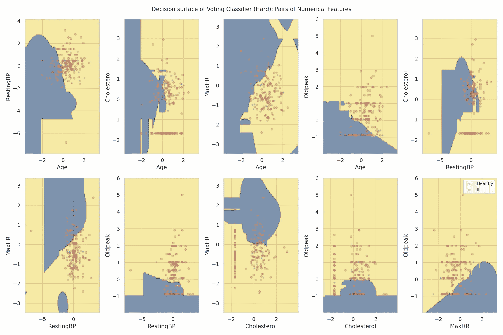
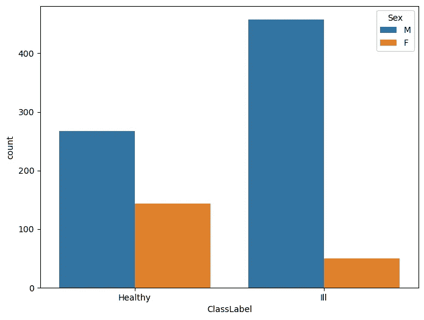
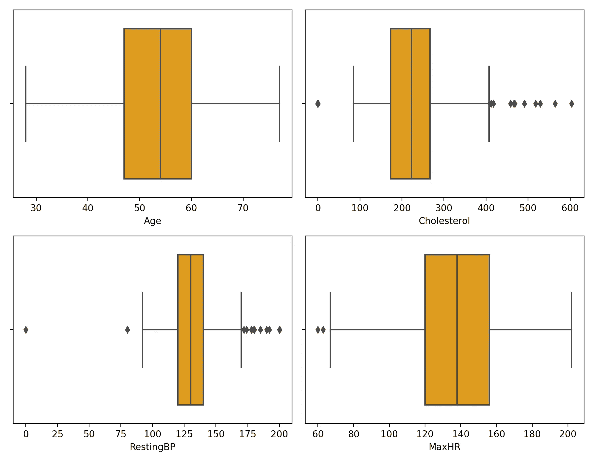
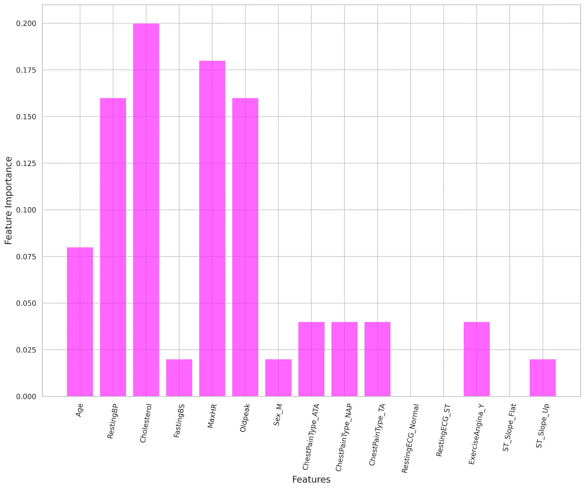
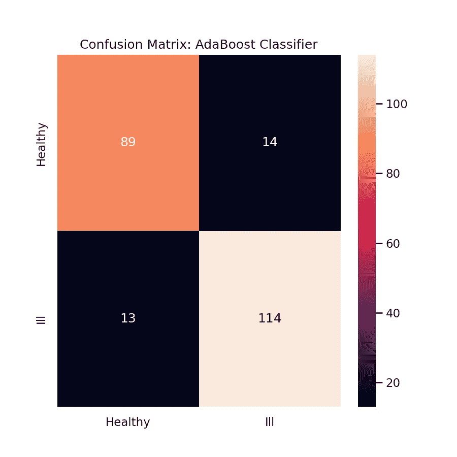

# 分类器集成：Voting Classifier

> 原文：[`towardsdatascience.com/ensemble-of-classifiers-voting-classifier-ef7f6a5b7795`](https://towardsdatascience.com/ensemble-of-classifiers-voting-classifier-ef7f6a5b7795)

## 结合多种不同模型以获得更好的预测

[](https://saptashwa.medium.com/?source=post_page-----ef7f6a5b7795--------------------------------)[](https://towardsdatascience.com/?source=post_page-----ef7f6a5b7795--------------------------------) [Saptashwa Bhattacharyya](https://saptashwa.medium.com/?source=post_page-----ef7f6a5b7795--------------------------------)

·发布于 [Towards Data Science](https://towardsdatascience.com/?source=post_page-----ef7f6a5b7795--------------------------------) ·阅读时间 7 分钟·2023 年 8 月 17 日

--



使用 Voting Classifier 的决策边界（图片来源：作者；代码见参考文献）

在机器学习的上下文中，Ensemble 指的是一个有限数量的机器学习模型的集合（可能包括 ANN），这些模型是为同一任务训练的。通常，这些模型是独立训练的，然后将它们的预测结果结合起来。

当不同模型的预测结果不一致时，有时使用集成模型进行分类比任何单个分类器更为有用。在这里，我们希望结合不同的分类器创建一个集成模型，然后使用这个集成模型进行预测任务。本文将讨论什么内容？

+   使用 Sklearn 的 VotingClassifier 来构建一个集成模型。

+   什么是 VotingClassifier 中的硬投票和软投票？

+   使用 VotingClassifier 检查单个模型的性能。

+   最后，使用 GridSearchCV + VotingClassifier 来寻找单个模型的最佳参数。

让我们开始吧！

## 数据准备：

为了查看 VotingClassifier 的实际应用示例，我使用了[心脏病预测数据集](https://www.kaggle.com/datasets/fedesoriano/heart-failure-prediction)（开放数据库许可下提供）。这里的任务是对患者是否可能有心脏病进行二分类预测。数据集包含 10 个属性，包括年龄、性别、静息血压等，数据来源于 900 多名患者。让我们检查一些不同参数的分布情况。我们检查‘ClassLabel’的计数（1 表示心脏病，0 表示健康），即健康和患病人群随性别的变化情况。



图 1：参与者性别对 ClassLabel 分布的影响。（图片来源：作者；代码见参考文献）。

总的来说，我们看到男性的生病比例相较于女性要高。我们还可以检查个别特征，例如胆固醇和静息血压分布，见下文，我们发现生病患者的胆固醇和静息血压均较高，尤其是女性。


图 2：两种不同类别（健康和生病）下男性和女性的胆固醇和静息血压分布（图片来源：作者）。

对于数值特征，也可以使用箱线图查看分布，其中箱体表示数据中心 50% 的范围。



图 3：通过箱线图展示的一些数值参数分布（图片来源：作者）。

我们在数据集上发现了一些问题；有相当多的数据点胆固醇和静息血压为零。虽然确实有可能存在[非常低的胆固醇](https://www.health.harvard.edu/blog/ldl-cholesterol-how-low-can-you-safely-go-2020012018638)，但很多数据点（患者）都为零，这是否有些过于偶然？不过，由于我们的主要目标是实现 VotingClassifier，因此我们将这些数据点保留原样，并继续进行下一阶段。

## 训练-测试与分类：

在一些初步分析后，我们准备数据集以训练和测试不同的分类器，并比较它们的性能。首先，我们将数据分成训练集和测试集，分别对数值列进行标准化（以防止数据泄漏），并初始化 3 种不同的分类器——支持向量机、逻辑回归 和 AdaBoost，后者是一种集成学习方法，特别属于提升（Boosting）方法（另一种被称为‘袋装（Bagging）’）。接下来是使用训练集训练这些分类器，并检查测试集的预测结果。我们检查了 3 种不同的性能指标——精度、召回率和 F1 分数。以下是代码块：

检查心脏病数据集上各个分类器的性能。

以下是得分：

```py
>>> SVC, LogReg, AdaBoost Precisions: 0.9096562 0.8915564 0.8825301
>>> SVC, LogReg, AdaBoost Recalls: 0.9086956 0.8913043 0.8826086
>>> SVC, LogReg, AdaBoost F1-scores: 0.90831418 0.8910015 0.8825525
```

我们看到，F1 分数的平均值约为 ~89%。还可以检查 AdaBoost 分类器的特征重要性，胆固醇显然是主要的重要特征之一。下面是图示：



图 4：特征重要性图：仅考虑 AdaBoost 分类器，胆固醇的重要性最高（图片来源：作者）。

AdaBoost 分类器的混淆矩阵如下：



图 5：AdaBoost 分类器的混淆矩阵。

## VotingClassifier 用于形成集成模型：

VotingClassifier 结合了不同的机器学习分类器，并使用投票规则（‘软’或‘硬’）来预测类别标签。

当模型的性能几乎相同时，它平衡了各个模型的个体弱点；在这里，我们将结合之前使用的单独分类器来构建集成模型。但什么是软投票和硬投票呢？

***多数 (‘硬’) 投票：*** 对于特定样本，预测的类别标签是代表每个单独分类器预测的类别标签的多数（众数）。下面的表格展示了一个具有 3 个类别的分类任务示例

```py
+-------------+---------+---------+--------+
| Classifier  | Class1  | Class2  | Class3 |
+-------------+---------+---------+--------+
| SVC         |    0.2  |    0.3  |    0.5 |
| LogReg      |    0.3  |    0.4  |    0.3 |
| AdaBoost    |    0.1  |    0.3  |    0.6 |
+-------------+---------+---------+--------+
```

在这里，SVC 和 AdaBoost 都预测 Class3 作为输出标签，在硬投票方案下，这将被选中。

***软投票：*** 软投票返回预测概率之和的最大类别标签；也可以为参与创建集成的分类器分配一个权重数组。下面是一个示例代码块

```py
svc_classifier = SVC(probability=True)
logreg_classifier = LogisticRegression()
adaboost_classifier = AdaBoostClassifier()

estimators = [('svm', svc_classifier), ('logreg', logreg_classifier), 
              ('adaboost', adaboost_classifier)]
voting_classifier_soft = VotingClassifier(estimators=estimators, 
                                          voting='soft', 
                                          weights=[1, 1, 1]) 
```

再次查看下面的表格，以权重 [1, 1, 1] 为例，即所有分类器的权重相等

```py
+ — — — — — — — + — — — — — + — — — — -+ — — — — -+
| Classifier    | Class1    | Class2   | Class3   |
+ — — — — — — — + — — — — — + — — — — -+ — — — — -+
| SVC           | w1 x 0.2  | w1 x 0.3 | w1 x 0.5 |
| LogReg        | w2 x 0.3  | w2 x 0.4 | w2 x 0.3 |
| AdaBoost      | w3 x 0.1  | w3 x 0.3 | w1 x 0.6 |
| Weighted Avg. | 0.20      | 0.33     | 0.47     |
+ — — — — — — — + — — — — — + — — — — -+ — — — — -+
```

在‘软’投票方案下，这里将选择 Class3。有关 VotingClassifier 的更多信息，您还可以查看 [官方 Sklearn 指南](https://scikit-learn.org/stable/modules/ensemble.html#voting-classifier)。现在，让我们构建一个 VotingClassifier，并使用这个集成模型在测试集上进行训练和预测，使用‘软’和‘硬’方案。

使用 VotingClassifier 确实可以看到相较于单个估算器，性能指标有所改善。同样，我们也可以绘制混淆矩阵以进一步验证结果。


图 6：使用 VotingClassifier 和‘硬’投票方案获得的混淆矩阵。（图像由作者提供）。

## VotingClassifier 和 GridSearchCV：

也可以使用 GridSearchCV 调整 VotingClassifier 中各个估算器的参数（‘超参数’）。GridSearch 会穷尽所有参数组合，并使用交叉验证来找到最佳超参数。我们之前已经通过 [这里](https://medium.com/towards-data-science/visualizing-support-vector-machine-decision-boundary-69e7591dacea) 介绍了使用支持向量机、主成分分析和 GridSearchCV 构建分析管道的示例。我们展示了在 VotingClassifier 中获取最佳参数是相当简单的，下面是一个示例代码块：

对于参数空间（在第 18 行），我们仔细研究了 SVM 的 ‘C’ 和 ‘gamma’ 参数（使用径向基函数核），这些参数我们之前已经详细讨论过 之前。对于逻辑回归，我们检查了正则化强度参数的多个逆值；最后，对于使用决策树作为基估算器的 AdaBoost 分类器，我们检查了一些可能的估算器数量值，即 Boosting 终止的值。

**结论：** 在这篇文章中，通过 VotingClassifier，我们讨论了机器学习中的一个重要概念——集成技术。我们使用个体估计器构建一个集成，这些估计器的预测结果通过‘Hard’或‘Soft’投票方案结合，用于示例分类任务。通常认为，结合几个不同的估计器可能会胜过最佳估计器的表现，但集成有助于减少选择表现不佳的分类器的风险[1]。

根据手头的任务，你可以考虑使用 VotingClassifier 集成技术，而不是从多个分类器中选择最佳的。

*保持坚强！干杯！！*

## 参考文献：

[1] *“决策中的集成系统”*；R. Polikar，IEEExplore，DOI: [10.1109/MCAS.2006.1688199](https://doi.org/10.1109/MCAS.2006.1688199)。

[2] Sklearn VotingClassifier: [用户指南](https://scikit-learn.org/stable/modules/ensemble.html#voting-classifier)。

[3] *“基于集成的分类器”*；L. Rokach，人工智能评论 33，1–39 (2010)。 [Springer](https://link.springer.com/article/10.1007/s10462-009-9124-7)。

[4] 代码和笔记本：[GitHub](https://github.com/suvoooo/Machine_Learning/tree/master/VotingClassifier)。

[5] 心力衰竭预测数据；在开放数据库许可 (ODbl) 下提供；[链接](https://www.kaggle.com/datasets/fedesoriano/heart-failure-prediction)。
