# 确保在 Scikit-learn 管道中正确使用变换器

> 原文：[`towardsdatascience.com/ensuring-correct-use-of-transformers-in-scikit-learn-pipelines-393566db7bfa`](https://towardsdatascience.com/ensuring-correct-use-of-transformers-in-scikit-learn-pipelines-393566db7bfa)

## 机器学习项目中的有效数据处理

[](https://qtalen.medium.com/?source=post_page-----393566db7bfa--------------------------------)[](https://towardsdatascience.com/?source=post_page-----393566db7bfa--------------------------------) [彭乾](https://qtalen.medium.com/?source=post_page-----393566db7bfa--------------------------------)

·发表在 [数据科学前沿](https://towardsdatascience.com/?source=post_page-----393566db7bfa--------------------------------) ·11 分钟阅读·2023 年 12 月 20 日

--

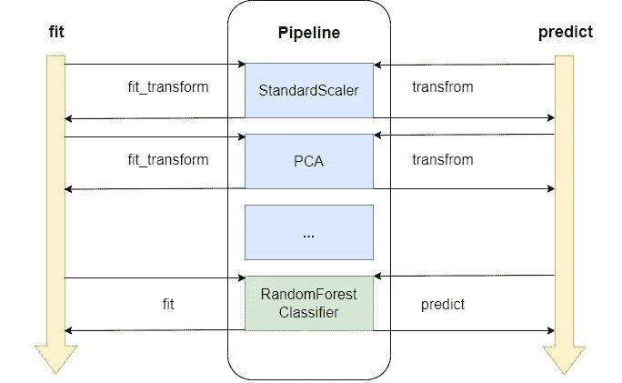

确保在 Scikit-learn 管道中正确使用变换器。图片由作者提供

本文将解释如何在 Scikit-Learn (sklearn) 项目中正确使用 [Pipeline](https://scikit-learn.org/stable/modules/compose.html?ref=dataleadsfuture.com) 和 [Transformers](https://scikit-learn.org/stable/data_transforms.html?ref=dataleadsfuture.com)，以加速和重用我们的模型训练过程。

这部分内容补充和澄清了有关 Pipeline 示例和一些常见误解的官方文档。

我希望阅读完这篇文章后，你能够更好地利用 Pipeline 这个优秀的设计来完成你的机器学习任务。

# 介绍

世界各地的中餐馆都有一道著名的菜肴叫做“左宗棠鸡”，我想知道你是否尝试过。


左宗棠鸡。标准化烹饪过程的典范。照片来源：作者创作，[Canva](https://www.canva.com/?ref=dataleadsfuture.com)。

“左宗棠鸡”的一个特点是每块鸡肉都被厨师处理成相同的大小。这确保了：

1.  所有鸡块都腌制相同的时间。

1.  在烹饪过程中，每块鸡肉都达到相同的熟度。

1.  使用筷子时，均匀的大小使得捡起食材更加容易。

这种预处理包括清洗、切割和腌制食材。如果鸡块切割得比平时大，即使炒的时间相同，风味也会发生显著变化。

因此，在准备开设餐厅时，我们必须考虑标准化这些过程和配方，以确保每一道“左宗棠鸡”都有一致的口味和质地。这就是餐厅成功的关键。

回到机器学习的世界，Scikit-Learn 还提供了这样的标准化流程，称为 Pipeline。它们将数据预处理和模型训练过程固化为标准化的工作流程，使机器学习项目更易于维护和重用。

在本文中，我们将探讨如何在 Scikit-Learn 的 Pipeline 中正确使用变换器，确保我们的数据准备得像精致餐点的配料一样完美。

# 为什么使用变换器

## 什么是变换器

在 Scikit-Learn 中，变换器主要分为两类：数据缩放和特征降维。

以一组房屋数据为例，其中包括位置、面积和卧室数量等特征。

如果不将这些特征标准化到相同的尺度，模型可能会因区域（通常是较大的数值）中的微小波动而忽略位置的显著影响（通常是分类数据）。

这就像用过多的胡椒粉掩盖了草药的细腻味道。

## 正确使用变换器

通常，数据缩放是通过标准化来完成的，公式为：

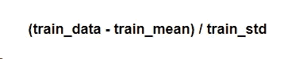

训练数据标准化的公式。图片作者提供

其中 `train_mean` 和 `train_std` 是从训练数据中提取的变量。

在 Scikit-Learn 中，训练数据和测试数据都是使用 `[train_test_split](https://scikit-learn.org/stable/modules/generated/sklearn.model_selection.train_test_split.html?ref=dataleadsfuture.com#sklearn.model_selection.train_test_split)` 方法从原始数据集中获得的。

在缩放测试数据时，使用相同的 `train_mean` 和 `train_std`：

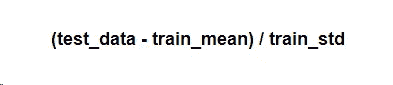

在缩放测试数据时使用相同的 train_mean 和 train_std 变量。图片作者提供

这里出现了一个问题：为什么使用训练数据来生成这些变量？

让我们看看一个简单的数据集，其中训练数据为：

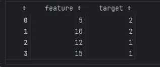

一个简单的训练数据集。图片作者提供

标准化后，训练数据变为：

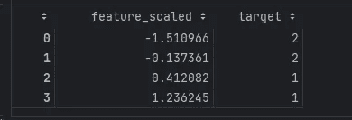

缩放后的简单数据集。图片作者提供

显然，在缩放后，大于 0 的特征标记为 1，这意味着在缩放之前，大于 10 的特征标记为 1。

现在让我们看看测试数据：

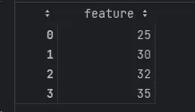

尚未分类的测试数据。图片作者提供

如果我们使用从测试数据分布中生成的 `test_mean` 和 `test_std`，而不考虑训练数据，则结果变为：

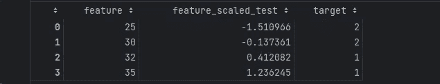

使用测试数据生成变量时的错误演示。图片作者提供

显然，这个预测结果是没有意义的。但是假设我们使用 `train_mean` 和 `train_std` 来处理数据，并结合模型预测；我们来看看会发生什么：

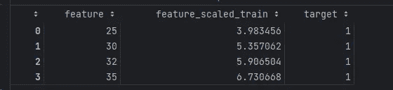

使用训练数据的变量，我们获得了正确的结果。图片由作者提供

如我们所见，只有通过对训练数据生成的变量进行数据预处理，才能确保模型的预测符合预期。

## 在 Scikit-Learn 中使用变换器

在 Scikit-Learn 中使用变换器非常简单。

我们可以使用`make_classification`生成一组模拟数据，然后用`train_test_split`将其拆分为训练集和测试集。

```py
from sklearn.datasets import make_classification
from sklearn.model_selection import train_test_split

X, y = make_classification(n_samples=100, n_features=2, 
                           n_classes=2, n_redundant=0, 
                           n_informative=2, n_clusters_per_class=1, 
                           random_state=42)

X_train, X_test, y_train, y_test = train_test_split(X, y, test_size=0.2, random_state=42)
```

让我们看看数据的分布：

```py
import matplotlib.pyplot as plt

plt.scatter(X_train[:, 0], X_train[:, 1], color='red', marker='o')
plt.scatter(X_test[:, 0], X_test[:, 1], color='green', marker='s')
plt.xlabel('feature_idx_0')
plt.ylabel('feature_idx_1')
plt.tight_layout()
plt.show()
```

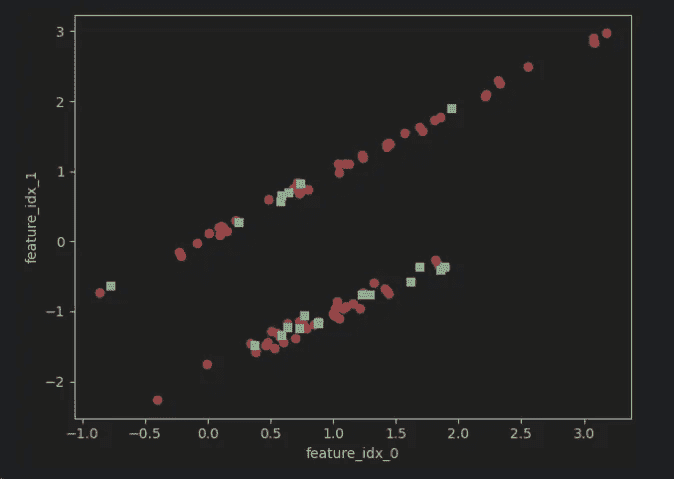

缩放前的数据分布。图片由作者提供

在这里，我们使用`StandardScaler`来缩放特征。

首先，初始化`StandardScaler`，然后用训练数据`fit`它：

```py
from sklearn.preprocessing import StandardScaler

scaler = StandardScaler()
scaler.fit(X_train)
```

接下来，我们可以使用拟合的变换器`transform`训练数据的特征：

```py
X_train_std = scaler.transform(X_train)
```

当然，我们也可以使用`fit_transform`一次性拟合并转换训练数据：

```py
X_train_std = scaler.fit_transform(X_train)
```

然后我们只需转换测试数据，无需再次拟合：

```py
X_test_std = scaler.transform(X_test)
```

转换后，数据的分布保持不变，唯一的变化是规模：

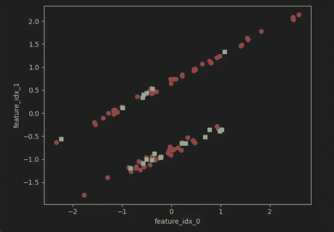

缩放后的数据分布。图片由作者提供

除了使用像`[StandardScaler](https://scikit-learn.org/stable/modules/generated/sklearn.preprocessing.StandardScaler.html?ref=dataleadsfuture.com#sklearn.preprocessing.StandardScaler)`和`[MinMaxScaler](https://scikit-learn.org/stable/modules/generated/sklearn.preprocessing.MinMaxScaler.html?ref=dataleadsfuture.com#sklearn.preprocessing.MinMaxScaler)`这样的工具进行数据缩放外，我们还可以使用`PCA`、`SelectKBest`等进行维度减少。为了简洁起见，我不在这里深入探讨这些内容，但欢迎查阅[官方文档](https://scikit-learn.org/stable/modules/feature_selection.html?ref=dataleadsfuture.com#univariate-feature-selection)获取更多信息。

# 在管道中使用变换器

## 为什么使用管道

如前所述，在机器学习任务中，我们通常需要使用各种变换器进行数据缩放和特征维度减少，然后再训练模型。

这带来了几个挑战：

+   **代码复杂性**：每次使用变换器时，我们必须经历初始化、`fit_transform`和`transform`步骤。转换过程中漏掉一个步骤可能会破坏整个训练过程。

+   **数据泄露**：如我们所讨论的，对于每个变换器，我们用训练数据拟合，然后转换训练数据和测试数据。我们必须避免测试数据的分布泄漏到训练数据中。

+   **代码复用性**：一个机器学习模型不仅包括用于预测的训练好的估计器，还包括数据预处理步骤。因此，一个包括变换器和估计器的机器学习任务应该是原子化和不可分割的。

+   **超参数调优**：在设置好机器学习步骤后，我们需要调整超参数，以找到 Transformer 参数值的最佳组合。

Scikit-Learn 引入了 `Pipeline` 模块来解决这些问题。

## 什么是 Pipeline

`Pipeline` 是 Scikit-Learn 中实现责任链设计模式的一个模块。

创建 Pipeline 时，我们使用 `steps` 参数将多个 Transformers 链接在一起进行初始化：

```py
from sklearn.pipeline import Pipeline
from sklearn.decomposition import PCA
from sklearn.ensemble import RandomForestClassifier

pipeline = Pipeline(steps=[('scaler', StandardScaler()),
                           ('pca', PCA(n_components=2, random_state=42)),
                           ('estimator', RandomForestClassifier(n_estimators=3, max_depth=5))])
```

[官方文档](https://scikit-learn.org/stable/modules/compose.html?ref=dataleadsfuture.com#pipeline)指出，最后一个 Transformer 必须是一个 Estimator。

如果你不需要指定每个 Transformer 的名称，你可以使用 `make_pipeline` 简化 Pipeline 的创建：

```py
from sklearn.pipeline import make_pipeline

pipeline_2 = make_pipeline(StandardScaler(),
                           PCA(n_components=2, random_state=42),
                           RandomForestClassifier(n_estimators=3, max_depth=5))
```

## 从源代码理解 Pipeline 的机制

我们已经提到，在使用每个 Transformer 时，不要让测试数据变量泄露到训练数据中的重要性。

当每个数据预处理步骤是独立时，这个原则相对容易确保。

但如果我们使用 Pipeline 整合这些步骤会怎么样？

如果我们查看[官方文档](https://scikit-learn.org/stable/modules/compose.html?ref=dataleadsfuture.com#pipeline)，会发现它只是对整个数据集使用 `fit` 方法，而没有解释如何分别处理训练数据和测试数据。

牢记这个问题，我深入研究了 Pipeline 的源代码以寻找答案。

阅读源代码表明，虽然 Pipeline 实现了 `fit`、`fit_transform` 和 `predict` 方法，但它们的工作方式与普通的 Transformers 不同。

以以下 Pipeline 创建过程为例：

```py
from sklearn.pipeline import Pipeline
from sklearn.decomposition import PCA
from sklearn.ensemble import RandomForestClassifier

pipeline = Pipeline(steps=[('scaler', StandardScaler()),
                           ('pca', PCA(n_components=2, random_state=42)),
                           ('estimator', RandomForestClassifier(n_estimators=3, max_depth=5))])
```

内部实现可以通过以下图示表示：


调用 `fit` 和 `predict` 方法时的内部实现。图片由作者提供

正如你所见，当我们调用 `fit` 方法时，Pipeline 首先将 Transformers 与 Estimator 分开。

对于每个 Transformer，Pipeline 会检查是否有 `fit_transform` 方法；如果有，它会调用该方法；否则，它会调用 `fit`。

对于 Estimator，它直接调用 `fit`。

对于 `predict` 方法，Pipeline 将 Transformers 与 Estimator 分开。

Pipeline 按顺序调用每个 Transformer 的 `transform` 方法，然后是 Estimator 的 `predict` 方法。

因此，在使用 Pipeline 时，我们仍然需要拆分训练数据和测试数据。然后我们只需对训练数据调用 `fit`，对测试数据调用 `predict`。

在将 Pipeline 与 `GridSearchCV` 进行超参数调优时，有一种特殊情况：你不需要手动拆分训练数据和测试数据。我将在最佳实践部分详细解释这一点。

# 实际应用中使用 Transformers 和 Pipeline 的最佳实践

既然我们已经讨论了 Transformers 和 Pipeline 的工作原理，是时候履行标题中的承诺，讨论在实际项目中将 Transformers 与 Pipeline 结合的最佳实践。

## 将 Pipeline 与 GridSearchCV 结合用于超参数调优

在机器学习项目中，选择合适的数据集处理和算法是一方面。在调试初步步骤之后，是时候进行参数优化了。

使用 `GridSearchCV` 或 `RandomizedSearchCV`，你可以尝试不同的参数以找到最佳适配：

```py
import time

from sklearn.model_selection import GridSearchCV

pipeline = Pipeline(steps=[('scaler', StandardScaler()),
                           ('pca', PCA()),
                           ('estimator', RandomForestClassifier())])
param_grid = {'pca__n_components': [2, 'mle'],
              'estimator__n_estimators': [3, 5, 7],
              'estimator__max_depth': [3, 5]}

start = time.perf_counter()
clf = GridSearchCV(pipeline, param_grid=param_grid, cv=5, n_jobs=4)
clf.fit(X, y)

# It takes 2.39 seconds to finish the search on my laptop.
print(f"It takes {time.perf_counter() - start} seconds to finish the search.")
```

但在机器学习中，超参数调优不仅限于 Estimator 参数；它还涉及 Transformer 参数的组合。

将所有步骤与 Pipeline 集成，允许对每个元素进行不同参数组合的超参数调优。

请注意，在超参数调优期间，我们不再需要手动分割训练数据和测试数据。`GridSearchCV` 会使用 `[StratifiedKFold](https://scikit-learn.org/stable/modules/cross_validation.html?ref=dataleadsfuture.com#stratified-k-fold)` 将数据分为训练集和验证集，该方法实现了 k-fold 交叉验证机制。

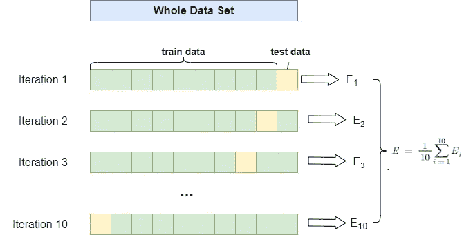

StratifiedKFold 迭代过程将训练数据和测试数据分开。图片来源：作者

我们还可以设置交叉验证的折数，并选择使用多少个工作线程。调优过程在下图中展示：

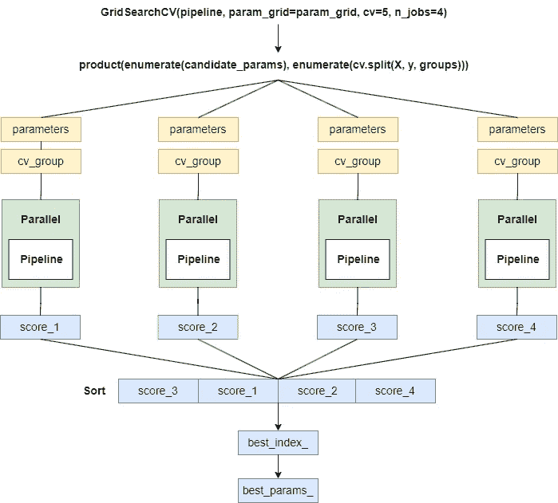

GridSearchCV 超参数调优的内部实现。图片来源：作者

由于空间限制，我不会在此详细介绍 `GridSearchCV` 和 `RandomizedSearchCV`。如果你感兴趣，我可以在下次撰写另一篇文章来解释它们。

## **使用 memory 参数缓存 Transformer 输出**

当然，使用 `GridSearchCV` 进行超参数调优可能会很慢，但这没关系，Pipeline 提供了缓存机制，通过缓存中间步骤的结果来加速调优效率。

在初始化 Pipeline 时，你可以传入 `memory` 参数，这将缓存每个转换器第一次调用 `fit` 和 `transform` 后的结果。

如果随后的 `fit` 和 `transform` 调用使用相同的参数，这在超参数调优期间很可能发生，这些步骤将直接从缓存中读取结果，而不是重新计算，从而显著提高了重复运行相同 Transformer 时的效率。

`memory` 参数可以接受以下值：

+   默认值为 None：不使用缓存。

+   字符串：提供存储缓存结果的路径。

+   `joblib.Memory` 对象：允许更细粒度的控制，例如配置缓存的存储后端。

接下来，让我们使用之前的 `GridSearchCV` 示例，这次将 `memory` 添加到 Pipeline 中，看看能提高多少速度：

```py
pipeline_m = Pipeline(steps=[('scaler', StandardScaler()),
                           ('pca', PCA()),
                           ('estimator', RandomForestClassifier())],
                      memory='./cache')
start = time.perf_counter()
clf_m = GridSearchCV(pipeline_m, param_grid=param_grid, cv=5, n_jobs=4)
clf_m.fit(X, y)

# It takes 0.22 seconds to finish the search with memory parameter.
print(f"It takes {time.perf_counter() - start} seconds to finish the search with memory.")
```

如图所示，使用缓存后，调优过程仅需 0.2 秒，相较于之前的 2.4 秒大幅提升了速度。

## 如何调试 Scikit-Learn Pipeline

在将 Transformers 集成到 Pipeline 中后，整个预处理和转换过程变成了一个黑箱。很难理解当前的处理步骤。

幸运的是，我们可以通过在 Pipeline 中添加日志记录来解决这个问题。

我们需要创建自定义转换器，以在数据转换的每一步添加日志记录。

这里是一个使用 Python 标准日志库添加日志记录的示例：

首先，你需要配置一个记录器：

```py
import logging

from sklearn.base import BaseEstimator, TransformerMixin

logging.basicConfig(level=logging.INFO, format='%(asctime)s - %(levelname)s - %(message)s')
logger = logging.getLogger()
```

接下来，你可以创建一个自定义 Transformer，并在其方法中添加日志记录：

```py
class LoggingTransformer(BaseEstimator, TransformerMixin):
    def __init__(self, transformer):
        self.transformer = transformer
        self.real_name = self.transformer.__class__.__name__

    def fit(self, X, y=None):
        logging.info(f"Begin fit: {self.real_name}")
        self.transformer.fit(X, y)
        logging.info(f"End fit: {self.real_name}")
        return self

    def fit_transform(self, X, y=None):
        logging.info(f"Begin fit_transform: {self.real_name}")
        X_fit_transformed = self.transformer.fit_transform(X, y)
        logging.info(f"End fit_transform: {self.real_name}")
        return X_fit_transformed

    def transform(self, X):
        logging.info(f"Begin transform: {self.real_name}")
        X_transformed = self.transformer.transform(X)
        logging.info(f"End transform: {self.real_name}")
        return X_transformed
```

然后，你可以在创建 Pipeline 时使用这个 `LoggingTransformer`：

```py
pipeline_logging = Pipeline(steps=[('scaler', LoggingTransformer(StandardScaler())),
                             ('pca', LoggingTransformer(PCA(n_components=2))),
                             ('estimator', RandomForestClassifier(n_estimators=5, max_depth=3))])
pipeline_logging.fit(X_train, y_train)
```

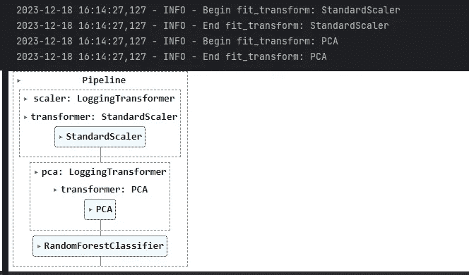

添加 LoggingTransformer 后的效果。图像由作者提供

当你使用 `pipeline.fit` 时，它会依次调用每个步骤的 `fit` 和 `transform` 方法，并记录相应的信息。

## 在 Scikit-Learn Pipeline 中使用 passthrough

在 Pipeline 中，可以将某个步骤设置为 `'passthrough'`，这意味着对于这个特定的步骤，输入数据将不加改变地传递到下一个步骤。

当你希望有选择性地启用/禁用复杂管道中的某些步骤时，这一点很有用。

参考上面的代码示例，我们知道在使用 `DecisionTree` 或 `RandomForest` 时，标准化数据是多余的，因此我们可以使用 `passthrough` 跳过这一步。

下面是一个示例：

```py
param_grid = {'scaler': ['passthrough'],
              'pca__n_components': [2, 'mle'],
              'estimator__n_estimators': [3, 5, 7],
              'estimator__max_depth': [3, 5]}
clf = GridSearchCV(pipeline, param_grid=param_grid, cv=5, n_jobs=4)
clf.fit(X, y)
```

## 重用 Pipeline

经过一番波折，我们终于得到了一个表现良好的机器学习模型。

现在，你可能考虑如何重用这个模型，与同事共享，或将其部署到生产环境中。

然而，模型训练的结果不仅包括模型本身，还包括各种数据处理步骤，这些步骤都需要保存。

使用 `joblib` 和 Pipeline，我们可以保存整个训练过程以备后用。以下代码提供了一个简单的示例：

```py
from joblib import dump, load

# save pipeline
dump(pipeline, 'model_pipeline.joblib')

# load pipeline
loaded_pipeline = load('model_pipeline.joblib')

# predict with loaded pipeline
loaded_predictions = loaded_pipeline.predict(X_test)
```

# 结论

[官方 Scikit-Learn 文档](https://scikit-learn.org/stable/user_guide.html?ref=dataleadsfuture.com) 是我见过的最好的文档之一。通过学习其内容，你可以掌握机器学习应用的基础知识。

然而，在实际项目中使用 Scikit-Learn 时，我们经常遇到官方文档可能未涵盖的各种细节。

如何正确结合 Transformers 和 Pipeline 就是一个这样的案例。

在这篇文章中，我介绍了使用 Transformers 的原因和一些典型应用场景。

然后，我从源代码层面解释了 Pipeline 的工作原理，并完成了在训练和测试数据集上应用的合理用例。

最后，对于实际机器学习项目的每个阶段，我介绍了结合 Transformers 和 Pipeline 的最佳实践，基于我的工作经验。

希望这篇文章能对你有所帮助。如果你有任何问题，请给我留言，我会尽力回答。

感谢阅读我的故事。

你可以[**订阅**](https://www.dataleadsfuture.com/#/portal)以获取我最新的数据科学故事。

如果你有任何问题，可以在[LinkedIn](https://www.linkedin.com/in/qtalen/)或[Twitter(X)](https://twitter.com/qtalen)上找到我。

这篇文章最初发表在[数据引领未来](https://www.dataleadsfuture.com/ensuring-correct-use-of-transformers-in-scikit-learn-pipeline/#/portal)上。
