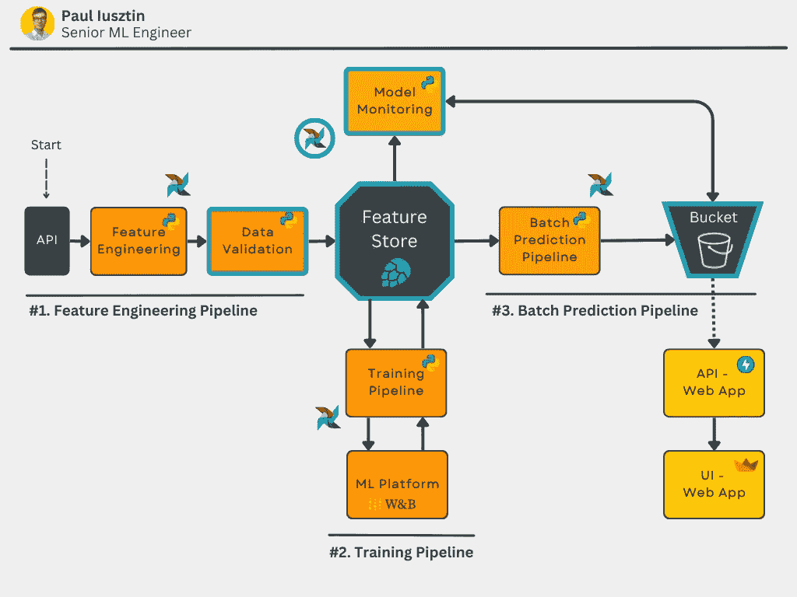
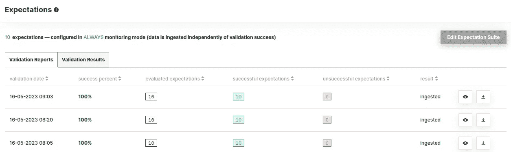
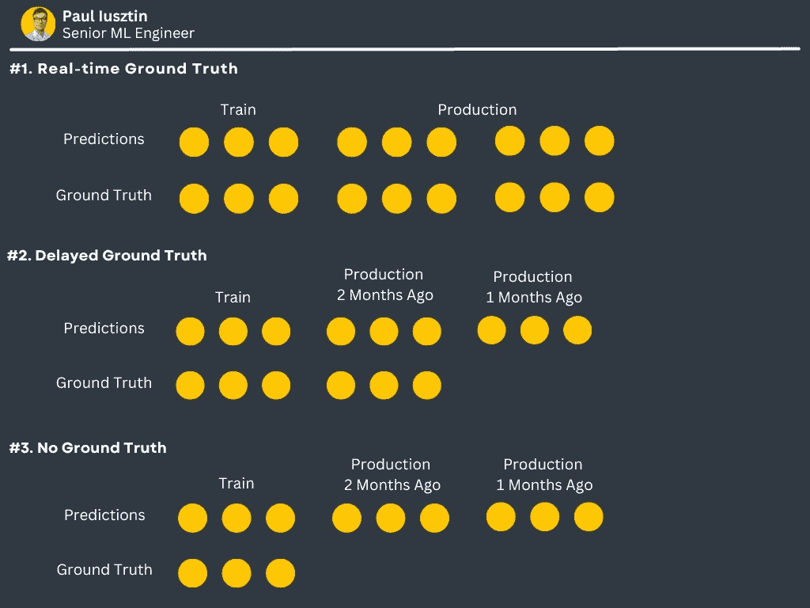
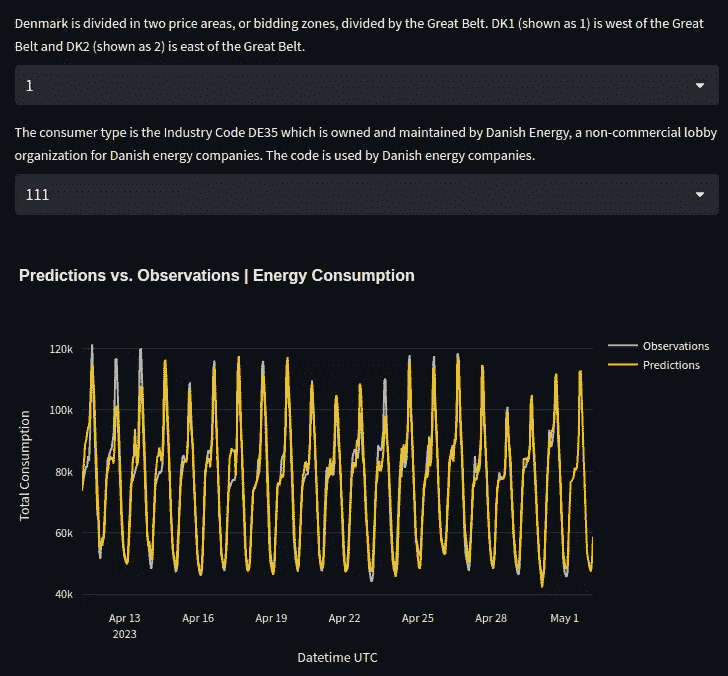
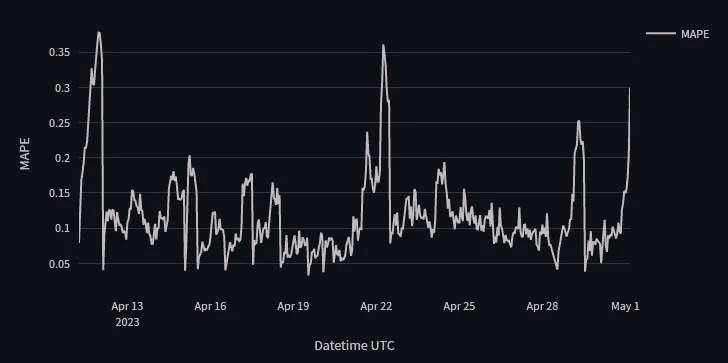
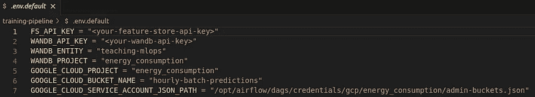

# 确保可信的 ML 系统，通过数据验证和实时监控

> 原文：[`towardsdatascience.com/ensuring-trustworthy-ml-systems-with-data-validation-and-real-time-monitoring-89ab079f4360`](https://towardsdatascience.com/ensuring-trustworthy-ml-systems-with-data-validation-and-real-time-monitoring-89ab079f4360)

## [完整的 7 步骤 MLOps 框架](https://towardsdatascience.com/tagged/full-stack-mlops)

## 课程 5：使用 GE 进行质量和完整性的数据验证。模型性能持续监控。

 [Paul Iusztin](https://pauliusztin.medium.com/?source=post_page-----89ab079f4360--------------------------------)

·发表于[Towards Data Science](https://towardsdatascience.com/?source=post_page-----89ab079f4360--------------------------------) ·阅读时间 12 分钟·2023 年 6 月 3 日

--

图片由[Hassan Pasha](https://unsplash.com/@hpzworkz?utm_source=medium&utm_medium=referral)拍摄，[Unsplash](https://unsplash.com/?utm_source=medium&utm_medium=referral)

本教程代表**7 节课中的第五部分**，将逐步指导你如何**设计、实施和部署 ML 系统**，使用**MLOps 良好实践**。在课程中，你将构建一个生产就绪的模型，用于预测未来 24 小时内来自丹麦的多种消费类型的能源消耗水平。

*到课程结束时，你将理解如何使用批处理服务架构来设计、编码和部署 ML 系统的所有基本原理。*

本课程*针对中级/高级机器学习工程师*，希望通过构建自己的端到端项目提升技能。

> 如今，证书随处可见。构建先进的端到端项目，并在之后展示出来，是获得专业工程师认可的最佳方式。

# 目录：

+   课程介绍

+   课程内容

+   数据源

+   课程 5：使用 GE 进行质量和完整性的数据验证。模型性能持续监控。

+   课程 5：代码

+   结论

+   参考文献

# 课程介绍

***在这 7 节课的课程结束时，你将知道如何：***

+   设计批处理服务架构

+   使用 Hopsworks 作为特征存储

+   设计一个从 API 读取数据的特征工程管道

+   构建一个具有超参数调优的训练管道

+   使用 W&B 作为 ML 平台来跟踪你的实验、模型和元数据

+   实现批处理预测管道

+   使用 Poetry 构建自己的 Python 包

+   部署你自己的私有 PyPi 服务器

+   使用 Airflow 协调一切

+   使用预测来开发基于 FastAPI 和 Streamlit 的 Web 应用

+   使用 Docker 将代码容器化

+   使用 Great Expectations 确保数据验证和完整性

+   监控预测的性能随时间变化

+   将一切部署到 GCP

+   使用 GitHub Actions 构建 CI/CD 流水线

如果这听起来很多，不用担心。在完成这门课程后，你将理解我之前所说的一切。最重要的是，你将知道为什么使用这些工具以及它们如何作为一个系统协同工作。

**如果你想充分利用这门课程，** [**我建议你访问包含所有课程代码的 GitHub 仓库**](https://github.com/iusztinpaul/energy-forecasting) **。这门课程旨在快速阅读并复制文章中的代码。**

到课程结束时，你将知道如何实现下面的图示。如果有些内容你不理解，别担心。我会详细解释一切。

课程中将构建的架构图 [图由作者提供]。

到**第 5 课结束时**，你将知道如何使用 Great Expectations 验证数据的完整性和质量。同时，你还会了解如何在 ML 系统上实现监控组件。

# 课程内容：

1.  [批量服务。特征存储。特征工程流水线。](https://medium.com/towards-data-science/a-framework-for-building-a-production-ready-feature-engineering-pipeline-f0b29609b20f)

1.  [训练流水线。ML 平台。超参数调整。](https://medium.com/towards-data-science/a-guide-to-building-effective-training-pipelines-for-maximum-results-6fdaef594cee)

1.  [批量预测流水线。使用 Poetry 打包 Python 模块。](https://medium.com/towards-data-science/unlock-the-secret-to-efficient-batch-prediction-pipelines-using-python-a-feature-store-and-gcs-17a1462ca489)

1.  私有 PyPi 服务器。使用 Airflow 协调一切。

1.  **使用 GE 进行数据质量和完整性验证。模型性能持续监控。**

1.  [使用 FastAPI 和 Streamlit 消费和可视化模型预测。将一切容器化。](https://medium.com/towards-data-science/fastapi-and-streamlit-the-python-duo-you-must-know-about-72825def1243)

1.  [将所有 ML 组件部署到 GCP。使用 GitHub Actions 构建 CI/CD 流水线。](https://medium.com/towards-data-science/seamless-ci-cd-pipelines-with-github-actions-on-gcp-your-tools-for-effective-mlops-96f676f72012)

1.  [[额外] 探秘‘不完美’ML 项目——经验与见解](https://medium.com/towards-data-science/imperfections-unveiled-the-intriguing-reality-behind-our-mlops-course-creation-6ff7d52ecb7e)

要了解更多背景信息，请查看第 3 课，这将教你如何使用批处理架构和特征存储构建推理管道。

此外，第 4 课将展示如何使用 Airflow 来协调所有的管道。

这节课将利用上述观点，并假设你已经理解了这些观点。

# 数据源

我们使用了一个免费且开放的 API，提供丹麦所有能源消费者类型的每小时能源消耗值 [1]。

他们提供了一个直观的界面，你可以轻松查询和可视化数据。[你可以在这里访问数据](https://www.energidataservice.dk/tso-electricity/ConsumptionDE35Hour) [1]。

数据有 4 个主要属性：

+   **小时 UTC：** 数据点被观测到的 UTC 日期时间。

+   **价格区域：** 丹麦被分为两个价格区域：DK1 和 DK2——由大贝尔特分隔。DK1 位于大贝尔特以西，DK2 位于大贝尔特以东。

+   **消费者类型：** 消费者类型是工业代码 DE35，由丹麦能源公司拥有和维护。

+   **总消耗：** 总电力消耗（单位：千瓦时）

**注意：** 观测数据有 15 天的延迟！但对于我们的演示用例，这不是问题，因为我们可以模拟实时发生的相同步骤。

我们的网页应用截图，展示了如何预测区域 = 1 和消费者类型 = 212 的能源消耗 [作者图片]。

数据点具有每小时的分辨率。例如：“2023–04–15 21:00Z”，“2023–04–15 20:00Z”，“2023–04–15 19:00Z”，等等。

我们将数据建模为多个时间序列。每个唯一的**价格区域**和**消费者类型元组表示其**唯一的时间序列。

因此，我们将构建一个模型，独立预测每个时间序列未来 24 小时的能源消耗。

*查看下面的视频以更好地理解数据的样子* 👇

课程和数据源概述 [作者视频]。

# 第 5 课：使用 GE 进行数据质量和完整性的验证。模型性能持续监控。

## 第 5 课的目标

目前，机器学习流程已经实施并协调好了。这意味着我们完成了吗？

还不完全……

最后一步，将使你从一个优秀的工程师成长为一个杰出的工程师，就是添加一个组件，让你能够快速诊断生产系统中发生的情况。

在第 5 课中，你将主要*学习两个不同*的主题，这些主题服务于一个共同目标：确保你的生产系统正常工作。

**1\. 数据验证：** 在将数据导入特征存储之前，检查 FE 管道生成的数据是否正常。

**2\. 模型监控：** 持续计算反映你生产模型性能的各种指标。

最终架构图，其中第 5 课的组件用蓝色突出显示 [作者提供的图片]。

我将在*理论概念与工具*部分详细介绍。但简要概述一下，为了持续监控你的模型性能，你将使用你之前的预测与新收集的实际情况来计算所需的指标，在你的情况下是 MAPE。

例如，你预测 6 月 1 日的 24 小时能耗值。最初，你没有数据来计算指标。但是，在 12 小时后，你可以收集实际能耗。因此，你可以在获取实际情况后计算最后 12 小时的所需指标。

1 小时后，你可以计算另一个数据点的指标，依此类推……

这是我们将在本教程中采用的策略。

## 理论概念与工具

**数据验证：** 数据验证是确保数据质量和完整性的过程。我是什么意思？

当你自动从不同来源（在我们的案例中是 API）收集数据时，你需要一种方法来持续验证你刚刚提取的数据是否遵循系统期望的一组规则。

例如，你期望能耗值是：

+   类型为浮点数，

+   非空，

+   ≥0。

当你开发 ML 管道时，API 仅返回符合这些条款的值，数据人员称之为“数据契约”。

但是，当你让你的系统在生产环境中运行 1 个月、1 年、2 年等时，你将永远不知道哪些数据源可能发生变化，而这些变化你没有控制权。

因此，你需要一种方法来不断检查这些特征，以便在将数据导入特征存储之前。

**注意：** 要了解如何将这一概念扩展到非结构化数据，如图像，你可以查看我的 [掌握数据完整性以清理你的计算机视觉数据集](https://medium.com/towards-data-science/master-data-integrity-to-clean-your-computer-vision-datasets-df432cf9e596) 文章。

**Great Expectations（简称 GE）：** GE 是一个流行的工具，可以轻松进行数据验证并报告结果。Hopsworks 支持 GE。你可以将 GE 验证套件添加到 Hopsworks，并选择当新数据插入时以及验证步骤失败时的处理方式 — [了解更多关于 GE + Hopsworks](https://www.hopsworks.ai/post/data-validation-for-enterprise-ai-using-great-expectations-with-hopsworks) [2]。

GE 数据验证运行的截图 [作者提供的图片]。

**实际情况类型：** 当你的模型在生产环境中运行时，你可以在三种不同的场景中访问你的实际情况：

1.  **实时：** 理想的情况是你可以轻松访问目标。例如，当你推荐一个广告，消费者要么点击它，要么不点击。

1.  **延迟：** 最终，你会访问实际情况。但不幸的是，那时反应时间可能已太晚，无法及时做出适当的反应。

1.  **无：** 你无法自动收集任何 GT。通常在这种情况下，如果需要实际数据，你必须聘请人工注释员。

真实数据/目标/实际数据类型 [作者提供的图像]。

在我们的案例中，我们介于 #1 和 #2 之间。GT 不完全是实时的，但延迟只有 1 小时。

延迟 1 小时是否合适很大程度上取决于业务背景，但假设在你的情况下，这是可以的。

由于我们认为 1 小时的延迟对于我们的用例是可以的，我们很幸运：我们实时（近实时）访问 GT。

这意味着我们可以使用 MAPE 等指标来实时（近实时）监控模型的性能。

在情景 2 或 3 中，我们需要使用数据和概念漂移作为代理指标来计算时间上的性能信号。

显示观察结果和预测重叠的截图。如你所见，GT 在最新的 24 小时预测中不可用 [作者提供的图像]。

**ML 监控：** ML 监控是确保你的生产系统随时间正常运行的过程。同时，它为你提供了一种机制，可以主动调整系统，例如及时重新训练模型或使其适应环境中的新变化。

在我们的案例中，我们将持续计算 MAPE 指标。因此，如果误差突然激增，你可以创建警报来通知你，或自动触发超参数优化步骤以将模型配置适应新环境。

显示所有时间序列计算出的平均 MAPE 指标的截图 [作者提供的图像]。

# 第 5 课：代码

[你可以在这里访问 GitHub 仓库。](https://github.com/iusztinpaul/energy-forecasting)

**注意：** 所有的安装说明都在仓库的 README 文件中。在这里，你将直接跳到代码部分。

*第 5 课中的代码位于以下位置：*

+   [***feature-pipeline***](https://github.com/iusztinpaul/energy-forecasting/tree/main/feature-pipeline) *文件夹 —* ***数据验证，***

+   [***batch-prediction-pipeline***](https://github.com/iusztinpaul/energy-forecasting/tree/main/batch-prediction-pipeline) *文件夹 —* ***ML 监控。***

使用 Docker，你可以快速在 Airflow 中托管所有内容，这样你就不必浪费大量时间进行设置。

直接将凭证存储在你的 git 仓库中是一个巨大的安全风险。这就是为什么你将使用 **.env** 文件来注入敏感信息。

**.env.default** 是你必须配置的所有变量的示例。它也有助于存储不敏感的属性的默认值（例如项目名称）。

.env.default 文件的截图 [作者提供的图像]。

## 准备凭证

我不想过多重复。你已经在之前课程的 **“准备凭证”** 中有逐步说明。

幸运的是，在这篇文章中，你无需准备之前课程中的额外凭证。

检查**“准备凭证”** [Lesson 4](https://medium.com/towards-data-science/unlocking-mlops-using-airflow-a-comprehensive-guide-to-ml-system-orchestration-880aa9be8cff) 是一个很好的起点，展示了如何准备所有凭证和工具。另请检查 [GitHub 仓库](https://github.com/iusztinpaul/energy-forecasting) 以获取更多信息。

这将展示如何在 **.env** 文件中完成所有凭证的配置。

现在，让我们开始编码 🔥

## 数据验证

使用 GE + Hopsworks 进行数据验证的概述 [作者视频]。

GE 套件定义在 [*feature-pipeline/feature_pipeline/etc/validation.py*](https://github.com/iusztinpaul/energy-forecasting/blob/main/feature-pipeline/feature_pipeline/etl/validation.py) 文件中。

在下面的代码中，你定义了一个 GE **ExpectationSuite**，名为 **energy_consumption_suite**。

使用 **ExpectationConfiguration** 类，你可以添加各种验证测试。在以下示例中，添加了 2 个测试：

1.  检查表的列是否与给定的有序列表匹配。

1.  检查列的长度是否为 4。

*简单而强大 🔥*

现在，让我们来看看完整的验证套件 👇

使用 GE，你将检查 Pandas DataFrame 的以下特征：

1.  列的名称应为：["datetime_utc,"… "energy_consumption"]。

1.  DF 应有 4 列。

1.  列 "datetime_utc" 应该所有值都不为空。

1.  列 "area" 期望仅有值为 0、1 或 2。

1.  列 "area" 应为 *int8* 类型。

1.  列 "consumer_type" 期望仅有值为 111、…

1.  列 "consumer_type" 应为 *int32* 类型。

1.  列 "energy_consumption" 应该有值 ≥ 0。

1.  列 "energy_consumption" 应为 float64 类型。

1.  列 "energy_consumption" 应该所有值都不为空。

***如你所见，质量检查主要归结为：***

1.  检查表的模式。

1.  检查列的类型。

1.  检查列的值（对离散特征和连续特征使用不同的逻辑）。

1.  检查空值。

你将把这个验证套件附加到 FE 流水线的 **to_feature_store()** 加载函数中，文件为 [*feature-pipeline/feature_pipeline/etl/load.py*](https://github.com/iusztinpaul/energy-forecasting/blob/main/feature-pipeline/feature_pipeline/etl/load.py)。

现在，Hopsworks 每次将新 DataFrame 插入特征组时都会运行给定的 GE 验证套件。

如果验证套件失败，你可以选择拒绝新数据或触发警报以采取手动措施。

## ML 监控

课程内构建的 ML 监控仪表板概述 [作者视频]。

当涉及到 ML 监控时，最困难的部分不是代码本身，而是如何选择监控你的 ML 模型。

请注意，像 [Evidently](https://www.evidentlyai.com/) 或 [Arize](https://arize.com/) 这样的工具通常用于 ML 监控。但在这种情况下，我想保持简单，不再添加另一个工具。

***但概念仍然是相同的，这一点最为关键。***

在下面的代码片段中，我们做了以下事情：

1.  从 GCP 存储桶加载了预测数据。所有预测数据都在批量预测步骤中聚合在 **predictions_monitoring.parquet** 文件中。

1.  准备了预测 DataFrame 的结构。

1.  连接到 Hopsworks 特征存储。

1.  查询了特征存储中位于最小和最大预测时间边界的数据。这就是你的 GT。你想根据预测的时间窗口获取所有可用的数据。

1.  准备了 GT DataFrame 的结构。

1.  合并两个 DataFrame。

1.  在 GT 可用的地方，计算 MAPE 指标。为了简化，你将计算所有时间序列的 MAPE 指标的聚合值。

1.  将结果写回到 GCP 存储桶，由前端加载和显示。

上面定义的函数将在 Airflow DAG 中作为自己的任务运行。每次 ML 管道运行时，它都会被调用。因此，每小时，它将查找预测和 GT 之间的新匹配项，计算 MAPE 指标并将其上传到 GCS。

阅读 [第 6 课](https://medium.com/towards-data-science/fastapi-and-streamlit-the-python-duo-you-must-know-about-72825def1243) 了解如何使用 Streamlit 和 FastAPI 以美观的 UI 显示来自 GCP 存储桶的结果。

# 结论

恭喜你！你完成了 **第五课** 来自 **全栈 7 步 MLOps 框架** 课程。这意味着你接近于了解如何使用 MLOps 好实践构建一个端到端的 ML 系统。

在本课程中，你学会了如何：

+   使用 GE 构建一个数据验证套件来测试你的数据质量和完整性，

+   理解为什么 ML 监控至关重要，

+   构建你自己的 ML 监控系统，以实时跟踪模型性能。

现在你理解了掌控数据和 ML 系统的力量，你可以安稳地睡觉，知道一切运转良好，如果有问题，你也可以快速诊断。

[查看第 6 课](https://medium.com/towards-data-science/fastapi-and-streamlit-the-python-duo-you-must-know-about-72825def1243)以了解如何使用你的预测和来自 GCP 存储桶的监控指标，利用 FastAPI 和 Streamlit 构建一个 Web 应用。

**此外，** [**你可以在这里访问 GitHub 仓库**](https://github.com/iusztinpaul/energy-forecasting)**。**

💡 我的目标是帮助机器学习工程师在设计和生产化 ML 系统方面提升技能。关注我在 [LinkedIn](https://www.linkedin.com/in/pauliusztin/) 或订阅我的 [每周通讯](https://pauliusztin.substack.com/) 获取更多见解！

🔥 如果你喜欢阅读类似的文章并希望支持我的写作，考虑 [成为 Medium 会员](https://pauliusztin.medium.com/membership)。通过使用 [我的推荐链接](https://pauliusztin.medium.com/membership)，你可以在没有额外费用的情况下支持我，同时享受 Medium 丰富故事的无限访问。

 [## 使用我的推荐链接加入 Medium - Paul Iusztin

### 🤖 加入以获取有关设计和构建生产就绪 ML 系统的独家内容 🚀 解锁完整访问…

[pauliusztin.medium.com](https://pauliusztin.medium.com/membership?source=post_page-----89ab079f4360--------------------------------)

# 参考资料

[1] [丹麦 API 的 DE35 行业代码能耗](https://www.energidataservice.dk/tso-electricity/ConsumptionDE35Hour)，[丹麦能源数据服务](https://www.energidataservice.dk/about/)

[2] [企业 AI 数据验证：在 Hopsworks 中使用 Great Expectations](https://www.hopsworks.ai/post/data-validation-for-enterprise-ai-using-great-expectations-with-hopsworks)（2022），Hopsworks 博客
