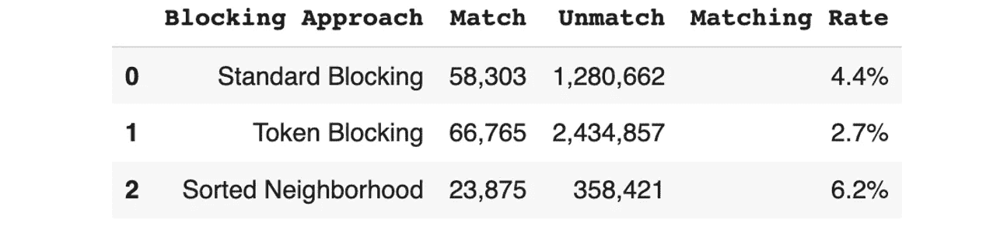

# 实体解析：识别嘈杂数据中的真实世界实体

> 原文：[`towardsdatascience.com/entity-resolution-identifying-real-world-entities-in-noisy-data-3e8c59f4f41c?source=collection_archive---------3-----------------------#2023-09-21`](https://towardsdatascience.com/entity-resolution-identifying-real-world-entities-in-noisy-data-3e8c59f4f41c?source=collection_archive---------3-----------------------#2023-09-21)

## 基本理论和 Python 实现

[](https://medium.com/@tnmasui?source=post_page-----3e8c59f4f41c--------------------------------)[](https://towardsdatascience.com/?source=post_page-----3e8c59f4f41c--------------------------------) [Tomonori Masui](https://medium.com/@tnmasui?source=post_page-----3e8c59f4f41c--------------------------------)

·

[关注](https://medium.com/m/signin?actionUrl=https%3A%2F%2Fmedium.com%2F_%2Fsubscribe%2Fuser%2F703ffb2ff12d&operation=register&redirect=https%3A%2F%2Ftowardsdatascience.com%2Fentity-resolution-identifying-real-world-entities-in-noisy-data-3e8c59f4f41c&user=Tomonori+Masui&userId=703ffb2ff12d&source=post_page-703ffb2ff12d----3e8c59f4f41c---------------------post_header-----------) 发表在 [Towards Data Science](https://towardsdatascience.com/?source=post_page-----3e8c59f4f41c--------------------------------) ·19 分钟阅读·2023 年 9 月 21 日[](https://medium.com/m/signin?actionUrl=https%3A%2F%2Fmedium.com%2F_%2Fvote%2Ftowards-data-science%2F3e8c59f4f41c&operation=register&redirect=https%3A%2F%2Ftowardsdatascience.com%2Fentity-resolution-identifying-real-world-entities-in-noisy-data-3e8c59f4f41c&user=Tomonori+Masui&userId=703ffb2ff12d&source=-----3e8c59f4f41c---------------------clap_footer-----------)

--

[](https://medium.com/m/signin?actionUrl=https%3A%2F%2Fmedium.com%2F_%2Fbookmark%2Fp%2F3e8c59f4f41c&operation=register&redirect=https%3A%2F%2Ftowardsdatascience.com%2Fentity-resolution-identifying-real-world-entities-in-noisy-data-3e8c59f4f41c&source=-----3e8c59f4f41c---------------------bookmark_footer-----------)

图片由作者使用 Midjourney 生成

在当今数据驱动的世界中，组织常常面临多样且不一致的数据来源的挑战。实体解析，也称为记录链接或去重，帮助识别和合并在数据集内或跨数据集没有共享唯一标识符的重复或相关记录。准确的实体解析提高了数据质量，增强了决策制定，并提供了有价值的见解。


实体解析在不一致的数据源中识别相同的现实世界实体（图像由作者提供）

实体解析适用于各种行业。例如，CRM 系统通过解析重复的客户记录来整合客户信息、改善服务和实现精准营销。电子商务平台使用实体解析来合并产品列表，提升搜索功能、推荐系统和客户体验。

在这篇文章中，我们将探讨使用基准数据集的基本实体解析方法的技术细节。

## 目录

+   实体解析概述

+   基准数据集

+   阻断

+   块处理

+   实体匹配

+   聚类

+   集群评估

# 实体解析概述

标准的实体解析（ER）框架包括几个步骤：阻断、块处理、实体匹配和聚类。

**1\. 阻断**：这是实体解析的第一步，旨在通过将数据集划分为较小、可管理的块来减少搜索空间，从而识别相同的实体。这些块包含共享类似属性的记录，使后续的比较更加高效。

**2\. 块处理**：此步骤通过丢弃两种不必要的比较来精化块，从而最小化比较的数量：冗余比较，即在多个块中重复出现的比较，以及无用比较，即涉及不太可能匹配的记录的比较。

**3\. 实体匹配**：这一阶段专注于比较块中的记录，以根据记录的相似性寻找匹配。可以使用各种相似性度量和匹配算法来将记录对分类为匹配或不匹配。

**4\. 聚类**：聚类涉及根据记录的相似性将匹配的记录分组到集群中。创建的集群可以用于获取实体的综合视图。


实体解析工作流程（图像由作者提供）

# 基准数据集

在接下来的章节中，我们将深入探讨实体解析过程中的每个步骤的更多细节，并使用基准数据集进行 Python 实现。

该数据集来源于[莱比锡大学数据库组](https://dbs.uni-leipzig.de/research/projects/object_matching/benchmark_datasets_for_entity_resolution)，并获得了[创作共用](https://creativecommons.org/licenses/by/4.0/)许可证，来源于实际的[MusicBrainz](https://musicbrainz.org/)数据库中有关歌曲的记录，但经过[**DAPO** 数据污染工具](https://vsis-www.informatik.uni-hamburg.de/getDoc.php/publications/568/Panse-TBD2021-Preprint.pdf)故意进行了修改。该工具向数据集中注入了重复项和错误，导致数据集中包含了 50%原始记录的重复项，覆盖了两个到五个来源。这些重复项具有较高的损坏程度，作为评估 ER 和聚类方法有效性的严格测试。

我们可以使用以下代码加载数据。

```py
import requests
from io import BytesIO
import pandas as pd

url = "https://raw.githubusercontent.com/tomonori-masui/entity-resolution/main/data/musicbrainz_200k.csv"
res = requests.get(url)
df = pd.read_csv(BytesIO(res.content))
```

一些示例记录如下所示。


每条记录代表一首歌曲，具有诸如艺术家、标题、专辑、年份等属性（你可以在[这个链接](https://dbs.uni-leipzig.de/files/datasets/saeedi/musicBrainz_readme.txt)中找到字段描述）。`CID`是集群 ID，具有相同`CID`的记录是重复的（在上面的示例中，所有三条记录代表同一首歌曲）。我们的目标是在这个嘈杂的数据集中识别这些重复项。

为了简化工作，我们只关注英文歌曲。下面的代码识别出具有英文歌曲的集群 ID 的记录。

```py
english_cids = df[
    df.language.str.lower().str.contains("^en|^eg", na=False)
].CID.unique()

df = df[df.CID.isin(english_cids)].reset_index(drop=True)
```

我们还对一些字符串字段进行预处理，以获得标准化的值。

```py
for col in ["title", "artist", "album"]:
    df[col] = (
        df[col]
        .str.lower()
        .replace("[^a-z0-9]", " ", regex=True)  # replacing special characters with a space
        .replace(" +", " ", regex=True)         # removing consecutive spaces
        .str.strip()                            # removing leading and tailing spaces
    )

df.loc[df.number.notna(), "number"] = (
    df[df.number.notna()]
    .number.replace("[⁰-9]", "", regex=True)              # removing non-digits
    .apply(lambda x: str(int(x)) if len(x) > 0 else None)  # removing leading zeros
)
```

请注意，这个基准数据集是一个单一的数据集，如果你有多个数据来源需要解决实体问题，你需要标准化它们的数据模式，并将这些多个数据源整合成一个统一的数据集，然后再继续后续步骤。

# 阻断

阻断是实体解析的第一步，它根据某些属性将相似记录分组。通过这样做，过程将搜索范围缩小到仅考虑每个块内的比较，而不是检查数据集中的所有可能记录对。这显著减少了比较的数量，加快了 ER 过程。由于跳过了许多比较，这可能会导致错过真实匹配。因此，阻断应该在效率和准确性之间取得良好的平衡。在本节中，我们将探索三种不同的阻断方法（标准阻断、标记阻断和排序邻域），以找到最佳的平衡点。

## 标准阻断

最直接的块处理技术是根据特定属性将数据集划分为块。例如，在我们的数据集中，可以根据 `Artist` 或 `Title` 字段创建块。这种方法直观且易于实现，但其有效性对噪声非常敏感，因为重复项的阻塞键有一点点不同就会把它们放在不同的块中。


在艺术家字段上的标准块示例（图像由作者提供）

我们可以使用以下函数获得标准块。字典 `blocks` 将存储阻塞键（`key`）及其对应的已阻塞记录的索引（`idx`）。

```py
from collections import defaultdict

def standard_blocking(field_values: pd.Series) -> dict[str, list]:

    blocks = defaultdict(list)
    for idx, key in enumerate(field_values):
        if key is not None:
            blocks[key].append(idx)

    return blocks
```

在以下代码中，我们使用 `title`、`artist` 和 `album` 字段创建三个独立的标准块。

```py
sb_title = standard_blocking(df.title)
sb_artist = standard_blocking(df.artist)
sb_album = standard_blocking(df.album)
```

## 令牌块

令牌块处理的重点是将属性值分解（即令牌化）为更小的单位，称为令牌，然后使用这些令牌创建用于比较的块。令牌通常是从文本中提取的单个单词或小的 n-gram（长度为`n`的子字符串）。令牌块为每个不同的令牌值创建一个块，而不考虑相关属性：如果两个记录在其任何属性中共享一个令牌，它们将位于同一个块中。这产生了高召回率，因为冗余（即单个记录可以属于多个块），代价是低精确度。


令牌块的示例（图像由作者提供）

以下函数基于单词令牌生成令牌块。请注意，我们排除了停用词（例如“a”、“the”、“is”等）中的令牌。

```py
from nltk.tokenize import word_tokenize

def token_blocking(df: pd.DataFrame, stop_words: set) -> dict[str, list]:

    blocks = defaultdict(list)

    for i, row in enumerate(df.itertuples()):

        # concatenate columns and tokenize
        string = " ".join([str(value) for value in row if not pd.isna(value)])
        tokens = set(
            [word for word in word_tokenize(string) if word not in stop_words]
        )

        # create blocks
        for token in tokens:
            blocks[token].append(i)

    return blocks
```

由于我们知道哪些字段与创建块相关，我们仅使用特定字段（`title`、`artist` 和 `album`）来执行令牌块处理：

```py
import string
from nltk.corpus import stopwords

columns = ['title', 'artist', 'album']
stop_words = set(stopwords.words('english') + list(string.punctuation))
token_blocks = token_blocking(df[columns], stop_words)
```

## 排序邻域

排序邻域按特定字段的值进行字母顺序排序。一个固定大小的窗口在排序后的记录上滑动，窗口内的所有可能对被标识为比较的候选对。请注意，它直接生成一对对的列表，而不是块。虽然这种方法有效处理了阻塞字段中的噪声，但选择较小的窗口会牺牲召回率以提高精度，而较大的窗口具有更高的召回率但精度较低。


带有窗口大小为 3 的排序邻域示例（图像由作者提供）

以下代码执行窗口大小为 3 的排序邻域，使用 `title`、`artist` 和 `album` 字段作为排序键。

```py
def sorted_neighborhood(
    df: pd.DataFrame, keys: list, window_size: int = 3
) -> np.ndarray:

    sorted_indices = (
        df[keys].dropna(how="all").sort_values(keys).index.tolist()
    )
    pairs = []
    for window_end in range(1, len(sorted_indices)):
        window_start = max(0, window_end - window_size)
        for i in range(window_start, window_end):
            pairs.append([sorted_indices[i], sorted_indices[window_end]])

    return np.array(pairs)

columns = ['title', 'artist', 'album']
sn_pairs = sorted_neighborhood(df, columns)
```

我们将在接下来的两个部分中进行块处理和实体匹配后，比较这三种方法的性能。

# 块处理

这一步旨在提高块的精度，同时保持可比较的召回率水平。相关技术包括在输入块集合`B`内减少不必要和冗余的比较，从而生成一个具有改进精度的新块集合`B'`。我们将在本节探讨一些主要的块处理技术。

## 块清理

块清理设置块大小的上限，并清除大小超过限制的块。它假设过大的块由冗余比较主导，这意味着这些块中包含的重复项更可能出现在其他较小的块中。

下面的代码按预定的限制值（此处设为 1000 条记录）清除块。它还过滤掉只有一条记录的块，因为这些块不生成可比较的对。我们在前一节的三个标准块和标记块上执行此`purge_blocks`函数。

```py
def purge_blocks(
    blocks: dict[str, list], purging_threshold: int = 1000
) -> dict[str, list]:

    blocks_purged = {
        key: indices
        for key, indices in blocks.items()
        if len(indices) < purging_threshold and len(indices) > 1
    }

    return blocks_purged

token_blocks = purge_blocks(token_blocks)
sb_title = purge_blocks(sb_title)
sb_artist = purge_blocks(sb_artist)
sb_album = purge_blocks(sb_album)
```

## 元块

元块转换输入块集合为图（或邻接矩阵），其中每个节点对应一条记录，边连接每对在块中共同出现的记录。边权重表示跨块对出现频率：权重越高，匹配可能性越大。低权重的边被剪枝，因为它们可能代表多余的比较。因此，对于每个保留的边，生成一个新块，导致精细化的块集合（或作为每个精细化块仅有一对记录的对列表）。


元块示例（作者提供的图片）

我们仅对标记块执行元块，因为它们在块之间有很多重叠。下面的代码首先从标记块中创建一对对的列表，然后将其转换为邻接矩阵。

```py
import itertools
from scipy.sparse import csr_matrix

def get_pairs_from_blocks(blocks: dict[str, list]) -> list[list]:
    return [
        pair
        for indices in blocks.values()
        for pair in list(itertools.combinations(indices, 2))
    ]

def get_adjacency_matrix_from_pairs(
    pairs: list[list], matrix_shape: tuple[int, int]
) -> csr_matrix:

    idx1 = [pair[0] for pair in pairs]
    idx2 = [pair[1] for pair in pairs]
    ones = np.ones(len(idx1))

    return csr_matrix(
        (ones, (idx1, idx2)), shape=matrix_shape, dtype=np.int8
    )

pairs = get_pairs_from_blocks(token_blocks)
adj_matrix = get_adjacency_matrix_from_pairs(pairs, (len(df), len(df)))
```

接下来，我们根据边权重在邻接矩阵中剪枝。在这里，我们剪枝所有边权重为 1 的边，即仅在单个块中出现的对被修剪。

```py
def prune_edges(
    adj_matrix: csr_matrix,
    edge_weight_threshold: float,
) -> csr_matrix:

    adj_matrix_pruned = adj_matrix >= edge_weight_threshold

    return adj_matrix_pruned

adj_matrix = prune_edges(adj_matrix, edge_weight_threshold=2)
```

接着，我们从经过剪枝的邻接矩阵中获取对。

```py
def get_pairs_from_adj_matrix(adjacency_matrix: csr_matrix) -> np.ndarray:
    return np.array(adjacency_matrix.nonzero()).T

tb_pairs = get_pairs_from_adj_matrix(adj_matrix)
```

## 块的并集

对于标准块，我们获取三个独立块的并集。首先，我们将块转换为邻接矩阵列表。

```py
adj_matrix_list = []
for blocks in [sb_title, sb_artist, sb_album]:
    pairs = get_pairs_from_blocks(blocks)
    adj_matrix_list.append(
        get_adjacency_matrix_from_pairs(pairs, (len(df), len(df)))
    )
```

接着，我们从矩阵的并集和其中的候选对中获取结果。

```py
def get_union_of_adj_matrices(adj_matrix_list: list) -> csr_matrix:

    adj_matrix = csr_matrix(adj_matrix_list[0].shape)
    for matrix in adj_matrix_list:
        adj_matrix += matrix

    return adj_matrix

adj_matrix_union = get_union_of_adj_matrices(adj_matrix_list)
sb_pairs = get_pairs_from_adj_matrix(adj_matrix_union)
```

下表总结了三种不同块处理方法生成的最终候选对数量。


我们将通过查看下一节中的匹配结果来确定哪个最适合我们的数据。

# 实体匹配

在这一步骤中，我们从上一步生成的候选对中识别匹配对。虽然有多种方法可以找到匹配，但一种简单直接的方法可以如下概述：

1.  **在每个属性上测量相似度**

    你可以使用任何相似性度量，如余弦相似度、杰卡德相似度或莱文斯坦距离相似度，根据你的数据或具体要求的适用性。在计算某些度量的相似性之前，文本字段可能需要进行分词。

1.  **计算整体相似性**

    此步骤将每个属性的相似性组合成一个整体的相似性分数，可以通过应用手动定义的规则或利用在标记数据上训练的机器学习模型来实现。

1.  **确定匹配**

    对整体相似性分数应用相似性阈值以找到匹配


实体匹配示例（图片由作者提供）

以下函数 `get_field_similarity_scores` 处理上述第 1 步。如果 `sim_type` 设置为 `“fuzzy”`，则计算 [余弦相似度](https://en.wikipedia.org/wiki/Cosine_similarity)；否则，进行精确匹配。余弦相似度是在字符级 3-grams 上计算的，这些 3-grams 通过使用来自 scikit-learn 的 `[CountVectorizer](https://scikit-learn.org/stable/modules/generated/sklearn.feature_extraction.text.CountVectorizer.html)` 模块从输入字符串中向量化。我们计算 `title`、`artist` 和 `album` 字段的余弦相似度，同时对 `number` 字段进行精确匹配。

```py
from sklearn.preprocessing import normalize
from sklearn.feature_extraction.text import CountVectorizer

def get_field_similarity_scores(
    df: pd.DataFrame, pairs: np.ndarray, field_config: dict[str, str]
) -> dict[str, np.ndarray]:
    """
    Measuring similarity by field. It is either cosine similarity
    (if sim_type == 'fuzzy') or exact match 0/1 (if sim_type == 'exact'). 
    Attribute's similarity scores are stored in field_score dictionary 
    with the field name as key.
    """

    field_scores = {}

    for field, sim_type in field_config.items():
        if sim_type == "fuzzy":
            field_scores[field] = cosine_similarities(
                df[field].fillna(""), pairs
            )
        else:
            field_scores[field] = exact_matches(df[field], pairs)

    return field_scores

def cosine_similarities(
    field_values: pd.Series, pairs: np.ndarray
) -> np.ndarray:
    """
    Computing cosine similarities on pairs
    """

    token_matrix_1, token_matrix_2 = get_token_matrix_pair(
        field_values, pairs
    )
    cos_sim = cosine_similarities_on_pair_matrices(
        token_matrix_1, token_matrix_2
    )

    return cos_sim

def get_token_matrix_pair(
    field_values: pd.Series, pairs: np.ndarray,
) -> tuple[csr_matrix, csr_matrix]:
    """
    Converting pairs into matrices of token counts (matrix of records 
    by tokens filled with token counts). 
    """

    all_idx = np.unique(pairs)
    vectorizer = CountVectorizer(analyzer="char", ngram_range=(3, 3))
    vectorizer.fit(field_values.loc[all_idx])
    token_matrix_1 = vectorizer.transform(field_values.loc[pairs[:, 0]])
    token_matrix_2 = vectorizer.transform(field_values.loc[pairs[:, 1]])

    return token_matrix_1, token_matrix_2

def cosine_similarities_on_pair_matrices(
    token_matrix_1: csr_matrix, token_matrix_2: csr_matrix
) -> np.ndarray:
    """
    Computing cosine similarities on pair of token count matrices.
    It normalizes each record (axis=1) first, then computes dot product
    for each pair of records.
    """

    token_matrix_1 = normalize(token_matrix_1, axis=1)
    token_matrix_2 = normalize(token_matrix_2, axis=1)
    cos_sim = np.asarray(
        token_matrix_1.multiply(token_matrix_2).sum(axis=1)
    ).flatten()

    return cos_sim

def exact_matches(
    field_values: pd.Series, pairs: np.ndarray
) -> np.ndarray:
    """
    Performing exact matches on pairs
    """

    arr1 = field_values.loc[pairs[:, 0]].values
    arr2 = field_values.loc[pairs[:, 1]].values

    return ((arr1 == arr2) & (~pd.isna(arr1)) & (~pd.isna(arr2))).astype(int)

field_config = {
    # <field>: <sim_type>
    "title": "fuzzy",
    "artist": "fuzzy",
    "album": "fuzzy",
    "number": "exact",
}

field_scores_sb = get_field_similarity_scores(df, sb_pairs, field_config)
```

## 基于规则的匹配


基于规则的匹配（图片由作者提供）

在计算特定领域的相似性分数后，我们希望将它们组合成一个整体的相似性分数，如上述第 2 步所述。我们在这里采用了一个非常简单的方法：仅计算属性分数的平均值，随后应用一个分数阈值来识别匹配（第 3 步）。下面的阈值值已在这里调整过，但你可能需要通过查看一些匹配/不匹配的示例来调整它，当你处理自己的数据集时。

```py
def calc_overall_scores(field_scores: dict[str, np.ndarray]) -> np.ndarray:
    return np.array(list(field_scores.values())).mean(axis=0)

def find_matches(scores: np.ndarray, threshold: float) -> np.ndarray:
    return scores >= threshold

scores_sb = calc_overall_scores(field_scores_sb)
is_matched_sb = find_matches(scores_sb, threshold=0.64)
```

上面的代码对标准块中的对进行了匹配。此外，我们将此匹配过程扩展到来自 token block 和 sorted neighborhood 的对，允许我们比较它们的表现。下面的代码在表格中总结了比较结果。

```py
from IPython.display import display
from collections import Counter

def show_results(
    is_matched_list: list[np.ndarray],
    blocking_approach_name_list: list[str],
):

    result = pd.DataFrame(
        [Counter(is_matched).values() for is_matched in is_matched_list],
        columns=["Unmatch", "Match"],
    )
    result["Blocking Approach"] = blocking_approach_name_list
    result["Matching Rate"] = result.Match / (
        result.Match + result.Unmatch
    )
    result["Matching Rate"] = result["Matching Rate"].map("{:.1%}".format)
    result["Match"] = result["Match"].map("{:,}".format)
    result["Unmatch"] = result["Unmatch"].map("{:,}".format)

    display(
        result[["Blocking Approach", "Match", "Unmatch", "Matching Rate"]]
    )

is_matched_list = [is_matched_sb, is_matched_tb, is_matched_sn]
blocking_approach_name_list = [
    "Standard Blocking",
    "Token Blocking",
    "Sorted Neighborhood",
]
show_results(is_matched_list, blocking_approach_name_list)
```

下面是输出结果。



如表中所示，Token Blocking 产生了最多的匹配数，而 Sorted Neighborhood 的匹配率最高。由于 Token Blocking 可能错过的匹配最少，我们将继续使用这种方法的结果。值得注意的是，我们的小数据集并未显示出可扩展性问题。然而，对于较大的数据集，其中 Token Blocking 可能不可行，你可能需要考虑其他更具可扩展性的方法。

## 机器学习匹配


机器学习匹配（图片由作者提供）

如果您有标记数据或手动标记的样本对（作为匹配或非匹配），您可以训练一个机器学习模型来预测匹配的对。由于我们的数据具有集群标签`CID`，我们将这些转换为对的匹配标签（匹配/非匹配），并训练一个机器学习模型，随后与前一节中执行的基于规则的方法进行性能比较。

以下代码生成模型输入`X`和相应的目标变量`y`。同一集群`CID`内的对被标记为匹配（`y = 1`），而不同集群内的对被标记为非匹配（`y = 0`）。

```py
def get_x_y(
    field_scores: dict[str, np.ndarray],
    pairs: np.ndarray,
    df: pd.DataFrame,
) -> tuple[pd.DataFrame, np.ndarray]:

    X = pd.DataFrame(field_scores)
    y = df.loc[pairs[:, 0], "CID"].values == df.loc[pairs[:, 1], "CID"].values

    return X, y

X, y = get_x_y(field_scores_tb, tb_pairs, df)
```

接下来，我们将它们分为训练集和测试集，然后训练逻辑回归模型。

```py
from sklearn.model_selection import train_test_split
from sklearn.linear_model import LogisticRegression

X_train, X_test, y_train, y_test = train_test_split(
    X, y, test_size=0.5, random_state=42
)

model = LogisticRegression(random_state=0).fit(X_train, y_train)
```

下面的代码将其性能与基于规则的方法进行比较（`[f1_score](https://scikit-learn.org/stable/modules/generated/sklearn.metrics.f1_score.html)`）。

```py
from sklearn.metrics import f1_score

y_pred = model.predict(X_test)
print(f"Model f1_score: {f1_score(y_test, y_pred):.3f}")

y_rule_base = is_matched_tb[X_test.index.values]
print(f"Rule-base f1_score: {f1_score(y_test, y_rule_base):.3f}")
```

以下是输出：


尽管模型的性能更好，基于规则的方法的性能仍然可能相当不错。

对于接下来的步骤，我们将使用通过基于规则的方法识别出的匹配项，考虑到在许多实际情况下，由于资源限制，手动数据标记可能并不实际。下面的代码从候选对中提取匹配对及其相似性分数及其在标记阻塞上的分数。

```py
matched_pairs = tb_pairs[is_matched_tb]
matched_scores = scores_tb[is_matched_tb]
```

# 聚类

在这一步中，我们基于上一步中的匹配对创建实体集群。每个集群包括所有对应于一个不同现实世界实体的记录。

实体解析的聚类有几个要求：

1.  **无约束算法**

    算法不应需要任何领域特定的参数作为输入，例如集群数或集群直径。

1.  **处理不完整相似性矩阵的能力**

    由于实体解析过程不会在每个可能的对上计算相似性（可以描述为 N 乘以 N 矩阵），因此算法必须能够处理不完整的相似性矩阵（或匹配对列表）。

1.  **可扩展性**

    实体解析通常处理大型数据集，因此算法能够处理此类数据非常重要。在大数据情况下，像层次聚类这样的高复杂度算法可能不实际。

对于聚类，我们将研究三种主要的单遍聚类算法：分区（即连接组件）、中心聚类和合并中心聚类，它们都满足要求。这些算法非常高效，因为它们通过一次扫描（或 O(n)时间复杂度）候选对列表来创建集群，尽管其中一些算法要求列表按相似性分数排序。


单遍聚类算法（来源：[`www.vldb.org/pvldb/vol2/vldb09-1025.pdf`](http://www.vldb.org/pvldb/vol2/vldb09-1025.pdf)）

## 划分/连通组件

该算法通过最初将每个节点分配到其单独的集群来启动聚类。然后，它对匹配对的列表进行单次扫描。如果发现不属于同一集群的连接节点，它将合并它们的集群。简而言之，它通过将所有连接节点通过边（即通过配对的匹配记录）分组形成一个集群。该算法可能会创建通过长路径连接不相似记录的集群。

连通组件聚类可以使用 Scipy 模块执行，如下面的代码所示。在执行之前，你需要将配对列表转换为邻接矩阵。

```py
from scipy.sparse.csgraph import connected_components

def connected_components_from_pairs(
    pairs: np.ndarray, dim: int
) -> np.ndarray:

    adjacency_matrix = get_adjacency_matrix_from_pairs(pairs, (dim, dim))
    _, clusters = connected_components(
        csgraph=adjacency_matrix, directed=False, return_labels=True
    )

    return clusters

cc_clusters = connected_components_from_pairs(matched_pairs, len(df))
```

## 中心聚类

该算法[[5]](#299e)执行聚类，其中每个集群都有一个中心，并且每个集群中的所有记录都与该集群的中心相似。它要求相似对的列表按相似度分数的降序排序。然后，算法通过对排序列表的单次扫描来执行聚类。当第一次在扫描中遇到节点`u`时，它被指定为集群中心。任何后续与`u`相似的节点`v`（即，出现在列表中的对`(u, v)`中）都被分配到`u`的集群中，并且在处理过程中不再考虑。


中心聚类示例（图像由作者提供）

## 合并中心聚类

该算法[[6]](#d172)的功能类似于中心聚类，但每当一个与集群`cᵢ`的中心相似的记录也与`cⱼ`的中心相似时，就会合并两个集群`cᵢ`和`cⱼ`。请注意，当两个集群合并时，它不会选择一个单一的中心节点，这意味着合并的集群可以有多个中心节点。该算法可以通过类似的方式进行，即通过对相似对的列表进行单次扫描，同时跟踪通过合并集群连接的记录。


合并中心聚类示例（图像由作者提供）

要执行中心/合并中心聚类，我们首先需要按相似度分数的降序对配对列表进行排序。

```py
def sort_pairs(pairs: np.ndarray, scores: np.ndarray) -> np.ndarray:
    sorted_ids = (-1 * scores).argsort()
    return pairs[sorted_ids]

pairs_sored = sort_pairs(matched_pairs, matched_scores)
```

接下来，下面的代码生成两个配对集合：中心-子节点配对，表示为`center_cluster_pairs`，和合并节点配对，称为`merge_cluster_pairs`。然后，我们可以通过将连通组件应用于这些配对列表来生成中心集群和合并中心集群。

```py
def get_center_cluster_pairs(pairs, dim):

    """
    cluster_centers: 
        a list tracking cluster center for each record.
        indices of the list correspond to the original df indices
        and the values represent assigned cluster centers' indices
    center_cluster_pairs: 
        a list of pairs of indices representing center-child pairs
    merge_cluster_pairs:
        a list of pairs of merged nodes' indices
    """
    cluster_centers = [None] * dim
    center_cluster_pairs = []
    merge_cluster_pairs = []

    for idx1, idx2 in pairs:

        if (
            cluster_centers[idx1] is None
            or cluster_centers[idx1] == idx1
            or cluster_centers[idx2] is None
            or cluster_centers[idx2] == idx2
        ):
            # if both aren't child, those nodes are merged
            merge_cluster_pairs.append([idx1, idx2])

        if cluster_centers[idx1] is None and cluster_centers[idx2] is None:
            # if both weren't seen before, idx1 becomes center and idx2 gets child
            cluster_centers[idx1] = idx1
            cluster_centers[idx2] = idx1
            center_cluster_pairs.append([idx1, idx2])
        elif cluster_centers[idx2] is None:
            if cluster_centers[idx1] == idx1:
                # if idx1 is center, idx2 is assigned to that cluster
                cluster_centers[idx2] = idx1
                center_cluster_pairs.append([idx1, idx2])
            else:
                # if idx1 is not center, idx2 becomes new center
                cluster_centers[idx2] = idx2
        elif cluster_centers[idx1] is None:
            if cluster_centers[idx2] == idx2:
                # if idx2 is center, idx1 is assigned to that cluster
                cluster_centers[idx1] = idx2
                center_cluster_pairs.append([idx1, idx2])
            else:
                # if idx2 is not center, idx1 becomes new center
                cluster_centers[idx1] = idx1

    return center_cluster_pairs, merge_cluster_pairs

center_cluster_pairs, merge_cluster_pairs = get_center_cluster_pairs(pairs_sored, len(df))
ct_clusters = connected_components_from_pairs(center_cluster_pairs, len(df))
mc_clusters = connected_components_from_pairs(merge_cluster_pairs, len(df))
```

# 集群评估

有了集群标签后，我们可以使用[Rand Index](https://scikit-learn.org/stable/modules/generated/sklearn.metrics.rand_score.html)或[调整后的 Rand Index](https://scikit-learn.org/stable/modules/generated/sklearn.metrics.adjusted_rand_score.html)来评估集群的质量。Rand Index 是一种集群评估指标，表示正确聚类在一起或分开的配对比例。其定义如下：

*TP = 在预测簇和真实簇中* ***同时*** *被聚类的对数。*

*TN = 在预测簇和真实簇中* ***分开*** *被聚类的对数。*

***Rand Index*** *= (TP + TN) / 所有可能对数的总数*


Rand Index 计算示例（图片由作者提供）

调整后的 Rand Index 是 Rand Index 的一种修改版本，已为偶然性进行修正。该调整考虑了随机分配的聚类结果可能产生的随机一致性。


调整后的 Rand Index 的方程

我们不会深入探讨上述方程中每个术语的计算方式，但任何对这个主题感兴趣的人可以参考 [KY Yeung 的论文](https://faculty.washington.edu/kayee/pca/supp.pdf)，该论文解释了这个指标并提供了一些示例。

下面的代码提供了使用这些指标的簇比较以及一些额外的基本统计信息。

```py
from sklearn.metrics.cluster import rand_score, adjusted_rand_score
from IPython.display import display

def get_stats(labels, clusters):

    stats = []
    stats.append(f"{rand_score(labels, clusters):.3f}")
    stats.append(f"{adjusted_rand_score(labels, clusters):.3f}")
    clus_dist = pd.Series(clusters).value_counts()
    stats.append(f"{len(clus_dist):,}")
    stats.append(f"{clus_dist.mean():.3f}")
    stats.append(f"{clus_dist.min():,}")
    stats.append(f"{clus_dist.max():,}")

    return stats

def compare_clusters(cluster_list, cluster_names, labels):

    stats_dict = {}
    for clusters, name in zip(cluster_list, cluster_names):
        stats = get_stats(labels, clusters)
        stats_dict[name] = stats

    display(
        pd.DataFrame(
            stats_dict,
            index=[
                "Rand Index",
                "Adjusted Rand Index",
                "Cluster Count",
                "Mean Cluster Size",
                "Min Cluster Size",
                "Max Cluster Size",
            ],
        )
    )

cluster_list = [cc_clusters, ct_clusters, mc_clusters]
cluster_names = ["Connected Components", "Center", "Merge-Center"]
compare_clusters(cluster_list, cluster_names, df.CID)
```

下面是输出结果。


从表中可以看出，连接组件生成的簇较大且簇数最少，而连接组件与 Merge-Center 簇之间的差距最小。相反，Center 簇生成的簇较小且数量最多。请注意，所有三个簇的 Rand Index 都是完美的，因为它们有大量的簇，使得簇间对形成主导地位（即即使是随机簇也会得到相当的 Rand Index）。然而，如果你查看调整后的 Rand Index，Merge-Center 聚类表现最佳，其与连接组件的差异很小。

这就是我们对实体解析框架的探索。你如何处理创建的簇取决于你的具体业务需求或使用案例。如果你的目标是为每个簇建立规范的表示，你可以通过提取每个簇内每个字段的最具代表性的值（如最频繁的值）来实现。

如果你感兴趣，完整的代码可以在下面的 Google Colab 和 GitHub 仓库中找到。

[## Google Colaboratory](https://colab.research.google.com/drive/1Wkw-uaNX9Im9PNnw8CpUgWQHxxDxeiDr?usp=sharing&source=post_page-----3e8c59f4f41c--------------------------------)

### 实体解析

[colab.research.google.com](https://colab.research.google.com/drive/1Wkw-uaNX9Im9PNnw8CpUgWQHxxDxeiDr?usp=sharing&source=post_page-----3e8c59f4f41c--------------------------------) [## entity-resolution/entity_resolution_implementations.ipynb](https://github.com/tomonori-masui/entity-resolution/blob/main/entity_resolution_implementations.ipynb?source=post_page-----3e8c59f4f41c--------------------------------)

### 实体解析

[github.com](https://github.com/tomonori-masui/entity-resolution/blob/main/entity_resolution_implementations.ipynb?source=post_page-----3e8c59f4f41c--------------------------------)

# 参考文献

[1] Christophides 等人，[大数据端到端实体解析：综述](https://arxiv.org/abs/1905.06397)（2019）

[2] Papadakis 等人，[实体解析的近似阻塞技术比较分析](http://www.vldb.org/pvldb/vol9/p684-papadakis.pdf)（2016）

[3] Papadakis 等人，[实体解析的阻塞和过滤技术综述](https://arxiv.org/abs/1905.06167)（2020）

[4] Hassanzadeh 等人，[用于重复检测的聚类算法评估框架](http://www.vldb.org/pvldb/vol2/vldb09-1025.pdf)（2009）

[5] Haveliwala 等人，[用于网页聚类的可扩展技术](https://www.researchgate.net/publication/221035516_Scalable_Techniques_for_Clustering_the_Web)（2000）

[6] Hassanzadeh & Miller，[从重复数据中创建概率数据库](https://www.researchgate.net/publication/220473509_Creating_probabilistic_databases_from_duplicated_data)（2009）
