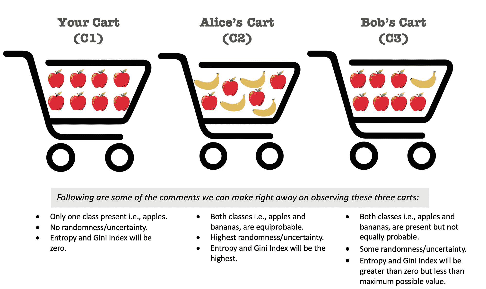
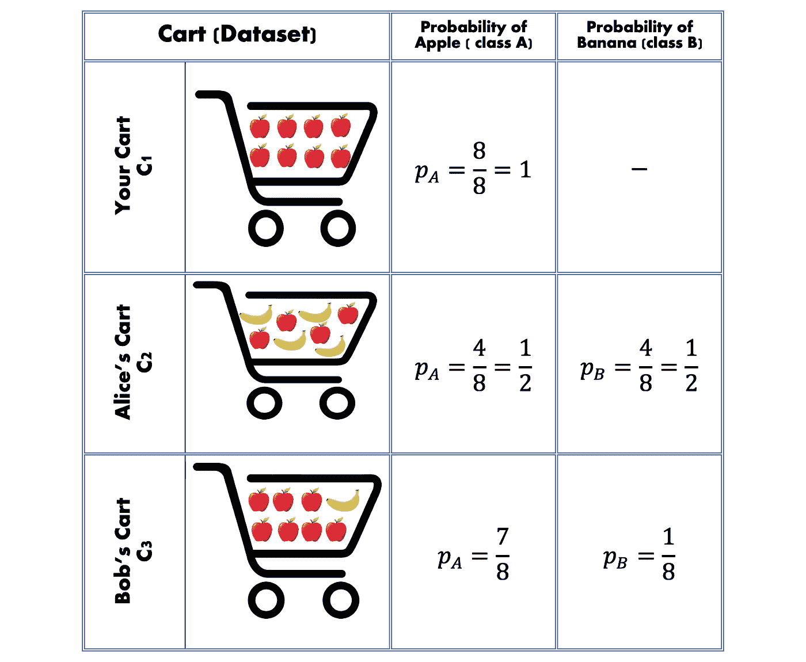
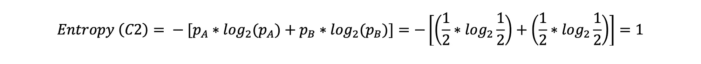
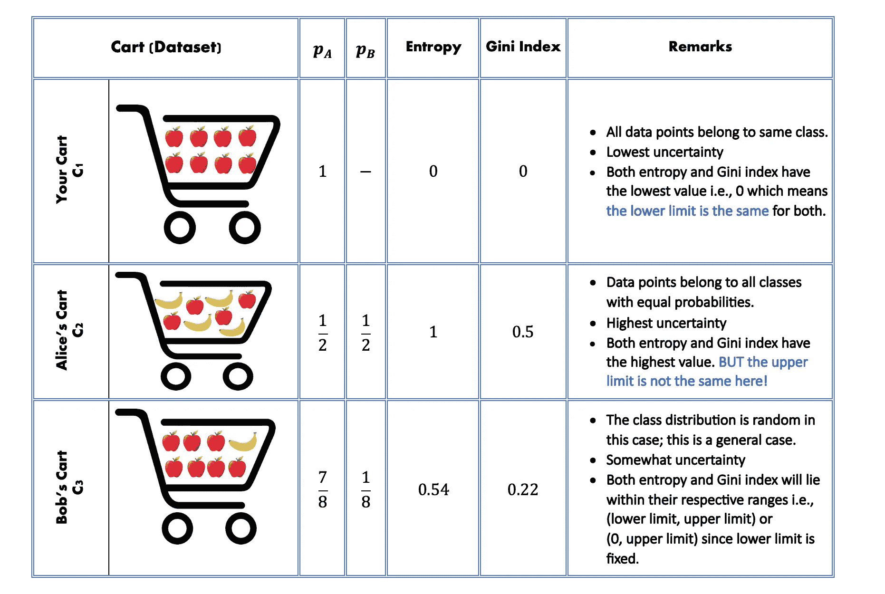
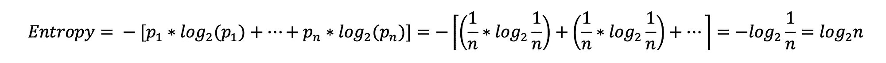

# 熵和基尼指数简介

> 原文：[`towardsdatascience.com/entropy-and-gini-index-c04b7452efbe`](https://towardsdatascience.com/entropy-and-gini-index-c04b7452efbe)

## 理解这些度量如何帮助我们量化数据集中的不确定性

 [Gurjinder Kaur](https://medium.com/@gurjinderkaur95?source=post_page-----c04b7452efbe--------------------------------)

·发表于 [Towards Data Science](https://towardsdatascience.com/?source=post_page-----c04b7452efbe--------------------------------) ·阅读时间 7 分钟·2023 年 11 月 5 日

--

你能告诉哪些是最纯净和最不纯净的购物车吗？（来源：作者提供的图像）

**熵**和**基尼指数**是重要的机器学习概念，特别有助于决策树算法来确定分裂的质量。这两种度量虽然计算方式不同，但最终用于量化数据集中相同的事物，即不确定性（或不纯度）。

> 熵（或基尼指数）越高，数据越随机（混合）。

让我们直观地理解数据集中的不纯度，并了解这些度量如何帮助测量它。（不纯度、不确定性、随机性、异质性——这些都可以在我们的背景下互换使用，目标是最终减少它们以获得更好的清晰度）。

## **什么是不纯度——用例子解释**

想象一下你和你的朋友——*爱丽丝*和*鲍勃*一起去超市买水果。你们每个人都拿了一个购物车，因为你们都不喜欢分享水果。让我们看看你们都买了些什么（看起来你们很喜欢苹果！！）：

作者提供的图像

这三辆购物车可以看作是三种不同的数据分布。如果我们假设最初有两个类别（苹果和香蕉），那么以下的解释将是不正确的。相反，应该将每辆购物车看作是不同的数据分布——第一个购物车的数据分布中所有数据点都属于同一类别，而第二和第三个购物车的数据分布中包含两个类别。

看看上面的例子，很容易识别出数据分布最纯净或最不纯净的购物车（*类别分布*）。但是，为了在数据集中进行数学化的纯度量化，以便算法可以利用它来做出决策，熵和基尼指数就显得尤为重要。

这两种度量都考虑了数据集中每个类别出现（或存在）的概率。在我们的例子中，每种情况都有 8 个数据点（水果），因此我们可以计算每个购物车的类别概率如下：

图片由作者提供

现在我们已经掌握了所有需要的知识，可以深入探讨熵和基尼指数的正式定义了！

> 如前所述，熵和基尼指数都是衡量数据中不确定性或随机性的度量。虽然它们旨在量化相同的基本概念，但各自有自己的数学公式和解释方法来实现这一点。

## 熵

给定一个标签数据集，其中每个标签来自*n*个类别，我们可以按如下方式计算熵。这里，pi 是从类别 i 中随机选择一个元素的概率。

为了确定决策树中的最佳划分，熵用于计算信息增益，并选择在节点处贡献最大信息增益的特征。

## 基尼指数

基尼指数试图通过回答这个问题来量化数据集中的随机性——*从给定的数据中随机选择一个元素的错误标记概率是多少？*

给定一个标签数据集，其中每个标签来自*n*个类别，计算基尼指数的公式如下。这里，pi 是从类别 i 中随机选择一个元素的概率。

这个公式通常也可以重新表述为：

（注意：所有类别概率的总和为 1）。

基尼指数是信息增益的一种替代方法，可以用于决策树中确定划分的质量。在给定节点上，它比较**划分前数据的基尼指数**与**划分后两个分支基尼指数的加权和**之间的*差异*，并选择差异最大（或*基尼增益*）的那个。如果这还不清楚，暂时不用担心，因为这需要更多的背景信息，本文的目标是让你对这些度量的基本含义有一个初步的了解。

## 回到我们的例子

为了更容易理解，以我们的购物车例子为参考，我们有三个数据集——C1、C2 和 C3，每个数据集有 8 条记录，标签来自两个类别——[苹果，香蕉]。使用上表中计算的概率，我们来逐步计算 Alice 的购物车的两个指标：

同样，我们也可以计算 C1 和 C3 的这些指标，并得到以下结果：

图片由作者提供

从上表中，我们可以得出一些有趣的结论关于熵和基尼指数可能的值范围。我们将最低可能值称为 *下界*，将最大可能值称为 *上界*。

## **下界**

当我们的数据完全同质时，熵和基尼指数的下界都是 0。可以参考 cart C1。

## 上界

当数据具有最高的不确定性时，熵和基尼指数分别为 1 和 0.5（可以参考 cart C2，C2 代表了具有最高可能随机性的例子）。

需要注意的一点是，这些上界值仅适用于二分类（因为这就是我们的两类苹果-香蕉示例所代表的情况）。在 **n** 个类别且每个类别的概率相等的情况下，上界将是 **n** 的一个函数，如下所示。

**熵的上界：**

+   **对于二分类**，熵的上界是 1。

+   **对于每个类别具有相同概率的多分类**，熵的上界将是：

**基尼指数的上界：**

+   **对于二分类，** 基尼指数的上界通常不超过 0.5

+   **对于每个类别具有相同概率的多分类**，基尼指数的上界将是：

# 回顾

+   熵和基尼指数用于量化数据集中的随机性，并且对于确定决策树中分裂的质量非常重要。我们可以在这里交替使用随机性、不确定性、杂质和异质性这些术语。

+   熵和基尼指数的高值意味着数据中的随机性较高。

**熵**

> 熵旨在量化数据集的不可预测性。

+   计算熵的公式如下。这里 pi 是从标记为 *i* 的类别中选择一个元素的概率，给定 *n* 个总类别。

+   如果数据由属于单一类别的元素组成，它变得高度可预测，因此熵将是最小的。而熵的最小值是 0。

+   当数据由属于 n 个类别的元素组成且每个类别的概率相等，即每个类别的概率 = 1/n 时，熵将达到最大值。

+   对于二分类（即，具有两个类别的数据），熵的值不会超过 1。

+   对于多分类，熵的最大值可以概括为 log(n)。 (这里的 log 以 2 为底。)

**基尼指数**

> 基尼指数旨在量化从数据中随机选择一个元素并错误标记的概率。

+   公式如下：

+   如果数据由属于单一类别的元素组成，则随机选择一个元素被错误标记的概率将为零，因此在这种情况下基尼指数将是最小的。所以，基尼指数的最小可能值也是 0。

+   当数据由属于 n 个类别且分布均衡的元素组成，即每个类别的概率为 1/n 时，基尼指数将达到最大值。

+   对于二分类（即数据包含两个不同的类别），基尼指数的最大值永远不会超过 0.5。

+   对于多分类，基尼指数的最大值可以概括为 1-(1/n)。
