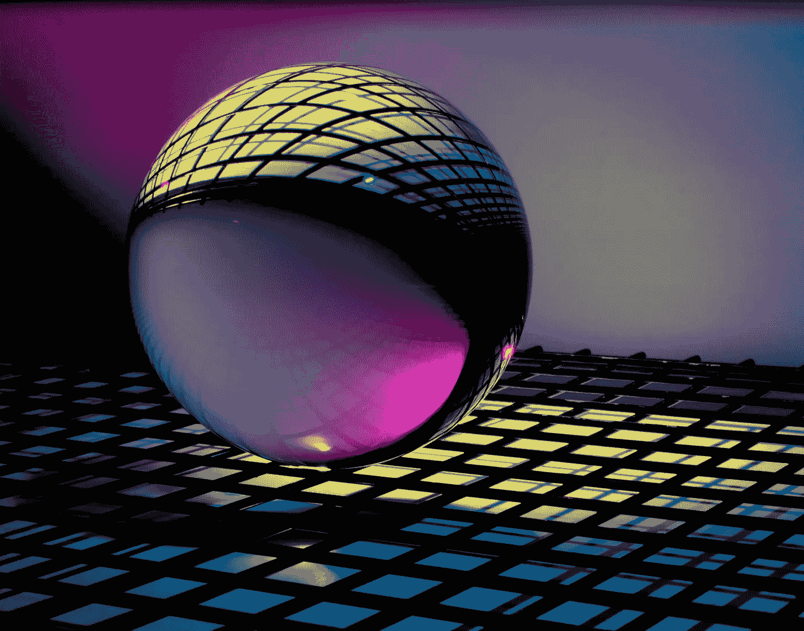
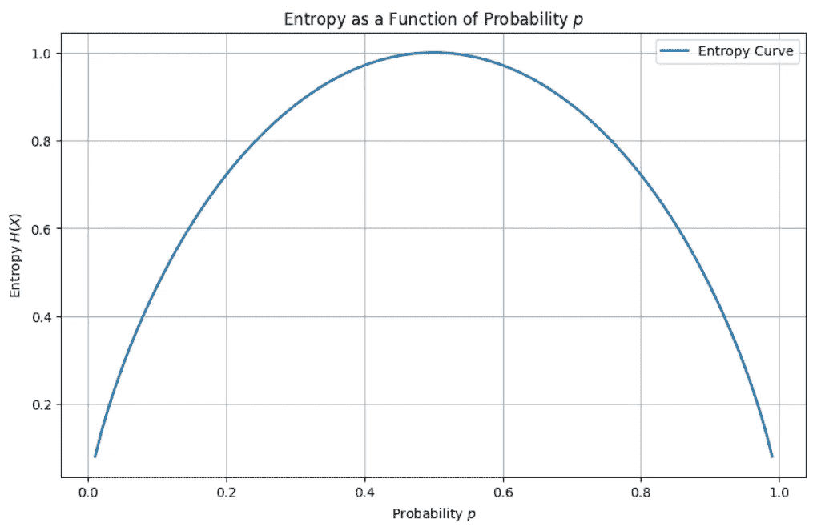
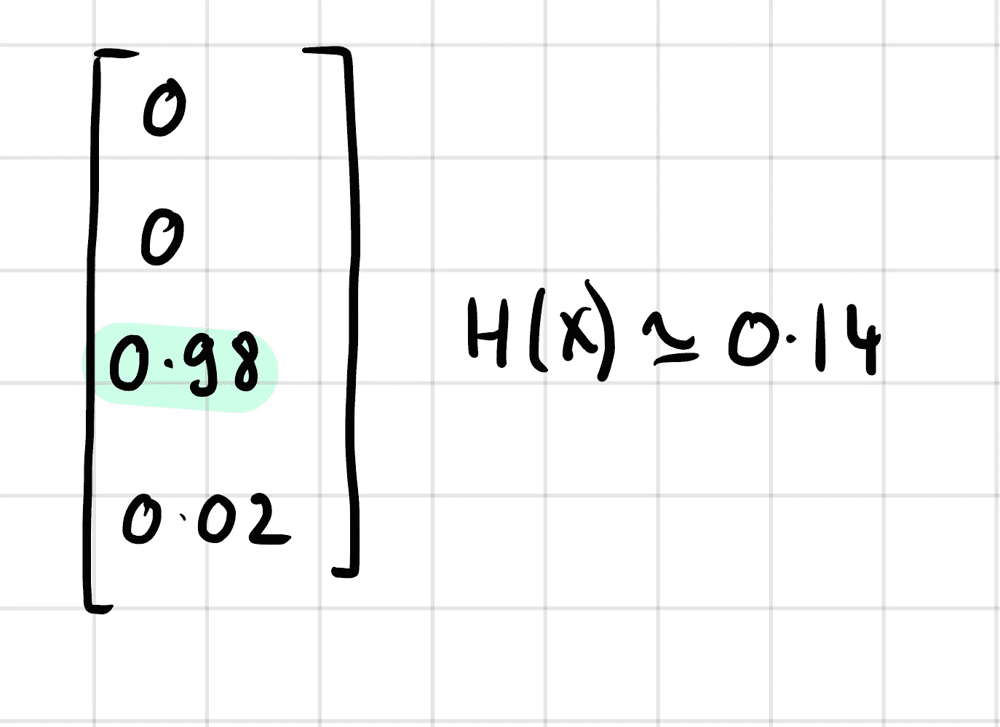
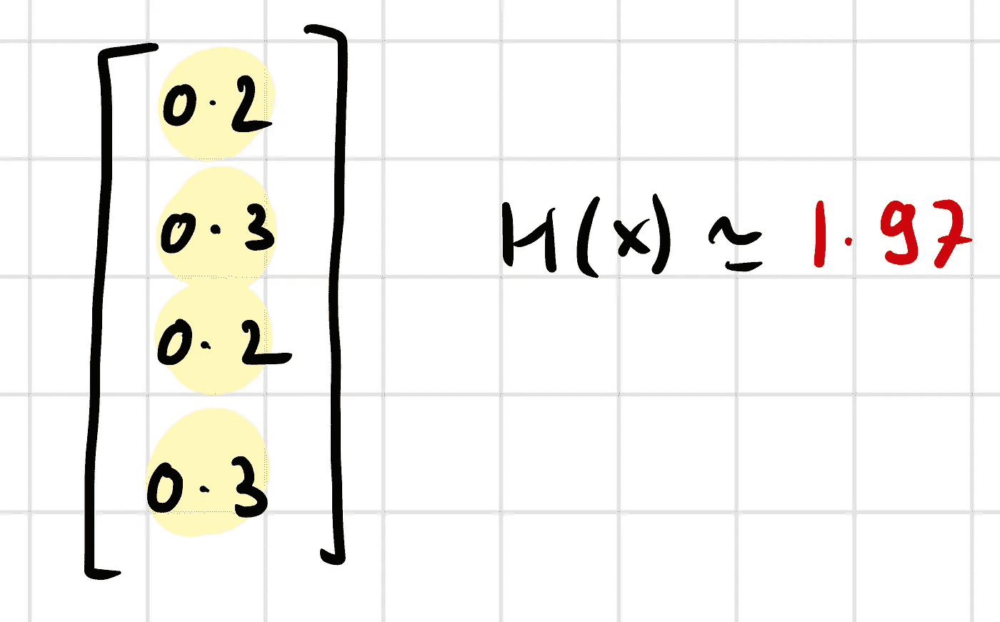
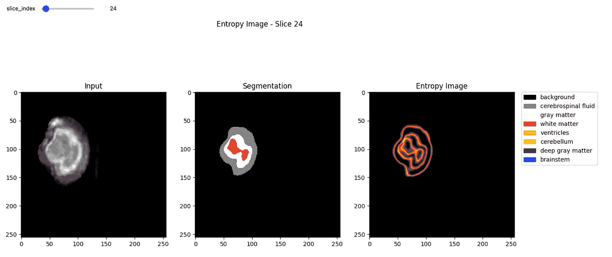
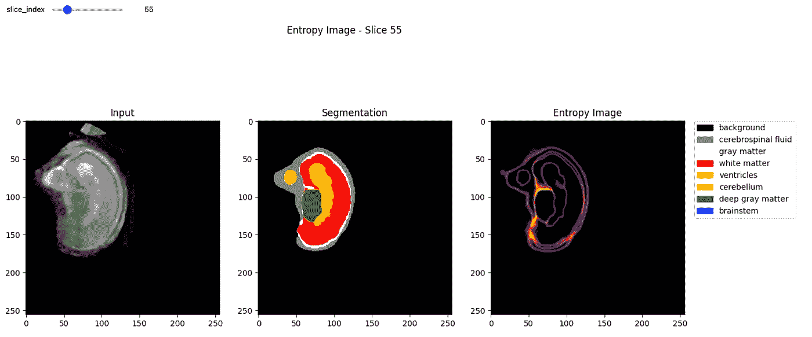

# 基于熵的不确定性预测

> 原文：[`towardsdatascience.com/entropy-based-uncertainty-prediction-812cca769d7a`](https://towardsdatascience.com/entropy-based-uncertainty-prediction-812cca769d7a)

## 本文探讨了如何将熵作为工具用于图像分割任务中的不确定性估计。我们将介绍熵是什么，以及如何使用 Python 实现它。

[](https://medium.com/@francoisporcher?source=post_page-----812cca769d7a--------------------------------)[](https://towardsdatascience.com/?source=post_page-----812cca769d7a--------------------------------) [François Porcher](https://medium.com/@francoisporcher?source=post_page-----812cca769d7a--------------------------------)

·发表于[Towards Data Science](https://towardsdatascience.com/?source=post_page-----812cca769d7a--------------------------------) ·阅读时间 7 分钟·2023 年 9 月 2 日

--



图片由[Michael Dziedzic](https://unsplash.com/@lazycreekimages?utm_source=medium&utm_medium=referral)提供，来源于[Unsplash](https://unsplash.com/?utm_source=medium&utm_medium=referral)

在剑桥大学担任神经成像与人工智能研究科学家的过程中，我面临了使用最新深度学习技术对复杂脑部数据集进行图像分割的挑战，尤其是[nnU-Net](https://medium.com/towards-data-science/the-ultimate-guide-to-nnu-net-for-state-of-the-art-image-segmentation-6dda7f44b935)。在这个过程中，我观察到一个显著的漏洞：不确定性估计被忽视。然而，**不确定性对可靠的决策制定至关重要**。

在深入具体内容之前，请随时查看我的[Github 仓库](https://github.com/FrancoisPorcher)，其中包含了本文讨论的所有代码片段。

# 不确定性在图像分割中的重要性

在计算机视觉和机器学习的领域中，图像分割是一个核心问题。无论是在医疗成像、自动驾驶汽车还是机器人技术中，准确的分割对于有效的决策制定至关重要。然而，一个常被忽视的方面是与这些分割相关的**不确定性度量**。

> 为什么我们需要关注图像分割中的不确定性？

在许多实际应用中，不正确的分割可能导致严重后果。例如，如果自动驾驶汽车误识别了一个物体，或医疗成像系统错误地标记了肿瘤，后果可能是灾难性的。**不确定性估计**为我们提供了一个衡量模型对其预测的“确信程度”的指标，从而有助于做出更明智的决策。

我们还可以使用熵作为不确定性的度量来改善神经网络的学习。这个领域被称为**“主动学习”**。这个想法将在后续文章中进一步探讨，但主要思路是识别模型最不确定的区域，以便集中精力在这些区域。例如，我们可能有一个 CNN 用于脑部医学图像分割，但在肿瘤患者上的表现非常差。然后，我们可以集中精力获取更多这类标签。

# 了解熵

熵是一个从热力学和信息理论中借用的概念，用于量化系统中的不确定性或随机性。在机器学习的背景下，**熵可以用来衡量模型预测的不确定性**。

从数学上讲，对于一个具有概率质量函数 *P*(*x*) 的离散随机变量 *X*，熵 *H*(*X*) 被定义为：

或在连续情况下：

> 熵越高，不确定性越大，反之亦然。

一个经典的例子来充分理解这一概念：

## 情况 1：一个有偏的硬币


由 [Jizhidexiaohailang](https://unsplash.com/@jizhidexiaohailang?utm_source=medium&utm_medium=referral) 在 [Unsplash](https://unsplash.com/?utm_source=medium&utm_medium=referral) 提供的照片

想象一个有偏的硬币，它落在正面上的概率是 *p=0.9*，落在反面上的概率是 *1-p=0.1*。

它的熵是

## 情况 2：平衡硬币

现在让我们想象一个平衡硬币，它落在正面和反面上的概率是 *p=0.5*。

它的熵是：

熵更大，这与我们之前说的一致：更多的不确定性 = 更多的熵。

实际上有趣的是，*p=0.5* 对应于最大熵：



熵可视化，作者提供的图像

从直观上讲，记住均匀分布是具有最大熵的情况。如果每个结果的概率相同，则对应于最大的不确定性。

# 在图像分割中实现熵

将其与图像分割联系起来，考虑到在深度学习中，最终的 softmax 层通常为每个像素提供类别概率。可以根据这些 softmax 输出轻松计算每个像素的熵。

## 但它是如何工作的？

当模型对某个像素属于特定类别有信心时，softmax 层会为该类别显示高概率（~1），而对其他类别显示非常小的概率（~0）。



Softmax 层，确定案例，作者提供的图像

相反，当模型不确定时，softmax 输出在多个类别之间更加均匀分布。



Softmax 层，不确定案例，作者提供的图像

概率分布更加扩散，接近均匀情况，因为模型无法确定哪个类别与该像素相关。

如果你已经坚持到现在，非常好！你应该对熵的工作原理有了很好的直觉。

# 案例研究：医学影像

让我们用一个实际的例子来说明，使用医学影像，特别是胎儿的 T1 大脑扫描。所有与此案例研究相关的代码和图像都可以在我的 [Github 仓库](https://github.com/FrancoisPorcher/awesome-ai-tutorials/tree/main/006%20-%20Entropy%20based%20uncertainty%20for%20Image%20Segmentation) 中找到。

## 1\. 使用 Python 计算熵

如前所述，我们正在处理由我们的神经网络生成的 softmax 输出张量。**这种方法是无模型的**，它仅使用每个类别的概率。

让我们澄清一下我们正在处理的张量维度中的一个重要问题。

如果你正在处理 2D 图像，那么你的 softmax 层的形状应该是：

这意味着对于每个像素（或体素），我们有一个大小为 *Classes* 的向量，这个向量给出像素属于我们所有类别中的每一类的概率。

因此，熵应该沿着第一个维度进行计算：

```py
 def compute_entropy_4D(tensor):
    """
    Compute the entropy on a 4D tensor with shape (number_of_classes, 256, 256, 256).

    Parameters:
        tensor (np.ndarray): 4D tensor of shape (number_of_classes, 256, 256, 256)

    Returns:
        np.ndarray: 3D tensor of shape (256, 256, 256) with entropy values for each pixel.
    """

    # First, normalize the tensor along the class axis so that it represents probabilities
    sum_tensor = np.sum(tensor, axis=0, keepdims=True)
    tensor_normalized = tensor / sum_tensor

    # Calculate entropy
    entropy_elements = -tensor_normalized * np.log2(tensor_normalized + 1e-12)  # Added a small value to avoid log(0)
    entropy = np.sum(entropy_elements, axis=0)

    entropy = np.transpose(entropy, (2,1,0))

    total_entropy = np.sum(entropy)

    return entropy, total_entropy
```

## 2\. 可视化基于熵的不确定性

现在让我们通过在每个图像分割切片上使用热图来可视化不确定性。



T1 扫描（左），分割（中），熵（右），作者图像

让我们看另一个例子：



T1 扫描（左），分割（中），熵（右），作者图像

结果非常好！确实可以看到，这与预期一致，因为高熵区域位于形状的轮廓上。这是正常的，因为模型对于每个区域中间的点并不真正怀疑，而是轮廓或边界难以确定。

# 做出明智的决策

这种不确定性可以以多种不同的方式使用：

1.  随着医学专家越来越多地将 AI 作为工具，了解模型的不确定性至关重要。这意味着医学专家可以将更多的时间花在需要更精细关注的区域。

2\. 在 **主动学习** 或 **半监督学习** 的背景下，我们可以利用基于熵的不确定性来关注具有最大不确定性的例子，从而提高学习效率（更多相关内容将在即将发布的文章中讨论）。

# 主要收获

+   熵是一个非常强大的概念，用于测量系统的随机性或不确定性。

+   可以在图像分割中利用熵。这种方法是无模型的，仅使用 softmax 输出张量。

+   不确定性估计往往被忽视，但它至关重要。优秀的数据科学家知道如何建立好的模型。杰出的数据科学家知道模型在哪些方面失败，并利用这些信息来改进学习。

你喜欢这篇文章并想了解更多吗？查看一下：

[](https://github.com/FrancoisPorcher?source=post_page-----812cca769d7a--------------------------------) [## FrancoisPorcher - 概述

### 剑桥大学人工智能与神经科学的访问研究员。毕业于加州大学伯克利分校…

[github.com](https://github.com/FrancoisPorcher?source=post_page-----812cca769d7a--------------------------------)

**感谢阅读！**

*如果你想访问 Medium 上的优质文章，你只需每月 $5 的会员资格。如果你注册* [***通过我的链接***](https://medium.com/@francoisporcher/membership)*，你将以额外费用支持我。*

# 参考文献

1.  Bai, W., Oktay, O., Sinclair, M., Suzuki, H., Rajchl, M., Tarroni, G., Glocker, B., King, A., Matthews, P. M., & Rueckert, D. (2017). 基于网络的心脏 MR 图像分割的半监督学习。*第 20 届医学图像计算与计算机辅助干预国际会议（MICCAI 2017）论文集*（第 253–260 页）。Springer Verlag。 [`doi.org/10.1007/978-3-319-66185-8_29`](https://doi.org/10.1007/978-3-319-66185-8_29)

1.  Ta, K., Ahn, S. S., Stendahl, J. C., Sinusas, A. J., & Duncan, J. S. (2020). 一种半监督联合网络，用于 4D 超声心动图中的左心室运动跟踪和分割。*医学图像计算与计算机辅助干预：MICCAI 国际会议*，12266（十月），468–477。 [`doi.org/10.1007/978-3-030-59725-2_45`](https://doi.org/10.1007/978-3-030-59725-2_45)

1.  Yu, L., Wang, S., Li, X., Fu, C-W., & Heng, P-A. (2019). 不确定性感知自集成模型用于半监督的 3D 左心房分割。*arXiv*。 [`arxiv.org/abs/1907.07034`](http://arxiv.org/abs/1907.07034)
