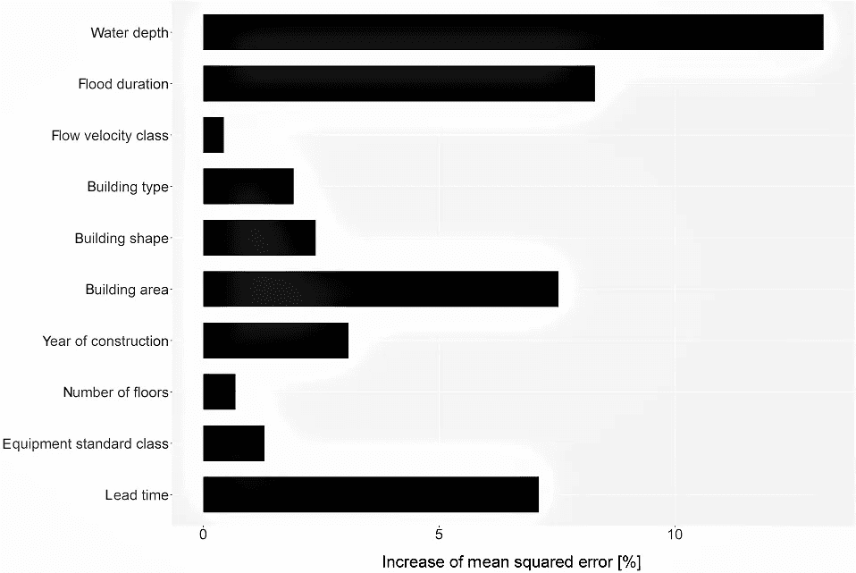

# 环境数据科学：介绍

> 原文：[`towardsdatascience.com/environmental-data-science-an-introduction-127b4b3422dc`](https://towardsdatascience.com/environmental-data-science-an-introduction-127b4b3422dc)

## 处理环境数据的示例、挑战和观点

 [Caroline Arnold](https://medium.com/@caroline.arnold_63207?source=post_page-----127b4b3422dc--------------------------------)

·发布于[Towards Data Science](https://towardsdatascience.com/?source=post_page-----127b4b3422dc--------------------------------) ·7 min read·2023 年 9 月 5 日

--

图片由[Francesco Gallarotti](https://unsplash.com/@gallarotti?utm_source=medium&utm_medium=referral)提供，来源于[Unsplash](https://unsplash.com/?utm_source=medium&utm_medium=referral)

人类生活与环境深度交织。在当前的地质时期，人类世中，我们通过温室气体和化学产品的释放、广泛的基础设施建设和农业活动来塑造环境。

对于数据科学家来说，处理一个主题的自然方式是查看可用的数据及其潜力。环境数据科学领域相对较新，但正在日益受到关注。

气候变化的表现、生物多样性的丧失以及污染的增加，甚至到达深海，已经提高了我们对环境的敏感性。今天，可持续性是政治和非政府活动的主要焦点，我们必须紧急解决如何在保障生计的同时保护环境的问题。

[气候变化人工智能倡议](https://www.climatechange.ai/) 正在与主要的机器学习会议合作，已经推出了一个[环境数据科学的开源期刊](https://www.cambridge.org/core/journals/environmental-data-science)，并且在环境研究和数据科学交叉领域建立了许多研究生项目，例如在[帝国理工学院](https://www.imperial.ac.uk/study/courses/postgraduate-taught/2023/environmental-data-science-machine-learning/)。

据我了解，目前还没有明确的环境数据科学定义。在这篇博文中，我将分享我在环境数据科学方面的经验，基于我作为 AI 顾问在该领域的工作经验。首先，我将通过三个例子展示环境数据科学的多样性：

1.  生物圈监测（分类）

1.  空气污染预测（时间序列）

1.  洪水损害驱动因素（特征重要性）

我将讨论与环境数据相关的挑战，涉及数据稀缺、质量和复杂性。环境数据不同于机器学习中遇到的其他领域的数据，我将提供我对如何应对这些挑战的看法。

最后，我将概述如果我们能够利用环境数据，并结合数据科学和机器学习的力量与对可持续解决方案的日益增长需求，我所看到的前景。

## 使用图像分类监测野生动物

由机器学习算法在照片中识别出的物种。原始图像：作者 GIRAUD Patrick — 自己的作品，CC BY 2.5，[`commons.wikimedia.org/w/index.php?curid=1093844`](https://commons.wikimedia.org/w/index.php?curid=1093844)。注释：作者。

随着人类活动扩展到偏远地区，许多动物和植物物种面临灭绝威胁。野生动物保护工作依赖于对各种感兴趣物种的准确监测。在[Tuia 等人，Nature 2022](https://www.nature.com/articles/s41467-022-27980-y)中，作者列出了非侵入性数据收集设备，如“相机陷阱、消费者相机、声学陷阱[… 和]动物设备”。

收集的数据可以使用机器学习算法高效分析。例如，水坑附近的相机陷阱在动物经过时会捕捉图像。这些图像可以使用计算机视觉算法，如卷积神经网络进行分类。你可能遇到过[猫与狗分类教程](https://www.analyticsvidhya.com/blog/2021/06/beginner-friendly-project-cat-and-dog-classification-using-cnn/)，这些教程可以适应于分类任何其他动物物种，只要有足够的标记数据。

## 预测空气质量时间序列

工业活动、运输和个人交通影响气溶胶的释放到大气中。气溶胶是轻质颗粒，可能对肺部和植物造成损害。它们的扩散不仅取决于释放的初始浓度，还取决于天气。在没有风的炎热日子里，气溶胶将比有轻风的日子停留在地面上更久。

许多城市已实施气溶胶监测系统，固定位置的站点全天测量气溶胶浓度。结果是一个时间序列，如下图所示，来自英国布里斯托尔市：

布里斯托尔三站点的 NOx 浓度数据（2022 年）。数据来源：[`data.opendatasoft.com/explore/dataset/air-quality-data-continuous%40bristol`](https://data.opendatasoft.com/explore/dataset/air-quality-data-continuous%2540bristol)，布里斯托尔市政府，开放政府许可证。绘图：作者。

起初，这些数据将用于监测目的，例如检查是否达到了某些空气质量目标。但我们也可以使用这些数据进行分析，以识别恶劣气溶胶条件的驱动因素。类似于预测股票价格，我们可以使用机器学习生成空气质量预报，以帮助减轻气溶胶的影响。

## 示例 3：水文学—洪水损害监测

[Jonathan Ford](https://unsplash.com/@jonfordphotos?utm_source=medium&utm_medium=referral)拍摄于[Unsplash](https://unsplash.com/?utm_source=medium&utm_medium=referral)。

洪水是最昂贵的自然灾害。2022 年巴基斯坦的大规模洪水事件造成 1700 人遇难，超过 800 万人流离失所，损失估计达到 150 亿美元[[source](https://reliefweb.int/report/world/2022-disasters-numbers)]。估计有 18.1 亿人生活在可能受到洪水影响的地区[[source](https://blogs.worldbank.org/climatechange/flood-risk-already-affects-181-billion-people-climate-change-and-unplanned)]。

随着气候变暖和土地利用变化导致洪水事件的强度和频率增加，急需了解洪水损害的驱动因素。[HOWAS 数据库](https://howas21.gfz-potsdam.de/howas21/?lang=en)收集了洪水事件的定性和定量数据，如建筑物与水源的距离、警报提前时间和建筑特征。目前，它正从最初关注德国和奥地利的数据扩展到全球数据。

在[Kellermann 等，《对象特定的洪水损害数据库 HOWAS 21》，自然灾害与地球系统科学（2021）](https://doi.org/10.5194/nhess-20-2503-2020)中，使用了随机森林回归算法来预测总建筑损害。各种输入特征根据其对算法的重要性进行排名。像这样的高质量数据集有助于改善洪水预警和减轻损害。

通过特征重要性排名获得的洪水损害驱动因素。致谢：Kellermann 等，[`doi.org/10.5194/nhess-20-2503-2020`](https://doi.org/10.5194/nhess-20-2503-2020)。

## 挑战

根据我在这一领域作为研究数据科学家的经验，我看到在使用环境数据方面有四个主要挑战。

**数据稀缺**

收集环境数据可能是一项繁琐的任务。为了获取数据，你实际上需要亲自前往一个地点，设置传感器，或手动采集样本。相比于在网上商店中客户数据通过互联网流入数据库的情况，获取单个样本的成本要高得多。一些地区的难以进入性可能使得获取具有足够空间和时间分辨率的数据变得困难。

通常，环境数据集由几百个样本组成，这些样本的获取成本很高。数据分析和算法必须经过精心选择，并根据需要进行调整。

**专业数据格式**

出于历史原因或方便，环境数据通常以机器学习算法和数据科学管道不容易识别的格式存在。根据我培训环境数据科学家的经验，受训者通常难以将标准机器学习教程中的概念转换为环境数据。

许多机器学习例程依赖于像标准仓库数据一样的数据，这些数据以 csv 或 json 文件形式提供，或以标准图像格式存在。环境数据通常由少数人收集，并且收集协议未考虑数据科学下游应用。因此，数据工程和清理通常是一项重要任务。

**数据质量**

即使数据量充足，数据质量也可能会有显著波动。例如，环境的摄影观察依赖于光线和相机角度，图像之间可能存在很大差异。传感器可能会失效或质量下降，像 HOWAS 这样的定性数据库维护成本高昂。

**领域知识**

处理环境数据、理解布局和提出正确问题的领域知识至关重要。环境数据的标注通常需要大量的专业知识。因此，跨学科项目是常态，其中数据科学家和机器学习专家与领域专家紧密合作。

## 视角

尽管处理环境数据面临诸多挑战，但我相信环境数据科学具有巨大的潜力。可持续性是当今政治和非政府组织讨论的主要焦点，良好的数据可以帮助做出明智的决策。企业正在根据实时数据制定战略，如果在可持续性讨论中看到数据类似的影响将会非常好。

有志于成为环境数据科学家的人员可能会发现，在可持续发展领域工作是有成效和令人满意的。在与自然资源保护、环境监测和可持续政策实施相关的项目中，他们发现比开发第百万个在线营销或加密货币预测算法更具目的性。

我希望未来环境数据科学能成为数据科学和机器学习的一个成熟领域。培养能在环境研究和编程交汇处工作的工程师和科学家是提升该领域成熟度的第一步。随着高质量数据的增加和对可持续性兴趣的增长，我相信环境数据科学在未来将会变得重要。

由 [Marc Schulte](https://unsplash.com/@marc_schulte?utm_source=medium&utm_medium=referral) 提供的照片，来源于 [Unsplash](https://unsplash.com/?utm_source=medium&utm_medium=referral)

## 摘要

总结一下这次关于环境数据科学的介绍，我提供了三个例子来说明这个领域的多样性。处理环境数据面临独特的挑战，主要与数据稀缺性和数据质量相关。

与领域专家和数据科学家进行的跨学科项目可以利用未分析的环境数据。我希望未来环境数据科学能达到一个成熟的阶段，使环境数据直接指导决策并提升可持续性。

## 进一步阅读

+   剑桥环境数据科学期刊：[`www.cambridge.org/core/journals/environmental-data-science`](https://www.cambridge.org/core/journals/environmental-data-science)

+   Tuia 等，野生动物保护中的机器学习观点（2022）：[`www.nature.com/articles/s41467-022-27980-y`](https://www.nature.com/articles/s41467-022-27980-y)

+   Kellermann 等，HOWAS（2020）：[`nhess.copernicus.org/articles/20/2503/2020/`](https://nhess.copernicus.org/articles/20/2503/2020/#section4)

+   Harish 等，越南胡志明市私人防洪措施的驱动因素（2023）：[`nhess.copernicus.org/articles/23/1125/2023/`](https://nhess.copernicus.org/articles/23/1125/2023/)
