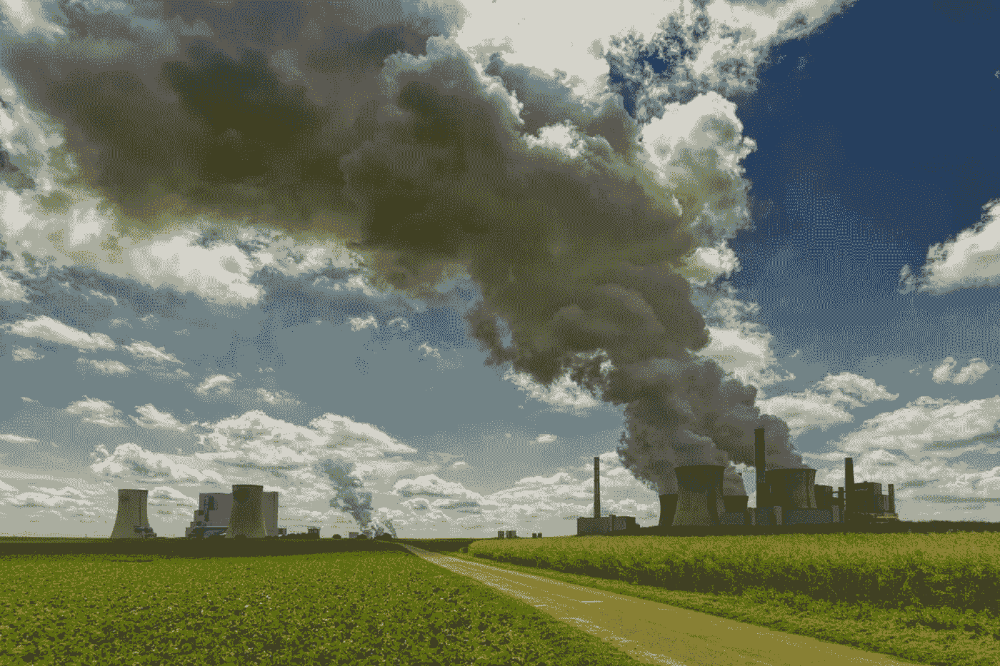
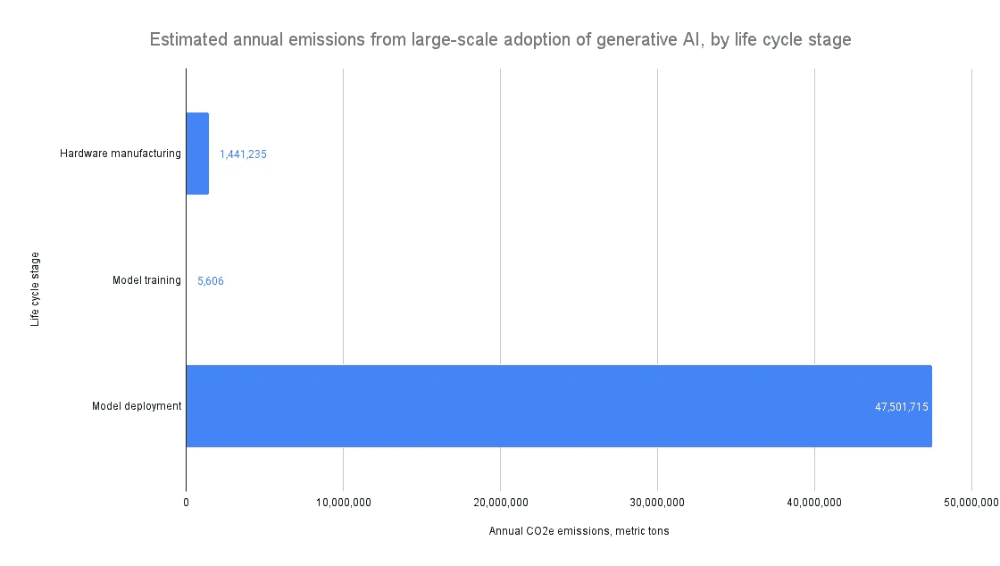

# 普及生成式 AI 的环境影响

> 原文：[`towardsdatascience.com/environmental-impact-of-ubiquitous-generative-ai-9e061bac6800`](https://towardsdatascience.com/environmental-impact-of-ubiquitous-generative-ai-9e061bac6800)

## 如果数十亿人开始每天使用生成式 AI 技术，会对环境产生什么影响？

 [Kasper Groes Albin Ludvigsen](https://kaspergroesludvigsen.medium.com/?source=post_page-----9e061bac6800--------------------------------)

·发布于 [Towards Data Science](https://towardsdatascience.com/?source=post_page-----9e061bac6800--------------------------------) ·15 分钟阅读·2023 年 7 月 12 日

--

由 Johannes Plenio 拍摄，来源于 Unsplash

本文探讨了这样一个问题：大规模采用类似 ChatGPT 的生成式 AI 会对环境产生什么影响？也就是说，如果数十亿人开始每天广泛使用生成式 AI，那么环境影响可能是什么？

这个问题值得思考的原因在于，我们可以通过其答案来决定我们对这项新技术快速普及的担忧程度。

随着 AI 模型越来越大[1]，并且像 OpenAI 和 Google 等公司使其广泛可用，AI 模型的环境影响——例如碳足迹和水足迹——已经成为学术界（如[2]和[3]）以及主流媒体（如[4]和[5]）讨论和研究的主题。

据报道，ChatGPT 的用户数量达到数亿——甚至可能是数十亿[6]——而 Google 将生成式 AI 嵌入到多个产品中[7]，因此生成式 AI 可以说是当前最广泛采用的 AI 类型。结合生成式 AI 模型如 GPT-4 的巨大规模——传闻其规模是前代模型的近 6 倍[8]——生成式 AI 可能也是未来可预见的环境影响最大的 AI 类型。

本文是一个思想实验，考虑了大规模采用生成式 AI 可能带来的环境影响。它会导致环境灾难，还是只是一滴水中海洋，或者介于两者之间？本文的目的是为开始揭示这个问题提供基础。

在本文中做出的估算涉及许多假设，如果你想使用自己的假设进行实验，可以在 [这个电子表格](https://docs.google.com/spreadsheets/d/1fXtR85LTtUiZ25rcPXzHmL4vR03x_hB9GPEWMLFhhXc/edit?usp=sharing) 中进行。

如果你想全面了解我关于 AI 环境影响的故事，请通过下面的链接成为 Medium 会员：

 [## 通过我的推荐链接加入 Medium - Kasper Groes Albin Ludvigsen

### 作为 Medium 会员，你的会员费的一部分会分配给你阅读的作者，你将能完全访问每一篇故事……

[kaspergroesludvigsen.medium.com](https://kaspergroesludvigsen.medium.com/membership?source=post_page-----9e061bac6800--------------------------------)

# AI 系统生命周期的阶段

尽管本文并未分析特定模型，但区分 AI 模型生命周期的不同阶段仍具有参考价值。我们可以将 AI 模型的生命周期视为由 6 个不同阶段组成 [9]：

1.  原材料开采

1.  材料制造

1.  硬件制造

1.  模型训练

1.  模型部署

1.  生命周期结束

在本文中，我将重点关注硬件制造（第 3 阶段）、模型训练（第 4 阶段）和模型部署（第 5 阶段），因此下面将简要描述这些阶段。

硬件制造是指制造 AI 模型运行所需硬件的环境影响。模型训练是模型开发的阶段。模型部署是将模型“部署”到“生产环境”的阶段，用户可以使用模型。这有时也称为推理阶段或生产阶段。生命周期通常被描述为线性的，尽管许多 AI 系统在其生命周期内需要对模型进行重新训练或调整。

为了估算上述三个阶段的环境影响，我们需要了解大规模采用生成式 AI 需要多少硬件。这是我们在接下来的部分将考虑的内容。

 ## ChatGPT 的电力消耗

### ChatGPT 可能在 2023 年 1 月消耗了相当于 175,000 人的电量。

[towardsdatascience.com

# 大规模生成式 AI 的采用需要多少硬件？

为了评估大规模采用生成式 AI 的潜在环境影响，我们需要了解处理每日数十亿次查询所需的硬件数量。

要确定所需的硬件数量，我们需要考虑技术将有多少用户以及他们将使用多少。用户越多，需要的硬件就越多。

那么，大规模生成性 AI 采用在用户数量方面会是什么样的呢？假设 35 亿人开始每天使用 ChatGPT 或类似技术，每天进行 30 次查询。那总共是 105B 次日常请求。鉴于 ChatGPT 的惊人用户数量以及 Google 和其他公司将生成性 AI 集成到各种产品中的努力，这种假设并不不合理。

现在我们需要了解处理 100B 日常请求所需的硬件种类和数量。

Patel 和 Ahmad 曾估算处理 195,000,000 次日常 ChatGPT 请求需要大约 3,617 台 Nvidia HGX A100 服务器，其中包含 28,936 个 Nvidia A100 GPU[10]。A100 GPU 是为 AI 工作负载设计的处理硬件。我们假设这些数字是正确的，并且可以推广到其他生成性 AI 服务。我们进一步假设 GPU 的数量与日常请求的数量呈线性增长。这意味着如果 3,617 台 HGX 服务器可以处理 195,000,000 次日常请求，我们需要 538.46 倍的计算能力——即 1,947,615 台 Nvidia HGX A100 服务器，总共 15,580,923 个 A100 GPU——来处理 105B 次日常请求。

现在我们已经了解了支持大规模采用生成性 AI 所需的硬件数量，让我们来看看制造这些硬件的环境影响。

# 大规模生成性 AI 在硬件制造阶段的环境影响

在上一节中，我们看到大规模采用生成性 AI 技术可能需要 1,947,615 台 Nvidia HGX 服务器和 15,580,923 个 Nvidia A100 GPU。让我们来看一下制造这些硬件的环境影响。

Nvidia 尚未发布其产品的碳足迹信息，因此我们必须使用一些代理数据，这意味着我们得到的数字高度推测，因此请谨慎对待并提出挑战。

根据惠普公司自己的估算，ProLiant DL345 Gen10 Plus 服务器的体现排放为 2,500 kgCO2e[11]。这是我找到的唯一一个具有体现排放数据的相似服务器，因此我们将以此作为类比，就像 Luccioni 等人以前所做的那样[9]。

ProLiant 服务器不包含任何 GPU，所以我们需要加上 8 个 A100 GPU 的体现排放。同样，Nvidia 并未公开这些数据，但其他人已使用了每个 GPU 150 kgCO2e 的数据[9] [12]。

我们假设使用的是带有 8 个 GPU 插槽的 Nvidia HGX，因此我们需要将 8 * 150 kgCO2e 加到 2,500 kgCO2e 中。这总共是每台 Nvidia HGX A100 服务器 3,700 kgCO2e。

记住，我们需要 1,947,615 台这样的服务器来处理 105B 次日常请求。因此，满足大规模采用生成性 AI 所需的 GPU 硬件的体现排放估计为 1,947,615 * 3.7 = 7,206,177 吨 CO2e。

让我们将这些排放均匀分布在硬件的使用寿命内。我们假设硬件的使用寿命为 5 年，之后要么磨损，要么被新技术替代 [13]。

基于此，大规模采用生成式 AI 所需硬件的碳足迹估计为每年 1,441,235.4 吨 CO2e。

 [## 订阅 Kasper Groes Albin Ludvigsen 的文章以获取电子邮件通知。

### 订阅 Kasper Groes Albin Ludvigsen 的文章以获取电子邮件通知。通过注册，你将创建一个 Medium 账户，如果你…

kaspergroesludvigsen.medium.com](https://kaspergroesludvigsen.medium.com/subscribe?source=post_page-----9e061bac6800--------------------------------)

# 大规模生成式 AI 采用的训练阶段的环境影响

现在，让我们考虑训练支撑生成式 AI 的 AI 模型的环境影响。

ChatGPT 的初始版本基于一个名为 GPT-3.5 的大型语言模型（LLM），它是 GPT-3 的一个版本。最新版本的 ChatGPT 可能基于 OpenAI 最新的 LLM——GPT-4，但 OpenAI 尚未发布任何关于 GPT-4 的训练成本信息。不过，我们有关于 GPT-3 训练过程中的能耗的可靠估算。这些数据来源于谷歌和加州大学伯克利分校研究人员的一篇论文，他们估算训练 GPT-3 的能耗为 1,287,000 KWh [14]。我们可以假设其他公司训练的模型在同一范围内。

要计算 1,287,000 KWh 的碳足迹，我们需要了解生产 1 KWh 电力时排放了多少碳。这被称为电力的碳强度，并在不同地区之间有所不同，因为电力来源（风能、煤炭、太阳能等）因地区而异。在这个思考实验中，我们使用谷歌、亚马逊和微软数据中心使用的电力的平均碳强度。根据 ML CO2 Impact Calculator [18]的数据，这三家云服务提供商的电力平均碳强度为 484 gCO2e/KWh。

现在，为了获得生成模型年度碳足迹的估算，我们需要知道有多少公司提供这种模型以及它们的训练频率。假设在生成式 AI 领域将有 9 个主要参与者：OpenAI/Microsoft、Google、Meta、Anthropic、Inflection、Character、腾讯、字节跳动、百度。再假设他们每年训练一个模型。这将导致每年的训练碳足迹为 6,229 吨 CO2e。

本文这一部分的假设是最具推测性的。然而，正如我们将看到的，它们对整体图景的影响不大，因为训练阶段的环境影响与硬件制造和部署阶段的环境影响相比，显得微不足道。

# **大规模生成性人工智能部署阶段的环境影响**

现在让我们考虑生成性人工智能模型部署阶段的环境影响。换句话说，让我们看看运行 1,947,615 台 HGX 服务器所需的电力。

一种计算方法是查看服务器的所谓热设计功率（TDP）。TDP 通常用于量化一块处理硬件运行所需的电力。HGX 服务器的 TDP 未知，但类似的 Nvidia 服务器 DGX 的 TDP 为 6.5 kW [15]，我们假设 HGX 服务器也适用这一数据。因此，如果服务器全功率运行一个小时，则消耗 6.5 千瓦时（kWh）。然而，在这个思维实验中，我们假设所有服务器平均运行在其 TDP 的 75%，那么每小时将消耗 4.875 KWh。共有 1,947,615 台服务器，每台每小时消耗 4.875 KWh。这总计为每小时 9,494,625 KWh，每天 227,871,000 KWh，每年 83,172,915,000 KWh。

计算数据中心级硬件的电力消耗时，通常会将硬件自身的电力消耗乘以硬件所在数据中心的所谓电力使用效率（PUE）。PUE 是用于表达数据中心能源效率的指标。数据中心在冷却等方面使用的能量相对于实际计算硬件的电力使用得越多，PUE 值越高。微软的全球 PUE 为 1.18 [16]，谷歌的为 1.10 [17]，所以我们使用这两个值的平均数，即 1.14。

如果我们将 HGX 服务器估算的年电力消耗 83,172,915,000 KWh 乘以 1.14，则年电力消耗为 94,817,123,100 KWh。

接下来，为了计算碳排放，我们将乘以前一节中提到的 484 克/KWh 的碳强度。基于此，我们可以估算大规模生成性人工智能部署阶段的年碳足迹为 45,891,487 吨。

# 普遍采用生成性人工智能的综合环境影响

现在我们已经估算了硬件制造、训练和大规模部署生成性人工智能的阶段的碳足迹，让我们将这些数据结合起来，计算大规模生成性人工智能采用的年总碳足迹。

回顾我们估算了硬件制造的年排放量为 1,441,235 吨。然后，我们估算了训练阶段的年 CO2e 排放量为 6,229 吨。最后，我们估算了大规模生成性人工智能部署阶段的碳足迹为每年 45,891,487 吨。

因此，普遍采用生成性人工智能的总碳足迹可以估算为每年 47,338,952 吨 CO2e。

下图 1 展示了模型部署阶段的碳排放量比硬件制造和模型训练阶段大得多。因此，研究应关注如何减少部署阶段的排放，而非训练阶段的排放。

图 1：按生命周期阶段估计的大规模采用生成性 AI 的年碳排放量。图表由 Kasper Groes Albin Ludvigsen 提供

# **将大规模采用生成性 AI 的年碳足迹放入视角中**

在整篇文章中，你可能会想：“这些数字究竟意味着什么？这多还是少？”

上面，我们估计大规模采用生成性 AI 的总年碳足迹为 47,338,952 吨 CO2e，包括硬件制造、模型训练和模型部署生命周期阶段。

这相当于 4,303,541 丹麦人的年排放量。这样看来，我认为这听起来很多。另一方面，430 万人只是全球人口的微不足道的一部分。因此，让我们也将普遍生成性 AI 的碳足迹与全球年排放量进行比较。

全球年 CO2e 排放量的估计因来源不同而有所差异，但 IAE [19] 估计 2021 年全球排放了 400 亿吨 CO2e。在这 400 亿吨中，47,338,952 吨占 0.12%。换句话说，如果 35 亿人每天对生成性 AI 模型如 ChatGPT 进行 30 次查询，这篇文章估计可能会使全球 CO2e 排放量增加 0.12%。我将留给读者自己决定是否认为这很多。

# 普遍生成性 AI 采用的水足迹

到目前为止，我们已经分析了大规模采用生成性 AI 的潜在碳足迹。但碳排放并不是数字技术的唯一环境影响。另一个重要的考量是冷却承载大 AI 模型的数据中心的水消耗。水消耗指的是那些丧失且无法再利用的水。

Pengfei Li 等人 [20] 的一篇最新论文分析了类似 ChatGPT 的大型语言模型的水消耗。在他们的论文中，作者提出了一种估计数据中心水消耗的方法，他们估计 ChatGPT 每进行 20 到 50 次查询会消耗 500 毫升水。数据中心的水消耗主要有两种方式：

1.  直接消耗，即水分蒸发并在数据中心硬件冷却时被冲洗掉，以及

1.  间接水消耗，即用于生产数据中心所需电力的水。

假设 ChatGPT 的水消耗可以推广到其他人工智能服务，并且 50 个查询需要 500 毫升的水，即每个查询需要 10 毫升的水。请记住，我们假设生成性人工智能模型每天会收到 105 亿个请求。这每天需要 1,050,000,000 升水，或者每年需要 383,250,000,000 升水。相比之下，成年人每年的推荐液体摄入量为 3.2 升[21]，即每年的摄入量为 1,168 升。这意味着生成性人工智能的大规模应用产生的水消耗可以满足 328,135,000 成人的年液体摄入量。

你可能会想知道为什么水的消耗会成为一个问题。主要问题是，当大量用水的数据中心被放置在受旱灾影响的地区时。这是一个问题，因为我们通常没有将水跨大距离转移所需的基础设施。Pengfei Li 等人的论文展示了这张图，显示了美国受旱灾影响的地区。这些地区有成千上万的数据中心。

图片来源 [`arxiv.org/pdf/2304.03271.pdf`](https://arxiv.org/pdf/2304.03271.pdf)

# 讨论

现在让我们讨论一下上述估算的潜在影响。

## 我们能否用可再生能源为大规模的生成性人工智能应用提供动力？

那么我们如何减少生成性人工智能大规模应用的环境影响呢？

如何估算和减少机器学习模型的碳足迹 ## 如何估算和减少机器学习模型的碳足迹

### 两种简单估算机器学习模型碳足迹的方法以及减少碳足迹的 17 种方法

[towardsdatascience.com

一个浮现在脑海中的想法是用可再生能源为这些数据中心供电。让我们考虑这个想法。

接下来，我将假设对生成性人工智能的所有查询都需要额外的能源。即，我假设这些查询不会替代对其他现有服务的查询。你可能会争辩说，一些 ChatGPT 查询当前替代了传统搜索引擎查询，但考虑到生成性人工智能正在被整合到 Bing 和 Google 中，我敢说几乎所有的生成性人工智能查询都会是额外的。

为了使生成性人工智能的大规模应用具有可持续性，因此能源必须通过*额外的*可再生能源容量来生成——即，我们需要安装额外的可再生能源容量。请记住，普遍的生成性人工智能可能每年需要接近 95 亿千瓦时的电力。平均风力发电机每年可以产生 600 万千瓦时的电力[22]。

因此，为了用风力涡轮机生产足够的可再生能源，我们需要安装大约 15,800 台新的风力涡轮机。为了提供背景，丹麦作为风能领域的领先国家，目前有 6,286 台活跃的风力涡轮机[23]。

因此，我认为可以安全地说，要建立足够的额外可再生能源以支持普遍的生成式人工智能采用，将是一项庞大而昂贵的工作。

附带说明一下，即使是可再生能源也被认为有碳足迹，因为生产和安装例如风力涡轮机所造成的排放会分摊到能源来源的使用寿命中。因此，来自离岸风力发电的电力被认为具有 12 gCO2e/KWh 的中位碳强度[24]。因此，即使所有生成式人工智能都由风能供电，它的年碳足迹也将达到 1,114,000 吨 CO2e——大致相当于 104,000 名丹麦人。

## 其利益是否超过成本？

在这场辩论中另一个有趣的方面是，我们是否能通过生成式人工智能获得的生产力提升足以证明其环境影响的合理性。在一篇尚未经过同行评审的文章中（即，需持保留态度），麻省理工学院博士生 Shakked Noy 和 Whitney Zhang 展示了使用 ChatGPT 在实验环境中提高了若干任务的生产力和工作质量[25]。Noy 和 Zhang 测量了撰写新闻稿、简短报告、分析计划和微妙电子邮件等任务的生产力。质量由（盲测的）在同一职业中工作的经验丰富的专业人士评估。

生产力提升是否值得其环境成本本质上是一种价值判断，但如果我们能确认生成式人工智能是否确实使我们更具生产力，将是辩论的良好开端。因此，需要进行更多的研究，使用生成式人工智能的公司应对生产力的影响进行严肃评估。

## 警示事项

本文提出的估计值应被视为有根据的猜测。这首先是因为我们试图预测未来会发生什么。其次，对这些类型的人工智能模型环境影响的任何估计都受到影响，因为提供者并未披露所需的信息，这意味着我们必须做出假设。通过撰写这篇文章，我希望激励其他人挑战我的假设或提供他们自己的估计。

尽管生成式人工智能是一个涵盖可以生成文本和/或图像的人工智能产品的总称，但本文专注于生成文本的模型。因此，这里的估计并未考虑图像生成技术的采用。

本文以 ChatGPT 的原始版本（基于 GPT-3.5）作为出发点，因为 OpenAI 最新模型 GPT-4 的相关数据尚不可用。如上所述，GPT-4 比 GPT-3 更大，这可能意味着它消耗更多的能源。然而，这不一定是事实。

我假设一家公司的生成式人工智能产品的环境影响将与其他公司提供的竞争产品大致相同，但也可能有些公司提供较小或更专业化的模型。

# 结论

在这个思想实验中，我们探讨了如果世界上很大一部分人口开始每天使用像 ChatGPT 这样的生成式人工智能，可能对环境产生的影响。这个思想实验的目的是为读者提供一个评估问题的基础：我们是否应该担心大规模采用生成式人工智能的环境影响？

我们估计，普及的生成式人工智能每年可能消耗 95B KWh 的电力，生产这些电力可能会排放 47,338,952 吨 CO2e。这占全球 CO2e 排放量的 0.12%。换句话说，本文估计如果 35 亿人每天向生成式人工智能服务发出 30 个查询，全球 CO2e 排放量可能增加 0.12%。另一个需要考虑的环境影响是水消耗。本文估计普及的生成式人工智能每年可能消耗 383,250,000,000 升水。这相当于 328,125,000 名成人的推荐年液体摄入量。

就这些了！希望你喜欢这个故事。告诉我你的想法吧！

关注我获取更多关于人工智能和可持续发展的内容，并[订阅](https://kaspergroesludvigsen.medium.com/subscribe)，以便在我发布时通过电子邮件获取我的故事。

我有时还会写关于时间序列预测的文章。

也欢迎在[LinkedIn](https://www.linkedin.com/in/kaspergroesludvigsen)上与我联系。

# 参考文献

[1] [`huggingface.co/blog/large-language-model`](https://huggingface.co/blog/large-language-models)

[2] [`arxiv.org/abs/1907.10597`](https://arxiv.org/abs/1907.10597)

[3] [`arxiv.org/abs/1906.02243`](https://arxiv.org/abs/1906.02243)

[4] [`www.forbes.com/sites/bernardmarr/2023/03/22/green-intelligence-why-data-and-ai-must-become-more-sustainable/`](https://www.forbes.com/sites/bernardmarr/2023/03/22/green-intelligence-why-data-and-ai-must-become-more-sustainable/)

[5] [`www.standard.co.uk/tech/ai-chatgpt-water-usage-environment-study-b1073866.html`](https://www.standard.co.uk/tech/ai-chatgpt-water-usage-environment-study-b1073866.html)

[6] [`www.similarweb.com/blog/insights/ai-news/chatgpt-growth-flattens/`](https://www.similarweb.com/blog/insights/ai-news/chatgpt-growth-flattens/)

[7] [`nypost.com/2023/05/10/google-integrates-more-ai-into-products-in-battle-with-microsoft/`](https://nypost.com/2023/05/10/google-integrates-more-ai-into-products-in-battle-with-microsoft/)

[8] [`the-decoder.com/gpt-4-has-a-trillion-parameters/`](https://the-decoder.com/gpt-4-has-a-trillion-parameters/)

[9] [`arxiv.org/pdf/2211.02001.pdf`](https://arxiv.org/pdf/2211.02001.pdf)

[10] [`www.semianalysis.com/p/the-inference-cost-of-search-disruption`](https://www.semianalysis.com/p/the-inference-cost-of-search-disruption)

[11] [`www.hpe.com/psnow/doc/a50005151enw`](https://www.hpe.com/psnow/doc/a50005151enw)

[12] [`medium.com/teads-engineering/building-an-aws-ec2-carbon-emissions-dataset-3f0fd76c98ac`](https://medium.com/teads-engineering/building-an-aws-ec2-carbon-emissions-dataset-3f0fd76c98ac)

[13] [`cybersided.com/how-long-do-gpus-last/`](https://cybersided.com/how-long-do-gpus-last/)

[14] [`arxiv.org/ftp/arxiv/papers/2204/2204.05149.pdf`](https://arxiv.org/ftp/arxiv/papers/2204/2204.05149.pdf)

[15] [`www.nvidia.com/content/dam/en-zz/Solutions/Data-Center/nvidia-dgx-a100-datasheet.pdf`](https://www.nvidia.com/content/dam/en-zz/Solutions/Data-Center/nvidia-dgx-a100-datasheet.pdf)

[16] [`azure.microsoft.com/en-us/blog/how-microsoft-measures-datacenter-water-and-energy-use-to-improve-azure-cloud-sustainability/`](https://azure.microsoft.com/en-us/blog/how-microsoft-measures-datacenter-water-and-energy-use-to-improve-azure-cloud-sustainability/)

[17] [`www.google.com/about/datacenters/efficiency/`](https://www.google.com/about/datacenters/efficiency/)

[18] [`github.com/mlco2/impact/blob/master/data/impact.csv`](https://github.com/mlco2/impact/blob/master/data/impact.csv)

[19] [`www.iea.org/reports/co2-emissions-in-2022`](https://www.iea.org/reports/co2-emissions-in-2022)

[20] [`arxiv.org/pdf/2304.03271.pdf`](https://arxiv.org/pdf/2304.03271.pdf)

[21] [`www.health.harvard.edu/staying-healthy/how-much-water-should-you-drink`](https://www.health.harvard.edu/staying-healthy/how-much-water-should-you-drink)

[22] [`www.ewea.org/wind-energy-basics/faq/`](https://www.ewea.org/wind-energy-basics/faq/)

[23] [`turbines.dk/`](https://turbines.dk/)

[24] [`en.wikipedia.org/wiki/Life-cycle_greenhouse_gas_emissions_of_energy_sources`](https://en.wikipedia.org/wiki/Life-cycle_greenhouse_gas_emissions_of_energy_sources)

[25] [`economics.mit.edu/sites/default/files/inline-files/Noy_Zhang_1.pdf`](https://economics.mit.edu/sites/default/files/inline-files/Noy_Zhang_1.pdf)
