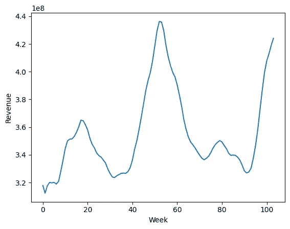

# 使用滚动回归估计时间变系数

> 原文：[`towardsdatascience.com/estimating-time-varying-coefficients-with-rolling-regression-66aca1f2c3f6?source=collection_archive---------7-----------------------#2023-07-01`](https://towardsdatascience.com/estimating-time-varying-coefficients-with-rolling-regression-66aca1f2c3f6?source=collection_archive---------7-----------------------#2023-07-01)

## 作为回归系数的先验分布的高斯随机游走

 [Abhijeet Talaulikar](https://abhijeetstalaulikar.medium.com/?source=post_page-----66aca1f2c3f6--------------------------------)

·

[关注](https://medium.com/m/signin?actionUrl=https%3A%2F%2Fmedium.com%2F_%2Fsubscribe%2Fuser%2F92e9f5319ba1&operation=register&redirect=https%3A%2F%2Ftowardsdatascience.com%2Festimating-time-varying-coefficients-with-rolling-regression-66aca1f2c3f6&user=Abhijeet+Talaulikar&userId=92e9f5319ba1&source=post_page-92e9f5319ba1----66aca1f2c3f6---------------------post_header-----------) 发表在 [数据科学前沿](https://towardsdatascience.com/?source=post_page-----66aca1f2c3f6--------------------------------) · 7 分钟阅读 · 2023 年 7 月 1 日

--

图片由 [Myriam Jessier](https://unsplash.com/@mjessier?utm_source=medium&utm_medium=referral) 提供，来源于 [Unsplash](https://unsplash.com/?utm_source=medium&utm_medium=referral)

回归分析中的一个挑战是考虑预测变量与响应变量之间的关系可能随时间而变化的可能性。

# 从数据科学到计量经济学

> *数据科学家经常遇到这样的情况：业务方有假设，而我们的模型必须考虑到这些假设可能是正确的。*

普通回归模型在估计 E[Y|X] 上表现出色。*Xᵢ*（或*βᵢ*）的系数可以解释为当*Xᵢ*增加 1 时 Y 的增量变化。在计量经济学中，通常假设*βᵢ*会随时间变化，我们可以称之为*βᵢₜ*。那么我们真正要估计的是 E[Y|X,Time]。这是一个公司的两年收入图表——这是一项季节性业务，没有理由相信*β* 也随时间变化。

图片由作者提供

在这篇文章中，我们将介绍回归中时间变化系数的概念，并展示它如何应用于**市场营销组合**…
