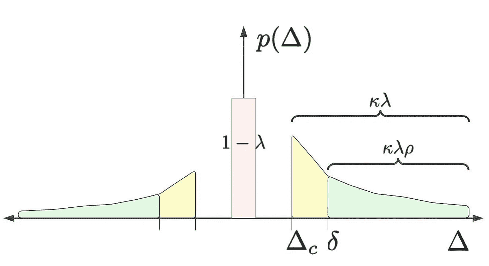
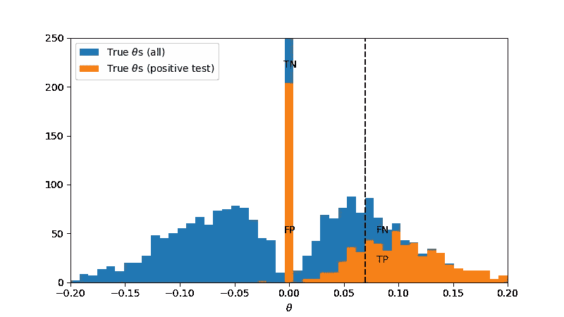
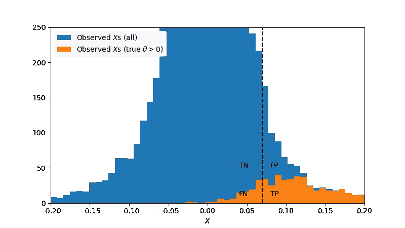
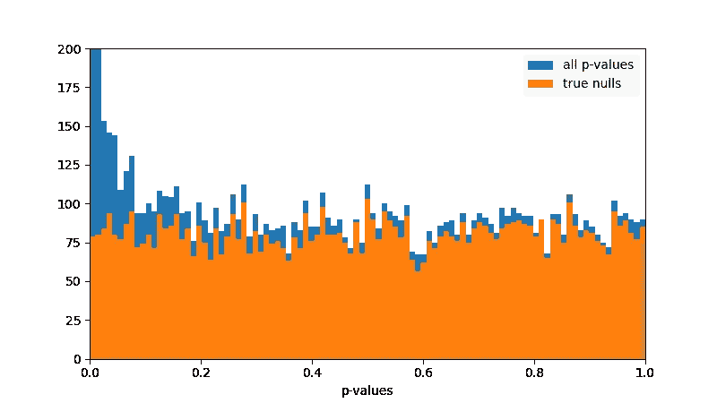
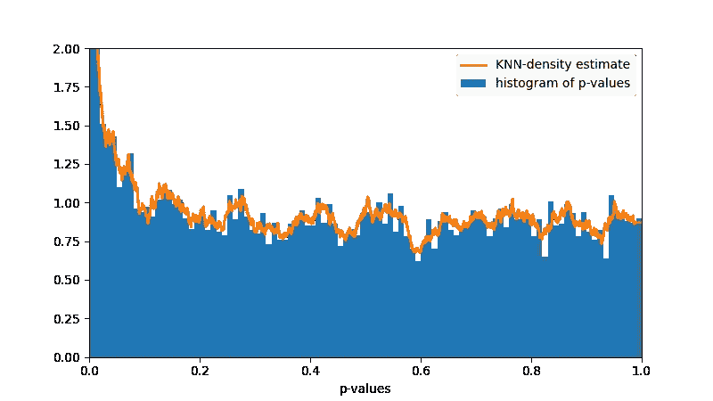
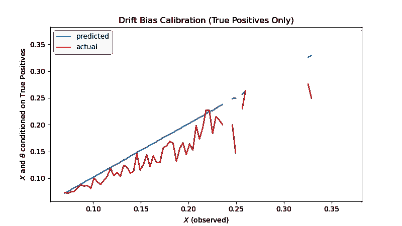
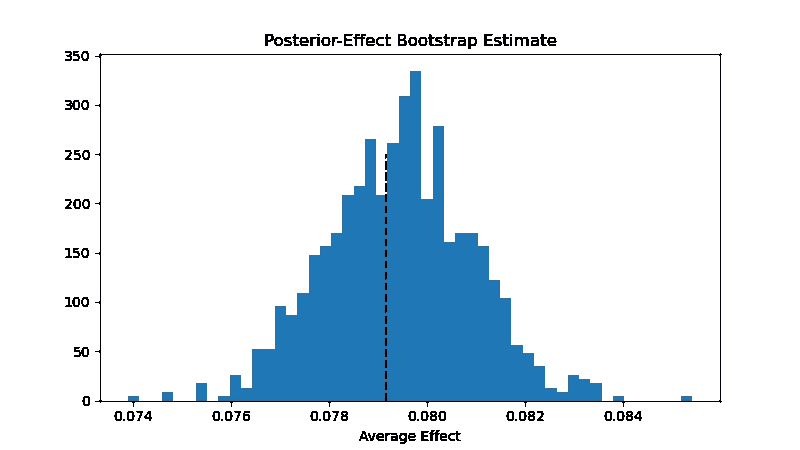
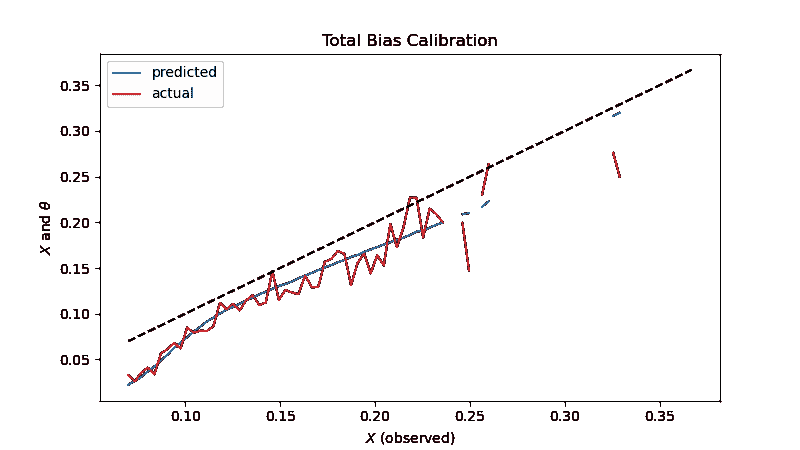

# 估算总体实验影响

> 原文：[`towardsdatascience.com/estimating-total-experimentation-impact-ab6cd56bffb`](https://towardsdatascience.com/estimating-total-experimentation-impact-ab6cd56bffb)

## 如何控制在衡量组织整体影响时的虚假发现和选择偏差

[](https://dataneversleeps.medium.com/?source=post_page-----ab6cd56bffb--------------------------------)[](https://towardsdatascience.com/?source=post_page-----ab6cd56bffb--------------------------------) [贾雷德·M·马鲁斯金，博士](https://dataneversleeps.medium.com/?source=post_page-----ab6cd56bffb--------------------------------)

·发表于 [Towards Data Science](https://towardsdatascience.com/?source=post_page-----ab6cd56bffb--------------------------------) ·阅读时间 16 分钟·2023 年 9 月 20 日

--


图片由 [CHUTTERSNAP](https://unsplash.com/@chuttersnap?utm_source=medium&utm_medium=referral) 提供，[Unsplash](https://unsplash.com/?utm_source=medium&utm_medium=referral)

# 介绍

数据驱动的组织经常在任何给定时间进行数百或数千个实验，但所有这些实验的净影响是什么？一种简单的方法是将所有实验中显著且正面的处理效果的均值差异相加，并且这些实验已经投入生产。然而，这种估计可能极其有偏，即使我们假设各个实验之间没有相关性。我们将进行 10,000 个实验的模拟，并展示这种简单方法实际高估了影响 *45%*！

我们回顾了一个理论偏差修正公式，由 *李和申* [1] 提出。然而，这种方法存在两个缺陷：首先，尽管它在理论上是无偏的，但我们表明其相应的插件估计器由于与原始问题类似的原因仍然存在显著偏差。其次，它未能将影响归因于个体级实验。

在本文中，我们探讨了两个偏差来源：

+   *虚假发现偏差* — 由于假阳性使估计值被夸大；

+   *选择偏差* — 由于决策标准引入的偏差使估计值被夸大：对处理效果的低估被审查（假阴性），而高估则被奖励。

为了解决虚假发现问题，我们将构造一个概率，表示某一结果实际上为非零。这个概率是通过将 *p* 值密度与真实零假设的残差密度进行比较来构造的。

为了解决选择偏差，我们将为每个实验结果计算*后验分布*，使用经验分布作为我们的先验，并对假发现进行校正。

这一过程提供了我们模拟系列实验中平均实验影响的准确估计，将仅使用经验测量得到的原始*45%*误差降低到 0.4*%*误差。

# 效应分布

所以我们进行了很多实验，并希望量化我们所传递的总实验影响。为此，我们需要考虑*效应分布*，即治疗效应的分布。为了使这一点更加清晰，可以想象进行许多实验。每个实验都有一个真实的效应值θ*ᵢ*，我们可以将其视为从某种真实效应分布*p*中抽取的随机变量。每个实验然后通过*Xᵢ*（我们可以视其为均值差异的平均值）来估计*θᵢ*。因此，我们得到如下的观察模型：

这里，*σᵢ² ~ 1/nₛ*，其中*nₛ* 是样本大小。我们将真实效应分布视为三种子群体的混合：真实零效应、正效应和负效应。为了描述效应分布，我们考虑三个参数：

+   *λ = P(θ != 0)* (*有效性*): 具有非零效应的实验所占的比例，

+   *κ = P(θ > 0 | θ != 0)* (*不对称性*): 在具有非零效应的实验中，具有正向效应的实验所占的比例，

+   *ρ = P(θ > δ | θ > 0)* (*优势*): 在那些具有正向（显著）效应的实验中，*实际*显著效应（即效应值大于*δ*）的实验所占的比例。

这些参数在下图中进行了说明。



治疗效应的分布: *(1-λ)* 为零，κ λ 为正，κ λ ρ 为*实际*显著。图像由作者提供。

对于较新的产品，可能容易提出产生显著效应的特性想法，因此λ会很高。然而，对于成熟的产品，实验导致显著变化的情况可能非常少见，*λ* 会较低。

同样，一个团队可能非常擅长提出实际产生*正向*效应的产品改进想法，使得*κ > 1/2*，而另一个团队可能提出了一堆导致性能下降的糟糕想法，使得效应趋向于负向，从而*κ < 1/2*。

# 理论偏差估计器

考虑随机集合*A*，其中包含一系列实验中的正向显著结果，决策标准为*X_i > c*。定义总的真实效应和估计效应为

总期望偏差可以描述为*b = E[Sₐ— Tₐ]*。如果*Xᵢ ~ N(θᵢ, σᵢ)*，*Lee 和 Shen* [1] 显示总期望偏差为：

其中*ϕ*是标准正态分布的密度。具体细节在[2]中进一步回顾。这个公式有两个主要缺点：

1.  它依赖于真实效应*θᵢ*。因此，要实际使用它，我们必须用观察到的效应替换真实效应，即所谓的*插件估计器*。在我们的仿真中，我们展示了插件估计器可能导致显著偏差的估计。（我们还将展示如何通过考虑虚假发现来纠正这一点。）

1.  求和是针对*所有*实验的，不仅限于那些有显著正结果的实验。因此，即使纠正了第一个问题，它也无法提供个别实验水平的影响估计，即所谓的*归因问题*。

# 模拟实验平台

## 一些假设

让我们首先对我们分析的实验集做一些假设：

+   每个实验测量相同顶线指标的均值差异（例如 DAUs、花费时间、收入）；

+   每个实验都使用相同的显著性水平α和效能β来计算效应大小δ（这是实际具有*实际意义*的最小效应）；

+   因此，每个实验具有相同的样本大小*nₛ*和拒绝标准*Xᵢ > c*。

为了计算目的，我们将使用*α = 0.05*，*β = 0.8*来计算效应大小*δ = 0.1*，这将得到*c* = 0.07 和*nₛ* = 785。注意：我们将*α*视为双侧显著性。实际的显著性对于正向测试是*α/2*。

## Python 中的仿真

接下来，我们在 Python 中构建一个模拟实验平台，如下所示。

```py
class PlatformSim:
    def __init__(self, alpha=0.05, beta=0.80, delta=0.1):
        self.alpha, self.beta, self.delta = alpha, beta, delta
        self.z_crit = stats.norm.isf(self.alpha/2)
        self.n_s = int(np.ceil(delta**(-2) * (stats.norm.isf(alpha/2) - stats.norm.isf(beta))**2))
        self.theta_crit = self.z_crit / np.sqrt(self.n_s)

    def run(self, n, lambda_=0.2, kappa=0.5, rho=0.2, shape=3):
        self.n_null = int(n * (1 - lambda_))
        self.n_pos = int(n * lambda_ * kappa)
        self.n_neg = n - self.n_null - self.n_pos 
        # compute thetas
        thetas_null = np.zeros(self.n_null)
        scale = self.delta / scipy.stats.gamma.isf(rho, shape)
        thetas_pos = +np.random.gamma(shape, scale=scale, size=self.n_pos)
        thetas_neg = -np.random.gamma(shape, scale=scale, size=self.n_neg)
        self.thetas = np.concatenate((thetas_null, thetas_pos, thetas_neg))
        # for each theta, simulate result of an experiment        
        np.random.shuffle(self.thetas)
        self.x_values, self.z_values, self.p_values = self.simulate_results(self.thetas)
        self.results = (self.z_values > self.z_crit).astype(int)

    def simulate_results(self, thetas):
        X = np.random.normal(loc=thetas, size=(self.n_s, len(thetas)))
        self.X = X
        x_values = X.mean(axis=0)
        z_values = x_values * np.sqrt(self.n_s)
        p_values = 2 * stats.norm.sf(np.abs(z_values))
        return x_values, z_values, p_values
```

我们首先将*(1-λ)*的实验指定为真实的虚无效应。

对于其余的实验，我们使用伽马分布，确保在*δ*处生存函数为*ρ*。

使用**PlatformSim**类，我们可以用几行代码运行仿真。我们将结果放入数据框**df**中，并为正向结果创建一个单独的数据框**dfs**。*注意：*这可以很容易地修改为建模不同的正向/负向分布。然而，为了我们的仿真，我们使用了伽马随机变量。

```py
P = PlatformSim(alpha=0.05, beta=0.8, delta=0.1)
P.run(10000, lambda_= 0.2, kappa=0.5, rho=0.3, null_type=null_type, pos_type=pos_type, shape=3)
df = DataFrame({'theta': P.thetas, 'x': P.x_values, 'z': P.z_values, 'p': P.p_values, 'result': P.results})
df.sort_values('p', inplace=True, ignore_index=True)
dfs = df[df.result==1]
effect = dfs.theta.mean()
print(f"Average Effect (Actual): {round(effect, 6)}")  
print(f"Average Effect (Observed): {round(dfs.x.mean(), 6)}     REL: {100*round(dfs.x.mean() / effect - 1, 2)}%")  
print(f"False Discovery Rate: {round(100*len(dfs[dfs.theta <= 0]) / len(dfs), 2)}%") 
sig_i = 1 / np.sqrt(P.n_s)
imp_b = (dfs.x.sum() - sig_i * scipy.stats.norm.pdf((P.theta_crit - df.x) / sig_i).sum()) / len(dfs)
imp_0 = (dfs.x.sum() - sig_i * scipy.stats.norm.pdf((P.theta_crit - df.theta) / sig_i).sum()) / len(dfs)
print(f"Bias-Corrected True      Estimate: {round(imp_0, 6)}     REL: {round(100* imp_0 / dfs.theta.mean() - 100, 2)}%")
print(f"Bias-Corrected Empirical Estimate: {round(imp_b, 6)}     REL: {round(100* imp_b / dfs.theta.mean() - 100, 2)}%")
# Output ~
# Average Effect (Actual): 0.079171
# Average Effect (Observed):  0.113245    REL: 43.0%
# False Discovery Rate:  27.04%
# Bias-Corrected True      Estimate:  0.079023     REL: -0.19%
# Bias-Corrected Empirical Estimate:  0.062471     REL: -21.09%
```

使用我们的仿真，我们可以轻松地测量具有显著正效应的实验的观察到的平均处理效应和实际处理效应。在这个仿真中，真实的平均效应是*0.0792*，而我们测得的效应是*0.1132*，误差为+43%！我们还观察到 27%的虚假发现率。

我们还观察到，当使用真实的*θᵢ*时，理论偏差修正公式的效果非常好，误差为 0.19%，但当使用插件估计器时，效果不佳，产生了 21%的误差。理论估计器对偏差进行了过度修正。这是由于真实的虚无效应数量庞大，并且偏差公式拾取了随机分布在右侧的观测值，但没有拾取左侧的观测值，因为估计器值在接近决策边界的观测值处达到峰值。

我们可以绘制效应分布的直方图。下面是实际效应的直方图，正向测试结果用橙色突出显示。



真实效应的分布，橙色代表正结果。图片来源于作者。

我们注意到有大量假阳性，远远超过我们的*α/2 = 2.5%*显著性水平。假阳性与总体阳性的比例称为*假发现率*，我们将讨论如何估计和调整它。

现在，在进行一系列实验时，我们无法获得这种真实的治疗效应分布，而只能获得*观察到的*治疗效应分布，如下图所示。在这里，我们用橙色突出显示那些实际具有正效应的实验。这一视角使我们深入了解第二种我们必须解决的偏差类型：*选择偏差*。



测量效应的分布，橙色代表实际存在效应的实验。决策边界由虚线垂直线表示。图片来源于作者。

为了理解选择偏差，考虑到*假阴性*的真实效应在垂直虚线的右侧。对于每个散布在左侧的实验，将有一个散布在右侧。因此，假阴性可以被视为对实际阳性的过高估计。选择过程本身因此产生了一种偏差：只有当观察到的效应大于*c*时，我们才会将结果视为统计显著。因此，我们选择那些随机具有比其真实效应更高效应的观察结果，而忽略了那些效应较低的观察结果。上述图中突出显示的所有假阴性“平衡”了测量效应被夸大的真正阳性。

# 假发现

在本节中，我们讨论*λ*、*κ*、功效和假发现率之间的一些理论关系。我们将在本说明中的模拟中使用这些关系。

## 估计*λ*和*κ*

为了使用实践中可用的观察数据来估计假发现率，我们首先需要估计总体参数*λ*和*κ*。

要估计*λ*，我们考虑导致统计显著结果的实验的比例*f*。这些包括真正的阳性和假阳性。在*(1-λ)*没有效应的实验中，我们期望*α (1 — λ)*产生假阳性。在*λ*具有实际效应的实验中，我们期望*βₐ λ*产生真正的阳性，其中*βₐ*是这组实验的平均功效。因此，显著结果的预期比例由以下公式给出

这可以重新排列以生成估计值

其中*βₐ*是观察到的显著结果的平均功效。（我在显示的方程中使用了β^*表示βₐ，但它们是相同的。）

## 估计假发现率

*虚假发现率*（FDR）是指正结果中虚假正例的比例。我们在模拟中观察到了 27%的虚假发现率。

要估计这个，我们需要 *平均正功效*

这里，*β(θ) = P(X > c | θ)* 是观察到正显著效应的概率，给定 *θ*。接下来，我们将假设平均负功效 *β₋* 可以忽略不计。

FDR 可以通过贝叶斯定律表示为

我们稍后将使用此公式来获得 27.6%的虚假发现率估计。这个近似等式提醒我们，我们忽略了负分布的功效，而在我们的模拟中，这一功效是可以忽略的。

## 密度估计和 *p-概率*

我们接下来探索一种方法，通过两步法调整虚假发现偏差：

+   确定每个正结果是正确正例的概率；

+   计算折扣平均处理效应，其中我们按其为虚假正例的概率对每个实验的效应进行折扣。

为了制定实验产生实际效应的概率，我们转向了 *p*-值。这里的关键观察是，在零假设下，*p*-值的分布是均匀分布。这在下面的图中很明显，该图表示了我们所有 *p*-值的直方图，并用橙色突出显示了实际零假设的 *p*-值。



*p*-值的直方图；实际零假设的 *p*-值以橙色绘制。图片来源于作者。

设 *f(p)* 为 *p*-值的观察概率密度，并且 *fₐ* 表示半区间 *[0.5, 1]* 上的 *p*-值的平均概率密度。我们可以推断 *fₐ* 是真实零假设的平均概率密度，它在整个区间 *[0, 1]* 上是恒定的。

在 *p*-值方面，当 *p < α = 0.05* 时，我们拒绝零假设。对于给定的实验区间，比如 *pᵢ*，因此实验是正确零假设的概率为 *fₐ / f(pᵢ)*，而它是正确非零假设的概率为 *πᵢ = P(θᵢ != 0 | pᵢ) = 1 — fₐ / f(pᵢ)*，我们定义为 *p*-*概率*。注意，这一定义是双向的：大的正观察值或负观察值将具有相等的 *p*-概率，仅取决于效应的大小。

## 经验密度函数

为了实现这一点，我们需要一个经验密度估计。标准的方法是 *分箱密度估计*，定义为

其中，第*i*个区间由*b_i = [i h , (i+1)h)*定义，*i=0, n_b-1*，*h=1/n_b*是区间宽度。区间大小受到偏差-方差权衡的影响：如果区间大小太小，会有高方差；但如果区间大小太大，会有高偏差。这个估计的问题是概率在边界*p=0*附近有一个峰值。区间大小必须足够小以捕捉接近零的行为，这会导致对单位区间其余部分的次优估计，且方差较高。

因此，我们提出了一种替代的经验密度，我们称之为*最近邻密度估计*：

在这里，NN*ₖ(x)*表示集合*{X₁, … Xₙ}*中距离*x*最近的*k*个“邻居”，范围表示集合的最大值和最小值之间的差异。

分箱估计保持区间大小不变，并测量每个区间内的数据点数量，而最近邻估计保持数量固定，并测量可变的区间大小。

为了在代码中实现这一点，我们计算了*p*值在* [0, 1]*区间上以 0.001 间隔的最近邻密度。这在下面的代码中实现。

```py
 def knn(x, k, X):
    """ Returns the k nearest neighbors to x from the set X """
    n = len(X)
    X = np.sort(X)
    z = np.abs(X - x)
    start = np.argmin(z)
    stop = start * 1
    k_count = 1
    while k_count < k:
        if start == 0:
            stop += (k - k_count)
            k_count = k
            break
        if stop == n-1:
            start -= (k - k_count)
            k_count = k
            break
        if z[start-1] < z[stop+1]:
            start -= 1 
        else:
            stop += 1
        k_count += 1
    return X[start:stop+1]
# KNN-density estimate 
k, n_b = 200, 10000 # k, number of bins
h = 1 / n_b # bin size 
t = np.linspace(0, 1, n_b+1).round(4)
fp_knn = np.zeros(n_b+1)
for i in range(n_b+1):
    xnn = knn(t[i], k, df.p.values)
    fp_knn[i] = k / len(df) / (np.max(xnn) - np.min(xnn))
fp_base = fp_knn[t > 0.5].mean()
p_map = {p:f for p, f in zip(t, fp_knn)}
df.loc[:, 'f_p'] = df.p.apply(lambda x: p_map[round(x, 4)])
df.loc[:, 'p_prob'] = df.f_p.apply(lambda x: max(0, 1 - fp_base / x))
dfs = df[df.result==1] # positive significant results (for later)
dfs = dfs.reset_index(drop=True)
```

数值计算得到的密度函数在下图中绘制，并附有*p*值的归一化直方图。



*p*值的直方图；经验最近邻密度函数。图片作者提供。

## 估计假发现率

现在我们使用我们的*p*概率来估计假发现率，使用之前的计算，如下所示。

```py
df.loc[:, 'power'] = stats.norm.sf(P.z_crit, np.abs(df.z))
beta_ = np.average(df[df.x > 0].power, weights=df[df.x > 0].p_prob) # average power of positive results
kappa_hat = np.average((df.x>0), weights=df.p_prob)
frac_sig = (np.abs(df.x) > 0.07).mean()
beta_0 = np.average(df.power, weights=df.p_prob) ## Two-sided average prob. of sig result
lambda_hat = (frac_sig - alpha) / (beta_0 - alpha)
FDR_hat = alpha*(1-lambda_hat) / (alpha*(1-lambda_hat) + 2 * beta_ * lambda_hat * kappa_hat)
# Outputs
# lambda     : 0.164780
# beta_      : 0.666541
# kappa      : 0.498272
# FDR true   : 0.270448
# FDR_hat    : 0.276170
```

这导致估计的假发现率为 27.6%，而实际的真实率为 27.0%。

## 纠正假发现的影响估计

我们还可以使用我们的*p*概率来控制假发现。

```py
bias_sum = np.average(scipy.stats.norm.pdf((P.theta_crit - df.x) / sig_i), weights=df.p_prob) * df.p_prob.sum()
bias_sum += scipy.stats.norm.pdf((P.theta_crit - 0) / sig_i) * (len(df) - df.p_prob.sum())
imp_pcor = (dfs.x.sum() - sig_i * bias_sum) / len(dfs)
print(f"P-Corrected Average Effect : {round((dfs.x * dfs.p_prob).mean(), 6)}     REL: {round(100* (dfs.x * dfs.p_prob).mean() / dfs.theta.mean() - 100, 2)}%")
print(f"P-Corrected Bias Estimate  : {round(imp_pcor, 6)}     REL: {round(100* imp_pcor / dfs.theta.mean() - 100, 2)}%")
# Output
# P-Corrected Average Effect : 0.089668     REL: 13.26%
# P-Corrected Bias Estimate  : 0.082046     REL: 3.63%
```

在这里，我们重新计算了理论偏差估计，通过将每个观测值按其对应的*p*概率加权，得到一个误差为 3.6%的近似影响。（比之前未经修正的估计好得多！）这也大大改进了我们的经验观察影响估计，现在的误差仅为 13.3%。

# 选择偏差

## 真实正例的校准

为了了解导致选择偏差的原因，我们可以按观察到的影响*X*对数据进行分箱，过滤真实正例，并绘制每个区间内的实际影响。这在下面的校准图中显示。



理论（蓝色）和观察（红色）平均影响，经过真实正例过滤，并按观察到的均值差异分箱。图片作者提供。

## 后验估计

给定总体，*θᵢ*的期望值不再是观察到的均值*Xᵢ*。为了考虑总体效应，我们将改为考虑每个单独实验的*后验效应分布* *P(θᵢ | Xᵢ)*。对于*先验*，我们将仅使用我们所拥有的最佳信息：调整过的*p*概率的经验分布。

其中*πᵢ*是第*i*个实验的*p*概率。因此，我们对每个观察点进行加权，以反映其作为真实非零结果的概率，然后将所有实验的零概率在原点合并。

*θ*的后验分布对于第*i*个实验可以表示为

其中*nₛ*是该实验的样本大小。（回忆一下*Xᵢ*是样本大小*nₛ*上的*平均值*。）

我们可以在 EffectDistribution 类中实现这些公式，如下所示。__init__ 方法计算先验，而 getUpdate 方法返回后验。

```py
class EffectDistribution:

    def __init__(self, x, p_prob, sort=True):
        x, f = list(x), list(p_prob)
        if (0 not in x):
            x.append(0)
            f.append(len(p_prob) - p_prob.sum())
        pmfmat = np.array([x, f])
        if sort:
            pmfmat = pmfmat[:, pmfmat[0, :].argsort()]
        self.x, self.pmf = pmfmat[0, :], pmfmat[1, :]
        self.zero_loc = np.argmin(np.abs(self.x)) 
        self.normalize()

    def __len__(self):
        return len(self.x)

    def normalize(self):
        self.pmf /= self.pmf.sum()

    def getProbNull(self):
        return self.pmf[self.zero_loc]  

    def getSample(self, n, pmf=None, prob=1):
        pmf = self.pmf if pmf is None else pmf
        sample = np.random.choice(self.x, size=n, replace=True, p=pmf)
        mask = np.random.choice([0, 1], size=n, replace=True, p=[1-prob, prob])
        return mask * sample

    def getUpdate(self, x_mean, n, sigma=1, inplace=False):
        pmf = self.pmf * np.exp(-n * self.x * (self.x - 2 * x_mean) / (2 * sigma**2))
        if inplace:
            self.pmf = pmf 
            self.normalize()
            return
        return pmf / pmf.sum()
```

现在我们可以遍历所有正显著结果，为每个结果计算新的预期影响以及来自后验分布的随机样本。

```py
n_boot = 1000
B = np.zeros((len(dfs), n_boot))
E = EffectDistribution(df.x, df.p_prob)
for i, row in dfs.iterrows():
    pmf_ = E.getUpdate(row.x, P.n_s)
    dfs.loc[i, 'theta_hat'] = np.average(E.x, weights=pmf_)
    B[i, :] = E.getSample(n_boot, pmf=pmf_) #, prob=row.p_prob)
bootstrap_means = B.mean(axis=0)
print(f"POSTERIOR CORRECTED Estimate       : {round(dfs.theta_hat.mean(), 6)}     REL: {round(100*dfs.theta_hat.mean() / dfs.theta.mean() - 100, 2)}%")
# POSTERIOR CORRECTED Estimate       : 0.079478     REL: 0.39%
```

我们称这一过程为*后验效应影响估计*，因为它基于每个单独实验的后验分布。我们的最终校正估计显示 0.39%的误差，尽管自助法置信区间为（-3.3%，4.0%）。自助样本如下面所示。



后验-效应自助法估计。图片由作者提供。

此外，我们可以查看整体最终校准图（未筛选真实正例！）：



校准图，显示了后验效应估计（蓝色）和实际影响（红色），按观察值进行分箱。对角线虚线表示未经校正的估计 X=X。图片由作者提供。

# 结论

在进行一系列大规模实验时，由于*虚假发现*和*选择*，真实的总体影响往往会有所偏差。

此外，我们发现这些偏差在真实零结果的高比例*λ*下会加剧。这表明运行*高质量*实验至关重要，这些实验更有可能真正产生有意义的影响。另一方面，*试验你能想到的一切，看看什么有效*的方法会导致高虚假发现率和高偏差。这一挑战对于较成熟的产品来说更难，因为很难提出新的有意义的想法，而对于较新的产品来说，许多变化可能会带来产品改进。

为了纠正这些偏差，必须在两步过程中考虑所有实验的*总体*。

1.  使用*p*值计算每个实验实际上是非零结果的概率。

1.  使用*p*概率校正的经验分布（所有结果）作为先验，计算每个正显著结果的效应的后验分布。

在我们的模拟中，简单观察的平均影响与真实效应相比产生了 45%的误差；对*p-*概率的校正将此误差降低到 13%，而最终的后验估计将误差进一步降低到 1%以下，置信区间为±3%。

## 额外阅读

如需更数学化的方法，请查看[1]。该论文提供了一个明确的公式，用于修正测量影响时的总体偏差。

[1] M.R. Lee 和 M. Shen，[赢家的诅咒：在线控制实验中特征总效应的偏差估计](https://dl.acm.org/doi/10.1145/3219819.3219905)（2018），KDD 18: 第 24 届 ACM SIGKDD 国际知识发现与数据挖掘大会论文集，2018 年 7 月，第 491–499 页

[2] M. Berk，[如何衡量团队的 A/B 测试影响](https://medium.com/towards-data-science/how-to-measure-your-teams-a-b-testing-impact-f74c6f2b4660)（2021），*Towards Data Science,* 2021 年 6 月。

*除非另有说明，所有图片均由作者提供。*
