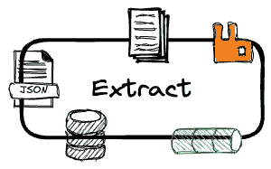
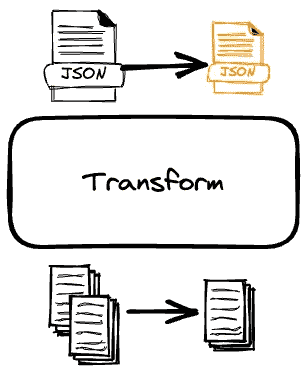
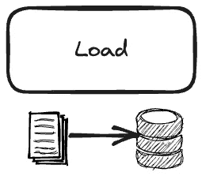
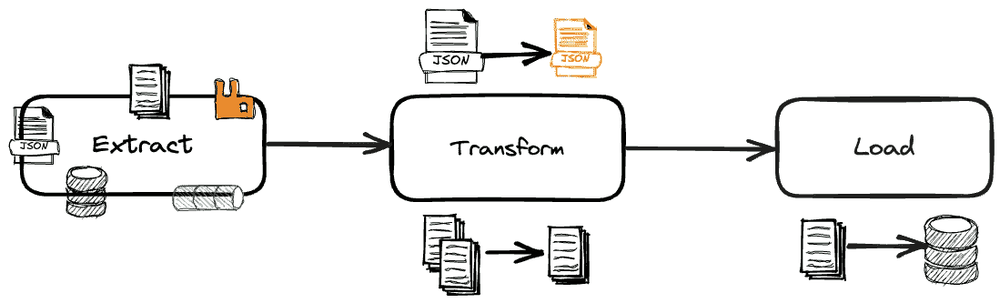
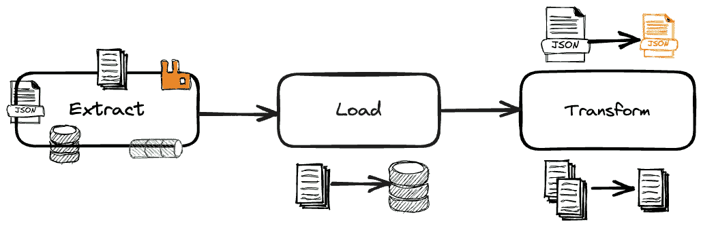
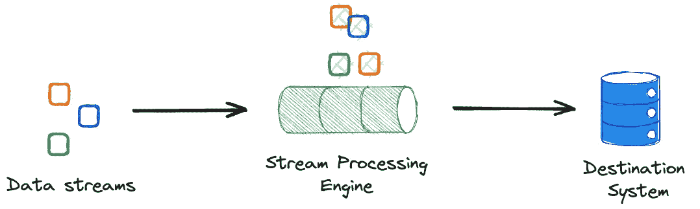
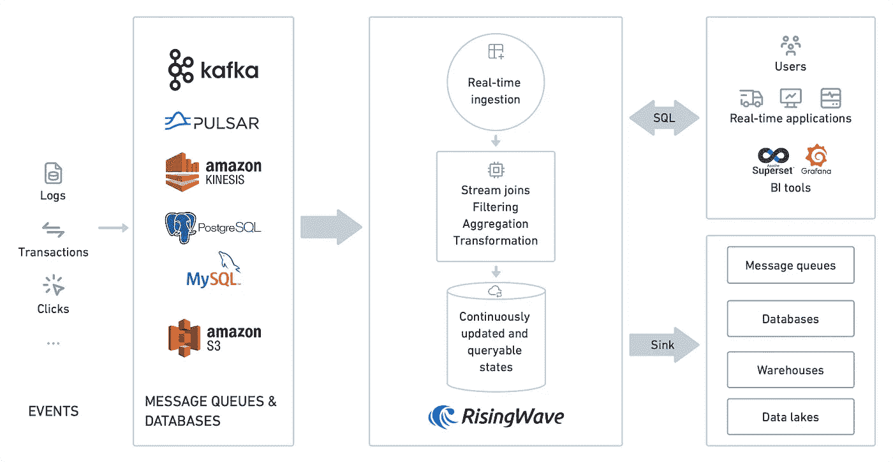

# ETL vs ELT vs 流处理 ETL

> 原文：[`towardsdatascience.com/etl-elt-streaming-etl-af6379ffdd26`](https://towardsdatascience.com/etl-elt-streaming-etl-af6379ffdd26)

## 探索数据处理的批处理和实时设计范式

 [Giorgos Myrianthous](https://gmyrianthous.medium.com/?source=post_page-----af6379ffdd26--------------------------------)

·发布于 [Towards Data Science](https://towardsdatascience.com/?source=post_page-----af6379ffdd26--------------------------------) ·阅读时长 8 分钟·2023 年 8 月 29 日

--

图片由 [Compare Fibre](https://unsplash.com/@comparefibre?utm_source=unsplash&utm_medium=referral&utm_content=creditCopyText) 提供，在 [Unsplash](https://unsplash.com/photos/INNsF0Zz_kQ?utm_source=unsplash&utm_medium=referral&utm_content=creditCopyText)

提取、转换、加载（ETL）和提取、加载、转换（ELT）是数据处理中的两个基本概念，用于描述数据摄取和转换设计范式。虽然这些术语经常被交替使用，但它们指代的概念略有不同，适用于不同的用例，这些用例也要求不同的设计。

在这篇文章中，我们将探讨 ETL 和 ELT 的异同，并讨论云计算和数据工程领域的变革如何影响数据处理设计模式。此外，我们将概述这两种方法在现代数据团队中的主要优缺点。最后，我们将讨论流处理 ETL，这是一种新兴的数据处理模式，旨在解决传统批处理方法的各种缺点。

[**订阅数据管道**](https://thedatapipeline.substack.com/welcome)**，这是一个专注于数据工程的新闻通讯**

# 三个关注的步骤

从外部来源将数据摄取并持久化到目标系统涉及三个不同的步骤。

**提取** “提取”步骤包括从源系统中提取数据所需的所有过程。这些源可以包括应用程序编程接口（API）、数据库系统或文件、物联网（IoT）设备，而数据可以是任何形式的；结构化、半结构化或非结构化。在此步骤中提取的数据通常被称为“原始数据”。

在 ETL/ELT 管道中作为‘提取’步骤的一部分从源系统中提取原始数据 — 来源：作者

**转换** 在‘转换’步骤中，管道对原始数据应用转换以实现某个目标。这个目标通常与业务或技术要求相关。一些常见的转换包括数据修改（例如，将`United States`映射为`US`）、记录或属性选择、与其他数据源的连接或甚至数据验证。

在 ETL/ELT 管道中的‘转换’步骤中，对原始数据应用转换以实现某个目标 — 来源：作者

**加载** 在‘加载’步骤中，数据（无论是原始数据还是已转换数据）被加载到目标系统中。通常，目标是 OLAP 系统（即数据仓库或数据湖），但有时它甚至可以是 OLTP 系统，例如应用程序数据库。

作为 ETL/ELT 管道中‘加载’步骤的一部分将数据加载到目标系统中 — 来源：作者

显然，ETL 和 ELT 范式都涉及上述步骤。它们的主要区别在于执行这些步骤的顺序，这反过来在成本、计算能力和设计模式上具有重要影响。因此，应根据每种范式的优缺点选择最合适的范式。还需要提到的是，团队结构本身也可能是选择哪种范式的良好指标。让我们深入探讨以使这更清楚！

# 提取 转换 加载（ETL）

ETL 指的是一个过程，包括从源系统（或文件）提取数据，然后进行转换步骤以修改提取的原始数据，最后是加载步骤将转换后的数据导入目标系统。

提取-转换-加载（ETL）管道中的执行顺序 — 来源：作者

**ETL 步骤：**

1.  从源系统提取原始数据

1.  在暂存服务器（即目标系统/服务器之外）转换数据

1.  将数据加载到目标系统

ETL 已经存在多年，并在公司开始使用数据仓库将数据集中存储在其技术生态系统中的中心点时获得了显著关注。

ETL 在数据世界中仍然相关，但在批处理方面表现出两个显著的缺点。第一个缺点与原始数据永远无法到达目标系统有关。这意味着每当需要新的变换时，必须执行新的 ETL 作业来从源头（再次！）获取数据，应用新的变换规则，并最终加载到目标系统中。第二个主要缺点是变换通常发生在暂存服务器中。

# 提取加载变换（ELT）

随着云技术的出现和数据存储成本的显著降低，现代组织现在能够存储大量的原始数据，然后根据需要应用任何变换或分析。

技术环境的这些变化也改变了数据团队摄取和分析数据的方式。ELT 范式使团队能够将数据加载到目标系统，然后进行任何必要的变换。

提取-加载-变换（ELT）管道的执行顺序—来源：作者

**ELT 步骤：**

1.  从源系统提取原始数据

1.  将提取的原始数据加载到目标系统

1.  在目标系统内变换原始数据

使用 ELT，不需要维护（和支付）用于变换的暂存服务器。此外，原始数据随时可用，这意味着进一步的变换可以瞬间完成。

# 流式 ETL

流式 ETL 指的是一个概念，其中 ETL 范式持续执行。当数据进入（作为“提取”步骤的一部分）时，变换—包括连接、映射、过滤和窗口化—会在流数据上执行。处理后的数据会推送到下游目标系统，如数据库、仓库或甚至消息队列。

尽管 ETL 和 ELT 范式仍然非常相关且有用，但它们总是作为批处理过程进行。这意味着延迟增加，而数据的新鲜度减少。另一方面，流式 ETL 相较于批处理作业具有许多优势，包括较低的延迟、较高的数据新鲜度以及更多的灵活性（无论是在资源使用还是数据处理本身）和可扩展性。

以欺诈检测为例，这适用于许多不同的行业，特别是金融服务。在银行业中，欺诈可能通过盗用卡片、伪造或甚至网络钓鱼电话进行。检测欺诈活动是时间关键的，因为金融机构需要在检测到后执行某些操作（例如冻结账户或发送通知）。尽管检测恶意交易活动时需要考虑许多因素，但一个明显且关键的因素是同一账户是否在几分钟内在不同的地理位置进行交易（这些地点的距离与感兴趣交易之间的时间差异不匹配）。为此，我们可以利用时间窗口。

显然，批处理——可以以 ELT 或 ELT 管道的形式执行——无法满足时间关键型用例如欺诈检测。而这正是流处理发挥作用的地方。

# 流处理

流处理指的是在数据创建时进行连续处理的实践。通常，流处理管道包括原始数据的摄取或生成，对其进行的处理，包括聚合、过滤、窗口化、丰富等，最终将处理后的流传送到目标系统。

流处理管道的高级概述 — 来源：作者

批处理已经长期存在，但全球数据生成的快速增长以及挑战批处理架构的技术出现改变了这一现状。

显然，流处理的主要优势在于其实时处理数据的能力。这使得用户和组织能够更快地进行分析，从而加快决策过程。

此外，流处理系统比批处理过程更容易扩展，因为它们设计用于实时处理大量数据。这对于包含波动数据流的用例尤为重要，例如物联网应用。

与批处理作业相比，流处理可以减少与数据存储相关的数据处理成本。流处理作业仅处理需要处理的数据子集，而无需存储和维护包含未使用数据的大型数据集。

# 使用流式 ETL 与流式数据库

有不同类型的流式数据库提供各种不同的功能并支持不同的 SQL 变体。其中一个流式数据库是 RisingWave，我将使用它作为示例来描述一些流式 ETL 概念，因为我熟悉 Postgres SQL。

[RisingWave](https://www.risingwave.dev/docs/current/intro/)是一个用于流处理的分布式 SQL 数据库，旨在提供构建实时和事件驱动应用程序的无缝体验。

该工具可以处理来自 Apache Pulsar、Apache Kafka、Kinesis 和 CDC 源的数据。同样，来自 RisingWave 的数据可以被引入到下游系统，包括数据仓库、数据湖和消息代理/队列。

该平台可以用于从上述源中提取数据，随着新数据的到来执行增量计算，并动态更新结果。由于 RisingWave 本身是一个数据库系统，用户能够高效、有效地访问数据。

显然，RisingWave 支持的众多用例之一是流式 ETL。数据可以从各种源中提取并引入流式数据库，在那里可以应用转换。然后，处理/转换后的数据会持续写入所需的目标系统。

使用 RisingWave 的流式架构 — 来源：[RisingWave GitHub 库](https://github.com/risingwavelabs/risingwave-docs/blob/0f7e1302b22493ba3c1c48e78810750ce9a5ff42/docs/images/archi_simple.png)（根据[Apache 许可证](https://github.com/risingwavelabs/risingwave/blob/main/LICENSE)授权）

**RisingWave 使用的流式 ETL 步骤**

1.  提取：RisingWave 支持从各种数据源中提取数据，包括日志文件、消息队列和来自数据库日志的 CDC 流。

1.  转换：它提供了执行流数据转换所需的所有功能，包括映射、聚合、过滤、窗口、连接和有状态处理。

1.  加载：最后，处理过的数据流可以从 RisingWave 加载到下游目标系统。

一些可以从流式 ETL 功能中受益匪浅的用例包括：

+   持续数据集成

+   物联网（IoT）数据处理

+   实时欺诈检测

+   实时警报

另一种流式 ETL 的解决方案是 FlinkSQL，它允许用户使用 SQL 开发流式应用程序。Databricks 和 Snowflake 最近也开始提供对流式应用程序的支持，可能也是不错的替代选择。

# 最终思考…

设计数据处理管道是一项具有挑战性的任务，因为没有一种通用的解决方案。因此，应该熟悉基本概念，以便在实施解决特定问题的解决方案时能够做出有价值的考虑。

在今天的文章中，我们讨论了数据处理上下文中常用的两种范式，即 ETL 和 ELT。此外，我们还讨论了现代组织如何利用实时能力，并使用 RisingWave 实现事件驱动架构，RisingWave 是一个用于流处理的分布式 SQL 数据库，可以支持实时分析、事件驱动应用程序以及流式 ETL 等功能。

[**订阅数据管道**](https://thedatapipeline.substack.com/welcome)**，这是一个专注于数据工程的新闻通讯**
