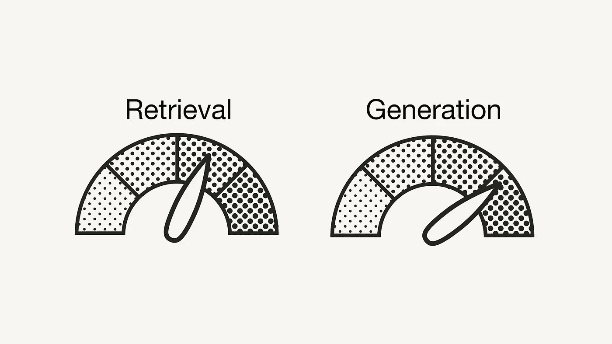
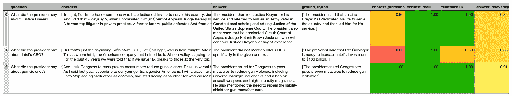

# 使用 RAGAs 评估 RAG 应用程序

> 原文：[`towardsdatascience.com/evaluating-rag-applications-with-ragas-81d67b0ee31a?source=collection_archive---------0-----------------------#2023-12-13`](https://towardsdatascience.com/evaluating-rag-applications-with-ragas-81d67b0ee31a?source=collection_archive---------0-----------------------#2023-12-13)

## 一个包含指标和 LLM 生成数据的框架，用于评估你的检索增强生成流水线的性能

[](https://medium.com/@iamleonie?source=post_page-----81d67b0ee31a--------------------------------)[](https://towardsdatascience.com/?source=post_page-----81d67b0ee31a--------------------------------) [Leonie Monigatti](https://medium.com/@iamleonie?source=post_page-----81d67b0ee31a--------------------------------)

·

[关注](https://medium.com/m/signin?actionUrl=https%3A%2F%2Fmedium.com%2F_%2Fsubscribe%2Fuser%2F3a38da70d8dc&operation=register&redirect=https%3A%2F%2Ftowardsdatascience.com%2Fevaluating-rag-applications-with-ragas-81d67b0ee31a&user=Leonie+Monigatti&userId=3a38da70d8dc&source=post_page-3a38da70d8dc----81d67b0ee31a---------------------post_header-----------) 发布于 [Towards Data Science](https://towardsdatascience.com/?source=post_page-----81d67b0ee31a--------------------------------) ·8 min read·2023 年 12 月 13 日[](https://medium.com/m/signin?actionUrl=https%3A%2F%2Fmedium.com%2F_%2Fvote%2Ftowards-data-science%2F81d67b0ee31a&operation=register&redirect=https%3A%2F%2Ftowardsdatascience.com%2Fevaluating-rag-applications-with-ragas-81d67b0ee31a&user=Leonie+Monigatti&userId=3a38da70d8dc&source=-----81d67b0ee31a---------------------clap_footer-----------)

--

[](https://medium.com/m/signin?actionUrl=https%3A%2F%2Fmedium.com%2F_%2Fbookmark%2Fp%2F81d67b0ee31a&operation=register&redirect=https%3A%2F%2Ftowardsdatascience.com%2Fevaluating-rag-applications-with-ragas-81d67b0ee31a&source=-----81d67b0ee31a---------------------bookmark_footer-----------)

检索增强生成的风格化性能仪表板

到目前为止，我们知道，为[检索增强生成 (RAG) 应用程序](https://medium.com/towards-data-science/retrieval-augmented-generation-rag-from-theory-to-langchain-implementation-4e9bd5f6a4f2)构建概念验证是容易的，但使其准备好投入生产却非常困难。使 RAG 流水线的性能达到令人满意的状态尤其困难，因为 RAG 流水线中有多个不同的组件：

+   **检索器组件：** 从外部数据库中检索附加上下文，以便 LLM 回答查询。

+   **生成器组件**：基于经过检索信息的提示生成答案。

评估 RAG 管道时，必须分别和共同评估两个组件，以了解 RAG 管道是否以及在哪些方面仍需改进。此外，为了了解您的 RAG 应用的性能是否在提高，您必须进行定量评估。为此，您将需要两个要素：**评估指标和评估数据集**。

目前，确定正确的评估指标和收集良好的验证数据是一个活跃的研究领域。由于这是一个迅速发展的主题，我们目前看到各种 RAG 评估框架的方法，如 [RAG Triad of metrics](https://learn.deeplearning.ai/building-evaluating-advanced-rag/lesson/3/rag-triad-of-metrics)，[ROUGE](https://aclanthology.org/W04-1013/)，[ARES](https://arxiv.org/abs/2311.09476)，[BLEU](https://dl.acm.org/doi/10.3115/1073083.1073135) 和 [RAGAs](https://arxiv.org/pdf/2309.15217v1.pdf) [1]。本文将重点介绍如何使用 [RAGAs](https://arxiv.org/pdf/2309.15217v1.pdf) [1] 评估 RAG 管道。

# RAGAs 是什么

RAGAs（**R**etrieval-**A**ugmented **G**eneration **As**sessment）是一个框架（[GitHub](https://github.com/explodinggradients/ragas)，[Docs](https://docs.ragas.io/en/latest/)），为您提供了评估 RAG 管道组件所需的必要要素。

## 评估数据

RAGAs 有趣的是，它起初是一个用于“无参考”评估的框架[1]。这意味着，RAGAs 在后台利用 LLMs 进行评估，而不需要依赖评估数据集中的人类标注实际标签。

评估 RAG 管道时，RAGAs 需要以下信息：

+   `question`：RAG 管道的输入用户查询。输入数据。

+   `answer`：来自 RAG 管道生成的答案。输出结果。

+   `contexts`：用于回答`question`的从外部知识源检索到的上下文。

+   `ground_truths`：`question`的实际答案。这是唯一的人类标注的信息。此信息仅在指标`context_recall`（见 Evaluation Metrics）中需要。

利用 LLMs 进行无参考评估是一个活跃的研究话题。虽然使用尽可能少的人类标注数据使其成为一种更便宜、更快的评估方法，但仍存在一些关于其缺陷的讨论，例如偏见[3]。然而，一些论文已经展示了有前景的结果[4]。有关详细信息，请参见 RAGAs [1]论文的“相关工作”部分。

请注意，该框架已经扩展，以提供需要实际标签的指标和范式（例如，`context_recall`和`answer_correctness`，见 Evaluation Metrics）。

此外，框架为 [自动测试数据生成](https://docs.ragas.io/en/latest/concepts/testset_generation.html) 提供了工具。

## 评估指标

RAGAs 提供了一些 [指标](https://docs.ragas.io/en/latest/concepts/metrics/index.html) 来评估 RAG 管道的组件级别以及端到端。

在 **组件级别**，RAGAs 为您提供了评估检索组件（`context_relevancy` 和 `context_recall`）以及生成组件（`faithfulness` 和 `answer_relevancy`）的指标 [2]：

+   [**上下文精确度**](https://docs.ragas.io/en/latest/concepts/metrics/context_precision.html) 衡量检索到的上下文的信噪比。该指标使用 `question` 和 `contexts` 计算。

+   [**上下文召回率**](https://docs.ragas.io/en/latest/concepts/metrics/context_recall.html) 衡量是否检索到了回答问题所需的所有相关信息。该指标基于 `ground_truth`（这是框架中唯一依赖人工标注真实标签的指标）和 `contexts` 计算。

+   [**忠实性**](https://docs.ragas.io/en/latest/concepts/metrics/faithfulness.html) 衡量生成答案的事实准确性。正确陈述的数量除以生成答案中的总陈述数量。该指标使用 `question`、`contexts` 和 `answer`。

+   [**回答相关性**](https://docs.ragas.io/en/latest/concepts/metrics/answer_relevance.html) 衡量生成的回答与问题的相关程度。该指标使用 `question` 和 `answer` 计算。例如，对于问题“*法国在哪里，它的首都是什么？*”，回答“*法国位于西欧*。”会获得较低的回答相关性，因为它只回答了问题的一半。

所有指标都被缩放到 [0, 1] 范围内，较高的值表示更好的性能。

RAGAs 还为您提供了评估 RAG 管道 **端到端** 的指标，如 [回答语义相似度](https://docs.ragas.io/en/latest/concepts/metrics/semantic_similarity.html) 和 [回答正确性](https://docs.ragas.io/en/latest/concepts/metrics/answer_correctness.html)。本文关注于组件级别的指标。

# 使用 RAGAs 评估 RAG 应用程序

本节使用 RAGAs 评估一个最小的基础 RAG 管道，以展示如何使用 RAGAs，并提供对其评估指标的直观理解。

## 前提条件

确保您已安装所需的 Python 包：

+   `langchain`、`openai` 和 `weaviate-client` 用于 RAG 管道

+   `ragas` 用于评估 RAG 管道

```py
#!pip install langchain openai weaviate-client ragas
```

此外，请在根目录下的 `.env` 文件中定义相关的环境变量。要获取 OpenAI API 密钥，您需要一个 OpenAI 账户，然后在 [API keys](https://platform.openai.com/account/api-keys) 下选择“创建新密钥”。

```py
OPENAI_API_KEY="<YOUR_OPENAI_API_KEY>"
```

## 设置 RAG 应用程序

在你可以评估你的 RAG 应用之前，你需要进行设置。我们将使用一个基础的 RAG 流水线。我们将简要介绍这一部分，因为我们将在接下来的文章中详细描述相同的设置。

## 检索增强生成（RAG）：从理论到 LangChain 实现

### 从原始学术论文的理论到使用 OpenAI、Weaviate 和 LangChain 的 Python 实现

towardsdatascience.com

首先，你必须通过加载和分块文档来准备数据。

```py
import requests
from langchain.document_loaders import TextLoader
from langchain.text_splitter import CharacterTextSplitter

url = "https://raw.githubusercontent.com/langchain-ai/langchain/master/docs/docs/modules/state_of_the_union.txt"
res = requests.get(url)
with open("state_of_the_union.txt", "w") as f:
    f.write(res.text)

# Load the data
loader = TextLoader('./state_of_the_union.txt')
documents = loader.load()

# Chunk the data
text_splitter = CharacterTextSplitter(chunk_size=500, chunk_overlap=50)
chunks = text_splitter.split_documents(documents)
```

接下来，为每个块生成向量嵌入，并将其存储在向量数据库中。

```py
from langchain.embeddings import OpenAIEmbeddings
from langchain.vectorstores import Weaviate
import weaviate
from weaviate.embedded import EmbeddedOptions
from dotenv import load_dotenv,find_dotenv

# Load OpenAI API key from .env file
load_dotenv(find_dotenv())

# Setup vector database
client = weaviate.Client(
  embedded_options = EmbeddedOptions()
)

# Populate vector database
vectorstore = Weaviate.from_documents(
    client = client,    
    documents = chunks,
    embedding = OpenAIEmbeddings(),
    by_text = False
)

# Define vectorstore as retriever to enable semantic search
retriever = vectorstore.as_retriever()
```

最后，设置一个提示模板和 OpenAI LLM，并将它们与检索组件组合成一个 RAG 流水线。

```py
from langchain.chat_models import ChatOpenAI
from langchain.prompts import ChatPromptTemplate
from langchain.schema.runnable import RunnablePassthrough
from langchain.schema.output_parser import StrOutputParser

# Define LLM
llm = ChatOpenAI(model_name="gpt-3.5-turbo", temperature=0)

# Define prompt template
template = """You are an assistant for question-answering tasks. 
Use the following pieces of retrieved context to answer the question. 
If you don't know the answer, just say that you don't know. 
Use two sentences maximum and keep the answer concise.
Question: {question} 
Context: {context} 
Answer:
"""

prompt = ChatPromptTemplate.from_template(template)

# Setup RAG pipeline
rag_chain = (
    {"context": retriever,  "question": RunnablePassthrough()} 
    | prompt 
    | llm
    | StrOutputParser() 
)
```

## 准备评估数据

由于 RAGAs 旨在成为一个无参考的评估框架，因此评估数据集的准备工作最少。你需要准备 `question` 和 `ground_truths` 对，从中你可以通过推断准备其余信息，如下所示：

```py
from datasets import Dataset

questions = ["What did the president say about Justice Breyer?", 
             "What did the president say about Intel's CEO?",
             "What did the president say about gun violence?",
            ]
ground_truths = [["The president said that Justice Breyer has dedicated his life to serve the country and thanked him for his service."],
                ["The president said that Pat Gelsinger is ready to increase Intel's investment to $100 billion."],
                ["The president asked Congress to pass proven measures to reduce gun violence."]]
answers = []
contexts = []

# Inference
for query in questions:
  answers.append(rag_chain.invoke(query))
  contexts.append([docs.page_content for docs in retriever.get_relevant_documents(query)])

# To dict
data = {
    "question": questions,
    "answer": answers,
    "contexts": contexts,
    "ground_truths": ground_truths
}

# Convert dict to dataset
dataset = Dataset.from_dict(data)
```

如果你对 `context_recall` 指标不感兴趣，你不需要提供 `ground_truths` 信息。在这种情况下，你只需准备 `question`。

## 评估 RAG 应用

首先，从 `ragas.metrics` 导入你想使用的所有指标。然后，你可以使用 `evaluate()` 函数并简单地传入相关指标和准备好的数据集。

```py
from ragas import evaluate
from ragas.metrics import (
    faithfulness,
    answer_relevancy,
    context_recall,
    context_precision,
)

result = evaluate(
    dataset = dataset, 
    metrics=[
        context_precision,
        context_recall,
        faithfulness,
        answer_relevancy,
    ],
)

df = result.to_pandas()
```

以下是示例的 RAGAs 评分结果：



RAGAs 评分包括上下文精确度、上下文召回率、准确性和答案相关性。

我们可以做出以下观察：

+   `context_relevancy`（检索到的上下文的信噪比）：虽然 LLM 认为所有上下文对最后一个问题是相关的，但也认为第二个问题的多数检索上下文是不相关的。根据这个指标，你可以尝试不同数量的检索上下文，以减少噪声。

+   `context_recall`（是否检索到回答问题所需的所有相关信息）：LLMs 评估检索到的上下文包含回答问题所需的相关信息。

+   `faithfulness`（生成答案的事实准确性）：虽然 LLM 认为第一个和最后一个问题回答正确，但对第二个问题的回答（错误地说总统没有提到 Intel 的 CEO）则被评为 0.5。

+   `answer_relevancy`（生成答案与问题的相关性）：所有生成的答案都被评估为与问题较为相关。

如在评估数据中提到的，使用 LLMs 进行无参考评估是一个活跃的研究领域。我很想看看这个话题会如何发展。

# 摘要

构建概念验证 RAG 应用程序很简单，但让其性能达到生产就绪水平则很困难。像机器学习项目一样，你应通过验证数据集和评估指标来评估 RAG 管道的性能。

然而，由于 RAG 管道由多个组件组成，必须分别以及组合地进行评估，你将需要一套评估指标。此外，从人工注释者那里生成高质量的验证数据集既困难又耗时且昂贵。

本文介绍了[RAGAs](https://arxiv.org/pdf/2309.15217v1.pdf) [1] 评估框架。该框架提出了四个评估指标——`context_relevancy`、`context_recall`、`faithfulness` 和 `answer_relevancy`——这些指标共同组成了 RAGAs 评分。此外，RAGAs 利用 LLMs 进行无参考评估以节省成本。

现在你已经具备了评估 RAG 应用性能的工具，我推荐[建立实验管道](https://medium.com/@iamleonie/intro-to-mlops-experiment-tracking-for-machine-learning-858e432bd133)并开始使用以下调优策略来优化性能：

[](/a-guide-on-12-tuning-strategies-for-production-ready-rag-applications-7ca646833439?source=post_page-----81d67b0ee31a--------------------------------) ## 关于生产就绪 RAG 应用的 12 种调优策略指南

### 如何通过这些“超参数”提升你的检索增强生成（RAG）管道的性能……

towardsdatascience.com

你可以在[这个 GitHub 仓库](https://github.com/weaviate/recipes/blob/main/evaluation/RAGAs-RAG-langchain.ipynb)中找到生成这个数据集的代码。

# 享受这篇文章了吗？

[*免费订阅*](https://medium.com/subscribe/@iamleonie) *以便在我发布新故事时收到通知。*

[](https://medium.com/@iamleonie/subscribe?source=post_page-----81d67b0ee31a--------------------------------) [## 关注 Leonie Monigatti 的每次发布即可收到电子邮件。

### 关注 Leonie Monigatti 的每次发布即可收到电子邮件。通过注册，如果你还没有 Medium 账户，你将创建一个…

medium.com](https://medium.com/@iamleonie/subscribe?source=post_page-----81d67b0ee31a--------------------------------)

*可以在* [*LinkedIn*](https://www.linkedin.com/in/804250ab/)、[*Twitter*](https://twitter.com/helloiamleonie)*以及* [*Kaggle*](https://www.kaggle.com/iamleonie)*找到我！*

# 免责声明

在撰写本文时，我是 Weaviate 的一名开发者倡导者，Weaviate 是一个开源向量数据库。

# 参考文献

[1] Es, S., James, J., Espinosa-Anke, L., & Schockaert, S. (2023). RAGAs: 自动化检索增强生成的评估。[*arXiv 预印本 arXiv:2309.15217*](https://arxiv.org/pdf/2309.15217v1.pdf)。

[2] RAGAs 文档 (2023)。[文档](https://docs.ragas.io/en/latest/index.html)（访问日期：2023 年 12 月 11 日）

[3] Wang, P., Li, L., Chen, L., Zhu, D., Lin, B., Cao, Y., … & Sui, Z. (2023). 大型语言模型并不是公平的评估者。[*arXiv 预印本 arXiv:2305.17926*](https://arxiv.org/abs/2305.17926)

[4] Liu, Y., Iter, D., Xu, Y., Wang, S., Xu, R., & Zhu, C. (2023). G-eval: 使用 GPT-4 进行 Nlg 评估，提供更好的人工对齐，2023 年 5 月。[*arXiv 预印本 arXiv:2303.16634*, *6*](https://arxiv.org/abs/2303.16634)

## 图像

如果没有特别说明，所有图像均由作者创建。
