# 评估提升模型

> 原文：[`towardsdatascience.com/evaluating-uplift-models-8a078996a113`](https://towardsdatascience.com/evaluating-uplift-models-8a078996a113)

## [因果数据科学](https://towardsdatascience.com/tagged/causal-data-science)

## 如何比较和选择最佳提升模型

[](https://medium.com/@matteo.courthoud?source=post_page-----8a078996a113--------------------------------)[](https://towardsdatascience.com/?source=post_page-----8a078996a113--------------------------------) [Matteo Courthoud](https://medium.com/@matteo.courthoud?source=post_page-----8a078996a113--------------------------------)

·发布于 [Towards Data Science](https://towardsdatascience.com/?source=post_page-----8a078996a113--------------------------------) ·18 分钟阅读·2023 年 7 月 13 日

--

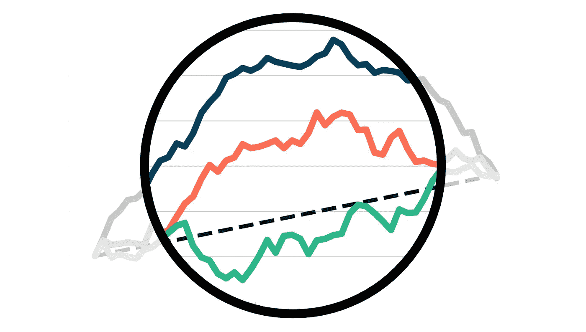

封面，图片由作者提供。

因果推断在行业中最广泛的应用之一是**提升建模**，即条件平均处理效应的估计。

在估计**处理**（药物、广告、产品等）对**结果**（疾病、公司收入、客户满意度等）的因果效应时，我们通常不仅仅关心处理是否有效，我们还希望了解对哪些**对象**（患者、用户、客户等）效果更好或更差。

估计异质性增量效应，或称为提升，是改善**目标**政策的重要中间步骤。例如，我们可能希望警告某些人他们更有可能经历药物的副作用，或仅向特定客户展示广告。

虽然存在许多建模提升的方法，但在具体应用中并不总是清楚使用哪一种。关键在于，由于**因果推断的根本问题**，感兴趣的目标，即提升，永远无法观察到，因此我们无法像处理机器学习预测算法一样验证我们的估计器。我们不能划分验证集并选择表现最好的模型，因为我们**没有真实值**，即使在验证集中也没有，即使我们进行了随机实验也无法获得。

那我们该怎么办呢？在这篇文章中，我尝试介绍最常用的**提升模型评估**方法。如果你对提升模型不太熟悉，我建议先阅读我的介绍文章。

[](/understanding-meta-learners-8a9c1e340832?source=post_page-----8a078996a113--------------------------------) ## 理解元学习者

### 编辑描述

towardsdatascience.com

# 提升和促销邮件

想象一下我们在一家产品公司的市场部门工作，致力于改进我们的**电子邮件营销活动**。从历史上看，我们主要向新客户发送邮件。然而，现在我们希望采用数据驱动的方法，针对那些邮件对收入有最大正面影响的客户。这种影响也称为**提升**或**增量性**。

让我们看看我们可以使用的数据。我从`[src.dgp](https://github.com/matteocourthoud/Blog-Posts/blob/main/notebooks/src/dgp.py)`导入数据生成过程`dgp_promotional_email()`。我还从`[src.utils](https://github.com/matteocourthoud/Blog-Posts/blob/main/notebooks/src/utils.py)`导入了一些绘图函数和库。

```py
from src.utils import *
from src.dgp import dgp_promotional_email
dgp = dgp_promotional_email(n=500)
df = dgp.generate_data()
df.head()
```


数据快照，图片来源：作者

我们有 500 名客户的信息，我们观察到他们是否是`新`客户，他们的`年龄`，邮件活动前产生的销售额（`sales_old`），是否发送了`邮件`，以及邮件活动后的`销售`。

**感兴趣的结果**是`销售`，我们用字母*Y*表示。**处理**或我们希望改进的政策是`邮件`活动，我们用字母*W*表示。我们将所有其他变量称为**混杂因素**或控制变量，用*X*表示。

```py
Y = 'sales'
W = 'mail'
X = ['age', 'sales_old', 'new']
```

表示变量之间因果关系的有向无环图（DAG）如下。关注的因果关系以绿色显示。

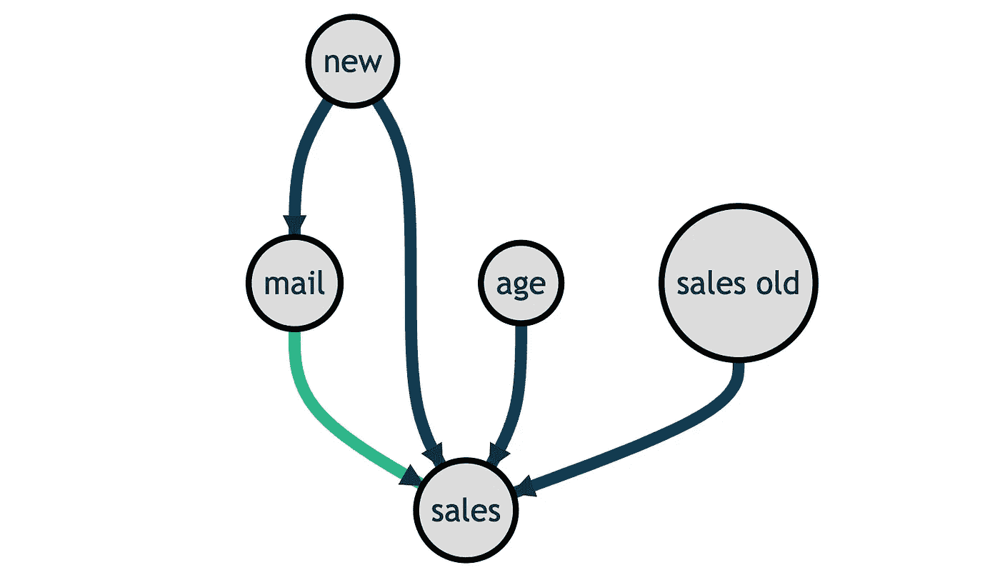

数据生成过程的有向无环图（DAG）

从 DAG 中，我们看到`新`客户指标是一个混杂因素，需要控制以识别`邮件`对`销售`的影响。`年龄`和`sales_old`则不是估计的关键，但可能对识别有帮助。有关 DAG 和控制变量的更多信息，请查看我的介绍文章。

[](/controls-b63dc69e3d8c?source=post_page-----8a078996a113--------------------------------) ## DAGs 和控制变量

### 编辑描述

towardsdatascience.com

提升建模的目标是恢复**个体处理效应（ITE）** *τᵢ*，即发送促销`邮件`对`销售`的增量效应。我们可以将 ITE 表示为两个假设量之间的差异：客户接收到邮件的潜在结果 *Yᵢ⁽¹⁾*，减去客户如果*没有*收到邮件的潜在结果 *Yᵢ⁽⁰⁾*。


个体处理效应（ITE），图片来源：作者

请注意，对于每位客户，我们只能观察到两个实现结果中的一个，具体取决于他们是否实际收到了`mail`。因此，ITE 本质上是不可观测的。可以估计的是**条件平均处理效应 (CATE)**，即在协变量 *X* 条件下的期望个体处理效应 *τᵢ*。例如，对年龄大于 50 岁的客户 (`age` > 50) 来说，`mail` 对 `sales` 的平均效应。


条件平均处理效应 (CATE)，图像由作者提供

为了能够恢复 CATE，我们需要做出三个假设。

1.  **无混淆**：*Y⁽⁰⁾, Y⁽¹⁾ ⊥ W | X*

1.  **重叠**：*0 < e(X) < 1*

1.  **一致性**：*Y = W ⋅ Y⁽¹⁾ + (1−W) ⋅ Y⁽⁰⁾*

其中 *e(X)* 是**倾向得分**，即在协变量 *X* 条件下的预期处理概率。


倾向得分，图像由作者提供

接下来，我们将使用机器学习方法来估计 CATE *τ(x)*、倾向得分 *e(x)* 以及结果的条件期望函数 (CEF) *μ(x)*


结果条件期望函数 (CEF)，图像由作者提供

我们使用 [随机森林回归](https://scikit-learn.org/stable/modules/generated/sklearn.ensemble.RandomForestRegressor.html) 算法来建模 CATE 和结果 CEF，而使用 [逻辑回归](https://scikit-learn.org/stable/modules/generated/sklearn.linear_model.LogisticRegression.html) 来建模倾向得分。

```py
from sklearn.ensemble import RandomForestRegressor
from sklearn.linear_model import LogisticRegressionCV

model_tau = RandomForestRegressor(max_depth=2)
model_y = RandomForestRegressor(max_depth=2)
model_e = LogisticRegressionCV()
```

在本文中，我们不对基础机器学习模型进行微调，但强烈建议进行微调以提高提升模型的准确性（例如，使用像 [FLAML](https://microsoft.github.io/FLAML/) 这样的 auto-ml 库）。

# 提升模型

存在**许多方法**来建模提升，或者换句话说，估计条件平均处理效应 (CATE)。由于本文的目的是比较方法以*评估*提升模型，我们将不详细解释这些方法。对于温和的介绍，您可以查看 [我关于元学习者的介绍文章](https://medium.com/towards-data-science/understanding-meta-learners-8a9c1e340832)。

我们将考虑的学习者如下：

+   S-learner 或单学习者，由 [Kunzel, Sekhon, Bickel, Yu (2017)](https://arxiv.org/abs/1706.03461) 提出

+   T-learner 或二学习者，由 [Kunzel, Sekhon, Bickel, Yu (2017)](https://arxiv.org/abs/1706.03461) 提出

+   X-learner 或交叉学习者，由 [Kunzel, Sekhon, Bickel, Yu (2017)](https://arxiv.org/abs/1706.03461) 提出

+   R-learner 或 [Robinson](https://www.jstor.org/stable/1912705) 学习者，由 [Nie, Wager (2017)](https://arxiv.org/abs/1712.04912) 提出

+   DR-learner 或双重稳健学习者，由 [Kennedy (2022)](https://arxiv.org/abs/2004.14497) 提出

我们从微软的 [econml](https://econml.azurewebsites.net/) 库导入所有模型。

```py
from src.learners_utils import *
from econml.metalearners import SLearner, TLearner, XLearner
from econml.dml import NonParamDML
from econml.dr import DRLearner

S_learner = SLearner(overall_model=model_y)
T_learner = TLearner(models=clone(model_y))
X_learner = XLearner(models=model_y, propensity_model=model_e, cate_models=model_tau)
R_learner = NonParamDML(model_y=model_y, model_t=model_e, model_final=model_tau, discrete_treatment=True)
DR_learner = DRLearner(model_regression=model_y, model_propensity=model_e, model_final=model_tau)
```

我们在数据上`fit()`模型，指定结果变量 *Y*、处理变量 *W* 和协变量 *X*。

```py
names = ['SL', 'TL', 'XL', 'RL', 'DRL']
learners = [S_learner, T_learner, X_learner, R_learner, DR_learner]
for learner in learners:
    learner.fit(df[Y], df[W], X=df[X])
```

我们现在准备评估这些模型了！我们应该选择哪个模型？

# Oracle 损失函数

评估提升模型的主要问题是，即使有验证集，甚至有随机实验或 AB 测试，我们也**未观察到**我们感兴趣的指标：个体治疗效应。事实上，我们只观察到实现的结果，*Yᵢ⁽⁰⁾* 对于未处理的客户，*Yᵢ⁽¹⁾* 对于处理过的客户。因此，我们**无法计算**验证数据中任何客户的个体治疗效应，*τᵢ = Yᵢ⁽¹⁾ − Yᵢ⁽⁰⁾*。

我们还可以做些什么来**评估**我们的估计器吗？

答案是肯定的，但在给出更多细节之前，让我们首先了解如果我们**能够观察到**个体治疗效应 *τᵢ* 我们会怎么做。

## Oracle MSE 损失

如果我们能够观察个体治疗效应（但我们不能，因此有“oracle”属性），我们可以尝试衡量我们的估计 *τ̂(Xᵢ)* 距离真实值 *τᵢ* 的距离。这就是我们在机器学习中评估预测方法时通常做的：我们保留一个验证数据集，并在该数据上比较预测值和真实值。有很多损失函数可以评估预测准确性，因此让我们集中于最流行的一个：**均方误差（MSE）损失**。


Oracle MSE 损失函数，作者图

```py
def loss_oracle_mse(data, learner):
    tau = learner.effect(data[X])
    return np.mean((tau - data['effect_on_sales'])**2)
```

函数 `compare_methods` 打印和绘制在单独验证数据集上计算的评估指标。

```py
def compare_methods(learners, names, loss, title=None, subtitle='lower is better'):
    data = dgp.generate_data(seed_data=1, seed_assignment=1, keep_po=True)
    results = pd.DataFrame({
        'learner': names,
        'loss': [loss(data.copy(), learner) for learner in learners]
    })
    fig, ax = plt.subplots(1, 1, figsize=(6, 4))
    sns.barplot(data=results, x="learner", y='loss').set(ylabel='')
    plt.suptitle(title, y=1.02)
    plt.title(subtitle, fontsize=12, fontweight=None, y=0.94)
    return results

results = compare_methods(learners, names, loss_oracle_mse, title='Oracle MSE Loss')
```

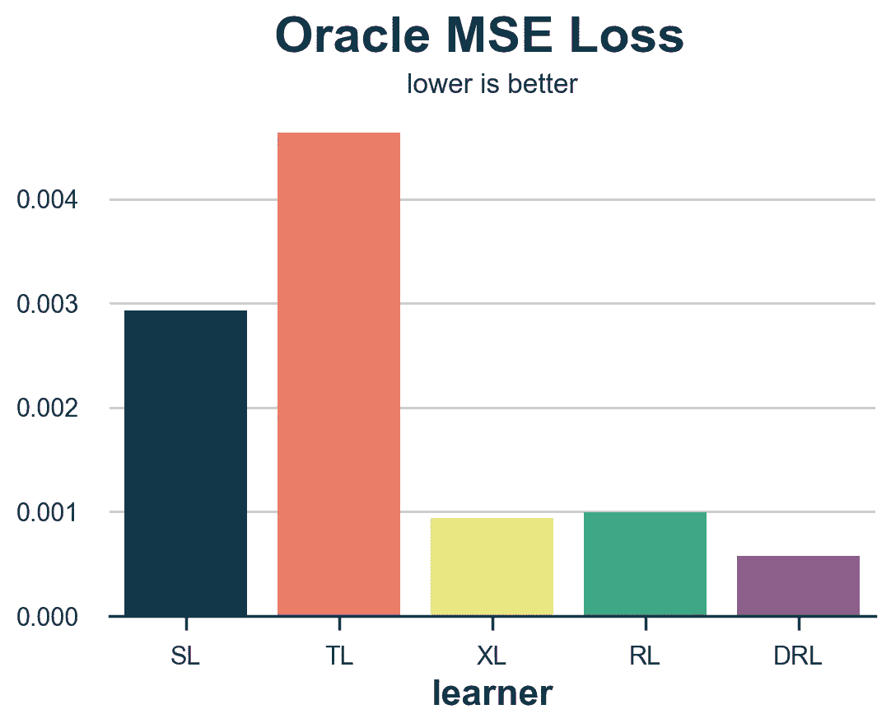

Oracle MSE 损失值，作者图

在这种情况下，我们看到 T-学习者表现最差，S-学习者紧随其后。另一方面，X-、R-和 DR-学习者表现明显更好，**DR-学习者赢得了比赛**。

然而，这可能*不是*评估我们提升模型的最佳损失函数。实际上，提升建模只是通向我们最终目标的一步：提高收入。

## Oracle 策略增益

由于我们最终的目标是**提高收入**，我们可以通过它们增加收入的多少来评估估计器，给定某个策略函数。例如，假设我们发送一封电子邮件的成本是 0.01$。那么，我们的策略是处理每个预测的条件平均治疗效应高于 0.01$的客户。

```py
cost = 0.01
```

我们的收入实际会增加多少？让我们用 *d(τ̂)* 定义我们的策略函数，其中 *d=1* 如果 *τ ≥ 0.1*，否则 *d=0*。然后我们的*增益*（越高越好）函数是：


Oracle 策略增益函数，作者图

再次，这是一种“oracle”损失函数，在现实中**无法计算**，因为我们无法观察到个体治疗效应。

```py
def gain_oracle_policy(data, learner):
    tau_hat = learner.effect(data[X])
    return np.sum((data['effect_on_sales'] - cost) * (tau_hat > cost))

results = compare_methods(learners, names, gain_oracle_policy, title='Oracle Policy Gain', subtitle='higher is better')
```

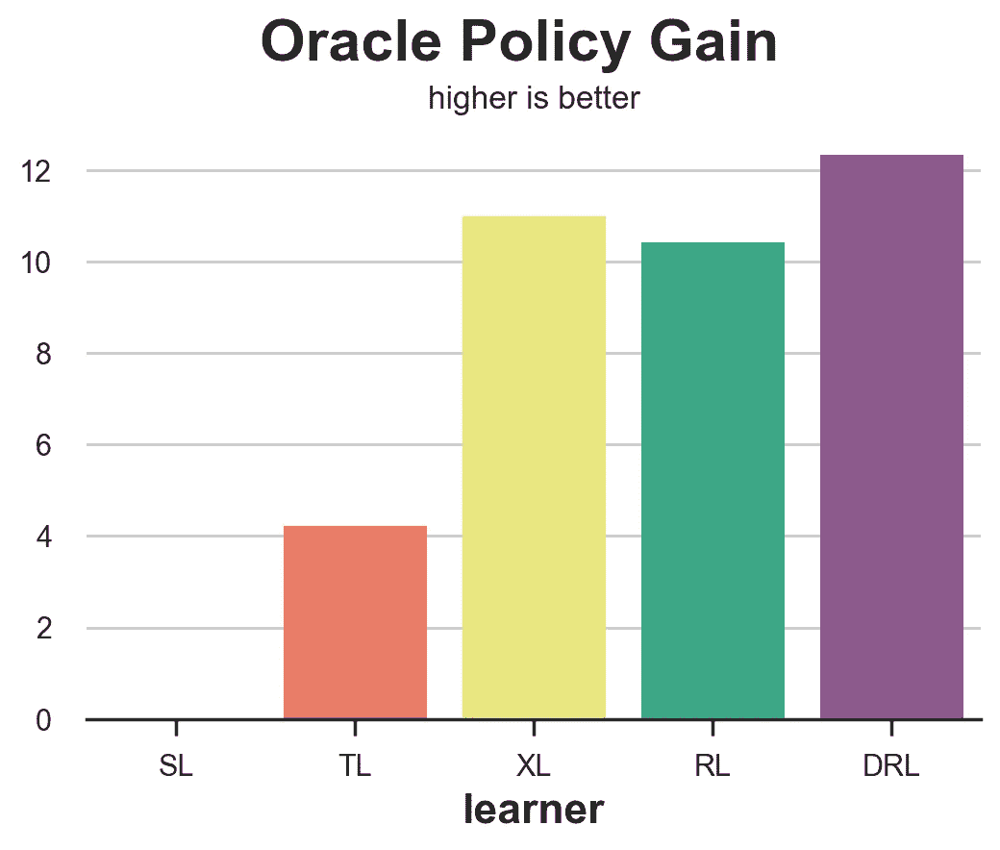

Oracle policy gain values, image by Author

在这种情况下，S-学习者显然是表现最差的，导致收入没有效果。T-学习者带来了适度的收益，而 X-、R-和 DR-学习者都带来了整体收益，其中**X-学习者稍微领先**。

# 实用损失函数

在前一节中，我们已经看到两个损失函数的例子，如果我们能观察到个体治疗效应*τᵢ*，我们希望计算这些损失函数。然而，实际上，即使在随机实验和验证集的情况下，我们也不能观察到 ITE，这是我们的兴趣对象。我们现在将介绍一些在这种实际限制下尝试评估提升模型的度量方法。

## 结果损失

第一种也是最简单的方法是切换到不同的损失变量。虽然我们不能观察个体治疗效应*τᵢ*，但我们仍然可以观察我们的结果*Yᵢ*。这不是我们确切的兴趣对象，但我们可以期望一个在预测*y*方面表现良好的提升模型也会提供良好的*τ*估计。

一种这样的损失函数可能是**结果 MSE 损失**，这是预测方法中通常使用的 MSE 损失函数。


结果 MSE 损失函数，图像作者

问题在于，并非所有模型都直接产生*μ(x)*的估计。因此，我们跳过这个比较，转而使用可以评估任何提升模型的方法。

## 预测到预测损失

另一种非常简单的方法是将训练集上训练的模型的预测与在验证集上训练的另一个模型的预测进行比较。虽然直观，但这种方法可能会**极具误导性**。

```py
def loss_pred(data, learner):
    tau = learner.effect(data[X])
    learner2 = copy.deepcopy(learner).fit(data[Y], data[W], X=data[X])
    tau2 = learner2.effect(data[X])
    return np.mean((tau - tau2)**2)
results = compare_methods(learners, names, loss_pred, 'Prediction to Prediction Loss')
```

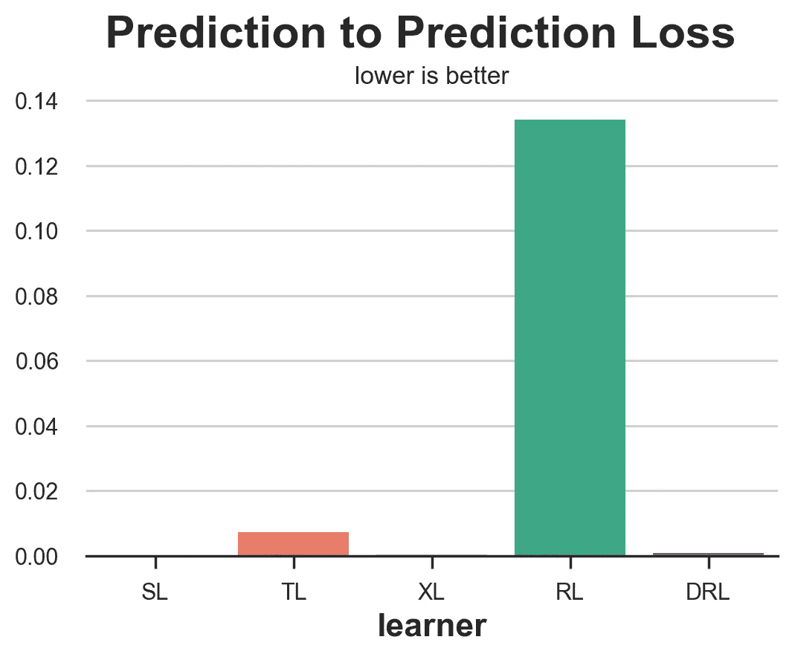

预测到预测 MSE 损失值，图像作者

不出所料，这一指标表现极差，你**绝不应该使用它**，因为它奖励那些一致的模型，而不考虑它们的质量。一个始终为每个观测预测一个随机常数 CATE 的模型将获得完美的得分。

## 分布损失

另一种方法是问：我们能多好地匹配潜在结果的分布？我们可以对*处理组*或*未处理组*的潜在结果进行这个练习。以最后一种情况为例。假设我们对那些*没有*收到`邮件`的客户的观察到的`sales`以及对那些收到`邮件`的客户的观察到的`sales` *减去* 估计的 CATE *τ̂(x)* 进行比较。根据**无混杂假设**，在协变量*X*的条件下，这两个未处理潜在结果的分布应该是相似的。

因此，如果我们正确估计了治疗效应，我们期望两个分布之间的距离较近。


未处理潜在结果距离，图像作者

我们还可以对*处理过的*潜在结果做同样的分析。

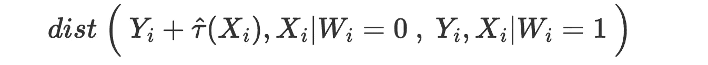

处理后的潜在结果距离，图像由作者提供

我们使用[能量距离](https://en.wikipedia.org/wiki/Energy_distance)作为距离度量。

```py
from dcor import energy_distance

def loss_dist(data, learner):
    tau = learner.effect(data[X])
    data.loc[data.mail==1, 'sales'] -= tau[data.mail==1]
    return energy_distance(data.loc[data.mail==0, [Y] + X], data.loc[data.mail==1, [Y] + X], exponent=2)
results = compare_methods(learners, names, loss_dist, 'Distribution Loss')
```

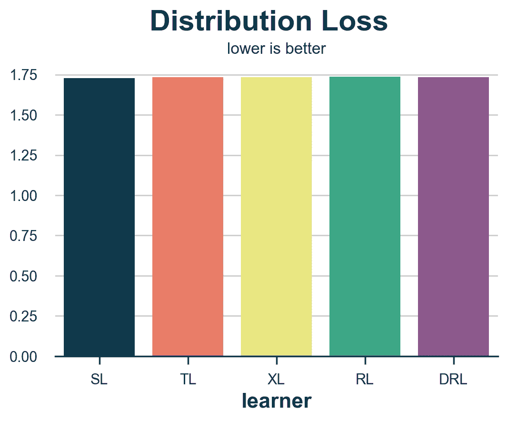

未处理的潜在结果距离值，图像由作者提供

该测量非常嘈杂，奖励了 S-学习者，其次是 T-学习者，这实际上是两个表现最差的模型。

## 上下中位数差异

上下中位数损失试图回答一个问题：我们的提升模型是否检测到**任何异质性**？特别是，如果我们取验证集并将样本分为中位数以上和中位数以下预测提升*τ̂(x)*，实际的平均效果差异有多大，用均值差异估计？我们期望更好的估计器能更好地区分高效和低效。

```py
from statsmodels.formula.api import ols 

def loss_ab(data, learner):
    tau = learner.effect(data[X]) + np.random.normal(0, 1e-8, len(data))
    data['above_median'] = tau >= np.median(tau)
    param = ols('sales ~ mail * above_median', data=data).fit().params[-1]
    return param
results = compare_methods(learners, names, loss_ab, title='Above-below Median Difference', subtitle='higher is better')
```

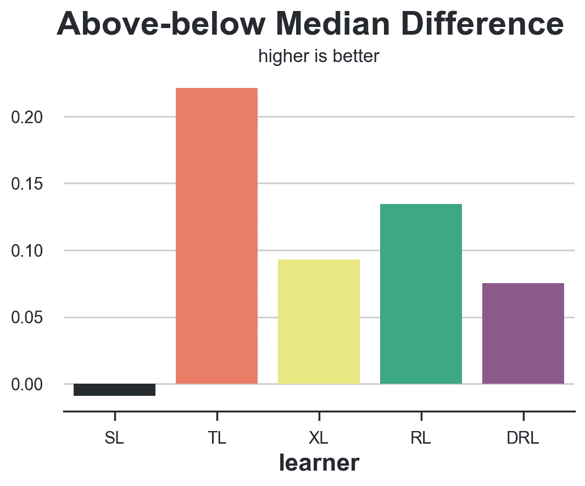

上下中位数差异增益值，图像由作者提供

不幸的是，上下中位数差异奖励了 T-学习者，它在表现最差的模型中排名靠前。

需要注意的是，即使数据来自随机实验，两组（中位数以上和中位数以下*τ̂(x)*)的均值差异估计器**也不能保证无偏**。事实上，我们在一个高度内生的变量*τ̂(x)*上将两组进行分割。因此，方法应保持谨慎。

## 提升曲线

上下中位数检验的扩展是**提升曲线**。其思想很简单：与其根据中位数（0.5 分位数）将样本分成两组，不如将数据分成更多组（更多分位数）？

对于每个组，我们计算均值差异估计，并将其累积和与相应的分位数进行绘图。结果称为**提升曲线**。解释很简单：曲线越高，我们就越能有效地区分高效和低效观察值。然而，同样的**免责声明**适用：均值差异估计并不保证无偏。因此，使用时应保持谨慎。

```py
def generate_uplift_curve(df):
    Q = 20
    df_q = pd.DataFrame()
    data = dgp.generate_data(seed_data=1, seed_assignment=1, keep_po=True)
    ate = np.mean(data[Y][data[W]==1]) - np.mean(data[Y][data[W]==0])
    for learner, name in zip(learners, names):
        data['tau_hat'] = learner.effect(data[X])
        data['q'] = pd.qcut(-data.tau_hat + np.random.normal(0, 1e-8, len(data)), q=Q, labels=False)
        for q in range(Q):
            temp = data[data.q <= q]
            uplift = (np.mean(temp[Y][temp[W]==1]) - np.mean(temp[Y][temp[W]==0])) * q / (Q-1)
            df_q = pd.concat([df_q, pd.DataFrame({'q': [q], 'uplift': [uplift], 'learner': [name]})], ignore_index=True)

    fig, ax = plt.subplots(1, 1, figsize=(8, 5))
    sns.lineplot(x=range(Q), y=ate*range(Q)/(Q-1), color='k', ls='--', lw=3)
    sns.lineplot(x='q', y='uplift', hue='learner', data=df_q);
    plt.suptitle('Uplift Curve', y=1.02, fontsize=28, fontweight='bold')
    plt.title('higher is better', fontsize=14, fontweight=None, y=0.96)

generate_uplift_curve(df)
```

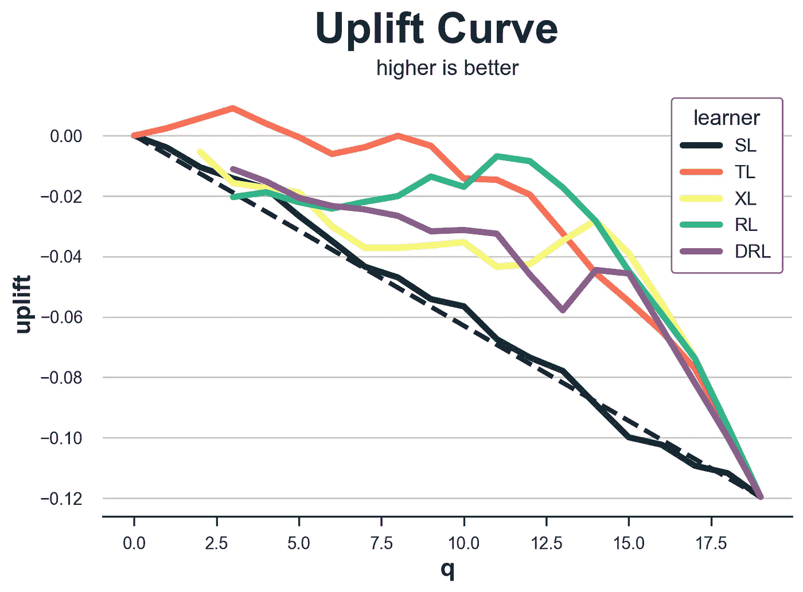

提升曲线，图像由作者提供

虽然可能不是评估提升模型的最佳方法，但提升曲线在**理解**和**实施**这些模型中非常重要。实际上，对于每个模型，它告诉我们在增加处理人群比例（x 轴）时，预期的平均处理效果（y 轴）是什么。

## 最近邻匹配

我们分析的最后几种方法使用了聚合数据来理解这些方法在更大群体中的效果。最近邻匹配方法则试图了解提升模型如何预测个体治疗效果。然而，由于 ITE 不可观察，它试图通过在可观察特征*X*上匹配处理组和对照组观察值来建立一个**代理**。

例如，如果我们取所有处理组观察值（*i: Wᵢ=1*），并在对照组中找到最近邻（*NN₀(Xᵢ)*），则相应的均方误差损失函数为

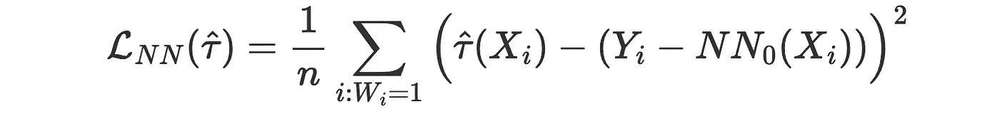

最近邻损失函数，图片由作者提供

```py
from scipy.spatial import KDTree

def loss_nn(data, learner):
    tau_hat = learner.effect(data[X])
    nn0 = KDTree(data.loc[data[W]==0, X].values)
    control_index = nn0.query(data.loc[data[W]==1, X], k=1)[-1]
    tau_nn = data.loc[data[W]==1, Y].values - data.iloc[control_index, :][Y].values
    return np.mean((tau_hat[data[W]==1] - tau_nn)**2)

results = compare_methods(learners, names, loss_nn, title='Nearest Neighbor Loss')
```

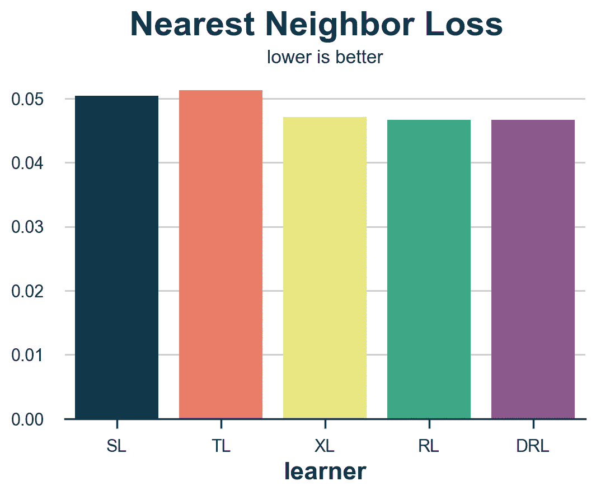

最近邻损失值，图片由作者提供

在这种情况下，最近邻损失表现得相当好，识别出了两个表现最差的方法，即 S-学习者和 T-学习者。

## IPW 损失

逆概率加权（IPW）损失函数首次由[Gutierrez, Gerardy (2017)](https://proceedings.mlr.press/v67/gutierrez17a/gutierrez17a.pdf)提出，它是我们将要看到的三种指标中的第一种，这些指标使用**伪结果** *Y* 来评估估计器。伪结果是其期望值为条件平均治疗效应的变量，但由于其波动性太大，不能直接用作估计。有关伪结果的详细解释，我建议阅读我关于因果回归树的文章。IPW 损失对应的伪结果为


IPW 伪结果，图片由作者提供

使得相应的损失函数为

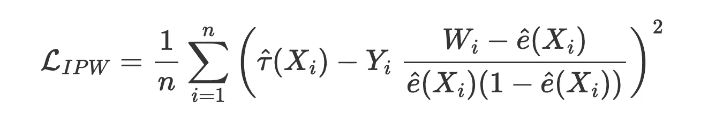

IPW 损失函数，图片由作者提供

```py
def loss_ipw(data, learner):
    tau_hat = learner.effect(data[X])
    e_hat = clone(model_e).fit(data[X], data[W]).predict_proba(data[X])[:,1]
    tau_gg = data[Y] * (data[W] - e_hat) / (e_hat * (1 - e_hat))
    return np.mean((tau_hat - tau_gg)**2)

results = compare_methods(learners, names, loss_ipw, title='IPW Loss')
```

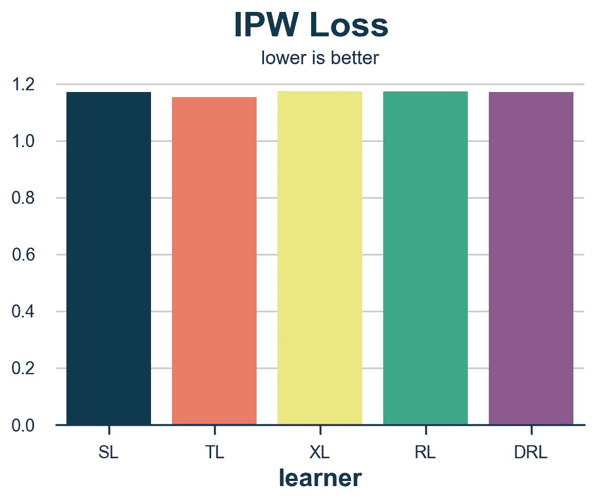

IPW 损失函数值，图片由作者提供

IPW 损失函数非常嘈杂。一种解决方案是使用其更稳健的变体，即我们接下来介绍的 R 损失或 DR 损失。

## R 损失

R 损失与 R-学习者一起由[Nie, Wager (2017)](https://arxiv.org/abs/1712.04912)引入，它本质上是 R-学习者的**目标函数**。与 IPW 损失一样，这个方法的想法是匹配一个伪结果，其期望值为条件平均治疗效应。


R 伪结果，图片由作者提供

相应的损失函数为

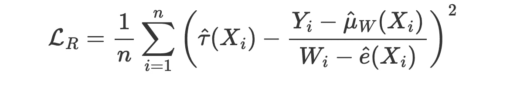

R 损失函数，图片由作者提供

```py
def loss_r(data, learner):
    tau_hat = learner.effect(data[X])
    y_hat = clone(model_y).fit(df[X + [W]], df[Y]).predict(data[X + [W]])
    e_hat = clone(model_e).fit(df[X], df[W]).predict_proba(data[X])[:,1]
    tau_nw = (data[Y] - y_hat) / (data[W] - e_hat)
    return np.mean((tau_hat - tau_nw)**2)

compare_methods(learners, names, loss_r, title='R Loss')
```

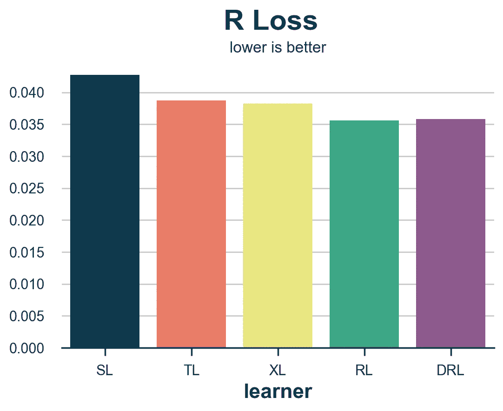

R 损失值，图片由作者提供

R 损失函数明显比 IPW 损失函数噪声更小，而且它能清晰地孤立 S-学习者。然而，它倾向于偏爱其对应的学习者，即 R-学习者。

## DR 损失

DR-loss 是 DR-learner 的**目标函数**，首次由 [Saito, Yasui (2020)](https://arxiv.org/abs/1909.05299) 提出。至于 IPW 和 R-loss，概念是试图匹配一个伪结果，其期望值是条件平均处理效应。DR 伪结果与 AIPW 估计器 密切相关，也被称为双重稳健估计器，因此得名 DR。

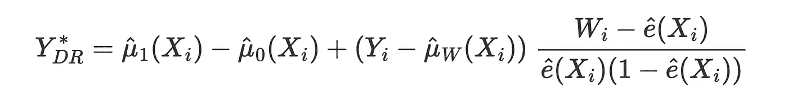

DR 伪结果，图片由作者提供

对应的损失函数是

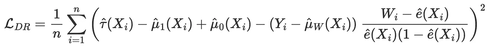

DR 损失函数，图片由作者提供

```py
def loss_dr(data, learner):
    tau_hat = learner.effect(data[X])
    y_hat = clone(model_y).fit(df[X + [W]], df[Y]).predict(data[X + [W]])
    mu1 = clone(model_y).fit(df[X + [W]], df[Y]).predict(data[X + [W]].assign(mail=1))
    mu0 = clone(model_y).fit(df[X + [W]], df[Y]).predict(data[X + [W]].assign(mail=0))
    e_hat = clone(model_e).fit(df[X], df[W]).predict_proba(data[X])[:,1]
    tau_nw = mu1 - mu0 + (data[Y] - y_hat) * (data[W] - e_hat) / (e_hat * (1 - e_hat))
    return np.mean((tau_hat - tau_nw)**2)

results = compare_methods(learners, names, loss_dr, title='DR Loss')
```

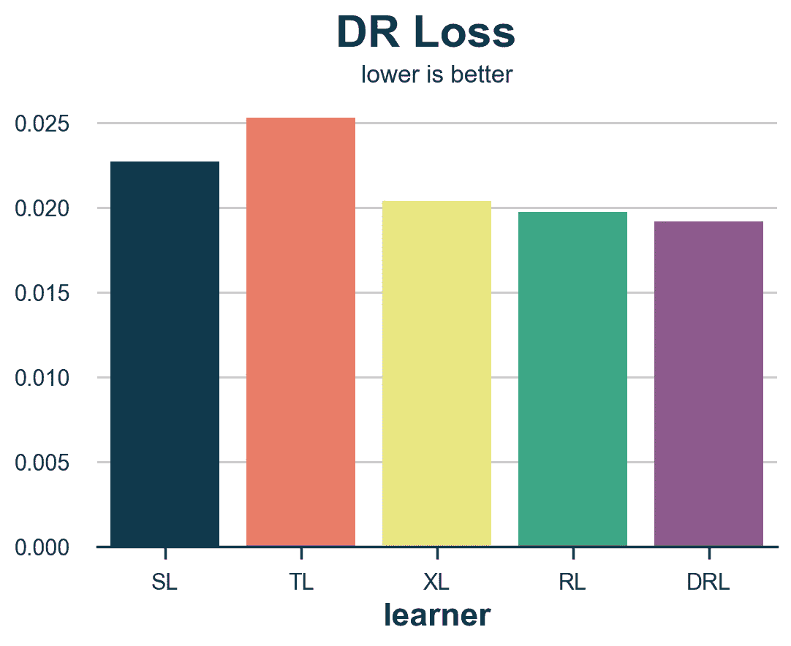

DR 损失值，图片由作者提供

与 R-loss 类似，DR-loss 倾向于偏好其对应的学习器，即 DR-learner。然而，它在算法准确性方面提供了更准确的排名。

## 实证政策收益

我们将要分析的最后一个损失函数不同于迄今为止见过的所有其他函数，因为它*不*关注我们能够多好地估计治疗效应，而是关注相应的**最佳治疗政策**的表现。特别是，[Hitsch, Misra, Zhang (2023)](https://papers.ssrn.com/sol3/papers.cfm?abstract_id=3111957) 提出了以下收益函数：

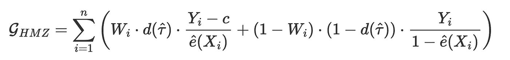

实证政策收益函数，图片由作者提供

其中 *c* 是治疗成本，*d* 是给定估计 CATE *τ̂(Xᵢ)* 的最佳治疗政策。在我们的案例中，我们假设个体治疗成本为 c=0.01$，因此最佳政策是对每个估计 CATE 大于 0.01 的客户进行治疗。

*Wᵢ⋅d(τ̂)* 和 (1-*Wᵢ*)⋅(1-d(τ̂)*) 表明我们仅对实际治疗 *W* 与最佳治疗 *d* 相匹配的个体进行计算。然而，这意味着每个模型计算的度量观测数量不同。逆权重 *ê(X)* 和 *1-ê(X)* 纠正了这种不平衡。

```py
def gain_policy(data, learner):
    tau_hat = learner.effect(data[X])
    e_hat = clone(model_e).fit(df[X], df[W]).predict_proba(data[X])[:,1]
    d = tau_hat > cost
    return np.sum((d * data[W] * (data[Y] - cost) / e_hat + (1-d) * (1-data[W]) * data[Y] / (1-e_hat)))

results = compare_methods(learners, names, gain_policy, title='Empirical Policy Gain', subtitle='higher is better')
```

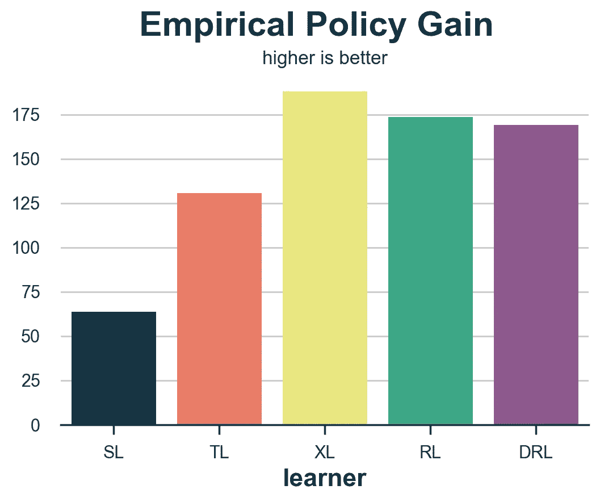

实证政策收益值，图片由作者提供

实证政策收益表现良好，能够区分出两种最差表现的方法，S-学习者和 T-学习者。

# 元研究

在本文中，我们介绍了多种评估提升模型的方法，也就是条件平均处理效应估计器。我们还在我们的模拟数据集中进行了测试，这是一个非常特殊和有限的例子。这些度量在一般情况下**表现**如何？

[Schuler, Baiocchi, Tibshirani, Shah (2018)](https://arxiv.org/abs/1804.05146) 比较了**模拟数据**上 S-loss、T-loss、R-loss 的表现。研究发现 R-loss“*是在优化时最一致地导致选择高性能模型的验证集指标*”。作者还发现了所谓的**亲和性偏差**：像 R-loss 或 DR-loss 这样的指标倾向于对相应的学习者产生偏见。

[Curth, van der Schaar (2023)](https://arxiv.org/abs/2302.02923) 从**理论角度**研究了更广泛的学习者。他们发现“*在我们考虑的所有实验条件下，没有现有的选择标准在全球范围内最好*”。

[Mahajan, Mitliagkas, Neal, Syrgkanis (2023)](https://arxiv.org/abs/2211.01939) 是**最全面**的研究，涵盖范围广泛。作者在 144 个数据集和 415 个估计器上比较了许多指标。他们发现“*没有指标显著优于其他指标*”，但“*使用 DR 元素的指标似乎总是出现在候选赢家中*”。

# 结论

在本文中，我们探讨了多种评估提升模型的方法。**主要挑战**在于感兴趣变量——个体治疗效果的不可观测性。因此，不同的方法尝试通过使用其他变量、代理结果或近似隐含的最优政策效果来评估提升模型。

很难推荐使用单一方法，因为**没有共识**哪一种表现最好，无论是从理论还是实证角度来看。使用 R-和 DR-元素的损失函数往往表现**一致较好**，但也对相应的学习者存在偏见。然而，理解这些指标的工作原理可以帮助理解它们的偏差和局限性，以便根据具体场景做出最适当的决策。

## 参考文献

+   Curth, van der Schaar (2023), [“寻求洞见，而非灵丹妙药：迈向异质治疗效果估计中的模型选择困境的揭秘”](https://arxiv.org/abs/2302.02923)

+   Gutierrez, Gerardy (2017), [“因果推断与提升建模：文献综述”](https://proceedings.mlr.press/v67/gutierrez17a/gutierrez17a.pdf)

+   Hitsch, Misra, Zhang (2023), [“异质治疗效果与最优目标政策评估”](https://papers.ssrn.com/sol3/papers.cfm?abstract_id=3111957)

+   Kennedy (2022), [“迈向最优双重稳健估计异质因果效应”](https://arxiv.org/abs/2004.14497)

+   Kunzel, Sekhon, Bickel, Yu (2017), [“使用机器学习估计异质治疗效果的元学习者”](https://arxiv.org/abs/1706.03461)

+   Mahajan, Mitliagkas, Neal, Syrgkanis (2023), [“异质因果效应估计模型选择的实证分析”](https://arxiv.org/abs/2211.01939)

+   Nie, Wager (2017), [“异质性处理效应的准 oracle 估计”](https://arxiv.org/abs/1712.04912)

+   Saito, Yasui (2020), [“反事实交叉验证：用于因果推断模型的稳定模型选择程序”](https://arxiv.org/abs/1909.05299)

+   Schuler, Baiocchi, Tibshirani, Shah (2018), [“在估计个体处理效应时模型选择方法的比较”](https://arxiv.org/abs/1804.05146)

## 相关文章

+   理解元学习器

+   理解 AIPW，双重稳健估计量

+   理解因果树

+   从因果树到森林

## 代码

你可以在这里找到原始的 Jupyter Notebook：

[](https://github.com/matteocourthoud/Blog-Posts/blob/main/notebooks/evaluate_uplift.ipynb?source=post_page-----8a078996a113--------------------------------) [## Blog-Posts/notebooks/evaluate_uplift.ipynb at main · matteocourthoud/Blog-Posts

### 我在 Medium 博客文章中使用的代码和笔记本。通过创建一个…

github.com](https://github.com/matteocourthoud/Blog-Posts/blob/main/notebooks/evaluate_uplift.ipynb?source=post_page-----8a078996a113--------------------------------)

# 感谢你的阅读！

*非常感谢！* 🤗 *如果你喜欢这篇文章并想查看更多内容，可以考虑* [***关注我***](https://medium.com/@matteo.courthoud)*。我每周发布一次与因果推断和数据分析相关的主题。我尽量保持我的文章简明但精准，始终提供代码、示例和模拟。*

*另外，一个小小的* ***免责声明****：我写作是为了学习，所以错误是常有的，即使我尽力而为。请在发现错误时告知我。我也欢迎关于新主题的建议！*
