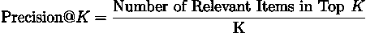

# 推荐系统的评估指标 — 概述

> 原文：[`towardsdatascience.com/evaluation-metrics-for-recommendation-systems-an-overview-71290690ecba?source=collection_archive---------3-----------------------#2023-08-09`](https://towardsdatascience.com/evaluation-metrics-for-recommendation-systems-an-overview-71290690ecba?source=collection_archive---------3-----------------------#2023-08-09)

## 理解机器学习包中常见指标的目的和功能

 [Pratik Aher](https://medium.com/@pratikaher?source=post_page-----71290690ecba--------------------------------)

·

[关注](https://medium.com/m/signin?actionUrl=https%3A%2F%2Fmedium.com%2F_%2Fsubscribe%2Fuser%2Fc2e5b1d7be67&operation=register&redirect=https%3A%2F%2Ftowardsdatascience.com%2Fevaluation-metrics-for-recommendation-systems-an-overview-71290690ecba&user=Pratik+Aher&userId=c2e5b1d7be67&source=post_page-c2e5b1d7be67----71290690ecba---------------------post_header-----------) 发布于 [Towards Data Science](https://towardsdatascience.com/?source=post_page-----71290690ecba--------------------------------) ·7 min read·2023 年 8 月 9 日

--

最近，在实验推荐系统项目时，我发现自己使用了各种评估指标。因此，我汇总了一些有用的指标以及评估推荐系统时需要考虑的其他事项。这些指标在机器学习包中很常见，但理解它们的目的和功能是至关重要的。

## **召回率 @K**

召回率@K 衡量了在所有相关项目中，前 K 个中有多少是相关的，其中 K 是为用户生成的推荐数量。例如，如果我们正在构建一个电影推荐系统，为每个用户推荐 10 部电影。如果一个用户看过 5 部电影，而我们的推荐列表中有 3 部（在 10 个推荐中），那么用户的召回率@10 计算为 3/5 = 0.6。通常，平均值是对所有用户进行评估的。

从商业角度来看，这是一个简单但重要的指标，因为我们可以展示系统在预测用户行为方面带来的实际价值。

*范围：0–1*

## 精确度 @K

精确度@K 衡量了推荐给用户的“K”个项目中有多少是相关的，其中 K 是为用户生成的推荐数量。

对于一个推荐系统，我们为每个用户推荐 10 部电影。如果一个用户看过 5 部电影，而我们能预测其中 3 部（这 3 部电影在我们的推荐列表中），那么我们的精确度@10 就是 3/10。

> 从规模和排名的角度来看，这是一个非常重要的指标，因为在现实世界中，你可以提供给用户的推荐数量是有限的。这可以与以下因素相关：注意力跨度（用户希望能在一眼看到相关的推荐，因此相关推荐位于顶部是至关重要的），以及存储需求：假设你只能为每个用户存储 100 个推荐，那么你需要精确选择。

*范围：0–1*

## F1 @K

F1 分数是精确度和召回率的调和均值的组合。这与常规的 F1 分数相同，在推荐系统的背景下没有区别。调和均值的特性确保如果精确度或召回率的值非常高，那么它不会主导分数。当精确度和召回率的值都接近 1 时，F1 分数值会很高。

*范围：0–1*

# 排名相关指标：

如上所述，谈到精确度时，将相关推荐放在顶部是至关重要的。有多种方法来测量相关推荐是否确实在顶部。这些测量不仅用于评估，还作为排名模型的损失指标。

## 平均精确度 @K

评估推荐列表在基于列表中的位置预测相关项目的效果的一种方法是使用“平均精确度”。

首先，我们来理解什么是平均精确度。如果我们推荐了 K 个项目，其中 Q 个是相关的，那么平均精确度定义为：

如果所有相关项目都在顶部，那么该用户的平均精确度分数就会很高。

示例：

> 推荐列表 : [“壮志凌云”, “降临”, “角斗士”]
> 
> 真实情况 : [“降临”, “角斗士”]
> 
> 精度 @K = [0, 1/2, 2/3]
> 
> 平均精度（AP）= (1/3)[(1/2) + (2/3)] = 0.38

MAP 中的平均值只是所有用户的平均精度（AP）值：

*范围 : 0–1*

## 平均倒数排名（MRR）

平均倒数排名衡量推荐列表中第一个相关项目的位置。倒数排名（RR）用于我们只关心排名最高结果的位置。在这里，排名是推荐列表中项目的位置。

倒数是有用的，因为它确保排名较低的项目（例如，第 20 位）获得较低的分数，因为大值的倒数是非常小的值。因此，如果最相关的项目被预测在列表顶部，则受益。

倒数排名只关心第一个相关项目。例如，

> 推荐列表 : [“壮志凌云”, “降临”, “角斗士”]
> 
> 真实情况 : “降临”
> 
> 然后，倒数排名（RR）= (1/2) = 0.5

在推荐系统的背景下，我们也可以使用 MRR，如果我们在推荐系统中有多个值，我们可以对它们取平均。

> 推荐列表 : [“壮志凌云”, “降临”, “角斗士”]
> 
> 真实情况 : [“降临”, “角斗士”]
> 
> 然后，平均倒数排名（MRR）= 1/2* ((1/2) + (1/3)) = 0.41

*范围 : 0–1*

## 归一化累积折扣增益（NDCG）

归一化折扣累积增益（NDCG）是衡量排名列表质量的指标。 其思想是，如果相关项目从最相关到最不相关排序，那么当最相关的项目被推荐到列表顶部时，NDCG 分数会最大化。

让我们用一个例子来解析：

为了保持之前的例子：如果我们确定一个用户是动作电影爱好者，那么假设相关性分数为：

> “壮志凌云”, “角斗士”: 2（最相关）
> 
> “玩具总动员”: 1
> 
> “鲸鱼” : 0（最不相关）

推荐列表 :

> [“壮志凌云”, “玩具总动员”, “鲸鱼”, “角斗士”] ⇒ [2, 1, 0, 2]

累积增益（CG）：位置 p 的累积增益是该位置的相关性分数。因此，对于整个列表，它是：2 + 1 + 0 + 2 = 5

累积增益不考虑项目的位置。因此，如果最相关的项目在列表末尾（如“角斗士”），则不会反映在 CG 分数中。

为了解决这个问题，我们引入了**折扣累积增益**（DCG），我们为每个位置分配一个分数/折扣，以便相关性分数会受到惩罚。

因此，如果一个像“角斗士”这样的相关项目被放在列表的最后，它将按 1/log2(n)（其中 n 是列表的大小：它将乘以一个像 0.2 这样较小的数字，因此其对分数的贡献将非常小）进行折扣，而第一个项目不会折扣。

如果所有相关项目都位于顶部，DCG 分数会最高。

对于这些项目，集合 A: [2, 1, 0, 2]：

让我们将其与集合 B: [2, 2, 1, 0] 进行比较，其中所有相关项目都位于顶部：

显然，集合 B 的 DCG 高于集合 A 的 DCG。此外，集合 B 是我们称之为理想折扣累积增益（IDCG）的，它给出了按相关性分数完美排序的理想列表的 DCG。

*如果我们需要比较两个不同大小列表的 DCG 分数怎么办？*

这时 IDCG 就派上用场了，我们将 DCG 分数除以 IDCG 分数，得到一个 0 到 1 之间的值。这个分数被称为标准化折扣累积增益（nDCG）。

现在我们可以比较两个不同大小列表的 nDCG 分数。

*nDCG 范围：0–1*

这是一些广泛用于评估推荐系统的指标的概述。

## 评估推荐系统时需要考虑的事项：

我计划很快将这些主题整理成文章，到时会在这里链接。

1.  流行度偏差

推荐系统中可能存在大量的流行度偏差，并且难以检测和修复，因为流行项目相关性高，并且在大多数标准指标中得分很高。测量和修复流行度偏差有多种方法，我计划整理一篇讨论这些方法的文章。

图片来源：作者

2\. 位置偏差

位置偏差发生在列表中排名较高的项目更可能被查看或购买，无论其实际相关性如何。因此，排名较低的项目获得的互动较少。这也可能影响其他指标，并且有方法可以缓解这种情况。

3\. 退化反馈循环

当用户仅限于与建议的项目互动，并且算法依赖于这些建议的用户反馈进行训练时，可能会出现负反馈循环。这个循环加强了展示之前已经显示过的项目，可能导致随着时间的推移用户体验变差，因为用户未发现大量相关项目。

**参考文献：**

 [## Wikiwand - 平均倒排排名

### 平均倒排排名是评估生成可能响应列表的任何过程的统计测量…

[www.wikiwand.com](https://www.wikiwand.com/en/Mean_reciprocal_rank?source=post_page-----71290690ecba--------------------------------)  [## 推荐系统的均值平均精度（MAP）

### (好吧，这里有个小玩笑。) 既然你正在阅读这篇文章，你可能刚刚遇到了“均值平均精度（Mean Average Precision）”这个术语，或者……

[推荐系统的评价指标](https://sdsawtelle.github.io/blog/output/mean-average-precision-MAP-for-recommender-systems.html?source=post_page-----71290690ecba--------------------------------)  ## 推荐系统的评价指标

### 推荐系统在在线零售中变得越来越流行。来看一下用来……

[towardsdatascience.com
