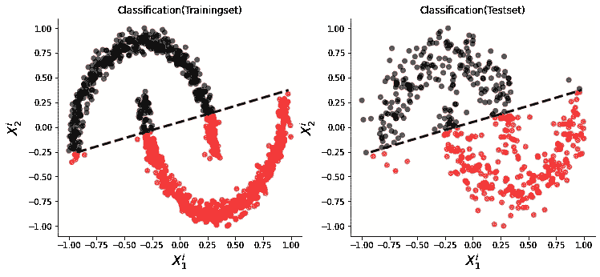
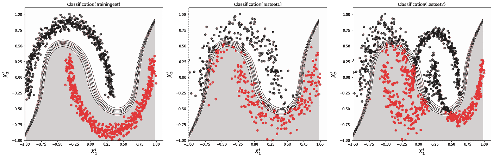
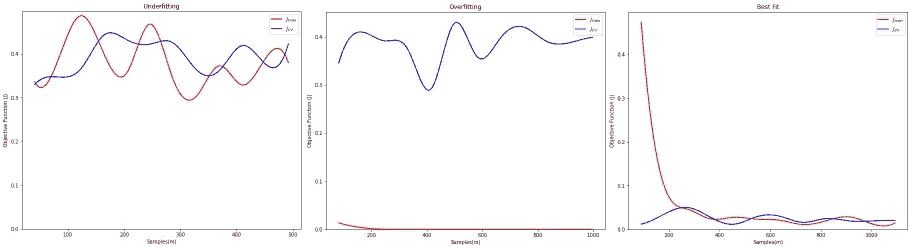
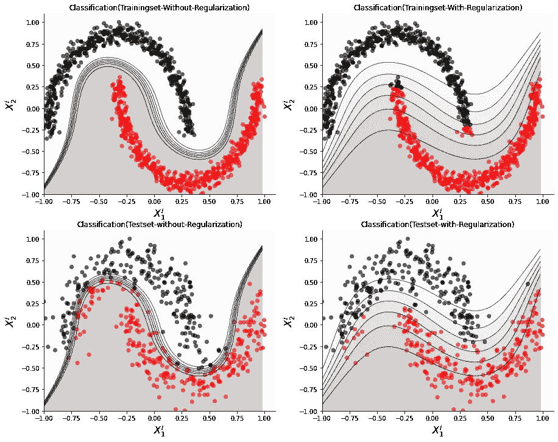
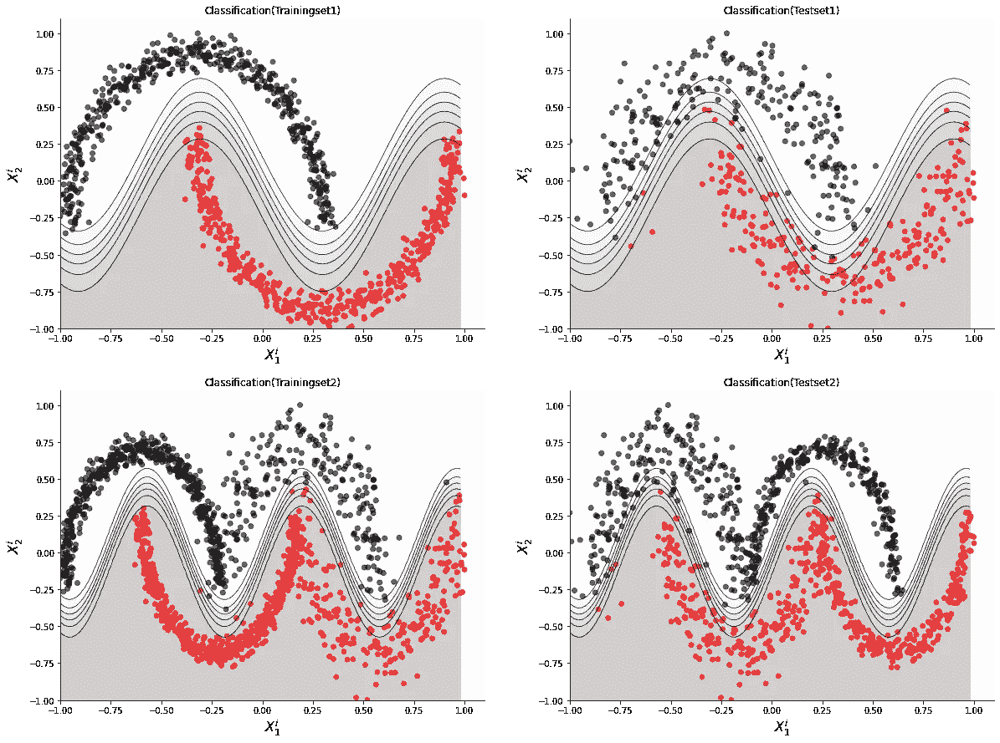
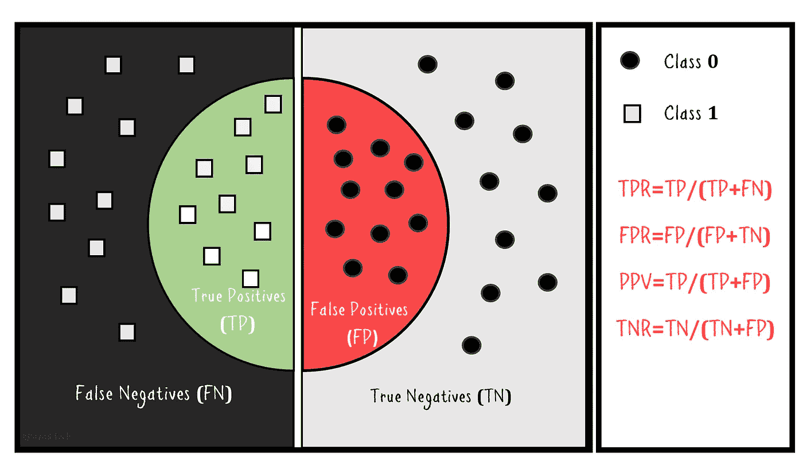
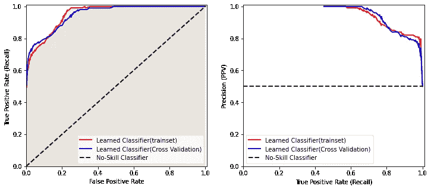

# 机器学习分类器的评估

> 原文：[`towardsdatascience.com/evaluation-of-machine-learning-classifiers-3912e7f5cf74`](https://towardsdatascience.com/evaluation-of-machine-learning-classifiers-3912e7f5cf74)

## **偏倚-方差分析、正则化、性能指标的解释及和谐分类器的实现**

 [J. Rafid Siddiqui, PhD](https://azad-wolf.medium.com/?source=post_page-----3912e7f5cf74--------------------------------)

·发布于[Towards Data Science](https://towardsdatascience.com/?source=post_page-----3912e7f5cf74--------------------------------) ·10 分钟阅读·2023 年 1 月 15 日

--

图 1：偏倚-方差分析结果的示意图（来源：作者）

在之前的文章中，我们讨论了各种用于分类任务的机器学习方法。我们也重复使用了*正则化*、*过拟合*和*欠拟合*等术语。在本文中，我们将详细介绍这些术语，并展示如何规避这些问题。此外，我们还将讨论各种用于衡量分类器性能的指标。

**1.** **偏倚-方差分析**

偏倚-方差分析是评估机器学习分类器的一个过程。每个分类器都可能出现*高偏倚*或*高方差*问题，这取决于训练条件。了解这些常见问题并加以防范，可以帮助构建更好、更通用且高性能的模型。

+   **高偏倚（欠拟合）**

当一个分类器对某种类型的预测（例如某个类别）存在高度偏倚，而无论输入数据如何变化，这种模型就会出现*高偏倚*问题。例如，如果我们在一个无法线性分离的训练集上训练一个线性模型，那么该模型即使在训练集上也会表现得很糟糕。因此，我们称这样的模型为欠拟合模型，因为它没有完全捕捉数据集的结构。图 2 展示了一个欠拟合问题的示例。

图 2：一个模型出现欠拟合问题的示例（来源：作者）

如你所见，这样的模型在训练集和测试集上表现都很差。这是因为模型没有足够的参数来处理数据中的非线性。也可能是数据量不足。在样本量过小的情况下，模型无法收敛到最佳点， resulting model 会遭遇欠拟合问题。

· **高方差（过拟合）**

训练机器学习分类器时常见的另一个问题是，当模型在训练集上表现良好时，但当它在不同于已训练过的样本的测试集上进行测试时，其性能显著下降。这种问题被称为*高方差*或*过拟合*问题。之所以这样命名，是因为模型在预测输出中具有高方差。换句话说，模型无法处理给定类别输入样本中的方差，而是为同一类别产生不同的预测。图 3 展示了这种*过拟合*问题的一个示例。

图 3：一个遭遇过拟合问题的模型示例（来源：作者）

· **学习曲线（诊断）**

现在你知道了高偏差和高方差的问题，你可能会想，如何判断模型遭遇了哪种问题。在像示例中这样的二维数据中，我们可以通过绘制数据和分类器的决策边界来轻松看出。然而，当数据是多维的时，这样做是不切实际的。因此，需要一种通用的诊断方法来找出具体的问题。*学习曲线*就是一种可以用来发现问题类型的标准。更具体地说，我们绘制从训练集中随机抽取的数据实例的目标函数值。然后，我们逐步增加样本数量，并不断绘制新数据样本的目标函数值。这为我们提供了模型在训练集上的表现曲线。除了训练集外，我们还使用*交叉验证*集来验证性能。我们在训练-测试拆分之外创建一个单独的数据拆分，并称之为*交叉验证*集。所有的参数调优和评估都在训练阶段对这个*交叉验证*集进行比较。我们还重复上述过程，为*交叉验证*集绘制学习曲线。图 4 展示了这种学习曲线的一个示例结果。

图 4：分别为欠拟合、过拟合和最佳拟合的学习曲线示例（来源：作者）

如果我们观察学习曲线，我们会发现当两条曲线（即**Jₜ**和**Jcᵥ**）都不收敛时，我们就有了欠拟合问题，这意味着模型没有学习任何东西，并且无法准确分类训练数据和测试数据。然而，当我们看到训练数据的曲线**Jₜ**明显收敛，而交叉验证集的曲线（**Jcᵥ**）则出现发散时，那么我们就有了过拟合问题。训练集和交叉验证集最终成本值之间的差距越大，模型过拟合的概率就越大，模型在新的示例上的表现将不如在已经训练过的示例上的表现。如果模型拟合最佳，两条曲线将收敛，这表明模型平衡，对训练和测试样本的表现都很好。需要注意的是，在复杂的数据集中，两条曲线可能不会完全收敛到绝对零点，两者之间可能存在小的差距，但这不应该是显著的差距，距离绝对收敛点不应过大。

**2.** **解决方案**

在上一节中，我们讨论了机器学习分类器可能遇到的多个问题，这里列出了一些克服这些问题的缓解策略。

· **使用更好的数据**

构建机器学习模型时的大多数问题源于数据质量不佳。如果数据集过小、噪声过多和/或包含矛盾/误导性数据点，则最佳的解决方案是寻找更好的数据。不平衡的数据集以及某一类实例相对于其他类别的少量实例也可能导致过拟合问题。如果过拟合问题是由于数据不足引起的，则增加数据量可以解决这个问题。如果问题由于数据不平衡引起的，那么归一化和分层数据也可以有所帮助。

· **正则化**

处理过拟合问题的一种方法是引入目标函数中的正则化项，这将稍微放松约束，从而适应数据中的变异。更具体地说，我们可以在目标函数中添加一个项（例如，权重的 L1/L2 范数），这样对于训练集中由于噪声产生的轻微偏差点，将会减少惩罚。这样的正则化示例可以在图 5 中看到。

图 5：使用正则化解决过拟合问题的效果示例（来源：作者）

如果我们观察正则化对分类边界的影响，我们会注意到它会使分类边界变宽，从而允许噪声点的容纳，否则这些点由于决策边界过紧会被错误分类。然而，这可能会以训练集性能下降为代价，正如图 5 所示。因此，这取决于选择，由一个参数*Lambda*控制，该参数决定在构建分类器时应给予正则化项多少权重。*Lambda*的最佳值也可以通过在训练和交叉验证集上绘制学习曲线，并在保持数据大小相同的情况下，绘制*Lambda*参数的变化来学习。

· **构建更好的特征空间**

当问题由于不良/不足的特征空间而出现时，我们必须构建一个更好的特征空间。例如，在之前提到的欠拟合问题（即，在非线性数据集上使用线性分类器）中，必须增加特征的数量和类型。我们可以在图 3 中看到添加更多特征（即 3 阶多项式模型）的结果。模型在分类训练集方面表现良好，因此解决了欠拟合问题。然而，我们也看到它开始遭遇过拟合问题，并且对某些数据样本过于限制。我们在前面的部分讨论了如何减轻过拟合问题。然而，在某些情况下，仅仅将特征空间更改为更合适的空间可以显著提高性能，并提供一个对未见数据也能稳健工作的更通用的模型。如果我们仔细观察数据，我们应该会看到它是一个重复的模式，我们可以使用谐波分类器来建模。事实上，如果我们用谐波分类器（例如，正弦波）来建模，我们可以获得一个适用于任何新样本的模型，从而提供一个通用的解决方案。图 6 中展示了一个*谐波*分类器拟合数据的例子。正如我们所见，它不仅能够仅用一个周期来学习和分类训练集，而且对任何数量的周期都很稳健。

图 6：谐波分类器在非线性数据上的结果（来源：作者）

**3.** **性能指标**

图 7：二分类问题的性能指标（来源：作者）

一旦分类器训练完成，就需要一个度量来评估分类性能的好坏。可以使用多种指标进行这种性能评估。准确率是许多任务中常用的指标；然而，当数据集不平衡时，它是一种不好的指标。如果数据集中只有少量某一类的实例，准确率将会严重偏向于多数类。在这种情况下，必须使用其他指标。如图 7 所示，我们构建了一组指标，例如*真正例率（TPR）*和*假正例率（FPR）*，通过计算分类标签的频率来进行评估。*TPR（召回率/敏感性）*衡量分类器对正类（即类 1）的预测准确率，而*FPR*衡量分类器对负类（即类 0）的预测性能。高*召回率/TPR*与低*FPR*之间总是存在权衡。例如，如果我们以目标检测器/分类器为例，那么*TPR*告诉我们检测器在所显示的对象中正确找到对象的频率，而*FPR*则衡量检测器在场景中没有对象时错误检测对象的频率。

此外，分类器的性能在很大程度上依赖于用于将点分类到某一类的概率阈值。例如，在二分类器的情况下，我们可能会使用一个阈值（例如 0.5）对输出概率进行分类，并根据输出概率的值将点分类为***0***类或***1***类。然而，0.5 是一个任意值，在不同的分类场景中可能有所不同。因此，为了找到最佳阈值——即分类器性能最佳的阈值，可以将阈值从**0**调整到***1***，并观察性能指标（例如*TPR*、*FPR*等）。这个过程称为*接收操作特性分析*（*ROC*），通过绘制*ROC*曲线来执行。*ROC*曲线是通过绘制*FPR*与*TPR*的关系来获得的，同时调整分类器的阈值。曲线下方的面积提供了性能度量（即，面积越大，分类性能越好）。一个无技能分类器（即返回随机类别或常量类别作为预测输出的分类器）被绘制为对角线。任何接近无技能分类器的输出曲线都被认为是没有分类能力的坏分类器。完美分类器由位于左上角的方形曲线表示。这种*ROC*曲线的示例输出可以在图 8 中看到。

图 8：ROC 曲线和精确度-召回曲线（来源：作者）

除了*ROC*曲线，还有另一种指标称为“*精确度-召回率*”曲线。它是通过绘制*TPR*与精确度/*PPV（正预测值）*的关系来获得的。精确度衡量分类的正确性。如果我们以之前的目标检测类比，那么精确度衡量的是分类器在检测到的对象中正确分类的频率。与*TPR vs FPR*一样，*TPR*和*精确度*之间也存在权衡。高*TPR*可能会以损失*精确度*为代价。*精确度-召回率*曲线对于不平衡数据特别有用。*精确度-召回率*的解释类似于*ROC*曲线。然而，完美的分类器性能位于右上角，而无技能分类器（例如，大多数分类器或随机分类器）则显示为 0.5 附近的平坦线。

**4.** **结论**

在本文中，我们讨论了在训练机器学习分类器时出现的问题。我们解释了如何诊断这些问题的类型。然后，我们解释了应对这些问题的各种缓解策略。我们还讨论了评估机器学习分类器的各种性能指标。评估方法是机器学习建模范式的一个重要方面，对模型的稳健训练和超参数优化有帮助。你可以通过下面链接中的代码进一步练习这些方法和概念。

**代码：**

[`www.github.com/azad-academy/MLBasics-Evaluation`](https://www.github.com/azad-academy/MLBasics-Evaluation)

**成为 Patreon 支持者：**

[`www.patreon.com/azadacademy`](https://www.patreon.com/azadacademy)

**在 Substack 上找到我：**

[`azadwolf.substack.com`](https://azadwolf.substack.com)

**关注 Twitter 以获取更新：**

[`twitter.com/azaditech`](https://twitter.com/azaditech)
