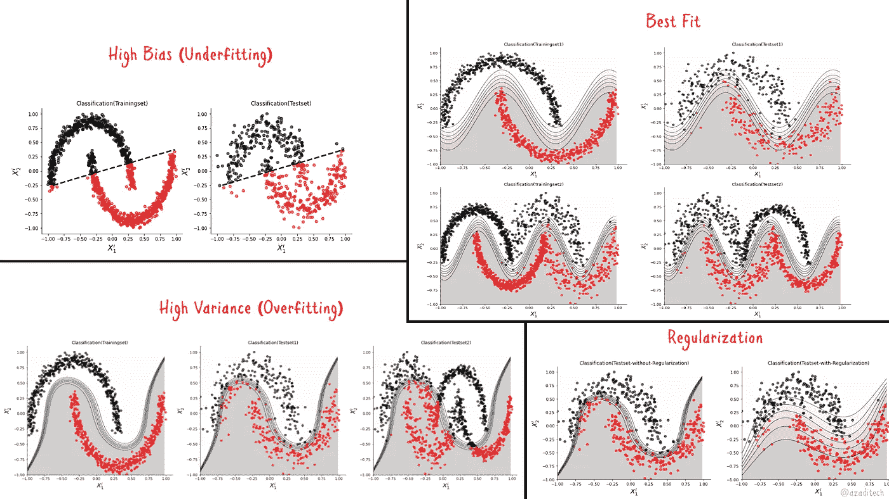

# 机器学习分类器的评估

> 原文：[`towardsdatascience.com/evaluation-of-machine-learning-classifiers-3912e7f5cf74?source=collection_archive---------2-----------------------#2023-01-15`](https://towardsdatascience.com/evaluation-of-machine-learning-classifiers-3912e7f5cf74?source=collection_archive---------2-----------------------#2023-01-15)

## **偏差-方差分析、正则化、性能指标以及谐波分类器的实现说明**

 [J. Rafid Siddiqui, PhD](https://azad-wolf.medium.com/?source=post_page-----3912e7f5cf74--------------------------------)

·

[关注](https://medium.com/m/signin?actionUrl=https%3A%2F%2Fmedium.com%2F_%2Fsubscribe%2Fuser%2Feb523dd294ec&operation=register&redirect=https%3A%2F%2Ftowardsdatascience.com%2Fevaluation-of-machine-learning-classifiers-3912e7f5cf74&user=J.+Rafid+Siddiqui%2C+PhD&userId=eb523dd294ec&source=post_page-eb523dd294ec----3912e7f5cf74---------------------post_header-----------) 发表在 [Towards Data Science](https://towardsdatascience.com/?source=post_page-----3912e7f5cf74--------------------------------) ·10 分钟阅读·2023 年 1 月 15 日

--

图 1：偏差-方差分析结果的描述（来源：作者）

在之前的文章中，我们讨论了用于分类任务的各种机器学习方法。我们还反复使用了*正则化*、*过拟合*和*欠拟合*等术语。在本文中，我们将详细介绍这些术语，并展示如何避免这些问题。此外，我们还将讨论用于衡量分类器性能的各种指标。

**1.** **偏差-方差分析**

偏差-方差分析是评估机器学习分类器的一个过程。每个分类器可能会受到*高偏差*或*高方差*问题的影响，具体取决于训练条件。了解这些常见问题并加以预防，可以帮助构建更好、更通用和高性能的模型。

+   **高偏差（欠拟合）**

当一个分类器对某种类型的预测（例如某个类别）高度偏向，无论输入数据如何变化，我们称这种模型存在*高偏差*问题。例如，如果我们在一个不可线性分离的训练集上训练线性模型，那么这样的模型…
