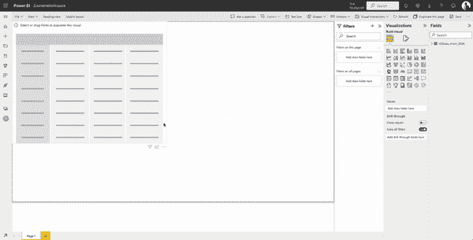

# 你需要了解的关于热图的一切——PowerBI 教程

> 原文：[`towardsdatascience.com/everything-you-need-to-know-about-heatmap-tutorial-with-powerbi-977437080280`](https://towardsdatascience.com/everything-you-need-to-know-about-heatmap-tutorial-with-powerbi-977437080280)

## 了解热图的所有细节以及它们在 Power BI 中的应用

 [Zoumana Keita](https://zoumanakeita.medium.com/?source=post_page-----977437080280--------------------------------)

·发表于[Towards Data Science](https://towardsdatascience.com/?source=post_page-----977437080280--------------------------------) ·阅读时间 7 分钟·2023 年 2 月 8 日

--

图片由[Henrique Sá](https://unsplash.com/@henriquesaf)提供，来源于[Unsplash](https://unsplash.com/photos/cxcCJVep9DI)

# 动机

作为数据科学家，能够为企业提供清晰简明的可视化，有助于他们快速高效地获取数据的关键信息，从而做出决策。

不同类型的可视化用于传达不同的信息。例如，直方图用于测量数值数据的分布，散点图用于分析变量之间的关系，数据透视表用于在一个表中总结关键统计信息，仅举几个使用 Power BI、Tableau 等工具的例子。

本文旨在介绍一种名为热图的数据可视化方法。我们将首先帮助你了解热图的概念，然后突出它们的好处。接着，将进行实践操作，帮助你理解如何使用 Power BI 工作。最后，我们将讨论在使用 Power BI 热图时需要注意的事项。

# 什么是数据可视化热图？

热图最初由[Cormac Kinney](https://en.wikipedia.org/wiki/Cormac_Kinney)引入，用于图形化表示实时金融信息。它们用于数据可视化，以测量给定业务值的强度，使用不同的颜色进行编码。

以下图片是热图的一个示例，由 NASA 于 2022 年 7 月 13 日分享。它显示了世界上许多国家的地表气温。区域越热，颜色越深；反之，最冷的区域颜色趋向于蓝色。这些信息一目了然。

来源: [NASA 热浪图](https://earthobservatory.nasa.gov/images/150083/heatwaves-and-fires-scorch-europe-africa-and-asia) 显示全球温度的惊人上升

数据科学家可以利用这些工具将公司的信息转化为易于理解的可视化，以帮助他们做出可操作的智能决策。

# 为什么热图有用？

使用热图可以在不同层级上提供显著的直观信息表现。这是商业智能中最强大的方法之一。此外，许多企业因以下原因使用热图：

## 1\. 对客户行为有一个全球概览

在设计一个工具，如网站时，我们对最终用途有一个期望。然而，最终用户可能对设计概念的理解不够准确，这可能导致他们与工具的互动不同。在这种情况下，热图可视化可以通过跟踪主要页面获得更多关注的区域以及被点击最多的区域（可点击和不可点击），来更好地理解用户的行为。

## 2\. 改善业务表现

在更好地理解用户行为后，企业可以设计和设置工具，以便人们能够在正确的位置找到所需的信息。这样可以增加流量，从而创造更多的商业价值。

## 3\. 一个良好的可视化分析替代方案

热图可视化可以提供深入的视觉理解，了解用户如何与您的业务网站互动，并且可以成为像 Google Analytics 这样的工具的良好替代方案，因为这些工具并不总是直观，有时甚至会令人感到不知所措。

## 4\. 数据科学家可视化特征关系的良好方式

热图是我在执行相关性分析时的首选方法。与处理相关矩阵中的数值相比，热图可以快速提供多个变量之间关系的视觉表示，以训练您的机器学习模型。

# 热图示例

热图在不同领域提供了广泛的可能性，因为它们能够生成简单的数据视觉表现。以下是五种不同类型及其应用。

## 1\. 网络热图

这些类型的热图被那些活动以互联网为驱动的组织使用，例如媒体服务、SaaS 公司、电子商务公司等。他们利用热图可视化来监控和理解用户在其平台上的行为，以发现更好的决策洞察。一些网络热图包括：

+   **点击图** 显示了 Web 应用程序中哪些部分点击最多。

+   **滚动图** 突出显示用户在进一步导航之前向下滚动了多远的网页。

+   **眼动追踪** 由于某些复杂性，可能并不总是显而易见。总体目标是捕捉用户最关注的区域。

+   **鼠标跟踪**被一些研究表明是眼动追踪的替代方法。

## 2\. 地理热图

主要由地球科学家使用，地理热图在真实地图上显示数据，并为某些地理区域分配高低密度。这种情况的一个例子是前面显示的 NASA 示例。

## 3\. AI 生成的热图

随着人工智能的兴起，这些热图可视化已获得成功。例如，它们可以用于现代车辆中监测驾驶员的视觉行为，以通过尽量减少认知干扰来提高道路安全。

## 4\. 财务中的热图

热图可以被金融市场专家用来快速评估公司表现以及资产、产品等市场值的持续波动。

## 5\. 体育中的热图

许多体育教练和经理现在不仅用热图监控他们球员的表现，还研究对手队员，以制定赢得比赛的策略。

# 在 Power BI 上创建热图的逐步指南

现在你对热图有了总体了解以及一些可视化的例子，本节将提供创建你自己视频游戏销售热图表的技能。该表将展示每个平台的年度全球销售额，从 2006 年到 2020 年。

使用的数据可以在[Kaggle](https://www.kaggle.com/datasets/gregorut/videogamesales)上自由获取，这是一个具有内置数据集的协作云环境。

## 从上传数据到 Power BI 开始

从左侧列面板中选择工作区标签以上传数据。如果还没有工作区，请创建一个。

数据上传到 PowerBI 工作区（作者动画）

## 从你感兴趣的列中创建一个矩阵

在构建热图表可视化之前，我们需要从数据中创建一个二乘二矩阵。这可以通过左侧列上的加号完成。

**选择你的数据和矩阵模板**：这对应于选择你想从中构建热图表的数据。

+   *+> 添加数据以开始 > 选择一个已发布的数据集 > 选择一个数据集以创建报告*。从这里你可以选择数据并点击**创建**按钮。然后，从右上角的**可视化**标签中选择矩阵模板。

选择数据和矩阵模板（作者动画）

**从数据创建矩阵**：我们需要选择要显示的行、列和值。在我们的案例中：

+   行将对应不同的平台。

+   列表示年份。

+   值是每个平台在特定年份的全球销售额。

点击你的矩阵 > 右侧展开数据 > 这将显示你数据中的所有列。

+   拖动并将平台放入行字段。

+   拖动并将年份放入列字段。

+   拖动并将全球销售放入值字段。

从数据创建矩阵（动画由作者提供）

让我们移除总计行和列，因为保留它们可能会信息过多。来自**可视化**选项卡：

+   格式化你的视觉效果（画笔）> 关闭行和列的小计

关闭**总计**行和列（动画由作者提供）

## 构建你的热图

构建热图表可视化包括两个主要步骤：（1）使用颜色范围对每个销售值的背景进行编码，以及（2）对值的字体使用相同的颜色范围。

（1）从“值”中选择 Global_Sales > 条件格式 > 背景颜色

当全球销售值较低时，颜色会更白；相反，当销售值较高时，颜色会更红。

背景的条件格式（动画由作者提供）

（2）从“值”中选择 Global_Sales > 条件格式 > 字体颜色

值字体的条件格式（动画由作者提供）

恭喜！你已经使用 Power BI 创建了热图表可视化。

# 使用 Power BI 热图时需要记住的事项

在使用 Power BI 构建热图时，请记住以下关键点：

+   热图是由密度和强度驱动的。因此，选择准确代表这些信息的颜色很重要。

+   如果在“值”部分没有使用数值数据，你将无法获得条件格式选项。

+   在将数据转换为矩阵后，一些单元格可能没有值。在这种情况下，PowerBI 提供了将这些值设置为零的选项，这可能会很有帮助。

+   你可以通过使用预定义的颜色或自定义自己的颜色来定制 Power BI 热图。

+   Power BI 热图仅在 Power BI 市场中提供。

# 结论

这篇概念性博客提供了热图的完整概述以及它们对不同领域业务的好处。同时，你也学会了如何使用 Power BI 创建自己的热图可视化。

此外，如果你喜欢阅读我的故事并希望支持我的写作，考虑 [成为 Medium 会员](https://zoumanakeita.medium.com/membership)。每月 $5 的承诺可以解锁对 Medium 上故事的无限访问。

随时在 [Medium](https://zoumanakeita.medium.com/)、[Twitter](https://twitter.com/zoumana_keita_) 和 [YouTube](https://www.youtube.com/channel/UC9xKdy8cz6ZuJU5FTNtM_pQ) 上关注我，或在 [LinkedIn](https://www.linkedin.com/in/zoumana-keita/) 上打个招呼！讨论 AI、ML、数据科学、NLP 和 MLOps 的话题总是很高兴！

想请我喝咖啡 ☕️ 吗？→ [这里点击](http://www.buymeacoffee.com/zoumanakeig)!

**在你离开之前，**

查看文章[Tableau 数据混合教程——初学者的逐步指南](https://medium.com/towards-data-science/tableau-data-blending-tutorial-a-step-by-step-guide-for-beginners-5fd80fa001db)。
