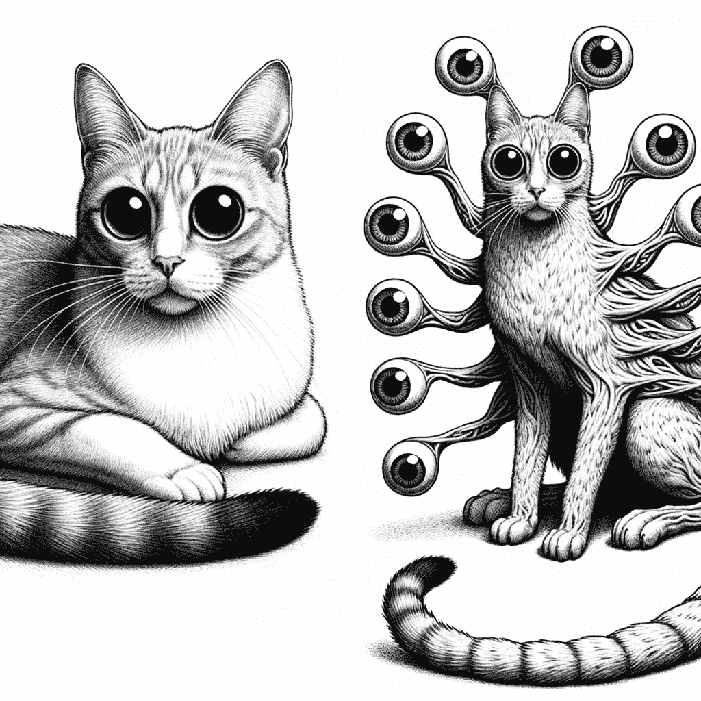
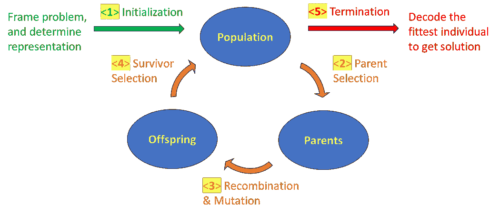
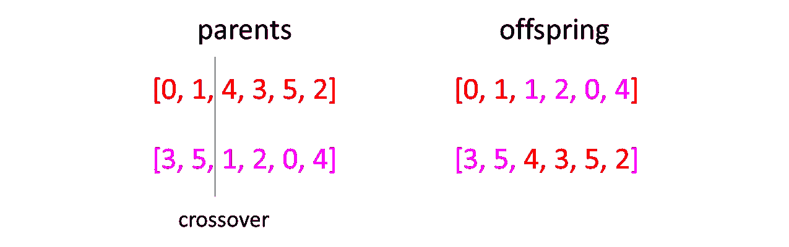
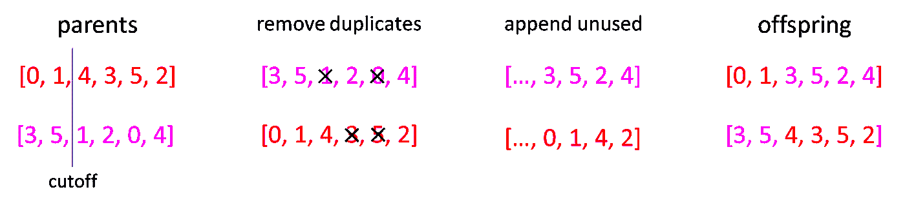
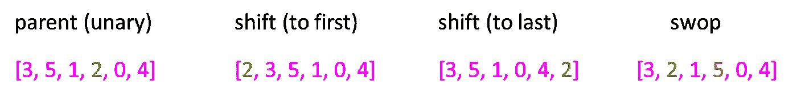

# 进化算法 — 突变解释

> 原文：[`towardsdatascience.com/evolutionary-algorithm-mutations-explained-4a3b5c2d49de`](https://towardsdatascience.com/evolutionary-algorithm-mutations-explained-4a3b5c2d49de)

## 包含代码实现的插图，以 TSP 为例

[](https://medium.com/@byjameskoh?source=post_page-----4a3b5c2d49de--------------------------------)[](https://towardsdatascience.com/?source=post_page-----4a3b5c2d49de--------------------------------) [James Koh, PhD](https://medium.com/@byjameskoh?source=post_page-----4a3b5c2d49de--------------------------------)

·发表于[Towards Data Science](https://towardsdatascience.com/?source=post_page-----4a3b5c2d49de--------------------------------) ·8 分钟阅读·2023 年 11 月 7 日

--



图片由 DALL·E 3 根据提示“绘制一个科幻风格的图像，描绘突变。左侧显示‘前’的状态，右侧显示‘后’的状态。”创建。

这是对进化算法 — 选择解释的延续。

如果你希望对基于预突变表示的重组和突变有一个高层次的理解，本文将作为独立文献满足你的需求。

然而，为了了解每个步骤的完整细节，首先阅读上面链接的文章将会有帮助，然后再继续阅读这里的内容。

结合上一篇文章中的代码片段，你将能够在个人计算机上解决著名的旅行商问题（TSP）。更重要的是，你将欣赏到幕后发生的所有细节。

# 达成共识

在第一部分中，我概述了进化算法框架如下：



作者提供的图像

在回顾了 EA 中使用的一些术语之后，我们深入探讨了初始化适当基因型的细节（第 3.1 节，针对<1>）以及轮盘赌和锦标赛选择（第 3.2 节，针对<2>）。

我们现在将继续第 3.3 节。

# 3.3 — 变异

变异可以是单基因型的（涉及单一基因型）或双基因型的（涉及两个基因型）。目标是得到新的基因型，期望它们的适应度高于前任基因型。

统计学帮助我们实现这一希望。纯粹通过运气，某些基因型可能更好，而其他的可能更差。通过与父本选择（第 3.2 节）和生存选择（第 3.4 节）协同工作，“成功”的次数远远超过“失败”。

在第 3.3.1 节和第 3.3.2 节中，我们关注对**基于排列的基因型**的变异。

从技术上讲，重组过程可以涉及两个以上的父本，但更多并不一定更好[1]，本文的范围保持在两个父本。

# 3.3.1 — 重组

这涉及两个父本基因型。

与可以使用单点或多点交叉进行重组的二进制表示不同，排列表示的重组并不那么简单。



对基于排列的基因型进行强制交叉的结果。

假设我们有一个从 0 到 5 的排列，来自两个父本（一个是红色的，另一个是粉色的）。一次交叉会导致某些索引的重复，以及其他索引的缺失。这不能成为 TSP 的解决方案。

我们做的是应用部分映射交叉。

在下面的示例中，第一个后代[0, 1, 3, 5, 2, 4]是从第一个（红色）父本的左侧部分中获得的，保持原样，并与第二个（粉色）父本中尚未使用的索引组合，保持相对顺序。这给我们带来了[0, 1]（来自红色）和[3, 5, 2, 4]（来自粉色）的组合。



部分映射交叉的过程。图片由作者提供。

动机如下：

1.  红色父本[**0**，**1**，4，3，5，2]已经具有良好的（或至少是不错的）适应度，因此被选择作为父本。

1.  保留基因型的一部分并打乱其余部分可能会导致改进。

1.  我们利用粉色父本[**3**，**5**，1，**2**，0，**4**]也有良好的适应度——它访问了 3，然后是 5，然后是 2，然后是 4。

1.  我们不是随机打乱红色父本的尾部，而是按照粉色父本访问的顺序对其进行打乱。

当两个父本互换时，情况也是如此。因此，得到了两个后代。

请注意，切割可以在基因型的任何位置发生，概率相等。如果切割只在中间进行，我们就会失去在随后的代中获得多样化后代的机会。没有人能确定前半部分是理想的并且应该保留——它可能只是前四分之一，或者也许是前三分之四。因此，所有选项都应保留，最终交给统计学处理。

# 3.3.2 — 突变

仍然在进化算法的‘**变异**’方面，我们转向适用于个体基因型的变化。



基于排列的基因型可能发生的突变。

如果基因型包含一个排列序列，所应用的变化必须涉及某种重新排序。执行位翻转或增加/减少单个数字是不切实际的。

一种方法是随机选择一个数字（例如，“2”）并将其移到序列的开始或结束。另一种方法是随机选择两个数字并交换它们的位置。

这里的想法是对单个基因型做出最小的改动，希望使一个已经很好的解决方案变得更好。这种变异在解决方案几乎完美的情况下尤其有用，只有某一点不太对。

这是第 3.3.1 节（重组）和第 3.3.2 节（突变）的代码。

```py
class Evolutionary:
    def __init__(self, task):
        self.task = task

    def partial_map_crossover(self, parent1, parent2):
        n = len(parent1)
        point = random.randint(0, n-1)
        child1 = list(parent1[0:point])
        for j in parent2:
            if (j in child1) == False:
                child1.append(j)
        child2 = list(parent2[0:point])
        for j in parent1:
            if (j in child2) == False:
                child2.append(j)
        return child1, child2

    def run_evolution(self, population_size, generation_limit=5000, fitness_limit=1e99, crossover='single', verbose=True):
        ## ... define population ...

        best_fitness_seen = -1e9
        for i in tqdm(range(generation_limit)):
            population = sorted(
                population, key=lambda genome: self.task.fitness(genome), reverse=True
            )
            fitness = self.task.fitness(population[0])

            if verbose and (fitness > best_fitness_seen):
                best_fitness_seen = fitness
                self.task.visualize(population[0], save_id=i)
            if fitness >= fitness_limit:
                break

            ## ... elitism; keep best individuals and variants of them ...

            for j in range((population_size - n_keep)//2):
                parents = self.selection(
                    population, self.task.fitness, 
                    method='tournament'
                )
                if random.random() < 0.9:
                    offspring_a, offspring_b = self.partial_map_crossover(parents[0], parents[1])
                else:
                    offspring_a, offspring_b = parents[0], parents[1]
                if random.random() < 0.9:
                    offspring_a = self.swop(offspring_a)
                    offspring_b = self.swop(offspring_b)
                next_generation += [offspring_a, offspring_b]
            population = next_generation

        best_genome = population[0]
        return best_genome

    def selection(self, ...):
        ## tournament or roulette wheel, or combination

    def shift_to_end(self, genome, num=1):
        new_genome = deepcopy(genome)
        for _ in range(num):
            a = random.sample(range(len(genome)), k=1)[0]
            ref = deepcopy(new_genome[a])
            if random.random() < 0.5:
                new_genome[1:a+1] = new_genome[:a]
                new_genome[0] = ref   # bring to first
            else:
                new_genome[a:-1] = new_genome[a+1:]
                new_genome[-1] = ref   # bring to last
        return new_genome

    def swop(self, genome, num=1):
        new_genome = deepcopy(genome)
        for _ in range(num):
            a, b = random.sample(range(len(genome)), k=2)
            new_genome[a], new_genome[b] = genome[b], genome[a]
        return new_genome
```

# 3.4 — 生存选择

在广泛讨论了父代选择和变异之后，我们进入进化算法的第三个支柱，即选择哪些个体进入下一代。

第一种方法是将所有父代和后代放在一起，选择最适应的个体来填充下一代。这里的问题是我们在“稀释”进化效果。在经历了父代选择、重组和突变之后，产生的后代中有相当一部分会被丢弃。这其中有些“*前进两步，后退一步*”的成分。

第二种方法是（在一定程度上）模仿自然。所有父代将“死亡”并从种群中消失，下一代完全由后代组成。这里的问题是最好的后代不一定比最好的父代更好——移除所有父代可能会让我们离理想解决方案更远。

因此，通常会采取中间道路。我们从父代中选择最好的个体，并对它们的副本进行突变，希望通过一些扰动进一步改进解决方案。然后，我们生成足够的后代以填补下一代剩余的位置，而不会丢弃任何个体。

具体来说，在第 3.3 节的`##... 精英策略；保留最佳个体及其变体 ...`组件中，我们可以做如下操作：

```py
next_generation = population[:n_top]   # keep the n_top fittest individuals

for _ in range(n_perturb):
    # select a candidate from population[:n_top]
    if np.random.random() < p_shift:
        candidate = self.shift_to_end(candidate)
    if np.random.random() < p_swop:
        candidate = self.swop(candidate)
    next_generation += [candidate]

n_keep = n_top + n_perturb
```

# 3.5 — 终止

也许你的公司要求你应用进化算法解决一个行业问题，并且有一个预算限制。或者，你知道最佳目标值（但不知道给出这个值的解决方案）。

在这种情况下，一旦结果足够好，可能需要进行提前终止。

如果没有特定的数字需要寻找，并且我们不确定什么是“足够好”，一种方法是当在一定代数中改进量小于某个阈值时停止迭代。

如果资源不是问题，那么你应该关注的是*过早*终止，而不是*过晚*终止。进行额外的迭代并运行更多的进化是有益的。就像在深度学习中一样，我们会保留与最佳迭代对应的解决方案，而不是最后的迭代。

# 4\. 获得结果

## 4.1 表示 TSP

让我们为旅行销售员问题构建一个类，以简化实施过程。

```py
class Salesman:
    def __init__(self, num_cities, x_lim, y_lim, read_from_txt=None):
        if read_from_txt:
            self.city_locations = []
            f = open(read_from_txt)
            for i, line in enumerate(f.readlines()):
                if i==num_cities:
                    break
                node_val = line.split()
                self.city_locations.append(
                    (float(node_val[-2]), float(node_val[-1]))
                )
            self.num_cities = len(self.city_locations)
            self.x_lim = np.max(np.array(self.city_locations)[:,0])
            self.y_lim = np.max(np.array(self.city_locations)[:,1])

        else:   # generate randomly
            self.num_cities = num_cities
            self.x_lim = x_lim
            self.y_lim = y_lim
            x_loc = np.random.uniform(0, x_lim, size=num_cities)
            y_loc = np.random.uniform(0, y_lim, size=num_cities)
            self.city_locations = [
                (x,y) for x,y in zip(x_loc,y_loc)
            ]
        self.distances = self.calculate_distances()

    def calculate_distances(self):
        distances = np.zeros((self.num_cities, self.num_cities))
        for i in range(self.num_cities):
            for j in range(i + 1, self.num_cities):
                dist = np.sqrt((self.city_locations[i][0] - self.city_locations[j][0]) ** 2 + (self.city_locations[i][1] - self.city_locations[j][1]) ** 2)
                distances[i][j] = distances[j][i] = dist
        return distances

    def fitness(self, solution):
        total_distance = 0
        for i in range(self.num_cities - 1):
            total_distance += self.distances[solution[i]][solution[i+1]]
        fitness = -total_distance
        return fitness

    def visualize(self, solution, save_id=None):
        n = len(solution)
        assert n == len(self.city_locations), 'The solution must correspond to all cities'
        for i, (x,y) in enumerate(self.city_locations):
            plt.plot(x, y, "ro")
            plt.annotate(i, (x, y))

        ordered_cities = [self.city_locations[idx] for idx in solution]
        x_coord = [x for (x,y) in  ordered_cities]
        y_coord = [y for (x,y) in  ordered_cities]
        distance = -self.fitness(solution)

        plt.plot(x_coord, y_coord, "gray")
        plt.title("Connected cities (%.1f) according to solution" % distance)
        if save_id is not None:
            filename = "results/plot_%03d.png" % save_id
            plt.savefig(filename, bbox_inches='tight')
            plt.close()
        else:
            plt.show()
```

## 4.2 训练和观察

将上述代码片段组合成一个单一的`Evolutionary`类，然后可以应用以下方法来找到 TSP 的解决方案。

```py
salesman = Salesman(
    num_cities=30, x_lim=100, y_lim=100, read_from_txt='city_locations.txt'
)
evo = Evolutionary(salesman)
best_genome = evo.run_evolution(
    population_size=200, generation_limit=1000, crossover='pmx', verbose=True
)
salesman.visualize(best_genome)
```

如果你保存了中间结果，你可以使用我分享的代码[这里](https://medium.com/towards-data-science/a-cornerstone-of-rl-td-%CE%BB-and-3-big-names-2e547b37c05)将截图图像组合成一个 gif。

恭喜！你现在具备了使用进化算法解决 NP 难题的知识。

这与文章开头展示的 gif 相同。这是上述代码共享的结果。

# 结论

在这篇文章中，你了解了进化算法的运行原理，以及每个组件的功能。除了高层次的概念，我们还深入探讨了实现过程，配以可视化、代码和具体数据。

# 参考文献

[1] A. E. Eiben, P. E. Raue, 和 Z. Ruttkay, [具有多父代重组的遗传算法](https://link.springer.com/chapter/10.1007/3-540-58484-6_252) (1994)，在国际并行问题解决自然会议上
