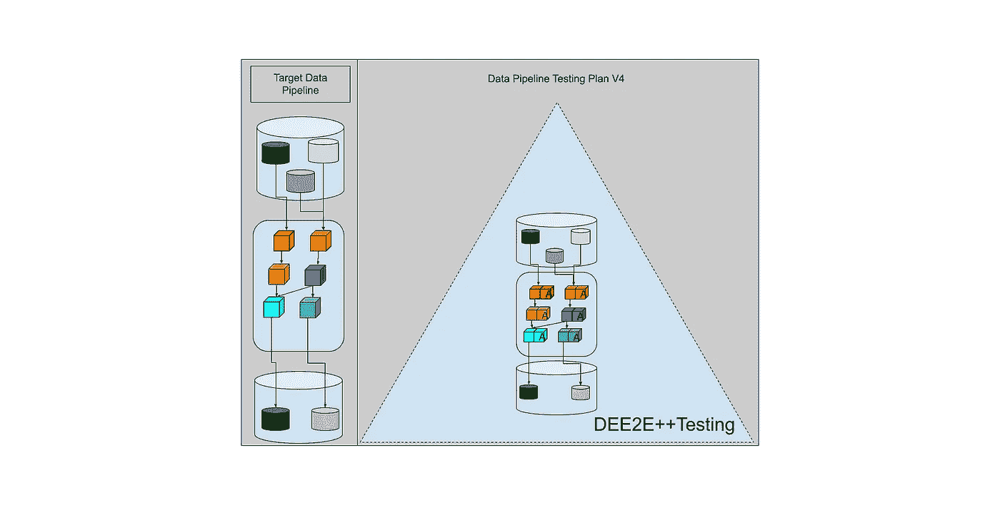
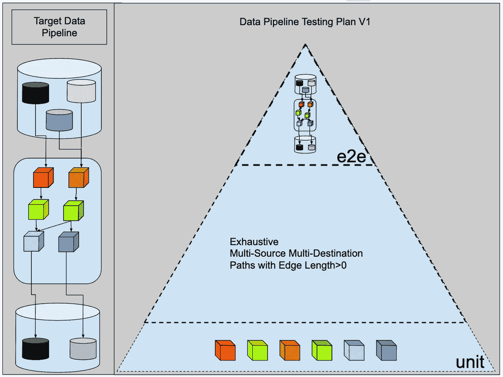
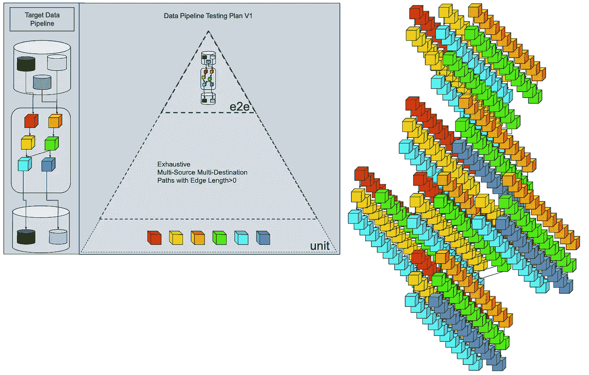
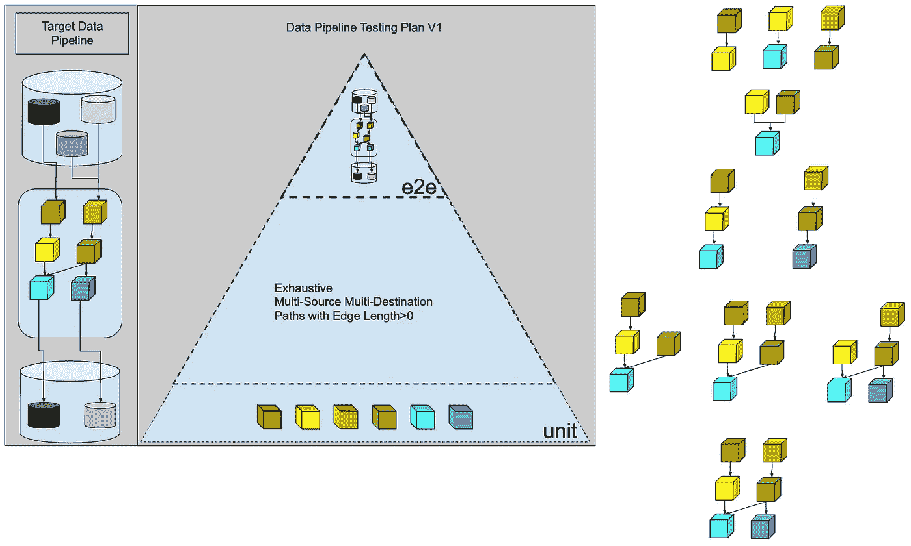
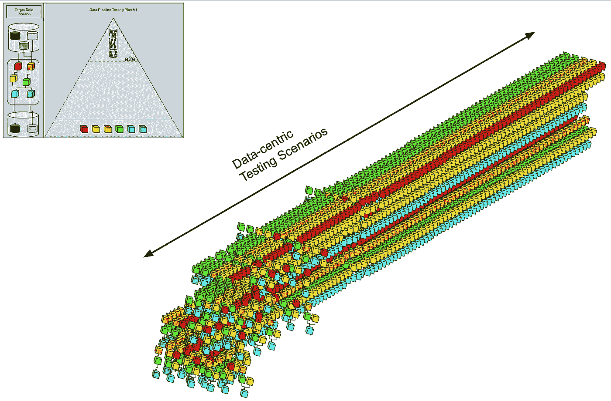
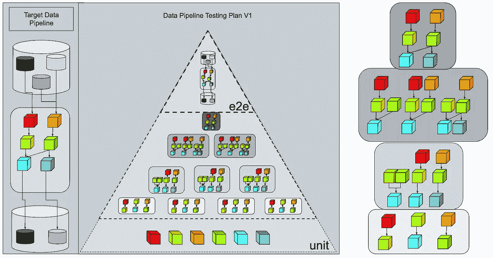
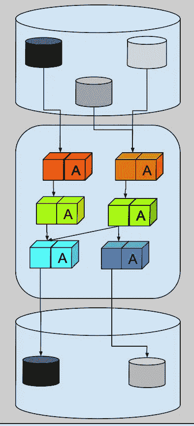
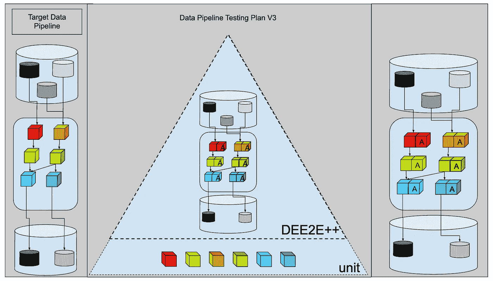
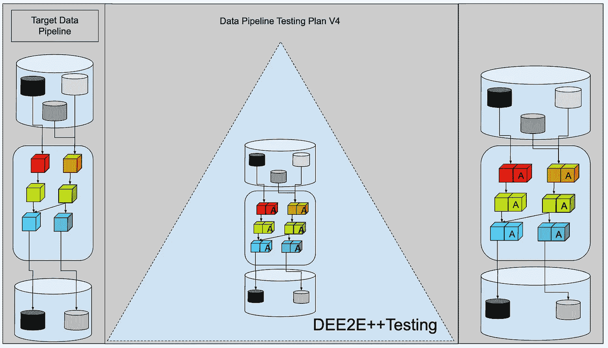

# 发展数据管道测试计划

> 原文：[`towardsdatascience.com/evolving-a-testing-plan-for-a-data-pipeline-3e1fc44998d9?source=collection_archive---------4-----------------------#2023-04-30`](https://towardsdatascience.com/evolving-a-testing-plan-for-a-data-pipeline-3e1fc44998d9?source=collection_archive---------4-----------------------#2023-04-30)

## **穷尽多源多目的地测试驱动开发的危险**

 [Moussa Taifi 博士](https://farmi.medium.com/?source=post_page-----3e1fc44998d9--------------------------------)

·

[跟随](https://medium.com/m/signin?actionUrl=https%3A%2F%2Fmedium.com%2F_%2Fsubscribe%2Fuser%2F215bedf6878d&operation=register&redirect=https%3A%2F%2Ftowardsdatascience.com%2Fevolving-a-testing-plan-for-a-data-pipeline-3e1fc44998d9&user=Moussa+Taifi+PhD&userId=215bedf6878d&source=post_page-215bedf6878d----3e1fc44998d9---------------------post_header-----------) 发表在[Towards Data Science](https://towardsdatascience.com/?source=post_page-----3e1fc44998d9--------------------------------) ·9 分钟阅读·2023 年 4 月 30 日

--

（作者提供的图片）

初次接触测试驱动开发（TDD）的理念往往让许多初学者数据工程师对 TDD 的承诺感到震惊。更快的开发、更清洁的代码、职业晋升以及世界主导地位等，诸多好处显而易见。然而，现实却截然不同。初次尝试在数据工程中应用 TDD 往往令许多数据工程师感到沮丧。要提取 TDD 的价值需要大量的努力。这要求深入了解测试技术，而这些技术并不在初学者的工具包中。学习“什么”需要测试的过程是困难的。了解在数据管道中应用 TDD 所固有的权衡更加困难。

在本文中，我们探讨了如何演进数据管道测试计划，以避免感受到过度指定测试带来的全部痛苦。

# 问题

测试驱动开发的风险是什么？尽管 TDD 有其好处，但对于一个新数据工程师来说，它可能是一个危险的东西。最初测试一切的冲动很强烈，这可能导致次优设计选择。正如他们所说，过犹不及。

测试数据管道的每个部分对工程思维的人来说是一个诱人的方向。但为了保持理智，必须有一些节制。否则，你将陷入一片测试的丛林，被一片红色的海洋包围。泥巴球总是紧随其后。

例如，假设我们有以下数据管道：

（图片由作者提供）

我们有三个数据源，六个转换步骤和两个数据目的地。

**一个没有经验的数据工程师会如何制定测试计划？**

我们都经历过。

# 解决方案 #1: 耗尽的多源多目的地路径，边长 > 0

使用经典的三部分测试框架，我们可以安全地假设我们的数据工程师会从这里开始：

+   **单元测试** ✅ : 当然，取每个转换，为每个转换生成一些样本输入数据，经过每一步骤的管道，捕获结果，并使用这些输出来验证转换逻辑。

+   **端到端测试** ✅ : 我们无论如何都需要在完整的生产数据上运行管道，所以让我们在生产数据的样本上运行整个管道，捕获结果并使用这些输出来验证端到端管道。

+   **集成测试** ❓❓❓: 那么该怎么做呢？最初的想法是为每个转换阶段的组合构建一个测试。

（图片由作者提供）

经过一些粗略计算，我们的数据工程师开始意识到 6 个转换步骤的组合迅速增长。必须有更好的方法。

（图片由作者提供）

测试所有边长不同的组合无法满足我们对客户承诺的截止日期。我们应该为更多时间做预算。

# 解决方案 #2:

*“好的好的，但不可能那么糟糕。”*

是的，考虑到集成测试不会触及真实的源和汇，那么就这样吧，让我们将这 6 个转换步骤连接起来。我们得到以下图形组合。我们得到大约 10 个集成测试。

（图片由作者提供）

但请记住，这涉及数据工程，这意味着输入数据不受我们的控制，并且随时间变化。所以我们需要在其中添加以数据为中心的测试。（你肯定知道得更清楚，但让我们跟随这个论点）。

（图片由作者提供）

# 解决方案 #3:

*“对，但我们不能以某种方式总结一下吗？一定有一组核心数据场景是我们必须绝对支持的？比如数据验证的优先级列表？”*

当然，但即使我们推迟数据验证检查，我们仍然会看到这个情况：

（图片由作者提供）

*“我们真的需要这么多测试吗？验收测试不就是测试用户看到的内容吗？我们不能为了按时交付一个解决客户问题的好产品而牺牲开发者体验吗？”*

当然，是的，下一个逻辑步骤是只运行端到端测试并继续我们的生活。然而，还有一个中间步骤可以解决“*集成测试太多*”和“*数据验证测试固如磐石*”两个问题。你可能以前使用过但没有名字：**“内联断言”**。这是防御性编程传统中一个相当有用的技巧。

# 解决方案 #4：

这些“内联断言”的核心思想是，当可能时，你将整个管道作为一个整体构建，包括关于代码接口和单体组件之间数据接口的断言。

（图片由作者提供）

就这样，你将其放入红色、绿色、重构开发循环中，并随着随机事件的发生不断增加断言列表。

我们这里有点过热，但请注意我们使用的是生产数据源和生产接收器。如果你陷入困境，就这样做吧。如果你有时间，至少创建专门的测试接收器，并记得限制从输入数据源获取的行数。

这对你来说可能很明显，但我们都在学习如何构建解决客户问题的数据管道 :)

在反向测试金字塔中，这将是什么样子？

（图片由作者提供）

让我们称之为**DEE2E++ 测试**。

数据工程端到端 ++ 测试。

似乎有两种 DE2E++测试的变体：

+   无处不在的反腐层（U-ACL）

+   大多数警告反腐层（MW-ACL）

在无处不在的一侧，它看起来如下：

（图片由作者提供）

每个转换都有一个输入反腐层，保护它免受上游更改的影响，还有一个输出反腐层，保护下游消费者免受当前转换内部更改的影响。如果上游数据模式或内容发生变化，那么输入 ACL 将停止处理并向用户报告错误。如果我们更改当前转换的数据模式或内容，那么输出 ACL 也会捕获错误并停止处理。

对于刚入门的数据工程师来说，这确实是相当多的工作。在每个转换上添加强制的验证规则将使数据工程师陷入“批处理工作”模式。与其将管道分解为多个步骤，他们可能会对自己说：*“如果我必须为每个转换添加这些 ACL，那么这将是转换数量的两倍。我还不如只添加两个，一个在管道顶部，一个在底部。我会自己处理转换的内部细节。”* 这是一个有效的初始方法，其中重点是 1) 顶层的摄取逻辑和 2) 客户可见的数据输出。这个策略的问题在于，我们会失去测试在本地化错误方面的好处。如果第 4 个转换中有错误，那么 ACL 测试只会显示最终输出无效，而不会指出第 4 个转换是罪魁祸首。

此外，随着数据源的演变，我们在这里讨论的是 90%的警告和 10%的阻塞错误。仅仅因为输入数据中出现了新列，并不意味着整个管道应该失败。而仅仅因为某列的分布均值略有变化，并不意味着所有数据都是无效的。客户可能仍然对最新可用的数据感兴趣，以便做出业务决策，并在需要时进行对账。

为此，你需要“主要警告反腐败层”。

（图片由作者提供）

它通知开发人员有问题，但不会停止处理。它在每个转换中扮演着与输入和输出 ACL 相同的角色。此外，它对变化更加宽容。这种类型的 ACL 会发出警告和指标，开发人员可以稍后优先处理这些警告。如果情况完全失控，开发人员可以在修复数据转换后填充数据。

显然，你的情况可能会有所不同。如果当前的数据管道输出有少量确定的人工用户，那么与这些消费者沟通将帮助新的开发人员了解领域。另一方面，如果这个管道有大量已建立的自动化数据管道来消费其输出，那么这个 DEE2E++测试可能就不够了。然而，刚开始的新数据开发人员通常不会在第一天就被分配到对数百个数据消费者有影响的业务关键数据管道。因此，与其让新的数据开发人员同时被陌生的测试技术和关键任务领域压垮，不如将 DEE2E++方法作为新数据开发人员的一个良好起点。

这是 DEE2E++图示再次呈现。

（图片由作者提供）

*“等一下，等一下，你是说每个组件只会得到一个仅警告的反腐败层？”*

不是“仅警告”，而是“*主要*警告”。一些断言确实会停止处理并使工作失败。但这就是想法。如果你采用“普遍反腐层”策略，那么你将需要更多时间。随着领域变得更清晰，你可以在数据管道的关键部分添加更严格的 ACL。这种领域理解将有助于按复杂性对变换进行排序。当你识别出需要额外关注的复杂部分时，例如，你可以从“MW-ACL”转向“U-ACL”来保护高度关键的业务逻辑。

*“我的意思是，是的，但那为什么还要做单元测试呢？它们不是已经在内联测试中涵盖了吗？”*

当然，好吧，我们就去掉它们吧。

（图片由作者提供）

好了？我想我们现在可以回去工作了。

# 结论

简而言之，测试驱动开发的常见原则对于新数据工程师来说可能会非常压倒性。重要的是要记住，TDD 是一种设计工具，而不是法律。明智地使用它，它将对你有很大帮助。但使用过多，你会发现自己陷入困境。

在这篇文章中，我们探讨了过度指定测试可能会发生的情况。首先，我们以一个看似简单的数据管道为例，看到当我们陷入“详尽的多源多目标路径”时会发生什么。然后，我们观察到与数据中心测试相比，集成测试只是冰山一角。最后，我们发现，初学者数据工程师的一个良好起点是将“主要警告反腐层”作为内联测试的 E2E 测试。这种 DEE2E++测试策略有两个好处。首先，初学的数据工程师不会从第一天起就放弃测试。其次，它给开发人员提供了学习领域知识的余地，并利用他们现有的数据工程基础知识迭代他们的数据管道设计。与其立即陷入 TDD 的微观层面，不如向利益相关者交付工作中的软件，然后利用 DEE2E++测试提供的保护，随着需求的演变，添加更细粒度的测试。

所以，你们看到了。测试驱动开发的危险。愿你们都能避免这些危险，愿你们的数据管道常绿。

# 想了解更多关于现代数据管道测试技术的信息吗？

查看我关于这个主题的最新书籍。这本书为测试现代数据管道的最流行技术提供了视觉指南。

2023 年书籍链接：

> ***书籍链接：*** [***现代数据管道测试技术***](https://leanpub.com/moderndatapipelinestestingtechniques/)*在 leanpub 上。*

再见！

**免责声明：** 本文表达的观点仅代表我个人，未必反映我当前或过去雇主的观点。
