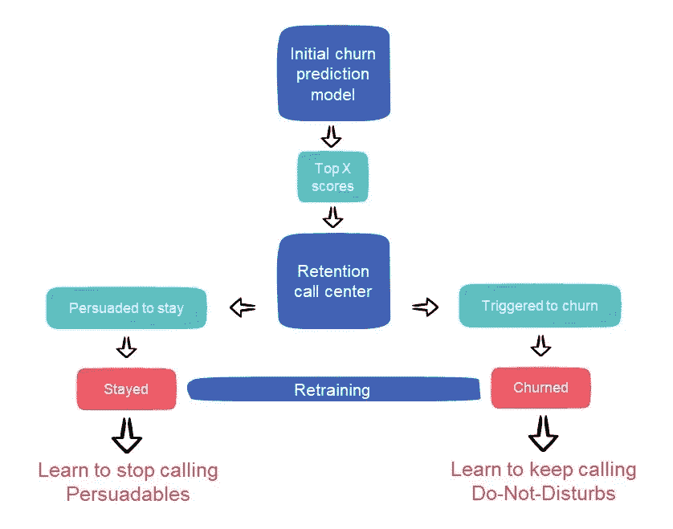
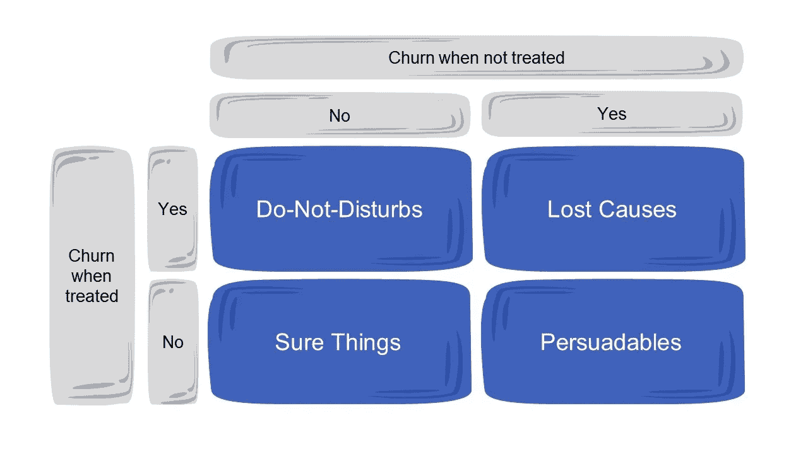
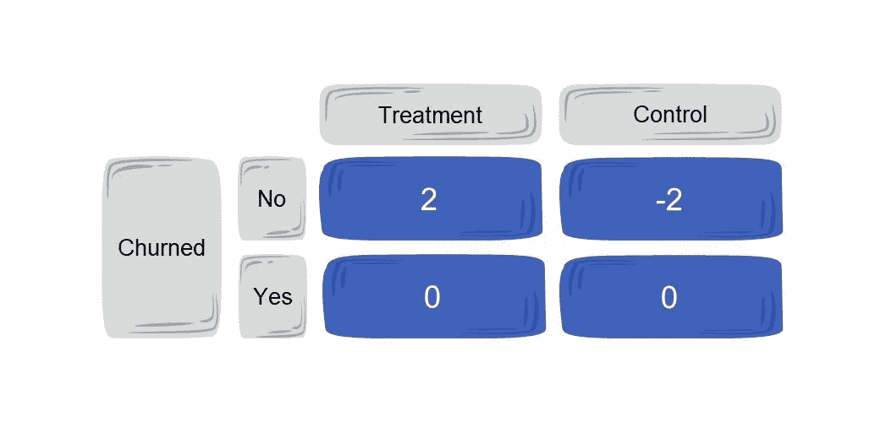

# 进化的客户流失预测：应对干预和再培训

> 原文：[`towardsdatascience.com/evolving-churn-predictions-navigating-interventions-and-retraining-d0fcb2619f83?source=collection_archive---------10-----------------------#2023-11-16`](https://towardsdatascience.com/evolving-churn-predictions-navigating-interventions-and-retraining-d0fcb2619f83?source=collection_archive---------10-----------------------#2023-11-16)

## 处理由于主动保留努力而导致的再培训客户流失模型的新兴挑战

 [Tomer Alma](https://medium.com/@tomeralma?source=post_page-----d0fcb2619f83--------------------------------)

·

[关注](https://medium.com/m/signin?actionUrl=https%3A%2F%2Fmedium.com%2F_%2Fsubscribe%2Fuser%2F91fc5f86fa60&operation=register&redirect=https%3A%2F%2Ftowardsdatascience.com%2Fevolving-churn-predictions-navigating-interventions-and-retraining-d0fcb2619f83&user=Tomer+Alma&userId=91fc5f86fa60&source=post_page-91fc5f86fa60----d0fcb2619f83---------------------post_header-----------) 发布于[Towards Data Science](https://towardsdatascience.com/?source=post_page-----d0fcb2619f83--------------------------------) ·5 分钟阅读·Nov 16, 2023

--

照片由[CrowN](https://unsplash.com/@cosmicomicfox?utm_source=medium&utm_medium=referral)在[Unsplash](https://unsplash.com/?utm_source=medium&utm_medium=referral)拍摄

重新训练机器学习模型，特别是那些专注于客户流失预测的模型，是确保其相关性和准确性的重要步骤。然而，重新训练流失模型面临独特的挑战，需要特别注意。其中最显著的是区分干预的因果效应——识别由于主动保留程序而留下的客户，以便专门针对他们。

# 干预对流失重新训练的影响

考虑以下事件序列：

1.  **初始模型训练：** 使用历史客户数据训练模型。

1.  **模型推断：** 某些客户被标记为可能流失。

1.  **业务干预：** 与这些客户互动，劝说他们留下，或使用促销和个性化优惠等措施来鼓励保留。

1.  **使用新数据进行重新训练：** 当模型性能下降时，很可能是重新训练的时机——模型将更新为包含这些干预结果的最新数据。

设想一个场景：一个客户被预测可能流失，他们接受了保留代表的服务，然后选择留下。问题出现在试图解释他们决定的原因时——是干预改变了他们的想法，还是他们在最初被模型误分类了？

当在这种模糊数据上重新训练模型时，存在扭曲模型未来预测的风险——将上述客户标记为“留下”可能具有误导性，因为如果我们没有说服他们留下，他们可能已经离开了。

同样，对于流失标签——干预可能是流失的唯一触发因素，使得某些流失标签不可靠。

当保留努力模糊模型清晰度时

# 处理偏差的可能方法：

1.  **对照组和合成数据：** 创建一个“可能流失”客户的子集，对这些客户不进行干预。通过比较对照组和干预组之间的结果，可以判断干预的真实影响——如果某些客户在接受干预时流失更多，则应检查将其排除在干预之外的情况。

    当需要重新训练时，可以利用对照组的数据，并排除干预组的数据，确保模型依赖于可靠的流失标签。

    这种方法的缺点是关键数据的丢失，因此为了弥补排除干预客户的损失，可以尝试生成对照组的合成样本以代表这些客户。这可以通过[SMOTE](https://imbalanced-learn.org/stable/references/generated/imblearn.over_sampling.SMOTE.html)等过采样策略完成。

1.  **反馈调查：** 在干预后直接与客户接触，以了解他们留下/流失的原因。收集到的见解可以提供关于干预效果的清晰度，并帮助区分真正留下的客户和那些被干预所影响的客户。

1.  **合并模型：** 尝试将初始训练模型与新模型进行结合。平均预测或使用集成方法可以减少任何单一模型偏见主导总体预测的风险。

    请注意，随着时间的推移，最初的训练数据可能会变得不那么相关。

# 提升建模：精细化流失预测的黄金标准

与预测谁可能离开的传统流失模型不同，[提升建模](https://en.wikipedia.org/wiki/Uplift_modelling)识别由于干预而直接改变行为的客户。

通过将处理组与对照组进行比较，这些模型预测哪些客户因干预而留下，另一方面哪些客户因干预而离开。

这种有针对性的方法帮助企业优化资源并最大化客户价值。

客户可以被分为四种理论类别，基于他们是否接受了保留努力：

**确定的客户：** 不会流失的客户。针对他们不会带来额外回报，但会增加成本，如沟通努力和潜在的财务激励。

**无可救药者：** 无论干预如何都会流失的客户。他们不会增加收入，且与确定性客户相比，可能导致成本减少，因为他们不会利用提供的激励。

**可说服者：** 仅在保留努力后才会留下的客户。他们贡献额外收入。

**不可打扰者：** 仅在被针对时才会流失的客户。保持他们不受干扰是有利的，而针对他们会增加显著成本而没有收入增长，使他们成为“沉睡的狗”。

提升建模的目标是专门针对可说服者。

挑战在于我们无法确定个体属于哪个类别。我们不能同时将他们处理并将他们放在对照组中。那么，我们如何识别他们呢？我们怎么知道他们是否被说服了，或者他们最初是否不打算离开？这就是提升建模的作用所在。

针对这一挑战有几种提升方法，我们将查看“转换结果”方法。该方法需要来自对照组和处理组的数据，并将我们的重点从分类任务转移到回归任务。

标签是基于[特定公式](https://www.uplift-modeling.com/en/latest/user_guide/models/transformed_outcome.html)分配的，对于处理倾向等于 0.5 的随机处理分配，目标变量转化为以下值：

转换结果标签（针对 50%的处理倾向）

我们可以使用诸如均方误差（[MSE](https://en.wikipedia.org/wiki/Mean_squared_error)）的损失函数作为解决此回归问题的指标：

对于可说服者，对照组标记为 0，处理组标记为 2。它们之间的最低 MSE 将是分数为 1 的位置，代表可说服者的提升。

对于“打扰者”，控制组为-2，处理组为 0，最佳预测为-1，表示提升。

对于“失去的原因”和“确定的情况”，最佳预测是 0。

理想情况下，应该以最高得分为目标，尽量保留可以说服的人，尽可能避免打扰人群及其他人群。

# 探索流失预测的未来

正如我们所探讨的，流失预测的领域，其干预复杂性和不断变化的数据，为企业带来了挑战。

重新训练模型不仅仅是一个技术练习，更是理解客户行为和理清真正的留存的一个部分。利用控制组、反馈机制和提升建模等工具。

但也许最关键的是认识到数据不是静态的。我们对客户行为的理解必须适应这种变化。拥抱这种动态情况，不断完善模型，并保持对不断变化的模式的敏感，将是未来成功预测和管理流失的关键。

# 进一步阅读：

+   [使用转化结果方法的提升建模](https://repositorioaberto.uab.pt/bitstream/10400.2/13024/1/paper_81.pdf)

+   [因果推断与提升建模：文献综述](http://proceedings.mlr.press/v67/gutierrez17a/gutierrez17a.pdf)

+   [估计异质性因果效应的机器学习方法](https://gsb-faculty.stanford.edu/guido-w-imbens/files/2022/04/3350.pdf)

+   [Pylift Python 包用于提升建模](https://pylift.readthedocs.io/en/latest/)
