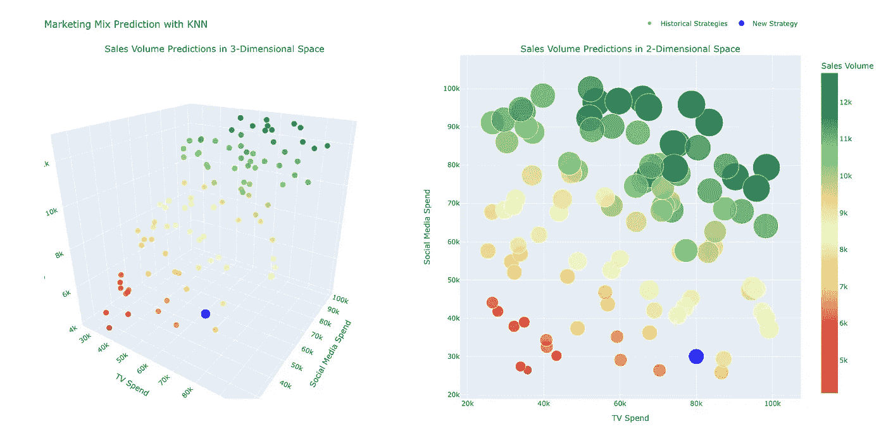
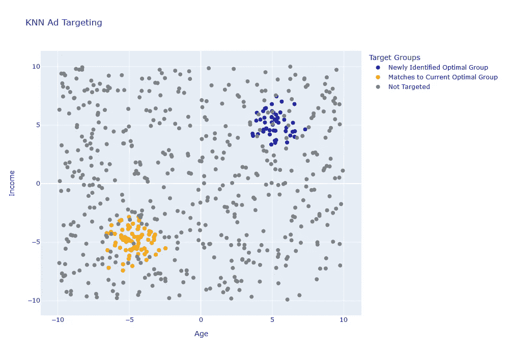
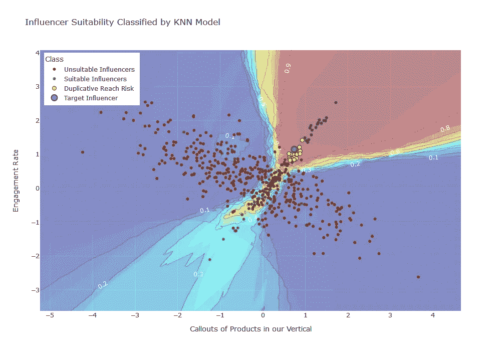

# K-最近邻的示例应用

> 原文：[`towardsdatascience.com/example-applications-of-k-nearest-neighbors-e6e47cd73f1f`](https://towardsdatascience.com/example-applications-of-k-nearest-neighbors-e6e47cd73f1f)

## 为什么简单的算法比你想象的更实用

 [安东尼·鲍姆](https://medium.com/@anthonybaum?source=post_page-----e6e47cd73f1f--------------------------------)

·发表于 [Towards Data Science](https://towardsdatascience.com/?source=post_page-----e6e47cd73f1f--------------------------------) ·6 分钟阅读·2023 年 8 月 4 日

--

[布鲁克·凯格尔](https://unsplash.com/@brookecagle?utm_source=medium&utm_medium=referral) 在 [Unsplash](https://unsplash.com/?utm_source=medium&utm_medium=referral) 上的照片

我第一个机器学习算法是 K-最近邻（KNN）模型。这对初学者很有意义——直观、易于理解，你甚至可以在不使用专用软件包的情况下实现它。

因为它对初学者很有意义，同时在向任何不熟悉机器学习的人解释时也很有用。我无法用语言表达说服一群怀疑者接受 KNN 方法比接受黑箱随机森林要容易得多。

这是一个被低估的建模方法，在转向更复杂的算法之前，它作为一个很好的基准，而在许多用例中，你可能会发现更复杂算法的时间和成本并不值得。

为了激发你的建模灵感，以下是 KNN 的三个示例应用，你可能会发现它在现实世界中的效果远超你的预期。

# 市场组合建模（MMM）

我从事市场营销工作，我在 MMM 系统中的工作通常涉及识别能够提高广告效果和/或扩大广告覆盖面以触及更多人的营销渠道。在高层次上，这被称为市场（或媒体）组合建模。

任何类型的 MMM 建模的目标是理解每个营销输入在孤立和与其他输入结合时的有效性，然后优化营销组合以达到最大效果。

最基本的方法是根据历史数据预测不同营销策略的影响。KNN 模型将每个营销策略视为多维空间中的一个点，其中维度可以是各种营销输入，如广告支出、促销活动、定价策略等。

当提出新的营销策略或现有策略需要优化时，模型可以通过查看“k”个最相似的历史策略，即多维空间中的“k”个最近邻，来预测该策略的结果。

3D 和 2D 空间中的媒体组合建模结果示例。图表由 Plotly 构建。

新策略的结果被预测为这些“k”个最近邻的结果的加权平均值，即已知策略和结果。我们可以根据每个邻居与新策略的距离设置权重，距离较近的邻居对预测的影响更大。

这种方法允许对不同营销策略的潜在影响有更细致的理解，并量化营销组合整体的效果。

# 广告定位

广告定位是根据消费者的属性向特定群体展示广告的过程。像 Instagram 和 YouTube 这样的数字广告平台使用基于成千上万属性的极其精确的定位算法，但这种策略在电视等不那么精确的媒介上也同样有效。

基于距离的模型如 KNN 和聚类算法可以用于预测结果，比如用户响应广告的可能性，或寻找新的目标用户，这些用户在人口统计特征上类似于已经在使用的群体。

例如，如果一组具有相似浏览习惯和人口统计特征的用户对某个特定广告反应积极，则 KNN 模型可以预测具有几何相似属性的新用户也会对该广告做出积极响应。

我们可以在这里使用几种不同的建模方法。可能“最简单”且最直观的方法是根据其他已知用户预测一个已知用户响应广告的可能性。然而，经过这种方式训练的模型还有更强大的用途。

我们可以创建一个模拟数据集，其中包含尽可能多的用户属性组合，然后查看哪些属性组合产生最佳结果，而不是对已知用户进行预测。这样，我们不仅可以找到与最佳结果最匹配的用户，还可以发现之前未与我们产品互动的新用户。

一个附加结果是，我们可能还会突出那些之前可能不明显的潜在有效受众。

示例建模结果显示，一组用户与当前优化的目标组匹配，而模型发现的另一组用户也产生了最佳结果。图表由 Plotly 创建。

KNN 很少是最精确的模型选项，但这在上述模拟场景中对我们有利。KNN 精度较低的一个积极权衡是，减少过拟合特别容易。只需增加 k 值直到问题得到改善，就能解决许多情况下的问题。

由于 KNN 预测是现有结果的加权平均，因此模型几乎不可能产生远超已观察范围的错误结果。

此外，广告定向直接来源于了解目标受众的特征。一个我们能够自信地知道不会过拟合的模型，并且可以用简单的术语向关键利益相关者解释的模型，通常比其他模型类型更具优势。

# 影响者识别

虽然广告可以根据可量化的数据进行定向，但拥有一个值得信赖的人提供产品建议是建立品牌声誉的最有效方式之一。这在以视频为主的社交媒体平台如 TikTok 上尤为有效。

影响者营销通常比其他营销渠道具有更高的参与度和转化率，因此拥有一个影响者网络来扩大品牌曝光非常有价值。

我们可以通过一组特征来描述每个影响者账户，例如关注者数量、参与率、他们制作的内容类型等。

KNN 模型可以以与我们之前示例相同的方式找到数学上类似的账户，或者我们可以采取不同的路径，将影响者分类到符合某些标准的组中。

既然我们已经熟悉了“通过距离寻找相似事物”的方法，让我们来看一下分类选项。

作为分类器使用的 KNN 模型是一个直观且通常表现良好的模型选项，特别适用于那些不急于将属性与我们之前见过的完全不同的事物进行分类的应用场景。

对于这个用例，我们可以利用 KNN 模型的多个属性，以扩展我们的产品覆盖范围，而不会陷入通过类似关注者的账户反复接触相同人群（重复覆盖）的陷阱。

我们首先构建 KNN 分类器，将影响者分到可能适合类似我们产品的组中，或者那些可能已经被我们的竞争对手使用的组中。

以示例为例，假设我们有一个 500 个账户的候选名单，我们的数字营销团队认为这些账户可能效果不错，而我们的分类器找到了一组 100 个账户，这些账户是扩展我们影响者计划的好候选者。

我们希望避免最相似的账户，以防止重复的覆盖，因此我们可以利用模型计算出的实际距离，并寻找*位于*最近 k 点之外的账户。k 的数值可以进一步优化为具有实际意义的最小距离阈值，但这里假设 k=20。

示例分类坐标仅在两个模型特征的维度内。轮廓背景显示了这两个维度内的模型选择空间。请注意排除那些具有重复覆盖风险的影响者。图表由 Plotly 创建。

目前我们有 100 个符合我们标准的影响者，以及 20 个我们想忽略的影响者，因为重复覆盖的可能性太高。然后我们可以将这个列表交给数字营销团队去处理，我们已经有效地扩展了我们的产品展示对象。

这里的方法对 KNN 来说有些独特，因为我们能够利用 KNN 模型的分类器属性和用于校准模型本身的基于距离的信息。

KNN 有一些值得注意的缺点。训练速度受到数据大小和特征数量的严重影响，对于非常大的数据集而言会变得极其缓慢。模型也对无关特征高度敏感，因此共线性等问题是主要问题。具有不同尺度或高度偏斜分布的特征由于距离计算可能会引发问题。

然而，当 KNN 构建和应用正确时，它是一个非常可靠的选项。下次你在进行模型选择时，记得好好考虑这个值得信赖的选项。

 ## 3 个你应该知道的常见时间序列建模错误

### 常见错误及如何避免它们，附带实际例子

[towardsdatascience.com
