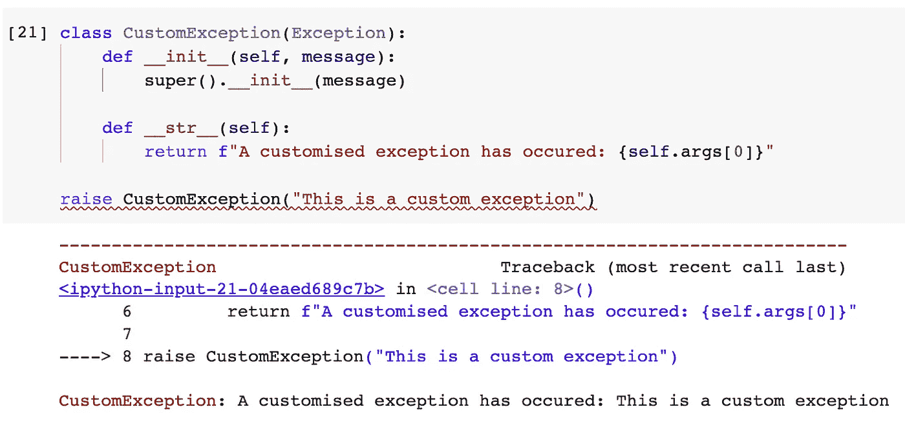

# Python 异常处理：从基础到高级，再到技巧

> 原文：[`towardsdatascience.com/exception-handling-in-python-from-basic-to-advanced-then-tricks-9b495619730a`](https://towardsdatascience.com/exception-handling-in-python-from-basic-to-advanced-then-tricks-9b495619730a)


图片来源于 [Thomas Malyska](https://pixabay.com/users/fotomek-7986133/?utm_source=link-attribution&utm_medium=referral&utm_campaign=image&utm_content=6124033) 来自 [Pixabay](https://pixabay.com//?utm_source=link-attribution&utm_medium=referral&utm_campaign=image&utm_content=6124033)

## 探索 Python 异常处理的隐藏秘密

[](https://christophertao.medium.com/?source=post_page-----9b495619730a--------------------------------)[](https://towardsdatascience.com/?source=post_page-----9b495619730a--------------------------------) [Christopher Tao](https://christophertao.medium.com/?source=post_page-----9b495619730a--------------------------------)

·发布于 [Towards Data Science](https://towardsdatascience.com/?source=post_page-----9b495619730a--------------------------------) ·10 分钟阅读·2023 年 4 月 3 日

--

Python 编程的一个重要方面是异常处理，这指的是在程序执行过程中处理错误和意外事件的方式。异常处理对编写健壮且可靠的代码至关重要，因为它使程序员能够以结构化和受控的方式处理错误和异常。

在这篇文章中，我将提供一个全面的 Python 异常处理指南，涵盖从基本的 try-except 块到更高级的技术。不论你是 **新手** 还是 **经验丰富的开发者**（你可以从第三部分开始），这篇文章将为你提供 Python 异常处理的完整概述，并附带一些你可能未曾遇到过的实用技巧和建议。所以，无论你是刚开始学习 Python 还是希望提升你的异常处理技能，这篇文章都是帮助你入门的最佳资源。

# 1\. 基础知识


图片来源于 [Saul](https://pixabay.com/users/saulhm-31267/?utm_source=link-attribution&utm_medium=referral&utm_campaign=image&utm_content=106359) 来自 [Pixabay](https://pixabay.com//?utm_source=link-attribution&utm_medium=referral&utm_campaign=image&utm_content=106359)

## 1.1 最简单的异常处理

让我们从 Python 中最简单的异常处理开始。基本上，我们有一段可能在运行时出现任何异常的代码，我们可以将它们放在“try”块中。然后，在“except”块中，我们可以对其进行处理，例如显示一些消息以指示发生了错误。

```py
try:
    # Code that may raise an exception
    x = 5 / 0
except:
    # Code to handle the exception
    print("An error occurred")
```


同时，请注意程序确实成功运行了。尽管有错误，但我们“捕获”了错误，因此它不会被视为“崩溃”。

## 1.2 捕获特定类型的异常

有时，代码片段可能会导致不同类型的异常。此外，我们可能希望以不同的方式处理不同类型的异常。在这种情况下，我们可以在`except`关键字后指定错误类型。同时，我们可以链式使用多个`except`块来处理多种错误类型。

```py
try:
    x = 5 / 0
except ZeroDivisionError:
    print("You can't divide a number by zero!")
except:
    print("Unknown error occurred")
```


常见的是最后一个`except`块没有明确的错误类型。因此，如果上面没有`except`块捕获到异常，它将落入最后一个`except`块中。

```py
try:
    x = int("foo")
except ZeroDivisionError:
    print("You can't divide a number by zero!")
except:
    print("Unknown error occurred")
```


在这个例子中，错误实际上应该是`TypeError`，因为字符串`"foo"`不能转换为数字。因此，`ZeroDivisionError`没有捕获到异常。所以，它最终落入默认的`except`块中。

## 1.3 访问异常的详细信息

关于上述“未知”错误，有没有办法从异常中获取更多信息？换句话说，尽管发生了意外，我们是否有方法来获取有关异常的一些线索？

答案是肯定的。我们可以在`except`关键字后放置一个参数，并从这个参数变量中访问异常的详细信息。

```py
try:
    x = int("foo")
except ZeroDivisionError:
    print("You can't divide a number by zero!")
except Exception as e:
    print("An Error occurred:", e)
```


在这个例子中，我们在`except`关键字后使用`Exception`，这是所有类型异常的父类，并将此异常捕获为变量`e`。

这相当于说，“请捕获变量`e`中的任何类型的异常”。然后，我们可以打印该变量以获取消息。因此，我们知道异常实际上是我们尝试将字面量字符串转换为整数。

# 2\. 仍然是基础知识，但实际应用


图片来自 [LaterJay Photography](https://pixabay.com/users/laterjay-1627906/?utm_source=link-attribution&utm_medium=referral&utm_campaign=image&utm_content=1037935) 在 [Pixabay](https://pixabay.com//?utm_source=link-attribution&utm_medium=referral&utm_campaign=image&utm_content=1037935)

现在，让我们来看一些 Python 中异常处理的实际应用模式。在本节中，演示将在 Python 函数中进行。

## 2.1 没有异常处理

如果我们不处理异常会怎样？当然，程序会崩溃。让我们来看一下“Traceback”是如何告诉我们错误的。

```py
def divide(x, y):
    return x / y

def calculate(a, b):
    result = divide(a, b)
    print("Result:", result)

calculate(10, 0)
```


程序从`calculate(0, 0)`开始，然后`calculate()`函数调用`divide()`函数。在上述示例中，`divide()`中的`x / y`引发了`ZeroDivisionError`。

从追踪信息来看，最后一块告诉我们异常来自哪里。由于没有异常处理，它会将异常抛回到其父函数`calculate()`体内。在这个函数内部，异常仍未被处理。因此，它会再次抛回到其父级，即我们调用`calculate()`函数的地方。程序崩溃是因为异常没有被处理并且达到了根级别。

## 2.2 带有异常处理的程序

等一下，这意味着我们不必在异常可能发生的任何地方进行处理。相反，我们可以在特定的适当级别处理它们。

例如，有一行代码调用了一个函数，在这个函数内部，它调用了许多其他可能引发不同类型异常的函数。在这种情况下，我们可能只需将这一行代码放入 try-except 块中，以便它能被处理。

```py
def divide(x, y):
    return x / y

def calculate(a, b):
    try:
        result = divide(a, b)
        print("Result:", result)
    except ZeroDivisionError:
        print("You can't divide a number by zero!")

calculate(10, 0)
```


在上述示例中，我们在`calculate()`函数中处理了异常。虽然异常发生在`divide()`函数中，但它会抛到父级，并在`calculate()`函数中被捕获。

## 2.3 `finally`块

我想把这篇文章做成一个关于 Python 异常处理的完整指南。所以，我想我们可以深入探讨`finally`块。

长话短说，`finally`块中的代码无论是否有异常都会被执行。

```py
try:
    x = 5 / 1
except ZeroDivisionError:
    print("You can't divide a number by zero!")
finally:
    print("Calculation finished")
```


`finally`块最常见的用例之一是关闭诸如数据库连接和打开的文件等资源。这是一种很好的方式来避免意外行为或内存泄漏。

## 2.4 故意引发异常

除了捕获异常，我们还可以故意引发异常。这对于调试和控制流目的非常有用，允许我们跳转到代码的不同部分或退出程序。

```py
def calculate(a, b):
    try:
        raise Exception("I just want to raise an exception!")
    except Exception as e:
        print(e)

calculate(10, 0)
```


# 3\. 你可能不知道的额外技巧


图片来自 [Pexels](https://pixabay.com/users/pexels-2286921/?utm_source=link-attribution&utm_medium=referral&utm_campaign=image&utm_content=1850809) 的 [Pixabay](https://pixabay.com//?utm_source=link-attribution&utm_medium=referral&utm_campaign=image&utm_content=1850809)

如果你对 Python 不陌生，你可能会跳过这一部分，寻找一些高级技巧或填补知识空白。我希望这一部分能为你提供新的见解，并帮助你进一步完善对 Python 异常处理的理解。

## 3.1 `else`块

你知道吗，`try ... except ... finally` 不是 Python 异常处理的全部？我猜你可能不知道我们还可以在异常处理中使用 `else`。只有在没有异常的情况下，`else` 块才会被执行。

```py
try:
    x = 5 / 1
except ZeroDivisionError:
    print("You can't divide a number by zero!")
else:
    print("The result is: ", x)
finally:
    print("Calculation finished")
```


实际上，`else` 块并不是必须了解的东西。从理论上讲，我们可以将代码放在可能引发异常的行之后。如果没有异常，它会运行。

然而，我们可能会有几个较弱的理由来使用 `else` 块。首先，它可能提高代码的可读性，因为理解起来很自然： “如果有异常，按这种方式处理，否则请执行这段代码”。其次，`else` 块将可能引发异常的代码与不会引发异常的代码物理上分开。

## 3.2 警告模块

这可能与异常处理没有直接关系。然而，有些读者可能对此感兴趣。如果你曾经使用过 Pandas 库，有时它会在我们使用一些过时的 API 或做一些有风险的操作时给出警告。

这怎么做？答案是使用 `warning` 模块。

```py
import warnings

def calculate(x, y):
    try:
        result = x / y
    except ZeroDivisionError:
        print("You can't divide a number by zero!")
    else:
        if x == result:
            warnings.warn("All numbers divide by 1 will remain the same.")
        print("Result: ", result)

calculate(10, 1)
```


## 3.3 断言 — 引发异常的另一种方式

Python 中的另一个相关技术是断言。它用于检查程序执行期间某个条件是否为真或假。如果条件为真，程序会正常执行。如果条件为假，则会引发 `AssertionError`，中断程序的正常流程。

```py
def calculate(x, y):
    assert y != 0, "You can't divide a number by zero!"
    result = x / y
    print("Result: ", result)

calculate(10, 0)
```


断言通常用于 Python 的调试和单元测试。如果条件满足，则不会发生任何事情。

```py
def calculate(x, y):
    assert y != 0, "You can't divide a number by zero!"
    result = x / y
    print("Result: ", result)

calculate(10, 1)
```


## 3.4 自定义异常类型

有时，我们可能希望定义和使用自定义异常类型，以便向用户提供更具体和详细的错误信息，或在代码中区分不同类型的错误。

我们可以简单地定义一个自定义异常，如下所示。

```py
class CustomException(Exception):
    def __init__(self, message):
        super().__init__(message)

raise CustomException("This is a custom exception")
```


当然，我们可以做任何喜欢的事情，因为这是一个定制化的课程。

```py
class CustomException(Exception):
    def __init__(self, message):
        super().__init__(message)

    def __str__(self):
        return f"A customised exception has occured: {self.args[0]}"

raise CustomException("This is a custom exception")
```



在 Python 中使用自定义异常可以发挥我们的想象力，并提供处理错误和异常的最大灵活性。

# 4. 抑制模块


图片由 [Gerd Altmann](https://pixabay.com/users/geralt-9301/?utm_source=link-attribution&utm_medium=referral&utm_campaign=image&utm_content=582635) 提供，来源于 [Pixabay](https://pixabay.com//?utm_source=link-attribution&utm_medium=referral&utm_campaign=image&utm_content=582635)

在上一节中，我想介绍`contextlib`中的`suppress`模块。它是 Python 内置的，但很少有人知道且使用得很少。然而，它在某些情况下非常有用。

假设我们有一些可能引发异常的代码行。然而，我们可能不关心这些异常。因此，与其引发这些异常并处理它们，最简单的方法是忽略它们，或“抑制”它们。

例如，下面的代码将不输出任何内容。

```py
from contextlib import suppress

with suppress(ZeroDivisionError):
    x = 5 / 0
    print(x)
```

上述代码使用了 with 语句与`suppress`函数。它将忽略代码中发生的所有`ZeroDivisionError`。

为什么这很有用？想象一下我们有一系列用户输入，其中一些输入值可能无效。假设我们完全不关心这些无效输入，而是只想忽略它们，处理那些有效的输入。

让我们通过一个包含项目的列表来模拟这种场景。

```py
nums = [3, -1, -2, 1, 1, 0, 3, 1, -2, 1, 0, -1, -1, -1, 3, -2, -1, 3, '3', -1] 

result = 0
for num in nums:
    with suppress(ZeroDivisionError, TypeError):
        result += 1/num
```


如上所示，那些零和字符串被简单地忽略了。代码看起来非常整洁。

如果你想深入探索`suppress`模块，我有一篇特别的文章会做深入讲解。

[](/quick-python-tip-suppress-known-exception-without-try-except-a93ec34d3704?source=post_page-----9b495619730a--------------------------------) ## 快速 Python 提示：在不使用 try except 的情况下抑制已知异常

### 以更优雅的方式处理 Python 中的已知异常。

towardsdatascience.com

# 总结


图片由[Mirka](https://pixabay.com/users/370eis-21311355/?utm_source=link-attribution&utm_medium=referral&utm_campaign=image&utm_content=7739243)提供，来源于[Pixabay](https://pixabay.com//?utm_source=link-attribution&utm_medium=referral&utm_campaign=image&utm_content=7739243)

在这篇文章中，我们探讨了 Python 异常处理的不同方面。介绍了一些处理异常的有用技巧，比如使用`warning`模块和用`suppress`模块来抑制特定的异常。

通过掌握 Python 中的异常处理，你可以编写更健壮和可靠的代码，能够以结构化和控制的方式处理意外事件和错误。无论你是初学者还是经验丰富的 Python 开发者，理解异常处理对于编写有效和高效的代码至关重要。我希望这篇文章能为你提供关于 Python 异常处理的全面指南，以及一些有用的技巧和建议，帮助你提高异常处理技能。

[](https://medium.com/@qiuyujx/membership?source=post_page-----9b495619730a--------------------------------) [## 通过我的推荐链接加入 Medium - Christopher Tao

### 感谢阅读我的文章！如果你不介意的话，请请我喝杯咖啡 :) 你的会员费支持成千上万的人…

[medium.com](https://medium.com/@qiuyujx/membership?source=post_page-----9b495619730a--------------------------------)

**如果你觉得我的文章对你有帮助，请考虑加入 Medium 会员支持我和其他成千上万的作者！（点击上面的链接）**

> *除非另有说明，所有图片均由作者提供*
