# 扩展时间

> 原文：[`towardsdatascience.com/expanding-time-8a1c41e101c2`](https://towardsdatascience.com/expanding-time-8a1c41e101c2)

## 如何通过提取时间特征来提升低维数据的价值

[](https://medium.com/@kurt.klingensmith?source=post_page-----8a1c41e101c2--------------------------------)[](https://towardsdatascience.com/?source=post_page-----8a1c41e101c2--------------------------------) [库尔特·克林根史密斯](https://medium.com/@kurt.klingensmith?source=post_page-----8a1c41e101c2--------------------------------)

·发布于[数据科学](https://towardsdatascience.com/?source=post_page-----8a1c41e101c2--------------------------------) ·8 分钟阅读·2023 年 6 月 2 日

--


由[吉约姆·德·热尔曼](https://unsplash.com/@guillaumedegermain?utm_source=unsplash&utm_medium=referral&utm_content=creditCopyText)在[Unsplash](https://unsplash.com/photos/AtzIa-yrAN4?utm_source=unsplash&utm_medium=referral&utm_content=creditCopyText)拍摄的照片。

尽管低维数据集看似用途有限，但通常可以从中提取更多特征——尤其是当数据集中包含时间数据时。通过“解包”日期和时间的值来提取额外的特征，可以提供在基础数据集中不易获得的额外洞察。本文将介绍如何使用 Python 将低维天气数据进行深入分析，这可能超出了数据原始特征所能显现的范围。

## 数据

这些数据是公共领域的天气数据，经过蒙大拿气候办公室许可使用，网址为[climate.umt.edu](http://climate.umt.edu/) [1]。蒙大拿的天气数据可以在以下网址访问：[`shiny.cfc.umt.edu/mesonet-download/`](https://shiny.cfc.umt.edu/mesonet-download/) [2]。本文使用的数据记录了两个气象站的每日气温：白鱼北部，MT 和哈丁岔道，SD。请注意，站点名称和气温列已稍作重新格式化，以提高本文的可读性。

## 代码和数据 CSV：

带有附加可视化的完整笔记本和数据 CSV 可以在**链接的 GitHub 页面**上获取：[**从 git 下载或克隆以跟随**](https://github.com/kurtklingensmith/ExpandingTime)**。**

此代码需要以下库：

```py
# Data Handling
import numpy as np
import pandas as pd

# Data visualization Libraries
import plotly.express as px
import plotly.io as pio
import plotly.graph_objects as go
pio.renderers.default='notebook'
```

# 1\. 初步数据探索

基础数据框的样子如下：

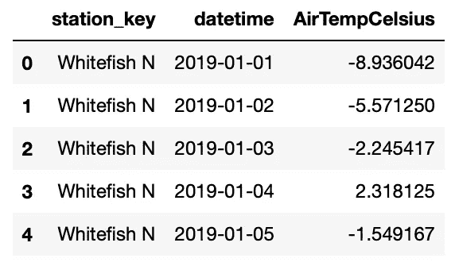

作者提供的截图。

我们可以使用以下代码进行快速的 plotly 可视化，该可视化展示了两个气象站的温度记录随时间的变化：

```py
# Temperature Patterns - Weather Stations:
plot = px.scatter(df, x='datetime',
                  y='AirTempCelsius',
                  color='station_key')
plot.update_layout(
    title={'text': "Temperature Recordings over Time\
                    <br><sup>Whitefish N, MT and Harding Cutoff,\
                    SD Weather Stations</sup>",
           'xanchor': 'left',
           'yanchor': 'top',
           'x': 0.1},
    xaxis_title='',
    yaxis_title='Temperature in Celsius',
    legend_title_text='Weather Station:')
plot.show()
```

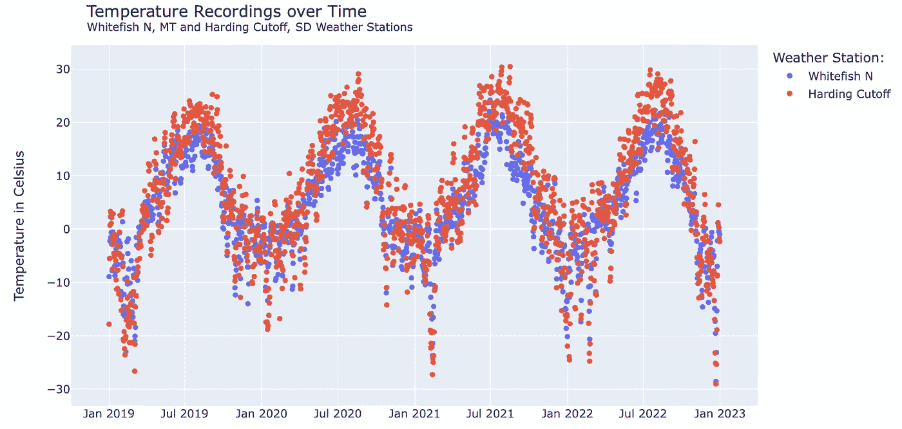

作者截图。

这是一个很好的开始，展示了季节性对观察温度的影响；下降是冬季，峰值是夏季。其他可能性包括观察温度的直方图：

```py
# Generate plot:
plot = px.histogram(df, x='AirTempCelsius',
                    color='station_key', barmode='overlay')
plot.update_layout(
    title={'text': "Number of Occurrences of Each Temperature (Celsius)\
                    <br><sup>Whitefish N, MT and Harding Cutoff, SD\
                    Weather Stations</sup>",
           'xanchor': 'left',
           'yanchor': 'top',
           'x': 0.1},
    xaxis_title='Temperature in Celsius',
    yaxis_title='Count',
    legend_title_text='Weather Station:')
plot.show()
```

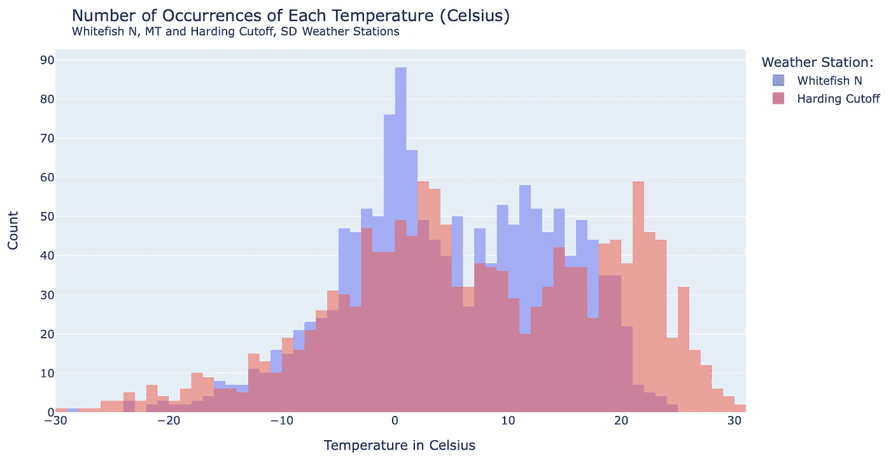

作者截图。

更多图表是可能的，基本的统计分析也可以进行，分析观察到的温度总体以及按站点分类。然而，**将这种数据探索提升到下一个层次需要额外的特征提取。**

# 2. 扩展时间列

让我们重新审视“datetime”列。以一个随机日期示例来看，这一列包含的日期信息格式为：2019–04–22，或年、月、日。这一列中包含了相当多的数据。以下是它如何拆解的可视化：

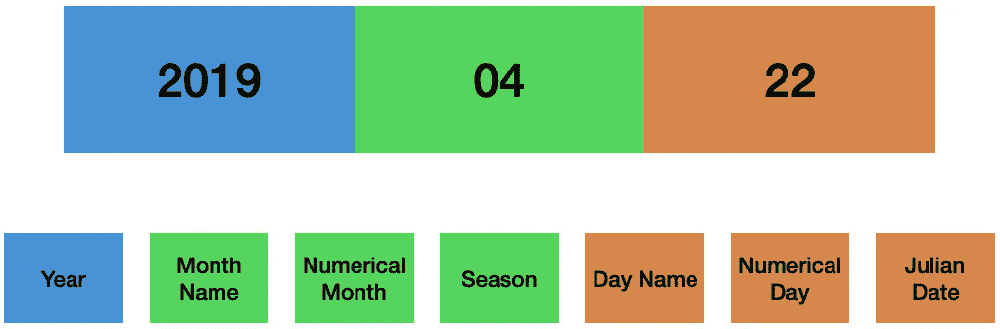

作者创建的图示。

拆分“datetime”列可以在数据框中创建 7 列新数据，但还有更多可能性，可以根据特定的数据集和领域进行定制。例如，日期可以细分为周末与工作日或假期的数据。这类信息对于零售数据集中的分析师了解客户行为可能非常有用。由于本示例中使用的数据是天气数据，因此季节性很重要。

通过 Pandas 的 datetime 功能访问所有这些数据相当简单。第一步是确保“datetime”列格式正确，可以使用以下代码：

```py
# Set datetime column as pandas datetime data:
df['datetime'] = pd.to_datetime(df['datetime'])
```

从“datetime”列中提取附加特征有几种方法：

1.  通过直接使用 Pandas dt。

1.  通过使用 Pandas dt 将附加特征拆分为新列。

## 2.1. 从日期和时间列直接访问元素

这是直接访问和转换时间数据的一个示例：

```py
print("Dataframe 'datetime' Column Value:", df['datetime'][0])
print("Extracting Day Number:", df['datetime'].dt.day[0])
print("Extracting Day Name:", df['datetime'].dt.day_name()[0])
```

输出如下：

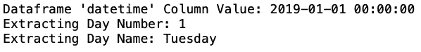

作者截图。

这是月份的一个示例：

```py
print("Dataframe 'datetime' Column Value:", df['datetime'][0])
print("Extracting Month Number:", df['datetime'].dt.month[0])
print("Extracting Month Name:", df['datetime'].dt.month_name()[0])
```

输出如下：

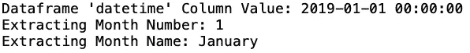

作者截图。

## 2.2. 为从日期和时间列中提取的元素创建新列

处理时间数据的另一种方法是将特定的日期时间特征提取到新列中。这会扩展数据框的维度。以下 Python 代码展示了如何创建新的列，分别表示星期几、数字日期、月份名称、数字月份和年份。最后一行创建了一个表示儒略日期的列，儒略日期是年份内的连续天数——年的第一天为 001，最后一天为 365（或在闰年中为 366）。一个儒略日历的示例[**可以通过这个链接获取**](https://www.glerl.noaa.gov/res/projects/ifyle/julian_date_calendar.html) [3]。

```py
# Day name column (example: Sunday):
df['DayName'] = df['datetime'].dt.day_name()
# Day number column:
df['Day'] = df['datetime'].dt.day
# Month name column (example: February):
df['MonthName'] = df['datetime'].dt.month_name()
# Month number column:
df['Month'] = df['datetime'].dt.month
# Year:
df['Year'] = df['datetime'].dt.year
# Julian date:
df['JulianDate'] = df['datetime'].dt.strftime('%j')
```

还有一件事要做，那就是创建一个季节列。**这是一个很好的例子，说明了解数据、客户以及与数据相关的领域知识是多么重要。** 在季节的情况下，有两种日历定义：气象学定义和天文学定义[4]。气象学家将每个季节定义为从某个月的 1 号开始的三个月时间段，而天文学季节则从不与月份开始一致的日历日期开始。

在这个例子中，分析天气数据需要使用气象学日历。然而，如果数据集涉及到的是消费者购买情况，那么天文学季节可能更合适。这是一个基于气象学日历创建季节列的 if-else 列表推导的示例：

```py
# Classify seasons:
df['Season'] = ['Winter' if x == 'December' else
                'Winter' if x == 'January' else
                'Winter' if x == 'February' else
                'Spring' if x == 'March' else
                'Spring' if x == 'April' else
                'Spring' if x == 'May' else
                'Summer' if x == 'June' else
                'Summer' if x == 'July' else
                'Summer' if x == 'August' else
                'Fall' if x == 'September' else
                'Fall' if x == 'October' else
                'Fall' if x == 'November' else
                'NaN' for x in df['MonthName']]
```

这会产生以下数据框：

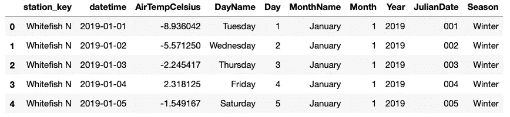

作者截屏。

尽管 10 列可能仍然被视为低维度的数据框，但这与起始点的 3 列相比变化很大。但这些新的时间特征能够实现什么呢？下一节将展示一些可能性。

# 3\. 利用新的时间特征

让我们重新审视第一部分中温度随时间变化的原始图。这里是一个示例代码块，展示了一个站点（Whitefish North）随时间变化的情况，其中季节用不同的颜色表示：

```py
# Show one station with seasons plotted:
plot = px.scatter(df[df['station_key'] == 'Whitefish N'],
                  x='datetime', y='AirTempCelsius', color='Season',
                  color_discrete_sequence=["#3366cc", "#109618", "#d62728",
                  "#ff9900"])
plot.update_layout(
    title={'text': "Temperature Patterns by Season\
                    <br><sup>Data from Whitefish N, MT Weather Station</br>",
           'xanchor': 'left',
           'yanchor': 'top',
           'x': 0.1},
    xaxis_title='',
    yaxis_title='Temperature in Celsius',
    legend_title_text='Season:')
plot.show()
```

结果图表为：

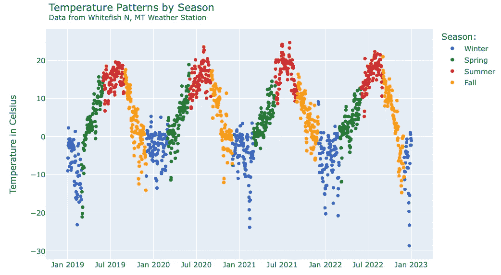

作者截屏。

新的时间特征迅速显示了季节如何与观测温度的变化相关联。季节列的增加已经证明是有用的，但重新审视第一部分中的直方图更为有趣。下面的更新代码将季节作为 plotly express 直方图中 facet_row 的值：

```py
# Generate plot:
plot = px.histogram(df, x='AirTempCelsius', color='station_key',
                    barmode='overlay', facet_row='Season')
plot.update_layout(title={'text': "Temperature Recordings, 2019 to 2022\
                                  <br><sup>Whitefish N, MT and Harding \
                                  Cutoff, SD Weather Stations</sup>",
                          'xanchor': 'left',
                          'yanchor': 'top',
                          'x': 0.1}, legend_title_text='Month',
                   xaxis_title='Recorded Temperature')
plot.update_layout(legend_title_text='Weather Station:')
plot.update_yaxes(title="")
plot.for_each_annotation(lambda a: a.update(text=a.text.split("=")[-1]))
plot.show()
```

结果为：

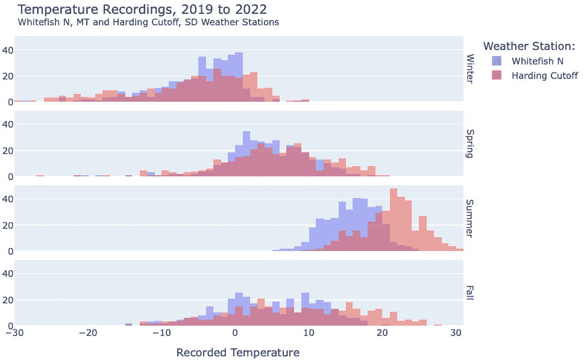

作者截屏。

向数据框引入新的时间特征增强了比较两个气象站温度分布的能力。在这种情况下，两个气象站在夏季出现了明显的分歧。

这是另一个示例——假设气象学家有兴趣按儒略日期比较两个气象站在 2020 年夏季的情况。以下是如何使用新特征可视化温度记录：

```py
# Prep Data:
df1 = df[df['Year'] == 2020]
df1.sort_values(by=['JulianDate'], inplace=True)

# Generate plot:
plot = px.line(df1[df1['Season'] == 'Summer'],
               y="AirTempCelsius", x="JulianDate", color="station_key",
               color_discrete_sequence=["#3366cc", "#d62728"])
plot.update_layout(title={'text': "Summer Temperature Recordings, 2020\
                                  <br><sup>Whitefish N, MT and Harding \
                                  Cutoff, SD Weather Stations</sup>",
                          'xanchor': 'left',
                          'yanchor': 'top',
                          'x': 0.1}, legend_title_text='Month',
                   xaxis_title='Julian Date',
                   yaxis_title='Temperature in Degrees Celsius')
plot.update_layout(legend_title_text='Weather Station:')
plot.show()
```

图表如下：

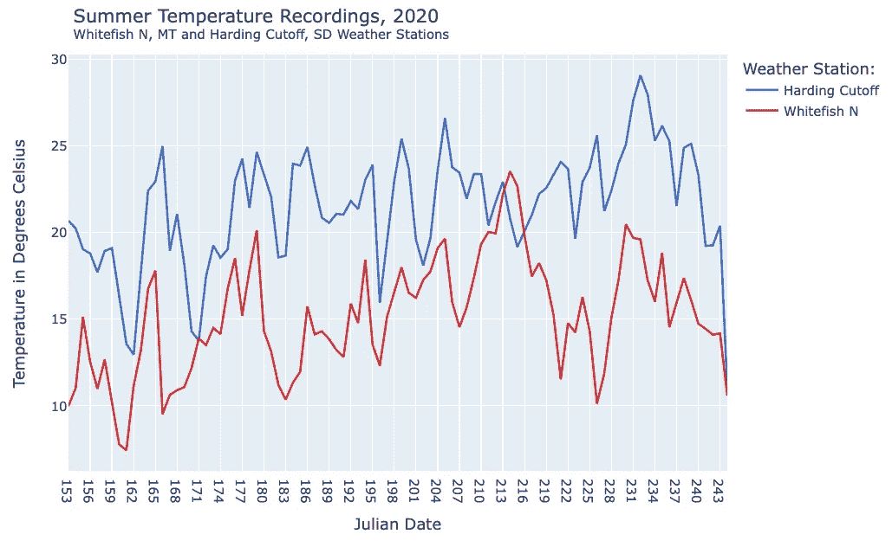

作者截屏。

附加的时间特征使分析师能够快速回答狭窄范围的问题；注意 Harding Cutoff 站点的 2020 年夏季温度通常高于 Whitefish N，直到在季节的后半段发生异常交叉。

## 3.1\. 直接使用原始日期和时间列

回顾第二部分，我们讨论了直接访问额外的日期和时间特征与将其提取到新列中的区别。上述图表“2020 年夏季温度记录”可以通过在 plotly 图表代码中的原始“datetime”列上使用 Pandas dt 函数来复现。

```py
# Generate Plot:
plot = px.line(df[(df.datetime.dt.year == 2020) &
                  ((df.datetime.dt.month == 6) |
                   (df.datetime.dt.month == 7) |
                   (df.datetime.dt.month == 8))],
               x=df[(df.datetime.dt.year == 2020) &
                    ((df.datetime.dt.month == 6) |
                     (df.datetime.dt.month == 7) |
                     (df.datetime.dt.month == 8))].datetime.dt.strftime('%j'),
               y=df[(df.datetime.dt.year == 2020) &
                    ((df.datetime.dt.month == 6) |
                     (df.datetime.dt.month == 7) |
                     (df.datetime.dt.month == 8))].AirTempCelsius,
               color="station_key",
               color_discrete_sequence=["#d62728", "#3366cc"])
plot.update_layout(title={'text': "Summer Temperature Recordings, 2020\
                                  <br><sup>Whitefish N, MT and Harding \
                                  Cutoff, SD Weather Stations</sup>",
                          'xanchor': 'left',
                          'yanchor': 'top',
                          'x': 0.1}, legend_title_text='Month',
                   xaxis_title='Julian Date',
                   yaxis_title='Temperature in Degrees Celsius')
plot.update_layout(legend_title_text='Weather Station:')
plot.show()
```

这会导致完全相同的图表：

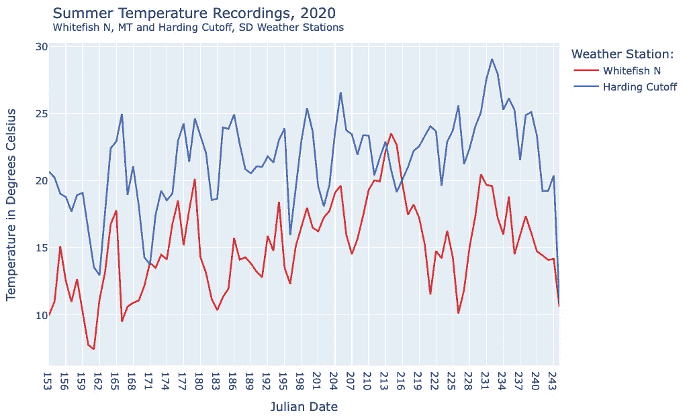

截图由作者提供。

这种技术的优势在于它不需要增加数据框的维度，对于非常大的数据集，这可以帮助减少计算负担，并防止数据框变得过大而难以处理。这种技术也适用于需要有限使用额外时间特征的狭窄分析问题。

缺点是需要大量代码来格式化和提取可视化函数中的特定特征。这可能会影响代码的可解释性和可重复性。可能还有与内联 Pandas dt 操作不兼容的函数或代码。

# 4\. 结论

数据框中的时间列通常包含许多潜在特征，这些特征可以改善低维数据的分析和可视化输出。提取这些时间特征可以增加数据框的维度，从而解锁新的、有用的分析可能性。

有关更多示例可视化和完整代码，[Jupyter 笔记本和 csv 文件可以在这个链接的 Github 页面上找到](https://github.com/kurtklingensmith/ExpandingTime)。

## 参考文献：

[1] 蒙大拿大学，[蒙大拿气候办公室](https://www.umt.edu/climate/) (2023)。

[2] 蒙大拿州 Mesonet 数据，[蒙大拿州 Mesonet 数据下载器](https://shiny.cfc.umt.edu/mesonet-download/) (2023)。

[3] NOAA 大湖区环境研究实验室 — 安娜堡，美国，[Julian 日期日历](https://www.glerl.noaa.gov/res/projects/ifyle/julian_date_calendar.html) (2023)。

[4] NOAA，[气象季节与天文季节](https://www.ncei.noaa.gov/news/meteorological-versus-astronomical-seasons) (2016)。
