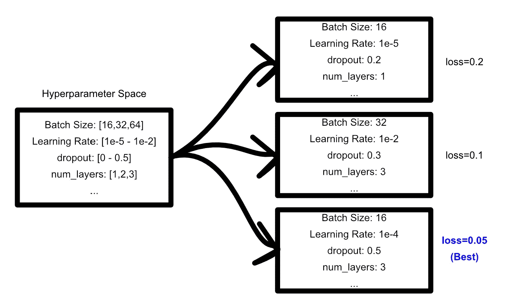
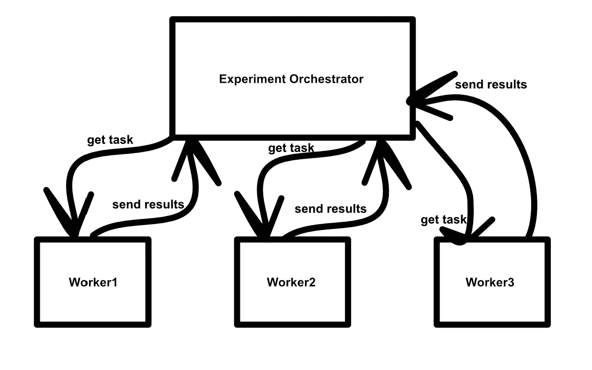
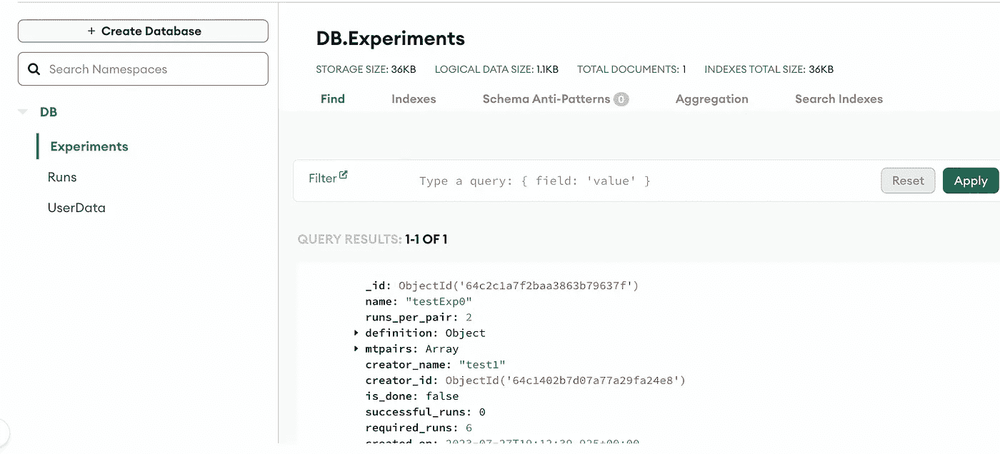
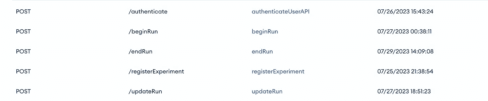
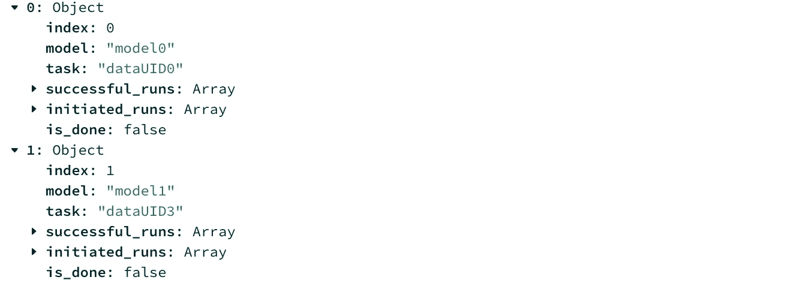
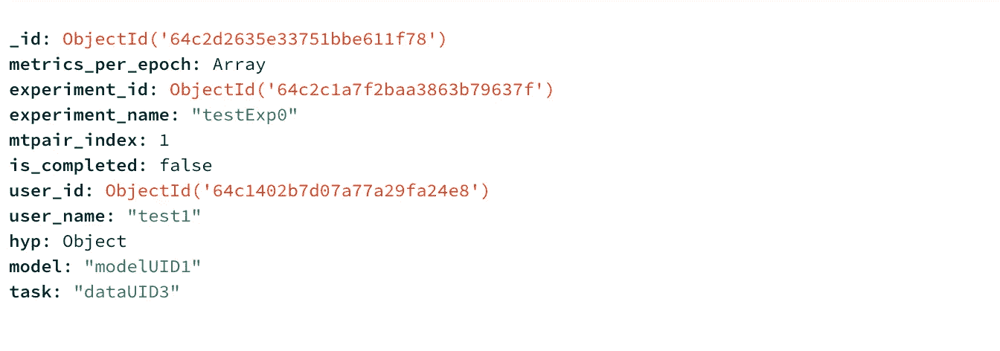

# 从零开始的实验编排

> 原文：[`towardsdatascience.com/experiment-orchestration-from-scratch-4a9e460944d8`](https://towardsdatascience.com/experiment-orchestration-from-scratch-4a9e460944d8)

## 开发自定义实验编排器以解决复杂建模问题。

[](https://medium.com/@danielwarfield1?source=post_page-----4a9e460944d8--------------------------------)[](https://towardsdatascience.com/?source=post_page-----4a9e460944d8--------------------------------) [Daniel Warfield](https://medium.com/@danielwarfield1?source=post_page-----4a9e460944d8--------------------------------)

·发布于[Towards Data Science](https://towardsdatascience.com/?source=post_page-----4a9e460944d8--------------------------------) ·9 分钟阅读·2023 年 7 月 31 日

--


由 Daniel Warfield 使用 p5.js 进行编排。除非另有说明，否则所有图像均由作者创建。

在这篇文章中，我们将探讨为什么实验编排很重要，现有的编排解决方案，如何使用 MongoDB 构建自己的编排器，以及在某些用例中这样做的好处。

**这对谁有用？** 任何试图将模型拟合到数据上的人；因此需要一种组织这些实验的方法。

**这篇文章有多先进？** 编排的想法相当简单，几乎任何技能水平的人都能理解。这个例子应该对尝试拓展领域的后端开发人员或数据科学家有用。

**前提条件：** 对核心网络原理（如数据库和服务器）以及核心数据科学概念（如超参数）的基本理解。

**代码：** 完整代码可以在[这里](https://github.com/DanielWarfield1/TabularExperimentTracker)找到。注意：在撰写本文时，这个仓库仍在开发中。

# 什么是实验编排？

所谓“实验编排”，指的是许多任务，尽管它们有相同的基本概念。最常见的实验编排形式是超参数搜索：在给定一系列超参数值的情况下，你希望在这些值中进行搜索，找到适用于特定建模问题的最佳超参数集合。这些计划实验的组织通常被称为编排。



一个超参数搜索的例子。定义一个超参数的空间。然后，从这个超参数空间中提取特定的超参数集合，并以某种方式进行测试。然后可以识别出最佳的超参数组合。

简单的实验大多数情况下能完成任务，但随着建模问题的复杂性增加，通常需要更复杂的实验。你可能会发现自己需要在多个数据集上试验多种模型类型，每种模型都有自己的超参数空间。

例如，我目前正在研究不同建模策略在非同质建模应用中的表现。我不是在寻找“解决特定问题的最佳超参数集合”，而是“多种模型类型，每种模型都有其自己的超参数空间，在多个分类和回归任务中的表现如何”。

实验编排器的目标是作为实验的中心枢纽，无论实验定义多么复杂，使得单个工作人员或一组工作人员可以运行实验的子集。



实验编排器的目标是使工作人员知道需要做什么，并允许工作人员记录结果。

我们将使用 MongoDB Data Services 来存储结果，并使用 MongoDB Application Services 作为承载系统逻辑和网络的服务器来构建类似的系统。尽管这非常强大，但也非常简单；我在一个周末就把整个系统搞定了。

# 现存的解决方案

[Weights and Biases](https://wandb.ai/site) 是一个明显的选择。

对于[W&B Sweeps](https://wandb.ai/site/sweeps)，你需要定义一个实验，一个代理（训练和验证代码），并在代理运行时记录结果。这些步骤都相当直接，类似于这样：

1.  定义一个实验

```py
"""
Telling W&B what hyperparameter space I want to explore
"""
parameters_dict = {
    'optimizer': {
        'values': ['adam', 'sgd']
        },
    'fc_layer_size': {
        'values': [128, 256, 512]
        },
    'dropout': {
          'values': [0.3, 0.4, 0.5]
        },
    }

sweep_config['parameters'] = parameters_dict
```

2\. 定义一个代理

```py
"""
defining a model which works based off of the hyperparmeters
"""
#gets a configuration from the orchestrator
config = wandb.config

loader = build_dataset(config.batch_size)
network = build_network(config.fc_layer_size, config.dropout)
optimizer = build_optimizer(network, config.optimizer, config.learning_rate)
```

3\. 记录结果

```py
"""
training a model and logging the results
"""
for epoch in range(config.epochs):
  avg_loss = train_epoch(network, loader, optimizer)
  wandb.log({"loss": avg_loss, "epoch": epoch}) 
```

这对于 90%的使用案例是足够的，通常是实验编排的推荐方法。然而，这种方法不适用于我的使用案例。接下来的部分将介绍我的解决方案。

# 自建编排器的理由

对于 90%的应用程序（尤其是商业应用），上述方法通常已经足够。依赖现有系统意味着依赖其超越任何可行的粗糙解决方案的稳健性和功能成熟度。

也就是说，像 W&B 这样的系统似乎被设计用于寻找“解决方案”。它们在假设你有一个特定数据集并希望探索解决方案，以找到适合该数据集的最佳解决方案的目标下运行。对我而言，以及我的研究需求，管理多个数据集、多个模型及其之间的兼容性，在 W&B 中令人感到非常麻烦。


方孔中的圆钉。在软件中，设计上的轻微不一致常常会在之后引发严重问题。这就是为什么在某些应用中，重新制作技术可能比与现有实现集成更容易，即使原始的“基本上”适用。

使用 W&B 时，似乎我需要通过某种方式组织和管理多个数据集上的多个搜索，从而构建一个协调器的协调器。在一个已经很复杂的任务基础上，我还需要处理集成问题。正是在这一点上，我决定从头开始构建 W&B 搜索，并进行一些小的修改，以满足我的需求，这将是最合适的选择。

# 在一个周末构建一个自定义协调器

我为我的特定问题实现了一个协调器。虽然解决方案是特定于问题的，但一般思路应该对大多数机器学习实验需求是灵活的。

## 定义问题

我有大约 45 个表格数据集，涵盖了各种领域。这些数据集中的每一个都可以被视为一个“任务”，任何给定的模型可能会表现良好或不佳。有些任务可能是回归任务，而其他任务可能是分类任务。

一般思路是构建一个协调器，该协调器可以管理一组模型对一组数据集的应用。这个协调器应该汇总这些结果以便进一步分析。

同样，自然地，这个协调器的目标是解决问题，而不是成为问题。想法是在解决我遇到的问题时，尽可能简化某些方面。因此，这个解决方案非常简陋，有点像是小修小补。

## 技术选择

对于这个解决方案，我使用了 MongoDB 应用服务和 MongoDB 数据服务，或者叫什么都无所谓。MongoDB 在过去一年中经历了很多品牌重塑。我使用的系统曾经叫做 MongoDB Atlas 和 Realm，但现在 Realm 可能是 Atlas 的一部分？我不太确定。

尽管如此，云上的 MongoDB 本质上是一个“盒子中的后端”。你可以非常迅速地设置数据库、应用层和 API 层，几乎没有额外开销。在我的经验中，由于文档混乱，使得将东西准备好生产环境可能是一场艰苦的战斗。然而，对于快速原型开发后端资源，我还未找到更好的替代方案。

接下来的几个部分描述了我如何将协调问题拆解成实验和运行，以及这些在实际中是什么样的。



数据库的屏幕截图，包括“实验”、“运行”和“用户数据”集合



一个允许与协调器通信的简单 HTTP API

## 定义实验

在这种自定义方法中，我基本上借用了 W&B 的搜索设计，并加入了一些自己的想法。核心系统运行在一个“实验”上，该实验描述了模型、超参数空间、数据集以及这三者如何关联在一起。

```py
"""
An example of an experiment definition. Each "experiment" has three key fields:
 - data_groups: groups identifiers of datasets
 - model_groups: groups identifiers of models
 - applications: which model_groups should apply to which data_groups

This approach thinks of a model as two things:
 - a unique identifier, which references some model definition
 - a hyperparameter space associated with that model.

"runs_per_pair" defines how often a certain association should be run. For
instance "test model X's hyperparameters on dataset Y 10 times".
"""

{
    "name": "testExp0",
    "runs_per_pair": "10",
    "definition": {
        "data_groups": {
            "group0": [
                "dataUID0",
                "dataUID1",
                "dataUID2"
            ],
            "group1": [
                "dataUID3",
                "dataUID4",
                "dataUID5"
            ]
        },
        "model_groups": {
            "model0": {
                "model": "modelUID0",
                "hype": {
                    "learning_rate": {"distribution": "log_uniform", min:0.0, max:2.5},
                    "layers": {"distribution":"int_uniform", min:0, max:2}
                }
            },
            "model1": {
                "model": "modelUID1",
                "hype": {
                    "learning_rate": {"distribution": "log_uniform", min:0.0, max:2.5}
                }
            }
        },
        "applications": {
            "group0": [
                "model0"
            ],
            "group1": [
                "model0",
                "model1"
            ]
        }
    }
}
```

这个实验随后被拆解为一个任务列表：一些工人需要执行的独立探索。这些通过查看所有关联并列出所有模型/数据集对来完成。



每个任务在实现中称为 mtpair（模型-任务对）。这跟踪模型、任务（一个数据集）以及所有成功和完成的 mtpair 运行。此图像包含 2 个 mtpair。

这一切都是通过调用 **“/registerExperiment”** API 端点并传递模型定义来创建的。

我选择将实验设置为“声明式”，有点像你熟悉的 terraform 脚本。当你注册一个实验时，你要么创建一个新的实验，要么根据实验名称获取一个现有的实验。这样，你可以在多个工作者上使用相同的脚本。第一个工作者将创建实验，而其他工作者将简单地使用已经创建的实验。（或者，至少是这个想法。你需要小心这种思路下的竞争条件。）

# 运行

现在实验已经定义好，以及需要运行的各个模型/任务对，我们可以开始运行。这是调度器的实际操作部分。我们必须：

1.  决定工作者应该处理哪个模型/任务对

2\. 从该模型的超参数空间中获取供工作者使用的超参数

3\. 记录正在进行的结果

4\. 管理已完成的运行（将可能失败的运行分开）。

“运行”构造存在于调度器中，以记录这些信息。



“运行”集合中的一个运行示例

一个运行直接与一个模型/任务对（mtpair）、该 mtpair 所在的实验、谁创建了实验、模型、任务、特定的超参数空间点以及按每个纪元记录的结果相关联。这是通过 **“/beginRun”**、**“/updateRun”** 和 **“/endRun”** 端点完成的。

**/beginRun** 查看所有现有的运行，并在完成和启动的运行最少的 mtpair 上创建一个新的运行。**/beginRun** 在决定优先处理哪个模型-任务对之后，使用随机搜索将该模型的超参数空间转化为一组具体的超参数。然后，它会传递一个处理程序来处理该运行。

**/updateRun** 允许你按每个纪元注册指标。每个纪元，你调用 **/updateRun** 并传递一个包含该运行指标的字典。这些可以是用户认为合适的任何内容。

**/endRun** 做了一些提升生活质量的事情。结束的运行无法继续，因此它允许代码声明运行已经完成。它还会更新实验中运行的记录，并将运行标记为成功完成。意外失败的运行不会被标记为结束，因此实现这个 webhook 使调度器能够容忍故障工作者。

# 安全

这个系统使用 JSON Web Tokens (JWTs)来创建一些基础的身份验证。从研究的角度来看，这样一个项目的风险配置相当低。尽管如此，这个系统确实会根据每个用户验证 API 令牌，并提供一些安全措施以确保数据完整性，同时允许协作。

此外，在钱包的安全性方面，我使用了免费套餐，并且设置时不需要注册支付方式。（MongoDB 云服务有些古怪，但在原型设计上确实非常惊人）

# 就这些了！

通常我会包含代码，但这是一个完整的代码库，放在文章里有些繁琐。如果你想查看代码库，可以点击[这里](https://github.com/DanielWarfield1/TabularExperimentTracker)。具体来说，你可以查看[函数定义](https://github.com/DanielWarfield1/TabularExperimentTracker/tree/master/functions)，这些定义基本上就是整个内容的精华。

# 更新

+   我添加了一个名为**beginRunSticky**的 webhook，它开始一个新的运行，但接受一个要“粘贴”的数据集。它优先给工人分配一个具有指定任务的新运行，从而允许多个运行执行而无需加载新的数据集。

# 关注以获取更多！

在未来的帖子中，我还将描述机器学习领域的几篇重要论文，重点放在实际和直观的解释上。

**署名：** 本文档中的所有图片均由**丹尼尔·沃菲尔德**创建，除非另有来源说明。你可以在自己的非商业用途上使用本文中的任何图片，只要引用了这篇文章，[`danielwarfield.dev`](https://danielwarfield.dev/)，或两者兼而有之。
