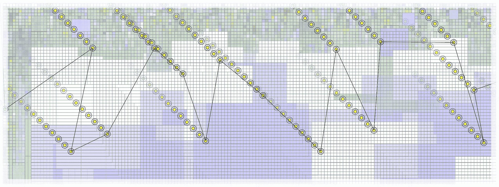

# 从零开始的实验协调

> 原文：[`towardsdatascience.com/experiment-orchestration-from-scratch-4a9e460944d8?source=collection_archive---------8-----------------------#2023-07-31`](https://towardsdatascience.com/experiment-orchestration-from-scratch-4a9e460944d8?source=collection_archive---------8-----------------------#2023-07-31)

## 开发一个自定义实验协调器来解决复杂的建模问题。

 [Daniel Warfield](https://medium.com/@danielwarfield1?source=post_page-----4a9e460944d8--------------------------------)

·

[关注](https://medium.com/m/signin?actionUrl=https%3A%2F%2Fmedium.com%2F_%2Fsubscribe%2Fuser%2Fbdc4072cbfdc&operation=register&redirect=https%3A%2F%2Ftowardsdatascience.com%2Fexperiment-orchestration-from-scratch-4a9e460944d8&user=Daniel+Warfield&userId=bdc4072cbfdc&source=post_page-bdc4072cbfdc----4a9e460944d8---------------------post_header-----------) 发表在 [Towards Data Science](https://towardsdatascience.com/?source=post_page-----4a9e460944d8--------------------------------) ·9 min read·Jul 31, 2023

--

由 Daniel Warfield 使用 p5.js 进行的协调。所有图像均由作者创建，除非另有说明。

在这篇文章中，我们将探讨为什么实验协调很重要、现有的协调解决方案、如何使用 MongoDB 构建自己的协调器，以及在某些用例中这可能带来的好处。

**这对谁有用？** 任何试图将模型拟合到数据中的人；因此需要一种组织这些实验的方法。

**这篇文章的难度如何？** 协调的概念相当简单，几乎适合任何技能水平的人。示例应对后台开发人员或试图拓展的数据科学家是可以接受的。

**前提条件：** 需要对核心网络原理有一定了解，比如数据库和服务器，以及核心数据科学概念，如超参数。

**代码：** 完整代码可以在[这里](https://github.com/DanielWarfield1/TabularExperimentTracker)找到。注意：在撰写本文时，这个仓库仍在开发中。

# 什么是实验编排？

所谓“实验编排”是指包含相同一般概念的许多任务。最常见的实验编排形式是超参数搜索：即在给定一些超参数值范围的情况下，你希望进行搜索…
